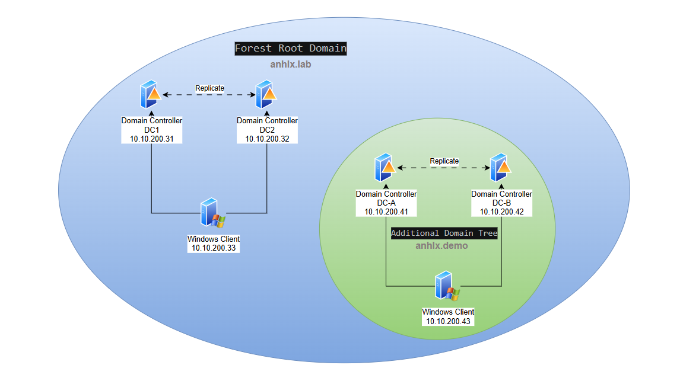

Bài viết hướng dẫn di trú (migrate) forest `anhlx.demo` (đã tồn tại) vào forest `anhlx.lab` dưới dạng **Additional Domain Tree**, sử dụng **Quest Migration Manager for Active Directory**. Phương pháp này **không cần demote**, giữ nguyên SID History, password, và gần như **zero-downtime**.

- [1. Giới thiệu](#1-giới-thiệu)
  - [Tại sao dùng Quest thay vì Demote/Promote?](#tại-sao-dùng-quest-thay-vì-demotepromote)
  - [Quy trình tổng quan](#quy-trình-tổng-quan)
- [2. Thiết kế lab](#2-thiết-kế-lab)
  - [2.1. Topology](#21-topology)
  - [2.2. Kế hoạch IP](#22-kế-hoạch-ip)
- [3. Yêu cầu trước khi bắt đầu](#3-yêu-cầu-trước-khi-bắt-đầu)
- [4. Tạo Tree Domain anhlx.demo trong forest anhlx.lab](#4-tạo-tree-domain-anhlxdemo-trong-forest-anhlxlab)
  - [4.1. Chuẩn bị DC-A-NEW](#41-chuẩn-bị-dc-a-new)
  - [4.2. Cài đặt AD DS và DNS](#42-cài-đặt-ad-ds-và-dns)
  - [4.3. Promote lên Domain Controller - New Tree](#43-promote-lên-domain-controller---new-tree)
- [5. Thiết lập Forest Trust](#5-thiết-lập-forest-trust)
  - [5.1. Cấu hình DNS giữa 2 forest](#51-cấu-hình-dns-giữa-2-forest)
  - [5.2. Tạo Two-way Forest Trust](#52-tạo-two-way-forest-trust)
  - [5.3. Kiểm tra Trust](#53-kiểm-tra-trust)
- [6. Cài đặt Quest Migration Manager](#6-cài-đặt-quest-migration-manager)
  - [6.1. Download Quest Migration Manager](#61-download-quest-migration-manager)
  - [6.2. Cài đặt trên win-2022](#62-cài-đặt-trên-win-2022)
  - [6.3. Cấu hình Migration Project](#63-cấu-hình-migration-project)
- [7. Migrate Organizational Units](#7-migrate-organizational-units)
- [8. Migrate Users và Groups](#8-migrate-users-và-groups)
  - [8.1. Migrate Users với SID History](#81-migrate-users-với-sid-history)
  - [8.2. Migrate Groups](#82-migrate-groups)
  - [8.3. Kiểm tra sau migrate](#83-kiểm-tra-sau-migrate)
- [9. Migrate Computer Accounts](#9-migrate-computer-accounts)
- [10. Cutover và Decommission forest cũ](#10-cutover-và-decommission-forest-cũ)
  - [10.1. Chuyển client sang domain mới](#101-chuyển-client-sang-domain-mới)
  - [10.2. Kiểm tra hoạt động](#102-kiểm-tra-hoạt-động)
  - [10.3. Decommission forest anhlx.demo cũ](#103-decommission-forest-anhlxdemo-cũ)
- [11. Kiểm tra kết quả cuối cùng](#11-kiểm-tra-kết-quả-cuối-cùng)
  - [11.1. Kiểm tra Forest và Domain Tree](#111-kiểm-tra-forest-và-domain-tree)
  - [11.2. Login cross-domain](#112-login-cross-domain)

---

### 1. Giới thiệu

Trong Active Directory, **không thể merge 2 forest có sẵn** thành 1 forest. Để đưa domain `anhlx.demo` vào forest `anhlx.lab` dưới dạng **Additional Domain Tree**, có 2 cách:

| Phương pháp | Mô tả | Phù hợp |
|-------------|-------|---------|
| **Demote/Promote** | Xóa forest cũ, dựng lại từ đầu | Lab nhỏ, vài user |
| **Quest Migration** | Dựng domain mới song song, migrate từng phần | **Production, mọi quy mô** |

Bài viết này sử dụng **Quest Migration Manager for Active Directory** — công cụ enterprise migration hỗ trợ:

- **Giữ nguyên SID History** — User vẫn truy cập tài nguyên cũ bình thường
- **Migrate password** — Không cần reset password
- **Đồng bộ liên tục** — Thay đổi ở domain cũ tự cập nhật sang domain mới
- **Migrate theo đợt (batch)** — Chuyển từng phòng ban để thử nghiệm
- **Rollback dễ dàng** — Domain cũ vẫn chạy song song cho đến khi xác nhận OK

#### Tại sao dùng Quest thay vì Demote/Promote?

| Tiêu chí | Demote/Promote | Quest Migration |
|----------|----------------|-----------------|
| **SID** | ❌ Mất SID gốc, phân quyền lại | ✅ Giữ SID History |
| **Password** | ❌ Reset toàn bộ | ✅ Giữ nguyên |
| **Downtime** | ❌ 30-60 phút | ✅ Gần như zero |
| **Rollback** | ❌ Rất khó | ✅ Domain cũ vẫn chạy |
| **Computer** | ❌ Rejoin toàn bộ | ✅ Tự động migrate profile |
| **Quy mô** | Vài user (lab) | Hàng nghìn+ user |

> **Lưu ý:** Quest Migration Manager for AD là phần mềm **trả phí**. Có thể dùng bản trial 30 ngày cho mục đích lab. Nếu cần giải pháp miễn phí, Microsoft cung cấp **ADMT (Active Directory Migration Tool)** với tính năng tương tự nhưng ít tự động hóa hơn.

#### Quy trình tổng quan

```
Phase 1: Chuẩn bị
  ├── Tạo tree domain anhlx.demo MỚI trong forest anhlx.lab
  └── Thiết lập Forest Trust giữa forest cũ và forest anhlx.lab

Phase 2: Migration (chạy song song, không downtime)
  ├── Cài Quest Migration Manager
  ├── Migrate OU structure
  ├── Migrate Users + Groups (kèm SID History, password)
  └── Migrate Computer accounts

Phase 3: Cutover
  ├── Chuyển client sang domain mới
  ├── Kiểm tra hoạt động ổn định
  └── Decommission forest cũ (sau vài tuần/tháng)
```

### 2. Thiết kế lab

#### 2.1. Topology



**Trước migration:**

```
Forest 1: anhlx.lab (TARGET)     Forest 2: anhlx.demo (SOURCE - sẽ bị decommission)
├── DC1  (10.10.200.31)          ├── DC-A  (10.10.200.41)
├── DC2  (10.10.200.32)          ├── DC-B  (10.10.200.42)
├── win-2022 (10.10.200.33)      └── win-02 (10.10.200.43)
│   └── Quest Migration Manager
│
└── (Sẽ thêm tree domain anhlx.demo ở đây)
```

**Sau migration:**

```
Forest: anhlx.lab (UNIFIED)
├── Tree 1: anhlx.lab (Forest Root Domain)
│   ├── DC1 (10.10.200.31) - Tree Root DC
│   ├── DC2 (10.10.200.32) - Additional DC
│   └── win-2022 (10.10.200.33) - Client + Quest Server
│
└── Tree 2: anhlx.demo (Additional Domain Tree)
    ├── DC-A (10.10.200.41) - Tree Root DC (repurposed)
    ├── DC-B (10.10.200.42) - Additional DC (repurposed)
    └── win-02 (10.10.200.43) - Client
```

#### 2.2. Kế hoạch IP

| Vai trò | Hostname | IP | DNS |
|---------|----------|----|-----|
| DC1 (anhlx.lab) | DC1 | 10.10.200.31 | 127.0.0.1, 10.10.200.32 |
| DC2 (anhlx.lab) | DC2 | 10.10.200.32 | 10.10.200.31, 127.0.0.1 |
| Quest Server + Client (anhlx.lab) | win-2022 | 10.10.200.33 | 10.10.200.31, 10.10.200.32 |
| DC-A (anhlx.demo cũ → sau repurpose) | DC-A | 10.10.200.41 | 10.10.200.31, 127.0.0.1 |
| DC-B (anhlx.demo cũ → sau repurpose) | DC-B | 10.10.200.42 | 10.10.200.41, 127.0.0.1 |
| Client (anhlx.demo) | win-02 | 10.10.200.43 | 10.10.200.41, 10.10.200.42 |

**Thông tin domain:**

| Thuộc tính | Forest Root | Source (Forest cũ) | Target (Tree domain mới) |
|------------|-------------|--------------------|-----------------------|
| Domain name | `anhlx.lab` | `anhlx.demo` (forest riêng) | `anhlx.demo` (trong forest anhlx.lab) |
| NetBIOS | `ANHLX` | `DEMO` | `DEMO` |
| Forest | `anhlx.lab` | `anhlx.demo` | `anhlx.lab` |

### 3. Yêu cầu trước khi bắt đầu

1. **Forest `anhlx.lab` đã hoạt động** — DC1, DC2 đang chạy, win-2022 đã join domain
2. **Forest `anhlx.demo` đang hoạt động** — DC-A, DC-B đang chạy, win-02 đã join domain
3. **Network thông suốt** — Tất cả các máy ping được lẫn nhau (cùng subnet 10.10.200.0/24)
4. **Tài khoản Enterprise Admin** trên cả 2 forest
5. **SQL Server Express** trên win-2022 (Quest yêu cầu database)
6. **Quest Migration Manager** installer (download trial từ quest.com)

Kiểm tra trạng thái:

```powershell
# Trên DC1 (anhlx.lab)
Get-ADForest
Get-ADDomainController -Filter *

# Trên DC-A (anhlx.demo)
Get-ADForest
Get-ADDomainController -Filter *

# Kiểm tra kết nối từ win-2022
Test-Connection DC1, DC2, DC-A, DC-B, win-02
```

### 4. Tạo Tree Domain anhlx.demo trong forest anhlx.lab

Trước khi migrate, cần tạo **domain đích** `anhlx.demo` trong forest `anhlx.lab`. Vì domain name trùng với forest cũ (`anhlx.demo`), ta phải dùng **DC mới** (không phải DC-A/DC-B đang chạy forest cũ).

> **Lưu ý:** Tạm thời sẽ có 2 domain `anhlx.demo` trên network — 1 ở forest cũ và 1 ở forest `anhlx.lab`. Điều này **không gây xung đột** nếu DNS được cấu hình đúng (mỗi DC chỉ trỏ DNS về forest của mình).

#### 4.1. Chuẩn bị DC-A-NEW

Dùng **DC1 (10.10.200.31)** tạm thời host tree domain mới, hoặc add thêm 1 VM. Trong lab này, ta sẽ **promote DC1 thêm vai trò Tree Root DC** cho `anhlx.demo` trước, sau đó khi migration xong sẽ repurpose DC-A/DC-B.

> **Cách đơn giản hơn cho lab:** Promote trực tiếp trên DC1 — DC1 sẽ vừa là DC cho `anhlx.lab`, vừa tạm thời host tree domain `anhlx.demo`. Sau khi migrate xong sẽ transfer FSMO và demote DC1 khỏi `anhlx.demo`.

Tuy nhiên, **cách chuẩn** là dùng 1 VM mới. Trong lab này ta cho DC1 promote thêm tree domain:

#### 4.2. Cài đặt AD DS và DNS

DC1 đã có AD DS role. Chỉ cần promote thêm tree domain.

#### 4.3. Promote lên Domain Controller - New Tree

Trên **DC1** (10.10.200.31), tạo tree domain `anhlx.demo` mới trong forest `anhlx.lab`:

**PowerShell:**

```powershell
Install-ADDSDomain `
    -NewDomainName "anhlx.demo" `
    -ParentDomainName "anhlx.lab" `
    -DomainType "TreeDomain" `
    -NewDomainNetbiosName "DEMO" `
    -DomainMode "WinThreshold" `
    -InstallDNS:$true `
    -CreateDnsDelegation:$true `
    -Credential (Get-Credential ANHLX\Administrator) `
    -SafeModeAdministratorPassword (ConvertTo-SecureString "P@ssw0rd123" -AsPlainText -Force) `
    -Force:$true
```

**GUI:** Server Manager → Promote → **Add a new domain to an existing forest** → Tree Domain → `anhlx.demo` → credentials `ANHLX\Administrator`.


Sau khi restart, kiểm tra:

```powershell
# Kiểm tra forest có 2 domain
(Get-ADForest).Domains
# Kết quả: anhlx.lab, anhlx.demo
```

> **Lúc này:** Forest `anhlx.lab` đã có tree domain `anhlx.demo` (trống, chưa có user/OU). Forest cũ `anhlx.demo` vẫn đang chạy bình thường. 2 hệ thống **chạy song song**.

### 5. Thiết lập Forest Trust

Tạo **Forest Trust** giữa forest cũ (`anhlx.demo`) và forest `anhlx.lab` để Quest có thể migrate object giữa 2 forest.

#### 5.1. Cấu hình DNS giữa 2 forest

Mỗi forest cần phân giải được DNS của forest kia. Thêm **Conditional Forwarder**:

```powershell
# Trên DC1 (anhlx.lab) - forward queries anhlx.demo (forest cũ) sang DC-A
Add-DnsServerConditionalForwarderZone -Name "anhlx.demo" -MasterServers 10.10.200.41

# Trên DC-A (anhlx.demo forest cũ) - forward queries anhlx.lab sang DC1
Add-DnsServerConditionalForwarderZone -Name "anhlx.lab" -MasterServers 10.10.200.31
```

> **Lưu ý:** Vì domain mới `anhlx.demo` trong forest `anhlx.lab` trùng tên DNS với forest cũ, cần cấu hình forwarder cẩn thận. DC1 đã host cả 2 zone `anhlx.lab` và `anhlx.demo` (mới), nên forwarder ở đây để DC-A phân giải `anhlx.lab`.

Kiểm tra:

```powershell
# Từ DC-A (forest cũ) phân giải anhlx.lab
nslookup anhlx.lab 10.10.200.31

# Từ DC1 phân giải anhlx.demo (forest cũ)
nslookup DC-A.anhlx.demo 10.10.200.41
```

#### 5.2. Tạo Two-way Forest Trust

Trên **DC1** (forest root `anhlx.lab`):

**GUI:** Mở **Active Directory Domains and Trusts** → right-click `anhlx.lab` → **Properties** → tab **Trusts** → **New Trust**:

1. Trust Name: `anhlx.demo`
2. Trust Type: **Forest trust**
3. Direction: **Two-way**
4. Sides of Trust: **Both this domain and the specified domain**
5. Authentication Level: **Forest-wide authentication**
6. Nhập credentials `DEMO\Administrator` (admin forest cũ)
7. Confirm → OK


**PowerShell** (trên DC-A, forest cũ):

```powershell
netdom trust anhlx.demo /domain:anhlx.lab /twoway /add /UserD:ANHLX\Administrator /PasswordD:*
```

#### 5.3. Kiểm tra Trust

```powershell
# Trên DC1
Get-ADTrust -Filter *
netdom trust anhlx.lab /domain:anhlx.demo /verify

# Trên DC-A
Get-ADTrust -Filter *
netdom trust anhlx.demo /domain:anhlx.lab /verify
```

### 6. Cài đặt Quest Migration Manager

#### 6.1. Download Quest Migration Manager

Download từ [quest.com](https://www.quest.com/products/migration-manager-for-active-directory/) — bản trial 30 ngày.

Yêu cầu:
- Windows Server 2016+ hoặc Windows 10/11
- .NET Framework 4.7.2+
- SQL Server Express (có thể cài kèm)
- Tài khoản admin trên cả source và target domain

#### 6.2. Cài đặt trên win-2022

Đăng nhập `ANHLX\Administrator` trên **win-2022** (10.10.200.33):

1. Chạy installer **Quest Migration Manager for AD**
2. Chọn **Complete Installation** (bao gồm Console + Agent)
3. Cài **SQL Server Express** nếu chưa có (wizard sẽ hỏi)
4. Hoàn tất cài đặt → restart nếu cần


#### 6.3. Cấu hình Migration Project

Mở **Quest Migration Manager for AD Console**:

1. **File** → **New Project**
2. Project Name: `anhlx.demo-migration`
3. **Source Forest:** `anhlx.demo` (forest cũ)
   - Credentials: `DEMO\Administrator`
4. **Target Forest:** `anhlx.lab`
   - Target Domain: `anhlx.demo` (tree domain mới trong forest anhlx.lab)
   - Credentials: `ANHLX\Administrator`
5. **Migration Options:**
   - ✅ Migrate SID History
   - ✅ Migrate Passwords
   - ✅ Enable Directory Synchronization (đồng bộ liên tục)
6. **Test Connectivity** → All green → **Create Project**


> **Quan trọng:** Để migrate SID History, cần bật **Auditing** trên source domain:
>
> ```powershell
> # Trên DC-A (source)
> auditpol /set /subcategory:"Directory Service Access" /success:enable /failure:enable
> ```
>
> Và đảm bảo **SID Filtering** bị tắt trên trust:
>
> ```powershell
> # Trên DC1 (target forest)
> netdom trust anhlx.lab /domain:anhlx.demo /quarantine:No
> ```

### 7. Migrate Organizational Units

Trong Quest Console, migrate cấu trúc OU trước:

1. Chọn tab **Directory** → **Source Domain** `anhlx.demo`
2. Expand cây OU → Chọn tất cả OU cần migrate
3. Right-click → **Migrate**
4. Target: `anhlx.demo` (domain mới trong forest `anhlx.lab`)
5. ✅ **Preserve OU structure**
6. Click **Migrate**


Kiểm tra trên target:

```powershell
# Trên DC1, query domain anhlx.demo mới
Get-ADOrganizationalUnit -Filter * -Server "DC1.anhlx.demo"
```

### 8. Migrate Users và Groups

#### 8.1. Migrate Users với SID History

1. Trong Quest Console → tab **Accounts** → chọn Users từ source `anhlx.demo`
2. Chọn tất cả user (hoặc chọn theo OU/batch)
3. Right-click → **Migrate**
4. Target domain: `anhlx.demo` (trong forest `anhlx.lab`)
5. Options:
   - ✅ **Migrate SID History** — User mới giữ SID cũ trong SID History
   - ✅ **Migrate Passwords** — Giữ nguyên password
   - ✅ **Migrate User Profile** (nếu cần)
   - Target OU: map OU tương ứng
6. Click **Migrate**


Quest sẽ:
- Tạo user mới trong target domain
- Copy tất cả attributes (name, email, department, title...)
- Thêm SID cũ vào **SID History** của user mới
- Migrate password (nếu PES đã cấu hình)

#### 8.2. Migrate Groups

1. Tab **Groups** → chọn tất cả group từ source
2. Right-click → **Migrate**
3. Options:
   - ✅ **Migrate SID History**
   - ✅ **Update group membership** — Tự động add user đã migrate vào group
4. Click **Migrate**

#### 8.3. Kiểm tra sau migrate

```powershell
# Kiểm tra user đã migrate (trên target domain)
Get-ADUser -Filter * -Server "DC1.anhlx.demo" -Properties SIDHistory |
    Select-Object Name, SamAccountName, SID, SIDHistory

# Kiểm tra groups
Get-ADGroup -Filter * -Server "DC1.anhlx.demo" |
    Where-Object { $_.DistinguishedName -notmatch 'CN=Builtin,' } |
    Select-Object Name, SamAccountName

# Kiểm tra group membership
Get-ADGroupMember -Identity "TenGroup" -Server "DC1.anhlx.demo"
```

Kết quả mong đợi: User mới có cả **SID mới** (thuộc domain mới) và **SID History** (SID cũ từ domain cũ). Nhờ SID History, user truy cập được tài nguyên đã phân quyền theo SID cũ mà không cần cấp lại quyền.

### 9. Migrate Computer Accounts

Quest hỗ trợ migrate computer account — máy tính sẽ tự động unjoin domain cũ và join domain mới:

1. Tab **Computers** → chọn computer `win-02` từ source
2. Right-click → **Migrate**
3. Options:
   - ✅ **Migrate computer account**
   - ✅ **Translate user profiles** — Cập nhật profile trên máy (desktop, registry...) sang user mới
   - ✅ **Reboot after migration**
4. Click **Migrate**


Quest Agent trên `win-02` sẽ:
- Unjoin khỏi domain cũ `anhlx.demo` (forest cũ)
- Join vào domain mới `anhlx.demo` (trong forest `anhlx.lab`)
- Translate user profile → user login vào vẫn thấy desktop, file, browser data như cũ
- Reboot máy

> **Lưu ý:** Nếu không dùng Quest migrate computer, có thể migrate thủ công:
>
> ```powershell
> # Trên win-02 — unjoin domain cũ
> Remove-Computer -UnjoinDomainCredential (Get-Credential DEMO\Administrator) -WorkgroupName "WORKGROUP" -Restart
>
> # Sau restart — cấu hình DNS trỏ về DC mới và join domain mới
> Set-DnsClientServerAddress -InterfaceAlias "Ethernet0" -ServerAddresses 10.10.200.41, 10.10.200.42
> Add-Computer -DomainName "anhlx.demo" -Credential (Get-Credential DEMO\Administrator) -Restart
> ```

### 10. Cutover và Decommission forest cũ

#### 10.1. Chuyển client sang domain mới

Sau khi migrate tất cả user, group, computer → kiểm tra hoạt động ổn định trong vài ngày/tuần.

Đảm bảo:
- ✅ User đăng nhập được trên domain mới
- ✅ Truy cập file share, ứng dụng nội bộ bình thường (nhờ SID History)
- ✅ GPO hoạt động đúng
- ✅ Printer, email, các dịch vụ khác không bị ảnh hưởng

#### 10.2. Kiểm tra hoạt động

```powershell
# Kiểm tra domain mới
Get-ADForest | Select-Object Name, Domains, ForestMode
(Get-ADForest).Domains

# Kiểm tra user count
(Get-ADUser -Filter * -Server "DC1.anhlx.demo").Count

# Kiểm tra trust
Get-ADTrust -Filter *

# Kiểm tra replication (nếu đã promote thêm DC)
repadmin /replsummary
```

#### 10.3. Decommission forest anhlx.demo cũ

Sau khi xác nhận mọi thứ hoạt động ổn định (**khuyến nghị chờ 2-4 tuần**):

**Bước 1:** Xóa Forest Trust (không còn cần thiết)

```powershell
# Trên DC1 (anhlx.lab)
Remove-ADTrust -Target "anhlx.demo" -Confirm:$false
```

**Bước 2:** Demote DC-B (forest cũ)

```powershell
# Trên DC-B
Uninstall-ADDSDomainController `
    -Credential (Get-Credential DEMO\Administrator) `
    -LocalAdministratorPassword (ConvertTo-SecureString "P@ssw0rd123" -AsPlainText -Force) `
    -Force:$true
```

**Bước 3:** Demote DC-A (last DC forest cũ)

```powershell
# Trên DC-A
Uninstall-ADDSDomainController `
    -LastDomainControllerInDomain `
    -RemoveApplicationPartitions `
    -LocalAdministratorPassword (ConvertTo-SecureString "P@ssw0rd123" -AsPlainText -Force) `
    -Force:$true
```

**Bước 4:** Repurpose DC-A/DC-B — Promote vào domain mới `anhlx.demo` (trong forest `anhlx.lab`):

```powershell
# Trên DC-A — cấu hình DNS trỏ về DC1
Set-DnsClientServerAddress -InterfaceAlias "Ethernet0" -ServerAddresses 10.10.200.31, 127.0.0.1

# Cài AD DS
Install-WindowsFeature AD-Domain-Services, DNS -IncludeManagementTools

# Promote vào domain mới anhlx.demo (trong forest anhlx.lab)
Install-ADDSDomainController `
    -DomainName "anhlx.demo" `
    -Credential (Get-Credential DEMO\Administrator) `
    -InstallDNS:$true `
    -SafeModeAdministratorPassword (ConvertTo-SecureString "P@ssw0rd123" -AsPlainText -Force) `
    -Force:$true
```

Lặp lại tương tự cho DC-B.

> **Sau bước này:** DC-A và DC-B trở thành DC chính thức cho `anhlx.demo` trong forest `anhlx.lab`. Có thể transfer FSMO từ DC1 sang DC-A và demote DC1 khỏi `anhlx.demo` nếu muốn.

### 11. Kiểm tra kết quả cuối cùng

#### 11.1. Kiểm tra Forest và Domain Tree

```powershell
# Kiểm tra forest
Get-ADForest | Format-List Name, Domains, RootDomain, ForestMode

# Liệt kê domains
(Get-ADForest).Domains

# Kiểm tra domain anhlx.demo
Get-ADDomain -Server "DC-A.anhlx.demo"

# Kiểm tra trust (tree-root trust tự động) 
Get-ADTrust -Filter *

# Kiểm tra DC
Get-ADDomainController -Filter * | Select-Object Name, Domain, Site
```

Kết quả mong đợi:

```
Domains: anhlx.lab, anhlx.demo
RootDomain: anhlx.lab
```


#### 11.2. Login cross-domain

Nhờ **tree-root trust** (two-way transitive), user ở cả 2 domain xác thực qua lại:

**Từ win-2022 (anhlx.lab):**

| Domain | Cách đăng nhập | Ví dụ |
|--------|---------------|-------|
| anhlx.lab | `ANHLX\username` hoặc `user@anhlx.lab` | `ANHLX\Administrator` |
| anhlx.demo | `DEMO\username` hoặc `user@anhlx.demo` | `DEMO\nguyenvanb` |

**Từ win-02 (anhlx.demo):**

| Domain | Cách đăng nhập | Ví dụ |
|--------|---------------|-------|
| anhlx.demo | `DEMO\username` hoặc `user@anhlx.demo` | `DEMO\Administrator` |
| anhlx.lab | `ANHLX\username` hoặc `user@anhlx.lab` | `ANHLX\Administrator` |


**Kết quả mong đợi:**
- `win-2022` (join `anhlx.lab`): login được cả `ANHLX\user` và `DEMO\user`
- `win-02` (join `anhlx.demo`): login được cả `DEMO\user` và `ANHLX\user`
- User migrate từ domain cũ vẫn truy cập được tài nguyên cũ nhờ **SID History**

Nếu cross-domain login thành công → migration hoàn tất.
