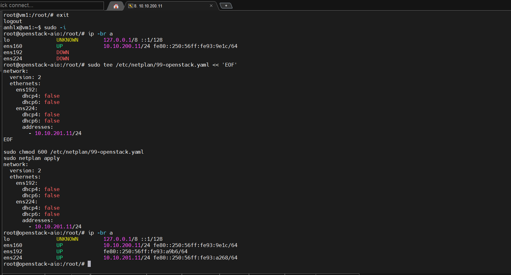
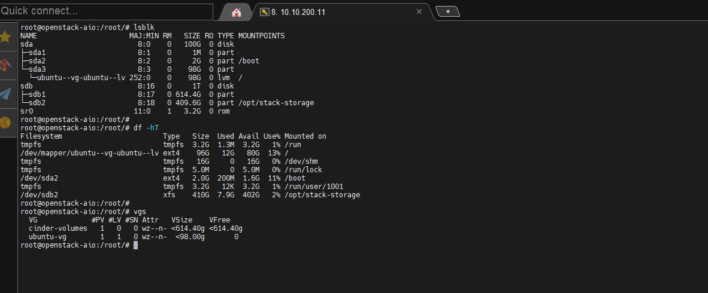
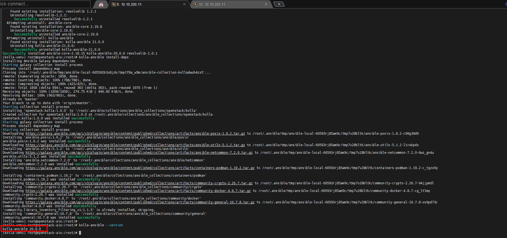
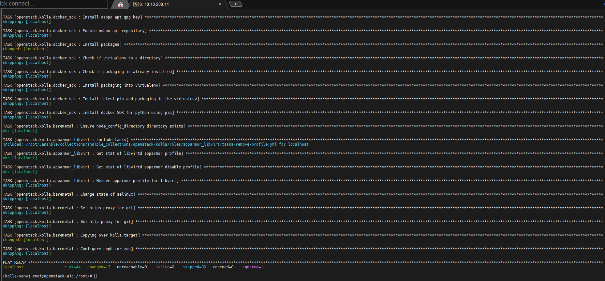
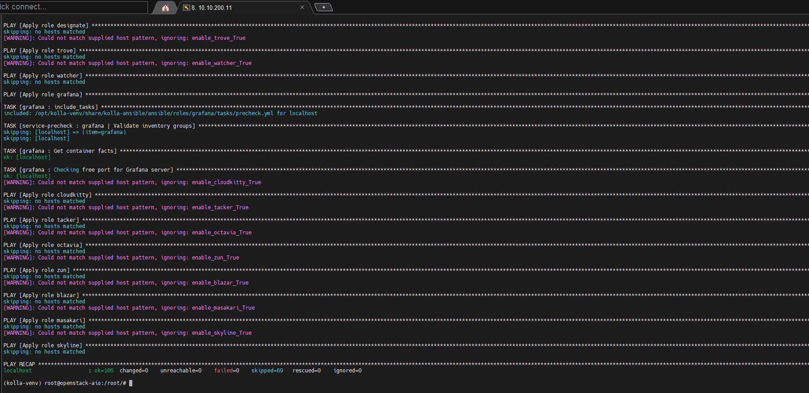
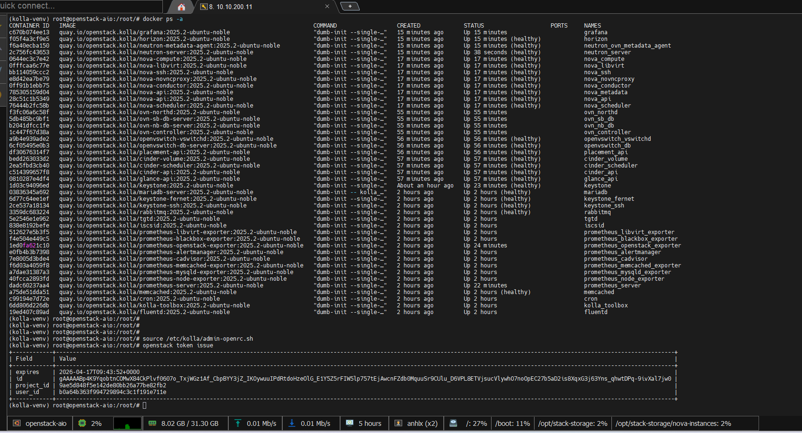
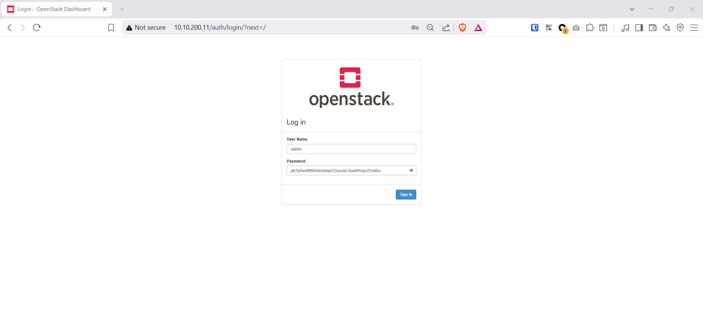
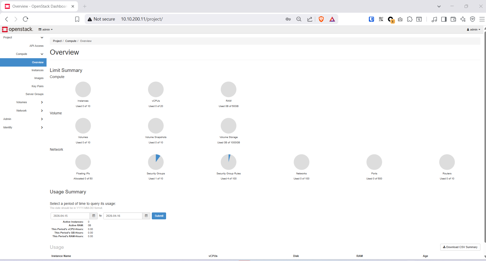
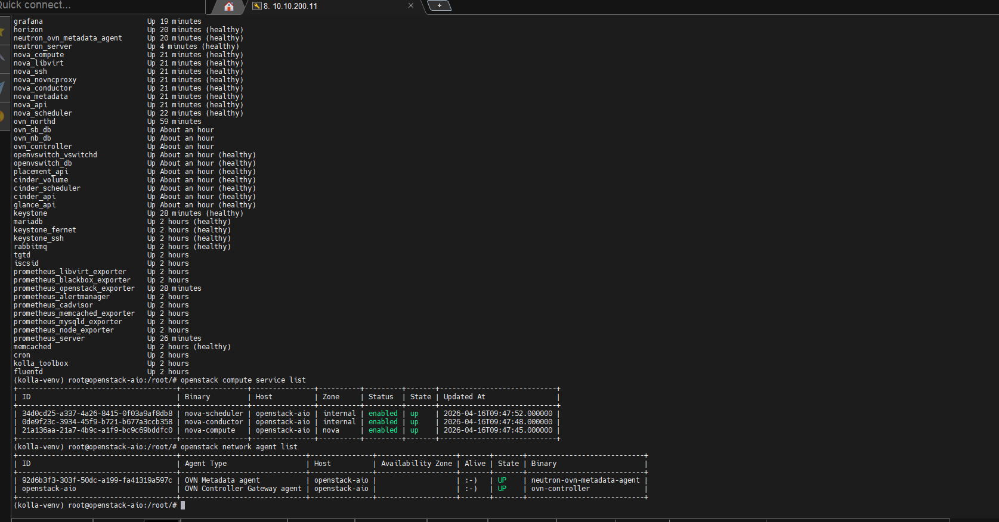

### Mục lục

- [1. Giới thiệu](#1-giới-thiệu)
  - [Kịch bản lab](#kịch-bản-lab)
  - [Kiến trúc network 3 NIC](#kiến-trúc-network-3-nic)
- [2. Cấu hình lab](#2-cấu-hình-lab)
- [3. Chuẩn bị ESXi](#3-chuẩn-bị-esxi)
- [4. Chuẩn bị hệ thống Ubuntu](#4-chuẩn-bị-hệ-thống-ubuntu)
  - [4.1. Cấu hình hostname và hosts](#41-cấu-hình-hostname-và-hosts)
  - [4.2. Chuẩn bị NIC2 và NIC3](#42-chuẩn-bị-nic2-và-nic3)
  - [4.3. Chuẩn bị disk 1TB — mô phỏng Ceph backend](#43-chuẩn-bị-disk-1tb--mô-phỏng-ceph-backend)
  - [4.4. Cài Docker](#44-cài-docker)
  - [4.5. Cài Python dependencies](#45-cài-python-dependencies)
- [5. Cài đặt Kolla-Ansible](#5-cài-đặt-kolla-ansible)
- [6. Cấu hình Kolla-Ansible](#6-cấu-hình-kolla-ansible)
  - [6.1. globals.yml](#61-globalsyml)
  - [6.2. passwords.yml](#62-passwordsyml)
  - [6.3. Cấu hình storage paths](#63-cấu-hình-storage-paths)
- [7. Deploy OpenStack](#7-deploy-openstack)
  - [Bước 1 — Bootstrap servers](#bước-1--bootstrap-servers)
  - [Bước 2 — Pre-checks](#bước-2--pre-checks)
  - [Bước 3 — Pull images](#bước-3--pull-images)
  - [Bước 4 — Deploy](#bước-4--deploy)
  - [Bước 5 — Post-deploy](#bước-5--post-deploy)
- [8. Truy cập Horizon Dashboard](#8-truy-cập-horizon-dashboard)
- [9. Kiểm tra dịch vụ](#9-kiểm-tra-dịch-vụ)
  - [9.1. Kiểm tra containers](#91-kiểm-tra-containers)
  - [9.2. Kiểm tra Compute](#92-kiểm-tra-compute)
- [10. Cấu hình network và test VM](#10-cấu-hình-network-và-test-vm)
  - [10.1. Tạo external provider network](#101-tạo-external-provider-network)
  - [10.2. Tạo private network và router](#102-tạo-private-network-và-router)
  - [10.3. Test VM cirros](#103-test-vm-cirros)
- [11. Build Windows Server 2022 image](#11-build-windows-server-2022-image)
  - [11.1. Cài đặt Windows trong QEMU](#111-cài-đặt-windows-trong-qemu)
  - [11.2. Cài virtio drivers và cloudbase-init](#112-cài-virtio-drivers-và-cloudbase-init)
  - [11.3. Compact và upload image](#113-compact-và-upload-image)
- [12. Triển khai VM cho khách hàng](#12-triển-khai-vm-cho-khách-hàng)
  - [12.1. Upload images và tạo flavors](#121-upload-images-và-tạo-flavors)
  - [12.2. Tạo Project cho 2 team](#122-tạo-project-cho-2-team)
  - [12.3. Tạo network nội bộ cho từng team](#123-tạo-network-nội-bộ-cho-từng-team)
  - [12.4. Tạo VM Ubuntu — Team IT-Helpdesk](#124-tạo-vm-ubuntu--team-it-helpdesk)
  - [12.5. Tạo VM Windows Server 2022 — Team Dev](#125-tạo-vm-windows-server-2022--team-dev)
- [13. Monitoring với Prometheus + Grafana](#13-monitoring-với-prometheus--grafana)
  - [13.1. Monitoring stack trong globals.yml](#131-monitoring-stack-trong-globalsyml)
  - [13.2. Truy cập Grafana](#132-truy-cập-grafana)
  - [13.3. Kiểm tra metrics OpenStack](#133-kiểm-tra-metrics-openstack)
- [14. Quản lý sau deploy](#14-quản-lý-sau-deploy)
  - [Containers tự khởi động sau reboot](#containers-tự-khởi-động-sau-reboot)
  - [Reconfigure một service](#reconfigure-một-service)
  - [Upgrade lên version mới](#upgrade-lên-version-mới)
  - [Destroy và deploy lại từ đầu](#destroy-và-deploy-lại-từ-đầu)

---

## 1. Giới thiệu

### Kịch bản lab

Bài lab mô phỏng **Private Cloud** cho một doanh nghiệp — **Team System** đóng vai trò admin quản lý toàn bộ hạ tầng OpenStack và cấp tài nguyên cho 2 team nội bộ như 2 khách hàng riêng biệt, mỗi team có account riêng và tự quản lý VM/resource được cấp:

| Tenant | Team | Vai trò | VM |
|--------|------|---------|----|
| `it-helpdesk` | Team IT-Helpdesk | Quản lý hệ thống, hỗ trợ nội bộ | Ubuntu — SSH |
| `dev-team` | Team Dev | Phát triển phần mềm | Windows Server 2022 — RDP |

**Thực tế production** sẽ dùng Kolla-Ansible triển khai multi-node (3 control + N compute). Bài lab này dùng **All-in-One** trên 1 VM ESXi vì giới hạn tài nguyên, nhưng cấu trúc hoàn toàn giống production — chỉ cần thêm node vào inventory là scale out. **Team System** giữ role `admin` trên OpenStack, tạo project và quota cho từng team, còn mỗi team tự quản lý VM của mình.

### Kiến trúc network 3 NIC

```
┌─────────────────────────────────────────────┐
│           ESXi Host                         │
│  ┌─────────────────────────────────────────┐│
│  │  VM: openstack-aio                      ││
│  │                                         ││
│  │  ens160 (VLAN200) ─── Management/API    ││
│  │  ens192 (VLAN200) ─── Provider/Float IP ││
│  │  ens224 (VLAN201) ─── VM Tunnel/Overlay ││
│  └─────────────────────────────────────────┘│
└─────────────────────────────────────────────┘
```

| NIC | Interface | VLAN | Mục đích |
|-----|-----------|------|----------|
| NIC1 | `ens160` | VLAN200 | Quản lý OpenStack, API endpoints, Horizon |
| NIC2 | `ens192` | VLAN200 | Neutron provider — floating IP ra ngoài |
| NIC3 | `ens224` | VLAN201 | VM overlay tunnel (OVN Geneve/VXLAN) |

**Disk 1TB** trong lab này được phân vùng để **mô phỏng Ceph cluster** — mỗi phân vùng đại diện một Ceph pool riêng cho từng service. Trong production thực tế, có 2 lựa chọn nâng cấp:
- **Ceph cluster** (khuyến nghị): 3+ node Ceph riêng, Kolla-Ansible tích hợp sẵn — hỗ trợ live migration, snapshot, thin provisioning
- **QNAS (NFS/iSCSI)**: NFS share cho Glance + Nova, iSCSI target cho Cinder — kết hợp Kolla multinode là **production-ready private cloud hoàn chỉnh**

**Kolla-Ansible** deploy mỗi service trong Docker container, tự restart sau reboot — kiến trúc giống production, dễ scale lên multi-node.


---

## 2. Cấu hình lab

| Thành phần | Cấu hình |
|------------|----------|
| Hypervisor | VMware ESXi |
| OS | Ubuntu Server 24.04.2 LTS (Noble Numbat) |
| Hostname | openstack-aio |
| CPU | 16 vCPU |
| RAM | 32 GB |
| Disk OS | 100 GB (`/dev/sda`) |
| Disk Storage | 1 TB (`/dev/sdb`) — phân vùng mô phỏng Ceph backend |
| &nbsp;&nbsp;&nbsp;`/dev/sdb1` | 600GB → LVM VG `cinder-volumes` (pool: cinder.volumes) |
| &nbsp;&nbsp;&nbsp;`/dev/sdb2` | 400GB → XFS `/opt/stack-storage/` (pool: images, vms) |
| NIC1 — Management | `ens160` — 10.10.200.11/24 (VLAN200) |
| NIC2 — Provider | `ens192` — no IP (VLAN200) — Neutron external, floating IP |
| NIC3 — Tunnel | `ens224` — 10.10.201.11/24 (VLAN201) — OVN overlay |
| Floating IP pool | 10.10.200.100 – 10.10.200.200 (VLAN200) |
| Gateway / NAT | 10.10.200.1 (pfSense → internet) |
| OpenStack version | 2026.1 — Giraffe (latest stable) |

> **Tenant mapping:**
> - `it-helpdesk` → private subnet `192.168.10.0/24` → floating IP từ pool VLAN200
> - `dev-team` → private subnet `192.168.20.0/24` → floating IP từ pool VLAN200

---

## 3. Chuẩn bị ESXi

Trước khi tạo VM, cần cấu hình trên ESXi:

**1. Tạo VM với 3 NIC và 2 disk:**

| Device | Portgroup | Ghi chú |
|--------|-----------|----------|
| Network Adapter 1 | Lab-vlan200 | Management/API |
| Network Adapter 2 | Lab-vlan200 | Provider/Floating IP |
| Network Adapter 3 | Lab-vlan201 | VM Tunnel/Overlay |
| Hard Disk 1 | 100 GB | OS |
| Hard Disk 2 | 1 TB | Cinder volumes |



**2. Bật Hardware Virtualization (nested KVM):**

VM Settings → **VM Options** → CPU → ✅ **Expose hardware assisted virtualization to the guest OS**

→ Bắt buộc để `nova_compute_virt_type: "kvm"` hoạt động — nếu không bật, Nova sẽ fallback sang `qemu` (chậm hơn ~10x)

**3. Bật Promiscuous Mode cho portgroup VLAN200:**

vSphere → Networking → Portgroup **Lab-vlan200** → Edit → Security:
- Promiscuous Mode: **Accept**
- Forged Transmits: **Accept**
- MAC Address Changes: **Accept**

→ Bắt buộc để OVN bridge trên NIC2 (`ens192`) nhận traffic floating IP từ pool 10.10.200.x hoạt động đúng.

---

## 4. Chuẩn bị hệ thống Ubuntu

### 4.1. Cấu hình hostname và hosts

```bash
sudo hostnamectl set-hostname openstack-aio

sudo tee -a /etc/hosts << 'EOF'
10.10.200.11 openstack-aio
EOF
```

### 4.2. Chuẩn bị NIC2 và NIC3

**NIC2 (`ens192`)** — không cần IP, dành cho OVN external bridge:

**NIC3 (`ens224`)** — cần IP trên VLAN201, dùng làm tunnel interface cho OVN Geneve:

```bash
# Kiểm tra 3 NIC đã nhận diện
ip -br a
# ens160  UP  10.10.200.11/24   ← Management
# ens192  UP  (no IP)            ← Provider
# ens224  UP  (no IP)            ← Tunnel (chưa cấu hình)
```

Cấu hình netplan cho cả 2 NIC:

```bash
sudo tee /etc/netplan/99-openstack.yaml << 'EOF'
network:
  version: 2
  ethernets:
    ens192:
      dhcp4: false
      dhcp6: false
    ens224:
      dhcp4: false
      dhcp6: false
      addresses:
        - 10.10.201.11/24
EOF

sudo chmod 600 /etc/netplan/99-openstack.yaml
sudo netplan apply

# Kiểm tra lại
ip -br a
# ens160  UP  10.10.200.11/24
# ens192  UP
# ens224  UP  10.10.201.11/24
```

### 4.3. Chuẩn bị disk 1TB — mô phỏng Ceph backend

Disk `/dev/sdb` (1TB) được phân vùng để mô phỏng các **Ceph pool** riêng biệt cho từng service — giống cách Ceph tổ chức dữ liệu trong production.

> **Nâng cấp lên production:** Thay disk 1TB local bằng một trong 2 phương án:
> - **Ceph cluster** — 3+ node OSD riêng, `kolla-ansible deploy-ceph` tích hợp sẵn. Glance/Cinder/Nova dùng RBD trực tiếp — live migration, snapshot, thin provisioning hoạt động hoàn toàn
> - **QNAS (NFS/iSCSI)** — đơn giản hơn: NFS share cho Glance + Nova instances, iSCSI target cho Cinder volumes. Kết hợp với **Kolla-Ansible multinode** (3 control + N compute + HAProxy VIP) là **production-ready private cloud hoàn chỉnh**

| Phân vùng | Kích thước | Service | Tương đương Ceph pool |
|-----------|-----------|---------|----------------------|
| `/dev/sdb1` | 600GB | Cinder block volumes | `cinder.volumes` |
| `/dev/sdb2` | 400GB | Glance images + Nova VM disk | `images`, `vms` |

```bash
# Tạo partition table GPT và 2 phân vùng
sudo parted /dev/sdb --script \
  mklabel gpt \
  mkpart cinder 0% 60% \
  mkpart storage 60% 100%

sudo partprobe /dev/sdb

# Kiểm tra
lsblk /dev/sdb
# NAME   MAJ:MIN RM  SIZE RO TYPE MOUNTPOINT
# sdb      8:16   0    1T  0 disk
# ├─sdb1   8:17   0  600G  0 part
# └─sdb2   8:18   0  400G  0 part
```

**sdb1 → LVM cho Cinder** (mô phỏng Ceph pool `cinder.volumes`):

```bash
sudo pvcreate /dev/sdb1
sudo vgcreate cinder-volumes /dev/sdb1

sudo vgs
# VG             #PV #LV #SN Attr   VSize    VFree
# cinder-volumes   1   0   0 wz--n- <600.00g <600.00g
```

**sdb2 → XFS filesystem cho Glance và Nova** (mô phỏng Ceph pool `images` và `vms`):

```bash
sudo mkfs.xfs /dev/sdb2
sudo mkdir -p /opt/stack-storage

echo "/dev/sdb2 /opt/stack-storage xfs defaults,noatime 0 2" | \
  sudo tee -a /etc/fstab
sudo mount -a

# Tạo thư mục mô phỏng từng Ceph pool
sudo mkdir -p /opt/stack-storage/glance-images    # pool: images
sudo mkdir -p /opt/stack-storage/nova-instances   # pool: vms

# Kolla container chạy với UID riêng cho từng service
sudo chown -R 42415:42415 /opt/stack-storage/glance-images   # glance user
sudo chown -R 42436:42436 /opt/stack-storage/nova-instances  # nova user

df -h /opt/stack-storage
```



### 4.4. Cài Docker

```bash
sudo apt update
sudo apt install -y ca-certificates curl

sudo install -m 0755 -d /etc/apt/keyrings
sudo curl -fsSL https://download.docker.com/linux/ubuntu/gpg \
  -o /etc/apt/keyrings/docker.asc
sudo chmod a+r /etc/apt/keyrings/docker.asc

echo "deb [arch=$(dpkg --print-architecture) \
  signed-by=/etc/apt/keyrings/docker.asc] \
  https://download.docker.com/linux/ubuntu \
  $(. /etc/os-release && echo "$VERSION_CODENAME") stable" | \
  sudo tee /etc/apt/sources.list.d/docker.list

sudo apt update
sudo apt install -y docker-ce docker-ce-cli containerd.io

sudo usermod -aG docker $USER
newgrp docker

docker info
```

### 4.5. Cài Python dependencies

```bash
sudo apt install -y python3-dev python3-pip python3-venv \
  libffi-dev gcc libssl-dev git

python3 -m venv /opt/kolla-venv
source /opt/kolla-venv/bin/activate

pip install -U pip
```

---

## 5. Cài đặt Kolla-Ansible

```bash
source /opt/kolla-venv/bin/activate

# Cài Kolla-Ansible 2026.1 (Giraffe) từ PyPI
pip install kolla-ansible==2026.1.0

# Cài Ansible collections cần thiết
kolla-ansible install-deps

# Kiểm tra version
kolla-ansible --version
```



Tạo thư mục cấu hình và copy template:

```bash
sudo mkdir -p /etc/kolla
sudo chown $USER:$USER /etc/kolla

cp /opt/kolla-venv/share/kolla-ansible/etc_examples/kolla/globals.yml /etc/kolla/globals.yml
cp /opt/kolla-venv/share/kolla-ansible/etc_examples/kolla/passwords.yml /etc/kolla/passwords.yml

# Copy inventory all-in-one
cp /opt/kolla-venv/share/kolla-ansible/ansible/inventory/all-in-one ~/all-in-one
```

---

## 6. Cấu hình Kolla-Ansible

### 6.1. globals.yml

```bash
cat > /etc/kolla/globals.yml << 'EOF'
---
kolla_base_distro: "ubuntu"
openstack_release: "2026.1"

# NIC1 — Management/API
network_interface: "ens160"
# NIC2 — Provider network / Floating IP (no IP)
neutron_external_interface: "ens192"
# NIC3 — OVN tunnel overlay (10.10.201.11/24)
tunnel_interface: "ens224"

kolla_internal_vip_address: "10.10.200.11"

nova_compute_virt_type: "kvm"
neutron_plugin_agent: "ovn"
enable_neutron_provider_networks: "yes"

# AIO — không cần HAProxy và ProxySQL
enable_haproxy: "no"
enable_proxysql: "no"

# Core services
enable_openstack_core: "yes"
enable_glance: "yes"
enable_nova: "yes"
enable_neutron: "yes"
enable_horizon: "yes"

# Cinder với LVM backend — mô phỏng storage tập trung
enable_cinder: "yes"
enable_cinder_backup: "no"
enable_cinder_backend_lvm: "yes"
cinder_volume_group: "cinder-volumes"

# Tắt các service không dùng trong lab
enable_swift: "no"
enable_heat: "no"
enable_barbican: "no"
enable_designate: "no"
enable_octavia: "no"
enable_manila: "no"

# Storage — bind mount Nova instances và Glance images về disk sdb2
nova_extra_volumes:
  - "/opt/stack-storage/nova-instances:/var/lib/nova/instances:shared"
glance_extra_volumes:
  - "/opt/stack-storage/glance-images:/var/lib/glance/images"

# Monitoring stack
enable_prometheus: "yes"
enable_grafana: "yes"
enable_prometheus_node_exporter: "yes"
enable_prometheus_mysqld_exporter: "yes"
enable_prometheus_rabbitmq_exporter: "yes"
enable_prometheus_libvirt_exporter: "yes"
enable_prometheus_openstack_exporter: "yes"
enable_prometheus_alertmanager: "yes"
EOF
```

### 6.2. passwords.yml

```bash
kolla-genpwd

# Xem password admin
grep keystone_admin_password /etc/kolla/passwords.yml
```



### 6.3. Cấu hình storage paths

Khai báo Kolla config override để Nova và Glance lưu data vào đúng thư mục trên disk `sdb2`:

```bash
mkdir -p /etc/kolla/config/nova
mkdir -p /etc/kolla/config/glance

# Nova — trỏ instances_path (disk ephemeral của VM) về pool vms
cat > /etc/kolla/config/nova/nova.conf << 'EOF'
[DEFAULT]
instances_path = /var/lib/nova/instances
EOF

# Glance — trỏ filesystem store (lưu image upload) về pool images
cat > /etc/kolla/config/glance/glance-api.conf << 'EOF'
[glance_store]
default_store = file
filesystem_store_datadir = /var/lib/glance/images/
EOF
```

> `/var/lib/nova/instances` và `/var/lib/glance/images` là đường dẫn **bên trong container** — được bind mount từ `/opt/stack-storage/nova-instances` và `/opt/stack-storage/glance-images` trên host thông qua `extra_volumes` đã khai báo ở `globals.yml` (bước 6.1).

Sau khi setup, toàn bộ storage layout trên disk `sdb`:

```
/dev/sdb (1TB)
├── sdb1 (600GB) — LVM VG: cinder-volumes
│   └── Cinder tạo LV động khi user tạo volume  ← pool: cinder.volumes
└── sdb2 (400GB) — XFS: /opt/stack-storage/
    ├── glance-images/     ← Glance lưu image tải lên  (pool: images)
    └── nova-instances/    ← Nova tạo disk ephemeral VM (pool: vms)
```

---

## 7. Deploy OpenStack

### Bước 1 — Bootstrap servers

```bash
source /opt/kolla-venv/bin/activate
kolla-ansible bootstrap-servers -i ~/all-in-one
```

### Bước 2 — Pre-checks

```bash
kolla-ansible prechecks -i ~/all-in-one
```

Nếu gặp lỗi `No module named 'docker'`:

```bash
pip install docker
```

Sau đó chạy lại prechecks.

### Bước 3 — Pull images

```bash
kolla-ansible pull -i ~/all-in-one
```

Quá trình kéo image Docker mất khoảng 15–30 phút tùy tốc độ mạng (~10–15 GB).



### Bước 4 — Deploy

```bash
kolla-ansible deploy -i ~/all-in-one
```



### Bước 5 — Post-deploy

```bash
kolla-ansible post-deploy -i ~/all-in-one
```

Lệnh này tạo file `/etc/kolla/admin-openrc.sh`. Load credentials và cài OpenStack CLI:

```bash
source /etc/kolla/admin-openrc.sh
pip install python-openstackclient

# Kiểm tra kết nối
openstack token issue
```



---

## 8. Truy cập Horizon Dashboard

Truy cập:

```
http://10.10.200.11/
```

- **Username:** `admin`
- **Password:** lấy từ `grep keystone_admin_password /etc/kolla/passwords.yml`





---

## 9. Kiểm tra dịch vụ

### 9.1. Kiểm tra containers

```bash
docker ps --format "table {{.Names}}\t{{.Status}}"
```

Tất cả container phải ở trạng thái `Up`.


### 9.2. Kiểm tra Compute

```bash
openstack compute service list
openstack network agent list
```


---

## 10. Cấu hình network và test VM

### 10.1. Tạo external provider network

```bash
source /etc/kolla/admin-openrc.sh

openstack network create \
  --provider-network-type flat \
  --provider-physical-network physnet1 \
  --external \
  public

openstack subnet create \
  --network public \
  --subnet-range 10.10.200.0/24 \
  --gateway 10.10.200.1 \
  --dns-nameserver 8.8.8.8 \
  --allocation-pool start=10.10.200.100,end=10.10.200.200 \
  --no-dhcp \
  public-subnet
```

### 10.2. Tạo private network và router

```bash
openstack network create private
openstack subnet create \
  --network private \
  --subnet-range 192.168.100.0/24 \
  --dns-nameserver 8.8.8.8 \
  private-subnet

openstack router create router1
openstack router set router1 --external-gateway public
openstack router add subnet router1 private-subnet
```

### 10.3. Test VM cirros

```bash
# Upload cirros image (nhỏ ~20MB, boot nhanh để test)
wget https://github.com/cirros-dev/cirros/releases/download/0.6.2/cirros-0.6.2-x86_64-disk.img

openstack image create cirros \
  --disk-format qcow2 \
  --container-format bare \
  --public \
  --file cirros-0.6.2-x86_64-disk.img

# Tạo flavor
openstack flavor create m1.tiny --vcpus 1 --ram 512 --disk 1

# Tạo security group
openstack security group create sg-test
openstack security group rule create sg-test --protocol tcp --dst-port 22
openstack security group rule create sg-test --protocol icmp

# Boot VM test
openstack server create \
  --image cirros \
  --flavor m1.tiny \
  --network private \
  --security-group sg-test \
  test-vm

# Gắn floating IP
openstack floating ip create public
FIP=$(openstack floating ip list -f value -c "Floating IP Address" | head -1)
openstack server add floating ip test-vm $FIP

openstack server list
echo "Cirros VM IP: $FIP"
```

Kết nối: `ssh cirros@$FIP` — password mặc định `gocubsgo`


---

## 11. Build Windows Server 2022 image

> **Thực hiện trên host openstack-aio** — dùng `qemu-system` trực tiếp vì `nova_libvirt` container đã chiếm `/var/run/libvirt/libvirt-sock`.

### 11.1. Cài đặt Windows trong QEMU

**Chuẩn bị:**

```bash
sudo apt install -y qemu-kvm qemu-utils

# Tải virtio drivers ISO
wget https://fedorapeople.org/groups/virt/virtio-win/direct-downloads/stable-virtio/virtio-win.iso

# Copy ISO Windows Server 2022 lên server (từ máy Windows)
scp "D:\softs\iso\2022SERVER_EVAL_x64FRE_en-us.iso" ubuntu@10.10.200.11:/home/ubuntu/
```

**Tạo disk và boot cài đặt:**

```bash
# Tạo disk 60GB
qemu-img create -f qcow2 windows-server-2022.qcow2 60G

# Boot installer qua VNC :1 (port 5901)
qemu-system-x86_64 \
  -name win2022-build \
  -m 4096 \
  -smp 2 \
  -enable-kvm \
  -drive file=windows-server-2022.qcow2,format=qcow2,if=virtio \
  -drive file=2022SERVER_EVAL_x64FRE_en-us.iso,media=cdrom,index=1 \
  -drive file=virtio-win.iso,media=cdrom,index=2 \
  -netdev user,id=net0 -device virtio-net-pci,netdev=net0 \
  -vnc 0.0.0.0:1 \
  -boot order=dc \
  -daemonize \
  -pidfile /tmp/win2022-build.pid

# Kiểm tra process
cat /tmp/win2022-build.pid
```

Kết nối **VNC viewer** vào `10.10.200.11:5901` để thực hiện cài đặt.


**Trong quá trình cài Windows:**

1. Chọn **Windows Server 2022 Standard (Desktop Experience)**
2. Khi chọn ổ đĩa → ổ không hiện → nhấn **Load driver** → Browse → CD Drive (virtio-win) → `viostor\2k22\amd64` → Install
3. Sau khi driver load xong, ổ đĩa 60GB xuất hiện → tiếp tục cài đặt bình thường


### 11.2. Cài virtio drivers và cloudbase-init

Sau khi Windows boot lần đầu, vào **Device Manager** và install driver từ virtio-win ISO, hoặc chạy installer tự động:

```
D:\virtio-win-gt-x64.msi
```

Drivers cần thiết:
- `viostor\2k22\amd64` — disk (đã cài khi setup)
- `NetKVM\2k22\amd64` — network
- `Balloon\2k22\amd64` — memory balloon
- `vioserial\2k22\amd64` — serial console


**Cài Cloudbase-Init** để nhận `user-data` từ OpenStack metadata:

```powershell
# Tải từ: https://www.cloudbase.it/downloads/CloudbaseInitSetup_Stable_x64.msi
# Cài đặt với cấu hình mặc định:
#   Username: Admin
#   User's local groups: Administrators
#   Use metadata password: ✅ (checked)
#
# Bước cuối cùng: chọn "Run Sysprep" và "Shutdown"
# → VM sẽ tự shutdown sau khi sysprep hoàn tất
```


### 11.3. Compact và upload image

Sau khi VM đã shutdown hoàn toàn:

```bash
# Đảm bảo QEMU process đã kết thúc
kill $(cat /tmp/win2022-build.pid) 2>/dev/null || true

# Compact image — dùng qemu-img convert thay virt-sparsify
# (virt-sparsify cần ~2x dung lượng tạm trên /tmp, qemu-img convert không cần)
qemu-img convert -c -f qcow2 -O qcow2 \
  windows-server-2022.qcow2 \
  windows-server-2022-final.qcow2

# Kiểm tra kích thước sau compress (thường 15–25 GB)
ls -lh windows-server-2022-final.qcow2
```

Upload lên Glance:

```bash
source /etc/kolla/admin-openrc.sh

openstack image create windows-2022 \
  --disk-format qcow2 \
  --container-format bare \
  --public \
  --property hw_disk_bus=virtio \
  --property hw_vif_model=virtio \
  --property os_type=windows \
  --file windows-server-2022-final.qcow2

openstack image list
```


---

## 12. Triển khai VM cho khách hàng

### 12.1. Upload images và tạo flavors

```bash
source /etc/kolla/admin-openrc.sh

# Upload Ubuntu Server 22.04 cloud image
wget https://cloud-images.ubuntu.com/jammy/current/jammy-server-cloudimg-amd64.img

openstack image create ubuntu-22.04 \
  --disk-format qcow2 \
  --container-format bare \
  --public \
  --file jammy-server-cloudimg-amd64.img

# Tạo flavors
openstack flavor create m1.small  --vcpus 1 --ram 2048  --disk 20
openstack flavor create m1.medium --vcpus 2 --ram 4096  --disk 50
openstack flavor create m1.win    --vcpus 2 --ram 4096  --disk 60

openstack flavor list
openstack image list
```


### 12.2. Tạo Project cho 2 team

Team System (admin) tạo project và account cho từng team — mỗi team chỉ thấy và quản lý resource trong project của mình:

```bash
# --- Team IT-Helpdesk ---
openstack project create --domain Default it-helpdesk
openstack user create --domain Default --project it-helpdesk \
  --password Password@123 user-helpdesk
openstack role add --project it-helpdesk --user user-helpdesk member

# --- Team Dev ---
openstack project create --domain Default dev-team
openstack user create --domain Default --project dev-team \
  --password Password@123 user-dev
openstack role add --project dev-team --user user-dev member
```

### 12.3. Tạo network nội bộ cho từng team

Mỗi team tự tạo network, router và security group trong project của mình bằng account riêng:

```bash
# --- Team IT-Helpdesk ---
export OS_PROJECT_NAME=it-helpdesk
export OS_USERNAME=user-helpdesk
export OS_PASSWORD=Password@123

openstack network create net-helpdesk
openstack subnet create subnet-helpdesk \
  --network net-helpdesk \
  --subnet-range 192.168.10.0/24 \
  --dns-nameserver 8.8.8.8

openstack router create router-helpdesk
openstack router set router-helpdesk --external-gateway public
openstack router add subnet router-helpdesk subnet-helpdesk

# Security group: ICMP + SSH (Linux server)
openstack security group create sg-helpdesk
openstack security group rule create sg-helpdesk --protocol icmp
openstack security group rule create sg-helpdesk --protocol tcp --dst-port 22

# --- Team Dev ---
export OS_PROJECT_NAME=dev-team
export OS_USERNAME=user-dev
export OS_PASSWORD=Password@123

openstack network create net-dev
openstack subnet create subnet-dev \
  --network net-dev \
  --subnet-range 192.168.20.0/24 \
  --dns-nameserver 8.8.8.8

openstack router create router-dev
openstack router set router-dev --external-gateway public
openstack router add subnet router-dev subnet-dev

# Security group: ICMP + RDP (Windows)
openstack security group create sg-dev
openstack security group rule create sg-dev --protocol icmp
openstack security group rule create sg-dev --protocol tcp --dst-port 3389

# Reset về admin
source /etc/kolla/admin-openrc.sh
```

### 12.4. Tạo VM Ubuntu — Team IT-Helpdesk

Team IT-Helpdesk tự boot VM bằng account của mình:

```bash
export OS_PROJECT_NAME=it-helpdesk
export OS_USERNAME=user-helpdesk
export OS_PASSWORD=Password@123

# Tạo keypair
ssh-keygen -t ed25519 -N "" -f ~/.ssh/key-helpdesk
openstack keypair create --public-key ~/.ssh/key-helpdesk.pub key-helpdesk

# Boot VM Ubuntu
openstack server create \
  --image ubuntu-22.04 \
  --flavor m1.small \
  --network net-helpdesk \
  --key-name key-helpdesk \
  --security-group sg-helpdesk \
  ubuntu-helpdesk-01

# Gắn Floating IP
openstack floating ip create public
FIP_HELPDESK=$(openstack floating ip list -f value -c "Floating IP Address" | head -1)
openstack server add floating ip ubuntu-helpdesk-01 $FIP_HELPDESK

openstack server list
echo "IT-Helpdesk VM Floating IP: $FIP_HELPDESK"
```

SSH vào VM (đợi ~1–2 phút sau khi ACTIVE):

```bash
ssh -i ~/.ssh/key-helpdesk ubuntu@$FIP_HELPDESK
```


### 12.5. Tạo VM Windows Server 2022 — Team Dev

Team Dev tự boot VM Windows bằng account của mình:

```bash
export OS_PROJECT_NAME=dev-team
export OS_USERNAME=user-dev
export OS_PASSWORD=Password@123

# user-data đặt password Administrator qua cloudbase-init
cat > win-userdata.txt << 'EOF'
#ps1_sysnative
net user Administrator "Admin@12345" /active:yes
EOF

# Boot VM Windows (môi trường dev cho phòng Dev)
openstack server create \
  --image windows-2022 \
  --flavor m1.win \
  --network net-dev \
  --security-group sg-dev \
  --user-data win-userdata.txt \
  windows-dev-01

# Gắn Floating IP
openstack floating ip create public
FIP_DEV=$(openstack floating ip list -f value -c "Floating IP Address" | tail -1)
openstack server add floating ip windows-dev-01 $FIP_DEV

openstack server list
echo "Dev VM Floating IP: $FIP_DEV"
```

Kết nối **Remote Desktop**: nhập `$FIP_DEV`, đăng nhập với `Administrator` / `Admin@12345`.

> Windows cần ~3–5 phút để hoàn tất cloudbase-init lần đầu boot trước khi chấp nhận RDP.


---

## 13. Monitoring với Prometheus + Grafana

Kolla-Ansible tích hợp sẵn **Prometheus + Grafana** để monitor toàn bộ OpenStack infrastructure — từ host metrics, database, message queue đến VM/service OpenStack.

### 13.1. Monitoring stack trong globals.yml

Monitoring stack đã được bật sẵn trong `globals.yml` ở **bước 6.1** và deploy cùng lúc với OpenStack ở **bước 7**. Sau khi `kolla-ansible deploy` hoàn tất, kiểm tra các container monitoring đã up:

```bash
docker ps --format "table {{.Names}}\t{{.Status}}" | grep -E 'prometheus|grafana|alertmanager|exporter'
```

Các exporter được deploy:

| Exporter | Mục đích |
|----------|----------|
| `node_exporter` | CPU, RAM, disk, network của host |
| `mysqld_exporter` | Metrics MariaDB Galera |
| `rabbitmq_exporter` | Queue, message rate RabbitMQ |
| `libvirt_exporter` | CPU/RAM/disk của từng VM |
| `openstack_exporter` | Nova, Neutron, Cinder, Glance API metrics |
| `alertmanager` | Quản lý alert rules |

### 13.2. Truy cập Grafana

```
http://10.10.200.11:3000
```

- **Username:** `admin`
- **Password:** lấy từ:

```bash
grep grafana_admin_password /etc/kolla/passwords.yml
```


Grafana đã được Kolla-Ansible cấu hình sẵn datasource Prometheus và các dashboard mặc định:

| Dashboard | Nội dung |
|-----------|----------|
| Node Exporter Full | CPU, RAM, disk, network host |
| MariaDB | Connections, queries, replication |
| RabbitMQ | Queues, consumers, publish rate |
| OpenStack | Services status, VM count, volume usage |
| Libvirt | Per-VM CPU, RAM, I/O |


### 13.3. Kiểm tra metrics OpenStack

```bash
# Kiểm tra Prometheus scrape targets
curl -s http://10.10.200.11:9090/api/v1/targets | \
  python3 -c "import sys,json; \
  [print(t['labels']['job'], '-', t['health']) \
  for t in json.load(sys.stdin)['data']['activeTargets']]"

# Xem metrics openstack_exporter trực tiếp
curl -s http://10.10.200.11:9180/metrics | grep -E '^openstack_nova'

# Kiểm tra số VM đang chạy
curl -s http://10.10.200.11:9180/metrics | grep openstack_nova_running_vms
```


---

## 14. Quản lý sau deploy

### Containers tự khởi động sau reboot

Kolla-Ansible cấu hình tất cả container với `restart: always` — sau khi reboot VM chờ ~2 phút rồi kiểm tra:

```bash
docker ps --format "table {{.Names}}\t{{.Status}}"
```

### Reconfigure một service

```bash
source /opt/kolla-venv/bin/activate

# Reconfigure một service cụ thể
kolla-ansible reconfigure -i ~/all-in-one --tags nova

# Reconfigure chỉ monitoring stack
kolla-ansible reconfigure -i ~/all-in-one --tags prometheus,grafana
```

### Upgrade lên version mới

```bash
# Sửa openstack_release trong /etc/kolla/globals.yml, sau đó:
kolla-ansible pull -i ~/all-in-one
kolla-ansible upgrade -i ~/all-in-one
```

### Destroy và deploy lại từ đầu

```bash
kolla-ansible destroy --yes-i-really-really-mean-it -i ~/all-in-one

# Xoá LVM để cinder-volumes sạch
sudo lvremove -f /dev/cinder-volumes
sudo vgremove cinder-volumes
sudo pvremove /dev/sdb
sudo pvcreate /dev/sdb
sudo vgcreate cinder-volumes /dev/sdb

kolla-ansible deploy -i ~/all-in-one
```
