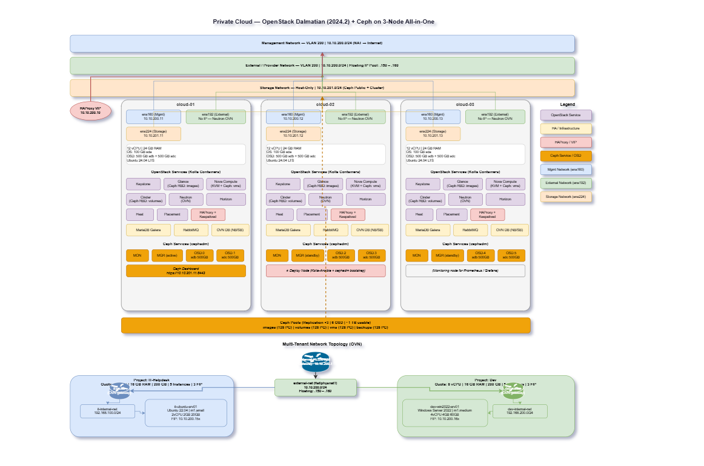
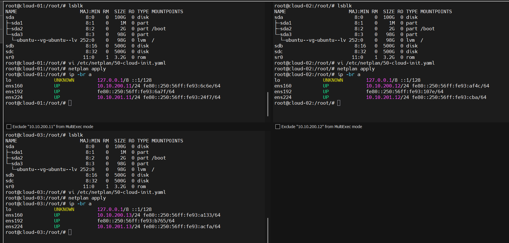
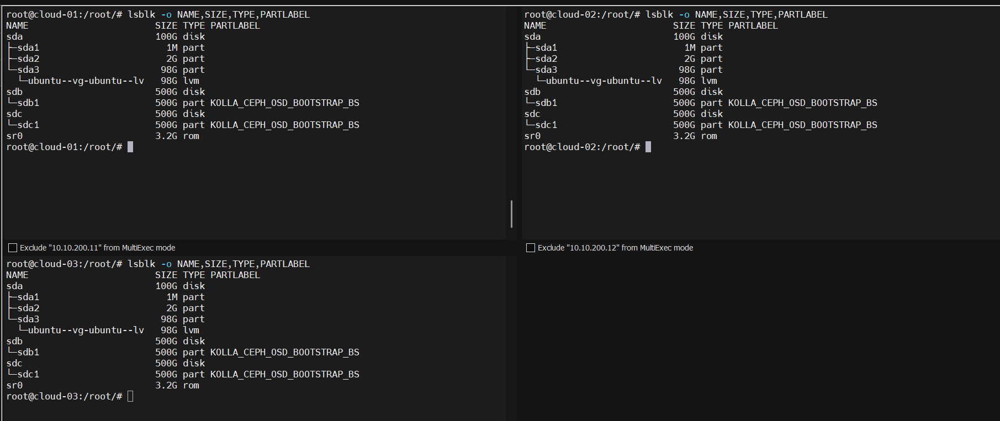
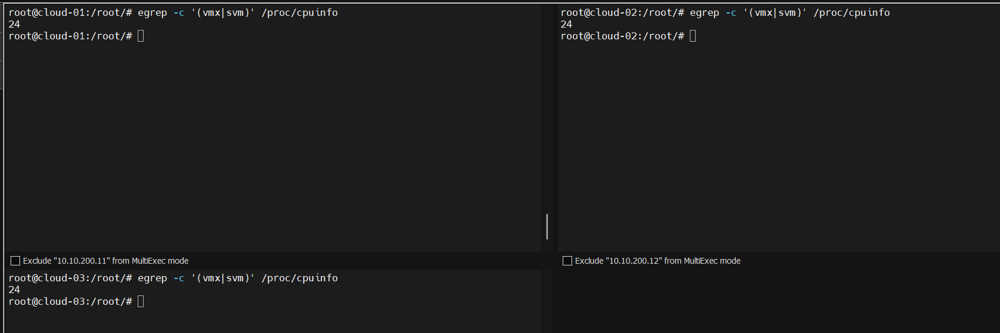
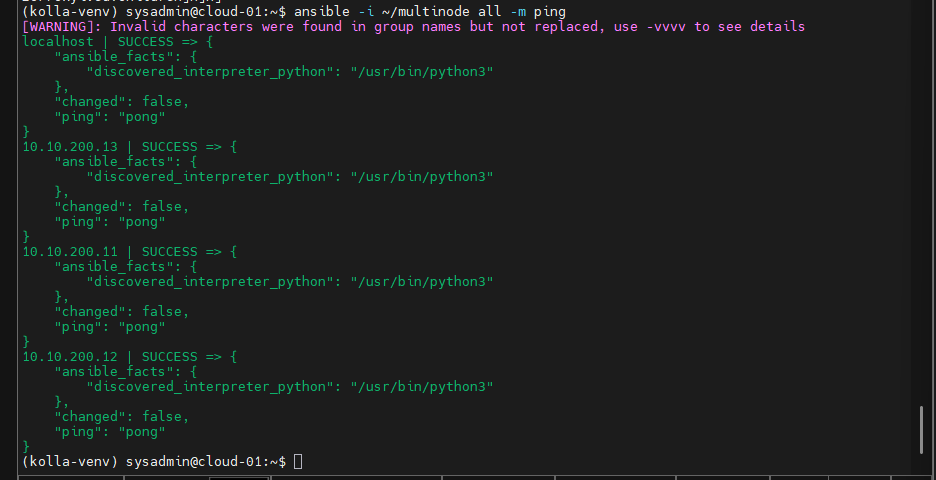
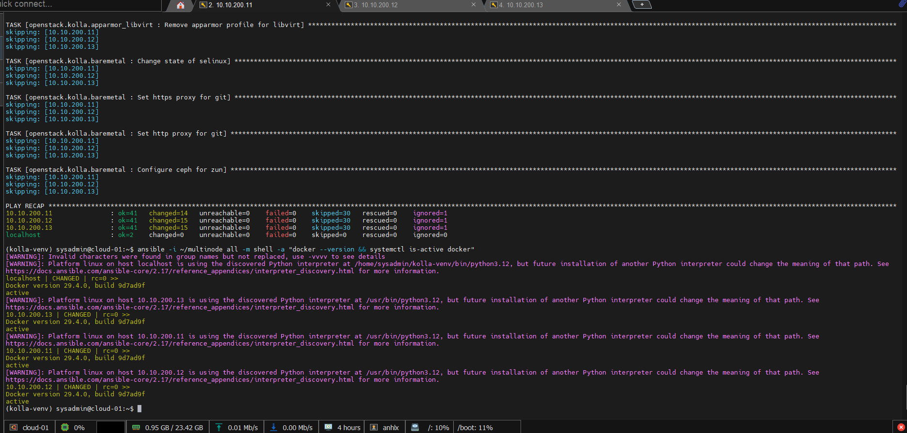

---
title: "Private Cloud - Kolla Deploy OpenStack Dalmatian (2024.2) + Ceph trên 3 Node All-in-One"
categories:
- Cloud
- OpenStack
- Ceph
- Linux

feature_image: "../assets/postbanner.jpg"
feature_text: |
  ### Xây dựng Private Cloud cho doanh nghiệp với OpenStack Dalmatian + Ceph - Kolla-Ansible trên 3 node All-in-One
---

### Mục lục

- [1. Giới thiệu](#1-giới-thiệu)
- [2. Kiến trúc & Mô hình triển khai](#2-kiến-trúc--mô-hình-triển-khai)
- [3. Cấu hình cơ bản trên 3 node](#3-cấu-hình-cơ-bản-trên-3-node)
- [4. Cài đặt Kolla-Ansible](#4-cài-đặt-kolla-ansible)
- [5. Deploy Ceph với cephadm](#5-deploy-ceph-với-cephadm)
- [6. Deploy OpenStack (Kolla-Ansible)](#6-deploy-openstack-kolla-ansible)
- [7. Kiểm tra dịch vụ](#7-kiểm-tra-dịch-vụ)
- [8. Cấu hình Multi-tenant cho doanh nghiệp](#8-cấu-hình-multi-tenant-cho-doanh-nghiệp)
- [9. Demo - Tạo VM trong OpenStack](#9-demo---tạo-vm-trong-openstack)
- [10. Scale & Best Practices](#10-scale--best-practices)
- [11. Kết luận](#11-kết-luận)

---

### 1. Giới thiệu

Private Cloud là mô hình điện toán đám mây được triển khai nội bộ trong doanh nghiệp, cung cấp khả năng tự phục vụ (self-service) tài nguyên compute, storage, network cho các phòng ban mà vẫn đảm bảo kiểm soát bảo mật và chi phí.

**OpenStack** là nền tảng Private Cloud mã nguồn mở phổ biến nhất, được sử dụng bởi nhiều tổ chức lớn trên thế giới. Kết hợp với **Ceph** - hệ thống lưu trữ phân tán (Software-Defined Storage), ta có một giải pháp Private Cloud hoàn chỉnh với tính sẵn sàng cao.

**Mục tiêu bài lab:**
- Triển khai OpenStack Dalmatian (2024.2) trên 3 node All-in-One bằng **Kolla-Ansible**
- Deploy **Ceph** bằng **cephadm** và cấu hình External Ceph làm storage backend cho Glance, Cinder, Nova
- Sử dụng **OVN** cho Neutron networking (self-service + provider network)
- Mô phỏng môi trường production cho doanh nghiệp với 2 phòng ban: **IT-Helpdesk** và **Dev**
- Demo tạo VM Ubuntu Server và Windows Server 2022 trong OpenStack

**Tại sao dùng 3 node All-in-One?**
- Đây là mô hình PoC (Proof of Concept) - mỗi node chạy tất cả role (control, network, compute, storage)
- Đảm bảo HA cho control plane (MariaDB Galera, RabbitMQ cluster, HAProxy + Keepalived)
- Sau này có thể scale bằng cách thêm compute node riêng hoặc tách role



---

### 2. Kiến trúc & Mô hình triển khai

#### 2.1 Topology

```
   ┌─────────────────────────────────────────────────────────────────────┐
   │  Network-Mgmt          Network-External       Network-Storage       │
   │  VLAN 200              VLAN 200               Host-Only             │
   │  10.10.200.0/24        10.10.200.0/24         10.10.201.0/24        │
   │  (NAT → Internet)      (Floating IP)                                │
   └──┬─────┬─────┬─────────┬─────┬─────┬─────────┬─────┬─────┬─────────┘
      │     │     │         │     │     │         │     │     │
   ┌──┴──┐┌─┴──┐┌─┴──┐  ┌──┴──┐┌─┴──┐┌─┴──┐  ┌──┴──┐┌─┴──┐┌─┴──┐
   │ens  ││ens ││ens │  │ens  ││ens ││ens │  │ens  ││ens ││ens │
   │160  ││160 ││160 │  │192  ││192 ││192 │  │224  ││224 ││224 │
   │     ││    ││    │  │     ││    ││    │  │     ││    ││    │
   │cloud││clou││clou│  │cloud││clou││clou│  │cloud││clou││clou│
   │ -01 ││d-02││d-03│  │ -01 ││d-02││d-03│  │ -01 ││d-02││d-03│
   └─────┘└────┘└────┘  └─────┘└────┘└────┘  └─────┘└────┘└────┘
```

#### 2.2 Tài nguyên mỗi node

| Thành phần | Cấu hình |
|------------|----------|
| vCPU | 12 cores |
| RAM | 24 GB |
| Disk OS | 1 x 100 GB (sda) |
| Disk OSD | 2 x 500 GB (sdb, sdc) |
| NIC 1 | Management/API |
| NIC 2 | External/Provider |
| NIC 3 | Storage/Ceph |
| OS | Ubuntu 24.04 LTS Server |

**Tổng tài nguyên ESXi host cần:** 36 vCPU, 72 GB RAM, 3.3 TB disk

#### 2.3 Network Planning

| Network | Subnet | VLAN | Interface | Mục đích |
|---------|--------|------|-----------|----------|
| Management | 10.10.200.0/24 | VLAN 200 | ens160 | API, internal, tunnel (Geneve), SSH - NAT ra internet |
| External | 10.10.200.0/24 | VLAN 200 | ens192 | Provider network, Floating IP (.150-.160) |
| Storage | 10.10.201.0/24 | - (Host-Only) | ens224 | Ceph public + cluster network |

> **Lưu ý:** Management và External cùng subnet 10.10.200.0/24 (VLAN 200). NIC1 (ens160) có IP để quản lý, NIC2 (ens192) không gán IP - Neutron quản lý trực tiếp cho floating IP.

#### 2.4 IP Planning

| Node | Hostname | Mgmt (ens160) | External (ens192) | Storage (ens224) |
|------|----------|---------------|-------------------|------------------|
| VIP | - | 10.10.200.10 | - | - |
| Node 1 | cloud-01 | 10.10.200.11 | No IP (Neutron) | 10.10.201.11 |
| Node 2 | cloud-02 | 10.10.200.12 | No IP (Neutron) | 10.10.201.12 |
| Node 3 | cloud-03 | 10.10.200.13 | No IP (Neutron) | 10.10.201.13 |

> **Lưu ý:** NIC 2 (ens192) **không gán IP** trên host - interface này được Neutron sử dụng trực tiếp làm provider bridge cho external network.

#### 2.5 OpenStack Services

| Service | Vai trò | Backend |
|---------|---------|---------|
| Keystone | Identity & Authentication | MariaDB |
| Glance | Image Service | **Ceph RBD** (pool: images) |
| Nova | Compute Service | **Ceph RBD** (pool: vms) |
| Neutron (OVN) | Networking | OVN Northbound/Southbound DB |
| Cinder | Block Storage | **Ceph RBD** (pool: volumes) |
| Horizon | Web Dashboard | - |
| Heat | Orchestration | MariaDB |
| Placement | Resource Tracking | MariaDB |
| HAProxy + Keepalived | Load Balancing & VIP | - |
| MariaDB Galera | Database Cluster | - |
| RabbitMQ | Message Queue Cluster | - |
| Memcached | Caching (session, token) | - |

> **Ceph** được deploy riêng bằng **cephadm** (không qua Kolla-Ansible) và cấu hình External Ceph. Ceph Dashboard truy cập trực tiếp qua `https://10.10.201.11:8443`.

#### 2.6 Ceph Architecture

| Thành phần | Số lượng | Ghi chú |
|------------|----------|---------|
| MON (Monitor) | 3 | 1 per node |
| MGR (Manager) | 3 | 1 per node |
| OSD (Object Storage Daemon) | 6 | 2 per node (sdb, sdc) |
| Tổng raw capacity | 3 TB | 6 x 500 GB |
| Usable capacity (3x replica) | ~1 TB | Replication factor 3 |

**Ceph Pools:**

| Pool | Mục đích | PG Count |
|------|----------|----------|
| images | Glance images | 128 |
| volumes | Cinder volumes | 128 |
| vms | Nova ephemeral disks | 128 |
| backups | Cinder backups | 128 |

---

### 3. Cấu hình cơ bản trên 3 node

> **Thực hiện trên cả 3 node** (trừ khi ghi chú khác)

#### 3.1 Hostname & /etc/hosts

**Node 1:**
```bash
sudo hostnamectl set-hostname cloud-01
```

**Node 2:**
```bash
sudo hostnamectl set-hostname cloud-02
```

**Node 3:**
```bash
sudo hostnamectl set-hostname cloud-03
```

**Trên cả 3 node**, thêm vào `/etc/hosts`:
```bash
cat << 'EOF' | sudo tee -a /etc/hosts
10.10.200.10 cloud-vip
10.10.200.11 cloud-01
10.10.200.12 cloud-02
10.10.200.13 cloud-03
EOF
```

#### 3.2 Cấu hình Network (Netplan)

**Node 1:**
```bash
cat << 'EOF' | sudo tee /etc/netplan/50-cloud-init.yaml
network:
  version: 2
  ethernets:
    ens160:
      addresses:
        - "10.10.200.11/24"
      routes:
      - to: "default"
        via: "10.10.200.1"
      nameservers:
        addresses: [8.8.8.8]
    ens192:
      optional: true
    ens224:
      optional: true
      addresses:
        - "10.10.201.11/24"
EOF
sudo netplan apply
```

**Node 2:**
```bash
cat << 'EOF' | sudo tee /etc/netplan/50-cloud-init.yaml
network:
  version: 2
  ethernets:
    ens160:
      addresses:
        - "10.10.200.12/24"
      routes:
      - to: "default"
        via: "10.10.200.1"
      nameservers:
        addresses: [8.8.8.8]
    ens192:
      optional: true
    ens224:
      optional: true
      addresses:
        - "10.10.201.12/24"
EOF
sudo netplan apply
```

**Node 3:**
```bash
cat << 'EOF' | sudo tee /etc/netplan/50-cloud-init.yaml
network:
  version: 2
  ethernets:
    ens160:
      addresses:
        - "10.10.200.13/24"
      routes:
      - to: "default"
        via: "10.10.200.1"
      nameservers:
        addresses: [8.8.8.8]
    ens192:
      optional: true
    ens224:
      optional: true
      addresses:
        - "10.10.201.13/24"
EOF
sudo netplan apply
```

> **Lưu ý:** `ens192` và `ens224` thêm `optional: true` để tránh `systemd-networkd-wait-online.service` bị treo khi boot (do interface chưa có link). `ens192` không gán IP - Neutron sẽ quản lý interface này.



#### 3.3 Chuẩn bị disk cho Ceph OSD

Kiểm tra disk trên mỗi node:
```bash
lsblk
```

Output mong đợi:
```
NAME                      MAJ:MIN RM  SIZE RO TYPE MOUNTPOINTS
sda                         8:0    0  100G  0 disk
├─sda1                      8:1    0    1M  0 part
├─sda2                      8:2    0    2G  0 part /boot
└─sda3                      8:3    0   98G  0 part
  └─ubuntu--vg-ubuntu--lv 252:0    0   98G  0 lvm  /
sdb                         8:16   0  500G  0 disk
sdc                         8:32   0  500G  0 disk
sr0                        11:0    1  3.2G  0 rom
```

Xóa sạch disk để cephadm sử dụng:
```bash
# Xóa sạch partition table và filesystem signatures
sudo wipefs -a /dev/sdb
sudo wipefs -a /dev/sdc

# Xóa LVM metadata nếu có
sudo sgdisk --zap-all /dev/sdb
sudo sgdisk --zap-all /dev/sdc
```

Kiểm tra disk đã sạch:
```bash
lsblk -o NAME,SIZE,TYPE,FSTYPE
```



> `cephadm` sẽ tự động sử dụng các disk trống (không có partition/filesystem) để tạo OSD.

#### 3.4 Bật Nested Virtualization

Kiểm tra nested virtualization trên mỗi node:
```bash
egrep -c '(vmx|svm)' /proc/cpuinfo
```

Output phải > 0 (KVM hoạt động). Nếu output = 0, **bật nested virtualization trên ESXi** trước khi tiếp tục:

1. Tắt VM trên ESXi
2. Edit Settings → CPU → bật **"Expose hardware assisted virtualization to the guest OS"**
3. Bật lại VM và kiểm tra lại lệnh trên



> Bước này bắt buộc để Nova sử dụng KVM. Nếu không bật được (hardware không hỗ trợ), sẽ phải dùng QEMU (chậm hơn nhiều) — khi đó thay `nova_compute_virt_type: "kvm"` thành `"qemu"` trong `globals.yml` ở Section 4.6.

#### 3.5 Cập nhật hệ thống

Chuyển mirror APT sang server tại Việt Nam để tăng tốc download:
```bash
sudo sed -i 's|http://archive.ubuntu.com/ubuntu|http://mirror.bizflycloud.vn/ubuntu|g' /etc/apt/sources.list.d/ubuntu.sources 2>/dev/null || \
sudo sed -i 's|http://archive.ubuntu.com/ubuntu|http://mirror.bizflycloud.vn/ubuntu|g' /etc/apt/sources.list

sudo sed -i 's|http://security.ubuntu.com/ubuntu|http://mirror.bizflycloud.vn/ubuntu|g' /etc/apt/sources.list.d/ubuntu.sources 2>/dev/null || \
sudo sed -i 's|http://security.ubuntu.com/ubuntu|http://mirror.bizflycloud.vn/ubuntu|g' /etc/apt/sources.list
```


Tắt firewall và cập nhật:
```bash
sudo systemctl disable --now ufw
sudo apt autoremove -y && sudo apt update && sudo apt upgrade -y 
sudo reboot
```

---

### 4. Cài đặt Kolla-Ansible

> **Thực hiện trên cloud-01** - node này đóng vai trò deploy node

#### 4.1 Tạo user deploy `sysadmin`

> **Thực hiện trên cả 3 node** - Kolla-Ansible cần user riêng (không dùng root) có quyền sudo để deploy và vận hành.

Tạo user `sysadmin` trên mỗi node:
```bash
# Tạo user sysadmin với home directory
sudo useradd -m -s /bin/bash sysadmin

# Đặt password
sudo passwd sysadmin

# Cấu hình sudo không cần password
echo "sysadmin ALL=(ALL) NOPASSWD:ALL" | sudo tee /etc/sudoers.d/sysadmin
```

> **Tại sao không dùng root?**
> - Kolla-Ansible sử dụng `ansible_become: true` để escalate khi cần, nên cần user thường có sudo
> - Tránh rủi ro bảo mật khi cho phép SSH bằng root trên production
> - Dễ audit và quản lý quyền truy cập

Sau khi tạo xong, chuyển sang user `sysadmin` trên **cloud-01** để thực hiện các bước tiếp theo:
```bash
su - sysadmin
```

#### 4.2 SSH Key-based Authentication

Tạo SSH key trên cloud-01 (user `sysadmin`) và copy sang tất cả node:
```bash
ssh-keygen -t ed25519 -N "" -f ~/.ssh/id_ed25519

# Copy key sang cả 3 node (bao gồm chính nó)
ssh-copy-id sysadmin@10.10.200.11
ssh-copy-id sysadmin@10.10.200.12
ssh-copy-id sysadmin@10.10.200.13
```

Kiểm tra SSH không cần password:
```bash
ssh 10.10.200.12 hostname
ssh 10.10.200.13 hostname
```

#### 4.3 Cài đặt Python & Kolla-Ansible

```bash
# Cài đặt dependencies
sudo apt install -y python3-dev python3-venv python3-pip libffi-dev gcc libssl-dev git

# Tạo virtual environment
python3 -m venv ~/kolla-venv
source ~/kolla-venv/bin/activate

# Upgrade pip
pip install -U pip setuptools

# Cài đặt Ansible (phiên bản tương thích với Kolla Dalmatian)
pip install 'ansible-core>=2.16,<2.17.99'

# Cài đặt Kolla-Ansible phiên bản Dalmatian (2024.2)
pip install git+https://opendev.org/openstack/kolla-ansible@stable/2024.2

# Cài đặt Ansible Galaxy dependencies (collection openstack.kolla)
kolla-ansible install-deps
```

#### 4.4 Chuẩn bị thư mục cấu hình

```bash
# Tạo thư mục /etc/kolla
sudo mkdir -p /etc/kolla
sudo chown $USER:$USER /etc/kolla

# Copy file cấu hình mẫu
cp -r ~/kolla-venv/share/kolla-ansible/etc_examples/kolla/* /etc/kolla/

# Copy inventory mẫu
cp ~/kolla-venv/share/kolla-ansible/ansible/inventory/multinode ~/multinode

# Tạo thư mục cho Ansible
sudo mkdir -p /etc/ansible
```

Tạo `/etc/ansible/ansible.cfg`:
```bash
cat << 'EOF' | sudo tee /etc/ansible/ansible.cfg
[defaults]
host_key_checking = False
pipelining = True
forks = 100
EOF
```

#### 4.5 Inventory Multinode

Tạo file `~/multinode`:

> **Lưu ý:** Tên NIC (network interface) được khai báo **per-host** trong inventory thay vì trong `globals.yml`. Cách này phù hợp thực tế production khi các physical server có thể có tên NIC khác nhau (ví dụ server Dell dùng `eno1`, HP dùng `ens1f0`, VM dùng `ens160`...). Kiểm tra tên NIC trên mỗi node bằng `ip link show` trước khi điền vào inventory.

```bash
cat << 'EOF' > ~/multinode
[control]
10.10.200.11 ansible_user=sysadmin ansible_become=true network_interface=ens160 neutron_external_interface=ens192 storage_interface=ens224 tunnel_interface=ens160
10.10.200.12 ansible_user=sysadmin ansible_become=true network_interface=ens160 neutron_external_interface=ens192 storage_interface=ens224 tunnel_interface=ens160
10.10.200.13 ansible_user=sysadmin ansible_become=true network_interface=ens160 neutron_external_interface=ens192 storage_interface=ens224 tunnel_interface=ens160

[network]
10.10.200.11 ansible_user=sysadmin ansible_become=true
10.10.200.12 ansible_user=sysadmin ansible_become=true
10.10.200.13 ansible_user=sysadmin ansible_become=true

[compute]
10.10.200.11 ansible_user=sysadmin ansible_become=true
10.10.200.12 ansible_user=sysadmin ansible_become=true
10.10.200.13 ansible_user=sysadmin ansible_become=true

[storage]
10.10.200.11 ansible_user=sysadmin ansible_become=true
10.10.200.12 ansible_user=sysadmin ansible_become=true
10.10.200.13 ansible_user=sysadmin ansible_become=true

[monitoring]
10.10.200.11 ansible_user=sysadmin ansible_become=true

[deployment]
localhost ansible_connection=local ansible_become=true

# Các group thừa kế
[baremetal:children]
control
network
compute
storage
monitoring

[tls-backend:children]
control
network

[common:children]
control
network
compute
storage
monitoring

[hacluster:children]
control

[hacluster-remote:children]
compute

[loadbalancer:children]
network

[mariadb:children]
control

[rabbitmq:children]
control

[keystone:children]
control

[glance:children]
control

[nova:children]
control

[neutron:children]
network

[openvswitch:children]
network
compute

[cinder:children]
control

[memcached:children]
control

[horizon:children]
control

[heat:children]
control

[placement:children]
control

[bifrost:children]
deployment

[nova-compute:children]
compute

[ovn-controller-compute:children]
compute

[ovn-controller-network:children]
network

[ovn-database:children]
control

[ovn-northd:children]
ovn-database

[ovn-nb-db:children]
ovn-database

[ovn-sb-db:children]
ovn-database
EOF
```

Kiểm tra inventory:
```bash
source ~/kolla-venv/bin/activate
ansible -i ~/multinode all -m ping
```

Tất cả node phải trả về `SUCCESS`.




#### 4.6 globals.yml

Đây là file cấu hình quan trọng nhất:

```bash
cat << 'EOF' > /etc/kolla/globals.yml
---
# Kolla options
kolla_base_distro: "ubuntu"
openstack_release: "2024.2"
kolla_internal_vip_address: "10.10.200.10"
node_custom_config: "/etc/kolla/config"

# Docker
docker_registry: "quay.io"
docker_namespace: "openstack.kolla"

# Network interfaces → Đã khai báo per-host trong inventory (~/multinode)
# Không đặt ở đây để hỗ trợ môi trường có NIC name khác nhau giữa các node

# Neutron - OVN
neutron_plugin_agent: "ovn"
neutron_ovn_distributed_fip: "yes"

# Nova
nova_compute_virt_type: "kvm"

# External Ceph (Ceph được deploy riêng bằng cephadm)
# Glance → Ceph RBD
glance_backend_ceph: "yes"
glance_backend_file: "no"
ceph_glance_user: "glance"
ceph_glance_pool_name: "images"

# Cinder → Ceph RBD
enable_cinder: "yes"
cinder_backend_ceph: "yes"
cinder_backup_driver: "ceph"
ceph_cinder_user: "cinder"
ceph_cinder_pool_name: "volumes"
ceph_cinder_backup_user: "cinder-backup"
ceph_cinder_backup_pool_name: "backups"

# Nova → Ceph RBD
nova_backend_ceph: "yes"
ceph_nova_user: "cinder"
ceph_nova_pool_name: "vms"

# Horizon
enable_horizon: "yes"

# Heat
enable_heat: "yes"

# HAProxy + Keepalived
enable_haproxy: "yes"
enable_keepalived: "yes"

# Logging
enable_central_logging: "no"

# Misc
enable_openstack_core: "yes"
EOF
```

> **Lưu ý quan trọng:**
> - Kolla-Ansible Dalmatian (2024.2) **không còn hỗ trợ `enable_ceph`** — Ceph phải được deploy riêng (cephadm) rồi cấu hình External Ceph
> - `ceph_nova_user` mặc định là `cinder` (Nova dùng chung keyring với Cinder để attach volume)
> - `nova_compute_virt_type: "kvm"` yêu cầu nested virtualization đã được bật ở Section 3.4

#### 4.7 Generate Passwords

```bash
source ~/kolla-venv/bin/activate
kolla-genpwd
```

File password được tạo tại `/etc/kolla/passwords.yml`. Lưu giữ file này cẩn thận.

Kiểm tra password Horizon admin:
```bash
grep keystone_admin_password /etc/kolla/passwords.yml
```

---

### 5. Deploy Ceph với cephadm

> **Thực hiện trên cloud-01** (user `sysadmin`). Kolla-Ansible Dalmatian không còn deploy Ceph tích hợp — ta cần deploy Ceph cluster riêng bằng `cephadm` trước khi deploy OpenStack.

#### 5.1 Cài đặt cephadm

Trên **cloud-01**:
```bash
# Download cephadm (script Python, platform-independent)
CEPH_RELEASE=squid
curl --silent --remote-name --location https://download.ceph.com/rpm-${CEPH_RELEASE}/el9/noarch/cephadm
chmod +x cephadm
sudo mv cephadm /usr/local/bin/

# Thêm Ceph Squid repo cho Ubuntu 24.04 và cài ceph-common
sudo cephadm add-repo --release ${CEPH_RELEASE}
sudo cephadm install ceph-common
```

> **Lưu ý:** URL chứa `rpm-squid/el9` nhưng `cephadm` là script Python chạy trên mọi distro. Lệnh `cephadm add-repo` sẽ tự thêm đúng APT repo cho Ubuntu.

Kiểm tra:
```bash
cephadm version
ceph --version
```

#### 5.2 Bootstrap Ceph Cluster

Bootstrap cluster trên cloud-01, sử dụng **Storage network** (10.10.201.0/24):
```bash
sudo cephadm bootstrap \
  --mon-ip 10.10.201.11 \
  --cluster-network 10.10.201.0/24 \
  --ssh-user sysadmin \
  --initial-dashboard-password 'CephDash@2026' \
  --dashboard-password-noupdate \
  --allow-fqdn-hostname
```

> Bootstrap sẽ:
> - Tạo MON + MGR đầu tiên trên cloud-01
> - Cài đặt containers cho Ceph services
> - Bật Ceph Dashboard tại `https://10.10.201.11:8443`
> - Tạo SSH key để quản lý các node khác
> - `--ssh-user sysadmin`: cephadm SSH bằng user `sysadmin` (đã có passwordless sudo) thay vì root

Sau khi bootstrap xong, kiểm tra:
```bash
sudo ceph -s
sudo ceph orch host ls
```

#### 5.3 Thêm các node vào Ceph cluster

Copy SSH key của cephadm sang cloud-02 và cloud-03:
```bash
# Lấy public key của cephadm
sudo ceph cephadm get-pub-key > ~/cephadm-pub-key

# Copy sang các node khác
ssh-copy-id -f -i ~/cephadm-pub-key sysadmin@10.10.201.12
ssh-copy-id -f -i ~/cephadm-pub-key sysadmin@10.10.201.13
```

Thêm host vào cluster:
```bash
sudo ceph orch host add cloud-02 10.10.201.12
sudo ceph orch host add cloud-03 10.10.201.13
```

Kiểm tra:
```bash
sudo ceph orch host ls
```

Output mong đợi: 3 hosts (cloud-01, cloud-02, cloud-03).

#### 5.4 Deploy MON, MGR và OSD

Cephadm tự động deploy MON và MGR trên tất cả host. Đợi vài phút rồi kiểm tra:
```bash
sudo ceph orch ps
sudo ceph -s
```

Thêm OSD từ tất cả disk trống trên các node:
```bash
# Kiểm tra disk available
sudo ceph orch device ls --refresh

# Thêm tất cả disk trống làm OSD
sudo ceph orch apply osd --all-available-devices
```

Đợi vài phút cho OSD khởi tạo, kiểm tra:
```bash
sudo ceph osd tree
```

Output mong đợi: 6 OSD (2 per node) trên 3 host.

```bash
sudo ceph -s
```

Output mong đợi:
```
  cluster:
    health: HEALTH_OK

  services:
    mon: 3 daemons, quorum cloud-01,cloud-02,cloud-03
    mgr: cloud-01(active), standbys: cloud-02, cloud-03
    osd: 6 osds: 6 up, 6 in

  data:
    usage:   6.0 GiB used, 2.93 TiB / 2.93 TiB avail
```

#### 5.5 Tạo Pools và Keyrings cho OpenStack

**Tạo pools:**
```bash
sudo ceph osd pool create images 128
sudo ceph osd pool create volumes 128
sudo ceph osd pool create vms 128
sudo ceph osd pool create backups 128

# Bật RBD application cho các pool
sudo ceph osd pool application enable images rbd
sudo ceph osd pool application enable volumes rbd
sudo ceph osd pool application enable vms rbd
sudo ceph osd pool application enable backups rbd
```

**Tạo keyrings cho OpenStack services:**
```bash
# Keyring cho Glance
sudo ceph auth get-or-create client.glance \
  mon 'profile rbd' \
  osd 'profile rbd pool=images' \
  mgr 'profile rbd pool=images'

# Keyring cho Cinder
sudo ceph auth get-or-create client.cinder \
  mon 'profile rbd' \
  osd 'profile rbd pool=volumes, profile rbd pool=vms, profile rbd-read-only pool=images' \
  mgr 'profile rbd pool=volumes, profile rbd pool=vms'

# Keyring cho Cinder Backup
sudo ceph auth get-or-create client.cinder-backup \
  mon 'profile rbd' \
  osd 'profile rbd pool=backups' \
  mgr 'profile rbd pool=backups'
```

**Tạo thư mục config External Ceph cho Kolla và copy keyrings:**
```bash
# Tạo cấu trúc thư mục config cho External Ceph
mkdir -p /etc/kolla/config/glance
mkdir -p /etc/kolla/config/cinder/cinder-volume
mkdir -p /etc/kolla/config/cinder/cinder-backup
mkdir -p /etc/kolla/config/nova

# Lấy ceph.conf minimal
sudo ceph config generate-minimal-conf | sed 's/^\t//' > /tmp/ceph.conf

# Export keyrings
sudo ceph auth get client.glance -o /tmp/client.glance.keyring
sudo ceph auth get client.cinder -o /tmp/client.cinder.keyring
sudo ceph auth get client.cinder-backup -o /tmp/client.cinder-backup.keyring

# Copy ceph.conf cho tất cả services
cp /tmp/ceph.conf /etc/kolla/config/glance/ceph.conf
cp /tmp/ceph.conf /etc/kolla/config/cinder/ceph.conf
cp /tmp/ceph.conf /etc/kolla/config/nova/ceph.conf

# Copy keyrings cho Glance
cp /tmp/client.glance.keyring /etc/kolla/config/glance/ceph.client.glance.keyring

# Copy keyrings cho Cinder
cp /tmp/client.cinder.keyring /etc/kolla/config/cinder/cinder-volume/ceph.client.cinder.keyring
cp /tmp/client.cinder.keyring /etc/kolla/config/cinder/cinder-backup/ceph.client.cinder.keyring
cp /tmp/client.cinder-backup.keyring /etc/kolla/config/cinder/cinder-backup/ceph.client.cinder-backup.keyring

# Copy keyrings cho Nova (Nova dùng keyring cinder để attach volume)
cp /tmp/client.cinder.keyring /etc/kolla/config/nova/ceph.client.cinder.keyring
```

Kiểm tra cấu trúc thư mục:
```bash
find /etc/kolla/config/{glance,cinder,nova} -type f
```

Output mong đợi:
```
/etc/kolla/config/glance/ceph.conf
/etc/kolla/config/glance/ceph.client.glance.keyring
/etc/kolla/config/cinder/ceph.conf
/etc/kolla/config/cinder/cinder-volume/ceph.client.cinder.keyring
/etc/kolla/config/cinder/cinder-backup/ceph.client.cinder.keyring
/etc/kolla/config/cinder/cinder-backup/ceph.client.cinder-backup.keyring
/etc/kolla/config/nova/ceph.conf
/etc/kolla/config/nova/ceph.client.cinder.keyring
```

#### 5.6 Ceph Dashboard

Ceph Dashboard đã được bật khi bootstrap, truy cập tại:

```
https://10.10.201.11:8443
```

- **User:** admin
- **Password:** CephDash@2026


---

### 6. Deploy OpenStack (Kolla-Ansible)

> **Tất cả lệnh chạy trên cloud-01** trong virtual environment

```bash
source ~/kolla-venv/bin/activate
```

#### 6.1 Bootstrap Servers

Bootstrap cài đặt Docker, configure hệ thống trên tất cả node:
```bash
kolla-ansible bootstrap-servers -i ~/multinode
```

> Bước này mất khoảng 5-10 phút. Kolla sẽ cài Docker, cấu hình Docker daemon, cài các package cần thiết trên tất cả node.

Kiểm tra Docker đã chạy trên tất cả node:
```bash
ansible -i ~/multinode all -m shell -a "docker --version && systemctl is-active docker"
```



#### 6.2 Prechecks

Kiểm tra tất cả điều kiện trước khi deploy:
```bash
kolla-ansible prechecks -i ~/multinode
```

Nếu các bước trước đã thực hiện đúng (Docker hoạt động, NIC đúng tên, Ceph keyrings đã copy), prechecks sẽ pass toàn bộ.

#### 6.3 Pull Images (tùy chọn)

Pull Docker images trước để giảm thời gian deploy:
```bash
kolla-ansible pull -i ~/multinode
```

#### 6.4 Deploy

Deploy toàn bộ OpenStack:
```bash
kolla-ansible deploy -i ~/multinode
```

> **Thời gian deploy:** 20-40 phút tùy tốc độ mạng và disk I/O. Kolla sẽ deploy theo thứ tự:
> 1. Infrastructure (MariaDB, RabbitMQ, Memcached, HAProxy, Keepalived)
> 2. Keystone
> 3. Glance, Nova, Neutron, Cinder, Heat, Horizon
>
> Ceph đã được deploy riêng ở Section 5, Kolla chỉ cấu hình kết nối External Ceph.

> Kolla-Ansible có tính idempotent — có thể chạy lại lệnh deploy bất cứ lúc nào mà không ảnh hưởng các service đã deploy thành công.

#### 6.5 Post-deploy

Tạo file cấu hình OpenStack client:
```bash
kolla-ansible post-deploy -i ~/multinode
```

File `clouds.yaml` được tạo tại `/etc/kolla/clouds.yaml`.

Copy file credentials để OpenStack CLI sử dụng:
```bash
mkdir -p ~/.config/openstack
cp /etc/kolla/clouds.yaml ~/.config/openstack/clouds.yaml
```

Cài đặt OpenStack CLI:
```bash
pip install python-openstackclient python-heatclient
```

Kiểm tra kết nối (sử dụng cloud `kolla-admin` từ `clouds.yaml`):
```bash
openstack --os-cloud kolla-admin service list
```

---

### 7. Kiểm tra dịch vụ

#### 7.1 Ceph Health

Kiểm tra Ceph cluster (chạy trên cloud-01):
```bash
sudo ceph -s
sudo ceph osd tree
sudo ceph osd pool ls detail
```

Kiểm tra RBD pool đã sẵn sàng cho OpenStack:
```bash
sudo rbd ls images
sudo rbd ls volumes
sudo rbd ls vms
```

#### 7.2 OpenStack Services

```bash
export OS_CLOUD=kolla-admin

# Kiểm tra service catalog
openstack service list

# Kiểm tra endpoints
openstack endpoint list

# Kiểm tra compute services
openstack compute service list

# Kiểm tra network agents
openstack network agent list

# Kiểm tra volume services
openstack volume service list

# Kiểm tra hypervisors
openstack hypervisor list
```

Tất cả services phải ở trạng thái `enabled` và `up`.

#### 7.3 Horizon Dashboard

Truy cập Horizon qua trình duyệt:
```
http://10.10.200.10
```

- **Domain:** default
- **User:** admin
- **Password:** (lấy từ `grep keystone_admin_password /etc/kolla/passwords.yml`)


#### 7.4 Ceph Dashboard

Ceph Dashboard được cephadm quản lý trực tiếp, truy cập qua **Storage network**:

```
https://10.10.201.11:8443
```

- **User:** admin
- **Password:** CephDash@2026 (đã đặt khi bootstrap)

Dashboard cung cấp giao diện trực quan để giám sát:
- Cluster health, OSD status, PG state
- Pool usage, IOPS, throughput
- Host & service map


---

### 8. Cấu hình Multi-tenant cho doanh nghiệp

#### 8.1 Tạo Project

```bash
export OS_CLOUD=kolla-admin

# Tạo project cho phòng IT-Helpdesk
openstack project create --domain default \
  --description "Phong IT-Helpdesk - Quan ly ha tang noi bo" \
  IT-Helpdesk

# Tạo project cho phòng Dev
openstack project create --domain default \
  --description "Phong Dev - Moi truong phat trien" \
  Dev
```

#### 8.2 Tạo User & gán Role

```bash
# Tạo user cho IT-Helpdesk
openstack user create --domain default \
  --project IT-Helpdesk \
  --password 'ITHelpdesk@2026' \
  it-admin

# Gán role member cho user it-admin trong project IT-Helpdesk
openstack role add --project IT-Helpdesk --user it-admin member

# Tạo user cho Dev
openstack user create --domain default \
  --project Dev \
  --password 'DevTeam@2026' \
  dev-admin

# Gán role member cho user dev-admin trong project Dev
openstack role add --project Dev --user dev-admin member
```

#### 8.3 Cấu hình Quota

```bash
# Quota cho IT-Helpdesk: 8 vCPU, 16GB RAM, 200GB storage
openstack quota set --cores 8 --ram 16384 \
  --gigabytes 200 --volumes 10 \
  --instances 5 --floating-ips 3 \
  --secgroups 5 --secgroup-rules 50 \
  IT-Helpdesk

# Quota cho Dev: 8 vCPU, 16GB RAM, 200GB storage
openstack quota set --cores 8 --ram 16384 \
  --gigabytes 200 --volumes 10 \
  --instances 5 --floating-ips 3 \
  --secgroups 5 --secgroup-rules 50 \
  Dev
```

Kiểm tra quota:
```bash
openstack quota show IT-Helpdesk
openstack quota show Dev
```

#### 8.4 Tạo External Network (Admin)

External network chỉ admin mới có thể tạo, dùng chung cho tất cả project:

```bash
export OS_CLOUD=kolla-admin

# Tạo external network (provider flat)
openstack network create --external \
  --provider-network-type flat \
  --provider-physical-network physnet1 \
  --share \
  external-net

# Tạo subnet cho external network
openstack subnet create --network external-net \
  --subnet-range 10.10.200.0/24 \
  --gateway 10.10.200.1 \
  --allocation-pool start=10.10.200.150,end=10.10.200.160 \
  --dns-nameserver 8.8.8.8 \
  --no-dhcp \
  external-subnet
```

#### 8.5 Tạo Internal Network cho từng Project

**IT-Helpdesk network:**
```bash
# Switch sang project IT-Helpdesk (dùng admin)
openstack network create --project IT-Helpdesk \
  it-internal-net

openstack subnet create --project IT-Helpdesk \
  --network it-internal-net \
  --subnet-range 192.168.100.0/24 \
  --gateway 192.168.100.1 \
  --dns-nameserver 8.8.8.8 \
  it-internal-subnet

# Tạo router kết nối internal ↔ external
openstack router create --project IT-Helpdesk it-router
openstack router set --external-gateway external-net it-router
openstack router add subnet it-router it-internal-subnet
```

**Dev network:**
```bash
openstack network create --project Dev \
  dev-internal-net

openstack subnet create --project Dev \
  --network dev-internal-net \
  --subnet-range 192.168.200.0/24 \
  --gateway 192.168.200.1 \
  --dns-nameserver 8.8.8.8 \
  dev-internal-subnet

# Tạo router kết nối internal ↔ external
openstack router create --project Dev dev-router
openstack router set --external-gateway external-net dev-router
openstack router add subnet dev-router dev-internal-subnet
```


---

### 9. Demo - Tạo VM trong OpenStack

#### 9.1 Upload Image

```bash
export OS_CLOUD=kolla-admin

# Download Ubuntu Server 22.04 cloud image
wget https://cloud-images.ubuntu.com/jammy/current/jammy-server-cloudimg-amd64.img

# Upload lên Glance
openstack image create "Ubuntu-22.04" \
  --file jammy-server-cloudimg-amd64.img \
  --disk-format qcow2 \
  --container-format bare \
  --public
```

Cho Windows Server 2022, cần tạo image từ ISO hoặc dùng image có sẵn:
```bash
# Download virtio driver ISO (cần cho Windows trên KVM)
wget https://fedorapeople.org/groups/virt/virtio-win/direct-downloads/stable-virtio/virtio-win.iso

# Upload Windows Server 2022 image (sau khi tạo từ ISO)
openstack image create "Windows-Server-2022" \
  --file windows-server-2022.qcow2 \
  --disk-format qcow2 \
  --container-format bare \
  --public \
  --property os_type=windows \
  --property hw_disk_bus=virtio \
  --property hw_vif_model=virtio
```

> **Tạo Windows image:** Cần boot VM từ ISO Windows Server 2022 + virtio driver, cài đặt xong rồi export thành qcow2. Có thể dùng `virt-install` hoặc tạo trực tiếp trong OpenStack.

#### 9.2 Tạo Flavor

```bash
# Flavor cho Ubuntu Server
openstack flavor create --vcpus 2 --ram 2048 --disk 20 m1.small

# Flavor cho Windows Server
openstack flavor create --vcpus 4 --ram 4096 --disk 60 m1.medium

# Flavor nhỏ cho test
openstack flavor create --vcpus 1 --ram 1024 --disk 10 m1.tiny
```

#### 9.3 Tạo Security Group

```bash
# Security Group cho IT-Helpdesk
openstack security group create --project IT-Helpdesk \
  --description "Allow SSH, ICMP, HTTP, HTTPS, RDP" \
  it-secgroup

openstack security group rule create --project IT-Helpdesk \
  --protocol icmp it-secgroup
openstack security group rule create --project IT-Helpdesk \
  --protocol tcp --dst-port 22 it-secgroup
openstack security group rule create --project IT-Helpdesk \
  --protocol tcp --dst-port 80 it-secgroup
openstack security group rule create --project IT-Helpdesk \
  --protocol tcp --dst-port 443 it-secgroup

# Security Group cho Dev
openstack security group create --project Dev \
  --description "Allow SSH, ICMP, HTTP, HTTPS, RDP" \
  dev-secgroup

openstack security group rule create --project Dev \
  --protocol icmp dev-secgroup
openstack security group rule create --project Dev \
  --protocol tcp --dst-port 22 dev-secgroup
openstack security group rule create --project Dev \
  --protocol tcp --dst-port 80 dev-secgroup
openstack security group rule create --project Dev \
  --protocol tcp --dst-port 443 dev-secgroup
openstack security group rule create --project Dev \
  --protocol tcp --dst-port 3389 dev-secgroup
```

#### 9.4 Tạo SSH Keypair

```bash
# Keypair cho IT-Helpdesk
openstack keypair create --type ssh \
  --user it-admin it-keypair > it-keypair.pem
chmod 600 it-keypair.pem

# Keypair cho Dev
openstack keypair create --type ssh \
  --user dev-admin dev-keypair > dev-keypair.pem
chmod 600 dev-keypair.pem
```

#### 9.5 Tạo VM Ubuntu Server (IT-Helpdesk)

```bash
# Tạo VM Ubuntu trong project IT-Helpdesk
openstack server create \
  --image "Ubuntu-22.04" \
  --flavor m1.small \
  --network it-internal-net \
  --security-group it-secgroup \
  --key-name it-keypair \
  --os-project-name IT-Helpdesk \
  --os-username it-admin \
  --os-password 'ITHelpdesk@2026' \
  --os-auth-url http://10.10.200.10:5000/v3 \
  --os-project-domain-name default \
  --os-user-domain-name default \
  it-ubuntu-srv01

# Gán Floating IP
openstack floating ip create --project IT-Helpdesk external-net
# Lấy floating IP vừa tạo
FLOAT_IP=$(openstack floating ip list --project IT-Helpdesk -f value -c "Floating IP Address" | head -1)
openstack server add floating ip it-ubuntu-srv01 $FLOAT_IP
```

Kiểm tra:
```bash
openstack server list --project IT-Helpdesk
openstack server show it-ubuntu-srv01
```

Truy cập VM:
```bash
ssh -i it-keypair.pem ubuntu@$FLOAT_IP
```


#### 9.6 Tạo VM Windows Server 2022 (Dev)

```bash
# Tạo volume từ Windows image (boot from volume cho disk lớn)
openstack volume create --size 60 \
  --image "Windows-Server-2022" \
  --bootable \
  --os-project-name Dev \
  win2022-boot-vol

# Tạo VM Windows trong project Dev
openstack server create \
  --volume win2022-boot-vol \
  --flavor m1.medium \
  --network dev-internal-net \
  --security-group dev-secgroup \
  --os-project-name Dev \
  --os-username dev-admin \
  --os-password 'DevTeam@2026' \
  --os-auth-url http://10.10.200.10:5000/v3 \
  --os-project-domain-name default \
  --os-user-domain-name default \
  dev-win2022-srv01

# Gán Floating IP
openstack floating ip create --project Dev external-net
FLOAT_IP_WIN=$(openstack floating ip list --project Dev -f value -c "Floating IP Address" | head -1)
openstack server add floating ip dev-win2022-srv01 $FLOAT_IP_WIN
```

Truy cập Windows VM qua RDP:
```
mstsc /v:$FLOAT_IP_WIN
```

Hoặc truy cập qua Horizon Console:


#### 9.7 Tạo Cinder Volume & Attach

Demo tạo thêm volume data cho VM:
```bash
# Tạo volume 50GB trong project Dev
openstack volume create --size 50 \
  --os-project-name Dev \
  dev-data-vol01

# Attach volume vào Windows VM
openstack server add volume dev-win2022-srv01 dev-data-vol01
```

Kiểm tra volume trên Ceph:
```bash
sudo rbd ls volumes
sudo ceph df
```

---

### 10. Scale & Best Practices

#### 10.1 Thêm Compute Node

Khi cần thêm tài nguyên compute, chỉ cần:

1. Tạo VM mới trên ESXi (cùng cấu hình, không cần disk OSD)
2. Cài Ubuntu 24.04, cấu hình network
3. Thêm node vào inventory group `[control]` và `[compute]` (NIC name theo server thực tế):
   ```ini
   [control]
   10.10.200.11 ansible_user=sysadmin ansible_become=true network_interface=ens160 neutron_external_interface=ens192 storage_interface=ens224 tunnel_interface=ens160
   10.10.200.12 ansible_user=sysadmin ansible_become=true network_interface=ens160 neutron_external_interface=ens192 storage_interface=ens224 tunnel_interface=ens160
   10.10.200.13 ansible_user=sysadmin ansible_become=true network_interface=ens160 neutron_external_interface=ens192 storage_interface=ens224 tunnel_interface=ens160

   [compute]
   ...
   10.10.200.14 ansible_user=sysadmin ansible_become=true network_interface=eno1 neutron_external_interface=eno2 storage_interface=eno3 tunnel_interface=eno1  # server Dell mới
   ```
4. Chạy lại:
   ```bash
   kolla-ansible bootstrap-servers -i ~/multinode --limit 10.10.200.14
   kolla-ansible deploy -i ~/multinode
   ```

#### 10.2 Thêm Ceph OSD Node

Với cephadm, thêm node OSD mới rất đơn giản:

1. Cài Ubuntu 24.04, cấu hình network (Storage network 10.10.201.x)
2. Copy SSH key của cephadm sang node mới:
   ```bash
   ssh-copy-id -f -i ~/cephadm-pub-key sysadmin@10.10.201.14
   ```
3. Thêm host vào Ceph cluster:
   ```bash
   sudo ceph orch host add cloud-04 10.10.201.14
   ```
4. OSD tự động được thêm từ disk trống (nếu đã `apply osd --all-available-devices`), hoặc thêm thủ công:
   ```bash
   sudo ceph orch daemon add osd cloud-04:/dev/sdb
   sudo ceph orch daemon add osd cloud-04:/dev/sdc
   ```

#### 10.3 Tách Role (Production)

Khi scale lên production, nên tách role:

| Role | Số node khuyến nghị | Ghi chú |
|------|---------------------|---------|
| Control | 3 | HA cho API, DB, MQ |
| Network | 2-3 | Neutron agents |
| Compute | N (theo nhu cầu) | Nova compute |
| Storage (Ceph) | 3+ | MON + OSD |

#### 10.4 Best Practices

- **Backup:** Định kỳ backup `/etc/kolla/` (đặc biệt `passwords.yml` và `globals.yml`)
- **Monitoring:** Bật `enable_prometheus: "yes"` và `enable_grafana: "yes"` trong globals.yml
- **Ceph tuning:** Điều chỉnh PG count theo số OSD, sử dụng `ceph balancer` 
- **Security:** Bật TLS cho API endpoints (`kolla_enable_tls_external: "yes"`)
- **Update:** Kolla-Ansible hỗ trợ rolling upgrade giữa các phiên bản OpenStack

---

### 11. Kết luận

Trong bài lab này, chúng ta đã triển khai thành công một hệ thống **Private Cloud** hoàn chỉnh với:

- **OpenStack Dalmatian (2024.2)** trên 3 node All-in-One với HA cho control plane
- Sử dụng **Kolla-Ansible** từ branch `stable/2024.2` — collection `openstack.kolla` tương thích hoàn toàn
- **Ceph (External)** deploy bằng **cephadm** làm unified storage backend (Glance, Cinder, Nova)
- **OVN** cho networking với self-service + provider network
- **Multi-tenant** cho 2 phòng ban IT-Helpdesk và Dev với quota riêng biệt
- Demo tạo VM **Ubuntu Server** và **Windows Server 2022**

> **Lưu ý:** Từ Kolla-Ansible Dalmatian (2024.2), `enable_ceph` đã bị loại bỏ. Ceph phải được deploy riêng và cấu hình External Ceph cho Kolla-Ansible.

Mô hình 3 node All-in-One phù hợp cho PoC và môi trường nhỏ. Khi doanh nghiệp cần scale, chỉ cần thêm compute node (Kolla) hoặc OSD node (cephadm) mà không ảnh hưởng đến hệ thống đang chạy.

**Tài nguyên tham khảo:**
- [OpenStack Kolla-Ansible Documentation](https://docs.openstack.org/kolla-ansible/2024.2/)
- [Ceph Documentation](https://docs.ceph.com/en/squid/)
- [OVN Architecture](https://docs.openstack.org/neutron/2024.2/admin/ovn/index.html)
