### Mục lục

- [Mục lục](#mục-lục)
- [1. Giới thiệu \& Ý tưởng Lab](#1-giới-thiệu--ý-tưởng-lab)
- [2. Kiến trúc tổng quan](#2-kiến-trúc-tổng-quan)
- [3. Chuẩn bị VM \& Cài đặt Ubuntu Server 24.04](#3-chuẩn-bị-vm--cài-đặt-ubuntu-server-2404)
- [4. Cài đặt Docker \& Docker Compose](#4-cài-đặt-docker--docker-compose)
- [5. Triển khai Ollama \& Custom model từ Hugging Face](#5-triển-khai-ollama--custom-model-từ-hugging-face)
- [6. Triển khai Dify - AI Application Platform](#6-triển-khai-dify---ai-application-platform)
- [7. Triển khai n8n - Workflow Automation](#7-triển-khai-n8n---workflow-automation)
- [8. Tích hợp Ollama vào Dify](#8-tích-hợp-ollama-vào-dify)
- [9. Tạo Dify App - SysAdmin Q\&A Chatbot](#9-tạo-dify-app---sysadmin-qa-chatbot)
- [10. Tích hợp n8n với Ollama \& Dify API](#10-tích-hợp-n8n-với-ollama--dify-api)
- [11. Use Case 2 - Tự động phân tích log \& tạo ticket](#11-use-case-2---tự-động-phân-tích-log--tạo-ticket)
- [12. Use Case 3 - Sinh script Bash/Ansible tự động](#12-use-case-3---sinh-script-bashansible-tự-động)
- [13. Use Case 4 - Tạo tài liệu kỹ thuật tự động](#13-use-case-4---tạo-tài-liệu-kỹ-thuật-tự-động)
- [14. Tối ưu hiệu năng \& Monitoring](#14-tối-ưu-hiệu-năng--monitoring)
- [15. Kết luận](#15-kết-luận)

---

### 1. Giới thiệu & Ý tưởng Lab

Trong công việc hàng ngày, System Engineer thường phải xử lý nhiều tác vụ lặp đi lặp lại: viết script, phân tích log, troubleshoot sự cố, tạo tài liệu kỹ thuật, hỗ trợ NOC/SOC... Việc tích hợp AI vào quy trình làm việc giúp tăng năng suất đáng kể.

Bài lab này xây dựng một **AI Platform tự host hoàn toàn nội bộ** (không cần internet, không gửi dữ liệu ra ngoài) trên một VM duy nhất, bao gồm 3 thành phần chính:

| Thành phần | Vai trò | Port |
|---|---|---|
| **Ollama** | Chạy LLM model cục bộ (Text GGUF từ Hugging Face + Vision từ Ollama Library) | `11434` |
| **Dify** | Nền tảng xây dựng AI app, chatbot, agent, RAG pipeline | `80` |
| **n8n** | Nền tảng workflow automation, kết nối AI với hệ thống giám sát/ticketing | `5678` |

**Chiến lược Dual-Model: Text + Vision**

Thay vì dùng 1 model text cho mọi tác vụ, lab này triển khai **2 model chuyên biệt** trên cùng Ollama — 1 model text mạnh cho code/analysis và 1 model vision cho xử lý hình ảnh:

| Model | Base | Quantize | Size | RAM | Vai trò |
|---|---|---|---|---|---|
| **sysadmin-coder** | Qwen2.5-Coder:**14b** | Q5_K_M | ~10 GB | ~13 GB | **Text** - suy luận, thiết kế, debug hệ thống; sinh script, phân tích log, viết tài liệu |
| **sysadmin-vision** | Llama 3.2 Vision:**11b** | Q4 (Ollama) | ~7.9 GB | ~9 GB | **Vision** - xử lý hình ảnh từ screenshot, dashboard, diagram, OCR log |

> **Tại sao dual-model Text + Vision?**
> - `sysadmin-coder` (14b): chuyên **suy luận, thiết kế, debug hệ thống** — sinh script Bash/Ansible/Terraform, phân tích log sâu, chatbot Q&A kỹ thuật (~5-10 token/s trên CPU)
> - `sysadmin-vision` (11b): chuyên **xử lý hình ảnh** — nhận diện lỗi từ screenshot, đọc dashboard Grafana/Zabbix, đọc diagram topology, OCR log từ ảnh chụp
> - Với 32GB RAM: cả 2 model được load đồng thời vào RAM (`OLLAMA_MAX_LOADED_MODELS=2`) — không có swap delay khi chuyển giữa text và vision
> - Dify/n8n cho phép chọn model khác nhau cho mỗi app/workflow

**Phân công model theo Use Case:**

| Use Case | Model | Lý do |
|---|---|---|
| Chatbot SysAdmin Q&A | `sysadmin-coder` (14b) | Suy luận, trả lời kỹ thuật chính xác |
| Sinh script Bash/Ansible | `sysadmin-coder` (14b) | Thiết kế script, có error handling |
| Phân tích log text | `sysadmin-coder` (14b) | Debug sâu, context 128K |
| Phân loại alert & triage | `sysadmin-coder` (14b) | Suy luận nguyên nhân, output JSON |
| Tạo tài liệu kỹ thuật | `sysadmin-coder` (14b) | Output dài, cần chất lượng cao |
| Phân tích screenshot lỗi | `sysadmin-vision` (11b) | Nhìn ảnh Grafana/error → đề xuất fix |
| Đọc diagram/topology | `sysadmin-vision` (11b) | Upload sơ đồ mạng → AI mô tả kiến trúc |
| OCR log từ ảnh | `sysadmin-vision` (11b) | Chụp màn hình log → AI đọc và phân tích |
| Nhận diện phần cứng từ ảnh | `sysadmin-vision` (11b) | Chụp rack/switch → AI nhận diện thiết bị |

**Tại sao chọn 2 model này?**

| Tiêu chí | sysadmin-coder (Qwen2.5-Coder:14b) | sysadmin-vision (Llama 3.2 Vision:11b) |
|---|---|---|
| Suy luận, debug hệ thống | **Xuất sắc** - reasoning sâu | Không chuyên |
| Thiết kế & sinh script Bash/Ansible | **Xuất sắc** (HumanEval 92.9%) | Không chuyên |
| Phân tích log text | **Rất tốt** - context 128K | Không chuyên |
| Phân tích screenshot/dashboard | Không hỗ trợ | **Xuất sắc** - native multimodal Meta |
| Đọc diagram/topology | Không hỗ trợ | **Rất tốt** - reasoning vượt LLaVA |
| OCR log từ ảnh chụp | Không hỗ trợ | **Rất tốt** - đọc text từ ảnh chính xác |
| Tốc độ inference (CPU) | 5-10 tok/s | 5-8 tok/s |
| Context window | **128K** | **128K** |
| RAM cần thiết | ~13 GB (Q5_K_M) | ~9 GB (Q4 Ollama) |
| Ngôn ngữ đầu ra | Tiếng Việt ổn định | **Tiếng Việt ổn định** (Meta, đa ngôn ngữ) |
| Nguồn | GGUF bartowski (Hugging Face) | `ollama pull` (Ollama Library) |

> **Tip:** Nếu VM chỉ có 16GB RAM, chỉ dùng `sysadmin-coder` (14b) cho text — bỏ vision model

**Mục tiêu lab:**
- Chatbot SysAdmin hỏi đáp về Linux, Windows Server, networking, troubleshooting
- Tự động phân tích log từ syslog/Prometheus alert → đề xuất fix
- Sinh script Bash/Ansible/Terraform từ mô tả bằng ngôn ngữ tự nhiên
- Tạo tài liệu kỹ thuật (runbook, post-mortem) tự động
- Workflow tự động: Alert → AI phân tích → Tạo ticket → Gửi thông báo
- **Phân tích screenshot** Grafana/error page → AI nhìn ảnh và đề xuất giải pháp
- **Đọc diagram/topology** → AI mô tả kiến trúc mạng từ ảnh
- **OCR log từ ảnh** → Chụp màn hình log → AI đọc và phân tích

---

### 2. Kiến trúc tổng quan

```
┌─────────────────────────────────────────────────────────────────┐
│                   VM: aiops (Ubuntu 24.04)                      │
│              16 CPU │ 32 GB RAM │ 100 GB Disk                   │
│                    10.10.200.11                                 │
│                                                                 │
│  ┌─────────────┐   ┌──────────────────┐   ┌──────────────────┐  │
│  │   Ollama    │   │      Dify        │   │       n8n        │  │
│  │  :11434     │   │      :80         │   │      :5678       │  │
│  │             │   │                  │   │                  │  │
│  │ ┌─────────┐ │   │ ┌──────────────┐ │   │ ┌──────────────┐ │  │
│  │ │Text 14b │ │◄──┤ │ Script Gen   │ │   │ │ Alert Triage │ │  │
│  │ │ (Q5_K_M)│ │   │ │ Deep Analyze │ │   │ │ Chatbot Q&A  │ │  │
│  │ ├─────────┤ │   │ │ Tech Docs    │ │   │ ├──────────────┤ │  │
│  │ │Vision 11b││◄──┤ ├──────────────┤ │   │ │ Screenshot   │ │  │
│  │ │(Llama3.2)││   │ │ Chatbot Q&A  │ │   │ │ Analysis     │ │  │
│  │ └─────────┘ │   │ │ OCR Ảnh      │ │   │ └──────┬───────┘ │  │
│  └──────▲──────┘   └──────────────────┘   └────────┼─────────┘  │
│         │                                          │            │
│         └──────────────────────────────────────────┘            │
│                     Ollama API (:11434)                         │
│                                                                 │
│  ┌─────────┐  ┌───────────┐  ┌──────────┐  ┌──────────────────┐ │
│  │ Docker  │  │ PostgreSQL│  │  Redis   │  │   Weaviate/      │ │
│  │ Engine  │  │ (Dify DB) │  │ (Cache)  │  │   Qdrant (RAG)   │ │
│  └─────────┘  └───────────┘  └──────────┘  └──────────────────┘ │
└─────────────────────────────────────────────────────────────────┘
```

**Luồng hoạt động:**
1. **User → Dify**: Truy cập giao diện web Dify để chat, hỏi đáp với AI chatbot
2. **Dify → Ollama**: Dify gửi prompt/ảnh đến Ollama API — text query dùng `sysadmin-coder` (14b), ảnh dùng `sysadmin-vision` (11b)
3. **n8n → Ollama/Dify**: n8n nhận webhook từ hệ thống giám sát (Prometheus, Zabbix...), gọi AI phân tích, rồi tạo ticket/gửi thông báo
4. **Dify RAG**: Upload tài liệu kỹ thuật (runbook, KB) → Dify vector hóa và lưu vào vector database → AI trả lời dựa trên knowledge base nội bộ

---

### 3. Chuẩn bị VM & Cài đặt Ubuntu Server 24.04

**Thông số VM trên vSphere:**

| Thông số | Giá trị |
|---|---|
| VM Name | aiops |
| CPU | 16 vCPU |
| Memory | 32 GB |
| Hard Disk | 100 GB |
| Network | 10.10.200.11 |

> **Lưu ý:** 100 GB disk cần phân bổ hợp lý: ~25GB cho OS + Docker images, ~22GB cho model text (14b GGUF) + vision (11b Ollama), ~30GB cho Dify data/vector DB, ~23GB còn lại cho log/data.

**Cài đặt Ubuntu Server 24.04 LTS** với cấu hình cơ bản:

```bash
# Cập nhật hệ thống
sudo apt update && sudo apt upgrade -y

# Cài đặt các package cần thiết
sudo apt install -y curl wget git vi htop net-tools ca-certificates gnupg lsb-release

# Cấu hình hostname
sudo hostnamectl set-hostname aiops
```

**Cấu hình swap (khuyến nghị cho LLM inference):**

```bash
# Tạo swap 8GB (hỗ trợ khi model cần thêm RAM)
sudo fallocate -l 8G /swapfile
sudo chmod 600 /swapfile
sudo mkswap /swapfile
sudo swapon /swapfile

# Thêm vào fstab để tự mount khi reboot
echo '/swapfile none swap sw 0 0' | sudo tee -a /etc/fstab

# Giảm swappiness (ưu tiên dùng RAM)
echo 'vm.swappiness=10' | sudo tee -a /etc/sysctl.conf
sudo sysctl -p
```

---

### 4. Cài đặt Docker & Docker Compose

```bash
# Thêm Docker GPG key
sudo install -m 0755 -d /etc/apt/keyrings
curl -fsSL https://download.docker.com/linux/ubuntu/gpg | sudo gpg --dearmor -o /etc/apt/keyrings/docker.gpg
sudo chmod a+r /etc/apt/keyrings/docker.gpg

# Thêm Docker repository
echo \
  "deb [arch=$(dpkg --print-architecture) signed-by=/etc/apt/keyrings/docker.gpg] https://download.docker.com/linux/ubuntu \
  $(lsb_release -cs) stable" | sudo tee /etc/apt/sources.list.d/docker.list > /dev/null

# Cài đặt Docker Engine + Docker Compose
sudo apt update
sudo apt install -y docker-ce docker-ce-cli containerd.io docker-buildx-plugin docker-compose-plugin

# Thêm user hiện tại vào group docker
sudo usermod -aG docker $USER
newgrp docker

# Kiểm tra
docker --version
docker compose version
```

**Cấu hình Docker daemon (tối ưu cho production):**

```bash
sudo mkdir -p /etc/docker
sudo tee /etc/docker/daemon.json <<EOF
{
  "log-driver": "json-file",
  "log-opts": {
    "max-size": "10m",
    "max-file": "3"
  },
  "storage-driver": "overlay2",
  "default-address-pools": [
    {
      "base": "172.20.0.0/16",
      "size": 24
    }
  ]
}
EOF

sudo systemctl restart docker
```

---

### 5. Triển khai Ollama & Custom model từ Hugging Face

**Bước 1: Mount thư mục models vào container Ollama**

```bash
sudo mkdir -p /opt/ai-platform/{ollama,dify,n8n}
sudo mkdir -p /opt/ai-platform/ollama/models
sudo chown -R $USER:$USER /opt/ai-platform
cd /opt/ai-platform
```

Cập nhật docker-compose để mount thư mục chứa GGUF:

```bash
cat <<'EOF' > /opt/ai-platform/ollama/docker-compose.yml
services:
  ollama:
    image: ollama/ollama:latest
    container_name: ollama
    restart: unless-stopped
    ports:
      - "11434:11434"
    volumes:
      - ollama_data:/root/.ollama
      - /opt/ai-platform/ollama/models:/models
    environment:
      - OLLAMA_HOST=0.0.0.0
      - OLLAMA_NUM_PARALLEL=1
      - OLLAMA_MAX_LOADED_MODELS=2
      - OLLAMA_KEEP_ALIVE=60m
    deploy:
      resources:
        limits:
          cpus: '10'
    networks:
      - ai-network

volumes:
  ollama_data:

networks:
  ai-network:
    name: ai-network
    driver: bridge
EOF
```

> **Lưu ý cấu hình Ollama:**
> - `OLLAMA_MAX_LOADED_MODELS=2` — load cả 2 model (`sysadmin-coder` + `sysadmin-vision`) vào RAM đồng thời, không có swap delay (~3-5s) khi chuyển model
> - `OLLAMA_NUM_PARALLEL=1` — giảm xuống 1 request đồng thời để tiết kiệm KV cache RAM (đủ cho lab 1-2 user)
> - `OLLAMA_KEEP_ALIVE=60m` — giữ model trong RAM lâu hơn, tránh reload
> - `deploy.resources.limits.cpus: '10'` — hard cap CPU ở tầng Docker, Ollama chỉ dùng tối đa 10/16 core, dành 6 core cho OS/Dify/n8n — **tránh VM bị treo khi inference**
> - Không đặt `deploy.resources.limits.memory` — để Ollama dùng toàn bộ RAM host tự do
>
> **Tính toán RAM với 2 model loaded:** ~13GB (text) + ~9GB (vision) + ~6GB (services/OS) = **~28GB/32GB** → còn ~4GB free + 8GB swap làm đệm an toàn.

```bash
# Restart Ollama với volume mới
cd /opt/ai-platform/ollama
docker compose up -d
```

> **⚠️ Lưu ý hiệu năng CPU:** Khi Ollama inference, llama.cpp mặc định dùng **tất cả CPU core** có sẵn — trên VM 16 core sẽ thấy `~1500% CPU` trong `top`. Để tránh treo VM, cần giới hạn ở 2 tầng:
> 1. `PARAMETER num_thread 8` trong Modelfile — giới hạn inference thread của llama.cpp
> 2. `deploy.resources.limits.cpus: '10'` trong docker-compose — hard cap ở tầng Docker
> Kết hợp 2 giới hạn này đảm bảo Ollama dùng tối đa ~8 core thực tế, dành 6-8 core cho OS/Dify/n8n.

**Bước 2: Tải text model GGUF từ Hugging Face + Pull vision model**

```bash
# === Model TEXT (14b Q5_K_M ~10GB) - GGUF từ Hugging Face ===
# Cài hf CLI (Ubuntu 24.04 dùng pipx thay vì pip)
sudo apt install -y pipx
pipx install huggingface-hub
pipx ensurepath && source ~/.bashrc

hf download bartowski/Qwen2.5-Coder-14B-Instruct-GGUF \
  Qwen2.5-Coder-14B-Instruct-Q5_K_M.gguf \
  --local-dir /opt/ai-platform/ollama/models

# Hoặc dùng wget nếu không cài được hf:
# wget -P /opt/ai-platform/ollama/models/ \
#   "https://huggingface.co/bartowski/Qwen2.5-Coder-14B-Instruct-GGUF/resolve/main/Qwen2.5-Coder-14B-Instruct-Q5_K_M.gguf"

# Kiểm tra
ls -lh /opt/ai-platform/ollama/models/
# Qwen2.5-Coder-14B-Instruct-Q5_K_M.gguf   ~10 GB

# === Model VISION (Llama 3.2 Vision 11b ~7.9GB) - từ Ollama Library ===
# Dùng ollama pull thay vì GGUF: vision model cần language GGUF + mmproj phải match nhau,
# ollama pull đảm bảo 2 thành phần tương thích, tránh segfault khi inference
docker exec -it ollama ollama pull llama3.2-vision
```

> **Tại sao vision model dùng `ollama pull` thay vì GGUF?**
> Vision model cần cả language GGUF + vision projector (mmproj) phải match chính xác phiên bản — dùng `ollama pull` đảm bảo 2 thành phần tương thích, đã test kỹ, tránh runtime crash. Llama 3.2 Vision là native multimodal của Meta, không bias tiếng Trung, context 128K, tiếng Việt tốt.


**Bước 3: Tạo 2 Modelfile tùy chỉnh**

```bash
# Modelfile cho sysadmin-coder (Text 14b)
cat <<'EOF' > /opt/ai-platform/ollama/models/Modelfile-sysadmin-coder
FROM /models/Qwen2.5-Coder-14B-Instruct-Q5_K_M.gguf

PARAMETER temperature 0.3
PARAMETER top_p 0.9
PARAMETER num_ctx 8192
PARAMETER num_thread 8
PARAMETER stop "<|im_end|>"
PARAMETER stop "<|endoftext|>"

SYSTEM """
Bạn là System Engineer AI Assistant cấp cao, thành thạo Linux và Windows Server.
Chuyên sinh script (Bash, PowerShell, Ansible, Terraform), phân tích log sâu, và viết tài liệu kỹ thuật.

Quy tắc ngôn ngữ TUYỆT ĐỐI:
- Chỉ dùng TIẾNG VIỆT cho toàn bộ phần giải thích, mô tả, hướng dẫn
- Chỉ dùng TIẾNG ANH cho: tên lệnh, code, config, technical term
- TUYỆT ĐỐI KHÔNG dùng tiếng Trung Quốc (中文) dù chỉ 1 ký tự
- Nếu không biết thuật ngữ tiếng Việt, giữ nguyên tiếng Anh

Cung cấp lệnh/script cụ thể, có error handling.
Cảnh báo nếu lệnh nguy hiểm. Luôn đề xuất best practice và bảo mật.
"""

TEMPLATE """{{- if .System }}<|im_start|>system
{{ .System }}<|im_end|>
{{ end }}
{{- range .Messages }}<|im_start|>{{ .Role }}
{{ .Content }}<|im_end|>
{{ end }}<|im_start|>assistant
"""
EOF

# Modelfile cho sysadmin-vision (Vision 11b)
cat <<'EOF' > /opt/ai-platform/ollama/models/Modelfile-sysadmin-vision
FROM llama3.2-vision

PARAMETER temperature 0.5
PARAMETER top_p 0.8
PARAMETER num_ctx 4096
PARAMETER num_thread 8

SYSTEM """
Bạn là System Engineer Vision Assistant, chuyên phân tích hình ảnh kỹ thuật.
Khi nhận ảnh screenshot, dashboard, diagram hoặc log: mô tả chi tiết những gì thấy,
nhận diện lỗi/cảnh báo, và đề xuất giải pháp cụ thể.

Quy tắc ngôn ngữ TUYỆT ĐỐI:
- Chỉ dùng TIẾNG VIỆT cho toàn bộ phần giải thích và mô tả
- TUYỆT ĐỐI KHÔNG dùng tiếng Trung Quốc (中文) dù chỉ 1 ký tự
- Chỉ dùng tiếng Anh cho tên lệnh, code, technical term

Nếu ảnh là dashboard/log: phân tích metric, chỉ ra vấn đề.
"""
EOF
```

**Bước 4: Tạo 2 custom model trong Ollama**

```bash
# Tạo model TEXT (14b) - cho code, log, tài liệu
docker exec -it ollama ollama create sysadmin-coder -f /models/Modelfile-sysadmin-coder

# Tạo model VISION (11b) - cho xử lý hình ảnh screenshot, dashboard, diagram
docker exec -it ollama ollama create sysadmin-vision -f /models/Modelfile-sysadmin-vision

# Kiểm tra cả 2 model đã tạo
docker exec -it ollama ollama list
```

> **⚠️ Lưu ý Qwen tiếng Trung:** Qwen2.5 đôi khi lẫn ký tự tiếng Trung vào response dù prompt yêu cầu tiếng Việt. System prompt trên đã thêm lệnh cấm tuyệt đối. Nếu vẫn gặp sau khi tạo model, cập nhật Modelfile và recreate:
> ```bash
> # Cập nhật Modelfile rồi recreate (ghi đè model cũ)
> docker exec -it ollama ollama create sysadmin-coder -f /models/Modelfile-sysadmin-coder
> ```

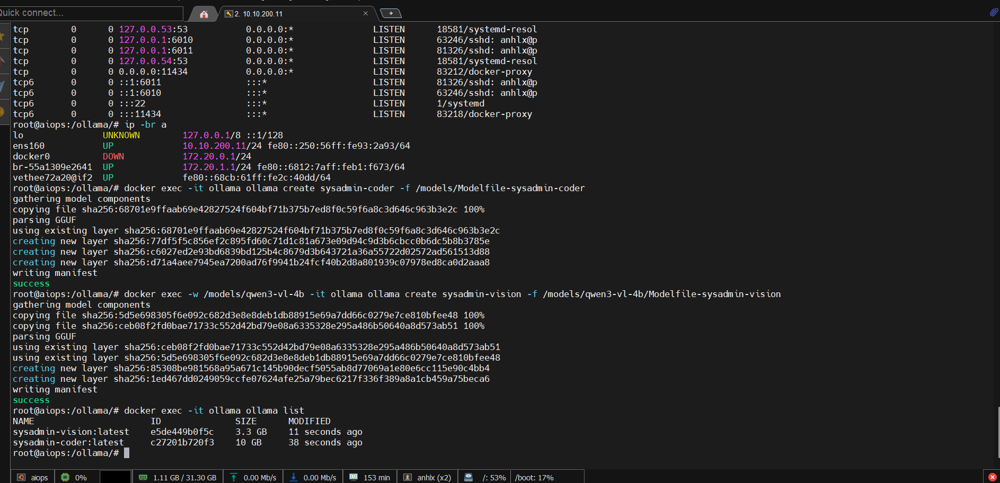


**Bước 5: Test cả 2 model**

```bash
# Test model TEXT (14b) - sinh script phức tạp
docker exec -it ollama ollama run sysadmin-coder "Viết script bash kiểm tra disk usage trên Linux, cảnh báo khi partition vượt 80%"

# Test model VISION (11b) - mô tả ảnh (test text mode)
docker exec -it ollama ollama run sysadmin-vision "Mô tả chi tiết những gì bạn thấy trong một Grafana dashboard điển hình có CPU, RAM, Disk"

```
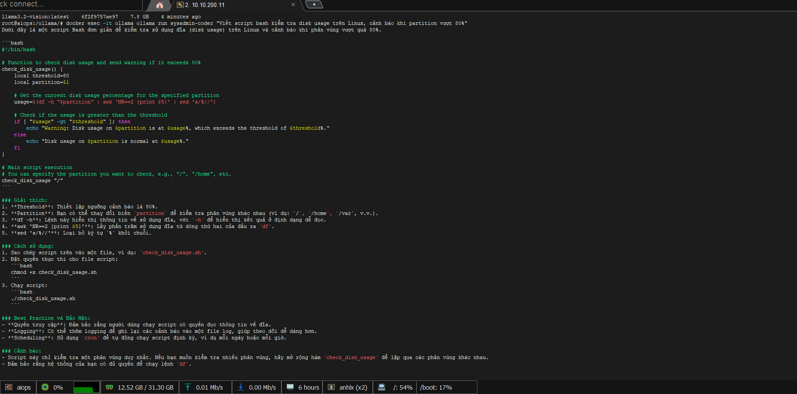

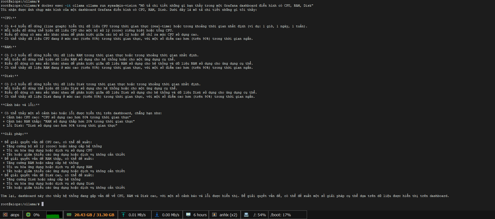


```bash
# So sánh tốc độ qua API
echo "=== TEXT (14b) ==="
time curl -s http://localhost:11434/api/generate -d '{
  "model": "sysadmin-coder",
  "prompt": "Liệt kê 5 lệnh kiểm tra disk trên Linux",
  "stream": false
}' | python3 -c "import sys,json; print(json.load(sys.stdin)['response'][:200])"

echo "=== VISION (11b) ==="
time curl -s http://localhost:11434/api/generate -d '{
  "model": "sysadmin-vision",
  "prompt": "Liệt kê 5 lệnh kiểm tra disk trên Linux",
  "stream": false
}' | python3 -c "import sys,json; print(json.load(sys.stdin)['response'][:200])"
```

> **Kiểm tra resource tiêu thụ:**
> ```bash
> docker stats ollama
> # Khi text model loaded: ~12-14GB RAM
> # Khi vision model loaded: ~8-10GB RAM
> ```

**(Tùy chọn) Tạo thêm model embedding cho RAG:**

```bash
# Pull embedding model (nhỏ, dùng model có sẵn của Ollama)
docker exec -it ollama ollama pull nomic-embed-text
```

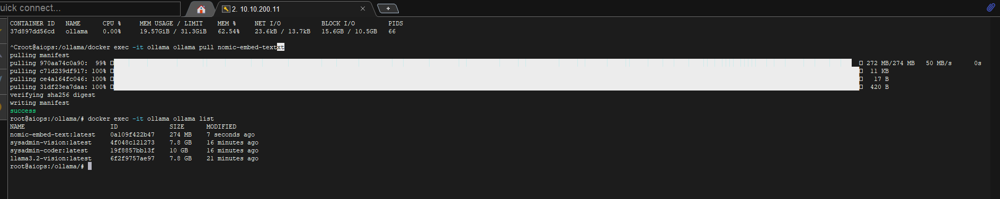

---

### 6. Triển khai Dify - AI Application Platform

Dify là nền tảng mã nguồn mở cho phép xây dựng AI application (chatbot, agent, RAG, workflow) với giao diện kéo thả trực quan.

**Clone Dify và cấu hình:**

```bash
cd /opt/ai-platform
git clone https://github.com/langgenius/dify.git
cd dify/docker
```

**Chỉnh sửa file `.env`:**

```bash
cp .env.example .env

# Tạo secret key random
SECRET_KEY=$(openssl rand -hex 32)

# Sửa các biến quan trọng trong .env
sed -i "s|^SECRET_KEY=.*|SECRET_KEY=${SECRET_KEY}|" .env
sed -i "s|^INIT_PASSWORD=.*|INIT_PASSWORD=YourStrongPassword123|" .env
sed -i "s|^STORAGE_TYPE=.*|STORAGE_TYPE=local|" .env
sed -i "s|^VECTOR_STORE=.*|VECTOR_STORE=weaviate|" .env
sed -i "s|^EXPOSE_NGINX_PORT=.*|EXPOSE_NGINX_PORT=80|" .env
sed -i "s|^EXPOSE_NGINX_SSL_PORT=.*|EXPOSE_NGINX_SSL_PORT=443|" .env
```

**Khởi chạy Dify:**

```bash
docker compose up -d

# Kiểm tra tất cả container đã chạy
docker compose ps
```

> Dify sẽ khởi chạy nhiều container: `api`, `worker`, `web`, `nginx`, `db` (PostgreSQL), `redis`, `weaviate`, `sandbox`, `ssrf_proxy`.

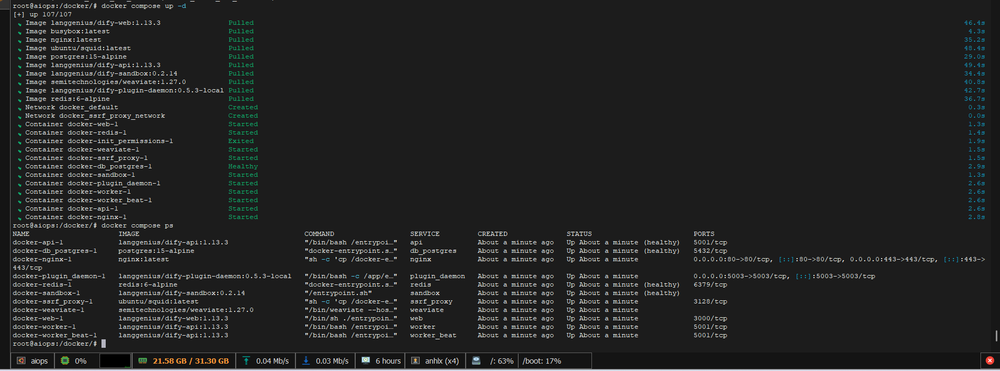


**Chờ khoảng 1-2 phút** cho tất cả service khởi động xong, sau đó truy cập:

```
http://<IP-VM>:80
```

- Lần đầu tiên sẽ hiện trang **đăng ký admin account**
- Tạo tài khoản admin với email và password

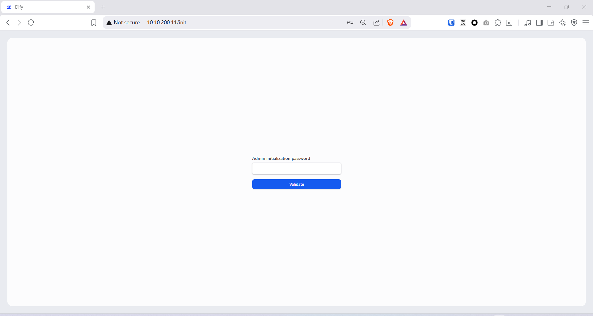

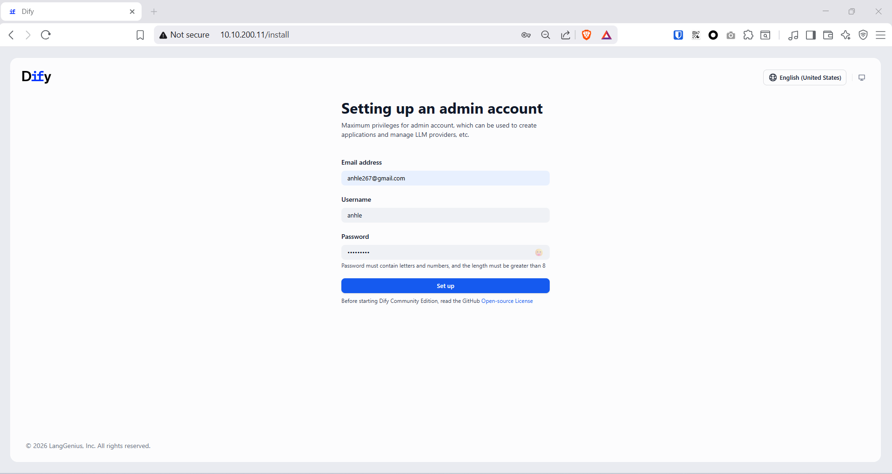

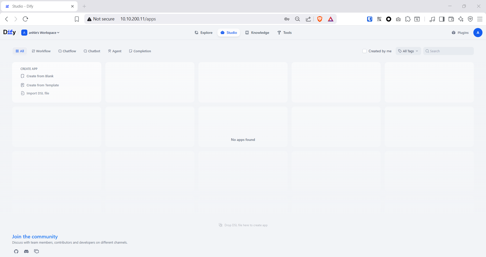

---

### 7. Triển khai n8n - Workflow Automation

n8n là nền tảng workflow automation mã nguồn mở, hỗ trợ hàng trăm integration node, bao gồm AI/LLM nodes.

```bash
cat <<'EOF' > /opt/ai-platform/n8n/docker-compose.yml
services:
  n8n:
    image: n8nio/n8n:latest
    container_name: n8n
    restart: unless-stopped
    ports:
      - "5678:5678"
    volumes:
      - n8n_data:/home/node/.n8n
    environment:
      - N8N_HOST=0.0.0.0
      - N8N_PORT=5678
      - N8N_PROTOCOL=http
      - WEBHOOK_URL=http://10.10.200.11:5678/
      - GENERIC_TIMEZONE=Asia/Ho_Chi_Minh
      - N8N_AI_ENABLED=true
      - N8N_SECURE_COOKIE=false
    networks:
      - ai-network

volumes:
  n8n_data:

networks:
  ai-network:
    external: true
    name: ai-network
EOF
```

> **Lưu ý:** `N8N_AI_ENABLED=true` kích hoạt AI nodes trong n8n (LangChain, AI Agent, etc.). `N8N_SECURE_COOKIE=false` bắt buộc khi truy cập qua HTTP — từ n8n v1.x mặc định bật secure cookie, truy cập qua IP:port HTTP sẽ bị chặn với lỗi *"configured to use a secure cookie"*. Network `ai-network` khai báo `external: true` vì đã được tạo bởi Ollama compose.

**Khởi chạy n8n:**

```bash
cd /opt/ai-platform/n8n
docker compose up -d

# Kiểm tra
docker logs n8n -f
```
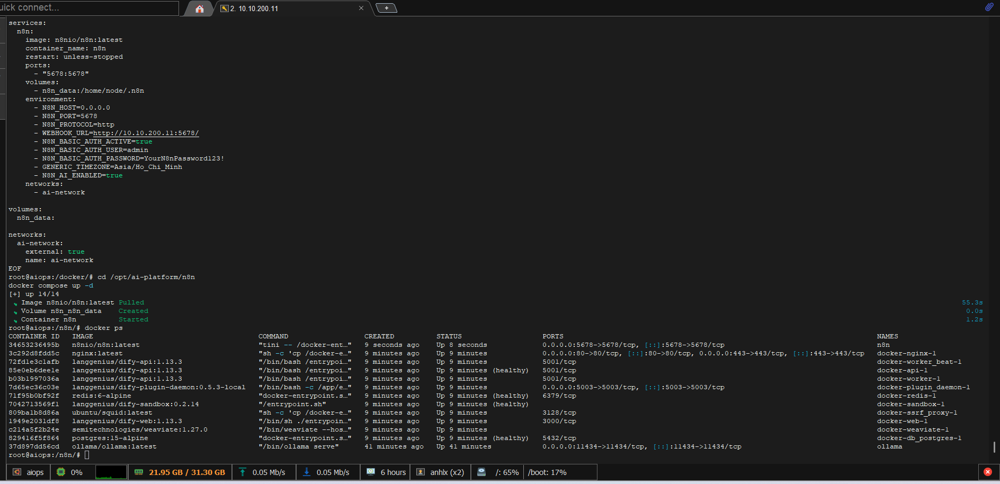

Truy cập n8n tại: `http://10.10.200.11:5678`

- **Lần đầu tiên** sẽ hiện trang **"Set up owner account"** — điền Email, First Name, Last Name, Password để tạo tài khoản owner
- Từ lần sau đăng nhập bằng email/password vừa tạo

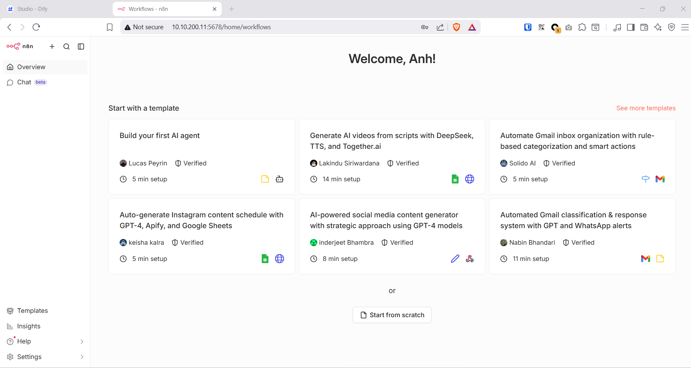

---

### 8. Tích hợp Ollama vào Dify

**Bước 1: Thêm Model Provider - sysadmin-coder (14b)**

1. Đăng nhập Dify → vào **Settings** (icon bánh răng góc trên phải)

2. Chọn **Model Provider** → tìm **Ollama**

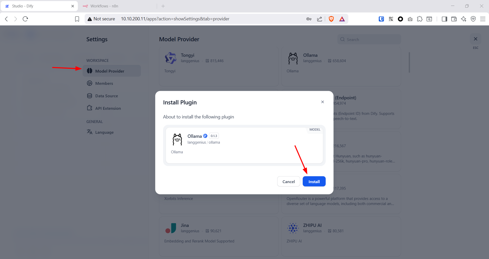

3. Click **Setup** và điền:
   - **Model Name:** `sysadmin-coder`
   - **Model Type:** `LLM`
   - **Base URL:** `http://10.10.200.11:11434/` (dùng IP host — Dify chạy network riêng, không resolve hostname `ollama`)
   - **Completion mode:** `Chat`
   - **Model context size:** `8192`
   - **Upper bound for max tokens:** `4096`
   - **Vision support:** `No`
   - **Function call support:** `No`

4. Click **Add** → Dify sẽ test kết nối đến Ollama

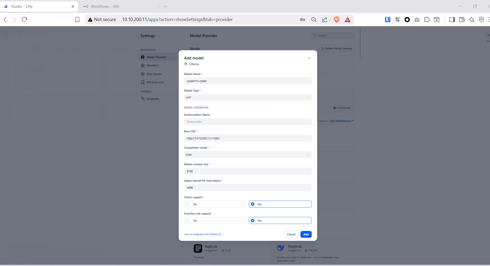


**Bước 2: Thêm Model Provider - Vision (11b)**

1. Quay lại **Model Provider** → **Ollama** → **Add Model**
2. Điền:
   - **Model Name:** `sysadmin-vision`
   - **Model Type:** `LLM`
   - **Base URL:** `http://10.10.200.11:11434/`
   - **Completion mode:** `Chat`
   - **Model context size:** `4096`
   - **Upper bound for max tokens:** `2048`
   - **Vision support:** `Yes` ← quan trọng, bật để Dify cho phép upload ảnh
   - **Function call support:** `No`

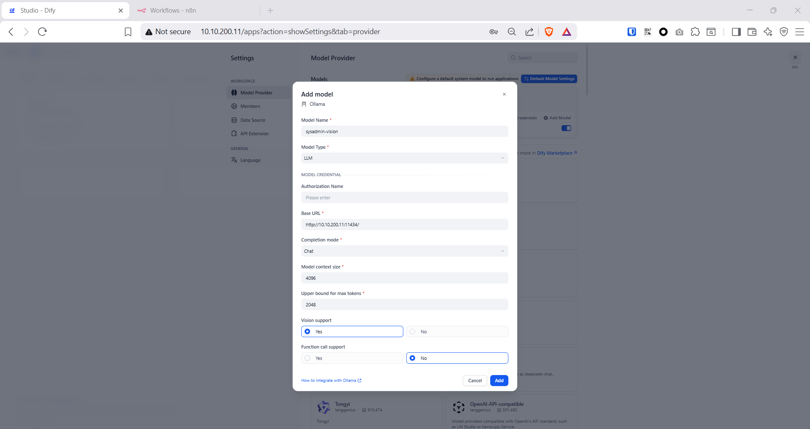

**Bước 3: Thêm Embedding Model (cho RAG)**

1. Tiếp tục **Add Model**:
   - **Model Name:** `nomic-embed-text`
   - **Model Type:** `Text Embedding`
   - **Base URL:** `http://10.10.200.11:11434/`
   - **Model context size:** `8192`

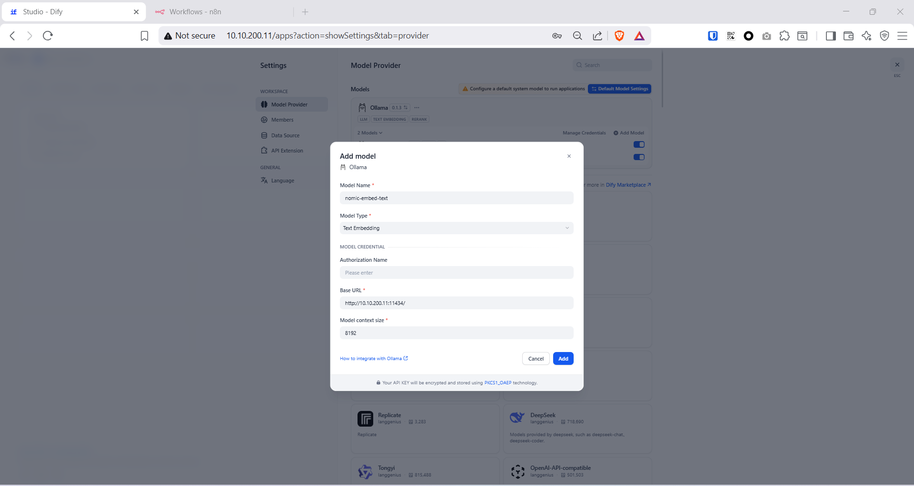

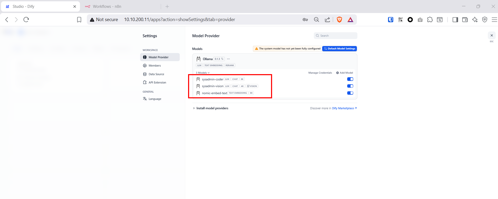


**Bước 4: Cấu hình System Model**

1. Vào **Settings** → **Model Provider** → click **Default Model Settings**
2. Chọn:
   - **System Reasoning Model:** `sysadmin-coder` (CHAT)
   - **Embedding Model:** `nomic-embed-text`
   - **Rerank Model:** bỏ trống (chưa cần)
   - **Speech-to-Text Model:** bỏ trống
   - **Text-to-Speech Model:** bỏ trống
3. Click **Save**

> **Lưu ý:** System Model chỉ là mặc định. Khi tạo từng App, ta sẽ chọn model phù hợp (coder cho text, vision cho phân tích ảnh).

> **Lưu ý Docker Network:** Dify chạy trong network riêng (`docker-dify`), không resolve được hostname `ollama`. Dùng **IP host** `http://10.10.200.11:11434/` cho tất cả model là cách đơn giản và ổn định nhất. Thêm trailing slash `/` vào Base URL để tránh lỗi 404 khi Dify gọi API Ollama.

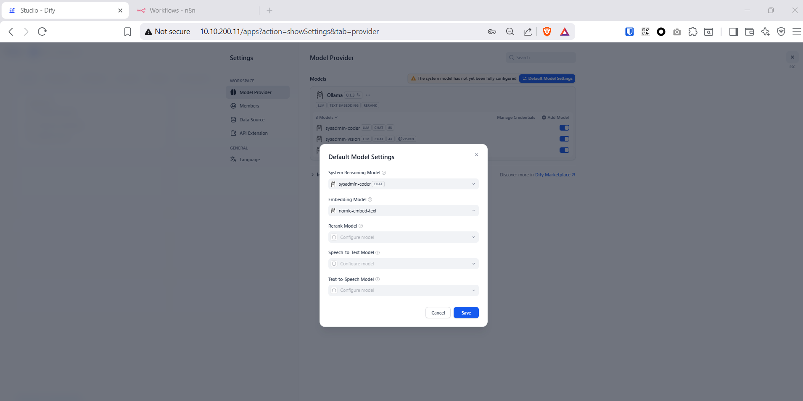

---

### 9. Tạo Dify App - SysAdmin Q&A Chatbot

Sau khi Ollama model đã được thêm vào Dify ở Section 8, bước tiếp theo là tạo **App** — đây là nơi đóng gói logic AI (system prompt, model, context) thành một chatbot hoàn chỉnh. App cũng cung cấp **API Key** để tích hợp với n8n và các hệ thống khác ở Section 10.

**Bước 1: Tạo App mới trong Dify Studio**

1. Đăng nhập Dify → sidebar trái → **Studio**
2. Click **Create from Blank**
3. Chọn loại App: **Chatbot**
4. Đặt tên: `SysAdmin Q&A`
5. Click **Create**

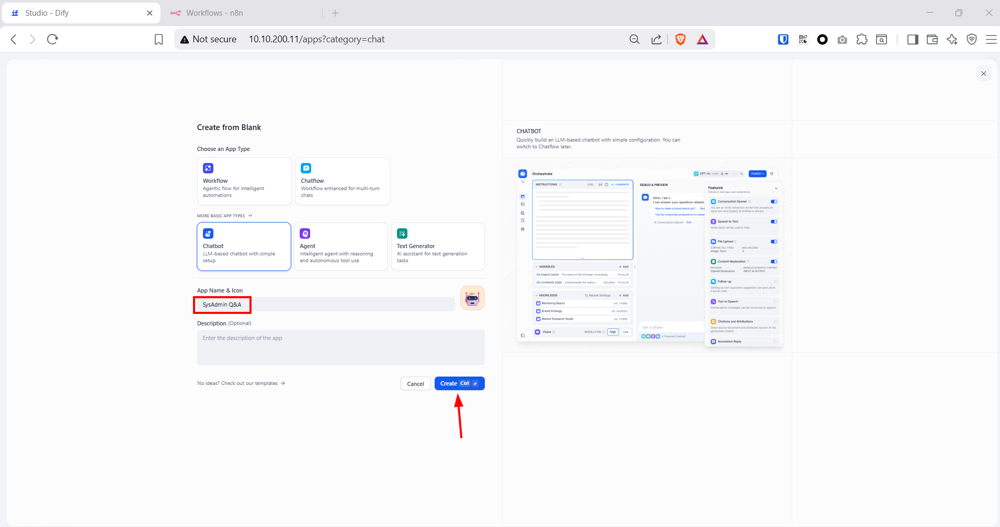

**Bước 2: Cấu hình Orchestrate**

Dify mở trang **Orchestrate** — giao diện thiết kế chatbot với 2 vùng chính: cấu hình bên trái và preview chat bên phải.

1. Tại ô **INSTRUCTIONS** (System Prompt), dán nội dung sau:

```
Bạn là System Engineer Assistant chuyên nghiệp, thành thạo Linux, Windows Server, networking và cloud infrastructure.

Nhiệm vụ:
- Trả lời câu hỏi kỹ thuật về Linux/Windows/networking/Docker/Kubernetes/Ceph
- Viết và giải thích script: Bash, PowerShell, Ansible, Terraform, Python
- Phân tích log, tìm nguyên nhân lỗi và đề xuất fix cụ thể
- Hướng dẫn cấu hình dịch vụ: HAProxy, Nginx, Keepalived, Active Directory, DNS, GPO
- Tạo tài liệu kỹ thuật: runbook, SOP, post-mortem, change request

Quy tắc:
- Trả lời bằng tiếng Việt
- Cung cấp lệnh/script cụ thể, có thể chạy ngay
- Giải thích từng bước, kèm ví dụ thực tế
- Cảnh báo nếu lệnh nguy hiểm (rm -rf, fdisk, iptables flush, Format-Volume...)
- Đề xuất best practice và lưu ý bảo mật
- Nếu không chắc chắn, nói rõ và đề xuất cách kiểm tra thêm
```

2. **Model** — click dropdown model (góc trên phải khu vực chat preview) → chọn **sysadmin-coder**

3. **CONTEXT** — bỏ trống (sẽ thêm Knowledge Base ở Use Case 1)

**Bước 3: Test trực tiếp trong Dify**

Dùng ô chat bên phải để test ngay trước khi publish:

- *"Hướng dẫn cấu hình HAProxy load balancing cho 3 backend web server Ubuntu"*
- *"Viết script bash kiểm tra disk usage tất cả partition, cảnh báo khi vượt 80%"*
- *"Phân tích log: `kernel: [UFW BLOCK] IN=ens192 SRC=1.2.3.4 DPT=22` — nguyên nhân là gì?"*
- *"Viết Ansible playbook deploy Docker lên 10 server Ubuntu 24.04"*

> **Lưu ý:** Response đầu tiên mất **20-60 giây** (Ollama load model vào RAM). Từ lần 2 trở đi nhanh hơn do model đã warm. Nếu timeout, kiểm tra `docker logs ollama -f` để xem trạng thái load.

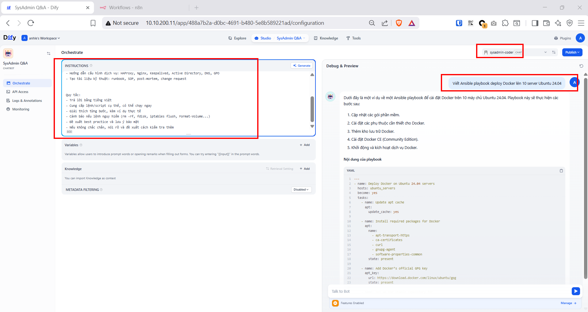

**Bước 4: Publish App**

1. Click **Publish** (góc trên phải) → **Publish** để chính thức phát hành
2. App sẽ có URL truy cập dạng: `http://10.10.200.11:80/chat/<app-id>`


**Bước 5: Lấy API Key**

1. Sau khi publish, click **API Access** (menu trái, biểu tượng `</>`)
2. Click **Create API Key**
3. Copy key dạng `app-xxxxxxxxxxxxxxxxxxxxxxxx` → lưu lại

> **API Key này dùng ở Section 10** để n8n gọi vào App. Mỗi App có key riêng — sau này tạo thêm App (script gen, vision...) sẽ có key khác nhau. Endpoint chung cho tất cả App: `http://10.10.200.11:80/v1`


---

### 10. Tích hợp n8n với Ollama & Dify API

Sau khi có App và API Key từ Section 9, n8n có thể kết nối với AI theo 2 cách:

| | Cách 1: n8n → Ollama trực tiếp | Cách 2: n8n → Dify API |
|---|---|---|
| **Khi nào dùng** | Prompt đơn giản, không cần RAG | Cần RAG, vision, pipeline Dify phức tạp |
| **Ưu điểm** | Ít bước, latency thấp hơn 1 hop | Dùng được toàn bộ logic đã thiết kế trong Dify App |
| **Setup** | Tạo Credential Ollama trong n8n | HTTP Request node + API Key |

---

**Cách 1: n8n → Ollama trực tiếp**

Phù hợp cho workflow đơn giản: alert triage, sinh script ngắn, classify text — không cần knowledge base.

**Bước 1: Tạo Credential Ollama trong n8n**

1. Trong n8n → sidebar trái → **Credentials** → **Add Credential**
2. Tìm kiếm và chọn **Ollama API**
3. **Base URL:** `http://ollama:11434`
   - n8n và Ollama cùng `ai-network` → resolve hostname `ollama` trực tiếp, không cần dùng IP
4. Click **Save** — n8n sẽ test kết nối ngay

**Bước 2: Dùng AI nodes trong Workflow**

Tạo workflow mới, thêm các node theo use case:

- **Basic LLM Chain**: pipeline đơn giản — thêm **Ollama Chat Model** sub-node, chọn credential vừa tạo, chọn model `sysadmin-coder`
- **AI Agent**: agent có tool-calling, chọn `sysadmin-coder` làm LLM backbone
- **Chat Memory**: thêm conversation memory vào AI Agent nếu cần multi-turn

---

**Cách 2: n8n → Dify API**

Dùng App `SysAdmin Q&A` đã tạo ở Section 9. n8n gửi HTTP request đến Dify, Dify xử lý AI (bao gồm RAG nếu có) rồi trả kết quả về.

**Bước 1: Thêm HTTP Request node trong workflow n8n**

Cấu hình node:
- **Method:** `POST`
- **URL:** `http://10.10.200.11:80/v1/chat-messages`
- **Authentication:** `Header Auth`
  - Header Name: `Authorization`
  - Header Value: `Bearer app-xxxxxxxxxxxxxxxx` ← API Key từ Section 9, Bước 5
- **Body Content Type:** `JSON`
- **Body:**

```json
{
  "inputs": {},
  "query": "{{ $json.message }}",
  "response_mode": "blocking",
  "conversation_id": "",
  "user": "n8n-bot",
  "files": []
}
```

**Bước 2: Parse kết quả**

Dify trả về JSON, nội dung AI nằm tại trường `answer`:

```json
{
  "answer": "Nội dung trả lời của AI...",
  "conversation_id": "xxx",
  "message_id": "xxx"
}
```

Trong node tiếp theo, tham chiếu bằng: `{{ $json.answer }}`

**Bước 3: Gửi ảnh qua Dify API (vision workflow)**

Khi App được config với model `sysadmin-vision` (Vision support = Yes), có thể gửi kèm ảnh:

```json
{
  "inputs": {},
  "query": "Phân tích screenshot lỗi này và đề xuất fix",
  "response_mode": "blocking",
  "user": "n8n-bot",
  "files": [
    {
      "type": "image",
      "transfer_method": "remote_url",
      "url": "{{ $json.screenshot_url }}"
    }
  ]
}
```

> **Kiến trúc khi dùng Cách 2:** n8n đóng vai **orchestrator** — nhận event từ monitoring/webhook, quyết định gọi Dify App nào (Q&A text, vision hay script gen), parse trường `answer`, rồi route kết quả đến Slack/Telegram/Jira. Dify lo phần AI reasoning và RAG retrieval. Phân tách rõ ràng: **n8n = workflow logic**, **Dify = AI brain**.

---

### 11. Use Case 2 - Tự động phân tích log & tạo ticket

Xây dựng workflow n8n: nhận alert từ Prometheus Alertmanager → AI phân tích → tạo ticket.

**Workflow n8n:**

```
[Webhook] → [Set Fields] → [Ollama Chat] → [IF severity] → [Create Ticket / Send Telegram]
```

**Bước 1: Tạo Webhook node**

1. Tạo workflow mới trong n8n
2. Thêm node **Webhook**:
   - HTTP Method: `POST`
   - Path: `alert-ai-analysis`
   - Copy webhook URL: `http://<IP-VM>:5678/webhook/alert-ai-analysis`

**Bước 2: Thêm Ollama Chat Model node**

1. Thêm node **Basic LLM Chain** hoặc **AI Agent**
2. Kết nối với **Ollama Chat Model**:
   - Model: `sysadmin-coder` — dùng model text cho alert triage (phân tích log và output JSON)
3. Prompt template:

```
Bạn là AI phân tích alert cho hệ thống giám sát. Phân tích alert sau và trả về JSON:

Alert: {{ $json.alertname }}
Severity: {{ $json.severity }}
Instance: {{ $json.instance }}
Description: {{ $json.description }}
Value: {{ $json.value }}

Trả về JSON format:
{
  "summary": "Tóm tắt ngắn gọn",
  "root_cause": "Nguyên nhân có thể",
  "impact": "Ảnh hưởng đến hệ thống",
  "action_required": ["Bước 1", "Bước 2", "..."],
  "priority": "critical/high/medium/low",
  "auto_fix_script": "Script tự động fix nếu có thể (hoặc null)"
}
```

**Bước 3: Cấu hình Alertmanager gửi webhook**

```yaml
# alertmanager.yml
route:
  receiver: 'n8n-ai'
  
receivers:
  - name: 'n8n-ai'
    webhook_configs:
      - url: 'http://10.10.200.11:5678/webhook/alert-ai-analysis'
        send_resolved: true
```

**Bước 4: Thêm logic xử lý kết quả**

- Node **IF**: Kiểm tra priority
  - `critical/high` → Gọi `sysadmin-coder` (14b) phân tích sâu + `sysadmin-vision` (11b) nếu có ảnh đính kèm → Gửi Telegram + tạo ticket kèm root cause analysis
  - `medium/low` → Ghi log + gửi email summary

> **Dual-model trong workflow:** `sysadmin-coder` (14b) phân tích log text và phân loại alert. Khi alert có đính kèm screenshot (Grafana, Zabbix screen capture), gọi thêm `sysadmin-vision` (11b) để AI nhìn ảnh và bổ sung phân tích.

---

### 12. Use Case 3 - Sinh script Bash/Ansible tự động

**Workflow Dify: Script Generator Agent**

1. Tạo **Agent** mới trong Dify
2. Cấu hình:
   - **Model:** `sysadmin-coder` — dùng model text (14b) vì cần sinh code chính xác, có error handling
   - **Agent Mode:** Function Calling
3. System Prompt:

```
Bạn là Script Generator cho System Engineer. Khi user mô tả yêu cầu:

1. Hỏi rõ: target OS, số lượng server, yêu cầu cụ thể
2. Sinh script hoàn chỉnh (Bash/Ansible/Terraform tùy yêu cầu)
3. Thêm error handling, logging, và validation
4. Giải thích từng phần quan trọng
5. Cung cấp hướng dẫn chạy script

Output format:
- Script có comment rõ ràng
- Có biến cấu hình ở đầu file
- Có dry-run mode nếu có thể
- Tuân thủ best practices (shellcheck, ansible-lint)
```

**Ví dụ prompt:**
> "Tạo Ansible playbook triển khai cluster Kubernetes 3 node (1 master + 2 worker) trên Ubuntu 24.04 với Cilium CNI"

**Tích hợp vào n8n workflow:**

```
[Telegram Bot] → [Dify API] → [Parse Response] → [Send Script to Telegram/Email]
```

---

### 13. Use Case 4 - Tạo tài liệu kỹ thuật tự động

**Workflow: Tự động tạo Post-Mortem Report**

1. Input: Mô tả sự cố (thời gian, hệ thống affected, symptom)
2. AI sinh ra post-mortem template đầy đủ:
   - Timeline sự kiện
   - Root Cause Analysis
   - Impact Assessment
   - Action Items
   - Prevention measures

**Prompt template trong Dify:**

```
Tạo Post-Mortem Report theo template sau dựa trên thông tin sự cố:

## Post-Mortem Report
**Incident ID:** [Auto-generate]
**Date:** [Current date]
**Author:** System AI Assistant
**Status:** Draft - Cần review bởi engineer

### 1. Tóm tắt sự cố
### 2. Timeline
### 3. Root Cause Analysis (5 Whys)
### 4. Impact
### 5. Mitigation & Resolution
### 6. Action Items
### 7. Lessons Learned

Thông tin sự cố: {user_input}
```

---

### 14. Tối ưu hiệu năng & Monitoring

**Kiểm tra resource usage:**

```bash
# Tổng quan tất cả container
docker stats --no-stream

# Kiểm tra disk usage
docker system df -v

# Kiểm tra Ollama model loaded
curl -s http://localhost:11434/api/ps | python3 -m json.tool
```

**Tối ưu Ollama cho CPU-only inference (config tham khảo cho VM <32GB RAM):**

> **Lưu ý:** Config bên dưới là ví dụ tham khảo cho VM có RAM hạn chế (16-24GB). **Với lab 32GB này**, config thực tế đã được đặt ở Bước 1 Section 5 (`NUM_PARALLEL=1, MAX_LOADED_MODELS=2, KEEP_ALIVE=60m`).

```bash
# Tham khảo: cấu hình bảo thủ cho VM <32GB RAM
docker exec -it ollama bash
export OLLAMA_NUM_PARALLEL=1        # 1 request đồng thời, tiết kiệm KV cache RAM
export OLLAMA_MAX_LOADED_MODELS=1   # Load 1 model tại 1 thời điểm, tự swap khi cần
```

**Hoặc chỉnh docker-compose Ollama (cho VM <32GB RAM):**

```yaml
environment:
  - OLLAMA_HOST=0.0.0.0
  - OLLAMA_NUM_PARALLEL=1
  - OLLAMA_MAX_LOADED_MODELS=1      # Ollama tự swap model khi gọi model khác
  - OLLAMA_KEEP_ALIVE=10m           # Unload model sau 10 phút không dùng
```

> **Tip: Load cả 2 model đồng thời để loại bỏ swap delay (~3-5s)**
> Với VM 32GB RAM, có thể load cả 2 model vào RAM cùng lúc — không cần chờ swap khi chuyển model:
> ```yaml
> # Cập nhật docker-compose Ollama (environment):
>   - OLLAMA_MAX_LOADED_MODELS=2    # Load cả 2 model đồng thời
>   - OLLAMA_NUM_PARALLEL=1         # Giảm xuống 1 để tiết kiệm KV cache RAM
>   - OLLAMA_KEEP_ALIVE=60m         # Giữ model lâu hơn trong RAM
> ```
> Sau khi restart Ollama, pre-warm cả 2 model:
> ```bash
> # Pre-load cả 2 model vào RAM ngay lập tức
> curl -s http://localhost:11434/api/generate -d '{"model":"sysadmin-coder","prompt":"","keep_alive":"60m"}' > /dev/null
> curl -s http://localhost:11434/api/generate -d '{"model":"sysadmin-vision","prompt":"","keep_alive":"60m"}' > /dev/null
> # Kiểm tra cả 2 đang loaded trong RAM
> curl -s http://localhost:11434/api/ps | python3 -m json.tool
> ```
> **Tính toán RAM:** ~13GB (text) + ~9GB (vision) + ~6GB (services/OS) = **~28GB** → còn ~4GB free + 8GB swap làm đệm an toàn.
> **Đánh đổi:** `OLLAMA_NUM_PARALLEL=1` (1 request đồng thời) thay vì 2 — đủ cho lab 1-2 user. Nếu cần nhiều user đồng thời, giữ `MAX_LOADED_MODELS=1`.

**Monitoring với ctop:**

```bash
# Cài ctop để monitor container realtime
sudo wget https://github.com/bcicen/ctop/releases/download/v0.7.7/ctop-0.7.7-linux-amd64 -O /usr/local/bin/ctop
sudo chmod +x /usr/local/bin/ctop
ctop
```

**Phân bổ tài nguyên ước tính:**

| Service | RAM (idle) | RAM (active) | CPU |
|---|---|---|---|
| Ollama + sysadmin-coder (14b Q5_K_M) | ~2 GB | ~13 GB | **~8 core** (num_thread=8) |
| Ollama + sysadmin-vision (Llama 3.2 Vision 11b) | ~1 GB | ~9 GB | 4-8 cores |
| Dify (all containers) | ~2 GB | ~4 GB | 2-4 cores |
| n8n | ~256 MB | ~512 MB | 1-2 cores |
| OS + Docker | ~1.5 GB | ~2 GB | - |
| **Tổng (1 model loaded + services)** | **~7 GB** | **~19 GB** | **16 cores** |
| **Tổng (2 model loaded đồng thời)** | **~7 GB** | **~28 GB** | **16 cores** |

> Với `OLLAMA_MAX_LOADED_MODELS=1` (mặc định): swap khi đổi model mất ~3-5s, an toàn nhất, headroom ~13GB. Với `OLLAMA_MAX_LOADED_MODELS=2`: cả 2 model loaded sẵn trong RAM, **không có swap delay**, tổng ~28GB/32GB — phù hợp lab 32GB có swap 8GB làm đệm.
> `num_ctx` được đặt 8192 (text) và 4096 (vision) để cân bằng giữa chất lượng và RAM. Nếu cần context dài hơn, tăng `num_ctx` nhưng phải giảm `OLLAMA_NUM_PARALLEL`.

**Backup dữ liệu:**

```bash
# Backup volumes
mkdir -p ~/backup

# Backup Dify data
docker compose -f /opt/ai-platform/dify/docker/docker-compose.yml exec db pg_dump -U postgres dify > ~/backup/dify-db-$(date +%Y%m%d).sql

# Backup n8n data
docker cp n8n:/home/node/.n8n ~/backup/n8n-data-$(date +%Y%m%d)

# Backup Ollama models
docker cp ollama:/root/.ollama ~/backup/ollama-data-$(date +%Y%m%d)
```

---

### 15. Kết luận

Bài lab đã hướng dẫn xây dựng một **AI Platform hoàn chỉnh tự host** trên một VM duy nhất (16 CPU, 32GB RAM, 100GB disk) với:

| Thành phần | URL | Chức năng |
|---|---|---|
| Ollama | `http://<IP>:11434` | LLM inference engine (text + vision) |
| Dify | `http://<IP>:80` | AI app builder (chatbot, agent, RAG) |
| n8n | `http://<IP>:5678` | Workflow automation + AI integration |

**Điểm mạnh của kiến trúc:**
- **100% self-hosted** - Không phụ thuộc API bên ngoài, dữ liệu không rời khỏi nội bộ
- **Chiến lược dual-model Text + Vision** - `sysadmin-coder` (14b) cho code/log/tài liệu/chatbot, `sysadmin-vision` (Llama 3.2 Vision 11b) cho phân tích ảnh/screenshot/diagram/OCR
- **Linh hoạt nguồn model** - Text model: GGUF từ Hugging Face (kiểm soát quantize), Vision model: `ollama pull llama3.2-vision` (native multimodal Meta, tiếng Việt ổn định), tùy chỉnh Modelfile riêng cho từng use case, chạy tốt trên CPU-only
- **Dify** - Giao diện trực quan, dễ tạo chatbot/agent mà không cần code
- **n8n** - Kết nối AI với hệ thống monitoring/ticketing/communication hiện có, routing text/vision model theo tác vụ
- **Chi phí bằng 0** - Tất cả đều open-source, chỉ cần 1 VM

**Hướng phát triển tiếp:**
- Thêm GPU passthrough (nếu có) để tăng tốc inference 5-10x
- Tích hợp với Grafana OnCall, PagerDuty, Jira
- Xây dựng knowledge base từ wiki/confluence nội bộ
- Fine-tune model trên dữ liệu sự cố nội bộ
- Deploy High Availability với nhiều node Ollama
- Thêm model chuyên biệt (code review, security audit) khi có thêm RAM
- Thêm workflow vision: chụp màn hình Grafana tự động → AI phân tích dashboard → báo cáo weekly
