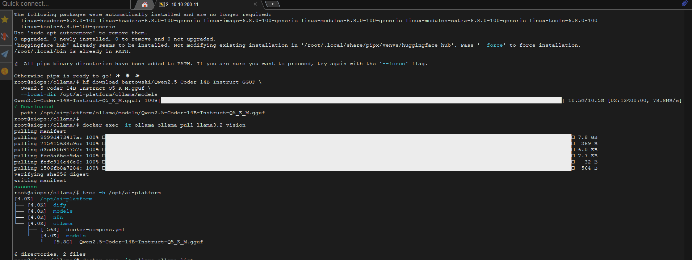

### Mục lục

- [Mục lục](#mục-lục)
- [1. Giới thiệu \& Ý tưởng Lab](#1-giới-thiệu--ý-tưởng-lab)
- [2. Kiến trúc tổng quan](#2-kiến-trúc-tổng-quan)
- [3. Chuẩn bị VM \& Cài đặt Ubuntu Server 24.04](#3-chuẩn-bị-vm--cài-đặt-ubuntu-server-2404)
- [4. Cài đặt Docker \& Docker Compose](#4-cài-đặt-docker--docker-compose)
- [5. Triển khai Ollama \& Custom model từ Hugging Face](#5-triển-khai-ollama--custom-model-từ-hugging-face)
- [6. Triển khai Dify - AI Application Platform](#6-triển-khai-dify---ai-application-platform)
- [7. Triển khai n8n - Workflow Automation](#7-triển-khai-n8n---workflow-automation)
- [8. Tích hợp Ollama vào Dify](#8-tích-hợp-ollama-vào-dify)
- [9. Tích hợp Ollama/Dify vào n8n](#9-tích-hợp-ollamadify-vào-n8n)
- [10. Use Case 1 - Chatbot hỗ trợ SysAdmin](#10-use-case-1---chatbot-hỗ-trợ-sysadmin)
- [11. Use Case 2 - Tự động phân tích log \& tạo ticket](#11-use-case-2---tự-động-phân-tích-log--tạo-ticket)
- [12. Use Case 3 - Sinh script Bash/Ansible tự động](#12-use-case-3---sinh-script-bashansible-tự-động)
- [13. Use Case 4 - Tạo tài liệu kỹ thuật tự động](#13-use-case-4---tạo-tài-liệu-kỹ-thuật-tự-động)
- [14. Tối ưu hiệu năng \& Monitoring](#14-tối-ưu-hiệu-năng--monitoring)
- [15. Kết luận](#15-kết-luận)

---

### 1. Giới thiệu & Ý tưởng Lab

Trong công việc hàng ngày, System Engineer thường phải xử lý nhiều tác vụ lặp đi lặp lại: viết script, phân tích log, troubleshoot sự cố, tạo tài liệu kỹ thuật, hỗ trợ NOC/SOC... Việc tích hợp AI vào quy trình làm việc giúp tăng năng suất đáng kể.

Bài lab này xây dựng một **AI Platform tự host hoàn toàn nội bộ** (không cần internet, không gửi dữ liệu ra ngoài) trên một VM duy nhất, bao gồm 3 thành phần chính:

| Thành phần | Vai trò | Port |
|---|---|---|
| **Ollama** | Chạy LLM model cục bộ (Text + Vision GGUF từ Hugging Face) | `11434` |
| **Dify** | Nền tảng xây dựng AI app, chatbot, agent, RAG pipeline | `80` |
| **n8n** | Nền tảng workflow automation, kết nối AI với hệ thống giám sát/ticketing | `5678` |

**Chiến lược Dual-Model: Text + Vision**

Thay vì dùng 1 model text cho mọi tác vụ, lab này triển khai **2 model chuyên biệt** trên cùng Ollama — 1 model text mạnh cho code/analysis và 1 model vision cho xử lý hình ảnh:

| Model | Base | Quantize | Size | RAM | Vai trò |
|---|---|---|---|---|---|
| **sysadmin-coder** | Qwen2.5-Coder:**14b** | Q5_K_M | ~10 GB | ~13 GB | **Text** - sinh script, phân tích log, viết tài liệu, chatbot Q&A |
| **sysadmin-vision** | Qwen3-VL:**4b** | Q4_K_M | ~3.3 GB | ~5 GB | **Vision** - phân tích screenshot, đọc diagram, OCR log từ ảnh |

> **Tại sao dual-model Text + Vision?**
> - Mỗi model chuyên biệt cho 1 loại tác vụ: text model cho code/analysis, vision model cho hình ảnh
> - Model 14b text cho output chính xác, sinh script mạnh (~5-10 token/s trên CPU)
> - Model 4b vision nhẹ (~3.3 GB GGUF), nhận diện screenshot, đọc diagram, OCR nhanh
> - Với 32GB RAM: load cả 2 model = ~13GB + ~5GB + ~6GB (Dify/n8n/OS) = ~24GB → còn 8GB headroom
> - Dify/n8n cho phép chọn model khác nhau cho mỗi app/workflow

**Phân công model theo Use Case:**

| Use Case | Model | Lý do |
|---|---|---|
| Chatbot SysAdmin Q&A | `sysadmin-coder` (14b) | Chính xác cao cho hỏi đáp kỹ thuật |
| Sinh script Bash/Ansible | `sysadmin-coder` (14b) | Cần chính xác cao, code phức tạp |
| Phân tích log text | `sysadmin-coder` (14b) | Cần hiểu context dài, reasoning sâu |
| Phân loại alert & triage | `sysadmin-coder` (14b) | Output JSON, phân tích nguyên nhân |
| Tạo tài liệu kỹ thuật | `sysadmin-coder` (14b) | Output dài, cần chất lượng cao |
| Phân tích screenshot lỗi | `sysadmin-vision` (4b) | Nhìn ảnh Grafana/error → đề xuất fix |
| Đọc diagram/topology | `sysadmin-vision` (4b) | Upload sơ đồ mạng → AI mô tả kiến trúc |
| OCR log từ ảnh | `sysadmin-vision` (4b) | Chụp màn hình log → AI đọc và phân tích |
| Nhận diện phần cứng từ ảnh | `sysadmin-vision` (4b) | Chụp rack/switch → AI nhận diện thiết bị |

**Tại sao chọn 2 model này?**

| Tiêu chí | sysadmin-coder (Qwen2.5-Coder:14b) | sysadmin-vision (Qwen3-VL:4b) |
|---|---|---|
| Sinh script Bash/Ansible | **Xuất sắc** (HumanEval 92.9%) | Không hỗ trợ |
| Phân tích log text | **Rất tốt** - context 128K | Cơ bản |
| Nhìn screenshot/dashboard | Không hỗ trợ | **Rất tốt** - mô tả + đề xuất fix |
| Đọc diagram/topology | Không hỗ trợ | **Rất tốt** - OCR 32 ngôn ngữ |
| OCR log từ ảnh chụp | Không hỗ trợ | **Xuất sắc** - đọc text từ ảnh |
| Tốc độ inference (CPU) | 5-10 tok/s | **15-25 tok/s** (model nhẹ) |
| Context window | **128K** | **256K** (hỗ trợ ảnh + text) |
| RAM cần thiết | ~13 GB (Q5_K_M) | ~5 GB (Q4_K_M + mmproj) |
| Nguồn GGUF | bartowski (Hugging Face) | bartowski (Hugging Face) |

> **Tip:** Nếu VM chỉ có 16GB RAM, chỉ dùng `sysadmin-coder` (14b) cho text — bỏ vision model

**Mục tiêu lab:**
- Chatbot SysAdmin hỏi đáp về Linux, Windows Server, networking, troubleshooting
- Tự động phân tích log từ syslog/Prometheus alert → đề xuất fix
- Sinh script Bash/Ansible/Terraform từ mô tả bằng ngôn ngữ tự nhiên
- Tạo tài liệu kỹ thuật (runbook, post-mortem) tự động
- Workflow tự động: Alert → AI phân tích → Tạo ticket → Gửi thông báo
- **Phân tích screenshot** Grafana/error page → AI nhìn ảnh và đề xuất giải pháp
- **Đọc diagram/topology** → AI mô tả kiến trúc mạng từ ảnh
- **OCR log từ ảnh** → Chụp màn hình log → AI đọc và phân tích

---

### 2. Kiến trúc tổng quan

```
┌─────────────────────────────────────────────────────────────────┐
│                   VM: aiops (Ubuntu 24.04)                      │
│              16 CPU │ 32 GB RAM │ 100 GB Disk                   │
│                    10.10.200.11                                 │
│                                                                 │
│  ┌─────────────┐   ┌──────────────────┐   ┌──────────────────┐  │
│  │   Ollama    │   │      Dify        │   │       n8n        │  │
│  │  :11434     │   │      :80         │   │      :5678       │  │
│  │             │   │                  │   │                  │  │
│  │ ┌─────────┐ │   │ ┌──────────────┐ │   │ ┌──────────────┐ │  │
│  │ │Text 14b │ │◄──┤ │ Script Gen   │ │   │ │ Alert Triage │ │  │
│  │ │ (Q5_K_M)│ │   │ │ Deep Analyze │ │   │ │ Chatbot Q&A  │ │  │
│  │ ├─────────┤ │   │ │ Tech Docs    │ │   │ ├──────────────┤ │  │
│  │ │Vision 4b│ │◄──┤ ├──────────────┤ │   │ │ Screenshot   │ │  │
│  │ │(Qwen3VL)│ │   │ │ Chatbot Q&A  │ │   │ │ Analysis     │ │  │
│  │ └─────────┘ │   │ │ OCR Ảnh      │ │   │ └──────┬───────┘ │  │
│  └──────▲──────┘   └──────────────────┘   └────────┼─────────┘  │
│         │                                          │            │
│         └──────────────────────────────────────────┘            │
│                     Ollama API (:11434)                         │
│                                                                 │
│  ┌─────────┐  ┌───────────┐  ┌──────────┐  ┌──────────────────┐ │
│  │ Docker  │  │ PostgreSQL│  │  Redis   │  │   Weaviate/      │ │
│  │ Engine  │  │ (Dify DB) │  │ (Cache)  │  │   Qdrant (RAG)   │ │
│  └─────────┘  └───────────┘  └──────────┘  └──────────────────┘ │
└─────────────────────────────────────────────────────────────────┘
```

**Luồng hoạt động:**
1. **User → Dify**: Truy cập giao diện web Dify để chat, hỏi đáp với AI chatbot
2. **Dify → Ollama**: Dify gửi prompt/ảnh đến Ollama API — text query dùng `sysadmin-coder` (14b), ảnh dùng `sysadmin-vision` (4b)
3. **n8n → Ollama/Dify**: n8n nhận webhook từ hệ thống giám sát (Prometheus, Zabbix...), gọi AI phân tích, rồi tạo ticket/gửi thông báo
4. **Dify RAG**: Upload tài liệu kỹ thuật (runbook, KB) → Dify vector hóa và lưu vào vector database → AI trả lời dựa trên knowledge base nội bộ

---

### 3. Chuẩn bị VM & Cài đặt Ubuntu Server 24.04

**Thông số VM trên vSphere:**

| Thông số | Giá trị |
|---|---|
| VM Name | aiops |
| CPU | 16 vCPU |
| Memory | 32 GB |
| Hard Disk | 100 GB |
| Network | 10.10.200.11 |

> **Lưu ý:** 100 GB disk cần phân bổ hợp lý: ~25GB cho OS + Docker images, ~15GB cho model text (14b) + vision (4b), ~30GB cho Dify data/vector DB, ~30GB còn lại cho log/data.

**Cài đặt Ubuntu Server 24.04 LTS** với cấu hình cơ bản:

```bash
# Cập nhật hệ thống
sudo apt update && sudo apt upgrade -y

# Cài đặt các package cần thiết
sudo apt install -y curl wget git vi htop net-tools ca-certificates gnupg lsb-release

# Cấu hình hostname
sudo hostnamectl set-hostname aiops
```

**Cấu hình swap (khuyến nghị cho LLM inference):**

```bash
# Tạo swap 8GB (hỗ trợ khi model cần thêm RAM)
sudo fallocate -l 8G /swapfile
sudo chmod 600 /swapfile
sudo mkswap /swapfile
sudo swapon /swapfile

# Thêm vào fstab để tự mount khi reboot
echo '/swapfile none swap sw 0 0' | sudo tee -a /etc/fstab

# Giảm swappiness (ưu tiên dùng RAM)
echo 'vm.swappiness=10' | sudo tee -a /etc/sysctl.conf
sudo sysctl -p
```

---

### 4. Cài đặt Docker & Docker Compose

```bash
# Thêm Docker GPG key
sudo install -m 0755 -d /etc/apt/keyrings
curl -fsSL https://download.docker.com/linux/ubuntu/gpg | sudo gpg --dearmor -o /etc/apt/keyrings/docker.gpg
sudo chmod a+r /etc/apt/keyrings/docker.gpg

# Thêm Docker repository
echo \
  "deb [arch=$(dpkg --print-architecture) signed-by=/etc/apt/keyrings/docker.gpg] https://download.docker.com/linux/ubuntu \
  $(lsb_release -cs) stable" | sudo tee /etc/apt/sources.list.d/docker.list > /dev/null

# Cài đặt Docker Engine + Docker Compose
sudo apt update
sudo apt install -y docker-ce docker-ce-cli containerd.io docker-buildx-plugin docker-compose-plugin

# Thêm user hiện tại vào group docker
sudo usermod -aG docker $USER
newgrp docker

# Kiểm tra
docker --version
docker compose version
```

**Cấu hình Docker daemon (tối ưu cho production):**

```bash
sudo mkdir -p /etc/docker
sudo tee /etc/docker/daemon.json <<EOF
{
  "log-driver": "json-file",
  "log-opts": {
    "max-size": "10m",
    "max-file": "3"
  },
  "storage-driver": "overlay2",
  "default-address-pools": [
    {
      "base": "172.20.0.0/16",
      "size": 24
    }
  ]
}
EOF

sudo systemctl restart docker
```

---

### 5. Triển khai Ollama & Custom model từ Hugging Face

**Tạo thư mục project:**

```bash
sudo mkdir -p /opt/ai-platform/{ollama,dify,n8n}
sudo chown -R $USER:$USER /opt/ai-platform
cd /opt/ai-platform
```

**Tạo docker-compose cho Ollama:**

```bash
cat <<'EOF' > /opt/ai-platform/ollama/docker-compose.yml
services:
  ollama:
    image: ollama/ollama:latest
    container_name: ollama
    restart: unless-stopped
    ports:
      - "11434:11434"
    volumes:
      - ollama_data:/root/.ollama
    environment:
      - OLLAMA_HOST=0.0.0.0
      - OLLAMA_NUM_PARALLEL=4
      - OLLAMA_MAX_LOADED_MODELS=2
    deploy:
      resources:
        limits:
          memory: 20G
    networks:
      - ai-network

volumes:
  ollama_data:

networks:
  ai-network:
    name: ai-network
    driver: bridge
EOF
```

**Khởi chạy Ollama:**

```bash
cd /opt/ai-platform/ollama
docker compose up -d

# Kiểm tra Ollama đã chạy
docker logs ollama -f
curl http://localhost:11434
# Output: "Ollama is running"
```

**Tải model GGUF từ Hugging Face và tạo custom model:**

Thay vì pull model mặc định từ Ollama library, ta tải bản GGUF quantized từ Hugging Face để chọn đúng mức quantize phù hợp và tạo 2 custom model: **text** (14b) và **vision** (4b).

> **Các mức quantize phổ biến:**
>
> | Quantize | Đặc điểm | Khi nào dùng |
> |---|---|---|
> | Q8_0 | Gần gốc, nặng | Khi có GPU hoặc RAM dư thừa |
> | **Q5_K_M** | Cân bằng chất lượng/tốc độ | **Khuyến nghị cho model text (14b)** |
> | **Q4_K_M** | Nhẹ, nhanh | **Khuyến nghị cho model vision (4b)** |
> | Q3_K_M | Rất nhẹ, giảm chất lượng | Chỉ khi RAM rất hạn chế |

**Bước 1: Tải 2 GGUF model từ Hugging Face**

```bash
# Tạo thư mục chứa model
# Text model: chung thư mục models/
# Vision model: thư mục riêng (Ollama cần FROM . để quét cả language + mmproj)
mkdir -p /opt/ai-platform/models/qwen3-vl-4b

# Cài hf CLI (Ubuntu 24.04 dùng pipx thay vì pip)
sudo apt install -y pipx
pipx install huggingface-hub
pipx ensurepath
source ~/.bashrc

# === Model TEXT (14b Q5_K_M ~10GB) - cho code, log, tài liệu ===
hf download bartowski/Qwen2.5-Coder-14B-Instruct-GGUF \
  Qwen2.5-Coder-14B-Instruct-Q5_K_M.gguf \
  --local-dir /opt/ai-platform/models

# === Model VISION (4b Q4_K_M ~2.5GB + mmproj ~836MB) - cho ảnh ===
# Vision model cần 2 file: language GGUF + vision projector (mmproj)
# QUAN TRỌNG: Tải vào thư mục riêng, chỉ chứa đúng 2 file này
hf download bartowski/Qwen_Qwen3-VL-4B-Instruct-GGUF \
  Qwen_Qwen3-VL-4B-Instruct-Q4_K_M.gguf \
  mmproj-Qwen_Qwen3-VL-4B-Instruct-f16.gguf \
  --local-dir /opt/ai-platform/models/qwen3-vl-4b

# Kiểm tra file đã tải
ls -lh /opt/ai-platform/models/
# Qwen2.5-Coder-14B-Instruct-Q5_K_M.gguf         ~10 GB (text)

ls -lh /opt/ai-platform/models/qwen3-vl-4b/
# Qwen_Qwen3-VL-4B-Instruct-Q4_K_M.gguf          ~2.5 GB (vision language)
# mmproj-Qwen_Qwen3-VL-4B-Instruct-f16.gguf       ~836 MB (vision projector)
```

> **Lưu ý:** Nếu không cài được `hf`, dùng `wget` trực tiếp:
> ```bash
> # Model Text 14b
> wget -P /opt/ai-platform/models/ \
>   "https://huggingface.co/bartowski/Qwen2.5-Coder-14B-Instruct-GGUF/resolve/main/Qwen2.5-Coder-14B-Instruct-Q5_K_M.gguf"
>
> # Model Vision 4b (language + projector) → thư mục riêng
> wget -P /opt/ai-platform/models/qwen3-vl-4b/ \
>   "https://huggingface.co/bartowski/Qwen_Qwen3-VL-4B-Instruct-GGUF/resolve/main/Qwen_Qwen3-VL-4B-Instruct-Q4_K_M.gguf"
> wget -P /opt/ai-platform/models/qwen3-vl-4b/ \
>   "https://huggingface.co/bartowski/Qwen_Qwen3-VL-4B-Instruct-GGUF/resolve/main/mmproj-Qwen_Qwen3-VL-4B-Instruct-f16.gguf"
> ```

> **Tại sao vision model cần thư mục riêng?**
> Ollama hỗ trợ cú pháp `FROM .` để quét toàn bộ thư mục — tự nhận diện đâu là file language GGUF, đâu là file mmproj projector, rồi liên kết chúng lại. Thư mục chỉ nên chứa đúng 2 file vision (không lẫn file GGUF khác) để tránh Ollama nhầm lẫn.



**Bước 2: Tạo 2 Modelfile tùy chỉnh**

**Modelfile cho `sysadmin-coder` (Text - 14b):**

```bash
cat <<'EOF' > /opt/ai-platform/models/Modelfile-sysadmin-coder
# Model TEXT: Qwen2.5-Coder 14b Q5_K_M
# Dùng cho: sinh script, phân tích log, viết tài liệu, chatbot Q&A
FROM /models/Qwen2.5-Coder-14B-Instruct-Q5_K_M.gguf

PARAMETER temperature 0.3
PARAMETER top_p 0.9
PARAMETER num_ctx 32768
PARAMETER stop "<|im_end|>"
PARAMETER stop "<|endoftext|>"

SYSTEM """
Bạn là System Engineer AI Assistant cấp cao, thành thạo Linux và Windows Server.
Chuyên sinh script (Bash, PowerShell, Ansible, Terraform), phân tích log sâu, và viết tài liệu kỹ thuật.
Trả lời bằng tiếng Việt. Cung cấp lệnh/script cụ thể, có error handling.
Cảnh báo nếu lệnh nguy hiểm. Luôn đề xuất best practice và bảo mật.
"""

TEMPLATE """{{- if .System }}<|im_start|>system
{{ .System }}<|im_end|>
{{ end }}
{{- range .Messages }}<|im_start|>{{ .Role }}
{{ .Content }}<|im_end|>
{{ end }}<|im_start|>assistant
"""
EOF
```

**Modelfile cho `sysadmin-vision` (Vision - 4b):**

```bash
cat <<'EOF' > /opt/ai-platform/models/qwen3-vl-4b/Modelfile-sysadmin-vision
# Model VISION: Qwen3-VL 4b Q4_K_M + mmproj
# Dùng cho: phân tích screenshot, đọc diagram, OCR log từ ảnh
# FROM . = Ollama quét thư mục hiện tại, tự nhận diện language GGUF + mmproj projector
FROM .

PARAMETER temperature 0.5
PARAMETER top_p 0.8
PARAMETER num_ctx 8192

SYSTEM """
Bạn là System Engineer Vision Assistant, chuyên phân tích hình ảnh kỹ thuật.
Khi nhận ảnh screenshot, dashboard, diagram hoặc log: mô tả chi tiết những gì thấy,
nhận diện lỗi/cảnh báo, và đề xuất giải pháp cụ thể.
Trả lời bằng tiếng Việt. Nếu ảnh là dashboard/log: phân tích metric, chỉ ra vấn đề.
"""
EOF
```

> **Cách `FROM .` hoạt động:**
> Cú pháp `FROM .` (từ thư mục hiện tại) ra lệnh cho Ollama **quét toàn bộ thư mục**, tự nhận diện đâu là file language GGUF chính, đâu là file mmproj vision projector, rồi **tự động liên kết** chúng lại thành 1 model hoàn chỉnh. Đây là cách chính thức để import vision model GGUF vào Ollama mà không cần `ollama pull` từ thư viện online.

> **Sự khác biệt giữa 2 Modelfile:**
>
> | Tham số | sysadmin-coder (Text 14b) | sysadmin-vision (Vision 4b) |
> |---|---|---|
> | Base model | Qwen2.5-Coder-14B (GGUF) | Qwen3-VL-4B (GGUF + mmproj) |
> | `FROM` | Trỏ file GGUF cụ thể | `FROM .` (quét thư mục, auto-detect) |
> | `temperature` | 0.3 (chính xác cho code) | 0.5 (linh hoạt cho mô tả ảnh) |
> | `num_ctx` | 32768 (32K - cho log/doc dài) | 8192 (8K - đủ cho ảnh + prompt) |
> | System prompt | Hướng dẫn sinh script, phân tích log | Hướng dẫn phân tích ảnh, OCR, diagram |
> | Khả năng | Text only | **Text + Image input** |

**Bước 3: Mount thư mục models vào container Ollama**

Cập nhật docker-compose để mount thư mục chứa GGUF:

```bash
cat <<'EOF' > /opt/ai-platform/ollama/docker-compose.yml
services:
  ollama:
    image: ollama/ollama:latest
    container_name: ollama
    restart: unless-stopped
    ports:
      - "11434:11434"
    volumes:
      - ollama_data:/root/.ollama
      - /opt/ai-platform/models:/models
    environment:
      - OLLAMA_HOST=0.0.0.0
      - OLLAMA_NUM_PARALLEL=4
      - OLLAMA_MAX_LOADED_MODELS=2
    deploy:
      resources:
        limits:
          memory: 24G
    networks:
      - ai-network

volumes:
  ollama_data:

networks:
  ai-network:
    name: ai-network
    driver: bridge
EOF
```

> **Lưu ý:** `OLLAMA_MAX_LOADED_MODELS=2` cho phép load cả 2 model đồng thời. Memory limit tăng lên `24G` để đủ chứa cả text (14b ~13GB) + vision (4b ~5GB).

```bash
# Restart Ollama với volume mới
cd /opt/ai-platform/ollama
docker compose up -d
```

**Bước 4: Tạo 2 custom model trong Ollama**

```bash
# Tạo model TEXT (14b) - cho code, log, tài liệu
docker exec -it ollama ollama create sysadmin-coder -f /models/Modelfile-sysadmin-coder

# Tạo model VISION (4b) - cho phân tích ảnh
# Lưu ý: Modelfile vision dùng FROM . nên phải chạy từ đúng thư mục chứa GGUF + mmproj
docker exec -w /models/qwen3-vl-4b -it ollama ollama create sysadmin-vision -f /models/qwen3-vl-4b/Modelfile-sysadmin-vision

# Kiểm tra cả 2 model đã tạo
docker exec -it ollama ollama list
```

> Output kỳ vọng:
> ```
> NAME                       SIZE      MODIFIED
> sysadmin-coder:latest      10 GB     just now
> sysadmin-vision:latest     3.3 GB    just now
> ```


**Bước 5: Test cả 2 model**

```bash
# Test model TEXT (14b) - sinh script phức tạp
docker exec -it ollama ollama run sysadmin-coder "Viết script bash kiểm tra disk usage trên Linux, cảnh báo khi partition vượt 80%"

# Test model VISION (4b) - mô tả ảnh (test text mode)
docker exec -it ollama ollama run sysadmin-vision "Mô tả chi tiết những gì bạn thấy trong một Grafana dashboard điển hình có CPU, RAM, Disk"

# So sánh tốc độ qua API
echo "=== TEXT (14b) ==="
time curl -s http://localhost:11434/api/generate -d '{
  "model": "sysadmin-coder",
  "prompt": "Liệt kê 5 lệnh kiểm tra disk trên Linux",
  "stream": false
}' | python3 -c "import sys,json; print(json.load(sys.stdin)['response'][:200])"

echo "=== VISION (4b) ==="
time curl -s http://localhost:11434/api/generate -d '{
  "model": "sysadmin-vision",
  "prompt": "Liệt kê 5 lệnh kiểm tra disk trên Linux",
  "stream": false
}' | python3 -c "import sys,json; print(json.load(sys.stdin)['response'][:200])"
```

> **Kiểm tra resource tiêu thụ:**
> ```bash
> docker stats ollama
> # Khi cả 2 model loaded: ~16-18GB RAM
> # Khi chỉ 1 model active: ~12-15GB RAM
> ```

**(Tùy chọn) Tạo thêm model embedding cho RAG:**

```bash
# Pull embedding model (nhỏ, dùng model có sẵn của Ollama)
docker exec -it ollama ollama pull nomic-embed-text
```

---

### 6. Triển khai Dify - AI Application Platform

Dify là nền tảng mã nguồn mở cho phép xây dựng AI application (chatbot, agent, RAG, workflow) với giao diện kéo thả trực quan.

**Clone Dify và cấu hình:**

```bash
cd /opt/ai-platform
git clone https://github.com/langgenius/dify.git
cd dify/docker
```

**Chỉnh sửa file `.env`:**

```bash
cp .env.example .env

# Tạo secret key random
SECRET_KEY=$(openssl rand -hex 32)

# Sửa các biến quan trọng trong .env
sed -i "s|^SECRET_KEY=.*|SECRET_KEY=${SECRET_KEY}|" .env
sed -i "s|^INIT_PASSWORD=.*|INIT_PASSWORD=YourStrongPassword123!|" .env
sed -i "s|^STORAGE_TYPE=.*|STORAGE_TYPE=local|" .env
sed -i "s|^VECTOR_STORE=.*|VECTOR_STORE=weaviate|" .env
sed -i "s|^EXPOSE_NGINX_PORT=.*|EXPOSE_NGINX_PORT=80|" .env
sed -i "s|^EXPOSE_NGINX_SSL_PORT=.*|EXPOSE_NGINX_SSL_PORT=443|" .env
```

**Khởi chạy Dify:**

```bash
docker compose up -d

# Kiểm tra tất cả container đã chạy
docker compose ps
```

> Dify sẽ khởi chạy nhiều container: `api`, `worker`, `web`, `nginx`, `db` (PostgreSQL), `redis`, `weaviate`, `sandbox`, `ssrf_proxy`.

**Chờ khoảng 1-2 phút** cho tất cả service khởi động xong, sau đó truy cập:

```
http://<IP-VM>:80
```

- Lần đầu tiên sẽ hiện trang **đăng ký admin account**
- Tạo tài khoản admin với email và password

---

### 7. Triển khai n8n - Workflow Automation

n8n là nền tảng workflow automation mã nguồn mở, hỗ trợ hàng trăm integration node, bao gồm AI/LLM nodes.

```bash
cat <<'EOF' > /opt/ai-platform/n8n/docker-compose.yml
services:
  n8n:
    image: n8nio/n8n:latest
    container_name: n8n
    restart: unless-stopped
    ports:
      - "5678:5678"
    volumes:
      - n8n_data:/home/node/.n8n
    environment:
      - N8N_HOST=0.0.0.0
      - N8N_PORT=5678
      - N8N_PROTOCOL=http
      - WEBHOOK_URL=http://10.10.200.11:5678/
      - N8N_BASIC_AUTH_ACTIVE=true
      - N8N_BASIC_AUTH_USER=admin
      - N8N_BASIC_AUTH_PASSWORD=YourN8nPassword123!
      - GENERIC_TIMEZONE=Asia/Ho_Chi_Minh
      - N8N_AI_ENABLED=true
    networks:
      - ai-network

volumes:
  n8n_data:

networks:
  ai-network:
    external: true
    name: ai-network
EOF
```

> **Lưu ý:** `N8N_AI_ENABLED=true` kích hoạt AI nodes trong n8n (LangChain, AI Agent, etc.). Network `ai-network` khai báo `external: true` vì đã được tạo bởi Ollama compose.

**Khởi chạy n8n:**

```bash
cd /opt/ai-platform/n8n
docker compose up -d

# Kiểm tra
docker logs n8n -f
```

Truy cập n8n tại: `http://10.10.200.11:5678`

- Đăng nhập bằng `admin` / `YourN8nPassword123!`

---

### 8. Tích hợp Ollama vào Dify

**Bước 1: Thêm Model Provider - Smart (14b)**

1. Đăng nhập Dify → vào **Settings** (icon bánh răng góc trên phải)
2. Chọn **Model Provider** → tìm **Ollama**
3. Click **Setup** và điền:
   - **Model Name:** `sysadmin-coder`
   - **Base URL:** `http://ollama:11434` (nếu Dify chạy cùng Docker network) hoặc `http://<IP-VM>:11434`
   - **Model Type:** LLM
   - **Context Size:** `32768` (32K - theo cấu hình trong Modelfile)

4. Click **Save** → Dify sẽ test kết nối đến Ollama

**Bước 2: Thêm Model Provider - Vision (4b)**

1. Quay lại **Model Provider** → **Ollama** → **Add Model**
2. Điền:
   - **Model Name:** `sysadmin-vision`
   - **Base URL:** `http://ollama:11434`
   - **Model Type:** LLM
   - **Model Features:** ☑ Vision (tick chọn hỗ trợ ảnh)
   - **Context Size:** `8192` (8K)

**Bước 3: Thêm Embedding Model (cho RAG)**

1. Tiếp tục **Add Model**:
   - **Model Name:** `nomic-embed-text`
   - **Base URL:** `http://ollama:11434`
   - **Model Type:** Text Embedding

**Bước 4: Cấu hình System Model**

1. Vào **Settings** → **Model Provider** → **System Model Settings**
2. Chọn:
   - **System Reasoning Model:** `sysadmin-coder` (Ollama) — dùng model text mạnh làm mặc định cho hệ thống
   - **Embedding Model:** `nomic-embed-text` (Ollama)

> **Lưu ý:** System Model chỉ là mặc định. Khi tạo từng App, ta sẽ chọn model phù hợp (coder cho text, vision cho phân tích ảnh).

> **Lưu ý Docker Network:** Dify dùng Docker network riêng. Để Dify kết nối được Ollama, cần đảm bảo cùng network hoặc dùng IP host:
> ```bash
> # Cách 1: Kết nối container Dify vào ai-network
> docker network connect ai-network dify-api-1
> docker network connect ai-network dify-worker-1
>
> # Cách 2: Dùng host IP
> # Base URL: http://10.10.200.11:11434
> ```

---

### 9. Tích hợp Ollama/Dify vào n8n

**Cách 1: Kết nối trực tiếp n8n → Ollama**

1. Trong n8n, tạo **Credential** mới:
   - Type: **Ollama API**
   - Base URL: `http://ollama:11434` (cùng Docker network)

2. Sử dụng các AI nodes:
   - **Ollama Chat Model**: Chọn `sysadmin-coder` cho phân tích text, `sysadmin-vision` cho phân tích ảnh
   - **AI Agent**: Tạo agent với tool-calling
   - **AI Chain**: Xây dựng LangChain pipeline

**Cách 2: Kết nối n8n → Dify API**

1. Trong Dify, tạo một **App** (ví dụ chatbot SysAdmin)
2. Vào **API Access** → copy **API Key** và **API Endpoint**
3. Trong n8n, dùng **HTTP Request** node:
   - Method: `POST`
   - URL: `http://<IP-VM>:80/v1/chat-messages`
   - Headers: `Authorization: Bearer <DIFY-API-KEY>`
   - Body:
   ```json
   {
     "inputs": {},
     "query": "{{ $json.message }}",
     "response_mode": "blocking",
     "user": "n8n-automation"
   }
   ```

---

### 10. Use Case 1 - Chatbot hỗ trợ SysAdmin

Tạo chatbot trên Dify có khả năng trả lời câu hỏi về system administration, tích hợp knowledge base nội bộ.

**Bước 1: Tạo Knowledge Base**

1. Trong Dify → **Knowledge** → **Create Knowledge**
2. Upload các tài liệu kỹ thuật:
   - Runbook nội bộ (`.md`, `.pdf`, `.docx`)
   - Cấu hình chuẩn (Ansible playbooks, Terraform configs)
   - SOP xử lý sự cố
   - Man pages, cheat sheets
3. Dify sẽ tự động chunk và embedding tài liệu vào vector database

**Bước 2: Tạo Chatbot App**

1. **Studio** → **Create App** → chọn **Chatbot**
2. Đặt tên: `SysAdmin Assistant`
3. Cấu hình **System Prompt:**

```
Bạn là một System Engineer Assistant chuyên nghiệp, thành thạo cả Linux và Windows Server. Nhiệm vụ của bạn:

1. Trả lời câu hỏi về Linux & Windows Server administration, networking, security
2. Viết và giải thích script (Bash, PowerShell, Python, Ansible, Terraform)
3. Phân tích log và đề xuất giải pháp khắc phục sự cố (syslog, Event Viewer, dmesg...)
4. Hướng dẫn cấu hình dịch vụ Linux: Docker, Kubernetes, HAProxy, Nginx, Ceph, etc.
5. Hướng dẫn cấu hình dịch vụ Windows: Active Directory, DNS, DHCP, GPO, IIS, Hyper-V, WSUS, etc.
6. Tạo tài liệu kỹ thuật theo yêu cầu

Quy tắc:
- Luôn trả lời bằng tiếng Việt
- Cung cấp lệnh/script cụ thể, có thể chạy ngay
- Giải thích từng bước rõ ràng
- Cảnh báo nếu lệnh có thể gây nguy hiểm (rm -rf, fdisk, iptables flush, Format-Volume, Remove-ADUser...)
- Đề xuất best practice và bảo mật
- Nếu không chắc chắn, nói rõ và đề xuất cách kiểm tra thêm
```

4. **Context** → thêm Knowledge Base đã tạo ở bước 1
5. **Model:** chọn `sysadmin-coder` (Ollama) — dùng model text mạnh cho chatbot Q&A, trả lời chính xác và chi tiết
6. **Publish** → lấy URL để truy cập chatbot

> **Tại sao dùng `sysadmin-coder` (14b) cho chatbot?** Model 14b cho output chính xác hơn, kết hợp với RAG từ Knowledge Base cho trải nghiệm tốt nhất. Không cần model nhanh vì chatbot cho phép chờ vài giây.

**Test chatbot:**
- "Hướng dẫn cấu hình HAProxy load balancing cho 3 backend server"
- "Phân tích log này và cho biết nguyên nhân: `kernel: [UFW BLOCK] IN=ens192 OUT= ...`"
- "Viết Ansible playbook cài đặt Docker trên 10 server Ubuntu"
- "Viết PowerShell script join domain hàng loạt cho 20 máy Windows Server 2022"
- "Hướng dẫn cấu hình Active Directory với 2 site và replication"
- "Phân tích Event ID 4625 liên tục trong Security log của Domain Controller"

---

### 11. Use Case 2 - Tự động phân tích log & tạo ticket

Xây dựng workflow n8n: nhận alert từ Prometheus Alertmanager → AI phân tích → tạo ticket.

**Workflow n8n:**

```
[Webhook] → [Set Fields] → [Ollama Chat] → [IF severity] → [Create Ticket / Send Telegram]
```

**Bước 1: Tạo Webhook node**

1. Tạo workflow mới trong n8n
2. Thêm node **Webhook**:
   - HTTP Method: `POST`
   - Path: `alert-ai-analysis`
   - Copy webhook URL: `http://<IP-VM>:5678/webhook/alert-ai-analysis`

**Bước 2: Thêm Ollama Chat Model node**

1. Thêm node **Basic LLM Chain** hoặc **AI Agent**
2. Kết nối với **Ollama Chat Model**:
   - Model: `sysadmin-coder` — dùng model text cho alert triage (phân tích log và output JSON)
3. Prompt template:

```
Bạn là AI phân tích alert cho hệ thống giám sát. Phân tích alert sau và trả về JSON:

Alert: {{ $json.alertname }}
Severity: {{ $json.severity }}
Instance: {{ $json.instance }}
Description: {{ $json.description }}
Value: {{ $json.value }}

Trả về JSON format:
{
  "summary": "Tóm tắt ngắn gọn",
  "root_cause": "Nguyên nhân có thể",
  "impact": "Ảnh hưởng đến hệ thống",
  "action_required": ["Bước 1", "Bước 2", "..."],
  "priority": "critical/high/medium/low",
  "auto_fix_script": "Script tự động fix nếu có thể (hoặc null)"
}
```

**Bước 3: Cấu hình Alertmanager gửi webhook**

```yaml
# alertmanager.yml
route:
  receiver: 'n8n-ai'
  
receivers:
  - name: 'n8n-ai'
    webhook_configs:
      - url: 'http://10.10.200.11:5678/webhook/alert-ai-analysis'
        send_resolved: true
```

**Bước 4: Thêm logic xử lý kết quả**

- Node **IF**: Kiểm tra priority
  - `critical/high` → Gọi `sysadmin-coder` (14b) phân tích sâu + `sysadmin-vision` (4b) nếu có ảnh đính kèm → Gửi Telegram + tạo ticket kèm root cause analysis
  - `medium/low` → Ghi log + gửi email summary

> **Dual-model trong workflow:** `sysadmin-coder` (14b) phân tích log text và phân loại alert. Khi alert có đính kèm screenshot (Grafana, Zabbix screen capture), gọi thêm `sysadmin-vision` (4b) để AI nhìn ảnh và bổ sung phân tích.

---

### 12. Use Case 3 - Sinh script Bash/Ansible tự động

**Workflow Dify: Script Generator Agent**

1. Tạo **Agent** mới trong Dify
2. Cấu hình:
   - **Model:** `sysadmin-coder` — dùng model text (14b) vì cần sinh code chính xác, có error handling
   - **Agent Mode:** Function Calling
3. System Prompt:

```
Bạn là Script Generator cho System Engineer. Khi user mô tả yêu cầu:

1. Hỏi rõ: target OS, số lượng server, yêu cầu cụ thể
2. Sinh script hoàn chỉnh (Bash/Ansible/Terraform tùy yêu cầu)
3. Thêm error handling, logging, và validation
4. Giải thích từng phần quan trọng
5. Cung cấp hướng dẫn chạy script

Output format:
- Script có comment rõ ràng
- Có biến cấu hình ở đầu file
- Có dry-run mode nếu có thể
- Tuân thủ best practices (shellcheck, ansible-lint)
```

**Ví dụ prompt:**
> "Tạo Ansible playbook triển khai cluster Kubernetes 3 node (1 master + 2 worker) trên Ubuntu 24.04 với Cilium CNI"

**Tích hợp vào n8n workflow:**

```
[Telegram Bot] → [Dify API] → [Parse Response] → [Send Script to Telegram/Email]
```

---

### 13. Use Case 4 - Tạo tài liệu kỹ thuật tự động

**Workflow: Tự động tạo Post-Mortem Report**

1. Input: Mô tả sự cố (thời gian, hệ thống affected, symptom)
2. AI sinh ra post-mortem template đầy đủ:
   - Timeline sự kiện
   - Root Cause Analysis
   - Impact Assessment
   - Action Items
   - Prevention measures

**Prompt template trong Dify:**

```
Tạo Post-Mortem Report theo template sau dựa trên thông tin sự cố:

## Post-Mortem Report
**Incident ID:** [Auto-generate]
**Date:** [Current date]
**Author:** System AI Assistant
**Status:** Draft - Cần review bởi engineer

### 1. Tóm tắt sự cố
### 2. Timeline
### 3. Root Cause Analysis (5 Whys)
### 4. Impact
### 5. Mitigation & Resolution
### 6. Action Items
### 7. Lessons Learned

Thông tin sự cố: {user_input}
```

---

### 14. Tối ưu hiệu năng & Monitoring

**Kiểm tra resource usage:**

```bash
# Tổng quan tất cả container
docker stats --no-stream

# Kiểm tra disk usage
docker system df -v

# Kiểm tra Ollama model loaded
curl -s http://localhost:11434/api/ps | python3 -m json.tool
```

**Tối ưu Ollama cho CPU-only inference:**

```bash
# Thêm biến môi trường tối ưu CPU
docker exec -it ollama bash
export OLLAMA_NUM_PARALLEL=2        # Giảm nếu RAM không đủ
export OLLAMA_MAX_LOADED_MODELS=2   # Load cả 2 model (text + vision) đồng thời
```

**Hoặc chỉnh docker-compose Ollama:**

```yaml
environment:
  - OLLAMA_HOST=0.0.0.0
  - OLLAMA_NUM_PARALLEL=2
  - OLLAMA_MAX_LOADED_MODELS=2      # Giữ cả sysadmin-coder + sysadmin-vision trong RAM
  - OLLAMA_KEEP_ALIVE=30m           # Unload model sau 30 phút không dùng
```

> **Tip:** Nếu RAM không đủ 20GB active, đặt `OLLAMA_MAX_LOADED_MODELS=1` và `OLLAMA_KEEP_ALIVE=5m` — Ollama sẽ tự swap model khi cần.

**Monitoring với ctop:**

```bash
# Cài ctop để monitor container realtime
sudo wget https://github.com/bcicen/ctop/releases/download/v0.7.7/ctop-0.7.7-linux-amd64 -O /usr/local/bin/ctop
sudo chmod +x /usr/local/bin/ctop
ctop
```

**Phân bổ tài nguyên ước tính:**

| Service | RAM (idle) | RAM (active) | CPU |
|---|---|---|---|
| Ollama + sysadmin-coder (14b Q5_K_M) | ~2 GB | ~13 GB | 8-16 cores |
| Ollama + sysadmin-vision (4b Q4_K_M) | ~1 GB | ~5 GB | 4-8 cores |
| Dify (all containers) | ~2 GB | ~4 GB | 2-4 cores |
| n8n | ~256 MB | ~512 MB | 1-2 cores |
| OS + Docker | ~1.5 GB | ~2 GB | - |
| **Tổng (cả 2 model loaded)** | **~7 GB** | **~24 GB** | **16 cores** |

> VM 32GB RAM đủ load cả 2 model đồng thời. Vision model (4b) nhẹ hơn nhiều so với model 7b cũ (~5GB vs ~7GB) — còn ~8GB headroom.
> `OLLAMA_MAX_LOADED_MODELS=2` giữ cả text + vision trong RAM. Khi chỉ 1 model active: ~16-18GB → còn ~14GB headroom cho peak load.

**Backup dữ liệu:**

```bash
# Backup volumes
mkdir -p ~/backup

# Backup Dify data
docker compose -f /opt/ai-platform/dify/docker/docker-compose.yml exec db pg_dump -U postgres dify > ~/backup/dify-db-$(date +%Y%m%d).sql

# Backup n8n data
docker cp n8n:/home/node/.n8n ~/backup/n8n-data-$(date +%Y%m%d)

# Backup Ollama models
docker cp ollama:/root/.ollama ~/backup/ollama-data-$(date +%Y%m%d)
```

---

### 15. Kết luận

Bài lab đã hướng dẫn xây dựng một **AI Platform hoàn chỉnh tự host** trên một VM duy nhất (16 CPU, 32GB RAM, 100GB disk) với:

| Thành phần | URL | Chức năng |
|---|---|---|
| Ollama | `http://<IP>:11434` | LLM inference engine (text + vision) |
| Dify | `http://<IP>:80` | AI app builder (chatbot, agent, RAG) |
| n8n | `http://<IP>:5678` | Workflow automation + AI integration |

**Điểm mạnh của kiến trúc:**
- **100% self-hosted** - Không phụ thuộc API bên ngoài, dữ liệu không rời khỏi nội bộ
- **Chiến lược dual-model Text + Vision** - `sysadmin-coder` (14b) cho code/log/tài liệu/chatbot, `sysadmin-vision` (4b) cho phân tích ảnh/screenshot/diagram/OCR
- **Custom GGUF từ Hugging Face** - Tải model quantized (text + vision + mmproj), tùy chỉnh Modelfile riêng biệt cho từng use case, chạy tốt trên CPU-only
- **Dify** - Giao diện trực quan, dễ tạo chatbot/agent mà không cần code
- **n8n** - Kết nối AI với hệ thống monitoring/ticketing/communication hiện có, routing text/vision model theo tác vụ
- **Chi phí bằng 0** - Tất cả đều open-source, chỉ cần 1 VM

**Hướng phát triển tiếp:**
- Thêm GPU passthrough (nếu có) để tăng tốc inference 5-10x
- Tích hợp với Grafana OnCall, PagerDuty, Jira
- Xây dựng knowledge base từ wiki/confluence nội bộ
- Fine-tune model trên dữ liệu sự cố nội bộ
- Deploy High Availability với nhiều node Ollama
- Thêm model chuyên biệt (code review, security audit) khi có thêm RAM
- Thêm workflow vision: chụp màn hình Grafana tự động → AI phân tích dashboard → báo cáo weekly
