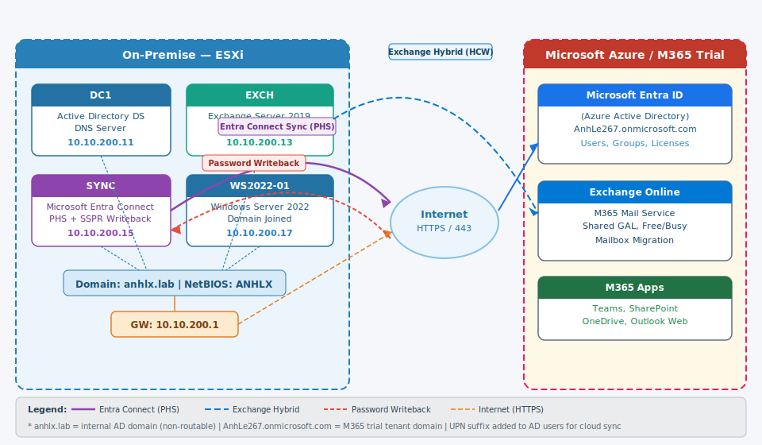
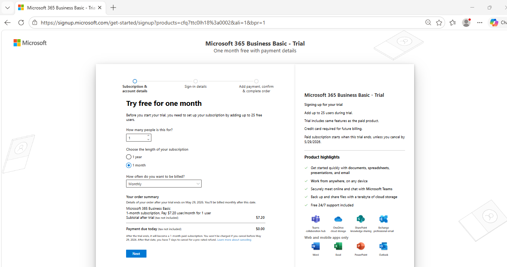
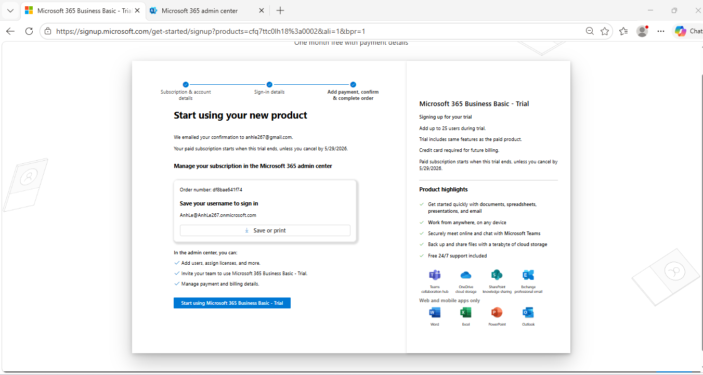
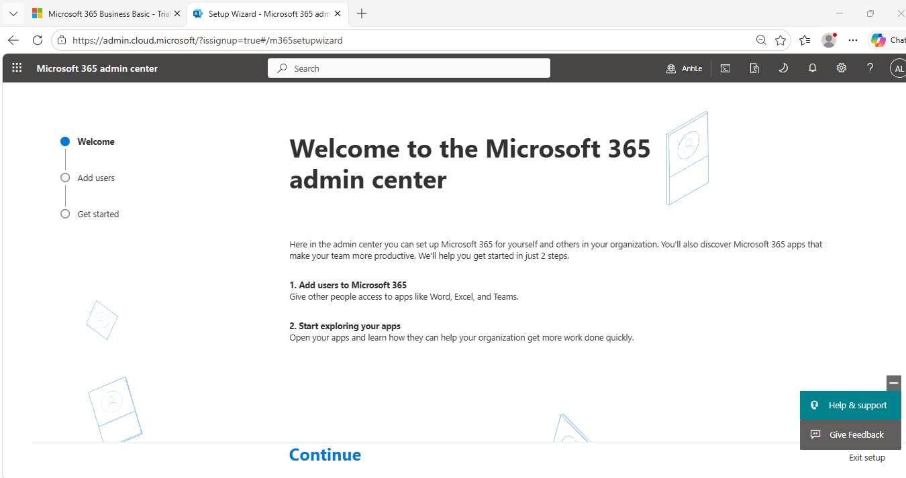
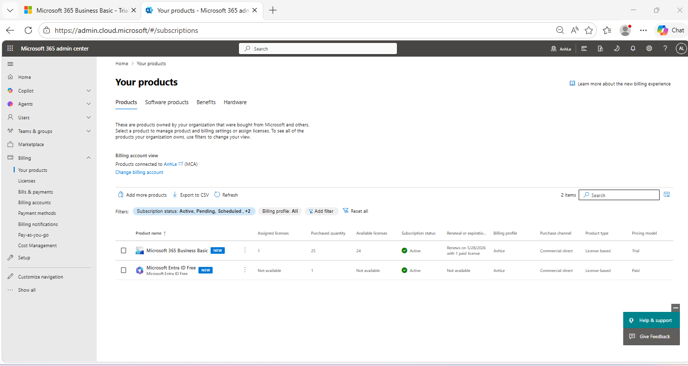
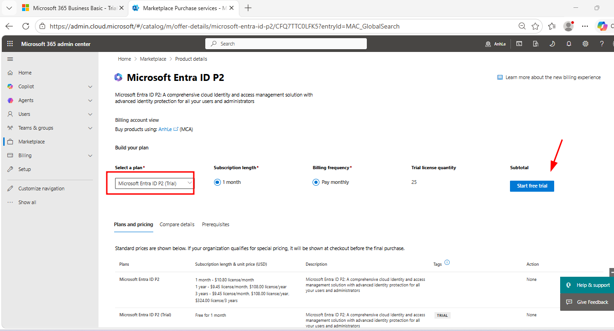
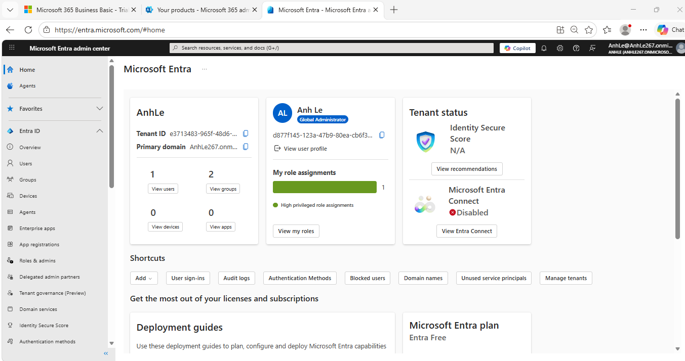

---
title: "Hybrid Identity Lab: AD On-Premise + Microsoft Entra ID + Exchange Hybrid"
categories:
- System
- Windows Server
- Active Directory
- Microsoft 365
feature_image: "/assets/postbanner.jpg"
feature_text: |
  ### Lab Hybrid Identity: Sync Active Directory on-premise lên Microsoft Entra ID, triển khai Exchange Server 2019 Hybrid với Exchange Online (M365)
---

Bài lab hướng dẫn toàn bộ quy trình xây dựng **Hybrid Identity** trong môi trường doanh nghiệp: đồng bộ tài khoản từ **Active Directory on-premise** lên **Microsoft Entra ID** (tên cũ: Azure AD) bằng **Microsoft Entra Connect**, đồng thời triển khai **Exchange Hybrid** cho phép coexistence giữa Exchange Server 2019 on-premise và Exchange Online (M365).

- [1. Giới thiệu](#1-giới-thiệu)
  - [1.1. Hybrid Identity là gì?](#11-hybrid-identity-là-gì)
  - [1.2. Microsoft Entra Connect](#12-microsoft-entra-connect)
  - [1.3. Exchange Hybrid](#13-exchange-hybrid)
- [2. Thiết kế lab](#2-thiết-kế-lab)
  - [2.1. Topology](#21-topology)
  - [2.2. Kế hoạch VM và IP](#22-kế-hoạch-vm-và-ip)
  - [2.3. Flow Hybrid Identity](#23-flow-hybrid-identity)
- [3. Chuẩn bị M365 Tenant](#3-chuẩn-bị-m365-tenant)
  - [3.1. Tạo Microsoft 365 Tenant](#31-tạo-microsoft-365-tenant)
  - [3.2. Ghi nhận tenant domain và Tenant ID](#32-ghi-nhận-tenant-domain-và-tenant-id)
- [4. Cài đặt DC1 — Active Directory Domain Controller](#4-cài-đặt-dc1--active-directory-domain-controller)
  - [4.1. Cấu hình IP tĩnh và hostname](#41-cấu-hình-ip-tĩnh-và-hostname)
  - [4.2. Cài đặt AD DS và DNS](#42-cài-đặt-ad-ds-và-dns)
  - [4.3. Promote Domain Controller](#43-promote-domain-controller)
  - [4.4. Thêm UPN Suffix cho Entra ID](#44-thêm-upn-suffix-cho-entra-id)
  - [4.5. Tạo OU Structure và Users](#45-tạo-ou-structure-và-users)
- [5. Cài đặt SYNC — Microsoft Entra Connect](#5-cài-đặt-sync--microsoft-entra-connect)
  - [5.1. Cấu hình IP tĩnh, hostname và join domain](#51-cấu-hình-ip-tĩnh-hostname-và-join-domain)
  - [5.2. Tải và cài đặt Microsoft Entra Connect](#52-tải-và-cài-đặt-microsoft-entra-connect)
  - [5.3. Cấu hình Password Hash Sync + Seamless SSO](#53-cấu-hình-password-hash-sync--seamless-sso)
  - [5.4. Bật Password Writeback](#54-bật-password-writeback)
  - [5.5. Kiểm tra đồng bộ](#55-kiểm-tra-đồng-bộ)
- [6. Cài đặt EXCH — Exchange Server 2019](#6-cài-đặt-exch--exchange-server-2019)
  - [6.1. Cấu hình IP tĩnh và join domain](#61-cấu-hình-ip-tĩnh-và-join-domain)
  - [6.2. Chuẩn bị prerequisites](#62-chuẩn-bị-prerequisites)
  - [6.3. Extend AD Schema và cài đặt Exchange 2019](#63-extend-ad-schema-và-cài-đặt-exchange-2019)
  - [6.4. Truy cập Exchange Admin Center và tạo Mailbox](#64-truy-cập-exchange-admin-center-và-tạo-mailbox)
- [7. Cấu hình Exchange Hybrid](#7-cấu-hình-exchange-hybrid)
  - [7.1. Hybrid Configuration Wizard (HCW)](#71-hybrid-configuration-wizard-hcw)
  - [7.2. Kiểm tra sau HCW](#72-kiểm-tra-sau-hcw)
- [8. Test Hybrid Identity và Migrate Mailbox](#8-test-hybrid-identity-và-migrate-mailbox)
  - [8.1. Gán license và đăng nhập M365 bằng tài khoản AD sync](#81-gán-license-và-đăng-nhập-m365-bằng-tài-khoản-ad-sync)
  - [8.2. Migrate Mailbox On-Premise lên Exchange Online](#82-migrate-mailbox-on-premise-lên-exchange-online)
  - [8.3. Test Password Writeback (SSPR)](#83-test-password-writeback-sspr)
- [9. Tổng kết](#9-tổng-kết)

---

### 1. Giới thiệu

#### 1.1. Hybrid Identity là gì?

**Hybrid Identity** là mô hình kết hợp quản lý danh tính giữa hạ tầng **on-premise** (Active Directory) và **cloud** (Microsoft Entra ID). Người dùng chỉ cần **một tài khoản duy nhất** để truy cập cả tài nguyên nội bộ (file server, intranet, Exchange on-prem) lẫn dịch vụ cloud (M365, Teams, SharePoint Online).

**Lợi ích của Hybrid Identity:**
- **Single Identity**: 1 tài khoản AD on-prem = 1 danh tính cloud, không cần quản lý hai hệ thống riêng biệt
- **Seamless SSO**: Máy tính đã join domain tự động đăng nhập vào M365 mà không cần nhập lại password
- **Centralized Administration**: Quản lý user, group, password tập trung từ AD on-premise
- **Password Writeback**: Reset password trên cloud portal → tự động cập nhật về AD on-premise
- **Hybrid Exchange**: Mailbox có thể nằm ở on-prem hoặc cloud, vẫn chia sẻ Global Address List và lịch Free/Busy

#### 1.2. Microsoft Entra Connect

**Microsoft Entra Connect** (tên cũ: Azure AD Connect) là công cụ của Microsoft để đồng bộ danh tính từ AD on-premise lên Entra ID. Hỗ trợ 3 phương thức xác thực chính:

| Phương thức | Mô tả | Ưu điểm | Lab này |
|------------|-------|---------|---------|
| **Password Hash Sync (PHS)** | Đồng bộ hash của password lên cloud, xác thực tại Entra ID | Đơn giản, không cần thêm hạ tầng | ✅ Sử dụng |
| **Pass-Through Auth (PTA)** | Xác thực đi qua lightweight agent về AD on-prem theo real-time | Password không lên cloud | — |
| **AD FS Federation** | Federation server (ADFS) riêng biệt, SSO toàn diện | Phức tạp nhất, enterprise | — |

> **Quan trọng**: PHS là lựa chọn phổ biến nhất cho hybrid SMB vì đơn giản, không cần hạ tầng bổ sung, và vẫn hoạt động ngay cả khi on-prem bị gián đoạn (authenticate tại cloud).

#### 1.3. Exchange Hybrid

**Exchange Hybrid** cho phép coexistence giữa **Exchange Server on-premise** và **Exchange Online** trong cùng một mail organization:

- **Shared Global Address List (GAL)**: User on-prem và cloud thấy nhau trong danh bạ
- **Free/Busy lookup**: Xem lịch rảnh/bận giữa on-prem ↔ cloud users
- **Mailbox migration**: Di chuyển mailbox linh hoạt giữa on-prem ↔ Exchange Online với downtime tối thiểu
- **Hybrid Modern Authentication**: SSO cho Outlook desktop client
- **Mail flow**: Hybrid mail routing qua Transport layer

> **Lưu ý lab**: Internal domain `anhlx.lab` là non-routable (không có MX record ngoài internet). Để Exchange Hybrid hoạt động **đầy đủ** (mail flow thực tế), cần domain thật được verify. Trong lab này, ta sử dụng `AnhLe267.onmicrosoft.com` từ M365 trial, thực hiện đủ các bước cấu hình để hiểu kiến trúc. Mail flow thực tế và Autodiscover external cần bổ sung domain thật.

---

### 2. Thiết kế lab

#### 2.1. Topology



#### 2.2. Kế hoạch VM và IP

| VM | Hostname | IP | OS | Role | vCPU | RAM | Disk |
|----|----------|----|----|------|:----:|:---:|:----:|
| VM1 | DC1 | 10.10.200.11 | Windows Server 2022 | AD DS + DNS | 4 | 8 GB | 100 GB |
| VM2 | EXCH | 10.10.200.13 | Windows Server 2022 | Exchange Server 2019 | 4 | **16 GB** | **200 GB** |
| VM3 | SYNC | 10.10.200.15 | Windows Server 2022 | Microsoft Entra Connect | 4 | 8 GB | 100 GB |
| VM4 | WS2022-01 | 10.10.200.17 | Windows Server 2022 | Domain Client | 4 | 8 GB | 100 GB |

**Thông tin domain và tenant:**

| Thông số | Giá trị |
|---------|---------|
| Internal AD Domain | `anhlx.lab` |
| NetBIOS Name | `ANHLX` |
| Forest/Domain Functional Level | Windows Server 2016 |
| Azure/M365 Tenant Domain | `AnhLe267.onmicrosoft.com` _(lấy từ M365 trial)_ |
| UPN Suffix on-premise | `AnhLe267.onmicrosoft.com` _(thêm vào AD để match Azure)_ |
| Default Gateway | `10.10.200.1` |
| DNS Server | `10.10.200.11` (DC1) |

> ⚠️ **Exchange Server 2019 cần tối thiểu 16 GB RAM** — đây là yêu cầu bắt buộc từ Microsoft. Cài trên máy ít RAM sẽ thất bại ở Readiness Check.

#### 2.3. Flow Hybrid Identity

```
[Active Directory On-Premise: anhlx.lab]
  DC1 (10.10.200.11)
  ├── User: john.doe@AnhLe267.onmicrosoft.com  ──────┐
  ├── User: jane.smith@AnhLe267.onmicrosoft.com ──────┤  Entra Connect
  └── Group: IT-Dept ───────────────────────────────┤  (Password Hash Sync)
                                                     ▼
                                    [Microsoft Entra ID]
                                    AnhLe267.onmicrosoft.com
                                    ├── john.doe (synced, source: Windows Server AD)
                                    ├── jane.smith (synced)
                                    └── IT-Dept (synced group)
                                           ▲
                                    Password Writeback (SSPR)

[Exchange Server 2019 On-Premise: EXCH 10.10.200.13]
  ├── Mailbox: john.doe@anhlx.lab (on-prem)
  └── Hybrid Configuration Wizard ────────────────▶ [Exchange Online]
       Organization Relationship                      ├── Shared GAL
       Send/Receive Connector                         ├── Free/Busy
       Migration Endpoint                             └── Mailbox Migration
```

---

### 3. Chuẩn bị M365 Tenant

> **Toàn bộ lab này MIỄN PHÍ** với M365 Business Basic Trial — cần thẻ Visa/Mastercard nhưng **không bị charge trong 30 ngày**.
>
> | Component | Nguồn | Chi phí |
> |-----------|-------|---------|
> | **M365 Business Basic Trial** | signup.microsoft.com | **$0** (30 ngày) |
> | **Exchange Online Plan 1** | Có sẵn trong Business Basic | **$0** |
> | **Microsoft Entra ID P2 Trial** | Add trong Admin Center | **$0** (30 ngày, 100 licenses) |
> | **Exchange Server 2019 Evaluation** | microsoft.com/download | **$0** (180 ngày) |
> | **Microsoft Entra Connect** | microsoft.com/download | **$0** |
> | **Windows Server 2022 Evaluation** | microsoft.com/evalcenter | **$0** (180 ngày) |
>
> **Exchange Online Plan 1** (có trong Business Basic) là **đủ** để:
> - Chạy Hybrid Configuration Wizard (HCW)
> - Coexistence: Shared GAL, Free/Busy giữa on-prem ↔ cloud
> - Mailbox Migration từ on-prem lên Exchange Online
> - Users login M365, Teams, SharePoint
>
> _(Exchange Online Plan 2 chỉ cần khi muốn unlimited archiving hoặc voicemail — không cần thiết cho lab này)_

---

#### 3.1. Tạo Microsoft 365 Tenant

**Bước 1 — Tạo tenant mới bằng M365 Business Basic Trial**

1. Mở trình duyệt (nên dùng InPrivate / Incognito)
2. Truy cập: **https://signup.microsoft.com/get-started/signup?products=CFQ7TTC0LH18:0002&ali=1**
3. Màn hình **"Try free for one month"**:
   - **How many people is this for?** →  **1**
   - **Choose the length:** chọn **1 month**
   - Click **Next**
4. Màn hình **"Create your business identity"**:
   - Nhập tên tổ chức: `AnhLe267` → tenant domain sẽ là `AnhLe267.onmicrosoft.com`
   - Nếu tên bị dùng rồi, thử `AnhLe2025`, `AnhLe267lab`...
   - Click **Next**
5. Đặt tài khoản Global Admin:
   - Username: `AnhLe`
   - Domain: `@AnhLe267.onmicrosoft.com`
   - Đặt mật khẩu mạnh (ghi lại cẩn thận)
6.  Màn hình thanh toán → điền thẻ Visa/Mastercard → **Payment due today: $0.00** → **Start trial**

> ⚠️ **Lưu ý:**
> - **$0.00 hôm nay** — không bị charge trong 30 ngày trial
> - Sau 30 ngày tự chuyển sang trả phí → **nhớ hủy trước ngày hết hạn** nếu không dùng nữa





Đăng nhập vào **M365 Admin Center** (https://admin.cloud.microsoft) bằng `AnhLe@AnhLe267.onmicrosoft.com` để xác nhận tenant đã tạo thành công.



Vào **Billing** → **Your products** để xem danh sách subscription hiện có:



Xác nhận thấy:
- **Microsoft 365 Business Basic** — Trial, Active ✅ (bao gồm Exchange Online Plan 1)
- **Microsoft Entra ID Free** — Active ✅ (tự động có, nhưng cần nâng lên P2 để dùng Password Writeback)

---

**Bước 2 — Thêm Microsoft Entra ID P2 Trial (cần cho Password Writeback)**

> ✅ **Exchange Online Plan 1 đã có sẵn trong Business Basic** — không cần mua thêm gì, đủ để chạy Exchange Hybrid.
> Chỉ cần add **Entra ID P2 Trial** (miễn phí 30 ngày, 25 licenses).

Hiện tại tenant đang có **Entra ID Free** — chưa đủ để dùng Password Writeback:



1. Thanh menu trái → **Marketplace** → ô tìm kiếm gõ `Microsoft Entra ID P2` → Enter
2. Trang Product details hiện ra → dropdown **"Select a plan"** → chọn **"Microsoft Entra ID P2 (Trial)"**
3. Xác nhận:
   - Subscription length: **1 month**
   - Trial license quantity: **25**
4. Click nút **"Start free trial"**
5. Panel **Checkout** bên phải hiện ra:
   - Product: Microsoft Entra ID P2 — 25 licenses
   - **Total due: $0.00** ✅
6. Click **"Next"** → confirm → xong

> ⚠️ Trial hết hạn **28/5/2026** — nhớ vào **Billing → Your products → Microsoft Entra ID P2 → Cancel** trước ngày đó nếu không muốn bị charge.

> Sau khi add xong, vào **Billing** → **Your products** sẽ thấy:
> - ✅ Microsoft 365 Business Basic (Exchange Online Plan 1)
> - ✅ Microsoft Entra ID Free
> - ✅ Microsoft Entra ID P2 (Trial)

> **Tóm tắt licenses — lab MIỄN PHÍ hoàn toàn:**
> - **Microsoft 365 Business Basic** → Exchange Online Plan 1, Teams, SharePoint, Entra ID P1
> - **Microsoft Entra ID P2** (trial) → SSPR + Password Writeback
>
> Azure Portal có sẵn tại **https://portal.azure.com** — đăng nhập bằng `AnhLe@AnhLe267.onmicrosoft.com`.

#### 3.2. Ghi nhận tenant domain và Tenant ID

Vào **Microsoft Entra admin center** (https://entra.microsoft.com) — đăng nhập bằng `AnhLe@AnhLe267.onmicrosoft.com`. Trang Home hiển thị ngay **Tenant ID** và **Primary domain**:



Ghi nhận thông tin sau (sẽ dùng xuyên suốt lab):

| Thông tin | Giá trị |
|-----------|--------|
| **Tenant ID** | Lấy từ trang Entra Home (dạng GUID: `e3713483-xxxx-xxxx-xxxx-xxxxxxxxxxxx`) |
| **Primary domain** | `AnhLe267.onmicrosoft.com` |
| **Admin account** | `AnhLe@AnhLe267.onmicrosoft.com` |
| **Entra Connect** | Disabled (chưa cấu hình — sẽ làm ở Section 5) |

> **Lưu ý**: Trang Entra Home cũng xác nhận **Microsoft Entra Connect: Disabled** — đúng như mong đợi ở thời điểm này, sẽ cài ở Section 5.

---

### 4. Cài đặt DC1 — Active Directory Domain Controller

#### 4.1. Cấu hình IP tĩnh và hostname

Cài Windows Server 2022 trên VM1. Sau khi boot lần đầu:

**Đổi hostname:**
```powershell
Rename-Computer -NewName "DC1" -Restart
```

**Cấu hình IP tĩnh** (sau khi restart, mở PowerShell as Administrator):
```powershell
# Xem danh sách adapter, lấy InterfaceIndex (thường là 4 hoặc 6)
Get-NetAdapter

# Set IP tĩnh (thay InterfaceIndex phù hợp)
New-NetIPAddress -InterfaceIndex 4 `
    -IPAddress 10.10.200.11 `
    -PrefixLength 24 `
    -DefaultGateway 10.10.200.1

# Set DNS trỏ về chính nó (DC tự làm DNS)
Set-DnsClientServerAddress -InterfaceIndex 4 -ServerAddresses 127.0.0.1
```


#### 4.2. Cài đặt AD DS và DNS

```powershell
Install-WindowsFeature -Name AD-Domain-Services, DNS -IncludeManagementTools
```


#### 4.3. Promote Domain Controller

Sau khi cài role xong, promote server lên Domain Controller (tạo forest mới):

```powershell
Import-Module ADDSDeployment

Install-ADDSForest `
    -CreateDnsDelegation:$false `
    -DatabasePath "C:\Windows\NTDS" `
    -DomainMode "WinThreshold" `
    -DomainName "anhlx.lab" `
    -DomainNetbiosName "ANHLX" `
    -ForestMode "WinThreshold" `
    -InstallDns:$true `
    -LogPath "C:\Windows\NTDS" `
    -SysvolPath "C:\Windows\SYSVOL" `
    -Force:$true
```

Server sẽ tự restart. Đăng nhập lại bằng `ANHLX\Administrator`.


**Kiểm tra AD DS đã hoạt động:**
```powershell
Get-ADDomain
Get-ADForest
# Kiểm tra NETLOGON và SYSVOL share
net share
```

#### 4.4. Thêm UPN Suffix cho Entra ID

> **Vấn đề cốt lõi**: Internal domain `anhlx.lab` không thể được verify trên Azure (domain này không có DNS public). Khi Entra Connect sync user có UPN `john.doe@anhlx.lab`, Azure sẽ gán UPN mặc định là `john.doe@AnhLe267.onmicrosoft.com`. Để kiểm soát UPN trên cloud, ta **thêm UPN suffix** `AnhLe267.onmicrosoft.com` vào AD và assign cho tất cả users.

```powershell
# Thêm UPN suffix vào AD Forest
Get-ADForest | Set-ADForest -UPNSuffixes @{Add="AnhLe267.onmicrosoft.com"}

# Xác nhận
(Get-ADForest).UPNSuffixes
# Output: AnhLe267.onmicrosoft.com
```

Hoặc dùng GUI: mở **Active Directory Domains and Trusts** → right-click node gốc → **Properties** → tab **UPN Suffixes** → **Add** → nhập `AnhLe267.onmicrosoft.com`.


#### 4.5. Tạo OU Structure và Users

```powershell
# --- Tạo cấu trúc OU ---
New-ADOrganizationalUnit -Name "Company"       -Path "DC=anhlx,DC=lab"
New-ADOrganizationalUnit -Name "Users"         -Path "OU=Company,DC=anhlx,DC=lab"
New-ADOrganizationalUnit -Name "Groups"        -Path "OU=Company,DC=anhlx,DC=lab"
New-ADOrganizationalUnit -Name "Computers"     -Path "OU=Company,DC=anhlx,DC=lab"
New-ADOrganizationalUnit -Name "ServiceAccounts" -Path "OU=Company,DC=anhlx,DC=lab"

# --- Tạo users với UPN suffix AnhLe267.onmicrosoft.com ---
$password = ConvertTo-SecureString "P@ssw0rd123!" -AsPlainText -Force

New-ADUser `
    -Name              "John Doe" `
    -GivenName         "John" `
    -Surname           "Doe" `
    -SamAccountName    "john.doe" `
    -UserPrincipalName "john.doe@AnhLe267.onmicrosoft.com" `
    -Path              "OU=Users,OU=Company,DC=anhlx,DC=lab" `
    -AccountPassword   $password `
    -Enabled           $true `
    -EmailAddress      "john.doe@AnhLe267.onmicrosoft.com" `
    -Department        "IT" `
    -Title             "System Engineer"

New-ADUser `
    -Name              "Jane Smith" `
    -GivenName         "Jane" `
    -Surname           "Smith" `
    -SamAccountName    "jane.smith" `
    -UserPrincipalName "jane.smith@AnhLe267.onmicrosoft.com" `
    -Path              "OU=Users,OU=Company,DC=anhlx,DC=lab" `
    -AccountPassword   $password `
    -Enabled           $true `
    -EmailAddress      "jane.smith@AnhLe267.onmicrosoft.com" `
    -Department        "HR" `
    -Title             "HR Manager"

# --- Tạo group và thêm member ---
New-ADGroup -Name "IT-Dept" -GroupScope Global `
    -Path "OU=Groups,OU=Company,DC=anhlx,DC=lab"
Add-ADGroupMember -Identity "IT-Dept" -Members "john.doe"

# --- Kiểm tra ---
Get-ADUser -Filter * -SearchBase "OU=Users,OU=Company,DC=anhlx,DC=lab" `
    | Select-Object Name, UserPrincipalName, Enabled
```


---

### 5. Cài đặt SYNC — Microsoft Entra Connect

#### 5.1. Cấu hình IP tĩnh, hostname và join domain

Cài Windows Server 2022 trên VM3:

```powershell
# Đổi hostname
Rename-Computer -NewName "SYNC" -Restart

# --- Sau restart: set IP tĩnh ---
New-NetIPAddress -InterfaceIndex 4 `
    -IPAddress 10.10.200.15 `
    -PrefixLength 24 `
    -DefaultGateway 10.10.200.1

# DNS trỏ về DC1
Set-DnsClientServerAddress -InterfaceIndex 4 -ServerAddresses 10.10.200.11

# Join domain
Add-Computer -DomainName "anhlx.lab" -Credential (Get-Credential) -Restart
```

Đăng nhập lại bằng `ANHLX\Administrator`.

#### 5.2. Tải và cài đặt Microsoft Entra Connect

> Tải Entra Connect tại: **https://www.microsoft.com/en-us/download/details.aspx?id=47594**
>
> Hoặc: **Azure Portal** → **Microsoft Entra ID** → **Microsoft Entra Connect** → **Download**

Copy file `AzureADConnect.msi` sang SYNC VM và chạy với quyền Administrator.


#### 5.3. Cấu hình Password Hash Sync + Seamless SSO

Sau khi cài xong, wizard tự mở. Chọn **"Use express settings"** cho cấu hình nhanh:

**Bước 1** — Màn hình Welcome → Click **Use express settings**


**Bước 2** — **Connect to Microsoft Entra ID**:
- Username: `AnhLe@AnhLe267.onmicrosoft.com`
- Password: (mật khẩu Global Admin M365)
- Click **Next**


**Bước 3** — **Connect to AD DS**:
- Forest: `anhlx.lab`
- Username: `ANHLX\Administrator`
- Password: (domain admin password)
- Click **Add Directory** → **Next**


**Bước 4** — **Azure AD sign-in configuration**:

Wizard sẽ hiển thị cảnh báo: _"Users will not be able to sign-in to Azure AD with on-premises credentials if the UPN suffix does not match a verified domain"_

- Tích vào: **"Continue without matching all UPN suffixes to verified domains"**
- Click **Next**

> Đây là lý do ta đã set UPN suffix `AnhLe267.onmicrosoft.com` cho tất cả users ở bước 4.4 — nhờ đó Entra Connect sẽ match và sync đúng UPN.


**Bước 5** — **Ready to configure**:
- ✅ Start the synchronization process when configuration completes
- Click **Install**


Sau khi cài xong, initial sync sẽ chạy tự động (có thể mất 5–15 phút).

#### 5.4. Bật Password Writeback

Sau Express Settings, mở lại **Microsoft Entra Connect wizard** để bổ sung tính năng:

1. Start Menu → tìm **Microsoft Entra Connect** → chạy wizard
2. Chọn **"Customize synchronization options"** → **Next**
3. Đăng nhập lại: M365 Global Admin + AD Domain Admin
4. Chọn **OU để sync** (nếu muốn lọc): giữ nguyên hoặc chọn OU `Company`
5. Màn hình **"Optional features"**:
   - ✅ **Password writeback**
   - ✅ **Azure AD app and attribute filtering** (tùy chọn)
6. Click **Next** → **Configure**


**Bật SSPR trên Azure Portal:**

Azure Portal → **Microsoft Entra ID** → **Password reset** → **Properties**:
- Self service password reset enabled: **All** (hoặc **Selected** → chọn group IT-Dept)

Azure Portal → **Microsoft Entra ID** → **Password reset** → **On-premises integration**:
- Write back passwords to your on-premises directory: **Yes**
- Allow users to unlock accounts without resetting their password: **Yes**


#### 5.5. Kiểm tra đồng bộ

**Kiểm tra trên Azure Portal:**

Azure Portal → **Microsoft Entra ID** → **Users** → xác nhận thấy `john.doe@AnhLe267.onmicrosoft.com` và `jane.smith@AnhLe267.onmicrosoft.com` với cột **Source = Windows Server AD**.


**Kiểm tra bằng PowerShell trên SYNC VM:**

```powershell
# Cài module Microsoft Graph (thay thế MSOnline đã deprecated)
Install-Module -Name Microsoft.Graph -Force -AllowClobber
Connect-MgGraph -Scopes "User.Read.All", "Directory.Read.All"

# Xem users synced từ on-prem
Get-MgUser -All | Where-Object { $_.OnPremisesSyncEnabled -eq $true } `
    | Select-Object DisplayName, UserPrincipalName, OnPremisesSyncEnabled

# Trigger sync thủ công (nếu muốn sync ngay thay vì chờ 30 phút)
Start-ADSyncSyncCycle -PolicyType Delta

# Xem lịch sync
Get-ADSyncScheduler
```


---

### 6. Cài đặt EXCH — Exchange Server 2019

> **Yêu cầu tối thiểu của Exchange Server 2019:**
> - OS: Windows Server 2019 hoặc **Windows Server 2022** (cần CU12+)
> - RAM: **tối thiểu 8 GB** (khuyến nghị **16 GB** cho production)
> - CPU: 4 vCPU
> - Disk: 30 GB cho Exchange binaries + dung lượng cho mailbox database
> - Đã join domain trước khi cài

#### 6.1. Cấu hình IP tĩnh và join domain

Cài Windows Server 2022 trên VM2:

```powershell
# Đổi hostname
Rename-Computer -NewName "EXCH" -Restart

# --- Sau restart: set IP tĩnh ---
New-NetIPAddress -InterfaceIndex 4 `
    -IPAddress 10.10.200.13 `
    -PrefixLength 24 `
    -DefaultGateway 10.10.200.1

Set-DnsClientServerAddress -InterfaceIndex 4 -ServerAddresses 10.10.200.11

# Join domain (nhập credential ANHLX\Administrator)
Add-Computer -DomainName "anhlx.lab" -Credential (Get-Credential) -Restart
```

Đăng nhập lại bằng Domain Admin: `ANHLX\Administrator`.

#### 6.2. Chuẩn bị prerequisites

Exchange 2019 yêu cầu nhiều Windows Features và redistributable packages. Chạy trên EXCH VM:

**Cài Windows Features:**
```powershell
Install-WindowsFeature `
    NET-Framework-45-Features, `
    RPC-over-HTTP-proxy, `
    RSAT-Clustering, RSAT-Clustering-CmdInterface, `
    RSAT-Clustering-Mgmt, RSAT-Clustering-PowerShell, `
    WAS-Process-Model, Web-Asp-Net45, `
    Web-Basic-Auth, Web-Client-Auth, Web-Digest-Auth, `
    Web-Dir-Browsing, Web-Dyn-Compression, Web-Http-Errors, `
    Web-Http-Logging, Web-Http-Redirect, Web-Http-Tracing, `
    Web-ISAPI-Ext, Web-ISAPI-Filter, Web-Lgcy-Mgmt-Console, `
    Web-Metabase, Web-Mgmt-Console, Web-Mgmt-Service, `
    Web-Net-Ext45, Web-Request-Monitor, Web-Server, `
    Web-Stat-Compression, Web-Static-Content, `
    Web-Windows-Auth, Web-WMI, `
    Windows-Identity-Foundation, RSAT-ADDS `
    -IncludeManagementTools

Restart-Computer
```

**Cài các package bổ sung (tải từ Microsoft):**
- **.NET Framework 4.8**: https://go.microsoft.com/fwlink/?linkid=2088631
- **Visual C++ Redistributable 2012** (x64): https://www.microsoft.com/download/details.aspx?id=30679
- **Visual C++ Redistributable 2013** (x64): https://support.microsoft.com/help/4032938
- **IIS URL Rewrite Module**: https://www.iis.net/downloads/microsoft/url-rewrite
- **Unified Communications Managed API 4.0** (UCMA): https://www.microsoft.com/download/details.aspx?id=34992


> **Tải Exchange Server 2019 Evaluation** (180 ngày free): https://www.microsoft.com/en-us/download/details.aspx?id=58591
> Mount ISO hoặc giải nén vào thư mục `D:\Exchange2019`

#### 6.3. Extend AD Schema và cài đặt Exchange 2019

Exchange cần extend AD schema trước khi cài. Chạy các lệnh sau **với quyền Schema Admin + Enterprise Admin** (dùng `ANHLX\Administrator`):

```powershell
# Di chuyển vào thư mục Exchange ISO (vd D:\)
cd D:\

# 1. Prepare Schema (chạy trên EXCH hoặc DC1)
.\Setup.exe /PrepareSchema /IAcceptExchangeServerLicenseTerms_DiagnosticDataOFF

# 2. Prepare Active Directory — đặt tên Organization
.\Setup.exe /PrepareAD /OrganizationName:"AnhlxLab" `
    /IAcceptExchangeServerLicenseTerms_DiagnosticDataOFF

# 3. Prepare Domain
.\Setup.exe /PrepareDomain /IAcceptExchangeServerLicenseTerms_DiagnosticDataOFF
```


**Cài Exchange 2019 (Mailbox Role):**

```powershell
# Cài qua command line (unattended)
.\Setup.exe /Mode:Install /Role:Mailbox `
    /IAcceptExchangeServerLicenseTerms_DiagnosticDataOFF
```

Hoặc chạy **Setup.exe GUI** (double-click):

1. **Check for Updates** → chọn **Don't check** (lab)
2. **Introduction** → **Next**
3. **License Agreement** → **I accept** → **Next**
4. **Recommended Settings** → **Don't use recommended settings** (lab) → **Next**
5. **Server Role Selection** → ✅ **Mailbox role** → **Next**
6. **Installation Space and Location** → **Next**
7. **Exchange Organization** → nhập `AnhlxLab` → **Next**
8. **Malware Protection** → tùy chọn disable cho lab → **Next**
9. **Readiness Checks** → chờ kiểm tra prerequisites, fix lỗi nếu có → **Install**

Quá trình cài mất khoảng **30–60 phút**.


Sau khi hoàn thành, restart EXCH VM.

#### 6.4. Truy cập Exchange Admin Center và tạo Mailbox

Truy cập **Exchange Admin Center (EAC)** từ trình duyệt trên EXCH:

```
https://exch.anhlx.lab/ecp
```

Đăng nhập: `ANHLX\Administrator` / (domain admin password)


**Tạo mailbox cho users AD bằng Exchange Management Shell (EMS):**

Mở **Exchange Management Shell** (Start Menu → Exchange 2019):

```powershell
# Enable mailbox cho existing AD users
Enable-Mailbox -Identity "john.doe@AnhLe267.onmicrosoft.com"
Enable-Mailbox -Identity "jane.smith@AnhLe267.onmicrosoft.com"

# Kiểm tra mailbox đã tạo
Get-Mailbox | Select-Object DisplayName, PrimarySmtpAddress, Database

# Kiểm tra mailbox database
Get-MailboxDatabase -Status | Select-Object Name, Mounted, DatabaseSize
```


---

### 7. Cấu hình Exchange Hybrid

> **Hybrid Configuration Wizard (HCW)** là công cụ tự động hóa toàn bộ quá trình cấu hình Exchange Hybrid. HCW sẽ tạo Organization Relationship, Send/Receive Connector, Migration Endpoint và cấu hình OAuth giữa on-prem và Exchange Online.

#### 7.1. Hybrid Configuration Wizard (HCW)

**Tải HCW** — chạy trên EXCH VM:
- Tải tại: **https://aka.ms/HybridWizard**
- Hoặc trong EAC → **Hybrid** → **Setup** → Download **HCW**


Chạy `HybridConfigurationWizard.exe` với quyền Administrator:

**Bước 1 — Introduction** → Click **Next**

**Bước 2 — Detect On-premises Exchange**:
- HCW tự phát hiện EXCH server → Click **Next**


**Bước 3 — Connect to Microsoft 365**:
- Đăng nhập: `AnhLe@AnhLe267.onmicrosoft.com`
- Click **Next**


**Bước 4 — Hybrid Features**:
- Chọn **Full Hybrid Configuration** → **Next**

**Bước 5 — Hybrid Topology**:
- Chọn **Use Exchange Classic Hybrid Topology** (cho lab) → **Next**
- _(Modern Hybrid dùng cho Exchange Online-side migration agent, không cần firewall rule)_

**Bước 6 — Credentials**:
- On-premises account: `ANHLX\Administrator`
- Microsoft 365 account: `AnhLe@AnhLe267.onmicrosoft.com`

**Bước 7 — Transport Certificate**:
- Chọn self-signed cert của Exchange (lab). Production cần cert từ public CA (DigiCert, Sectigo...) → **Next**

**Bước 8 — FQDN**:
- Nhập FQDN của Exchange server: `exch.anhlx.lab` → **Next**

**Bước 9 — Review + Update**:
- Xem lại tóm tắt cấu hình → Click **Update**


HCW sẽ tự động thực hiện các thao tác:
- Tạo **Organization Relationship** (on-prem ↔ cloud)
- Cấu hình **Send Connector** (on-prem → Exchange Online)
- Cấu hình **Receive Connector** (Exchange Online → on-prem)
- Enable **OAuth authentication** giữa hai hệ thống
- Tạo **MigrationEndpoint** (dùng cho mailbox migration)
- Cấu hình **Free/Busy** sharing policy


#### 7.2. Kiểm tra sau HCW

Mở **Exchange Management Shell** trên EXCH và kiểm tra:

```powershell
# Xem Organization Relationship
Get-OrganizationRelationship | Format-List Name, DomainNames, `
    FreeBusyAccessEnabled, MailboxMoveEnabled, MailboxMoveCapability

# Xem Hybrid Config đã lưu
Get-HybridConfiguration | Format-List

# Xem Migration Endpoint (dùng để migrate mailbox)
Get-MigrationEndpoint | Format-List Identity, Type, RemoteServer

# Xem Send Connector hybrid
Get-SendConnector | Where-Object {$_.Name -like "*hybrid*"} | Format-List Name, AddressSpaces

# Xem Receive Connector hybrid
Get-ReceiveConnector | Where-Object {$_.Name -like "*hybrid*"} | Format-List Name, Bindings
```


---

### 8. Test Hybrid Identity và Migrate Mailbox

#### 8.1. Gán license và đăng nhập M365 bằng tài khoản AD sync

**Gán M365 License cho user synced:**

Azure Portal → **Microsoft Entra ID** → **Users** → chọn `john.doe@AnhLe267.onmicrosoft.com`:
- Click **Licenses** → **Assignments** → **+ Add** → chọn **Microsoft 365 E3** (trial) → **Save**


**Test đăng nhập M365 từ WS2022-01** (máy đã join domain `anhlx.lab`):

1. Đăng nhập vào WS2022-01 bằng AD account: `ANHLX\john.doe` / `P@ssw0rd123!`
2. Mở Microsoft Edge → truy cập **https://portal.microsoft.com**
3. Nhập: `john.doe@AnhLe267.onmicrosoft.com` → **Next** → nhập password
4. Nếu Seamless SSO hoạt động → Windows sẽ tự xác thực mà không cần nhập password


> **Kết quả mong đợi**: User đăng nhập được vào M365 portal bằng password từ AD on-premise → xác nhận **Password Hash Sync** hoạt động.

**Kiểm tra Seamless SSO:**

Trên SYNC VM (PowerShell):
```powershell
# Xem trạng thái Seamless SSO
Get-AzureADSSOStatus | ConvertFrom-Json
```

Hoặc trên máy WS2022-01 (đã join domain), mở browser → vào M365, nếu không hỏi password → Seamless SSO đang active.


#### 8.2. Migrate Mailbox On-Premise lên Exchange Online

Sau khi HCW hoàn thành, thực hiện migrate mailbox `john.doe` từ on-prem lên Exchange Online:

**Từ Exchange Admin Center (EAC) on-premise:**

1. EAC (`https://exch.anhlx.lab/ecp`) → **Recipients** → **Migration** → Click **+** (New)
2. Chọn **"Move to Exchange Online"** → **Next**
3. Chọn mailbox `john.doe` từ danh sách → **Next**
4. Chọn **Migration Endpoint** (tạo bởi HCW) → **Next**
5. Chọn **Target Delivery Domain**: `AnhLe267.mail.onmicrosoft.com` → **Next**
6. Đặt tên batch: `Pilot-Migration-001` → chọn **"Start the batch automatically"** → **New**


**Theo dõi migration bằng EMS:**

```powershell
# Xem trạng thái batch
Get-MigrationBatch -Identity "Pilot-Migration-001" `
    | Select-Object Status, TotalCount, SyncedCount, FailedCount, PercentComplete

# Xem chi tiết từng user
Get-MigrationUser -BatchId "Pilot-Migration-001" `
    | Select-Object Identity, Status, PercentComplete, LastSyncedTimestamp

# Sau khi sync hoàn thành (status = Synced), complete batch
Complete-MigrationBatch -Identity "Pilot-Migration-001"
```


> Sau khi migration hoàn tất, mailbox của `john.doe` sẽ nằm trên **Exchange Online**. User vẫn đăng nhập bằng account AD on-premise, nhưng mail được lưu trên cloud.

#### 8.3. Test Password Writeback (SSPR)

**Điều kiện**: Đã bật Password Writeback ở bước 5.4 và SSPR đã enabled trên Azure.

**Thực hiện reset password từ cloud:**

1. Mở browser (nên dùng máy ngoài domain, hoặc InPrivate/Incognito)
2. Truy cập: **https://aka.ms/sspr** (Self-Service Password Reset portal)
3. Nhập: `john.doe@AnhLe267.onmicrosoft.com` → **Next**
4. Xác thực bằng MFA (email, phone, authenticator app)
5. Nhập mật khẩu mới → **Finish**


**Kiểm tra Password Writeback trên DC1:**

```powershell
# Trên DC1 — xem PasswordLastSet của john.doe
Get-ADUser -Identity "john.doe" -Properties PasswordLastSet, LastLogonDate `
    | Select-Object Name, PasswordLastSet, LastLogonDate
```

Nếu `PasswordLastSet` được cập nhật gần với thời điểm vừa reset trên SSPR portal → **Password Writeback hoạt động thành công**.


**Test đăng nhập lại AD bằng password mới:**

Trên WS2022-01, lock screen → đăng nhập lại bằng `ANHLX\john.doe` với mật khẩu mới vừa đặt. Nếu thành công → xác nhận password đã được writeback về AD on-premise.

---

### 9. Tổng kết

Sau khi hoàn thành lab, bạn đã nắm được toàn bộ kiến trúc **Hybrid Identity** thực tế:

| Thành phần | Kiến thức đạt được |
|-----------|-------------------|
| **Hybrid Identity Concept** | Hiểu Single Identity Model: 1 tài khoản cho cả on-prem và cloud |
| **UPN Suffix Strategy** | Xử lý non-routable domain `.lab` bằng cách thêm UPN suffix `.onmicrosoft.com` |
| **Microsoft Entra Connect** | Cài đặt, cấu hình Password Hash Sync, Seamless SSO |
| **Password Writeback** | SSPR + writeback: reset cloud → tự update AD on-prem |
| **Exchange Server 2019** | Cài đặt, extend AD schema, tạo mailbox |
| **Exchange Hybrid (HCW)** | Hiểu kiến trúc, chạy HCW, Organization Relationship |
| **Mailbox Migration** | Online mailbox move giữa on-prem ↔ Exchange Online |
| **M365 License Management** | Gán license, quản lý user từ Entra ID |

**Kiến trúc tổng thể hoàn chỉnh:**
```
[AD On-Premise: anhlx.lab]
    DC1 (10.10.200.11)
    SYNC (10.10.200.15) ──── Entra Connect (PHS, 30min cycle) ────▶ [Entra ID: AnhLe267.onmicrosoft.com]
                        ◀─── Password Writeback (SSPR) ────────────
    EXCH (10.10.200.13) ──── Exchange Hybrid (HCW) ────────────────▶ [Exchange Online]
                                                                        Shared GAL, Free/Busy
                                                                        Online Mailbox Move
    WS2022-01 (10.10.200.17) ── domain joined ── Seamless SSO ─────▶ [M365 Portal / Apps]
```

**Next steps để mở rộng lab:**
- **Azure AD Application Proxy**: Publish ứng dụng on-prem (web app, RDP) ra internet qua Entra ID mà không cần VPN
- **Conditional Access Policy**: Yêu cầu MFA hoặc compliant device khi login từ ngoài mạng
- **Microsoft Defender for Identity**: Giám sát và phát hiện tấn công AD on-premise
- **Pass-Through Authentication (PTA)**: Lab phương thức xác thực thay thế PHS
- **AD FS + WAP**: Federation đầy đủ với Web Application Proxy
- **Exchange Certificate (Public CA)**: Thay self-signed cert bằng cert từ Let's Encrypt hoặc public CA để HCW hoạt động hoàn chỉnh với domain thật
