Bài lab này triển khai mô hình **Cloud-Native Zero Trust** hoàn chỉnh cho doanh nghiệp vừa và nhỏ (SME): không cần Domain Controller on-premise, user được tạo trực tiếp trên **Microsoft Entra ID**, kết hợp **Zscaler Private Access (ZPA)** thay thế VPN truyền thống, và **JumpServer** làm Bastion/PAM — cho phép quản trị viên SSH/RDP vào toàn bộ hệ thống qua trình duyệt hoặc native client.

> **Mục tiêu:** User từ Internet → bật Zscaler Client Connector → login bằng tài khoản Microsoft 365 → truy cập JumpServer → SSH/RDP vào các VM trong LAN private. **Không cần VPN, không cần DC.**

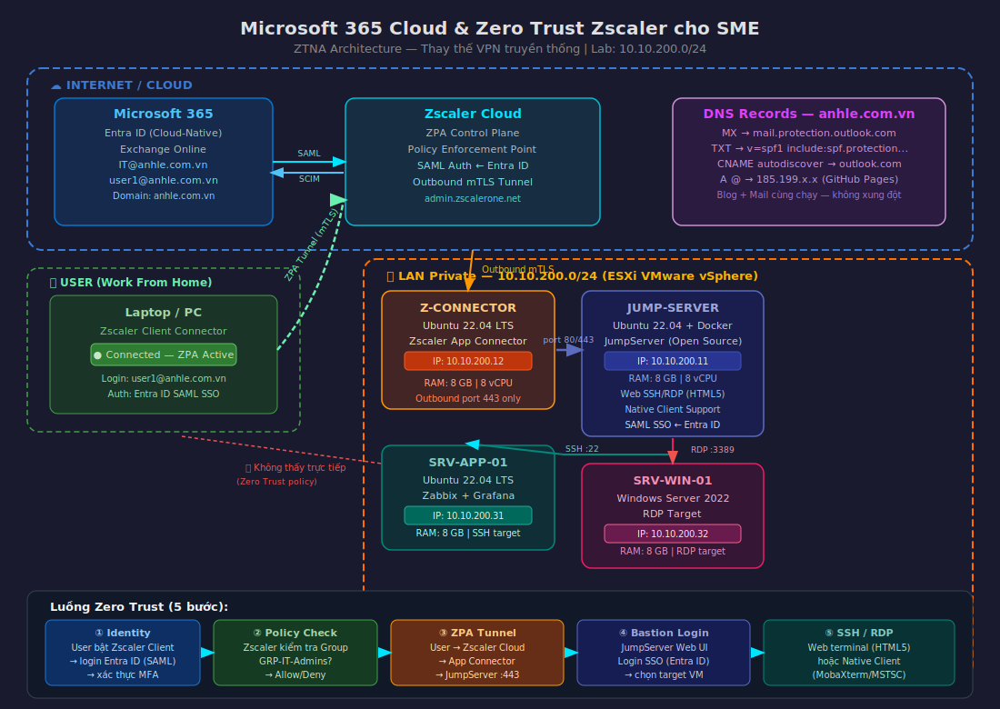

---

## Mục lục

- [Mục lục](#mục-lục)
- [1. Giới thiệu và kiến trúc lab](#1-giới-thiệu-và-kiến-trúc-lab)
  - [1.1. Tại sao Zero Trust thay VPN?](#11-tại-sao-zero-trust-thay-vpn)
  - [1.2. Kiến trúc tổng thể](#12-kiến-trúc-tổng-thể)
  - [1.3. Phân bổ VM và IP](#13-phân-bổ-vm-và-ip)
- [2. Chuẩn bị Microsoft 365 Tenant](#2-chuẩn-bị-microsoft-365-tenant)
  - [2.1. Đăng ký M365 Business Basic Trial](#21-đăng-ký-m365-business-basic-trial)
  - [2.2. Verify domain anhle.com.vn](#22-verify-domain-anhlecomvn)
  - [2.3. Thêm DNS records cho Exchange Online](#23-thêm-dns-records-cho-exchange-online)
  - [2.4. Tạo user IT@anhle.com.vn và gán license](#24-tạo-user-itanhlecomvn-và-gán-license)
  - [2.5. Test gửi nhận mail](#25-test-gửi-nhận-mail)
  - [2.6. Enable DKIM (thực hiện sau khi mail đã gửi nhận được)](#26-enable-dkim-thực-hiện-sau-khi-mail-đã-gửi-nhận-được)
- [3. Đăng ký Zscaler ZPA Trial](#3-đăng-ký-zscaler-zpa-trial)
  - [3.1. Đăng ký tài khoản Zscaler](#31-đăng-ký-tài-khoản-zscaler)
  - [3.2. Cấu hình SAML SSO với Entra ID](#32-cấu-hình-saml-sso-với-entra-id)
  - [3.3. Tạo Group và User Provisioning](#33-tạo-group-và-user-provisioning)
- [4. Dựng hạ tầng ESXi — LAN 10.10.200.0/24](#4-dựng-hạ-tầng-esxi--lan-1010200024)
  - [4.1. Chuẩn bị 4 VM trên ESXi](#41-chuẩn-bị-4-vm-trên-esxi)
- [5. Cài đặt Zscaler App Connector](#5-cài-đặt-zscaler-app-connector)
  - [5.1. Chuẩn bị VM Z-CONNECTOR](#51-chuẩn-bị-vm-z-connector)
  - [5.2. Tạo App Connector Group trên Zscaler Portal](#52-tạo-app-connector-group-trên-zscaler-portal)
  - [5.3. Cài đặt và enroll App Connector](#53-cài-đặt-và-enroll-app-connector)
  - [5.4. Kiểm tra trạng thái connector](#54-kiểm-tra-trạng-thái-connector)
- [6. Cài đặt JumpServer (Bastion PAM)](#6-cài-đặt-jumpserver-bastion-pam)
  - [6.1. Cài JumpServer bằng Docker](#61-cài-jumpserver-bằng-docker)
  - [6.2. Cấu hình ban đầu JumpServer](#62-cấu-hình-ban-đầu-jumpserver)
  - [6.3. Tích hợp SAML SSO với Entra ID](#63-tích-hợp-saml-sso-với-entra-id)
  - [6.4. Thêm Assets (SSH/RDP targets)](#64-thêm-assets-sshrdp-targets)
- [7. Cấu hình Zscaler ZPA Policy](#7-cấu-hình-zscaler-zpa-policy)
  - [7.1. Tạo Application Segment — Internal Bastion](#71-tạo-application-segment--internal-bastion)
  - [7.2. Tạo Access Policy](#72-tạo-access-policy)
  - [7.3. Cài Zscaler Client Connector trên máy user](#73-cài-zscaler-client-connector-trên-máy-user)
- [8. Kiểm tra luồng Zero Trust end-to-end](#8-kiểm-tra-luồng-zero-trust-end-to-end)
  - [8.1. Test Web SSH/RDP qua trình duyệt](#81-test-web-sshrdp-qua-trình-duyệt)
  - [8.2. Test native client (MobaXterm/MSTSC)](#82-test-native-client-mobaxtermmstsc)
  - [8.3. Kiểm tra Zero Trust — tắt Zscaler thì không vào được](#83-kiểm-tra-zero-trust--tắt-zscaler-thì-không-vào-được)
- [9. Tổng kết](#9-tổng-kết)

---

## 1. Giới thiệu và kiến trúc lab

### 1.1. Tại sao Zero Trust thay VPN?

Mô hình VPN truyền thống có một điểm yếu cơ bản: một khi user đã kết nối VPN, họ có thể **thấy và truy cập toàn bộ mạng nội bộ**. Đây là nguyên lý `castle-and-moat` (hào nước quanh lâu đài) — chỉ kiểm soát ai vào được, không kiểm soát họ làm gì bên trong.

**Zero Trust Network Access (ZTNA)** theo nguyên lý ngược lại:
- **Never trust, always verify** — mỗi request đều phải xác thực danh tính, thiết bị, ngữ cảnh.
- **Least privilege** — user chỉ thấy đúng ứng dụng/IP được cấp phép, không thấy gì khác trong LAN.
- **Micro-segmentation** — ngay cả khi 1 endpoint bị compromise, attacker cũng không lateral move được.

| Tiêu chí | VPN truyền thống | Zscaler ZPA (Zero Trust) |
|----------|:----------------:|:------------------------:|
| Sau khi kết nối | Thấy toàn bộ LAN | Chỉ thấy đúng app được cấp phép |
| Xác thực | Username/Password | MFA + Device Posture + Identity (Entra ID) |
| Hướng kết nối | Inbound (mở port VPN ra Internet) | **Outbound only** (không mở port vào LAN) |
| Quản lý | Phức tạp, client nặng | Cloud-managed, client nhẹ |
| Phù hợp SME | Cần VPN Server on-prem | Không cần — thuần cloud |

### 1.2. Kiến trúc tổng thể

```
┌─────────────────────────────────────────────────────────────────────────────┐
│                        INTERNET / CLOUD                                     │
│                                                                             │
│   ┌─────────────────┐          ┌───────────────────────────────────────┐   │
│   │  Microsoft 365  │          │         ZSCALER CLOUD                 │   │
│   │  Entra ID       │◄────────►│  - Identity Provider (SAML)           │   │
│   │  Exchange Online│          │  - ZPA Control Plane                  │   │
│   │  anhle.com.vn   │          │  - Policy Enforcement Point (PEP)     │   │
│   └────────┬────────┘          └────────────────┬──────────────────────┘   │
│            │                                    │                           │
└────────────┼────────────────────────────────────┼───────────────────────────┘
             │                                    │
             │ SAML SSO                           │ Outbound mTLS tunnel
             │                                    │
┌────────────▼────────────────────────────────────▼───────────────────────────┐
│   USER (Work From Home / Internet)         LAN 10.10.200.0/24 (ESXi)        │
│                                                                             │
│   ┌─────────────────┐                  ┌──────────────────┐                │
│   │  Laptop / PC    │                  │  Z-CONNECTOR     │                │
│   │  + Zscaler      │◄── ZPA Tunnel ──►│  10.10.200.12   │                │
│   │  Client Connect │                  │  (Ubuntu 22.04)  │                │
│   └────────┬────────┘                  └──────────────────┘                │
│            │                                                                │
│            │ Chỉ thấy IP 10.10.200.11                                      │
│            │ (Zero Trust Policy)                                            │
│            ▼                                                                │
│   ┌─────────────────┐      SSH/RDP   ┌──────────────────┐                  │
│   │  JumpServer     │───────────────►│  SRV-APP-01      │                  │
│   │  10.10.200.11   │                │  10.10.200.31    │                  │
│   │  (Ubuntu+Docker)│                │  Zabbix/Grafana  │                  │
│   │  Web UI + Native│───────────────►├──────────────────┤                  │
│   │  SSH/RDP client │      RDP       │  SRV-WIN-01      │                  │
│   └─────────────────┘                │  10.10.200.32    │                  │
│                                      │  Windows Server  │                  │
│                                      └──────────────────┘                  │
└─────────────────────────────────────────────────────────────────────────────┘
```

**Luồng hoạt động:**

1. User bật **Zscaler Client Connector** → tự động authenticate với **Entra ID** (SAML).
2. Zscaler Cloud kiểm tra policy → cấp phép user truy cập đúng Application Segment (`10.10.200.11`).
3. Traffic đi từ máy user → Zscaler Cloud → **Z-CONNECTOR** trong LAN → **JumpServer**.
4. User login **JumpServer Web UI** bằng tài khoản Microsoft 365 (SAML SSO).
5. Từ JumpServer, user SSH/RDP vào các VM target — hoặc qua Web terminal, hoặc qua native client.

> **Key insight:** Toàn bộ LAN `10.10.200.0/24` **không cần mở bất kỳ port nào ra Internet**. App Connector tạo kết nối Outbound (port 443) đến Zscaler Cloud — tương tự cách trình duyệt kết nối web.

### 1.3. Phân bổ VM và IP

| VM Name | OS | IP | vCPU / RAM | Vai trò |
|---------|----|----|-----|---------|
| `Z-CONNECTOR` | Ubuntu 22.04 LTS | `10.10.200.12` | 8 vCPU / 8 GB | Zscaler App Connector — cầu nối LAN ↔ Zscaler Cloud |
| `JUMP-SERVER` | Ubuntu 22.04 LTS | `10.10.200.11` | 8 vCPU / 8 GB | JumpServer (Docker) — Bastion/PAM Web+Native |
| `SRV-APP-01` | Ubuntu 22.04 LTS | `10.10.200.31` | 8 vCPU / 8 GB | Zabbix, Grafana — ứng dụng đích (SSH target) |
| `SRV-WIN-01` | Windows Server 2022 | `10.10.200.32` | 8 vCPU / 8 GB | Windows Server — máy đích RDP |


**Thông tin domain và tenant:**

| Thành phần | Giá trị |
|-----------|---------|
| Domain cloud | `anhle.com.vn` |
| M365 Tenant | `AnhLe267.onmicrosoft.com` |
| Admin user | `IT@anhle.com.vn` |
| M365 License | Business Basic (25 seats trial) |
| LAN subnet | `10.10.200.0/24` |
| Hypervisor | VMware vSphere ESXi |

---

## 2. Chuẩn bị Microsoft 365 Tenant

### 2.1. Đăng ký M365 Business Basic Trial

Truy cập [https://www.microsoft.com/en-us/microsoft-365/business/compare-all-plans](https://www.microsoft.com/en-us/microsoft-365/business/compare-all-plans) → chọn **Business Basic** → **Try free for 1 month**.

Khi đăng ký:
- Dùng email cá nhân để tạo tài khoản admin ban đầu.
- Tenant domain mặc định sẽ là `AnhLe267.onmicrosoft.com`.
- Sau khi vào được Admin Center, ta sẽ add domain `anhle.com.vn` và tạo user `IT@anhle.com.vn`.

### 2.2. Verify domain anhle.com.vn


**Bước 1:** Vào [https://admin.cloud.microsoft](https://admin.cloud.microsoft) → **Settings** → **Domains** → **Add domain**.

**Bước 2:** Nhập `anhle.com.vn` → Microsoft yêu cầu thêm bản ghi **TXT verification** để chứng minh bạn sở hữu domain.

**Bước 3:** Copy bản ghi TXT verification (dạng `MS=msXXXXXXXX`) → vào trang quản trị DNS của nhà đăng ký domain → thêm bản ghi:

| Loại | Host | Giá trị | TTL |
|------|------|---------|-----|
| `TXT` | `@` | `MS=msXXXXXXXX` | 3600 |

**Bước 4:** Quay lại Admin Center → **Verify** → đợi DNS propagate (thường 5–10 phút, tối đa 48h).


### 2.3. Thêm DNS records cho Exchange Online

Sau khi verify domain, M365 yêu cầu thêm các bản ghi DNS để kích hoạt mail. Chọn **"I'll manage my own DNS records"** để tự thêm — tránh M365 tự sửa và có thể ảnh hưởng các bản ghi DNS khác.

Thêm toàn bộ các bản ghi sau vào DNS Manager của domain `anhle.com.vn`:

**Bản ghi MX — nhận mail:**

| Loại | Host | Giá trị | Priority | TTL |
|------|------|---------|----------|-----|
| `MX` | `@` | `anhle-com-vn.mail.protection.outlook.com` | 0 | 3600 |

**Bản ghi TXT — SPF (chống spam):**

| Loại | Host | Giá trị | TTL |
|------|------|---------|-----|
| `TXT` | `@` | `v=spf1 include:spf.protection.outlook.com -all` | 3600 |

**Bản ghi CNAME — Autodiscover (cấu hình Outlook tự động):**

| Loại | Host | Giá trị | TTL |
|------|------|---------|-----|
| `CNAME` | `autodiscover` | `autodiscover.outlook.com` | 3600 |

> **Lưu ý DKIM:** M365 Setup Wizard **không yêu cầu** DKIM ở bước này. Bản ghi selector1/selector2 chỉ xuất hiện sau khi bạn Enable DKIM thủ công trong Exchange Admin Center (xem bước 2.6 bên dưới).

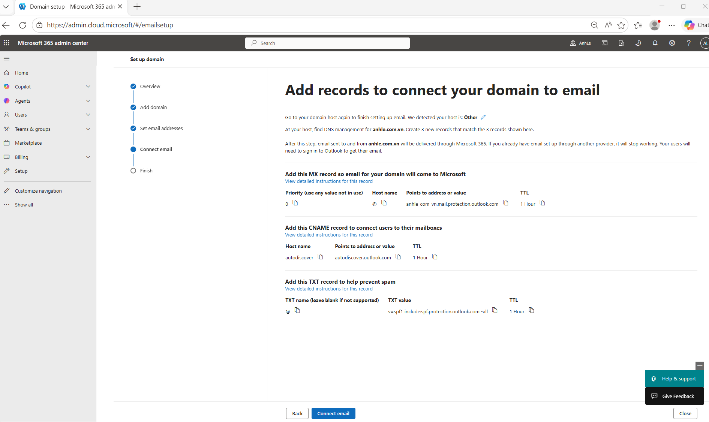

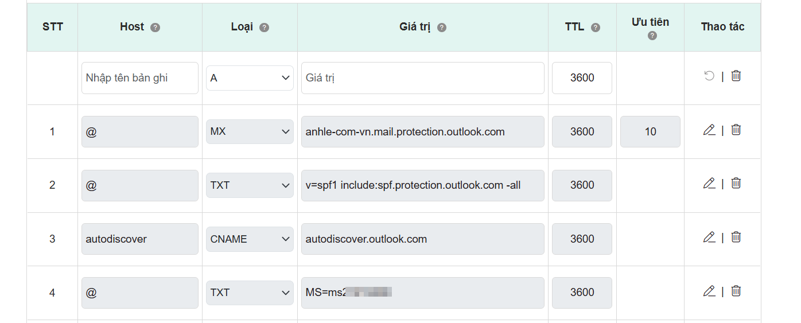

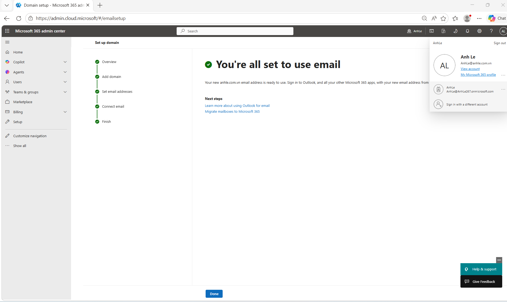

### 2.4. Tạo user IT@anhle.com.vn và gán license

Sau khi domain được verify và DNS records đã thêm, tạo user admin cho lab:

**Vào Admin Center → Users → Active users → Add a user** — wizard gồm 4 bước:

**Bước 1 — Basics:**

| Trường | Giá trị |
|--------|---------|
| First name | `IT` |
| Last name | `AnhLe` |
| Display name | `IT AnhLe` |
| Username | `IT` @ `anhle.com.vn` |
| Password | Tự đặt mật khẩu mạnh (bỏ tick *Auto-generate*) — lưu lại, dùng để đăng ký Zscaler |

**Bước 2 — Product licenses:**
- Chọn **Microsoft 365 Business Basic** ✅

**Bước 3 — Optional settings → Roles:**
- Chọn **Admin center access**
- Tick **Global Administrator** ✅

**Bước 4 — Finish** → **Add user**.

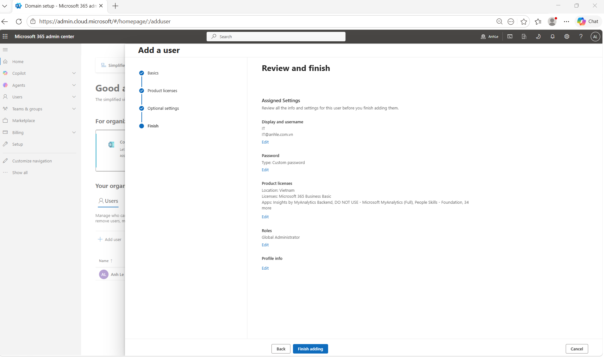

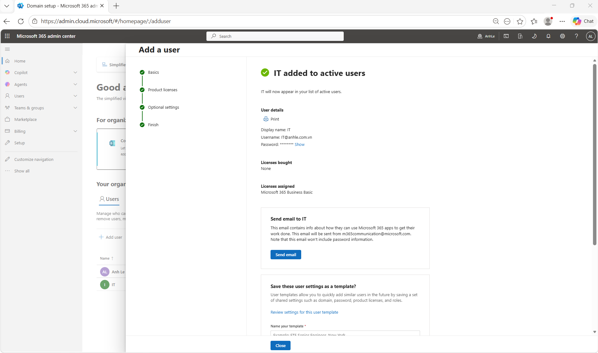

> Tạo thêm ít nhất 2 user thường để test policy Zscaler (lặp lại wizard, **không tick Global Administrator**):
> - `user1@anhle.com.vn` — nhân viên IT, thuộc Group `GRP-IT-Admins`
> - `user2@anhle.com.vn` — nhân viên thường, thuộc Group `GRP-Users`

**Tạo Security Group:**

**Admin Center → Teams & groups → Active teams & groups → Add group:**
- Group type: **Security**
- Name: `GRP-IT-Admins`
- Members: `IT@anhle.com.vn`, `user1@anhle.com.vn`

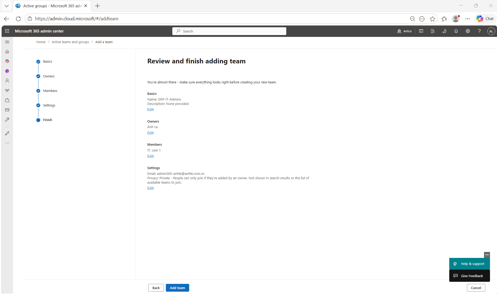

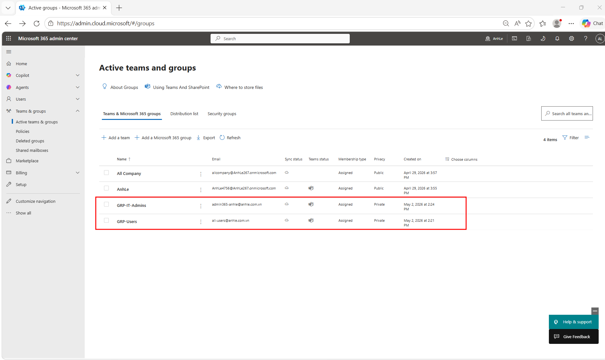

### 2.5. Test gửi nhận mail

Sau khi DNS propagate (dùng [https://mxtoolbox.com](https://mxtoolbox.com) kiểm tra MX record đã active):

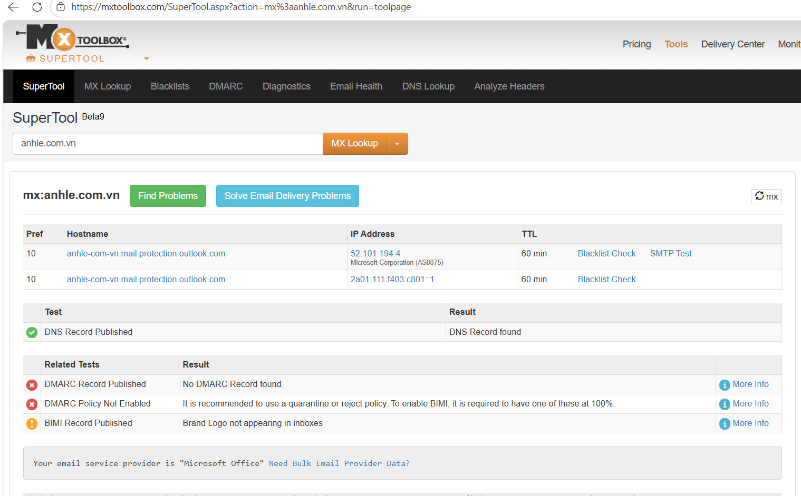

1. Login [https://outlook.office.com](https://outlook.office.com) bằng `IT@anhle.com.vn`.
2. Gửi mail test sang Gmail hoặc địa chỉ mail khác.
3. Nhận mail reply về `IT@anhle.com.vn`.

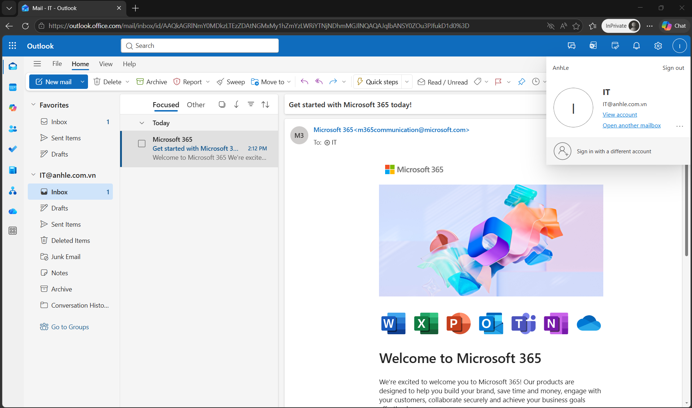

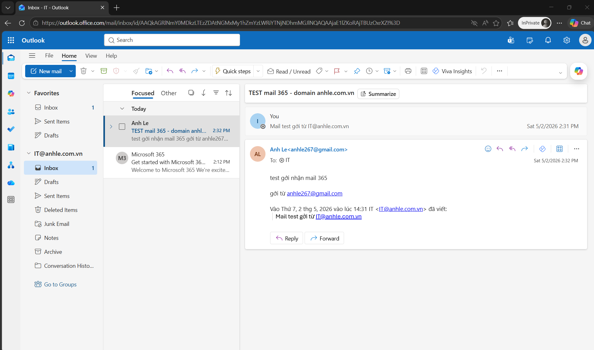

4. Kiểm tra **Spam score** bằng [https://www.mail-tester.com](https://www.mail-tester.com) — mục tiêu đạt 8/10 trở lên.

> Nếu SPF đúng và chưa có DKIM, mail thường đạt **7–8/10**. Sau khi enable DKIM (bước 2.6) sẽ đạt **9–10/10**.

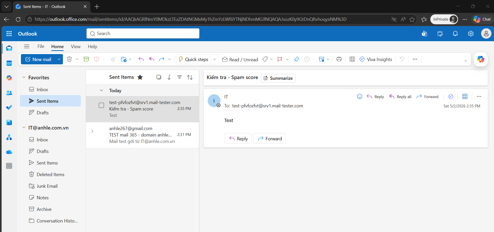

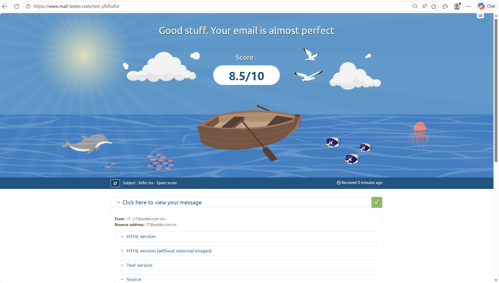

### 2.6. Enable DKIM (thực hiện sau khi mail đã gửi nhận được)

DKIM **không xuất hiện** trong M365 Setup Wizard — phải enable thủ công:

**Bước 1:** Vào [https://security.microsoft.com](https://security.microsoft.com) → **Email & collaboration** → **Policies & Rules** → **Threat policies** → **Email authentication settings** → tab **DKIM**.

**Bước 2:** Chọn domain `anhle.com.vn` → click toggle **Enable**.

M365 sẽ báo lỗi **Client Error** — đây là **bình thường**, không phải lỗi thật. Nội dung lỗi chính là thông báo cho bạn biết **2 bản ghi CNAME cần thêm vào DNS**:

```
CNAME record does not exist for this config.
Please publish the following two CNAME records first.

Host Name : selector1._domainkey
Points to : selector1-anhle-com-vn._domainkey.AnhLe267.q-v1.dkim.mail.microsoft

Host Name : selector2._domainkey
Points to : selector2-anhle-com-vn._domainkey.AnhLe267.q-v1.dkim.mail.microsoft
```

> ⚠️ **Lưu ý quan trọng:** Giá trị CNAME đuôi là `.q-v1.dkim.mail.microsoft` — **không phải** `.onmicrosoft.com`. Copy chính xác từ hộp thoại lỗi của M365, không gõ tay.

**Bước 3:** Click **OK** để đóng hộp thoại lỗi → vào DNS Manager của domain `anhle.com.vn` → thêm 2 bản ghi:

| Loại | Host | Giá trị | TTL |
|------|------|---------|-----|
| `CNAME` | `selector1._domainkey` | `selector1-anhle-com-vn._domainkey.AnhLe267.q-v1.dkim.mail.microsoft` | 3600 |
| `CNAME` | `selector2._domainkey` | `selector2-anhle-com-vn._domainkey.AnhLe267.q-v1.dkim.mail.microsoft` | 3600 |

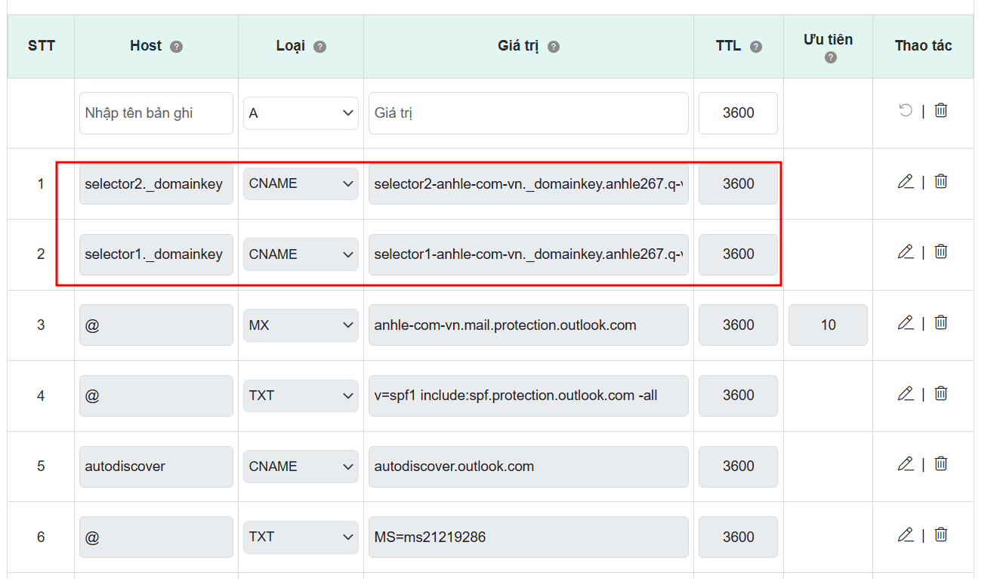

**Bước 4:** Kiểm tra DNS đã propagate chưa bằng lệnh:

```cmd
nslookup -type=CNAME selector1._domainkey.anhle.com.vn 8.8.8.8
nslookup -type=CNAME selector2._domainkey.anhle.com.vn 8.8.8.8
```

Kết quả **thành công** trông như sau (Non-authoritative answer):

```
selector1._domainkey.anhle.com.vn   canonical name = selector1-anhle-com-vn._domainkey.AnhLe267.q-v1.dkim.mail.microsoft
selector2._domainkey.anhle.com.vn   canonical name = selector2-anhle-com-vn._domainkey.AnhLe267.q-v1.dkim.mail.microsoft
```

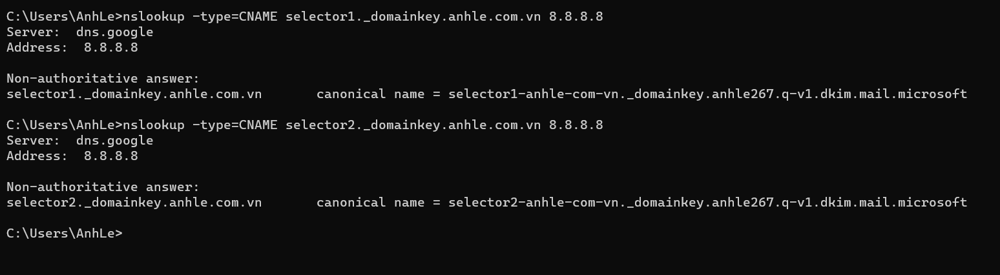

**Bước 5:** Quay lại DKIM → click **Enable** lần nữa.

> ⚠️ **Vẫn còn lỗi "Client Error" dù nslookup đã đúng?** — Đây là tình huống bình thường. DNS của bạn (8.8.8.8) đã nhận bản ghi, nhưng **M365 dùng DNS resolver nội bộ riêng** và chưa cập nhật. Thông báo lỗi có ghi rõ: *"sync will take a few minutes to as many as 4 days"*.
>
> **Giải pháp:** Đóng hộp thoại lỗi → đợi thêm **30 phút đến vài giờ** → quay lại click Enable lại. **Không cần sửa gì thêm**, DNS records đã đúng.
>
> Trong thời gian chờ, tiếp tục các bước tiếp theo của bài lab (dựng ESXi, cài App Connector...) — DKIM không ảnh hưởng đến các phần còn lại.


**Bước 5:** Quay lại [https://security.microsoft.com](https://security.microsoft.com) → **DKIM** → chọn `anhle.com.vn` → click **Enable** lần nữa → trạng thái chuyển sang **Enabled** ✅.

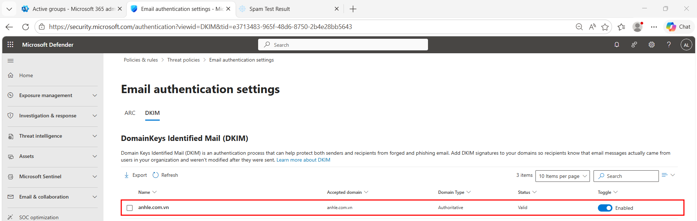

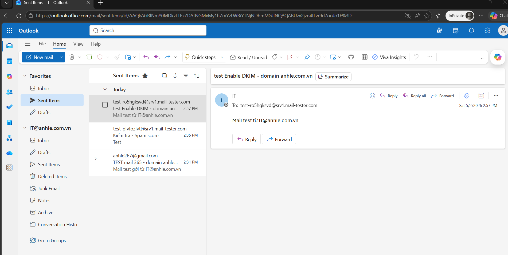

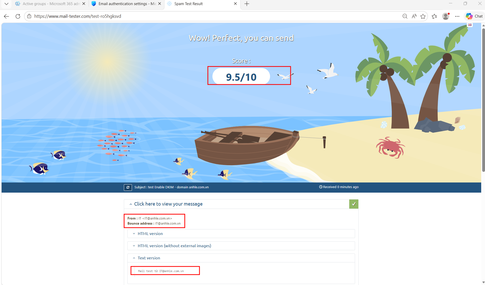

---

## 3. Đăng ký Zscaler ZPA Trial

### 3.1. Đăng ký tài khoản Zscaler

Truy cập: [https://www.zscaler.com/products/zscaler-private-access](https://www.zscaler.com/products/zscaler-private-access) → **Free Trial**.

Điền thông tin:
- **Business email:** `IT@anhle.com.vn` ← **bắt buộc dùng email domain thật** (không nhận Gmail/Yahoo).
- **Company name:** `AnhLe SME`
- **Purpose:** `Evaluating ZTNA solution for upcoming projects`

> **Mẹo:** Sales Zscaler có thể gọi điện hỏi thăm. Trả lời: *"Đang evaluate ZTNA để thay thế VPN truyền thống cho doanh nghiệp vừa và nhỏ."* — họ sẽ kích hoạt tenant nhanh hơn.

Sau khi đăng ký, bạn nhận được email từ Zscaler với thông tin đăng nhập vào **Zscaler Admin Portal** (`admin.zscalerone.net` hoặc `admin.zscalertwo.net` tùy cloud được assign).

### 3.2. Cấu hình SAML SSO với Entra ID

**Mục tiêu:** User login Zscaler Client Connector bằng tài khoản Microsoft 365 — không cần tạo user riêng trong Zscaler.

**Bước 1: Tạo Enterprise Application trong Entra ID**

Vào [https://entra.microsoft.com](https://entra.microsoft.com) → **Enterprise Applications** → **New application** → Tìm **"Zscaler Private Access"** → **Add**.

**Bước 2: Cấu hình SAML**

Trong app vừa tạo → **Single sign-on** → **SAML**:

| Trường | Giá trị |
|--------|---------|
| Identifier (Entity ID) | Lấy từ Zscaler Admin Portal → Administration → Authentication → IDP |
| Reply URL (ACS URL) | Lấy từ Zscaler Admin Portal → Administration → Authentication → IDP |

**Bước 3: Download Federation Metadata XML** từ Entra ID.

**Bước 4: Upload vào Zscaler**

Vào **Zscaler Admin Portal** → **Administration** → **Authentication** → **Authentication Settings**:
- Authentication Type: **SAML**
- Upload file Federation Metadata XML vừa download.

**Bước 5: Assign Group vào app Zscaler**

Trong Enterprise Application → **Users and groups** → Add `GRP-IT-Admins`.

### 3.3. Tạo Group và User Provisioning

Để Zscaler nhận diện được Group từ Entra ID, bật **SCIM Provisioning**:

**Entra ID → Enterprise App Zscaler → Provisioning → Automatic:**
- Tenant URL: Lấy từ Zscaler Portal.
- Secret Token: Generate từ Zscaler Portal.
- Mapping: Sync `GRP-IT-Admins` → Zscaler Group.


---

## 4. Dựng hạ tầng ESXi — LAN 10.10.200.0/24

### 4.1. Chuẩn bị 4 VM trên ESXi

Tạo một **Port Group** riêng trên vSphere: `PG-ZeroTrust-LAN` (`10.10.200.0/24`). Các VM không cần kết nối thẳng ra Internet — chỉ Z-CONNECTOR cần Outbound Internet để kết nối Zscaler Cloud (port 443).

**Cấu hình network trên ESXi:**

```
vSphere Standard Switch (vSwitch)
├── PG-Management       (VLAN 1) — quản trị ESXi
└── PG-ZeroTrust-LAN   (VLAN 200) — lab private, không route ra WAN
```

> **Lưu ý:** Z-CONNECTOR cần đi ra Internet. Trong lab, add thêm 1 NIC cho Z-CONNECTOR kết nối vào Port Group có uplink ra WAN (hoặc NAT qua pfSense).

**Thứ tự cài VM:**
1. `Z-CONNECTOR` — cài đặt trước để test kết nối Zscaler Cloud.
2. `JUMP-SERVER` — cài JumpServer sau khi App Connector đã Up.
3. `SRV-APP-01` và `SRV-WIN-01` — cài cuối, chỉ cần basic OS.

---

## 5. Cài đặt Zscaler App Connector

### 5.1. Chuẩn bị VM Z-CONNECTOR

**Cấu hình VM:**
- OS: Ubuntu 22.04 LTS Server (minimal)
- vCPU: 2, RAM: 2 GB, Disk: 20 GB
- NIC 1: `PG-ZeroTrust-LAN` → IP: `10.10.200.12/24`
- NIC 2: Port Group có Internet uplink (để App Connector gọi ra Zscaler Cloud)

**Cấu hình IP tĩnh** (`/etc/netplan/00-installer-config.yaml`):

```yaml
network:
  version: 2
  ethernets:
    ens160:                      # NIC 1 — LAN private
      addresses: [10.10.200.12/24]
      gateway4: 10.10.200.1
      nameservers:
        addresses: [8.8.8.8, 1.1.1.1]
    ens192:                      # NIC 2 — Internet uplink
      dhcp4: true
```

```bash
sudo netplan apply
```

**Tắt firewall và cập nhật hệ thống:**

```bash
sudo apt update && sudo apt upgrade -y
sudo ufw disable
```

### 5.2. Tạo App Connector Group trên Zscaler Portal

**Zscaler Admin Portal** → **Infrastructure** → **App Connectors** → **App Connector Groups** → **Add**:

| Trường | Giá trị |
|--------|---------|
| Name | `ACG-AnhLe-ESXi-Lab` |
| Location | Vietnam (hoặc chọn gần nhất) |
| Description | `App Connector group for ESXi lab LAN 10.10.200.0/24` |

Sau đó → **App Connectors** → **Add App Connector** → chọn group vừa tạo → **Generate Provision Key**.

Copy **Provision Key** — sẽ dùng ở bước cài đặt.

### 5.3. Cài đặt và enroll App Connector

Trên VM `Z-CONNECTOR`, chạy lệnh sau (thay `<PROVISION_KEY>` bằng key vừa copy):

```bash
# Thêm Zscaler repo
curl -sSL https://pkgs.zscaler.com/zpa-connector/installer.sh | sudo bash -s -- \
  --connector-name "ZC-AnhLe-ESXi-01" \
  --provision-key "<PROVISION_KEY>"
```

Hoặc cài theo phương pháp package thủ công:

```bash
# 1. Thêm Zscaler GPG key và repo
curl -fsSL https://pkgs.zscaler.com/zpa-connector/gpg.key | sudo gpg --dearmor -o /usr/share/keyrings/zpa-connector.gpg
echo "deb [signed-by=/usr/share/keyrings/zpa-connector.gpg] https://pkgs.zscaler.com/zpa-connector/ubuntu jammy main" | sudo tee /etc/apt/sources.list.d/zpa-connector.list

# 2. Cài đặt
sudo apt update && sudo apt install -y zpa-connector

# 3. Enroll với Provision Key
sudo /opt/zscaler/bin/zpa-connector-setup --provision-key "<PROVISION_KEY>"

# 4. Khởi động service
sudo systemctl enable zpa-connector
sudo systemctl start zpa-connector
```

### 5.4. Kiểm tra trạng thái connector

```bash
sudo systemctl status zpa-connector
# Expected: active (running)

# Xem log
sudo journalctl -u zpa-connector -f
```

Kiểm tra trên **Zscaler Admin Portal** → **Infrastructure** → **App Connectors**:
- Status: **Connected** (màu xanh) ✅


---

## 6. Cài đặt JumpServer (Bastion PAM)

### 6.1. Cài JumpServer bằng Docker

**Cấu hình VM JUMP-SERVER:**
- OS: Ubuntu 22.04 LTS
- vCPU: 2, RAM: 4 GB, Disk: 60 GB
- IP: `10.10.200.11/24`

**Cài đặt Docker:**

```bash
sudo apt update && sudo apt install -y ca-certificates curl gnupg
sudo install -m 0755 -d /etc/apt/keyrings
curl -fsSL https://download.docker.com/linux/ubuntu/gpg | sudo gpg --dearmor -o /etc/apt/keyrings/docker.gpg
echo "deb [arch=$(dpkg --print-architecture) signed-by=/etc/apt/keyrings/docker.gpg] https://download.docker.com/linux/ubuntu $(lsb_release -cs) stable" | sudo tee /etc/apt/sources.list.d/docker.list

sudo apt update && sudo apt install -y docker-ce docker-ce-cli containerd.io docker-compose-plugin
sudo usermod -aG docker $USER
newgrp docker
```

**Cài JumpServer bằng quick install script:**

```bash
curl -sSL https://resource.jumpserver.org/install.sh | bash
```

Script sẽ hỏi một số thông tin cấu hình:
- **Server IP/Hostname:** `10.10.200.11`
- **HTTP Port:** `80` (hoặc `8080` nếu cần)
- **Enable HTTPS:** Có thể để mặc định `no` trong lab
- **Database:** Dùng local MySQL (mặc định)

Sau khi cài xong (khoảng 5–10 phút), JumpServer chạy tại `http://10.10.200.11`.

**Kiểm tra container đang chạy:**

```bash
docker ps
# Sẽ thấy các container: jms_core, jms_koko, jms_lion, jms_web, jms_db, jms_redis
```

### 6.2. Cấu hình ban đầu JumpServer

Truy cập `http://10.10.200.11` từ máy trong cùng LAN → đăng nhập bằng tài khoản mặc định:
- Username: `admin`
- Password: `admin` (đổi ngay sau lần đầu đăng nhập)

**Cấu hình cơ bản:**
- **System Settings** → đặt tên tổ chức: `AnhLe SME`
- **Users** → tạo user `it-admin` với role `Administrator`

### 6.3. Tích hợp SAML SSO với Entra ID

**Mục tiêu:** User login JumpServer bằng tài khoản `user1@anhle.com.vn` (Microsoft 365).

**Bước 1: Tạo Enterprise App trong Entra ID**

**Entra ID** → **Enterprise Applications** → **New application** → **Create your own application**:
- Name: `JumpServer-AnhLe-Lab`
- Option: **Integrate any other application you don't find in the gallery**

**Bước 2: Cấu hình SAML trong Entra ID**

**Single sign-on** → **SAML**:

| Trường | Giá trị |
|--------|---------|
| Identifier (Entity ID) | `http://10.10.200.11` |
| Reply URL (ACS URL) | `http://10.10.200.11/core/auth/saml2/callback/` |
| Sign on URL | `http://10.10.200.11` |

**Claims mapping:**
- `user.mail` → `http://schemas.xmlsoap.org/ws/2005/05/identity/claims/emailaddress`
- `user.displayname` → `http://schemas.xmlsoap.org/ws/2005/05/identity/claims/name`

Download **Federation Metadata XML**.

**Bước 3: Cấu hình SAML trong JumpServer**

**JumpServer Admin** → **System Settings** → **Authentication** → **SAML2**:

| Trường | Giá trị |
|--------|---------|
| Enable SAML2 | ✅ |
| Entity ID | `http://10.10.200.11` |
| SP ACS URL | `http://10.10.200.11/core/auth/saml2/callback/` |
| IDP Metadata URL | Upload file XML vừa download từ Entra ID |
| Attribute mapping (email) | `http://schemas.xmlsoap.org/ws/2005/05/identity/claims/emailaddress` |

**Bước 4:** Assign `GRP-IT-Admins` vào Enterprise App JumpServer trong Entra ID.

**Test:** Truy cập `http://10.10.200.11` → click **Login with SSO** → redirect sang Microsoft login page → đăng nhập `user1@anhle.com.vn` → tự động tạo user trong JumpServer.


### 6.4. Thêm Assets (SSH/RDP targets)

Trong JumpServer, khai báo các VM target:

**Assets** → **Asset List** → **Create:**

| Asset Name | IP | Protocol | Port | OS | Credential |
|-----------|----|---------|----|-----|-----------|
| `SRV-APP-01` | `10.10.200.31` | SSH | 22 | Linux | `ansible` (sudo) |
| `SRV-WIN-01` | `10.10.200.32` | RDP | 3389 | Windows | `administrator` |

**Tạo System User (Credential):**

**Credentials** → **System Users** → **Create:**
- Name: `ansible-sudo`
- Protocol: SSH
- Username: `ansible`
- Password: Mật khẩu của user `ansible` trên máy Linux target
- Privilege escalation: `sudo su`

**Assign asset vào Permission:**

**Permissions** → **Asset Permissions** → **Create:**
- Name: `IT-Admins-Full-Access`
- Users: `GRP-IT-Admins` (sync từ Entra ID)
- Assets: `SRV-APP-01`, `SRV-WIN-01`
- System Users: `ansible-sudo`, `administrator`
- Actions: ✅ Connect, ✅ Upload, ✅ Download

---

## 7. Cấu hình Zscaler ZPA Policy

### 7.1. Tạo Application Segment — Internal Bastion

**Zscaler Admin Portal** → **Policy** → **Application Segments** → **Add Application Segment**:

| Trường | Giá trị |
|--------|---------|
| Name | `AppSeg-JumpServer-Bastion` |
| Description | `JumpServer bastion — duy nhất điểm truy cập vào LAN` |
| Domain/IP | `10.10.200.11` |
| TCP Ports | `80, 443, 22, 3389` |
| App Connector Group | `ACG-AnhLe-ESXi-Lab` |
| Segment Group | `SGP-Internal-Bastion` |
| Health Monitoring | ✅ Enable |

> **Zero Trust principle:** Chỉ khai báo IP `10.10.200.11` (JumpServer). Toàn bộ các IP khác trong `10.10.200.0/24` **không được khai báo** → user không thể thấy hay truy cập trực tiếp `SRV-APP-01` hay `SRV-WIN-01`.

### 7.2. Tạo Access Policy

**Policy** → **Access Policy** → **Add Rule**:

| Trường | Giá trị |
|--------|---------|
| Name | `Allow-IT-Admins-Bastion` |
| Description | `Cho phép IT Admins truy cập JumpServer` |
| Action | **Allow** |
| Conditions | **IDP Group** = `GRP-IT-Admins` |
| Application | `AppSeg-JumpServer-Bastion` |

Tạo thêm rule **Deny All** ở cuối với priority thấp nhất:

| Trường | Giá trị |
|--------|---------|
| Name | `Deny-All-Default` |
| Action | **Deny** |
| Conditions | Any |
| Application | All |

> **Thứ tự rule quan trọng:** ZPA áp dụng rule theo thứ tự từ trên xuống, khớp rule đầu tiên thì dừng. `Allow-IT-Admins-Bastion` phải đặt **trước** `Deny-All-Default`.


### 7.3. Cài Zscaler Client Connector trên máy user

Download từ **Zscaler Admin Portal** → **Downloads** → **Client Connector**:
- Windows: `.exe` installer
- macOS: `.pkg` installer
- iOS/Android: App Store

**Cấu hình enrollment:**

Sau khi cài, mở app → nhập **Cloud name** (ví dụ: `zscalerone.net`) → **Enroll** → redirect sang Microsoft login page → đăng nhập bằng `user1@anhle.com.vn` → SAML authentication → enrolled thành công.

```
Status: Connected to Zscaler
Location: Vietnam
Tunnel: ZPA Active
```

---

## 8. Kiểm tra luồng Zero Trust end-to-end

### 8.1. Test Web SSH/RDP qua trình duyệt

1. Bật **Zscaler Client Connector** trên laptop → status **Connected**.
2. Mở trình duyệt → truy cập `http://10.10.200.11`.
3. Click **Login with SSO** → đăng nhập `user1@anhle.com.vn`.
4. Trong JumpServer dashboard → click **Workbench** → chọn `SRV-APP-01`.
5. Chọn protocol `SSH` → click **Connect** → mở terminal SSH trực tiếp trên tab trình duyệt.
6. Tương tự, chọn `SRV-WIN-01` → protocol `RDP` → màn hình Windows Server hiện ra trong browser (HTML5 RDP).

**Kết quả mong đợi:** SSH/RDP hoạt động hoàn toàn trong trình duyệt, **không cần cài thêm client nào**.


### 8.2. Test native client (MobaXterm/MSTSC)

JumpServer hỗ trợ **native client** thông qua cơ chế Jump Host:

**SSH bằng MobaXterm/PuTTY:**

```bash
# Cú pháp: ssh <jumpserver_user>#<target_asset>@<jumpserver_ip> -p 2222
ssh user1@anhle.com.vn#SRV-APP-01@10.10.200.11 -p 2222
# JumpServer xác thực user1 → tự kết nối SSH vào SRV-APP-01
```

**RDP bằng MSTSC:**
- Mở `mstsc.exe` → kết nối tới `10.10.200.11:3389`.
- Đăng nhập vào JumpServer portal → chọn `SRV-WIN-01` → click "Connect via client" → MSTSC tự động nhận config và kết nối vào Windows target.

> **Điều kiện:** Zscaler Client Connector phải đang chạy. Nếu tắt Zscaler, máy laptop không thể ping hay kết nối tới `10.10.200.11` — đây chính là Zero Trust hoạt động.

### 8.3. Kiểm tra Zero Trust — tắt Zscaler thì không vào được

**Test scenario:**

```
Bước 1: Tắt Zscaler Client Connector (Disconnect/Quit)
Bước 2: Mở terminal → ping 10.10.200.11
         → Kết quả: Request timeout (không thấy IP này từ Internet)
Bước 3: Bật Zscaler → ping lại
         → Kết quả: Reply from 10.10.200.11 (thông qua ZPA tunnel)
```

**Verify từ Zscaler Admin Portal:**

**Logs** → **Private Application Logs**: Xem lịch sử truy cập của từng user, thời điểm, IP source, application được truy cập.

```
user1@anhle.com.vn | 2026-05-02 14:30:21 | 10.10.200.11:443 | ALLOWED | AppSeg-JumpServer-Bastion
```

---

## 9. Tổng kết

Sau khi hoàn thành bài lab, bạn đã xây dựng được một **mô hình Zero Trust hoàn chỉnh** cho SME với chỉ 4 VM:

| Thành phần | Vai trò | Trạng thái |
|-----------|---------|-----------|
| **Microsoft 365** | Identity Provider, Exchange Online mail | ✅ |
| **Entra ID** | SAML SSO cho Zscaler và JumpServer | ✅ |
| **Zscaler ZPA** | Thay thế VPN, kiểm soát truy cập Zero Trust | ✅ |
| **Z-CONNECTOR** | Cầu nối LAN ↔ Zscaler Cloud | ✅ |
| **JumpServer** | Bastion PAM — Web + Native SSH/RDP | ✅ |
| **Exchange Online** | Mail `IT@anhle.com.vn` gửi/nhận | ✅ |

**Những gì bạn đã đạt được:**

- ✅ **Không cần VPN Server on-premise** — App Connector tạo kết nối Outbound, không mở port vào LAN.
- ✅ **Single Identity** — 1 tài khoản Microsoft 365 dùng cho cả Zscaler lẫn JumpServer (SAML SSO).
- ✅ **Zero Trust enforcement** — User chỉ thấy đúng 1 IP (`10.10.200.11`), không thể lateral move vào LAN.
- ✅ **Audit trail** — JumpServer ghi hình toàn bộ phiên SSH/RDP, Zscaler log mọi access request.
- ✅ **Cloud-Native** — Không cần Domain Controller, toàn bộ Identity quản lý trên Entra ID.
- ✅ **Tương thích SME** — Tổng RAM chỉ ~14 GB, chi phí thấp, quản lý đơn giản.

**Lộ trình mở rộng tiếp theo:**

| Bước tiếp theo | Mô tả |
|---------------|-------|
| **Zscaler Internet Access (ZIA)** | Lọc traffic Internet của user (Web filtering, SSL inspection) |
| **Conditional Access** | Entra ID Conditional Access Policy — chặn login từ thiết bị không tuân thủ |
| **Device Trust** | Tích hợp Microsoft Intune — chỉ thiết bị MDM-enrolled mới được login Zscaler |
| **JumpServer MFA** | Thêm OTP/TOTP cho JumpServer ngoài SAML |
| **CyberArk PAM** | Nâng cấp lên giải pháp PAM enterprise với Vault và PSM |

> **Mô hình này** đang được nhiều doanh nghiệp SME tại Việt Nam và khu vực áp dụng để **chuyển đổi từ VPN truyền thống sang ZTNA** — một trong những xu hướng bảo mật quan trọng nhất của thập kỷ này.

---

*Bài lab thực hiện trên: VMware vSphere ESXi | Ubuntu 22.04 LTS | Microsoft 365 Business Basic Trial | Zscaler ZPA Trial | JumpServer v3.x (Open Source)*
