Lab OpenStack 2024.2 Dalmatian kết hợp 3 thành phần chính: **OpenSDN (Tungsten Fabric)** thay hoàn toàn Neutron để xử lý SDN, **Ceph Reef 18.x** hyperconverged trên 3 compute node làm backend storage, tất cả triển khai qua `tf-kolla-ansible` branch `opensdn/2024.2` trên 7 VMs Ubuntu 22.04.

1. `registry01` — local Docker Registry v2, mirror toàn bộ images từ `quay.io` + Docker Hub trước khi deploy
2. `ctrl01-03` — OpenStack control plane HA + TF Config/Control/Analytics/DB + Ceph mon/mgr, `ctrl01` kiêm deploy node
3. `compute01-03` — Nova KVM + TF vRouter + Ceph OSD (hyperconverged), `/dev/sdb` 100 GB mỗi node
4. Deploy chạy từ `ctrl01`: `bootstrap-servers` → `prechecks` → `pull` → `deploy` (~45–60 phút)

---

### Mục lục

- [1. Stack \& Kiến trúc](#1-stack--kiến-trúc)
  - [1.1 Stack phiên bản](#11-stack-phiên-bản)
  - [1.2 Topology 7 nodes](#12-topology-7-nodes)
  - [1.3 Luồng traffic TF vRouter](#13-luồng-traffic-tf-vrouter)
- [2. Node Layout, Tài nguyên \& IP Planning](#2-node-layout-tài-nguyên--ip-planning)
  - [2.1 Tài nguyên](#21-tài-nguyên)
  - [2.2 IP planning](#22-ip-planning)
- [3. Base OS (Tất cả nodes)](#3-base-os-tất-cả-nodes)
  - [3.1 Set hostname](#31-set-hostname)
  - [3.2 Swap OFF](#32-swap-off)
  - [3.3 NTP (Chrony)](#33-ntp-chrony)
  - [3.4 Kernel params](#34-kernel-params)
  - [3.5 Base packages](#35-base-packages)
  - [3.6 /etc/hosts](#36-etchosts)
  - [3.7 Docker daemon — insecure local registry](#37-docker-daemon--insecure-local-registry)
- [4. Local Docker Registry (registry01)](#4-local-docker-registry-registry01)
  - [4.1 Khởi chạy Registry v2](#41-khởi-chạy-registry-v2)
  - [4.2 Pull \& push images Kolla + OpenSDN + Ceph](#42-pull--push-images-kolla--opensdn--ceph)
  - [4.3 Verify từ node khác](#43-verify-từ-node-khác)
- [5. Ceph Hyperconverged (cephadm)](#5-ceph-hyperconverged-cephadm)
  - [5.1 Bootstrap từ ctrl01](#51-bootstrap-từ-ctrl01)
  - [5.2 Add host \& deploy OSD](#52-add-host--deploy-osd)
  - [5.3 Tạo pools \& keyrings cho OpenStack](#53-tạo-pools--keyrings-cho-openstack)
- [6. Setup tf-kolla-ansible trên ctrl01](#6-setup-tf-kolla-ansible-trên-ctrl01)
- [7. globals.yml \& inventory multinode](#7-globalsyml--inventory-multinode)
- [8. Copy Ceph configs vào Kolla](#8-copy-ceph-configs-vào-kolla)
- [9. Deploy OpenStack + TF](#9-deploy-openstack--tf)
- [10. Workload đầu tiên](#10-workload-đầu-tiên)
- [11. Service URLs \& Credentials](#11-service-urls--credentials)
- [12. Checklist triển khai](#12-checklist-triển-khai)
- [13. TF vs Neutron — khác biệt cần nhớ](#13-tf-vs-neutron--khác-biệt-cần-nhớ)
- [14. Troubleshooting](#14-troubleshooting)

---

## 1. Stack & Kiến trúc

### 1.1 Stack phiên bản

| Thành phần | Phiên bản | Ghi chú |
|---|---|---|
| **OpenStack** | **2024.2 (Dalmatian)** | Release upstream — OpenSDN-io fork đang track |
| **OpenSDN (Tungsten Fabric)** | **`opensdn/2024.2`** | Deploy bằng `tf-kolla-ansible` |
| **Kolla images** | `2024.2-ubuntu-noble` | `quay.io/openstack.kolla/<service>:2024.2-ubuntu-noble` — container Ubuntu 24.04 |
| **OpenSDN images** | `docker.io/opensdn/<image>:latest` | Mirror lên local registry |
| **Ubuntu host** | **22.04 LTS Jammy** | Host OS — container dùng noble 24.04 (độc lập hoàn toàn) |
| **Ceph** | **Reef 18.x** | `quay.io/ceph/ceph:v18` — deploy độc lập bằng `cephadm` |
| **Python** | 3.10 | Mặc định Ubuntu 22.04, trên ctrl01 |
| **Ansible** | 9.x (ansible-core 2.16) | Theo `tf-kolla-ansible` requirements |
| **Docker** | 29.x | `docker-ce` từ Docker official repo — dùng thống nhất để tránh conflict với kolla bootstrap |

### 1.2 Topology 7 nodes

```
┌───────────────────────────────────────────────────────────────────────────┐
│                  Hypervisor (ESXi / Proxmox / KVM)  —  128 GB RAM         │
│                                                                           │
│  ┌──────────────┐   REGISTRY                                              │
│  │ registry01   │   Docker Registry v2 (mirror quay.io + hub.docker.com)  │
│  │ 2vCPU, 4 GB  │   10.10.200.5                                           │
│  └──────────────┘                                                         │
│                                                                           │
│  ── CONTROL PLANE — 3 controllers HA (ctrl01 kiêm Deploy node) ──         │
│                                                                           │
│  ┌──────────────┐  ┌──────────────┐  ┌──────────────┐                     │
│  │ ctrl01 ★     │  │ ctrl02       │  │ ctrl03       │                     │
│  │ Deploy node  │  │              │  │              │                     │
│  │ OpenStack HA │  │ OpenStack HA │  │ OpenStack HA │                     │
│  │ TF Config    │  │ TF Config    │  │ TF Config    │                     │
│  │ TF Control   │  │ TF Control   │  │ TF Control   │                     │
│  │ TF Analytics │  │ TF Analytics │  │ TF Analytics │                     │
│  │ TF DB / Zk   │  │ TF DB / Zk   │  │ TF DB / Zk   │                     │
│  │ Ceph mon/mgr │  │ Ceph mon/mgr │  │ Ceph mon     │                     │
│  │ 8 vCPU,16 GB │  │ 8 vCPU,16 GB │  │ 8 vCPU,16 GB │                     │
│  └──────┬───────┘  └──────┬───────┘  └──────┬───────┘                     │
│         └─────────────────┼─────────────────┘                             │
│   ╔═══════════════════════════════════════════════════════════╗           │
│   ║  Management / API:   10.10.200.0/24                       ║           │
│   ║  VIP OpenStack API:  10.10.200.50 (HAProxy + Keepalived)  ║           │
│   ║  VIP TF Config API:  10.10.200.51                         ║           │
│   ╚═══════════════════════════════════════════════════════════╝           │
│         ┌─────────────────┼─────────────────┐                             │
│  ┌──────┴───────┐  ┌──────┴───────┐  ┌──────┴───────┐                     │
│  │ compute01    │  │ compute02    │  │ compute03    │   COMPUTE +         │
│  │ Nova KVM     │  │ Nova KVM     │  │ Nova KVM     │   HYPERCONVERGED    │
│  │ TF vRouter   │  │ TF vRouter   │  │ TF vRouter   │   STORAGE           │
│  │ Ceph OSD     │  │ Ceph OSD     │  │ Ceph OSD     │                     │
│  │ 6 vCPU, 8 GB │  │ 6 vCPU, 8 GB │  │ 6 vCPU, 8 GB │                     │
│  └──────────────┘  └──────────────┘  └──────────────┘                     │
│                                                                           │
│   ╔═══════════════════════════════════════════════════════════╗           │
│   ║  Storage / Tunnel:   10.10.201.0/24                       ║           │
│   ║   - Ceph OSD replication                                  ║           │
│   ║   - TF vRouter data plane (MPLSoUDP default, VXLAN tùy)   ║           │
│   ║   - TF XMPP / BGP                                         ║           │
│   ╚═══════════════════════════════════════════════════════════╝           │
└───────────────────────────────────────────────────────────────────────────┘

Resource tổng:
  vCPU: 2 + 3·8 + 3·6 = 50 vCPU
  RAM:  4 + 3·16 + 3·8 = 100 GB  + hypervisor overhead ~5 GB ≈ 105 GB / 128 GB host
  Disk OS:   7 × 200 GB = 1400 GB
  Disk OSD:  3 × 100 GB = 300 GB (raw)  →  usable ~150 GB (replication size=2)
```

### 1.3 Luồng traffic TF vRouter

```
VM tenant
   │
   ▼
TF vRouter (kernel module trên compute)
   │  MPLSoUDP (default)  |  VXLAN (optional)
   ▼
TF Control Node (ctrl01-03)  ──BGP──>  External router (pfSense / Quagga)
   │  XMPP
   ▼
TF Config Node (API / Schema / SVC Monitor)
   │
   ▼
TF Analytics (flow data, stats)
```

> **Default encap order = `MPLSoUDP,MPLSoGRE,VXLAN`** — đổi qua TF WebUI: Configure → Infrastructure → Global Config → Forwarding Options.

---

## 2. Node Layout, Tài nguyên & IP Planning

### 2.1 Tài nguyên

| # | Hostname | Role | vCPU | RAM | Disk OS | Disk Ceph | NIC |
|---|---|---|---|---|---|---|---|
| 0 | `registry01` | Local Docker Registry | 2 | 4 GB | 200 GB | — | 1 |
| 1 | `ctrl01` | Controller + **Deploy** + TF Config/Control/Analytics + TF DB + Zk + Ceph mon/mgr | 8 | 16 GB | 200 GB | — | 2 |
| 2 | `ctrl02` | Controller + TF Config/Control/Analytics + TF DB + Zk + Ceph mon/mgr | 8 | 16 GB | 200 GB | — | 2 |
| 3 | `ctrl03` | Controller + TF Config/Control/Analytics + TF DB + Zk + Ceph mon | 8 | 16 GB | 200 GB | — | 2 |
| 4 | `compute01` | Nova KVM + TF vRouter + Ceph OSD | 6 | 8 GB | 200 GB | 100 GB | 2 |
| 5 | `compute02` | Nova KVM + TF vRouter + Ceph OSD | 6 | 8 GB | 200 GB | 100 GB | 2 |
| 6 | `compute03` | Nova KVM + TF vRouter + Ceph OSD | 6 | 8 GB | 200 GB | 100 GB | 2 |
| — | **TỔNG** | | **50 vCPU** | **100 GB** | **1400 GB** | **300 GB** | |

### 2.2 IP planning

| Hostname | ens160 (MGMT 200.x) | ens192 (TUNNEL 201.x) |
|---|---|---|
| registry01 | 10.10.200.5 | — |
| ctrl01 | 10.10.200.11 | 10.10.201.11 |
| ctrl02 | 10.10.200.12 | 10.10.201.12 |
| ctrl03 | 10.10.200.13 | 10.10.201.13 |
| compute01 | 10.10.200.21 | 10.10.201.21 |
| compute02 | 10.10.200.22 | 10.10.201.22 |
| compute03 | 10.10.200.23 | 10.10.201.23 |
| **VIP OpenStack API** | **10.10.200.50** | — |
| **VIP TF Config API** | **10.10.200.51** | — |
| **Floating IP Pool** | **10.10.200.61–69** (/28 = 10.10.200.60/28) | — |
| Gateway | 10.10.200.1 | — |

| Network | Subnet | Traffic |
|---|---|---|
| Management / API | 10.10.200.0/24 | SSH, Kolla deploy, OpenStack API, Horizon, TF WebUI |
| Storage / Tunnel | 10.10.201.0/24 | Ceph OSD replication, TF vRouter data (MPLSoUDP), TF XMPP/BGP |
| Floating IP | 10.10.200.60/28 | External access vào VM tenant (NAT qua pfSense) |
| Tenant overlay | 192.168.10.0/24 | Tạo sau khi deploy, qua TF WebUI / API |

---

## 3. Base OS (Tất cả nodes)

Cài Ubuntu 22.04 LTS minimal trên 7 VMs (chọn `openssh-server` ở phase select packages). Thực hiện lần lượt các bước sau trên từng node.

### 3.1 Set hostname

```bash
hostnamectl set-hostname ctrl01   # thay: registry01 | ctrl01-03 | compute01-03
```

### 3.2 Swap OFF

```bash
swapoff -a
sed -i '/swap/d' /etc/fstab
free -h   # Swap: phải là 0B
```

### 3.3 NTP (Chrony)

```bash
apt install -y chrony
timedatectl set-timezone Asia/Ho_Chi_Minh
systemctl enable --now chrony
chronyc tracking
```

### 3.4 Kernel params

```bash
cat >> /etc/sysctl.conf <<'EOF'
net.ipv6.conf.all.disable_ipv6 = 1
net.ipv6.conf.default.disable_ipv6 = 1
net.ipv4.ip_forward = 1
net.ipv4.conf.all.rp_filter = 0
net.ipv4.conf.default.rp_filter = 0
net.core.somaxconn = 1024
net.ipv4.tcp_max_syn_backlog = 2048
EOF
sysctl -p
```

### 3.5 Base packages

```bash
apt update
apt install -y \
  python3 python3-pip python3-venv python3-dev \
  openssh-server openssh-client \
  net-tools curl wget git jq \
  vim htop tmux iotop \
  build-essential libssl-dev libffi-dev \
  qemu-guest-agent \
  ca-certificates gnupg

# Docker CE — dùng official repo, tránh conflict với kolla-ansible bootstrap
install -m 0755 -d /etc/apt/keyrings
curl -fsSL https://download.docker.com/linux/ubuntu/gpg \
  | gpg --dearmor -o /etc/apt/keyrings/docker.gpg
chmod a+r /etc/apt/keyrings/docker.gpg

echo "deb [arch=$(dpkg --print-architecture) signed-by=/etc/apt/keyrings/docker.gpg] \
  https://download.docker.com/linux/ubuntu $(. /etc/os-release && echo "$VERSION_CODENAME") stable" \
  | tee /etc/apt/sources.list.d/docker.list > /dev/null

apt update
apt install -y docker-ce docker-ce-cli containerd.io docker-buildx-plugin docker-compose-plugin
systemctl enable --now docker

systemctl stop ufw && systemctl disable ufw 2>/dev/null || true
```

### 3.6 /etc/hosts

```bash
cat >> /etc/hosts <<'EOF'
10.10.200.5    registry01
10.10.200.11   ctrl01
10.10.200.12   ctrl02
10.10.200.13   ctrl03
10.10.200.21   compute01
10.10.200.22   compute02
10.10.200.23   compute03
10.10.200.50   openstack-vip
10.10.200.51   tf-vip
EOF
```

### 3.7 Docker daemon — insecure local registry

```bash
cat > /etc/docker/daemon.json <<'EOF'
{
  "insecure-registries": ["10.10.200.5:5000"],
  "log-driver": "json-file",
  "log-opts": { "max-size": "10m", "max-file": "3" },
  "storage-driver": "overlay2"
}
EOF
systemctl enable docker
systemctl restart docker
docker info | grep -A2 "Insecure Registries"
```


---

## 4. Local Docker Registry (registry01)

Pull images một lần duy nhất từ `quay.io` + `hub.docker.com`, lưu vào `registry01:5000`. Tất cả 6 nodes còn lại pull từ đây — tránh Docker Hub rate-limit và kéo chậm lúc deploy.

### 4.1 Khởi chạy Registry v2

```bash
# Trên registry01 (10.10.200.5)
mkdir -p /opt/registry/data
cat > /opt/registry/docker-compose.yml <<'EOF'
services:
  registry:
    image: registry:2
    container_name: registry
    restart: always
    ports:
      - "5000:5000"
    volumes:
      - /opt/registry/data:/var/lib/registry
    environment:
      REGISTRY_STORAGE_DELETE_ENABLED: "true"
      REGISTRY_LOG_LEVEL: info
EOF

cd /opt/registry
docker compose up -d
docker compose ps

curl http://localhost:5000/v2/_catalog       # → {"repositories":[]}
```

### 4.2 Pull & push images Kolla + OpenSDN + Ceph

```bash
# Chạy trên registry01. Mỗi image: pull → tag → push → rmi
# (rmi tiết kiệm disk; data đã nằm trong /opt/registry/data)
set -e
LOCAL_REG="10.10.200.5:5000"

# Docker Hub login — tránh rate-limit khi pull TF images
read -rp "Docker Hub username: " DHUB_USER
docker login -u "$DHUB_USER"

# ── PHẦN 1 — OpenSDN (TF) images  docker.io/opensdn ──────────────────────
# Tag thực tế là DATE-based (vd: 2024-07-04, 2025-04-28). `latest` thường trỏ
# bản mới nhất nhưng có thể không khớp với branch opensdn/2024.2.
# Liệt kê tags có sẵn:
#   curl -s 'https://hub.docker.com/v2/repositories/opensdn/contrail-vrouter-agent/tags?page_size=20' \
#     | jq -r '.results[].name'
TF_SRC="docker.io/opensdn"
TF_TAG="latest"   # ← thay sang date-tag (vd: 2024-12-15) nếu muốn pin chắc
tf_push() {
  local img=$1
  docker pull  "${TF_SRC}/${img}:${TF_TAG}"
  docker tag   "${TF_SRC}/${img}:${TF_TAG}" "${LOCAL_REG}/opensdn/${img}:${TF_TAG}"
  docker push  "${LOCAL_REG}/opensdn/${img}:${TF_TAG}"
  docker rmi   "${TF_SRC}/${img}:${TF_TAG}" "${LOCAL_REG}/opensdn/${img}:${TF_TAG}" || true
}

# TF Config
for img in contrail-controller-config-api contrail-controller-config-schema \
           contrail-controller-config-svcmonitor contrail-controller-config-devicemgr; do
  tf_push "$img"
done
# TF Control
for img in contrail-controller-control-control contrail-controller-control-dns \
           contrail-controller-control-named; do
  tf_push "$img"
done
# TF Analytics
for img in contrail-analytics-api contrail-analytics-collector contrail-analytics-alarm-gen; do
  tf_push "$img"
done
# TF vRouter
for img in contrail-vrouter-agent contrail-vrouter-kernel-init contrail-vrouter-kernel-build-init; do
  tf_push "$img"
done
# TF common + WebUI
for img in contrail-nodemgr contrail-node-init contrail-status \
           contrail-controller-webui-web contrail-controller-webui-job; do
  tf_push "$img"
done
# TF external — ZooKeeper, Cassandra, Redis
for img in contrail-external-zookeeper contrail-external-cassandra contrail-external-redis; do
  tf_push "$img"
done

# ── PHẦN 2 — Ceph Reef v18 ───────────────────────────────────────────────
# cephadm dùng 1 image cho TẤT CẢ daemon types (mon, mgr, osd, crash, mds)
docker pull  quay.io/ceph/ceph:v18
docker tag   quay.io/ceph/ceph:v18 "${LOCAL_REG}/ceph/ceph:v18"
docker push  "${LOCAL_REG}/ceph/ceph:v18"
docker rmi   quay.io/ceph/ceph:v18 "${LOCAL_REG}/ceph/ceph:v18" || true

# ── PHẦN 3 — Kolla images  quay.io/openstack.kolla ───────────────────────
KOLLA_SRC="quay.io/openstack.kolla"
KOLLA_TAG="2024.2-ubuntu-noble"
KOLLA_NS="openstack.kolla"
kolla_push() {
  local img=$1
  local max=3 n=0
  until docker pull "${KOLLA_SRC}/${img}:${KOLLA_TAG}"; do
    n=$((n+1)); [ $n -ge $max ] && { echo "FAIL: $img after $max tries"; return 1; }
    echo "Retry $n/$max for $img ..."; sleep 5
  done
  docker tag   "${KOLLA_SRC}/${img}:${KOLLA_TAG}" "${LOCAL_REG}/${KOLLA_NS}/${img}:${KOLLA_TAG}"
  docker push  "${LOCAL_REG}/${KOLLA_NS}/${img}:${KOLLA_TAG}"
  docker rmi   "${KOLLA_SRC}/${img}:${KOLLA_TAG}" "${LOCAL_REG}/${KOLLA_NS}/${img}:${KOLLA_TAG}" || true
}

# Infra
for img in kolla-toolbox cron fluentd; do kolla_push "$img"; done
# DB / MQ / Cache
for img in mariadb-server mariadb-clustercheck rabbitmq memcached proxysql; do kolla_push "$img"; done
# HA / LB
for img in haproxy haproxy-ssh keepalived; do kolla_push "$img"; done
# Keystone
for img in keystone keystone-fernet keystone-ssh; do kolla_push "$img"; done
# Placement
kolla_push placement-api
# Nova
for img in nova-api nova-scheduler nova-conductor nova-compute nova-libvirt nova-novncproxy nova-ssh; do kolla_push "$img"; done
# Glance
kolla_push glance-api
# Cinder
for img in cinder-api cinder-volume cinder-scheduler cinder-backup; do kolla_push "$img"; done
# Heat
for img in heat-api heat-api-cfn heat-engine; do kolla_push "$img"; done
# Horizon
kolla_push horizon
# Barbican
for img in barbican-api barbican-keystone-listener barbican-worker; do kolla_push "$img"; done
# Prometheus + Grafana
for img in prometheus-server prometheus-node-exporter prometheus-mysqld-exporter \
           prometheus-memcached-exporter prometheus-cadvisor prometheus-alertmanager \
           prometheus-openstack-exporter prometheus-blackbox-exporter \
           prometheus-libvirt-exporter grafana; do
  kolla_push "$img"
done

TOTAL=$(curl -s "http://${LOCAL_REG}/v2/_catalog" | python3 -c 'import sys,json;print(len(json.load(sys.stdin)["repositories"]))')
echo "✓ Done. Total repos in registry: ${TOTAL}  (expect ~66)"
```

### 4.3 Verify từ node khác

```bash
# Trên ctrl01
ping -c2 registry01
curl -s http://10.10.200.5:5000/v2/_catalog | jq '.repositories | length'  # → ~66
docker pull 10.10.200.5:5000/openstack.kolla/keystone:2024.2-ubuntu-noble
```

---

## 5. Ceph Hyperconverged (cephadm)

Ceph design:
- 3 monitors + 3 managers trên ctrl01-03 → quorum HA
- 3 OSD (1 OSD / compute) trên `/dev/sdb` → hyperconverged
- Replication `size=2`, `min_size=1` → usable ≈ 150 GB

### 5.1 Bootstrap từ ctrl01

Bootstrap từ ctrl01 — node này sẽ là mon/mgr chính, đúng với thiết kế. cephadm tự đăng ký ctrl01 vào cluster với label `_admin` sau khi bootstrap.

```bash
# Trên ctrl01 (10.10.200.11)
apt install -y cephadm ceph-common

# apt cài cephadm bản Quincy, image là Reef (v18) → cần --allow-mismatched-release
# --image là global flag, phải đứng trước subcommand bootstrap
cephadm --image 10.10.200.5:5000/ceph/ceph:v18 bootstrap \
  --mon-ip 10.10.201.11 \
  --cluster-network 10.10.201.0/24 \
  --initial-dashboard-user admin \
  --initial-dashboard-password 'admin' \
  --skip-monitoring-stack \
  --allow-mismatched-release

ceph -s      # 1 mon up (ctrl01), 0 OSD, HEALTH_WARN — bình thường

# Verify bootstrap dùng image local (không phải quay.io)
docker images | grep ceph
# → 10.10.200.5:5000/ceph/ceph   v18   ...   In Use

# Bootstrap hardcode container_image_base = quay.io/ceph/ceph dù dùng --image local
# Phải set lại TRƯỚC khi add host — nếu không ceph orch sẽ pull daemon mới từ quay.io
ceph config set mgr mgr/cephadm/container_image_base 10.10.200.5:5000/ceph/ceph
ceph config get mgr mgr/cephadm/container_image_base
# → 10.10.200.5:5000/ceph/ceph  ← phải là local registry, không phải quay.io

# Dashboard bind 0.0.0.0 theo mặc định — truy cập qua IP active mgr
# ctrl01 là active mgr → https://10.10.200.11:8443/  (user: admin / admin)
echo -n 'admin' | ceph dashboard ac-user-set-password admin --force-password -i -
```

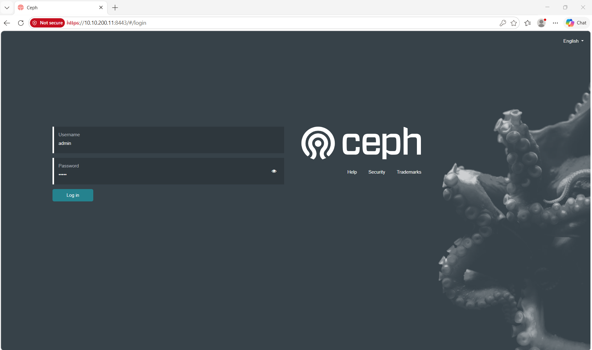

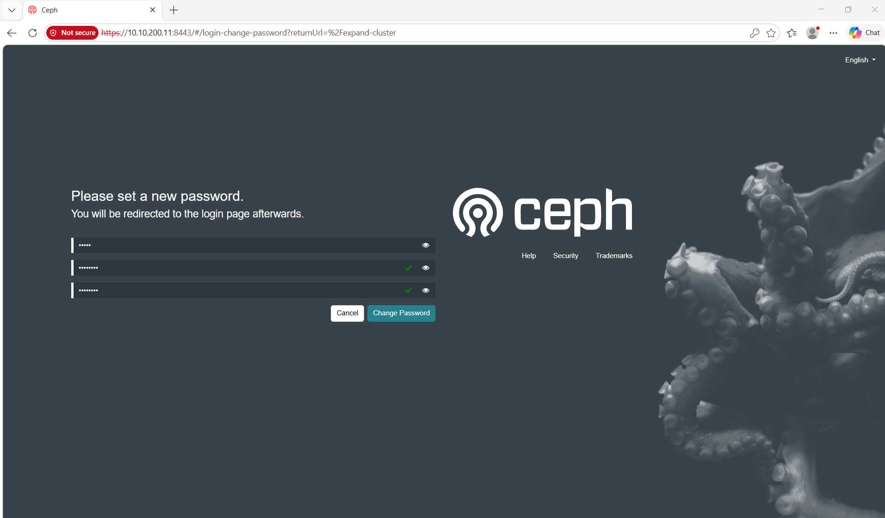

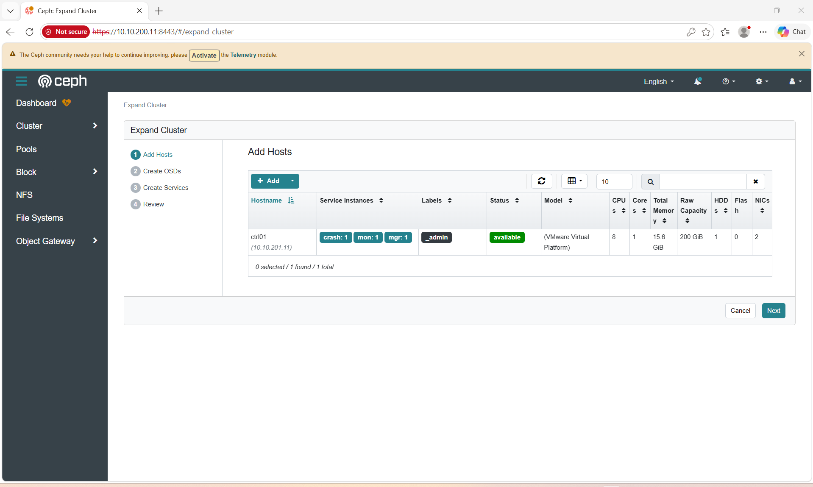

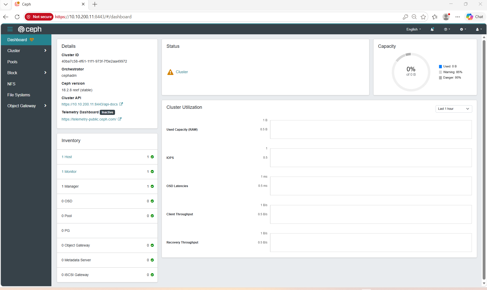

### 5.2 Add host & deploy OSD

```bash
# Chia ssh-pubkey cephadm tới 5 node còn lại (bỏ ctrl01 vì là bootstrap node)
ssh-copy-id -f -i /etc/ceph/ceph.pub root@ctrl02
ssh-copy-id -f -i /etc/ceph/ceph.pub root@ctrl03
ssh-copy-id -f -i /etc/ceph/ceph.pub root@compute01
ssh-copy-id -f -i /etc/ceph/ceph.pub root@compute02
ssh-copy-id -f -i /etc/ceph/ceph.pub root@compute03

# Pause orchestrator trước khi add host — ngăn cephadm auto-deploy mon lên compute node
# (cephadm mặc định muốn 5 mon khi có đủ host, sẽ tự place lên compute nếu không lock)
ceph orch pause

# ctrl01 đã tự đăng ký vào cluster sau bootstrap (label _admin có sẵn)
# Thêm label mon + mgr cho ctrl01
ceph orch host label add ctrl01 mon
ceph orch host label add ctrl01 mgr

# Add host vào cluster (IP tunnel network) + gắn label
ceph orch host add ctrl02    10.10.201.12 --labels mon,mgr
ceph orch host add ctrl03    10.10.201.13 --labels mon
ceph orch host add compute01 10.10.201.21 --labels osd
ceph orch host add compute02 10.10.201.22 --labels osd
ceph orch host add compute03 10.10.201.23 --labels osd

ceph orch host ls --detail   # 6 hosts: ctrl01-03 + compute01-03
```
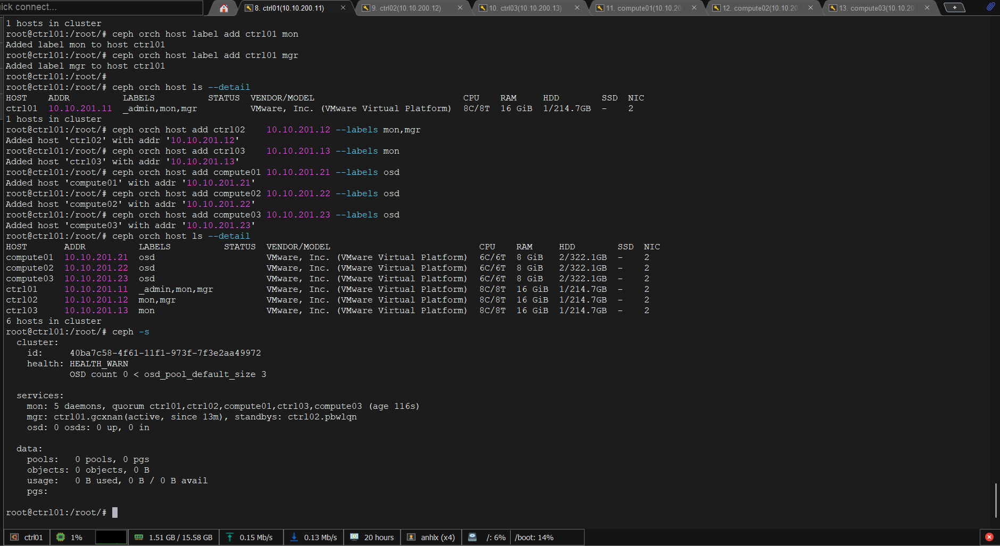

```bash
# Lock placement trước khi resume — mon chỉ chạy trên ctrl nodes
ceph orch apply mon --placement="ctrl01,ctrl02,ctrl03"
ceph orch apply mgr --placement="ctrl01,ctrl02"

# Resume orchestrator — cephadm bắt đầu deploy theo spec đã lock
ceph orch resume

watch -n3 ceph -s   # Chờ "mon: 3 daemons, quorum ctrl01,ctrl02,ctrl03"
```
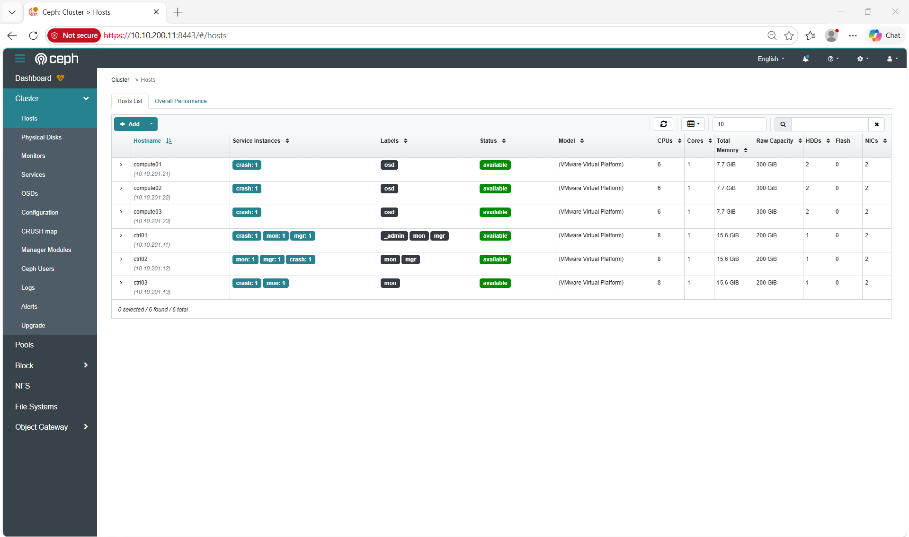

```bash
# Xem disk có sẵn
ceph orch device ls

# Deploy 3 OSD trên /dev/sdb
ceph orch daemon add osd compute01:/dev/sdb
ceph orch daemon add osd compute02:/dev/sdb
ceph orch daemon add osd compute03:/dev/sdb

watch -n5 ceph -s    # Chờ "3 osds: 3 up, 3 in"

# ── VERIFY toàn bộ cluster ────────────────────────────────────────────────
ceph -s                          # health, mon/mgr/osd count
ceph health detail               # chi tiết nếu còn WARN/ERR

ceph orch host ls --detail       # 6 hosts, labels đúng
ceph orch ps                     # tất cả daemon + host + status
ceph orch ls                     # service spec đang active


# Image source — phải là 10.10.200.5:5000, không phải quay.io
ceph config get mgr mgr/cephadm/container_image_base

# Dashboard — mgr active đang ở node nào
ceph mgr stat | grep active_name
# → truy cập https://10.10.200.<X>:8443  (IP management của active mgr)
```
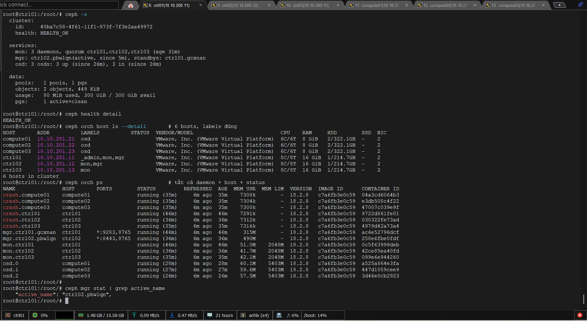

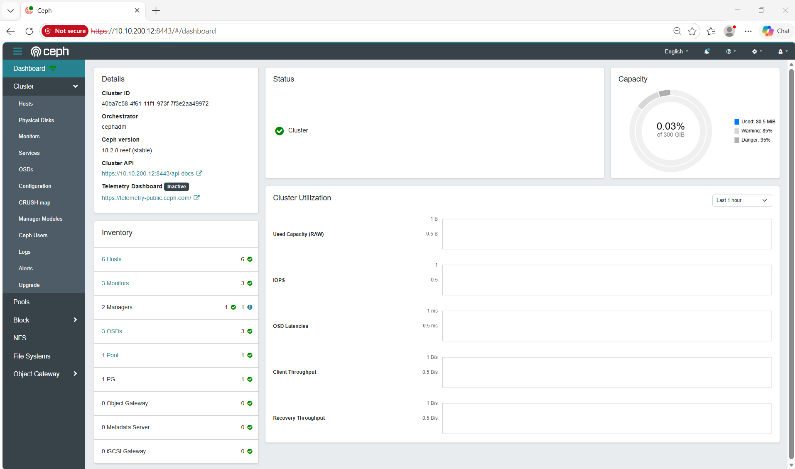

### 5.3 Tạo pools & keyrings cho OpenStack

```bash
# Replication factor cho 3 OSD nhỏ
ceph config set global osd_pool_default_size     2
ceph config set global osd_pool_default_min_size 1

# Pools
ceph osd pool create volumes 64    # Cinder
ceph osd pool create images  32    # Glance
ceph osd pool create vms     64    # Nova ephemeral
ceph osd pool create backups 32    # Cinder backups

for p in volumes images vms backups; do rbd pool init "$p"; done

# Keyrings
ceph auth get-or-create client.glance \
  mon 'allow r' \
  osd 'allow class-read object_prefix rbd_children, allow rwx pool=images' \
  > /etc/ceph/ceph.client.glance.keyring

ceph auth get-or-create client.cinder \
  mon 'profile rbd' \
  osd 'profile rbd pool=volumes, profile rbd pool=vms, profile rbd-read-only pool=images' \
  > /etc/ceph/ceph.client.cinder.keyring

ceph auth get-or-create client.nova \
  mon 'profile rbd' \
  osd 'profile rbd pool=vms, profile rbd-read-only pool=images' \
  > /etc/ceph/ceph.client.nova.keyring

ceph auth get-or-create client.cinder-backup \
  mon 'profile rbd' \
  osd 'profile rbd pool=backups' \
  > /etc/ceph/ceph.client.cinder-backup.keyring

ceph -s             # HEALTH_OK · 3 osds: 3 up, 3 in
ceph osd lspools    # liệt kê tên các pool
ceph osd pool ls detail  # tên pool + replica size, PG count
ceph df             # dung lượng sử dụng từng pool

```

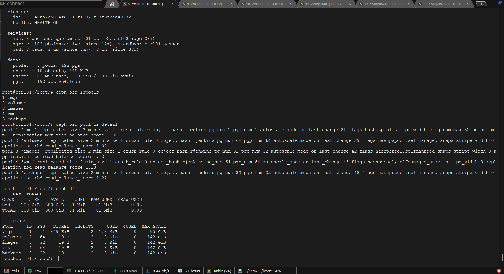

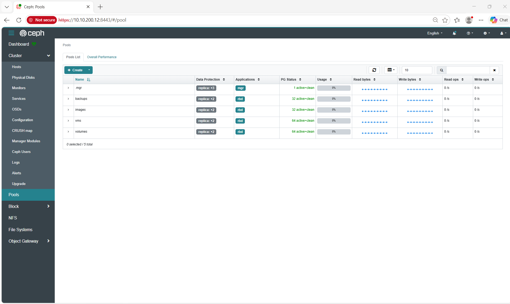

---

## 6. Setup tf-kolla-ansible trên ctrl01

```bash
# Trên ctrl01 — kiêm Deploy node
apt update && apt install -y python3-venv python3-pip git sshpass

# SSH key từ ctrl01 tới mọi node, chỉ dùng trong lab , production sẽ dùng SSH agent, key không lưu trên server
ssh-keygen -t ed25519 -N "" -f ~/.ssh/id_ed25519 -q || true
for node in ctrl02 ctrl03 compute01 compute02 compute03 registry01; do
  ssh-copy-id -o StrictHostKeyChecking=no anhlx@$node
done

# Venv riêng cho deploy
python3 -m venv /opt/tf-kolla-venv
source /opt/tf-kolla-venv/bin/activate
pip install --upgrade pip setuptools wheel

# Clone branch opensdn/2024.2
git clone https://github.com/OpenSDN-io/tf-kolla-ansible.git \
          -b opensdn/2024.2 /opt/tf-kolla-ansible
cd /opt/tf-kolla-ansible

pip install -r requirements.txt
pip install .

kolla-ansible install-deps

kolla-ansible --version    # OpenSDN fork → kolla-ansible 0.1.0.devXXXXX (không dùng upstream versioning)
ansible --version          # core 2.17.x (≥ 2.16 là OK)
```

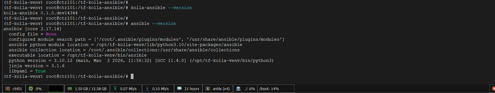

---

## 7. globals.yml & inventory multinode

Thực hiện trên **`ctrl01`**. 

```bash
mkdir -p /etc/kolla

# --- globals.yml ---
cat > /etc/kolla/globals.yml << 'EOF'
---
# Docker Registry
docker_registry: "10.10.200.5:5000"
docker_registry_insecure: "yes"
docker_namespace: "openstack.kolla"

# Base
kolla_base_distro: "ubuntu"
openstack_release: "2024.2"
openstack_tag: "2024.2-ubuntu-noble"

# Network interfaces — điều chỉnh tên NIC nếu khác
network_interface: "ens160"              # Management (VLAN 200)
tunnel_interface:  "ens192"              # Tunnel + Ceph (VLAN 201)

# VIP & HA
kolla_internal_vip_address: "10.10.200.50"
kolla_external_vip_address: "10.10.200.50"
enable_haproxy:    "yes"
enable_keepalived: "yes"

# TF SDN — thay hoàn toàn Neutron
enable_neutron:          "no"
neutron_plugin_agent:    "tungsten"
enable_tungsten_fabric:  "yes"
tf_config_api_vip:       "10.10.200.51"
contrail_api_vip:        "10.10.200.51"
contrail_api_interface_address: "{{ network_interface_address }}"
contrail_enable_analytics:   "yes"
contrail_enable_analyticsdb: "yes"

# External Ceph (cephadm — deploy riêng ở bước 5)
enable_ceph:            "no"
glance_backend_ceph:    "yes"
cinder_backend_ceph:    "yes"
nova_backend_ceph:      "yes"
cinder_backup_driver:   "ceph"
ceph_glance_user:        "glance"
ceph_cinder_user:        "cinder"
ceph_nova_user:          "nova"
ceph_cinder_backup_user: "cinder-backup"

# Compute
nova_compute_virt_type: "kvm"

# Services
enable_cinder:         "yes"
enable_cinder_backup:  "yes"
cinder_cluster_name:   "cinder-cluster"
enable_heat:           "yes"
enable_horizon:        "yes"
enable_barbican:       "yes"
enable_chrony:         "no"
enable_octavia:        "no"
enable_designate:      "no"

# Monitoring
enable_prometheus: "yes"
enable_grafana:    "yes"
EOF

# --- multinode inventory ---
cat > /etc/kolla/multinode << 'EOF'
[control]
ctrl01  ansible_host=10.10.200.11
ctrl02  ansible_host=10.10.200.12
ctrl03  ansible_host=10.10.200.13

[network]
ctrl01
ctrl02
ctrl03

[loadbalancer]
ctrl01
ctrl02
ctrl03

[compute]
compute01  ansible_host=10.10.200.21
compute02  ansible_host=10.10.200.22
compute03  ansible_host=10.10.200.23

[storage]
compute01
compute02
compute03

[monitoring]
ctrl01

[contrail-controllers]
ctrl01
ctrl02
ctrl03

[contrail-analytics]
ctrl01
ctrl02
ctrl03

[contrail-analyticsdb]
ctrl01
ctrl02
ctrl03

[contrail-compute]
compute01
compute02
compute03

[contrail-kubernetes-master]
[contrail-kubernetes-node]

[deployment]
localhost  ansible_connection=local

[bifrost]
# not used — khai báo rỗng để tránh lỗi "dict object has no attribute bifrost"

[baremetal:children]
control
network
compute
storage
monitoring

# ── Nova sub-groups ────────────────────────────────────────────────────────
[nova:children]
control

[nova-api:children]
nova

[nova-conductor:children]
nova

[nova-scheduler:children]
nova

[nova-super-conductor:children]
nova

[nova-novncproxy:children]
nova

[nova-spicehtml5proxy:children]

[nova-serialproxy:children]

[nova-compute:children]
compute

[nova-compute-ironic:children]

[nova-libvirt:children]
compute

[nova-ssh:children]
compute

# ── Placement ──────────────────────────────────────────────────────────────
[placement:children]
control

[placement-api:children]
placement

# ── Keystone ───────────────────────────────────────────────────────────────
[keystone:children]
control

# ── Glance ─────────────────────────────────────────────────────────────────
[glance:children]
control

[glance-api:children]
glance

# ── Cinder ─────────────────────────────────────────────────────────────────
[cinder:children]
control

[cinder-api:children]
cinder

[cinder-scheduler:children]
cinder

[cinder-volume:children]
storage

[cinder-backup:children]
storage

# ── Heat ───────────────────────────────────────────────────────────────────
[heat:children]
control

[heat-api:children]
heat

[heat-api-cfn:children]
heat

[heat-engine:children]
heat

# ── Horizon ────────────────────────────────────────────────────────────────
[horizon:children]
control

# ── Barbican ───────────────────────────────────────────────────────────────
[barbican:children]
control

[barbican-api:children]
barbican

[barbican-keystone-listener:children]
barbican

[barbican-worker:children]
barbican

# ── DB / MQ / Cache ────────────────────────────────────────────────────────
[mariadb:children]
control

[rabbitmq:children]
control

[memcached:children]
control

# ── HA / LB ────────────────────────────────────────────────────────────────
[haproxy:children]
loadbalancer

# ── Monitoring ─────────────────────────────────────────────────────────────
[grafana:children]
monitoring

[prometheus:children]
monitoring

[prometheus-server:children]
monitoring

[prometheus-node-exporter:children]
baremetal

[prometheus-mysqld-exporter:children]
mariadb

[prometheus-memcached-exporter:children]
memcached

[prometheus-cadvisor:children]
baremetal

[prometheus-alertmanager:children]
monitoring

[prometheus-openstack-exporter:children]
monitoring

[prometheus-elasticsearch-exporter:children]

[prometheus-blackbox-exporter:children]
monitoring

[prometheus-libvirt-exporter:children]
nova-libvirt

[all:vars]
ansible_become_method=sudo
EOF
```

> `passwords.yml` sinh tự động ở bước `kolla-genpwd` — không cần tạo tay. Kolla tự fan-out các service group con (`mariadb`, `rabbitmq`, `haproxy`, `keystone`, `horizon`, ...) từ `[control]` + `[monitoring]`.

---

## 8. Copy Ceph configs vào Kolla

```bash
# Trên ctrl01 — vừa là deploy node vừa là ceph bootstrap node
# /etc/ceph/ đã có sẵn từ bước 5, cp local trực tiếp
mkdir -p /etc/kolla/config/{glance,cinder/cinder-volume,cinder/cinder-backup,nova}

cp /etc/ceph/ceph.conf                          /etc/kolla/config/
cp /etc/ceph/ceph.client.glance.keyring         /etc/kolla/config/glance/
cp /etc/ceph/ceph.client.cinder.keyring         /etc/kolla/config/cinder/cinder-volume/
cp /etc/ceph/ceph.client.cinder-backup.keyring  /etc/kolla/config/cinder/cinder-backup/
cp /etc/ceph/ceph.client.nova.keyring           /etc/kolla/config/nova/

# Kolla INI parser không chịu leading TAB trong ceph.conf
# (ceph config generate-minimal-conf hay sinh leading-tab)
sed -i 's/^\t//' /etc/kolla/config/ceph.conf

# Copy ceph.conf vào từng service directory
for d in glance cinder/cinder-volume cinder/cinder-backup nova; do
  cp /etc/kolla/config/ceph.conf /etc/kolla/config/$d/
done

# Verify — mỗi service dir phải có ceph.conf + 1 keyring tương ứng
find /etc/kolla/config -type f | sort
```
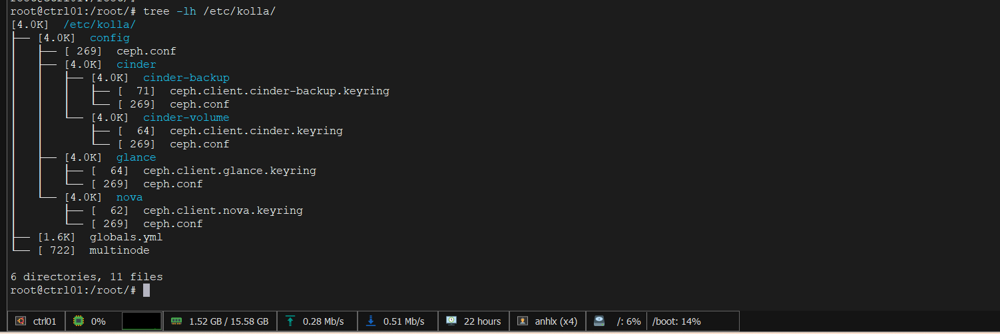

---

## 9. Deploy OpenStack + TF

```bash
source /opt/tf-kolla-venv/bin/activate
cd /opt/tf-kolla-ansible

# 1. Sinh passwords.yml (random + UUID4 cho rbd_secret_uuid)
# kolla-genpwd yêu cầu file passwords.yml phải tồn tại trước — copy template từ repo
cp /opt/tf-kolla-ansible/etc/kolla/passwords.yml /etc/kolla/passwords.yml
kolla-genpwd
# → /etc/kolla/passwords.yml — sao lưu file này ra nơi an toàn

# 2. ansible.cfg — user/key/become đặt ở đây, không truyền trên command line
# tf-kolla-ansible (OpenSDN fork) dùng Click CLI: action trước, -i sau
# -u/--key-file/--become không phải flag của kolla-ansible → đặt vào ansible.cfg
cat > /opt/tf-kolla-ansible/ansible.cfg << 'EOF'
[defaults]
host_key_checking = False
interpreter_python = auto_silent
remote_user = anhlx
private_key_file = /root/.ssh/id_ed25519

[privilege_escalation]
become = True
become_method = sudo
EOF

# 3. Test connectivity — đổi user thì chỉ cần sửa ansible.cfg
ansible -i /etc/kolla/multinode all -m ping
# Expect: 6 nodes + localhost → SUCCESS

# tf-kolla-ansible CLI: <action> -i <inventory>  (action đứng trước -i)

# 4. Bootstrap — cài Docker + python deps, apply daemon.json trên tất cả node
kolla-ansible bootstrap-servers -i /etc/kolla/multinode

# 5. Prechecks
kolla-ansible prechecks -i /etc/kolla/multinode

# 6. Pull images từ local registry (~10–15 phút)
kolla-ansible pull -i /etc/kolla/multinode

# 7. Deploy (~30–60 phút)
kolla-ansible deploy -i /etc/kolla/multinode

# 8. Post-deploy → sinh admin-openrc.sh
kolla-ansible post-deploy -i /etc/kolla/multinode

# 9. Verify
source /etc/kolla/admin-openrc.sh
openstack service list
openstack compute service list   # expect 3 nova-compute up
```

**Nếu deploy lỗi:**

```bash
# Log của 1 service
docker logs -f kolla_nova_api

# Reconfigure — re-render config, restart containers (KHÔNG mất data)
kolla-ansible -i /etc/kolla/multinode reconfigure

# Reset toàn bộ — XOÁ HẾT, chỉ dùng khi muốn làm lại từ đầu
kolla-ansible -i /etc/kolla/multinode destroy --yes-i-really-really-mean-it
docker volume prune -f
```

---

## 10. Workload đầu tiên

```bash
source /etc/kolla/admin-openrc.sh
```

**Tạo Virtual Network qua TF**

> TF dùng VNC API (port 8082). `openstack network create` thông thường sẽ được TF Neutron-plugin map sang Virtual Network — có 2 cách:

```bash
# Cách A — qua OpenStack CLI (TF plugin tự map)
openstack network create demo-network
openstack subnet create demo-subnet \
  --network demo-network \
  --subnet-range 192.168.10.0/24 \
  --allocation-pool start=192.168.10.10,end=192.168.10.250 \
  --dns-nameserver 1.1.1.1
```

Cách B — TF WebUI: `https://10.10.200.51:8143` → Configure → Networking → Networks → Create (trực quan hơn cho lần đầu).

**Upload image + tạo flavor + keypair**

```bash
wget https://cloud-images.ubuntu.com/jammy/current/jammy-server-cloudimg-amd64.img -O jammy.img
openstack image create "Ubuntu-22.04" \
  --file jammy.img --disk-format qcow2 --container-format bare --public

openstack flavor create --vcpus 2 --ram 2048 --disk 20 m1.small
openstack flavor create --vcpus 4 --ram 8192 --disk 60 m1.large

openstack keypair create --public-key ~/.ssh/id_ed25519.pub lab-key
```

**Security group + launch VM**

```bash
openstack security group rule create --protocol icmp default
openstack security group rule create --protocol tcp --dst-port 22 default
openstack security group rule create --protocol tcp --dst-port 3389 default

NET=$(openstack network show demo-network -f value -c id)
openstack server create \
  --flavor m1.small --image Ubuntu-22.04 \
  --network $NET --key-name lab-key --security-group default \
  vm-ubuntu-01

openstack server show vm-ubuntu-01
```

**Floating IP qua TF**

```bash
# Tạo Floating IP Pool 1 lần qua TF WebUI:
#   Configure → Networking → Floating IP Pools → Add Pool
#   Pool: fip-pool   Network: <provider-network mapped tới VLAN 200>

openstack floating ip create <provider-network-name>
openstack server add floating ip vm-ubuntu-01 <floating-ip>

ssh -i ~/.ssh/id_ed25519 ubuntu@<floating-ip>
```

**Test Ceph với Cinder**

```bash
openstack volume create --size 10 test-vol
openstack server add volume vm-ubuntu-01 test-vol

# SSH vào VM — verify disk xuất hiện
ssh -i ~/.ssh/id_ed25519 ubuntu@<floating-ip> -- lsblk

# Trên ctrl01 — verify nằm trong Ceph
sudo rbd -p volumes ls
sudo ceph df
```

---

## 11. Service URLs & Credentials

| Service | URL | Credentials |
|---|---|---|
| Horizon | `http://10.10.200.50` | `admin` / `grep keystone_admin_password /etc/kolla/passwords.yml` |
| TF WebUI | `https://10.10.200.51:8143` | `admin` / `grep contrail_password /etc/kolla/passwords.yml` |
| TF Config API | `http://10.10.200.51:8082` | — |
| TF Analytics API | `http://10.10.200.51:8081` | — |
| Ceph Dashboard | `https://10.10.201.11:8443` | `admin` / password đặt lúc bootstrap |
| Grafana | `http://10.10.200.50:3000` | `admin` / `grep grafana_admin_password /etc/kolla/passwords.yml` |
| Prometheus | `http://10.10.200.50:9091` | — |
| HAProxy Stats | `http://10.10.200.50:1984` | `openstack` / `grep haproxy_password /etc/kolla/passwords.yml` |

> Sau khi mgr migrate, Ceph Dashboard có thể ở mgr active bất kỳ — kiểm tra: `ceph mgr services`.

---

## 12. Checklist triển khai

```
PHASE 0 — REGISTRY (registry01)
□ VM registry01: 2 vCPU, 4 GB, 200 GB
□ Ubuntu 22.04 minimal + bước 3.1-3.7
□ docker compose up -d  (registry:2 port 5000)
□ Push xong ~70 images: Kolla 2024.2-ubuntu-noble + OpenSDN + Ceph v18
□ curl http://10.10.200.5:5000/v2/_catalog → list đầy đủ

PHASE 1 — BASE OS (ctrl01-03, compute01-03)
□ Ubuntu 22.04 minimal trên ctrl01-03, compute01-03
□ Set hostname, Swap OFF, NTP, Kernel params
□ Base packages, /etc/hosts, Docker daemon.json
□ Netplan static IP
□ SSH key từ ctrl01 → tất cả node, không password

PHASE 2 — CEPH
□ cephadm bootstrap --image local-registry --skip-monitoring-stack
□ ssh-copy-id /etc/ceph/ceph.pub tới 5 host còn lại
□ ceph orch host add (compute02-03, ctrl01-03)
□ ceph orch apply mon → 3 mon trên ctrl01-03
□ ceph orch daemon add osd compute0X:/dev/sdb (×3)
□ Pools: volumes / images / vms / backups + rbd pool init
□ Keyrings: client.glance · client.cinder · client.nova · client.cinder-backup
□ ceph -s → HEALTH_OK, 3 osds 3 up 3 in

PHASE 3 — TF-KOLLA-ANSIBLE
□ git clone OpenSDN-io/tf-kolla-ansible -b opensdn/2024.2
□ pip install -r requirements.txt + pip install .
□ kolla-ansible install-deps
□ /etc/kolla/globals.yml (TF + external Ceph + openstack_tag: 2024.2-ubuntu-noble)
□ /etc/kolla/multinode (control + compute + contrail-* + deployment)
□ /etc/kolla/config/{glance,cinder/*,nova}/ceph.conf + keyrings
□ sed -i 's/^\t//' /etc/kolla/config/ceph.conf

PHASE 4 — DEPLOY
□ kolla-genpwd
□ ansible ping all → SUCCESS
□ bootstrap-servers
□ prechecks
□ pull (10–15 min)
□ deploy (30–60 min)
□ post-deploy → admin-openrc.sh

PHASE 5 — VERIFY
□ openstack service list (≥ 6 service core)
□ openstack compute service list (3 nova-compute up)
□ TF WebUI: Monitor → Infrastructure → Nodes — tất cả Active
□ contrail-status trên compute → tất cả Active
□ Ubuntu cloud image upload OK
□ Launch vm-ubuntu-01 → ACTIVE → SSH qua Floating IP
□ Attach Cinder volume → lsblk thấy /dev/vdb → rbd -p volumes ls thấy entry
```

---

## 13. TF vs Neutron — khác biệt cần nhớ

| Tác vụ | Neutron | Tungsten Fabric / OpenSDN |
|---|---|---|
| Backend L2 | OVS / Linuxbridge | `contrail-vrouter` (kernel module) |
| Tạo mạng | `openstack network create` | `openstack network create` (TF plugin map) hoặc TF WebUI / VNC API |
| Security | Security Group | Network Policy + Security Group (TF map về policy) |
| Router | Neutron Router (HA-VRRP) | TF Routing Instance + BGP |
| Floating IP | Neutron FIP | TF Floating IP Pool |
| Load Balancer | Octavia | TF native LBaaS (ECMP) — disable Octavia |
| Debug traffic | `tcpdump` trên `br-int` | `contrail-tools flow --show` trên compute |
| Encapsulation | VXLAN / VLAN | MPLSoUDP (default) · MPLSoGRE · VXLAN |
| Logs | `/var/log/kolla/neutron/` | `/var/log/contrail/contrail-vrouter-agent.log` |

---

## 14. Troubleshooting

**TF vRouter / control:**

```bash
# Trên compute — agent status & flow table
systemctl status contrail-vrouter-agent
docker exec contrail_vrouter_agent contrail-tools vrouter --info
docker exec contrail_vrouter_agent contrail-tools flow --show | head

# Trên controller
docker exec contrail_control contrail-tools control-node show
contrail-status    # tất cả services phải Active
```

**VM không lấy được IP:**

```bash
# TF dùng DHCP built-in trong agent — không phải dnsmasq
docker logs contrail_vrouter_agent | grep -i dhcp

# Verify subnet config trên VNC API
curl -u admin:<contrail-password> http://10.10.200.51:8082/subnets | jq
```

**Cassandra (analyticsdb) OOM:**

```bash
docker stats contrail_analyticsdb

# Giảm heap mặc định 4G xuống 2G
cat > /etc/kolla/config/contrail/analyticsdb.env <<'EOF'
CASSANDRA_HEAP_SIZE=2G
EOF
cd /opt/tf-kolla-ansible
kolla-ansible -i /etc/kolla/multinode reconfigure -t contrail-analyticsdb
```

**Ceph OSD down:**

```bash
ceph osd tree
ceph health detail
ceph orch ps --daemon-type osd
ceph orch logs --daemon osd.0 --lines 100
```

**Kolla container exit:**

```bash
docker ps -a | grep -i exited
docker logs --tail 200 <container>
kolla-ansible -i /etc/kolla/multinode reconfigure -t <service>
```

**Pull lỗi từ local registry sau bootstrap-servers:**

```bash
# bootstrap-servers hay ghi đè daemon.json — verify insecure registry vẫn còn
cat /etc/docker/daemon.json | jq .
# Nếu mất → thêm "insecure-registries":["10.10.200.5:5000"] rồi restart docker
```

**Verify registry còn đủ images:**

```bash
curl -s http://10.10.200.5:5000/v2/_catalog | jq '.repositories | length'   # ~70
curl -s http://10.10.200.5:5000/v2/openstack.kolla/nova-compute/tags/list | jq
```

---

*Verified 05/2026: OpenStack 2024.2 Dalmatian · OpenSDN `tf-kolla-ansible opensdn/2024.2` · Ceph Reef 18.x · Ubuntu 22.04 LTS · 7 VMs (1 registry + 3 controller HA + 3 compute hyperconverged)*
