GPU Cloud đang là mô hình mà các cloud provider thế hệ mới xây dựng: CoreWeave, Lambda Labs, Nebius, Crusoe Energy đều bán GPU compute cho AI teams theo dạng VM hoặc container — không cần sở hữu phần cứng, chỉ trả tiền cho tài nguyên GPU dùng thực tế. Điểm khác biệt so với cloud VM thông thường nằm ở khả năng cấp phát GPU linh hoạt: nguyên GPU cho workload training nặng, hoặc chia nhỏ 1 GPU thành nhiều slot cho inference nhẹ.

Mình xây lab Next-Gen GPU Cloud để PoC stack này từ đầu trên 3 VM Ubuntu 24.04. **Đây là bản converged all-in-one — gom toàn bộ roles (control-plane, compute, storage, GPU provisioning) lên 3 node để lab nhanh; môi trường thực tế sẽ tách thành các tier riêng: dedicated control-plane nodes, GPU compute nodes (server vật lý có GPU), storage nodes.**

Stack Kubernetes-native mà các GPU cloud production đang dùng năm 2025-2026:

1. **RKE2** — Kubernetes HA distribution của Rancher, CIS-hardened, etcd quorum 3 node
2. **Cilium** — CNI eBPF thay kube-proxy, NetworkPolicy enforcement, Gateway API
3. **Rook-Ceph** — distributed storage chạy trên K8s, thay NFS/SAN riêng
4. **KubeVirt** — chạy VM (KVM) như Kubernetes workload, thay OpenStack Nova
5. **GPU Operator + Time-Slicing** — cấp phát GPU cho VM và container, whole hoặc fractional
6. **Capsule** — multi-tenancy hard isolation, mỗi customer một Tenant riêng
7. **Kueue** — GPU job queuing, fair-share scheduling, tự động admit workload khi quota available
8. **MetalLB + Cilium Gateway API** — LoadBalancer và Gateway API routing cho bare metal/VM

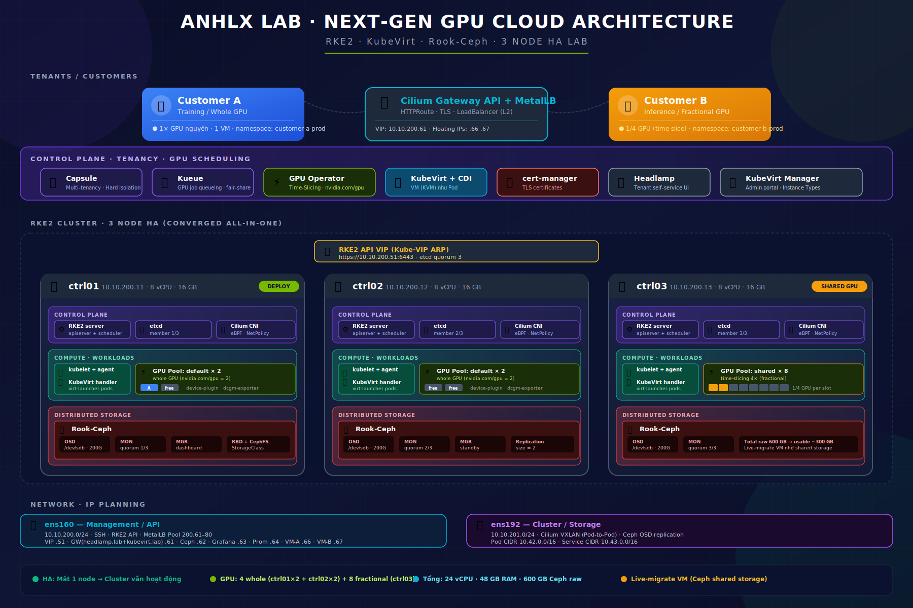

---

## Mục lục

- [Mục lục](#mục-lục)
- [1. Tại sao Kubernetes cho Next-Gen GPU Cloud](#1-tại-sao-kubernetes-cho-next-gen-gpu-cloud)
  - [1.1 OpenStack vs Kubernetes-native](#11-openstack-vs-kubernetes-native)
  - [1.2 Stack phiên bản](#12-stack-phiên-bản)
  - [1.3 Topology 3 nodes](#13-topology-3-nodes)
  - [1.4 Phân bổ RAM 16 GB per node](#14-phân-bổ-ram-16-gb-per-node)
  - [1.5 GPU provisioning hoạt động thế nào](#15-gpu-provisioning-hoạt-động-thế-nào)
  - [1.6 Trade-off POC cần biết](#16-trade-off-poc-cần-biết)
- [2. Node Layout, Tài nguyên \& IP Planning](#2-node-layout-tài-nguyên--ip-planning)
  - [2.1 Tài nguyên](#21-tài-nguyên)
  - [2.2 IP planning](#22-ip-planning)
- [3. Base OS (Tất cả nodes)](#3-base-os-tất-cả-nodes)
  - [3.1 Set hostname + IP Config](#31-set-hostname--ip-config)
  - [3.2 Swap OFF + Disable Firewalls](#32-swap-off--disable-firewalls)
  - [3.3 NTP](#33-ntp)
  - [3.4 Kernel modules + sysctl](#34-kernel-modules--sysctl)
  - [3.5 Base packages](#35-base-packages)
  - [3.6 /etc/hosts](#36-etchosts)
  - [3.7 Disk thứ 2 cho Ceph](#37-disk-thứ-2-cho-ceph)
- [4. Cài RKE2 HA Cluster](#4-cài-rke2-ha-cluster)
  - [4.1 Bootstrap node đầu tiên (ctrl01)](#41-bootstrap-node-đầu-tiên-ctrl01)
  - [4.2 Join ctrl02, ctrl03](#42-join-ctrl02-ctrl03)
  - [4.3 Verify cluster HA](#43-verify-cluster-ha)
- [5. kubectl, Helm, Cilium CLI](#5-kubectl-helm-cilium-cli)
  - [5.1 kubectl + Helm trên ctrl01](#51-kubectl--helm-trên-ctrl01)
  - [5.2 Cilium CLI — Verify CNI](#52-cilium-cli--verify-cni)
- [6. MetalLB — LoadBalancer cho bare metal](#6-metallb--loadbalancer-cho-bare-metal)
- [7. Cert-manager + Cilium Gateway API](#7-cert-manager--cilium-gateway-api)
  - [7.1 Cert-manager](#71-cert-manager)
  - [7.2 Cilium Gateway API](#72-cilium-gateway-api)
- [8. Rook-Ceph Distributed Storage](#8-rook-ceph-distributed-storage)
  - [8.1 Cài Rook Operator](#81-cài-rook-operator)
  - [8.2 Tạo CephCluster](#82-tạo-cephcluster)
  - [8.3 Tạo Pools + StorageClass](#83-tạo-pools--storageclass)
  - [8.4 Ceph Dashboard](#84-ceph-dashboard)
- [9. KubeVirt — chạy VM trên Kubernetes](#9-kubevirt--chạy-vm-trên-kubernetes)
  - [9.1 Cài KubeVirt Operator + CR](#91-cài-kubevirt-operator--cr)
  - [9.2 Cài CDI — Containerized Data Importer](#92-cài-cdi--containerized-data-importer)
  - [9.3 Cài virtctl](#93-cài-virtctl)
  - [9.4 Smoke test VM](#94-smoke-test-vm)
- [10. GPU Operator + Time-Slicing](#10-gpu-operator--time-slicing)
  - [10.1 Cài KWOK](#101-cài-kwok)
  - [10.2 Label nodes với GPU pool](#102-label-nodes-với-gpu-pool)
  - [10.3 Cài GPU Operator](#103-cài-gpu-operator)
  - [10.4 Cấu hình Time-Slicing cho pool shared](#104-cấu-hình-time-slicing-cho-pool-shared)
  - [10.5 Smoke test — Pod với GPU](#105-smoke-test--pod-với-gpu)
- [11. Kueue — GPU Job Queueing](#11-kueue--gpu-job-queueing)
  - [11.1 Cài Kueue](#111-cài-kueue)
  - [11.2 ResourceFlavor — định nghĩa GPU pool](#112-resourceflavor--định-nghĩa-gpu-pool)
  - [11.3 ClusterQueue — quota toàn cluster](#113-clusterqueue--quota-toàn-cluster)
  - [11.4 LocalQueue — queue per tenant namespace](#114-localqueue--queue-per-tenant-namespace)
- [12. Monitoring](#12-monitoring)
- [13. KubeVirt Manager — Admin Portal](#13-kubevirt-manager--admin-portal)
  - [13.1 Cài KubeVirt Manager](#131-cài-kubevirt-manager)
  - [13.2 Instance Types — Định nghĩa GPU flavor](#132-instance-types--định-nghĩa-gpu-flavor)
  - [13.3 Admin features overview](#133-admin-features-overview)
- [14. Capsule — Multi-tenancy](#14-capsule--multi-tenancy)
  - [14.1 Cài Capsule](#141-cài-capsule)
  - [14.2 Helper script — sinh kubeconfig tenant](#142-helper-script--sinh-kubeconfig-tenant)
- [15. Headlamp — User Portal](#15-headlamp--user-portal)
  - [15.1 Cài Headlamp](#151-cài-headlamp)
  - [15.2 Tạo token cho tenant](#152-tạo-token-cho-tenant)
  - [15.3 Login — xem namespace và VM](#153-login--xem-namespace-và-vm)
  - [15.4 Console VM](#154-console-vm)
- [16. Demo: Bán GPU cho khách hàng](#16-demo-bán-gpu-cho-khách-hàng)
  - [16.1 Admin — Tạo Tenant + Sinh kubeconfig](#161-admin--tạo-tenant--sinh-kubeconfig)
    - [Tạo Tenant Customer-A (whole GPU)](#tạo-tenant-customer-a-whole-gpu)
    - [Tạo Tenant Customer-B (fractional GPU)](#tạo-tenant-customer-b-fractional-gpu)
    - [Sinh kubeconfig cho tenant](#sinh-kubeconfig-cho-tenant)
  - [16.2 Customer-A — GPU nguyên](#162-customer-a--gpu-nguyên)
    - [Container với 1 GPU nguyên](#container-với-1-gpu-nguyên)
    - [VM với 1 GPU nguyên](#vm-với-1-gpu-nguyên)
    - [Expose SSH — gắn Floating IP cho VM](#expose-ssh--gắn-floating-ip-cho-vm)
  - [16.3 Customer-B — GPU chia nhỏ](#163-customer-b--gpu-chia-nhỏ)
    - [Container với GPU chia nhỏ (1/4 A100)](#container-với-gpu-chia-nhỏ-14-a100)
    - [VM với GPU chia nhỏ](#vm-với-gpu-chia-nhỏ)
    - [Expose SSH — gắn Floating IP cho VM](#expose-ssh--gắn-floating-ip-cho-vm-1)
  - [16.4 Verify isolation + GPU allocation](#164-verify-isolation--gpu-allocation)
    - [Tổng quan cluster](#tổng-quan-cluster)
    - [Verify network isolation](#verify-network-isolation)
    - [Verify quota enforcement](#verify-quota-enforcement)
  - [16.5 Kueue — Demo GPU job queuing](#165-kueue--demo-gpu-job-queuing)
- [17. Test HA — Tắt 1 node](#17-test-ha--tắt-1-node)
- [18. Service URLs \& Credentials](#18-service-urls--credentials)
- [19. Lời kết](#19-lời-kết)

---

## 1. Tại sao Kubernetes cho Next-Gen GPU Cloud

### 1.1 OpenStack vs Kubernetes-native

OpenStack được thiết kế cho era VM-centric (2010-2018). AI workload có 3 đặc điểm mà OpenStack không xử lý tốt:

| Yêu cầu AI workload | OpenStack | Kubernetes-native |
|---|---|---|
| **Cấp phát GPU cho container** | Cần Magnum + Zun (deprecated), hoặc Nova GPU PCI | Built-in qua Device Plugin framework, GPU Operator |
| **Fractional GPU (time-slice, MIG)** | Không hỗ trợ native | GPU Operator + time-slicing ConfigMap, MIG, DRA |
| **Multi-tenant GPU quota** | Nova quota cho cores/RAM, không có cho GPU | ResourceQuota cho `nvidia.com/gpu` (Capsule enforce per-tenant) |
| **VM + Container cùng platform** | Chỉ VM (Nova). Container qua Zun (deprecated 2024) | KubeVirt cho VM + Pod cho container, cùng K8s API |
| **GitOps / IaC** | Heat templates, complex | Helm + ArgoCD/Flux, mọi config là YAML |
| **AI ecosystem** | Không có native integration | Kubeflow, KServe, Ray, vLLM, NIM — all native K8s |
| **GPU scheduling/queueing** | Không có | Kueue, Volcano, KAI Scheduler |

Năm 2025-2026, mọi GPU cloud lớn (CoreWeave, Lambda, Crusoe, Nebius, Spheron) đều chạy Kubernetes làm control plane. **OpenStack vẫn phù hợp cho private cloud VM thuần**, nhưng để bán GPU theo dạng container hoặc fractional, K8s là lựa chọn duy nhất hợp lý.

### 1.2 Stack phiên bản

Mình dùng toàn bộ từ upstream chính thức:

| Thành phần | Phiên bản | Vai trò |
|---|---|---|
| **Ubuntu host** | 24.04 LTS Noble | OS cho 3 VM |
| **RKE2** | v1.36.1+rke2r1 | Kubernetes HA distribution, CIS-hardened |
| **Cilium** | v1.19.x | CNI eBPF, NetworkPolicy enforcement, Gateway API (thay Ingress-NGINX) |
| **MetalLB** | v0.16.x | LoadBalancer cho bare metal (L2 mode) |
| **Gateway API** | v1.3.x (standard) | Kubernetes Gateway API CRDs |
| **Helm** | v3.21.x | Package manager Kubernetes |
| **cert-manager** | v1.19.x | TLS certificate management |
| **Rook** | v1.19.x | Operator triển khai Ceph trên Kubernetes |
| **Ceph** | Squid v19.x | Distributed storage (block + filesystem), do Rook deploy |
| **KubeVirt** | v1.8.x | Chạy VM (KVM) như Kubernetes Pod |
| **CDI** | v1.65.x | Containerized Data Importer cho disk image KubeVirt |
| **GPU Operator** | v0.0.62 | Cấp phát GPU cho Pod và VM (simulated cho lab) |
| **KWOK** | v0.7.x | Backend cho GPU simulation |
| **Capsule** | v0.12.x | Multi-tenancy operator, hard isolation |
| **Kueue** | v0.17.x | GPU job queuing, fair-share scheduling, admission control |
| **kube-prometheus-stack** | v82.x | Prometheus + Grafana + Alertmanager |

### 1.3 Topology 3 nodes

Mỗi node vừa là control-plane vừa là worker — kiến trúc converged phù hợp cho POC. Production sẽ tách rõ control-plane nodes, GPU compute nodes, và storage nodes thành các tier riêng:

```
┌──────────────────────────────────────────────────────────────────┐
│              POC — 3 NODE ALL-IN-ONE (converged)                 │
│         Production: tách control-plane / GPU node / storage      │
│                                                                  │
│  ┌──────────────┐  ┌──────────────┐  ┌──────────────┐            │
│  │    ctrl01    │  │    ctrl02    │  │    ctrl03    │            │
│  │    Deploy    │  │              │  │              │            │
│  ├──────────────┤  ├──────────────┤  ├──────────────┤            │
│  │ RKE2 server  │  │ RKE2 server  │  │ RKE2 server  │ ← K8s HA   │
│  │ etcd member  │  │ etcd member  │  │ etcd member  │   (quorum) │
│  ├──────────────┤  ├──────────────┤  ├──────────────┤            │
│  │ RKE2 agent   │  │ RKE2 agent   │  │ RKE2 agent   │ ← Workload │
│  │ KubeVirt     │  │ KubeVirt     │  │ KubeVirt     │            │
│  │ GPU pool:    │  │ GPU pool:    │  │ GPU pool:    │            │
│  │   default×2  │  │   default×2  │  │   shared×8   │            │
│  ├──────────────┤  ├──────────────┤  ├──────────────┤            │
│  │ Rook Ceph    │  │ Rook Ceph    │  │ Rook Ceph    │ ← Storage  │
│  │ OSD /dev/sdb │  │ OSD /dev/sdb │  │ OSD /dev/sdb │            │
│  │ MON + MGR    │  │ MON + MGR    │  │ MON          │            │
│  │ 8vCPU, 16 GB │  │ 8vCPU, 16 GB │  │ 8vCPU, 16 GB │            │
│  └──────────────┘  └──────────────┘  └──────────────┘            │
│                                                                  │
│  ╔══════════════════════════════════════════════════════════╗    │
│  ║  Management / API:   10.10.200.0/24                      ║    │
│  ║  RKE2 API VIP:       10.10.200.51 (Kube-VIP ARP)         ║    │
│  ║  MetalLB Pool:       10.10.200.61–80                     ║    │
│  ╚══════════════════════════════════════════════════════════╝    │
│  ╔══════════════════════════════════════════════════════════╗    │
│  ║  Cluster / Ceph:  10.10.201.0/24                         ║    │
│  ║  Pod-to-Pod (Cilium VXLAN), Ceph OSD replication         ║    │
│  ╚══════════════════════════════════════════════════════════╝    │
└──────────────────────────────────────────────────────────────────┘

Resource tổng:
  vCPU: 3 × 8 = 24 vCPU
  RAM:  3 × 16 = 48 GB
  Disk OS:   3 × 100 GB = 300 GB
  Disk Ceph: 3 × 200 GB = 600 GB raw → ~300 GB usable (replication 2)
```

> Mỗi node 2 NIC: `ens160` (mgmt + RKE2 API), `ens192` (cluster Cilium + Ceph traffic).

### 1.4 Phân bổ RAM 16 GB per node

Mình ước tính RAM sử dụng để tránh OOM khi chạy toàn bộ stack cùng lúc:

| Service group | Ước tính |
|---|---|
| OS + system daemons | ~0.5 GB |
| RKE2 server (kube-apiserver, etcd, scheduler, controller-manager, kubelet) | ~2.5 GB |
| Cilium agent | ~0.3 GB |
| Rook-Ceph (1 OSD + mon + mgr + operator) | ~2 GB |
| KubeVirt (virt-controller, virt-handler, virt-api) | ~0.5 GB |
| GPU Operator + KWOK controller | ~0.3 GB |
| Capsule + cert-manager + MetalLB | ~0.4 GB |
| Kueue controller-manager | ~0.2 GB |
| Prometheus + Grafana + Alertmanager | ~1.5 GB |
| **Khả dụng cho VM/container tenant** | **~7–8 GB** |

Tổng ~21–24 GB khả dụng toàn cluster — đủ chạy 4–6 KubeVirt VM nhỏ + nhiều container demo. Kueue controller rất nhẹ (~0.2 GB), không ảnh hưởng đáng kể đến tài nguyên còn lại.

### 1.5 GPU provisioning hoạt động thế nào

Mình dùng **fake-gpu-operator** (do Run:ai phát triển, hiện thuộc NVIDIA) để giả lập GPU NVIDIA A100 trong lab. Production thay bằng **NVIDIA GPU Operator** thật — interface hoàn toàn giống nhau, chỉ swap operator là xong:

```
┌─────────────────────────────────────────────────────────────────┐
│  Tenant Pod / VM                                                │
│  resources.limits.nvidia.com/gpu: 1  ← request "1 GPU"          │
└─────────────────────────────────────────────────────────────────┘
                      │
                      ▼
┌─────────────────────────────────────────────────────────────────┐
│  kube-scheduler                                                 │
│  - Tìm node có "nvidia.com/gpu" available                       │
│  - Place pod lên node ctrl01 hoặc ctrl02 (default pool)         │
└─────────────────────────────────────────────────────────────────┘
                      │
                      ▼
┌─────────────────────────────────────────────────────────────────┐
│  Node ctrl01                                                    │
│  Label: run.ai/simulated-gpu-node-pool=default                  │
│  Capacity: nvidia.com/gpu = 2                                   │
│                                                                 │
│  ┌───────────────────────────────────────────────────────────┐  │
│  │  GPU Operator components                                  │  │
│  │  - device-plugin    → fake nvidia.com/gpu allocation      │  │
│  │  - topology-server  → giả lập NVML, trả về GPU info       │  │
│  │  - nvidia-smi shim  → output giả nvidia-smi               │  │
│  │  - dcgm-exporter    → GPU metrics cho Prometheus          │  │
│  └───────────────────────────────────────────────────────────┘  │
└─────────────────────────────────────────────────────────────────┘
```

Pod chạy bình thường, `nvidia-smi` trả về output như có GPU thật, Prometheus có DCGM metrics. **Không chạy CUDA workload thật được**, nhưng toàn bộ orchestration layer (scheduling, quota, isolation) hoạt động đúng 100% — đủ để demo bán hàng và PoC architecture.

**Fractional GPU** giả lập qua Time-Slicing: tăng `replicasPerGpu` từ 1 lên N → mỗi GPU được advertise thành N "shared GPU slot". Pod request `nvidia.com/gpu: 1` thực ra chỉ chiếm 1/N GPU.

### 1.6 Trade-off POC cần biết

| Điểm | Ghi chú |
|---|---|
| HA control plane | 3 RKE2 server → etcd quorum, mất 1 node vẫn OK |
| HA storage | Rook-Ceph 3 OSD, mon quorum 3 → mất 1 node data vẫn truy cập |
| HA workload | Pod tự reschedule khi node down (~1-2 phút). KubeVirt VM evict và live-migrate |
| GPU simulation | Không chạy CUDA thật. Chỉ demo orchestration + provisioning layer |
| KubeVirt nested | Yêu cầu nested virtualization trong VM — bật ở ESXi VM Settings → CPU |
| POC converged | Mất 1 node = mất 1/3 compute + 1/3 storage đồng thời |
| Production diff | Production: tách control-plane, GPU node (bare metal + GPU thật), storage node |

---

## 2. Node Layout, Tài nguyên & IP Planning

### 2.1 Tài nguyên

| # | Hostname | Role | vCPU | RAM | Disk OS | Disk Ceph | NIC |
|---|---|---|---|---|---|---|---|
| 1 | `ctrl01` | RKE2 server + agent + Rook OSD + **Deploy** | 8 | 16 GB | 100 GB | 200 GB | 2 |
| 2 | `ctrl02` | RKE2 server + agent + Rook OSD | 8 | 16 GB | 100 GB | 200 GB | 2 |
| 3 | `ctrl03` | RKE2 server + agent + Rook OSD | 8 | 16 GB | 100 GB | 200 GB | 2 |
| — | **TỔNG** | | **24 vCPU** | **48 GB** | **300 GB** | **600 GB** | |

> **Yêu cầu ESXi**: bật **Expose hardware-assisted virtualization to the guest OS** trong VM Options → CPU trên cả 3 VM. Đây là điều kiện bắt buộc cho KubeVirt nested KVM.

### 2.2 IP planning

| Hostname | ens160 (MGMT 200.x) | ens192 (CLUSTER 201.x) |
|---|---|---|
| ctrl01 | 10.10.200.11 | 10.10.201.11 |
| ctrl02 | 10.10.200.12 | 10.10.201.12 |
| ctrl03 | 10.10.200.13 | 10.10.201.13 |
| **VIP RKE2 API** | **10.10.200.51** | — |
| **MetalLB Pool** | **10.10.200.61–80** | — |
| Gateway | 10.10.200.1 | — |

| Network | Subnet | Traffic |
|---|---|---|
| Management / API | 10.10.200.0/24 | SSH, RKE2 API (6443/9345), Ingress, MetalLB |
| Cluster / Storage | 10.10.201.0/24 | Cilium VXLAN, Ceph OSD replication |
| Pod CIDR | 10.42.0.0/16 | RKE2 default Pod subnet |
| Service CIDR | 10.43.0.0/16 | RKE2 default Service ClusterIP subnet |

**Services sau khi cài xong:**

| Service | LoadBalancer IP / Hostname | Dùng cho |
|---|---|---|
| Cilium Gateway (HTTP/HTTPS) | 10.10.200.61 | Gateway IP — HTTPRoute thay Ingress-NGINX |
| Ceph Dashboard | 10.10.200.62 | Admin |
| Grafana | 10.10.200.63 | Admin |
| Prometheus | 10.10.200.64 | Admin |
| Headlamp | `headlamp.lab` → 10.10.200.61 | Tenant portal (qua Gateway HTTPRoute) |
| VM SSH Customer-A | 10.10.200.66 | Customer-A |
| VM SSH Customer-B | 10.10.200.67 | Customer-B |
| KubeVirt Manager | `kubevirt.lab` → 10.10.200.61 | Admin portal (qua Gateway HTTPRoute) |

---

## 3. Base OS (Tất cả nodes)

Mình dùng Ubuntu 24.04 LTS minimal trên 3 VM, sau đó thực hiện các bước sau trên **từng node**.

### 3.1 Set hostname + IP Config

```bash
hostnamectl set-hostname ctrl01   # thay: ctrl01 | ctrl02 | ctrl03
```

```yaml
# /etc/netplan/00-installer-config.yaml — thay IP theo từng node
network:
  version: 2
  ethernets:
    ens160:
      dhcp4: false
      dhcp6: false
      addresses:
        - "10.10.200.11/24"        # ctrl02: .12 | ctrl03: .13
      routes:
        - to: "default"
          via: "10.10.200.1"
      nameservers:
        addresses: [8.8.8.8, 1.1.1.1]
    ens192:
      dhcp4: false
      dhcp6: false
      addresses:
        - "10.10.201.11/24"        # ctrl02: .12 | ctrl03: .13
```

```bash
chmod 600 /etc/netplan/00-installer-config.yaml
netplan apply

# Mirror Ubuntu nhanh hơn (tùy chọn)
sed -i 's|http://archive.ubuntu.com/ubuntu|http://mirror.bizflycloud.vn/ubuntu|g; s|http://security.ubuntu.com/ubuntu|http://mirror.bizflycloud.vn/ubuntu|g' /etc/apt/sources.list.d/ubuntu.sources
```

### 3.2 Swap OFF + Disable Firewalls

Kubernetes yêu cầu tắt swap. RKE2 quản lý iptables nên tắt UFW:

```bash
swapoff -a
sed -i '/swap/d' /etc/fstab
free -h   # Swap: phải là 0B

systemctl disable --now ufw

# RKE2 cần iptables-legacy trên Ubuntu 24.04
update-alternatives --set iptables /usr/sbin/iptables-legacy 2>/dev/null || true
update-alternatives --set ip6tables /usr/sbin/ip6tables-legacy 2>/dev/null || true
```

### 3.3 NTP

```bash
apt update
apt install -y chrony
timedatectl set-timezone Asia/Ho_Chi_Minh
systemctl enable --now chrony
chronyc tracking
```

### 3.4 Kernel modules + sysctl

KubeVirt cần KVM nested. Cilium cần BPF. Rook cần rbd:

```bash
cat > /etc/modules-load.d/k8s.conf <<'EOF'
overlay
br_netfilter
nf_conntrack
ip_tables
rbd
nbd
kvm
kvm_intel
vhost_net
EOF

modprobe overlay br_netfilter nf_conntrack rbd nbd vhost_net
modprobe kvm_intel nested=1 2>/dev/null || modprobe kvm_amd nested=1

# Verify nested virtualization
[ "$(cat /sys/module/kvm_intel/parameters/nested 2>/dev/null || cat /sys/module/kvm_amd/parameters/nested 2>/dev/null)" = "Y" ] \
  && echo "Nested KVM: OK" || echo "Nested KVM: FAIL — bật ở ESXi rồi reboot"

cat > /etc/sysctl.d/99-kubernetes.conf <<'EOF'
net.bridge.bridge-nf-call-iptables  = 1
net.bridge.bridge-nf-call-ip6tables = 1
net.ipv4.ip_forward                 = 1
net.ipv6.conf.all.forwarding        = 1
net.ipv4.conf.all.rp_filter         = 0
net.ipv4.conf.default.rp_filter     = 0
net.core.somaxconn                  = 32768
net.ipv4.tcp_max_syn_backlog        = 8192
fs.inotify.max_user_instances       = 8192
fs.inotify.max_user_watches         = 524288
vm.max_map_count                    = 524288
kernel.pid_max                      = 4194304
EOF
sysctl --system
```

### 3.5 Base packages

```bash
apt update
apt install -y \
  curl wget jq unzip git vim htop tmux iotop net-tools dnsutils \
  ca-certificates gnupg apt-transport-https software-properties-common \
  socat conntrack ipset ipvsadm ethtool open-iscsi nfs-common \
  qemu-guest-agent qemu-kvm libvirt-clients

systemctl enable --now iscsid
```

### 3.6 /etc/hosts

```bash
cat >> /etc/hosts <<'EOF'
10.10.200.11   ctrl01
10.10.200.12   ctrl02
10.10.200.13   ctrl03
10.10.200.51   rke2-api
EOF
```

### 3.7 Disk thứ 2 cho Ceph

Mình verify disk `/dev/sdb` 200 GB tồn tại và để raw — Rook sẽ tự format:

```bash
lsblk
# NAME    SIZE   TYPE
# sda     100G   disk    (OS)
# sdb     200G   disk    ← Ceph OSD, để raw

# Nếu disk đã dùng trước — wipe sạch
wipefs -a /dev/sdb
dd if=/dev/zero of=/dev/sdb bs=1M count=100
```

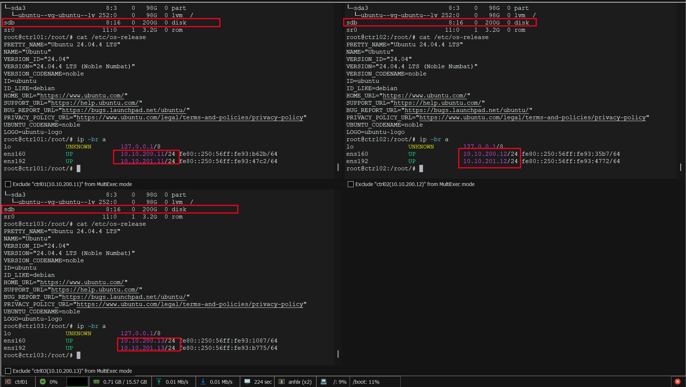

> Sau khi xong tất cả 3 node — **reboot**: `reboot`. Kiểm tra lại nested KVM sau reboot.

---

## 4. Cài RKE2 HA Cluster

RKE2 là Kubernetes distribution của Rancher, CIS-hardened, containerd built-in. HA setup 3 server node đều chạy etcd + API server. Mình dùng **Kube-VIP** làm VIP cho API endpoint — thay vì external load balancer, Kube-VIP dùng ARP để quảng bá VIP trên `ens160`.

### 4.1 Bootstrap node đầu tiên (ctrl01)

**Kube-VIP** tạo một Virtual IP (VIP) `10.10.200.51` trên `ens160` bằng ARP — client gọi `https://10.10.200.51:6443` không cần biết node nào đang giữ VIP. Khi node chứa VIP down, Kube-VIP trên node khác giành VIP qua leader election, kubectl và Cilium tiếp tục hoạt động. Thay thế tốt cho HAProxy + Keepalived bên ngoài vì Kube-VIP chạy như DaemonSet trong cluster, không cần VM riêng.

```bash
# Trên ctrl01 (10.10.200.11)
mkdir -p /etc/rancher/rke2

cat > /etc/rancher/rke2/config.yaml <<'EOF'
token: ai-cloud-lab-secret-2026

tls-san:
  - rke2-api
  - 10.10.200.51
  - ctrl01
  - ctrl02
  - ctrl03

cni:
  - cilium
disable-kube-proxy: true

disable:
  - rke2-ingress-nginx
  - rke2-snapshot-controller
  - rke2-snapshot-controller-crd

node-ip: 10.10.200.11
node-external-ip: 10.10.200.11

cluster-cidr: 10.42.0.0/16
service-cidr: 10.43.0.0/16

write-kubeconfig-mode: "0644"

etcd-snapshot-schedule-cron: "0 */6 * * *"
etcd-snapshot-retention: 28
EOF

# Cài RKE2
curl -sfL https://get.rke2.io | INSTALL_RKE2_VERSION=v1.36.1+rke2r1 INSTALL_RKE2_TYPE=server sh -

# Deploy Kube-VIP manifest trước khi start RKE2
mkdir -p /var/lib/rancher/rke2/server/manifests

cat > /var/lib/rancher/rke2/server/manifests/kube-vip.yaml <<'EOF'
---
apiVersion: rbac.authorization.k8s.io/v1
kind: ClusterRole
metadata:
  name: kube-vip
rules:
  - apiGroups: [""]
    resources: ["services/status"]
    verbs: ["update"]
  - apiGroups: [""]
    resources: ["services", "endpoints", "nodes"]
    verbs: ["list","get","watch","update"]
  - apiGroups: ["discovery.k8s.io"]
    resources: ["endpointslices"]
    verbs: ["list","get","watch","update"]
  - apiGroups: ["coordination.k8s.io"]
    resources: ["leases"]
    verbs: ["list","get","watch","update","create"]
---
apiVersion: v1
kind: ServiceAccount
metadata:
  name: kube-vip
  namespace: kube-system
---
apiVersion: rbac.authorization.k8s.io/v1
kind: ClusterRoleBinding
metadata:
  name: kube-vip
roleRef:
  apiGroup: rbac.authorization.k8s.io
  kind: ClusterRole
  name: kube-vip
subjects:
- kind: ServiceAccount
  name: kube-vip
  namespace: kube-system
---
apiVersion: apps/v1
kind: DaemonSet
metadata:
  name: kube-vip
  namespace: kube-system
spec:
  selector:
    matchLabels:
      name: kube-vip
  template:
    metadata:
      labels:
        name: kube-vip
    spec:
      affinity:
        nodeAffinity:
          requiredDuringSchedulingIgnoredDuringExecution:
            nodeSelectorTerms:
            - matchExpressions:
              - key: node-role.kubernetes.io/control-plane
                operator: Exists
      containers:
      - args:
        - manager
        env:
        - name: vip_arp
          value: "true"
        - name: port
          value: "6443"
        - name: vip_cidr
          value: "32"
        - name: cp_enable
          value: "true"
        - name: cp_namespace
          value: kube-system
        - name: vip_ddns
          value: "false"
        - name: svc_enable
          value: "false"
        - name: vip_leaderelection
          value: "true"
        - name: vip_leaseduration
          value: "5"
        - name: vip_renewdeadline
          value: "3"
        - name: vip_retryperiod
          value: "1"
        - name: address
          value: 10.10.200.51
        - name: vip_interface
          value: ens160
        image: ghcr.io/kube-vip/kube-vip:v1.0.4
        imagePullPolicy: IfNotPresent
        name: kube-vip
        securityContext:
          capabilities:
            add:
            - NET_ADMIN
            - NET_RAW
            - SYS_TIME
      hostNetwork: true
      serviceAccountName: kube-vip
      tolerations:
      - effect: NoSchedule
        operator: Exists
      - effect: NoExecute
        operator: Exists
EOF

# Cilium config — tạo trước khi start RKE2
# k8sServiceHost/Port: Cilium dùng để bootstrap trực tiếp vào API server node IP,
# tránh chicken-and-egg khi disable-kube-proxy: true (service ClusterIP 10.43.0.1
# chưa route được vì Cilium chưa chạy)
cat > /var/lib/rancher/rke2/server/manifests/rke2-cilium-config.yaml <<'EOF'
apiVersion: helm.cattle.io/v1
kind: HelmChartConfig
metadata:
  name: rke2-cilium
  namespace: kube-system
spec:
  valuesContent: |-
    kubeProxyReplacement: true
    k8sServiceHost: 10.10.200.11
    k8sServicePort: 6443
    gatewayAPI:
      enabled: true
EOF

# Bật và start RKE2
systemctl enable --now rke2-server.service

# Theo dõi log (5–10 phút)
journalctl -u rke2-server -f
```

Đợi đến khi log có `Wrote kubeconfig` và `Running kubelet`, rồi verify:

```bash
export KUBECONFIG=/etc/rancher/rke2/rke2.yaml
export PATH=$PATH:/var/lib/rancher/rke2/bin

kubectl get nodes        # 1 node Ready
kubectl get pods -A      # Cilium, CoreDNS, kube-vip running

# Verify VIP đã bind
ip a show ens160 | grep 10.10.200.51
curl -k https://10.10.200.51:6443/livez   # → ok
```

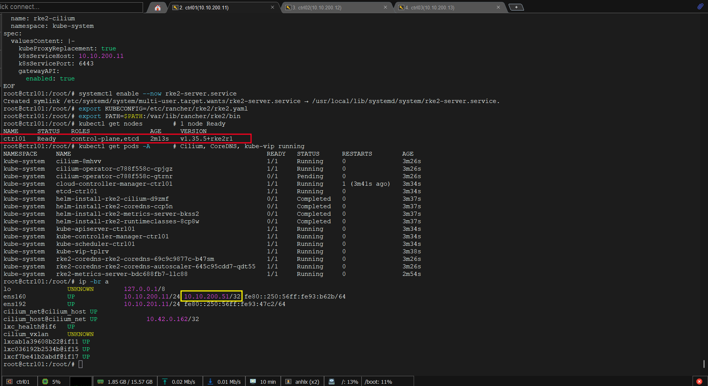

**Bước bổ sung — Chuyển Cilium sang dùng VIP:**

Config ban đầu dùng `k8sServiceHost: 10.10.200.11` (IP cứng của ctrl01) vì VIP chưa có khi bootstrap. Giờ VIP đã hoạt động, mình update để Cilium agents trên ctrl02/ctrl03 khi join sẽ bootstrap qua VIP — đảm bảo HA thực sự: nếu ctrl01 down, Cilium trên node còn lại vẫn kết nối được API server qua VIP:

```bash
# Cập nhật manifest — RKE2 Helm controller tự phát hiện thay đổi và upgrade Cilium
cat > /var/lib/rancher/rke2/server/manifests/rke2-cilium-config.yaml <<'EOF'
apiVersion: helm.cattle.io/v1
kind: HelmChartConfig
metadata:
  name: rke2-cilium
  namespace: kube-system
spec:
  valuesContent: |-
    kubeProxyReplacement: true
    k8sServiceHost: 10.10.200.51
    k8sServicePort: 6443
    gatewayAPI:
      enabled: true
EOF

# Đợi Cilium DaemonSet rolling update xong (~1-2 phút)
kubectl -n kube-system rollout status ds/cilium --timeout=180s
# Verify API vẫn hoạt động sau khi Cilium restart
curl -k https://10.10.200.51:6443/livez   # → ok
```

### 4.2 Join ctrl02, ctrl03

Trên **ctrl02 và ctrl03** chạy:

```bash
# Trên ctrl02 (thay node-ip thành .13 cho ctrl03)
mkdir -p /etc/rancher/rke2

cat > /etc/rancher/rke2/config.yaml <<'EOF'
server: https://10.10.200.51:9345
token: ai-cloud-lab-secret-2026

tls-san:
  - rke2-api
  - 10.10.200.51

cni:
  - cilium
disable-kube-proxy: true

disable:
  - rke2-ingress-nginx
  - rke2-snapshot-controller
  - rke2-snapshot-controller-crd

node-ip: 10.10.200.12          # ctrl03: 10.10.200.13
node-external-ip: 10.10.200.12 # ctrl03: 10.10.200.13

cluster-cidr: 10.42.0.0/16
service-cidr: 10.43.0.0/16

write-kubeconfig-mode: "0644"
EOF

curl -sfL https://get.rke2.io | INSTALL_RKE2_VERSION=v1.36.1+rke2r1 INSTALL_RKE2_TYPE=server sh -
systemctl enable --now rke2-server.service

# Theo dõi join (3-5 phút)
journalctl -u rke2-server -f
```

### 4.3 Verify cluster HA

Trở lại ctrl01:

```bash
export KUBECONFIG=/etc/rancher/rke2/rke2.yaml
export PATH=$PATH:/var/lib/rancher/rke2/bin

kubectl get nodes -o wide     # 3 node Ready

# Verify etcd quorum
kubectl -n kube-system exec -ti etcd-ctrl01 -- etcdctl \
  --cacert /var/lib/rancher/rke2/server/tls/etcd/server-ca.crt \
  --cert /var/lib/rancher/rke2/server/tls/etcd/server-client.crt \
  --key /var/lib/rancher/rke2/server/tls/etcd/server-client.key \
  endpoint status --cluster -w table
# 3 endpoints, 1 LEADER, 2 FOLLOWER → quorum OK
```

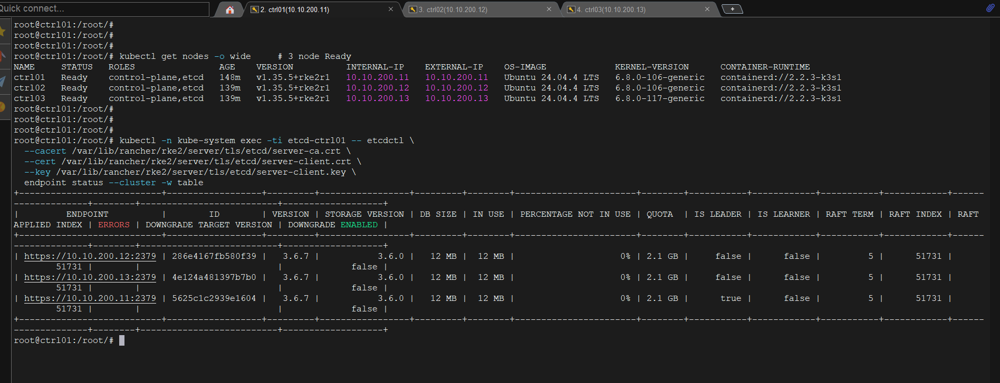

RKE2 dùng **containerd** làm container runtime — không có `docker` hay `podman` trên node. Để inspect container/image trực tiếp, mình dùng `crictl` (CRI client). RKE2 dùng socket riêng tại `/run/k3s/containerd/containerd.sock`, cần config một lần:

```bash
# Config crictl trỏ đúng socket của RKE2
cat > /etc/crictl.yaml <<'EOF'
runtime-endpoint: unix:///run/k3s/containerd/containerd.sock
image-endpoint: unix:///run/k3s/containerd/containerd.sock
EOF

# Symlink crictl vào PATH
ln -sf /var/lib/rancher/rke2/bin/crictl /usr/local/bin/crictl
```

Sau đó dùng như docker:

```bash
crictl ps              # docker ps
crictl images          # docker images
crictl pull <image>    # docker pull
crictl inspect <id>    # docker inspect
```

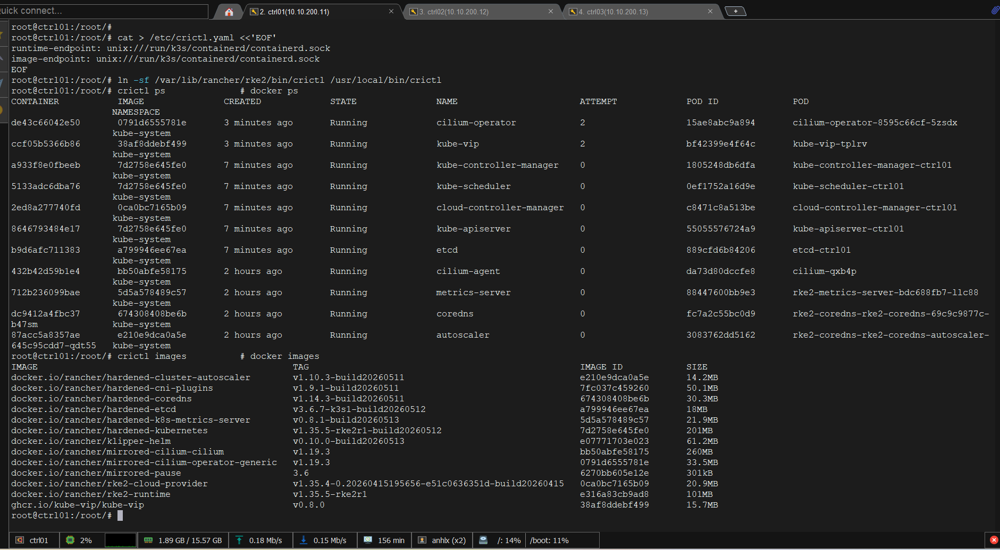

---

## 5. kubectl, Helm, Cilium CLI

- RKE2 bundle sẵn `kubectl` nhưng binary nằm trong `/var/lib/rancher/rke2/bin/` — chưa có trong `PATH`. 
- **Helm** là package manager Kubernetes: thay vì apply từng YAML thủ công, mỗi component (Rook, Capsule, MetalLB...) đều có Helm chart kèm sẵn giá trị mặc định và quản lý upgrade/rollback. 
- **Cilium CLI** là tool riêng để verify trạng thái CNI — không thể làm qua `kubectl` vì Cilium do RKE2 Helm controller quản lý, không phải Helm release thông thường.

### 5.1 kubectl + Helm trên ctrl01

```bash
# Symlink kubectl
ln -sf /var/lib/rancher/rke2/bin/kubectl /usr/local/bin/kubectl

# Persist KUBECONFIG
echo 'export KUBECONFIG=/etc/rancher/rke2/rke2.yaml' >> ~/.bashrc
echo 'export PATH=$PATH:/var/lib/rancher/rke2/bin' >> ~/.bashrc
source ~/.bashrc

# Helm v3
curl -fsSL https://raw.githubusercontent.com/helm/helm/main/scripts/get-helm-3 | bash
helm version

# Bash completion
kubectl completion bash > /etc/bash_completion.d/kubectl
echo 'alias k=kubectl' >> ~/.bashrc
echo 'complete -F __start_kubectl k' >> ~/.bashrc
```

### 5.2 Cilium CLI — Verify CNI

```bash
CILIUM_CLI_VERSION=$(curl -s https://raw.githubusercontent.com/cilium/cilium-cli/main/stable.txt)
curl -L --fail --remote-name-all \
  https://github.com/cilium/cilium-cli/releases/download/${CILIUM_CLI_VERSION}/cilium-linux-amd64.tar.gz
tar xzvfC cilium-linux-amd64.tar.gz /usr/local/bin
rm cilium-linux-amd64.tar.gz

cilium status --wait
```

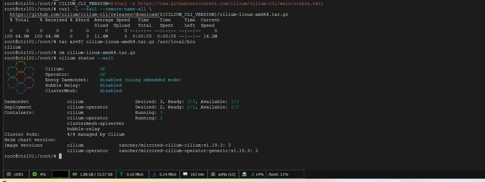

---

## 6. MetalLB — LoadBalancer cho bare metal

RKE2 trên VM không có cloud LoadBalancer. Mình dùng MetalLB để cấp IP từ pool `10.10.200.61–80` cho Service type LoadBalancer:

```bash
helm repo add metallb https://metallb.github.io/metallb
helm repo update

kubectl create namespace metallb-system
kubectl label namespace metallb-system pod-security.kubernetes.io/enforce=privileged

helm install metallb metallb/metallb \
  --namespace metallb-system \
  --version 0.16.0 \
  --wait

kubectl -n metallb-system get pods -o wide
```

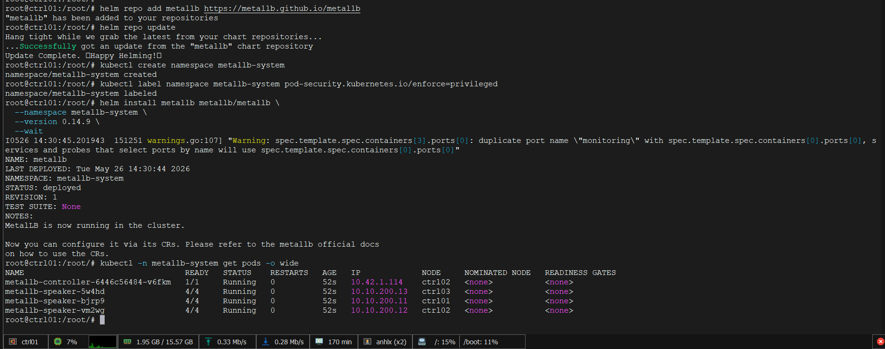

```bash
cat <<'EOF' | kubectl apply -f -
---
apiVersion: metallb.io/v1beta1
kind: IPAddressPool
metadata:
  name: default-pool
  namespace: metallb-system
spec:
  addresses:
  - 10.10.200.61-10.10.200.80
---
apiVersion: metallb.io/v1beta1
kind: L2Advertisement
metadata:
  name: default-l2
  namespace: metallb-system
spec:
  ipAddressPools:
  - default-pool
  interfaces:
  - ens160
EOF

# Verify MetalLB hoạt động
kubectl -n metallb-system get pods -o wide
kubectl get ipaddresspool -n metallb-system
```

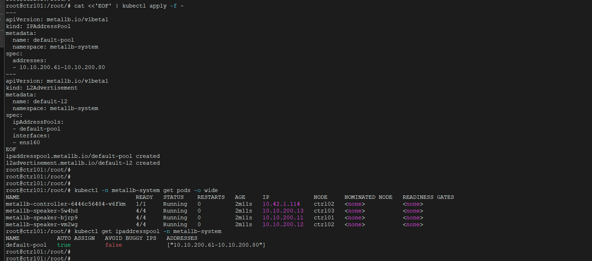

---

## 7. Cert-manager + Cilium Gateway API

Ingress-NGINX đã chuyển sang maintenance-only mode. Mình dùng **Cilium Gateway API** thay thế — đây là lý do chính mình disable `rke2-ingress-nginx` từ bước 4.1. Cilium đã có sẵn trong cluster, chỉ cần enable Gateway API là xong, không deploy thêm component riêng. Trong lab này mình demo bằng hai endpoint thật: **Headlamp** và **KubeVirt Manager** đều được expose qua HTTPRoute thay vì LoadBalancer Service trực tiếp.

### 7.1 Cert-manager

Mình cài cert-manager để cấp self-signed TLS cho dashboard nội bộ:

```bash
helm repo add jetstack https://charts.jetstack.io
helm repo update

helm install cert-manager jetstack/cert-manager \
  --namespace cert-manager --create-namespace \
  --version v1.19.4 \
  --set crds.enabled=true \
  --set replicaCount=2 \
  --set webhook.replicaCount=2 \
  --wait

cat <<'EOF' | kubectl apply -f -
apiVersion: cert-manager.io/v1
kind: ClusterIssuer
metadata:
  name: selfsigned-issuer
spec:
  selfSigned: {}
EOF
```

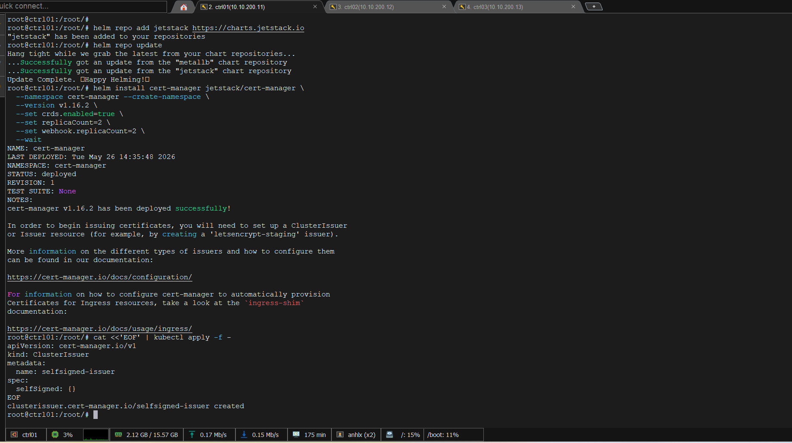

### 7.2 Cilium Gateway API

Gateway API CRDs và Cilium GatewayClass đã được enable từ bước 4.1. Mình chỉ cần cài CRDs rồi tạo Gateway object:

```bash
# Bước 1: Cài Gateway API CRDs
kubectl apply -f https://github.com/kubernetes-sigs/gateway-api/releases/download/v1.3.0/standard-install.yaml

# Restart Cilium operator để detect GatewayClass CRD mới
kubectl -n kube-system rollout restart deployment/cilium-operator
kubectl -n kube-system rollout status deployment/cilium-operator --timeout=60s

# Tạo GatewayClass — operator không tự tạo, phải apply thủ công
cat <<'EOF' | kubectl apply -f -
apiVersion: gateway.networking.k8s.io/v1
kind: GatewayClass
metadata:
  name: cilium
spec:
  controllerName: io.cilium/gateway-controller
EOF

kubectl get gatewayclass -o wide 
# NAME     CONTROLLER                     ACCEPTED
# cilium   io.cilium/gateway-controller   True

# Bước 2: Tạo Gateway — MetalLB cấp IP 10.10.200.61
# Tenant expose service qua HTTPRoute → Gateway forward về đúng Pod
cat <<'EOF' | kubectl apply -f -
apiVersion: gateway.networking.k8s.io/v1
kind: Gateway
metadata:
  name: cilium-gw
  namespace: kube-system
  annotations:
    metallb.universe.tf/loadBalancerIPs: "10.10.200.61"
spec:
  gatewayClassName: cilium
  listeners:
  - name: http
    protocol: HTTP
    port: 80
    allowedRoutes:
      namespaces:
        from: All
  - name: https
    protocol: HTTPS
    port: 443
    tls:
      mode: Terminate
      certificateRefs:
      - name: wildcard-tls
        namespace: kube-system
    allowedRoutes:
      namespaces:
        from: All
EOF

kubectl -n kube-system get gateway cilium-gw

kubectl -n kube-system get svc | grep cilium-gateway

```
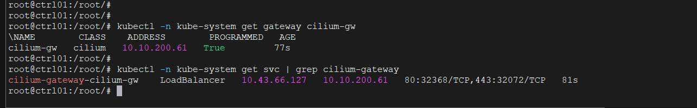

---

## 8. Rook-Ceph Distributed Storage

Rook là Kubernetes operator triển khai Ceph như Pod trong cluster. Thay vì cephadm bare-metal, Ceph chạy trên K8s và OSD tự discover disk `/dev/sdb`.

Ceph MON yêu cầu clock skew giữa các node < 0.05s. Mình chạy bước này trên **tất cả 3 node** trước khi deploy Rook:

```bash
apt install -y chrony
systemctl enable --now chrony
chronyc makestep          # ép sync ngay, không chờ gradual slew

chronyc tracking
# Reference ID    : ...
# System time     : 0.000... seconds fast/slow  ← phải < 0.01s
```


### 8.1 Cài Rook Operator

```bash
helm repo add rook-release https://charts.rook.io/release
helm repo update

helm install rook-ceph rook-release/rook-ceph \
  --namespace rook-ceph --create-namespace \
  --version v1.19.5 \
  --wait

kubectl -n rook-ceph get pods
```
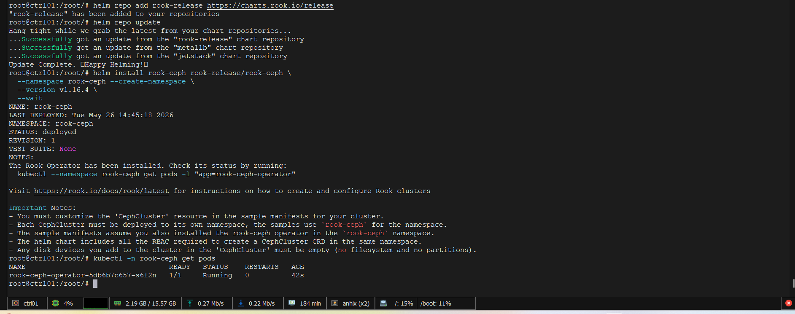

### 8.2 Tạo CephCluster

Mình cấu hình Ceph dùng `ens160` cho public network và `ens192` cho cluster network — tách traffic replication khỏi management:

```bash
cat <<'EOF' | kubectl apply -f -
apiVersion: ceph.rook.io/v1
kind: CephCluster
metadata:
  name: rook-ceph
  namespace: rook-ceph
spec:
  cephVersion:
    image: quay.io/ceph/ceph:v19.2.0
    allowUnsupported: false
  dataDirHostPath: /var/lib/rook
  mon:
    count: 3
    allowMultiplePerNode: false
  mgr:
    count: 2
    modules:
    - name: pg_autoscaler
      enabled: true
    - name: dashboard
      enabled: true
  dashboard:
    enabled: true
    ssl: false
  monitoring:
    enabled: false   # bật lại sau khi cài kube-prometheus-stack (section 12)
  network:
    provider: host
    addressRanges:
      public:
      - "10.10.200.0/24"
      cluster:
      - "10.10.201.0/24"
  storage:
    useAllNodes: true
    useAllDevices: false
    devices:
    - name: "sdb"
    config:
      osdsPerDevice: "1"
  disruptionManagement:
    managePodBudgets: true
    osdMaintenanceTimeout: 30
EOF

# Đợi cluster lên 
watch kubectl -n rook-ceph get pods
# Expect: 3 mon, 2 mgr, 3 osd — all Running
```

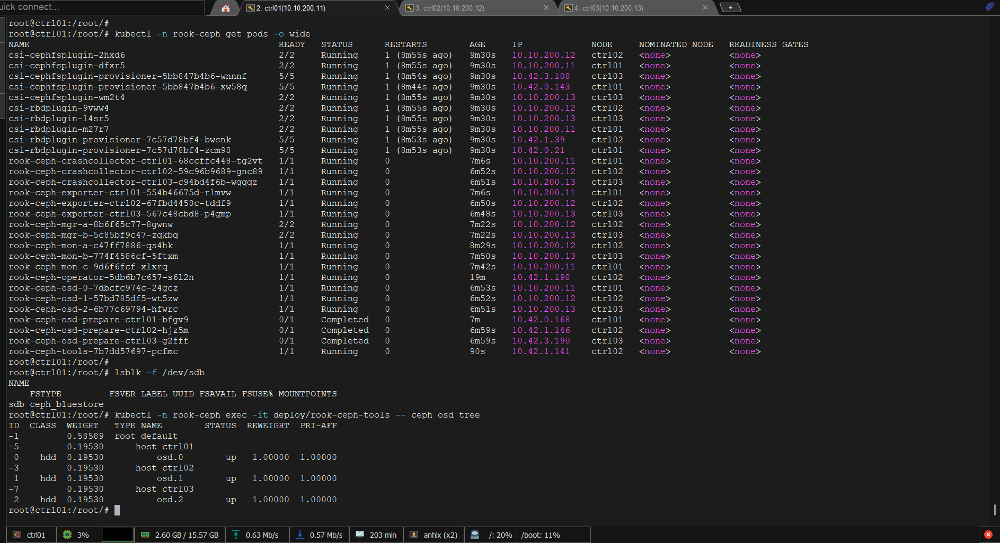

### 8.3 Tạo Pools + StorageClass

Mình tạo 2 loại storage: Block (RBD) cho PVC và VM disk, Filesystem (CephFS) cho shared storage:

```bash
cat <<'EOF' | kubectl apply -f -
---
apiVersion: ceph.rook.io/v1
kind: CephBlockPool
metadata:
  name: replicapool
  namespace: rook-ceph
spec:
  failureDomain: host
  replicated:
    size: 2
    requireSafeReplicaSize: false
---
apiVersion: storage.k8s.io/v1
kind: StorageClass
metadata:
  name: rook-ceph-block
  annotations:
    storageclass.kubernetes.io/is-default-class: "true"
provisioner: rook-ceph.rbd.csi.ceph.com
parameters:
  clusterID: rook-ceph
  pool: replicapool
  imageFormat: "2"
  imageFeatures: layering
  csi.storage.k8s.io/provisioner-secret-name: rook-csi-rbd-provisioner
  csi.storage.k8s.io/provisioner-secret-namespace: rook-ceph
  csi.storage.k8s.io/controller-expand-secret-name: rook-csi-rbd-provisioner
  csi.storage.k8s.io/controller-expand-secret-namespace: rook-ceph
  csi.storage.k8s.io/node-stage-secret-name: rook-csi-rbd-node
  csi.storage.k8s.io/node-stage-secret-namespace: rook-ceph
  csi.storage.k8s.io/fstype: ext4
allowVolumeExpansion: true
reclaimPolicy: Delete
---
apiVersion: ceph.rook.io/v1
kind: CephFilesystem
metadata:
  name: cephfs
  namespace: rook-ceph
spec:
  metadataPool:
    replicated:
      size: 2
  dataPools:
  - name: replicated
    replicated:
      size: 2
  preserveFilesystemOnDelete: false
  metadataServer:
    activeCount: 1
    activeStandby: true
---
apiVersion: storage.k8s.io/v1
kind: StorageClass
metadata:
  name: rook-cephfs
provisioner: rook-ceph.cephfs.csi.ceph.com
parameters:
  clusterID: rook-ceph
  fsName: cephfs
  pool: cephfs-replicated
  csi.storage.k8s.io/provisioner-secret-name: rook-csi-cephfs-provisioner
  csi.storage.k8s.io/provisioner-secret-namespace: rook-ceph
  csi.storage.k8s.io/controller-expand-secret-name: rook-csi-cephfs-provisioner
  csi.storage.k8s.io/controller-expand-secret-namespace: rook-ceph
  csi.storage.k8s.io/node-stage-secret-name: rook-csi-cephfs-node
  csi.storage.k8s.io/node-stage-secret-namespace: rook-ceph
allowVolumeExpansion: true
reclaimPolicy: Delete
EOF

kubectl get sc
# NAME                       PROVISIONER
# rook-ceph-block (default)  rook-ceph.rbd.csi.ceph.com
# rook-cephfs                rook-ceph.cephfs.csi.ceph.com

# Verify Ceph health
kubectl apply -f https://raw.githubusercontent.com/rook/rook/release-1.16/deploy/examples/toolbox.yaml
sleep 30
kubectl -n rook-ceph exec -ti deploy/rook-ceph-tools -- ceph -s
# cluster: HEALTH_OK | mon 3 | mgr 2 | osd 3 up, 3 in
```

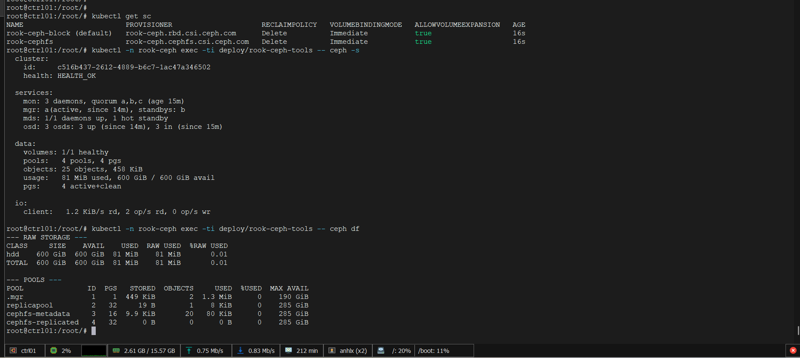

### 8.4 Ceph Dashboard

Rook operator quản lý service `rook-ceph-mgr-dashboard` nên patch trực tiếp sẽ bị revert. Mình tạo một LoadBalancer service riêng:

```bash
cat <<'EOF' | kubectl apply -f -
apiVersion: v1
kind: Service
metadata:
  name: rook-ceph-dashboard-lb
  namespace: rook-ceph
spec:
  type: LoadBalancer
  loadBalancerIP: 10.10.200.62
  ports:
  - port: 7000
    targetPort: 7000
    protocol: TCP
  selector:
    app: rook-ceph-mgr
    rook_cluster: rook-ceph
EOF

# Lấy password
kubectl -n rook-ceph get secret rook-ceph-dashboard-password \
  -o jsonpath='{.data.password}' | base64 -d && echo

# Kiểm tra service IP
kubectl -n rook-ceph get svc rook-ceph-dashboard-lb

```

Truy cập `http://10.10.200.62:7000`, login `admin`. Lưu ý: Ceph tự redirect sang IP của active MGR node — đây là behavior bình thường, dashboard vẫn hoạt động đầy đủ.

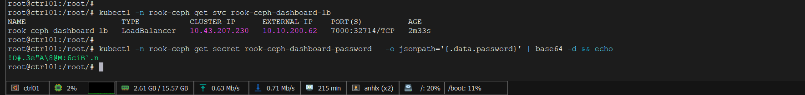

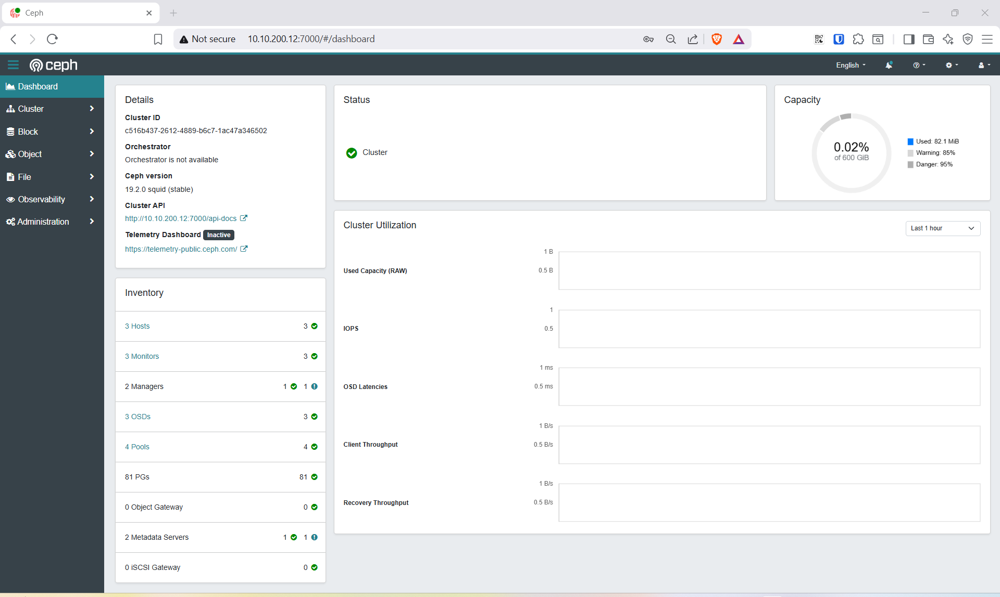

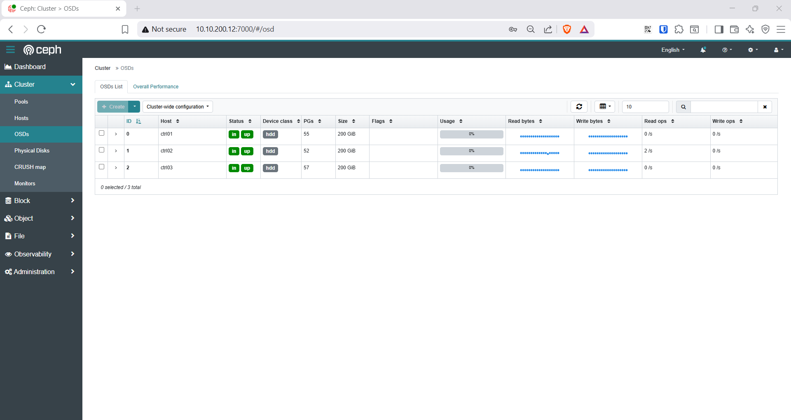

---

## 9. KubeVirt — chạy VM trên Kubernetes

KubeVirt biến KVM/QEMU VM thành Kubernetes workload. Mỗi VM là một `VirtualMachine` CR, runtime là `virt-launcher` Pod chứa QEMU process. Tenant tạo VM bằng `kubectl` hoặc `virtctl`.

### 9.1 Cài KubeVirt Operator + CR

```bash
KUBEVIRT_VERSION=v1.8.0
kubectl apply -f https://github.com/kubevirt/kubevirt/releases/download/${KUBEVIRT_VERSION}/kubevirt-operator.yaml

kubectl -n kubevirt wait deployment/virt-operator --for=condition=Available --timeout=300s

cat <<'EOF' | kubectl apply -f -
apiVersion: kubevirt.io/v1
kind: KubeVirt
metadata:
  name: kubevirt
  namespace: kubevirt
spec:
  configuration:
    developerConfiguration:
      featureGates:
        - GPU
        - HostDevices
        - VMLiveUpdateFeatures
        - LiveMigration
        - ExpandDisks
  imagePullPolicy: IfNotPresent
  workloadUpdateStrategy:
    workloadUpdateMethods:
      - LiveMigrate
EOF

# Đợi tất cả thành phần KubeVirt running 
kubectl -n kubevirt wait kv kubevirt --for=condition=Available --timeout=600s
kubectl -n kubevirt get pods
```

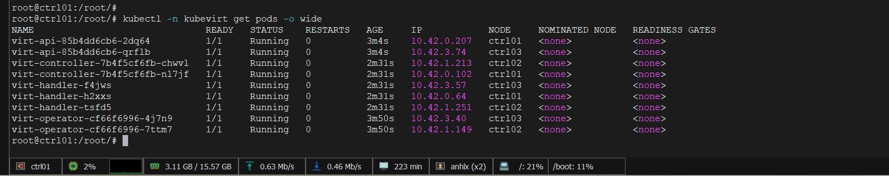

### 9.2 Cài CDI — Containerized Data Importer

**CDI** giải quyết bài toán: VM cần boot từ một disk image (Ubuntu cloud image dạng `.qcow2`), nhưng Kubernetes chỉ biết PVC — không biết cách fetch URL về và ghi vào block device. CDI là operator làm đúng việc này: tạo `DataVolume` CR với URL nguồn, CDI tự download, convert format, ghi vào PVC Ceph, rồi VM mount PVC đó làm disk boot. Không có CDI thì phải tự tạo PVC và ghi image thủ công bằng `dd` hoặc `qemu-img`.

CDI import cloud image (qcow2, raw) thành PVC để VM boot:

```bash
CDI_VERSION=v1.65.0
kubectl apply -f https://github.com/kubevirt/containerized-data-importer/releases/download/${CDI_VERSION}/cdi-operator.yaml

kubectl -n cdi wait deployment/cdi-operator --for=condition=Available --timeout=300s

cat <<'EOF' | kubectl apply -f -
apiVersion: cdi.kubevirt.io/v1beta1
kind: CDI
metadata:
  name: cdi
spec:
  config:
    featureGates:
      - HonorWaitForFirstConsumer
EOF

kubectl -n cdi wait cdi cdi --for=condition=Available --timeout=300s
```

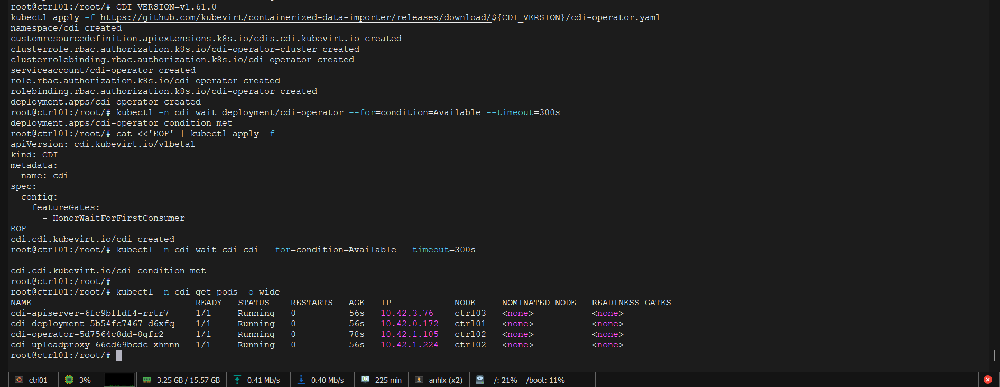

### 9.3 Cài virtctl

**virtctl** là CLI extension của kubectl dành riêng cho KubeVirt — làm những việc `kubectl` không có: `virtctl console` (serial console vào VM như `virsh console`), `virtctl vnc` (VNC session), `virtctl start/stop/migrate` (thao tác VM). Nó giao tiếp với `virt-api` qua WebSocket — không cần SSH vào hypervisor node.

```bash
VERSION=$(kubectl -n kubevirt get kubevirt kubevirt -o=jsonpath="{.status.observedKubeVirtVersion}")
curl -L -o /usr/local/bin/virtctl \
  https://github.com/kubevirt/kubevirt/releases/download/${VERSION}/virtctl-${VERSION}-linux-amd64
chmod +x /usr/local/bin/virtctl
virtctl version
```

### 9.4 Smoke test VM

Mình tạo 1 VM nhỏ bằng cirros image để verify KubeVirt hoạt động:

```bash
cat <<'EOF' | kubectl apply -f -
apiVersion: kubevirt.io/v1
kind: VirtualMachine
metadata:
  name: testvm
  namespace: default
spec:
  running: true
  template:
    metadata:
      labels:
        kubevirt.io/vm: testvm
    spec:
      domain:
        devices:
          disks:
          - name: containerdisk
            disk:
              bus: virtio
          - name: cloudinitdisk
            disk:
              bus: virtio
          interfaces:
          - name: default
            masquerade: {}
        resources:
          requests:
            memory: 512Mi
            cpu: "1"
      networks:
      - name: default
        pod: {}
      volumes:
      - name: containerdisk
        containerDisk:
          image: quay.io/kubevirt/cirros-container-disk-demo:latest
      - name: cloudinitdisk
        cloudInitNoCloud:
          userData: |
            #!/bin/sh
            echo 'KubeVirt smoke test OK'
EOF

kubectl get vmi
# NAME     AGE   PHASE     IP          NODENAME
# testvm   60s   Running   10.42.x.x   ctrl02

virtctl console testvm
# Login: cirros / gocubsgo — Ctrl+] để thoát

kubectl delete vm testvm
```

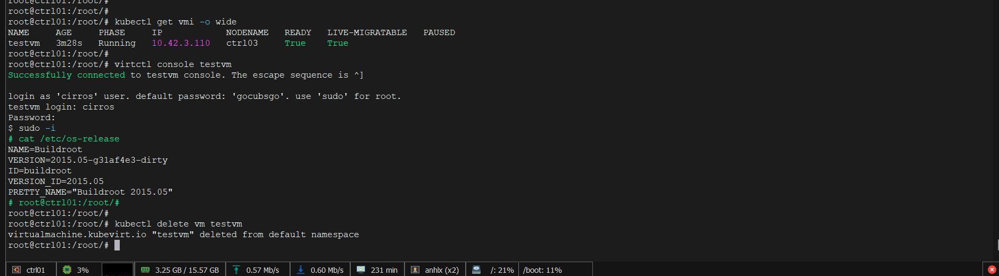

---

## 10. GPU Operator + Time-Slicing

Mình dùng **fake-gpu-operator** (do Run:ai phát triển, hiện là NVIDIA project) để giả lập GPU trong lab. Toàn bộ interface giống hệt NVIDIA GPU Operator thật — khi có GPU vật lý, chỉ cần swap operator là cluster hoạt động production ngay.

**GPU topology cho lab:**
- `ctrl01`, `ctrl02` — pool **default**: mỗi node 2 GPU nguyên (whole GPU)
- `ctrl03` — pool **shared**: 2 GPU × 4 time-slice = 8 GPU slot (fractional GPU)

### 10.1 Cài KWOK

- **KWOK** (Kubernetes Without Kubelet) là project của SIG Scalability cho phép giả lập node/pod mà không cần chạy workload thật. 
- Fake-gpu-operator dùng KWOK để tạo các "fake GPU device" — khi Pod request `nvidia.com/gpu: 1`, kubelet nhìn thấy resource này như thật (do device plugin report), scheduler place pod lên node, nhưng không có GPU vật lý nào thực sự được allocate. 
- Kết quả: toàn bộ orchestration layer (scheduling, quota, isolation) hoạt động đúng để demo và test, không cần server có GPU thật.

KWOK (Kubernetes Without Kubelet) là backend cho GPU simulation:

```bash
KWOK_VERSION=v0.7.0
kubectl apply -f "https://github.com/kubernetes-sigs/kwok/releases/download/${KWOK_VERSION}/kwok.yaml"
kubectl apply -f "https://github.com/kubernetes-sigs/kwok/releases/download/${KWOK_VERSION}/stage-fast.yaml"

kubectl -n kube-system get pods -l app=kwok-controller
# kwok-controller-xxx  1/1  Running
```

### 10.2 Label nodes với GPU pool

```bash
kubectl label node ctrl01 run.ai/simulated-gpu-node-pool=default --overwrite
kubectl label node ctrl02 run.ai/simulated-gpu-node-pool=default --overwrite
kubectl label node ctrl03 run.ai/simulated-gpu-node-pool=default --overwrite

# Label metadata GPU (hiển thị giống NVIDIA A100 thật)
for n in ctrl01 ctrl02 ctrl03; do
  kubectl label node $n \
    nvidia.com/gpu.family=ampere \
    nvidia.com/gpu.machine=NVIDIA-A100-SXM4-40GB \
    nvidia.com/gpu.product=NVIDIA-A100-SXM4-40GB \
    nvidia.com/gpu.memory=40960 \
    nvidia.com/cuda.driver.major=550 \
    --overwrite
done
```

### 10.3 Cài GPU Operator

RKE2 tự tạo sẵn RuntimeClass `nvidia` (qua chart `rke2-runtimeclasses`). Fake-gpu-operator cũng cố tạo RuntimeClass `nvidia` nhưng với `handler: runc` — xung đột do `handler` là immutable field. Mình delete RuntimeClass cũ trước rồi để chart tạo lại:

```bash
kubectl create namespace gpu-operator
kubectl label namespace gpu-operator pod-security.kubernetes.io/enforce=privileged

# Xóa RuntimeClass do RKE2 tạo để tránh conflict
kubectl delete runtimeclass nvidia

# 2 GPU A100 mỗi node — default pool
helm upgrade -i gpu-operator \
  oci://ghcr.io/run-ai/fake-gpu-operator/fake-gpu-operator \
  --namespace gpu-operator \
  --version 0.0.62 \
  --set initContainer.image.repository=ghcr.io/run-ai/fake-gpu-operator/init-container \
  --set topology.nodePools.default.gpuProduct=NVIDIA-A100-SXM4-40GB \
  --set topology.nodePools.default.gpuCount=2 \
  --set topology.nodePools.default.gpuMemory=40960 \
  --wait

kubectl -n gpu-operator get pods
# device-plugin-xxx (3), dcgm-exporter-xxx (3), status-updater-xxx (1), topology-server-xxx (1)

# Verify GPU xuất hiện
kubectl get nodes -o custom-columns=NAME:.metadata.name,GPU:.status.allocatable.nvidia\\.com/gpu
# NAME    GPU
# ctrl01   2
# ctrl02   2
# ctrl03   2
```

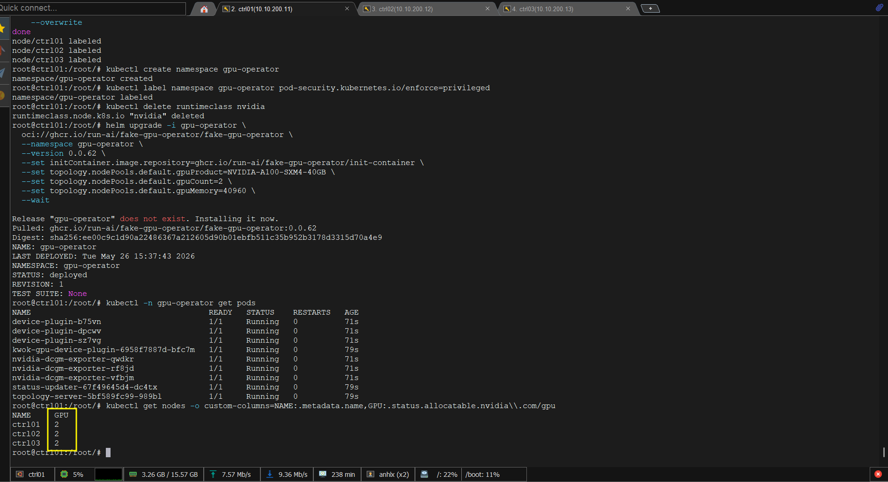

### 10.4 Cấu hình Time-Slicing cho pool shared

Mình re-label `ctrl03` sang pool `shared`. Fake-gpu-operator version này không tự nhân `replicasPerGpu` vào `nvidia.com/gpu` trên real node — cần set thẳng `gpuCount=8` (2 physical × 4 slices) và để `replicasPerGpu` làm metadata. Sau khi upgrade Helm, cần xóa topology ConfigMap cũ của ctrl03 rồi restart status-updater để nó recreate với đúng 8 GPU entries, sau đó restart device-plugin để kubelet cập nhật allocatable:

```bash
# Thêm shared pool và label ctrl03
helm upgrade gpu-operator \
  oci://ghcr.io/run-ai/fake-gpu-operator/fake-gpu-operator \
  --namespace gpu-operator \
  --version 0.0.62 \
  --reuse-values \
  --set topology.nodePools.shared.gpuProduct=NVIDIA-A100-SXM4-40GB-SHARED \
  --set topology.nodePools.shared.gpuCount=8 \
  --set topology.nodePools.shared.gpuMemory=40960 \
  --set topology.nodePools.shared.replicasPerGpu=4 \
  --wait

kubectl label node ctrl03 run.ai/simulated-gpu-node-pool=shared --overwrite

# Force recreate topology ConfigMap với gpuCount=8
kubectl -n gpu-operator delete configmap topology-ctrl03
kubectl -n gpu-operator rollout restart deployment/status-updater
sleep 15

# Restart device-plugin trên ctrl03 để đọc ConfigMap mới
kubectl -n gpu-operator delete pod -l app=device-plugin --field-selector spec.nodeName=ctrl03
sleep 15

kubectl get nodes -o custom-columns=NAME:.metadata.name,POOL:.metadata.labels.run\\.ai/simulated-gpu-node-pool,GPU:.status.allocatable.nvidia\\.com/gpu
# NAME    POOL      GPU
# ctrl01   default   2    ← whole GPU
# ctrl02   default   2    ← whole GPU
# ctrl03   shared    8    ← 2 × 4 time-sliced
```
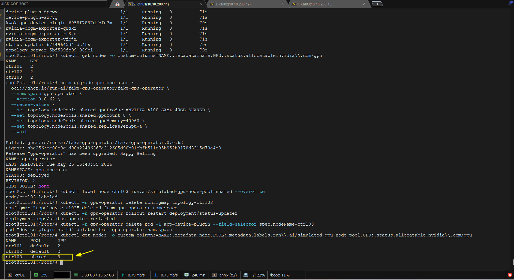

### 10.5 Smoke test — Pod với GPU

```bash
cat <<'EOF' | kubectl apply -f -
apiVersion: v1
kind: Pod
metadata:
  name: gpu-smoke
spec:
  restartPolicy: Never
  containers:
  - name: test
    image: ubuntu:24.04
    command: ["sleep", "infinity"]
    resources:
      limits:
        nvidia.com/gpu: "1"
EOF

kubectl wait --for=condition=Ready pod/gpu-smoke --timeout=60s
kubectl get pod gpu-smoke -o wide

# Verify GPU được allocate trên node
kubectl describe node $(kubectl get pod gpu-smoke -o jsonpath='{.spec.nodeName}') \
  | grep -A3 "nvidia.com/gpu"

kubectl delete pod gpu-smoke
```

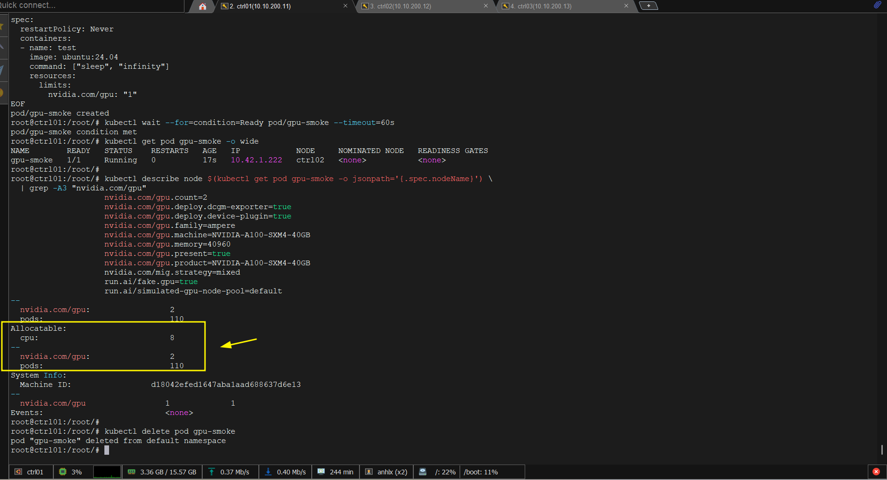

---

## 11. Kueue — GPU Job Queueing

Khi nhiều tenant cùng submit batch job GPU (training, inference), Kubernetes mặc định sẽ để job ở trạng thái `Pending` nếu không đủ GPU — không có priority, không có quota enforcement ở job level, không có fair-share. **Kueue** giải quyết bài toán này: nó là job queuing layer native Kubernetes, quản lý admission của workload dựa trên quota và priority mà không cần thay đổi kube-scheduler.

Mình cài Kueue và cấu hình quota riêng cho từng GPU pool — `default` (GPU nguyên trên ctrl01+ctrl02) và `shared` (GPU chia nhỏ trên ctrl03).

### 11.1 Cài Kueue

```bash
kubectl apply --server-side \
  -f https://github.com/kubernetes-sigs/kueue/releases/download/v0.17.0/manifests.yaml
```

Chờ controller ready:

```bash
kubectl -n kueue-system rollout status deployment/kueue-controller-manager
```

### 11.2 ResourceFlavor — định nghĩa GPU pool

`ResourceFlavor` map từng GPU pool sang node label. Kueue sẽ dùng label này khi schedule workload vào đúng pool:

```bash
cat <<'EOF' | kubectl apply -f -
apiVersion: kueue.x-k8s.io/v1beta1
kind: ResourceFlavor
metadata:
  name: gpu-whole
spec:
  nodeLabels:
    run.ai/simulated-gpu-node-pool: default
---
apiVersion: kueue.x-k8s.io/v1beta1
kind: ResourceFlavor
metadata:
  name: gpu-shared
spec:
  nodeLabels:
    run.ai/simulated-gpu-node-pool: shared
EOF
```

### 11.3 ClusterQueue — quota toàn cluster

`ClusterQueue` định nghĩa tổng GPU quota mà cluster cấp phát, chia theo từng flavor:

```bash
cat <<'EOF' | kubectl apply -f -
apiVersion: kueue.x-k8s.io/v1beta1
kind: ClusterQueue
metadata:
  name: cluster-gpu-queue
spec:
  namespaceSelector: {}        # accept từ mọi namespace có LocalQueue trỏ vào đây
  queueingStrategy: BestEffortFIFO
  resourceGroups:
    - coveredResources: ["nvidia.com/gpu"]
      flavors:
        - name: gpu-whole
          resources:
            - name: nvidia.com/gpu
              nominalQuota: "4"    # ctrl01×2 + ctrl02×2 = 4 GPU nguyên
        - name: gpu-shared
          resources:
            - name: nvidia.com/gpu
              nominalQuota: "8"    # ctrl03: 8 time-slice slot
EOF
```

### 11.4 LocalQueue — queue per tenant namespace

Mỗi namespace tenant cần một `LocalQueue` trỏ về `ClusterQueue`. Tenant chỉ submit job vào LocalQueue của namespace mình — Kueue enforce quota qua ClusterQueue bên trên.

> LocalQueue phải nằm trong namespace của tenant — namespace chỉ tồn tại sau khi tenant được onboard ở section 16. LocalQueue sẽ được tạo trong section 16.2 và 16.3 ngay sau khi namespace được provision.

---

## 12. Monitoring

**kube-prometheus-stack** là Helm chart gom sẵn 3 thành phần: **Prometheus** (scrape và lưu metrics từ toàn cluster), **Grafana** (dashboard visualize), **Alertmanager** (gửi alert). Chart này deploy kèm CRD `ServiceMonitor` — thay vì config Prometheus scrape thủ công, mỗi component (Rook-Ceph, GPU Operator, KubeVirt) chỉ cần tạo `ServiceMonitor` CR và Prometheus tự phát hiện endpoint. Data persist vào Rook-Ceph PVC để không mất khi pod restart.

Mình cài kube-prometheus-stack và persist data vào Rook-Ceph. GPU Operator đã deploy `dcgm-exporter` — Prometheus tự scrape GPU metrics qua ServiceMonitor:

```bash
helm repo add prometheus-community https://prometheus-community.github.io/helm-charts
helm repo update

cat > /tmp/monitoring-values.yaml <<'EOF'
grafana:
  enabled: true
  service:
    type: LoadBalancer
    loadBalancerIP: 10.10.200.63
  adminPassword: admin
  persistence:
    enabled: true
    storageClassName: rook-ceph-block
    size: 5Gi
  defaultDashboardsTimezone: Asia/Ho_Chi_Minh

prometheus:
  prometheusSpec:
    retention: 7d
    storageSpec:
      volumeClaimTemplate:
        spec:
          storageClassName: rook-ceph-block
          accessModes: ["ReadWriteOnce"]
          resources:
            requests:
              storage: 20Gi
    serviceMonitorSelectorNilUsesHelmValues: false
    podMonitorSelectorNilUsesHelmValues: false
  service:
    type: LoadBalancer
    loadBalancerIP: 10.10.200.64

alertmanager:
  alertmanagerSpec:
    storage:
      volumeClaimTemplate:
        spec:
          storageClassName: rook-ceph-block
          accessModes: ["ReadWriteOnce"]
          resources:
            requests:
              storage: 5Gi
EOF

helm install monitoring prometheus-community/kube-prometheus-stack \
  --namespace monitoring --create-namespace \
  --version 82.15.0 \
  -f /tmp/monitoring-values.yaml \
  --wait

kubectl -n monitoring get pods,svc

# Verify GPU metrics từ dcgm-exporter
kubectl port-forward -n gpu-operator svc/nvidia-dcgm-exporter 9400:9400 &
curl -s http://localhost:9400/metrics | grep DCGM_FI_DEV_GPU_UTIL
# DCGM_FI_DEV_GPU_UTIL{gpu="0",...} 25
```

> **Grafana**: http://10.10.200.63 (`admin` / `admin`). Import dashboard NVIDIA DCGM ID `12239` từ grafana.com để xem GPU metrics.

---

## 13. KubeVirt Manager — Admin Portal

KubeVirt Manager là web UI lightweight (~150MB RAM) chuyên quản lý KubeVirt — admin dùng để tạo VM, xem VNC console trực tiếp trong browser, trigger live migration, tạo snapshot và quản lý instance types. Đây là **admin tool**, không expose cho tenant.

### 13.1 Cài KubeVirt Manager

```bash
kubectl create namespace kubevirt-manager

kubectl apply -f https://raw.githubusercontent.com/kubevirt-manager/kubevirt-manager/main/kubernetes/bundled.yaml

kubectl -n kubevirt-manager get pods
# kubevirt-manager-xxx   1/1   Running

cat <<'EOF' | kubectl apply -f -
apiVersion: gateway.networking.k8s.io/v1
kind: HTTPRoute
metadata:
  name: kubevirt-manager
  namespace: kubevirt-manager
spec:
  parentRefs:
  - name: cilium-gw
    namespace: kube-system
  hostnames:
  - "kubevirt.lab"
  rules:
  - backendRefs:
    - name: kubevirt-manager
      port: 8080
EOF

kubectl -n kubevirt-manager get httproute
# NAME               HOSTNAMES            PARENTS
# kubevirt-manager   ["kubevirt.lab"]     [{"group":"gateway.networking.k8s.io",...}]
```

Truy cập `http://kubevirt.lab` — không cần login, KubeVirt Manager chạy với ServiceAccount được gán ClusterRole trong bundled.yaml. Traffic đi qua Cilium Gateway (`10.10.200.61`) rồi route vào pod theo hostname.

### 13.2 Instance Types — Định nghĩa GPU flavor

Mình tạo 2 instance type để chuẩn hóa spec VM theo tier GPU — admin chọn flavor khi provisioning VM cho tenant, tenant không cần biết CPU/RAM cụ thể:

```bash
cat <<'EOF' | kubectl apply -f -
---
apiVersion: instancetype.kubevirt.io/v1beta1
kind: VirtualMachineClusterInstancetype
metadata:
  name: gpu-whole-a100
spec:
  cpu:
    guest: 4
  memory:
    guest: 8Gi
---
apiVersion: instancetype.kubevirt.io/v1beta1
kind: VirtualMachineClusterInstancetype
metadata:
  name: gpu-shared-quarter-a100
spec:
  cpu:
    guest: 2
  memory:
    guest: 4Gi
EOF

kubectl get virtualmachineclusterinstancetypes
# NAME                        AGE
# gpu-whole-a100              5s
# gpu-shared-quarter-a100     5s
```

### 13.3 Admin features overview

| Feature | Path trong UI |
|---|---|
| Xem tất cả VM trên cluster | Virtual Machines → All Namespaces |
| VNC console trực tiếp trong browser | VM → Actions → Console |
| Trigger live migration | VM → Actions → Migrate |
| Xem GPU capacity per node | Nodes → Resource Usage |
| Quản lý boot disk (DataVolume) | Data Volumes → New DataVolume |
| Quản lý flavor | Instance Types |


---

## 14. Capsule — Multi-tenancy

- **Capsule** là multi-tenant operator CNCF-recognized. Vấn đề Kubernetes gốc gây ra: namespace là đơn vị isolation nhưng không có khái niệm "owner" — bất kỳ user nào có quyền `create namespace` đều làm được, không có quota xuyên nhiều namespace, không có NetworkPolicy tự động. 
- Capsule thêm tầng `Tenant` CR lên trên: mỗi customer là 1 Tenant, mọi namespace trong tenant inherit sẵn NetworkPolicy, ResourceQuota, nodeSelector, và StorageClass allowed — admin tạo 1 Tenant CR là xong, không cần config từng namespace thủ công. 
- Mỗi `Tenant` CR đại diện cho 1 customer — Capsule tự động enforce RBAC, NetworkPolicy, ResourceQuota với hard isolation giữa các tenant.

### 14.1 Cài Capsule

```bash
helm repo add projectcapsule https://projectcapsule.github.io/charts
helm repo update

helm install capsule projectcapsule/capsule \
  --namespace capsule-system --create-namespace \
  --version 0.12.4 \
  --set "manager.options.forceTenantPrefix=true" \
  --wait

kubectl -n capsule-system get pods
# capsule-controller-manager-xxx  1/1 Running
```

### 14.2 Helper script — sinh kubeconfig tenant

Mình viết helper function để sinh kubeconfig ServiceAccount cho từng customer. Kubeconfig này là "chìa khóa" tenant dùng để tương tác với cluster — chỉ có quyền trong namespace của Tenant mình. Production sẽ dùng OIDC (Keycloak/AD) để tenant tự login bằng username/password — lab này dùng SA token cho đơn giản:

```bash
mkdir -p /etc/kubernetes/tenants

cat > /usr/local/bin/generate-tenant-kubeconfig <<'SCRIPT'
#!/bin/bash
TENANT_NAME=$1
NS="capsule-system"

kubectl -n $NS create sa $TENANT_NAME-owner 2>/dev/null || true

kubectl create clusterrolebinding $TENANT_NAME-owner-binding \
  --clusterrole=cluster-admin \
  --serviceaccount=$NS:$TENANT_NAME-owner \
  --dry-run=client -o yaml | kubectl apply -f -

TOKEN=$(kubectl -n $NS create token $TENANT_NAME-owner --duration=8760h)
SERVER=$(kubectl config view --raw -o jsonpath='{.clusters[0].cluster.server}')
CA=$(kubectl config view --raw -o jsonpath='{.clusters[0].cluster.certificate-authority-data}')

cat > /etc/kubernetes/tenants/$TENANT_NAME-kubeconfig <<EOF
apiVersion: v1
kind: Config
clusters:
- cluster:
    server: $SERVER
    certificate-authority-data: $CA
  name: rke2-ai
contexts:
- context:
    cluster: rke2-ai
    user: $TENANT_NAME-owner
    namespace: $TENANT_NAME-prod
  name: $TENANT_NAME
current-context: $TENANT_NAME
users:
- name: $TENANT_NAME-owner
  user:
    token: $TOKEN
EOF
echo "Kubeconfig: /etc/kubernetes/tenants/$TENANT_NAME-kubeconfig"
SCRIPT

chmod +x /usr/local/bin/generate-tenant-kubeconfig
```

> **Note**: Lab dùng `cluster-admin` SA để đơn giản. Production tenant chỉ có quyền namespace-scoped do Capsule cấp — không có ClusterRole.

---

## 15. Headlamp — User Portal

Mình dùng **Headlamp** làm customer portal — Kubernetes UI nhẹ, open-source, RBAC-aware. Khi tenant login bằng SA token của mình, Headlamp gọi API server với chính token đó, Capsule tự enforce: tenant chỉ thấy resource trong namespace của mình, không xem được namespace hay resource của tenant khác. Isolation ở API server level, không phải UI filter.

### 15.1 Cài Headlamp

```bash
helm repo add headlamp https://headlamp-k8s.github.io/headlamp/
helm repo update

helm install headlamp headlamp/headlamp \
  --namespace headlamp --create-namespace \
  --wait

cat <<'EOF' | kubectl apply -f -
apiVersion: gateway.networking.k8s.io/v1
kind: HTTPRoute
metadata:
  name: headlamp
  namespace: headlamp
spec:
  parentRefs:
  - name: cilium-gw
    namespace: kube-system
  hostnames:
  - "headlamp.lab"
  rules:
  - backendRefs:
    - name: headlamp
      port: 80
EOF

kubectl -n headlamp get httproute
# NAME       HOSTNAMES           PARENTS
# headlamp   ["headlamp.lab"]    [{"group":"gateway.networking.k8s.io",...}]
```

### 15.2 Tạo token cho tenant

SA `customer-a-owner` được tạo ở section 14.2. Mình gen token ngắn hạn để giao cho tenant:

```bash
# Admin tạo token 24h cho customer-a
kubectl -n capsule-system create token customer-a-owner --duration=24h
# eyJhbGci...  ← copy token này, giao cho customer-a
```

### 15.3 Login — xem namespace và VM

Truy cập `http://headlamp.lab`, paste token vào ô **Token** → **Authenticate**:

| Thao tác | Path trong Headlamp |
|---|---|
| Xem namespace | Namespaces → chỉ thấy `customer-a-prod` |
| Xem VM pod | Workloads → Pods → `virt-launcher-ai-vm-customer-a-xxx` |
| Xem PVC / Volume | Storage → Persistent Volume Claims |
| Xem Service (Floating IP) | Network → Services → `ai-vm-customer-a-ssh` |
| Terminal vào Pod | Click pod → Terminal tab |

> Customer-a không thấy `customer-b-prod` hay bất kỳ namespace tenant khác — isolation enforce ở API server level bởi Capsule, không phải UI filter.


### 15.4 Console VM

**Serial console — virtctl:**

```bash
virtctl console ai-vm-customer-a -n customer-a-prod
# ubuntu login: ubuntu
# Password: <your-password>
# Ctrl+] để thoát
```

**SSH qua Floating IP:**

```bash
ssh ubuntu@10.10.200.66
# ubuntu@ai-vm-customer-a:~$
```

> Production path: thêm **Keycloak OIDC** → Headlamp authenticate qua SSO, tenant login bằng username/password không cần quản lý SA token thủ công.

---

## 16. Demo: Bán GPU cho khách hàng

Phần này mô phỏng workflow thực tế: admin tạo Tenant và sinh kubeconfig, customer dùng kubeconfig đó để deploy workload. Quota được enforce bởi Capsule `ResourceQuota` (hard limit tổng resource của tenant), nodeSelector được Capsule inject tự động vào mọi Pod — customer-a chỉ land trên node pool `default` (whole GPU), customer-b chỉ land trên pool `shared` (fractional GPU), không cần customer phải biết hay chỉ định.

Mình mô phỏng 2 customer mua GPU cloud:

- **Customer-A** (enterprise — workload sensitive): mua **GPU nguyên**, 1 container + 1 VM mỗi cái 1 A100 riêng
- **Customer-B** (startup AI — tối ưu chi phí): mua **GPU chia nhỏ**, 1 container + 1 VM mỗi cái 1/4 A100

### 16.1 Admin — Tạo Tenant + Sinh kubeconfig

#### Tạo Tenant Customer-A (whole GPU)

```bash
cat <<'EOF' | kubectl apply -f -
apiVersion: capsule.clastix.io/v1beta2
kind: Tenant
metadata:
  name: customer-a
spec:
  owners:
  - name: system:serviceaccount:capsule-system:customer-a-owner
    kind: ServiceAccount
  namespaceOptions:
    quota: 3
  resourceQuotas:
    scope: Tenant
    items:
    - hard:
        requests.cpu: "8"
        requests.memory: 16Gi
        limits.cpu: "16"
        limits.memory: 32Gi
        requests.nvidia.com/gpu: "2"
        limits.nvidia.com/gpu: "2"
        persistentvolumeclaims: "10"
        requests.storage: 100Gi
  networkPolicies:
    items:
    - policyTypes:
      - Ingress
      - Egress
      podSelector: {}
      ingress:
      - from:
        - namespaceSelector:
            matchLabels:
              capsule.clastix.io/tenant: customer-a
        - namespaceSelector:
            matchLabels:
              kubernetes.io/metadata.name: kube-system
      egress:
      - to:
        - namespaceSelector:
            matchLabels:
              capsule.clastix.io/tenant: customer-a
        - namespaceSelector: {}
          podSelector:
            matchLabels:
              k8s-app: kube-dns
        - ipBlock:
            cidr: 0.0.0.0/0
            except:
            - 10.10.200.0/24
  storageClasses:
    allowed:
    - rook-ceph-block
    - rook-cephfs
  nodeSelector:
    run.ai/simulated-gpu-node-pool: default
EOF
```

#### Tạo Tenant Customer-B (fractional GPU)

```bash
cat <<'EOF' | kubectl apply -f -
apiVersion: capsule.clastix.io/v1beta2
kind: Tenant
metadata:
  name: customer-b
spec:
  owners:
  - name: system:serviceaccount:capsule-system:customer-b-owner
    kind: ServiceAccount
  namespaceOptions:
    quota: 3
  resourceQuotas:
    scope: Tenant
    items:
    - hard:
        requests.cpu: "4"
        requests.memory: 8Gi
        limits.cpu: "8"
        limits.memory: 16Gi
        requests.nvidia.com/gpu: "2"
        limits.nvidia.com/gpu: "2"
        persistentvolumeclaims: "10"
        requests.storage: 50Gi
  networkPolicies:
    items:
    - policyTypes:
      - Ingress
      - Egress
      podSelector: {}
      ingress:
      - from:
        - namespaceSelector:
            matchLabels:
              capsule.clastix.io/tenant: customer-b
        - namespaceSelector:
            matchLabels:
              kubernetes.io/metadata.name: kube-system
      egress:
      - to:
        - namespaceSelector: {}
          podSelector:
            matchLabels:
              k8s-app: kube-dns
        - ipBlock:
            cidr: 0.0.0.0/0
            except:
            - 10.10.200.0/24
  storageClasses:
    allowed:
    - rook-ceph-block
    - rook-cephfs
  nodeSelector:
    run.ai/simulated-gpu-node-pool: shared
EOF
```

#### Sinh kubeconfig cho tenant

```bash
generate-tenant-kubeconfig customer-a
generate-tenant-kubeconfig customer-b

kubectl get tenants
# NAME         STATE    NAMESPACE QUOTA
# customer-a   Active   3
# customer-b   Active   3
```

### 16.2 Customer-A — GPU nguyên

Switch sang kubeconfig customer-a:

```bash
export KUBECONFIG=/etc/kubernetes/tenants/customer-a-kubeconfig

cat <<'EOF' | kubectl apply -f -
apiVersion: v1
kind: Namespace
metadata:
  name: customer-a-prod
  labels:
    capsule.clastix.io/tenant: customer-a
EOF

kubectl config set-context --current --namespace=customer-a-prod

# Tạo LocalQueue cho namespace này — Kueue sẽ enforce GPU quota qua ClusterQueue
cat <<'EOF' | kubectl apply -f -
apiVersion: kueue.x-k8s.io/v1beta1
kind: LocalQueue
metadata:
  name: gpu-queue
  namespace: customer-a-prod
spec:
  clusterQueueName: cluster-gpu-queue
EOF
```

#### Container với 1 GPU nguyên

```bash
cat <<'EOF' | kubectl apply -f -
apiVersion: v1
kind: Pod
metadata:
  name: ai-inference-container
  labels:
    customer: customer-a
    workload: container
spec:
  restartPolicy: Always
  containers:
  - name: inference
    image: ubuntu:24.04
    command: ["bash", "-c", "while true; do nvidia-smi; sleep 30; done"]
    resources:
      requests:
        cpu: "2"
        memory: 4Gi
        nvidia.com/gpu: "1"
      limits:
        cpu: "4"
        memory: 8Gi
        nvidia.com/gpu: "1"
EOF

kubectl wait --for=condition=Ready pod/ai-inference-container --timeout=120s
kubectl get pod ai-inference-container -o wide
# Node: ctrl01 hoặc ctrl02 (default pool)

kubectl logs ai-inference-container --tail=20
# nvidia-smi output: A100 SXM4, driver 550
```

#### VM với 1 GPU nguyên

```bash
# Import Ubuntu cloud image vào CDI
cat <<'EOF' | kubectl apply -f -
apiVersion: cdi.kubevirt.io/v1beta1
kind: DataVolume
metadata:
  name: ubuntu-2204-img
spec:
  source:
    http:
      url: "https://cloud-images.ubuntu.com/jammy/current/jammy-server-cloudimg-amd64.img"
  storage:
    volumeMode: Filesystem
    accessModes:
    - ReadWriteOnce
    resources:
      requests:
        storage: 20Gi
    storageClassName: rook-ceph-block
EOF

kubectl wait --for=jsonpath='{.status.phase}'=Succeeded dv/ubuntu-2204-img --timeout=600s
# datavolume.cdi.kubevirt.io/ubuntu-2204-img condition met
```

Trước khi tạo VM, mình gen password hash để điền vào cloud-init. Thay `<your-password>` bằng password thực:

```bash
openssl passwd -6 '<your-password>'
# $6$xyz...  ← copy chuỗi này vào trường passwd bên dưới
```

```bash
cat <<'EOF' | kubectl apply -f -
apiVersion: kubevirt.io/v1
kind: VirtualMachine
metadata:
  name: ai-vm-customer-a
  labels:
    customer: customer-a
    workload: vm
spec:
  running: true
  template:
    metadata:
      labels:
        kubevirt.io/vm: ai-vm-customer-a
    spec:
      domain:
        cpu:
          cores: 2
        devices:
          disks:
          - name: rootdisk
            disk:
              bus: virtio
          - name: cloudinit
            disk:
              bus: virtio
          interfaces:
          - name: default
            masquerade: {}
        resources:
          requests:
            memory: 4Gi
            cpu: "1"
            nvidia.com/gpu: "1"
          limits:
            memory: 4Gi
            cpu: "2"
            nvidia.com/gpu: "1"
      networks:
      - name: default
        pod: {}
      volumes:
      - name: rootdisk
        dataVolume:
          name: ubuntu-2204-img
      - name: cloudinit
        cloudInitNoCloud:
          userData: |
            #cloud-config
            hostname: ai-vm-customer-a
            users:
              - name: ubuntu
                sudo: ALL=(ALL) NOPASSWD:ALL
                lock_passwd: false
                passwd: <password-hash>
            ssh_pwauth: true
EOF

kubectl get vm,vmi
# root@ctrl01:/root/# kubectl get vm,vmi
# NAME                                          AGE   STATUS    READY
# virtualmachine.kubevirt.io/ai-vm-customer-a   9s    Running   True

# NAME                                                  AGE   PHASE     IP            NODENAME   READY
# virtualmachineinstance.kubevirt.io/ai-vm-customer-a   9s    Running   10.42.1.225   ctrl02      True
# root@ctrl01:/root/# 

# Verify VM có GPU resource
kubectl describe vmi ai-vm-customer-a | grep -A5 "Limits:"
# root@ctrl01:/root/# kubectl describe vmi ai-vm-customer-a | grep -A5 "Limits:"
#       Limits:
#         Cpu:             2
#         Memory:          4Gi
#         nvidia.com/gpu:  1
#       Requests:
#         Cpu:             1
# root@ctrl01:/root/#

```

#### Expose SSH — gắn Floating IP cho VM

VM KubeVirt có Pod IP `10.42.x.x` — chỉ route được trong cluster, customer không SSH được từ ngoài. Giống **OpenStack Floating IP**, mình tạo `Service type: LoadBalancer` để MetalLB cấp IP `10.10.200.66` và forward traffic port 22 vào VM. Customer dùng IP này như floating IP — VM có thể reschedule sang node khác nhưng IP vẫn giữ nguyên:

```bash
cat <<'EOF' | kubectl apply -f -
apiVersion: v1
kind: Service
metadata:
  name: ai-vm-customer-a-ssh
  namespace: customer-a-prod
spec:
  type: LoadBalancer
  loadBalancerIP: 10.10.200.66
  ports:
  - name: ssh
    port: 22
    targetPort: 22
    protocol: TCP
  selector:
    kubevirt.io/vm: ai-vm-customer-a
EOF

kubectl get svc ai-vm-customer-a-ssh
# NAME                     TYPE           EXTERNAL-IP      PORT(S)
# ai-vm-customer-a-ssh    LoadBalancer   10.10.200.66     22:xxx/TCP

ssh ubuntu@10.10.200.66
# ubuntu@ai-vm-customer-a:~$
```

### 16.3 Customer-B — GPU chia nhỏ

```bash
export KUBECONFIG=/etc/kubernetes/tenants/customer-b-kubeconfig

cat <<'EOF' | kubectl apply -f -
apiVersion: v1
kind: Namespace
metadata:
  name: customer-b-prod
  labels:
    capsule.clastix.io/tenant: customer-b
EOF

kubectl config set-context --current --namespace=customer-b-prod

# Tạo LocalQueue cho namespace này
cat <<'EOF' | kubectl apply -f -
apiVersion: kueue.x-k8s.io/v1beta1
kind: LocalQueue
metadata:
  name: gpu-queue
  namespace: customer-b-prod
spec:
  clusterQueueName: cluster-gpu-queue
EOF
```

#### Container với GPU chia nhỏ (1/4 A100)

```bash
cat <<'EOF' | kubectl apply -f -
apiVersion: v1
kind: Pod
metadata:
  name: ai-inference-shared
  labels:
    customer: customer-b
    workload: container
spec:
  restartPolicy: Always
  containers:
  - name: small-model
    image: ubuntu:24.04
    command: ["bash", "-c", "while true; do nvidia-smi -L; sleep 30; done"]
    resources:
      requests:
        cpu: "1"
        memory: 2Gi
        nvidia.com/gpu: "1"    # 1 GPU slot = 1/4 A100 vật lý
      limits:
        cpu: "2"
        memory: 4Gi
        nvidia.com/gpu: "1"
EOF

kubectl wait --for=condition=Ready pod/ai-inference-shared --timeout=60s
kubectl get pod ai-inference-shared -o wide
# Node: ctrl03 (shared pool — Capsule inject nodeSelector tự động)
```

#### VM với GPU chia nhỏ

```bash
cat <<'EOF' | kubectl apply -f -
apiVersion: cdi.kubevirt.io/v1beta1
kind: DataVolume
metadata:
  name: ubuntu-2204-img
spec:
  source:
    http:
      url: "https://cloud-images.ubuntu.com/jammy/current/jammy-server-cloudimg-amd64.img"
  storage:
    volumeMode: Filesystem
    accessModes:
    - ReadWriteOnce
    resources:
      requests:
        storage: 20Gi
    storageClassName: rook-ceph-block
EOF

kubectl wait --for=jsonpath='{.status.phase}'=Succeeded dv/ubuntu-2204-img --timeout=600s

cat <<'EOF' | kubectl apply -f -
apiVersion: kubevirt.io/v1
kind: VirtualMachine
metadata:
  name: ai-vm-customer-b
  labels:
    customer: customer-b
    workload: vm
spec:
  running: true
  template:
    metadata:
      labels:
        kubevirt.io/vm: ai-vm-customer-b
    spec:
      domain:
        cpu:
          cores: 1
        devices:
          disks:
          - name: rootdisk
            disk:
              bus: virtio
          - name: cloudinit
            disk:
              bus: virtio
          interfaces:
          - name: default
            masquerade: {}
        resources:
          requests:
            memory: 2Gi
            cpu: "1"
            nvidia.com/gpu: "1"    # 1/4 A100 vật lý
          limits:
            memory: 2Gi
            cpu: "1"
            nvidia.com/gpu: "1"
      networks:
      - name: default
        pod: {}
      volumes:
      - name: rootdisk
        dataVolume:
          name: ubuntu-2204-img
      - name: cloudinit
        cloudInitNoCloud:
          userData: |
            #cloud-config
            hostname: ai-vm-customer-b
            users:
              - name: ubuntu
                sudo: ALL=(ALL) NOPASSWD:ALL
                lock_passwd: false
                passwd: <password-hash>
            ssh_pwauth: true
EOF

kubectl get vm,vmi
```

#### Expose SSH — gắn Floating IP cho VM

Mình tạo LoadBalancer Service gắn IP `10.10.200.67` cho VM Customer-B:

```bash
cat <<'EOF' | kubectl apply -f -
apiVersion: v1
kind: Service
metadata:
  name: ai-vm-customer-b-ssh
  namespace: customer-b-prod
spec:
  type: LoadBalancer
  loadBalancerIP: 10.10.200.67
  ports:
  - name: ssh
    port: 22
    targetPort: 22
    protocol: TCP
  selector:
    kubevirt.io/vm: ai-vm-customer-b
EOF

kubectl get svc ai-vm-customer-b-ssh
# NAME                     TYPE           EXTERNAL-IP      PORT(S)
# ai-vm-customer-b-ssh    LoadBalancer   10.10.200.67     22:xxx/TCP

ssh ubuntu@10.10.200.67
# ubuntu@ai-vm-customer-b:~$
```

### 16.4 Verify isolation + GPU allocation

Quay về admin context:

```bash
export KUBECONFIG=/etc/rancher/rke2/rke2.yaml
```

#### Tổng quan cluster

```bash
kubectl get tenants
# root@ctrl01:/root/# kubectl get tenants
# NAME         STATE    NAMESPACE QUOTA   NAMESPACE COUNT   NODE SELECTOR                                  AGE
# customer-a   Active   3                 0                 {"run.ai/simulated-gpu-node-pool":"default"}   33m
# customer-b   Active   3                 0                 {"run.ai/simulated-gpu-node-pool":"shared"}    32m
# root@ctrl01:/root/# 


kubectl get pods,vmi -A -l customer
# NAMESPACE         NAME                         READY   STATUS    RESTARTS   AGE
# customer-a-prod   pod/ai-inference-container   1/1     Running   0          28m
# customer-b-prod   pod/ai-inference-shared      1/1     Running   0          7m2s

# GPU allocation per node
kubectl describe nodes | grep -E "Name:|nvidia.com/gpu"
# Name:               ctrl01
#   nvidia.com/gpu:                 2     (allocatable)
#   nvidia.com/gpu                  1     1     (1 GPU used by customer-a)
# Name:               ctrl02
#   nvidia.com/gpu:                 2
#   nvidia.com/gpu                  1     1
# Name:               ctrl03
#   nvidia.com/gpu:                 8     (8 time-slice slots)
#   nvidia.com/gpu                  2     2     (2 slots used by customer-b)
```

#### Verify network isolation

```bash
POD_A=$(kubectl -n customer-a-prod get pod -l workload=container -o jsonpath='{.items[0].metadata.name}')
POD_B_IP=$(kubectl -n customer-b-prod get pod -l workload=container -o jsonpath='{.items[0].status.podIP}')

# Customer-A KHÔNG ping được pod Customer-B
kubectl -n customer-a-prod exec $POD_A -- timeout 3 ping -c2 $POD_B_IP
# 100% packet loss — NetworkPolicy chặn

# Cùng tenant thì ping được
VMI_A_IP=$(kubectl -n customer-a-prod get vmi ai-vm-customer-a -o jsonpath='{.status.interfaces[0].ipAddress}')
kubectl -n customer-a-prod exec $POD_A -- timeout 3 ping -c2 $VMI_A_IP
# OK
```

#### Verify quota enforcement

```bash
export KUBECONFIG=/etc/kubernetes/tenants/customer-a-kubeconfig

# Customer-A đã dùng hết 2/2 GPU — thử request thêm
cat <<'EOF' | kubectl apply -f -
apiVersion: v1
kind: Pod
metadata:
  name: extra-gpu-pod
  namespace: customer-a-prod
spec:
  containers:
  - name: test
    image: ubuntu:24.04
    command: ["sleep", "infinity"]
    resources:
      requests:
        nvidia.com/gpu: "1"
      limits:
        nvidia.com/gpu: "1"
EOF
# Error: exceeded quota — requests.nvidia.com/gpu=2/2 → quota enforced
```

### 16.5 Kueue — Demo GPU job queuing

Mình demo scenario thực tế: Customer-A submit 4 batch job GPU cùng lúc, nhưng ClusterQueue chỉ có quota 2 GPU cho flavor `gpu-whole` trong namespace này — 2 job đầu được admit ngay, 2 job sau xếp hàng (Queued), và tự động chạy khi job trước hoàn thành.

Trước tiên tạo `ResourceQuota` Kueue cho namespace customer-a-prod (giới hạn 2 GPU từ ClusterQueue):

```yaml
# customer-a-admission-check.yaml
apiVersion: kueue.x-k8s.io/v1beta1
kind: ClusterQueue
metadata:
  name: cluster-gpu-queue
spec:
  namespaceSelector: {}
  queueingStrategy: BestEffortFIFO
  resourceGroups:
    - coveredResources: ["nvidia.com/gpu"]
      flavors:
        - name: gpu-whole
          resources:
            - name: nvidia.com/gpu
              nominalQuota: "2"    # giới hạn demo: chỉ 2 GPU cùng lúc
        - name: gpu-shared
          resources:
            - name: nvidia.com/gpu
              nominalQuota: "8"
```

Submit 4 batch job từ namespace Customer-A. Mỗi job yêu cầu 1 GPU nguyên và chạy 60 giây để giữ slot:

```bash
for i in 1 2 3 4; do
cat <<EOF | kubectl --kubeconfig customer-a.kubeconfig apply -f -
apiVersion: batch/v1
kind: Job
metadata:
  name: gpu-batch-job-${i}
  namespace: customer-a-prod
  labels:
    kueue.x-k8s.io/queue-name: gpu-queue
spec:
  template:
    spec:
      nodeSelector:
        run.ai/simulated-gpu-node-pool: default
      restartPolicy: Never
      containers:
        - name: gpu-worker
          image: ubuntu:24.04
          command: ["bash", "-c", "echo 'GPU job ${i} running'; sleep 60; echo 'Done'"]
          resources:
            requests:
              nvidia.com/gpu: "1"
            limits:
              nvidia.com/gpu: "1"
EOF
done
```

Ngay sau khi submit, kiểm tra trạng thái Workload — Kueue tạo `Workload` object tương ứng mỗi Job:

```bash
kubectl get workloads -n customer-a-prod
# NAME                          QUEUE       RESERVED IN          ADMITTED   FINISHED   AGE
# job-gpu-batch-job-1-<hash>    gpu-queue   cluster-gpu-queue    True                  5s
# job-gpu-batch-job-2-<hash>    gpu-queue   cluster-gpu-queue    True                  5s
# job-gpu-batch-job-3-<hash>    gpu-queue                        False                 5s
# job-gpu-batch-job-4-<hash>    gpu-queue                        False                 5s
```

Job 1 và 2 có `ADMITTED=True` — đang chạy. Job 3 và 4 chưa có `RESERVED IN` — đang Queued, chờ quota:

```bash
kubectl get pods -n customer-a-prod
# NAME                     READY   STATUS    RESTARTS   AGE
# gpu-batch-job-1-<hash>   1/1     Running   0          10s
# gpu-batch-job-2-<hash>   1/1     Running   0          10s
# gpu-batch-job-3-<hash>   0/1     Pending   0          10s
# gpu-batch-job-4-<hash>   0/1     Pending   0          10s
```

Sau ~60 giây, Job 1 hoàn thành — Kueue tự động admit Job 3:

```bash
kubectl get workloads -n customer-a-prod
# NAME                          QUEUE       RESERVED IN          ADMITTED   FINISHED   AGE
# job-gpu-batch-job-1-<hash>    gpu-queue   cluster-gpu-queue    True       True       75s
# job-gpu-batch-job-2-<hash>    gpu-queue   cluster-gpu-queue    True                  75s
# job-gpu-batch-job-3-<hash>    gpu-queue   cluster-gpu-queue    True                  75s  ← admitted!
# job-gpu-batch-job-4-<hash>    gpu-queue                        False                 75s  ← still queued
```

Kiểm tra ClusterQueue để thấy admission stats:

```bash
kubectl get clusterqueue cluster-gpu-queue -o yaml | grep -A 20 "status:"
# status:
#   admittedWorkloads: 2
#   pendingWorkloads: 1
#   reservingWorkloads: 2
#   flavorsUsage:
#     - name: gpu-whole
#       resources:
#         - name: nvidia.com/gpu
#           total: "2"        ← 2 GPU đang được dùng
```

---

## 17. Test HA — Tắt 1 node

Mình tắt `ctrl02` để verify cluster vẫn hoạt động và workload tự reschedule:

```bash
ssh ctrl02 'shutdown -h now'

# Trên ctrl01, theo dõi
watch -n2 'kubectl get nodes; echo "---"; kubectl -n rook-ceph exec -ti deploy/rook-ceph-tools -- ceph -s 2>/dev/null | head -10'

# Sau 30s–1 phút:
# - ctrl02 → NotReady
# - etcd quorum vẫn OK (2/3)
# - Ceph: HEALTH_WARN (mất 1 OSD nhưng còn quorum 2/3)
# - VM ai-vm-customer-a (nếu ở ctrl02) bắt đầu live-migrate sang node khác
#   (live-migrate hoạt động nhờ shared storage Rook-Ceph)

kubectl get vmi -A -w
# ai-vm-customer-a reschedule sang ctrl01 hoặc ctrl03 (~2-3 phút)

# Verify API VIP vẫn hoạt động
curl -k https://10.10.200.51:6443/livez   # → ok

# Bật lại ctrl02
# Node join lại sau ~1 phút → Ready
kubectl get nodes

# Ceph rebalance
kubectl -n rook-ceph exec -ti deploy/rook-ceph-tools -- ceph -s
# HEALTH_OK trở lại sau vài phút
```

**HA checklist:**

| Test | Kỳ vọng |
|---|---|
| Tắt 1 server node | Cluster API tiếp tục, workload reschedule |
| Tắt 2 server node | Mất quorum → read-only (mong đợi) |
| Restart 1 OSD | Ceph self-heal, không mất data |
| Tắt node có Cilium Gateway pod | MetalLB chuyển VIP sang node khác, Gateway tự reschedule |

---

## 18. Service URLs & Credentials

| Service | URL | Credentials | Dùng cho |
|---|---|---|---|
| Kubernetes API | `https://10.10.200.51:6443` | kubeconfig: `/etc/rancher/rke2/rke2.yaml` | Admin |
| Cilium Gateway | `http://10.10.200.61` | Gateway IP — route theo hostname (thay Ingress-NGINX) | Admin + Tenant |
| Ceph Dashboard | `http://10.10.200.62:7000` | `admin` / `kubectl -n rook-ceph get secret rook-ceph-dashboard-password -o jsonpath='{.data.password}' \| base64 -d` | Admin |
| Grafana | `http://10.10.200.63` | `admin` / `admin` | Admin |
| Prometheus | `http://10.10.200.64:9090` | — | Admin |
| Headlamp | `http://headlamp.lab` | SA token: `kubectl -n capsule-system create token customer-a-owner` | Tenant |
| KubeVirt Manager | `http://kubevirt.lab` | — (in-cluster SA) | Admin |

**Kubeconfig files:**

| File | Dùng cho |
|---|---|
| `/etc/rancher/rke2/rke2.yaml` | Admin — full cluster access |
| `/etc/kubernetes/tenants/customer-a-kubeconfig` | Customer-A — namespace customer-a-prod |
| `/etc/kubernetes/tenants/customer-b-kubeconfig` | Customer-B — namespace customer-b-prod |

---

## 19. Lời kết

Lab này cho mình thấy rõ tại sao Kubernetes-native đang thay OpenStack trong GPU cloud: cùng 1 API (`kubectl`) để quản lý VM (KubeVirt) và container, GPU là first-class resource với `nvidia.com/gpu` ở mọi nơi, và fractional GPU qua time-slicing chỉ cần 1 ConfigMap thay vì custom middleware phức tạp.

Đây là bản POC converged — toàn bộ roles gom trên 3 node để lab nhanh. Khi chuyển sang production có GPU thật, path upgrade đơn giản: swap **fake-gpu-operator** bằng **NVIDIA GPU Operator** chính thức, GPU Operator tự cài driver + runtime + device plugin, còn lại (Capsule tenant, Kueue quota, KubeVirt VM) giữ nguyên 100%. Với hardware A100/H100 thật, thêm MIG partitioning cho hardware-level isolation thay time-slicing, và InfiniBand/RoCE cho multi-node training workload.
