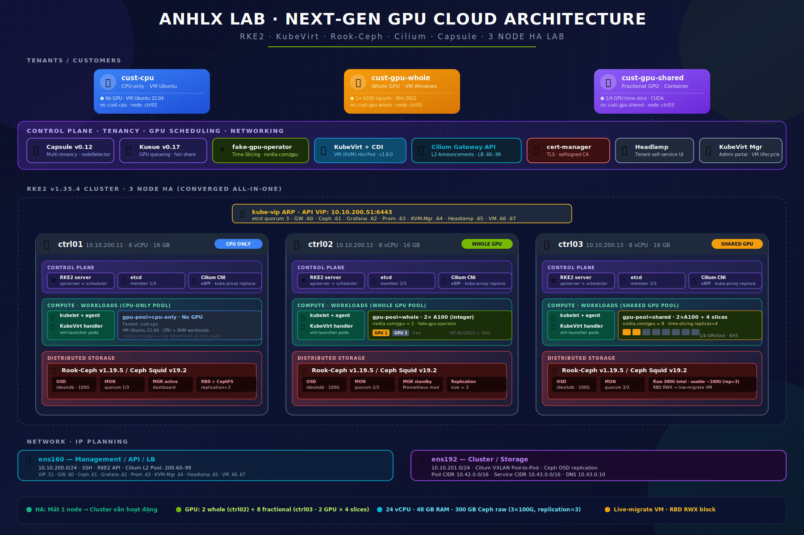

---
title: "Next-Gen GPU Cloud với RKE2 + KubeVirt + Rook-Ceph — 3 Node HA Lab"
categories:
- Kubernetes
- Ceph
- Cloud
tags:
- rke2
- kubevirt
- ceph
- capsule
- cilium
- headlamp
feature_image: "/assets/postbanner.jpg"
feature_text: |
  ### Kubernetes-native Next-Gen GPU Cloud: RKE2 HA, KubeVirt, Rook-Ceph, multi-tenant GPU provisioning với 3 khách hàng — CPU-only, whole-GPU VM Windows, shared-GPU container
---

GPU Cloud đang là mô hình mà các cloud provider thế hệ mới xây dựng để bán GPU compute cho AI teams theo dạng VM hoặc container — không cần sở hữu phần cứng, chỉ trả tiền cho tài nguyên GPU dùng thực tế. Điểm khác biệt so với cloud VM thông thường nằm ở khả năng cấp phát GPU linh hoạt: nguyên GPU cho workload training nặng, hoặc chia nhỏ 1 GPU thành nhiều slot cho inference nhẹ — và cùng một control plane có thể bán cả VM lẫn container, có hoặc không có GPU.

Mình xây lab Next-Gen GPU Cloud để PoC stack này từ đầu trên 3 VM Ubuntu 24.04. **Đây là bản converged all-in-one — gom toàn bộ roles (control-plane, compute, storage, GPU provisioning) lên 3 node để lab nhanh; môi trường thực tế sẽ tách thành các tier riêng: dedicated control-plane nodes, GPU compute nodes (server vật lý có GPU), storage nodes.**

Lab sử dụng Time-slicing để chia nhỏ GPU. Trên hạ tầng A100/H100 thật, kiến trúc chuẩn sẽ sử dụng MIG (Multi-Instance GPU) để chia nhỏ GPU cả về Compute lẫn VRAM ở mức hardware, đảm bảo strict isolation cho tenant. Trên Production, GPU Cloud sẽ không dùng L2 Announcements mà cấu hình Cilium BGP Control Plane.

Bài này mình **phân bổ 3 node khác nhau theo loại khách hàng** — đây là pattern thực tế mà GPU cloud thương mại dùng để tận dụng phần cứng:

- **ctrl01** — node CPU-only, phục vụ khách không cần GPU
- **ctrl02** — node có GPU nguyên, phục vụ khách mua whole-GPU (VM AI training, render)
- **ctrl03** — node có GPU chia nhỏ qua time-slicing, phục vụ khách mua fractional GPU (inference, dev/test)

Stack Kubernetes-native mà các GPU cloud production đang dùng:

1. **RKE2** — Kubernetes HA distribution của Rancher, CIS-hardened, etcd quorum 3 node
2. **Cilium** — CNI eBPF thay kube-proxy, NetworkPolicy enforcement, Gateway API, **L2 Announcements thay MetalLB**
3. **Rook-Ceph** — distributed storage chạy trên K8s, replication=3 an toàn, **RBD block-mode RWX** cho live migration
4. **KubeVirt** — chạy VM (KVM) như Kubernetes workload, thay OpenStack Nova; có Hypervisor Abstraction Layer mới
5. **CDI** — Containerized Data Importer, import Ubuntu/Windows ISO + qcow2 vào PVC
6. **fake-gpu-operator (run-ai)** — cấp phát GPU giả lập cho VM và container, whole hoặc time-sliced (lab; production thay bằng NVIDIA GPU Operator thật)
7. **Capsule** — multi-tenancy hard isolation với **custom Role per tenant (không dùng cluster-admin)**
8. **Kueue** — GPU job queuing, fair-share scheduling, tự động admit workload khi quota available
9. **kube-vip** — VIP cho Kubernetes API HA, timing default 15/10/2



---

## Mục lục

- [Mục lục](#mục-lục)
- [1. Tại sao Kubernetes cho Next-Gen GPU Cloud](#1-tại-sao-kubernetes-cho-next-gen-gpu-cloud)
  - [1.1 OpenStack vs Kubernetes-native](#11-openstack-vs-kubernetes-native)
  - [1.2 Topology 3 nodes trong Lab — phân bổ theo loại khách hàng](#12-topology-3-nodes-trong-lab--phân-bổ-theo-loại-khách-hàng)
- [2. Tài nguyên \& IP Planning](#2-tài-nguyên--ip-planning)
  - [2.1 Tài nguyên lab](#21-tài-nguyên-lab)
  - [2.2 IP planning](#22-ip-planning)
- [3. Base OS (Tất cả nodes)](#3-base-os-tất-cả-nodes)
- [4. Cài RKE2 HA Cluster](#4-cài-rke2-ha-cluster)
  - [4.1 Bootstrap node đầu tiên (ctrl01)](#41-bootstrap-node-đầu-tiên-ctrl01)
  - [4.2 Join ctrl02, ctrl03](#42-join-ctrl02-ctrl03)
  - [4.3 Verify cluster HA](#43-verify-cluster-ha)
- [5. kubectl, Helm, Cilium CLI](#5-kubectl-helm-cilium-cli)
- [6. Cilium L2 Announcements — LoadBalancer cho bare metal (thay MetalLB)](#6-cilium-l2-announcements--loadbalancer-cho-bare-metal-thay-metallb)
- [7. Cert-manager + Cilium Gateway API](#7-cert-manager--cilium-gateway-api)
  - [7.1 Cert-manager](#71-cert-manager)
  - [7.2 Cilium Gateway API](#72-cilium-gateway-api)
- [8. Rook-Ceph Distributed Storage](#8-rook-ceph-distributed-storage)
  - [8.1 Cài Rook Operator](#81-cài-rook-operator)
  - [8.2 Tạo CephCluster](#82-tạo-cephcluster)
  - [8.3 Tạo Pools + StorageClass (replication=3, RBD-RWX, CephFS)](#83-tạo-pools--storageclass-replication3-rbd-rwx-cephfs)
  - [8.4 Ceph Dashboard](#84-ceph-dashboard)
- [9. KubeVirt — chạy VM trên Kubernetes](#9-kubevirt--chạy-vm-trên-kubernetes)
- [10. fake-gpu-operator — Topology theo node](#10-fake-gpu-operator--topology-theo-node)
- [11. Kueue — GPU Job Queueing](#11-kueue--gpu-job-queueing)
  - [11.1 Cài Kueue](#111-cài-kueue)
  - [11.2 ResourceFlavor — định nghĩa GPU pool](#112-resourceflavor--định-nghĩa-gpu-pool)
  - [11.3 ClusterQueue — quota toàn cluster](#113-clusterqueue--quota-toàn-cluster)
  - [11.4 LocalQueue — queue per tenant namespace](#114-localqueue--queue-per-tenant-namespace)
- [12. Monitoring](#12-monitoring)
- [13. KubeVirt Manager — Admin Portal](#13-kubevirt-manager--admin-portal)
- [14. Capsule — Multi-tenancy với custom Role](#14-capsule--multi-tenancy-với-custom-role)
  - [14.1 Cài Capsule](#141-cài-capsule)
  - [14.2 Tạo custom ClusterRole `tenant-owner`](#142-tạo-custom-clusterrole-tenant-owner)
  - [14.3 Helper script — sinh kubeconfig tenant](#143-helper-script--sinh-kubeconfig-tenant)
- [15. Headlamp — User Portal](#15-headlamp--user-portal)
  - [15.1 Cài Headlamp](#151-cài-headlamp)
  - [15.2 Console VM cho tenant](#152-console-vm-cho-tenant)
- [16. Demo: Bán cho 3 khách hàng khác nhau](#16-demo-bán-cho-3-khách-hàng-khác-nhau)
  - [16.1 Tổng quan 3 chân dung](#161-tổng-quan-3-chân-dung)
  - [16.2 Admin chuẩn bị Tenants](#162-admin-chuẩn-bị-tenants)
  - [16.3 KH1 — cust-cpu mua VM Ubuntu 22.04 (không GPU)](#163-kh1--cust-cpu-mua-vm-ubuntu-2204-không-gpu)
  - [16.4 KH2 — cust-gpu-whole mua VM Windows Server 2022 + 1 GPU nguyên](#164-kh2--cust-gpu-whole-mua-vm-windows-server-2022--1-gpu-nguyên)
  - [16.5 KH3 — cust-gpu-shared mua 1 container + GPU chia nhỏ](#165-kh3--cust-gpu-shared-mua-1-container--gpu-chia-nhỏ)
  - [16.6 Verify cross-tenant isolation](#166-verify-cross-tenant-isolation)
- [17. Test HA — Tắt 1 node](#17-test-ha--tắt-1-node)
- [18. Service URLs \& Credentials](#18-service-urls--credentials)
- [19. Lời kết](#19-lời-kết)

---

## 1. Tại sao Kubernetes cho Next-Gen GPU Cloud

### 1.1 OpenStack vs Kubernetes-native

Kiến trúc của OpenStack thuộc về kỷ nguyên VM-centric (2010–2018) — nơi việc provisioning còn chậm, multi-tenancy phức tạp, và cơ chế GPU passthrough qua Nova bộc lộ nhiều hạn chế khi scale-out các training cluster. Thách thức lớn nhất cho operator là phải vận hành hai control plane độc lập nếu muốn cung cấp song song cả VM và container.

Các GPU cloud hiện đại đã giải quyết triệt để bài toán này bằng cách unified (đồng nhất) hạ tầng: cấp phát cả VM (cho nhu cầu cô lập OS) lẫn container (cho ML pipeline) trên một nền tảng duy nhất. KubeVirt chính là chìa khóa giúp VM và container chia sẻ toàn bộ tài nguyên từ scheduler, storage, network đến hệ thống monitoring.

Bước sang giai đoạn 2025–2026, Kubernetes đã trở thành chuẩn chung cho control plane của các GPU cloud lớn. Trong khi **OpenStack lùi về phân khúc private cloud thuần VM truyền thống**, thì đối với **bài toán phân phối GPU** dạng container hoặc chia nhỏ tài nguyên (fractional GPU), **Kubernetes là lựa chọn duy nhất hợp lý**.

| Yêu cầu AI workload | OpenStack | Kubernetes-native |
|---|---|---|
| **Cấp phát GPU cho container** | Cần Magnum + Zun (deprecated), hoặc Nova GPU PCI | Built-in qua Device Plugin framework, GPU Operator |
| **Fractional GPU (time-slice, MIG)** | Không hỗ trợ native | GPU Operator + time-slicing ConfigMap, MIG, DRA |
| **Multi-tenant GPU quota** | Nova quota cho cores/RAM, không có cho GPU | ResourceQuota cho `nvidia.com/gpu` (Capsule enforce per-tenant) |
| **VM + Container cùng platform** | Chỉ VM (Nova). Container qua Zun (deprecated 2024) | KubeVirt cho VM + Pod cho container, cùng K8s API |
| **GitOps / IaC** | Heat templates, complex | Helm + ArgoCD/Flux, mọi config là YAML |
| **AI ecosystem** | Không có native integration | Kubeflow, KServe, Ray, vLLM, NIM — all native K8s |
| **GPU scheduling/queueing** | Không có | Kueue, Volcano, KAI Scheduler |

### 1.2 Topology 3 nodes trong Lab — phân bổ theo loại khách hàng

Thay vì 3 node giống nhau, lab phân bổ mỗi node cho một loại khách hàng để mô phỏng đúng cách GPU cloud thương mại tận dụng phần cứng.

**Nguyên tắc tài chính:** node có GPU rất đắt (A100/H100). Không bao giờ đặt workload không cần GPU lên node có GPU — đó là lãng phí tài nguyên. Cloud provider phải có pool node CPU-only cho workload không GPU, và pool node GPU dành riêng cho khách trả tiền GPU.

| Node | IP | Roles K8s | Roles Ceph | GPU pool | Khách hàng phục vụ |
|---|---|---|---|---|---|
| **ctrl01** | 10.10.200.11 | etcd, control-plane, worker | mon, osd | **không** — `gpu-pool=cpu-only` | Khách không cần GPU (web, dev VM, microservice...) |
| **ctrl02** | 10.10.200.12 | etcd, control-plane, worker | mon, osd | **whole GPU** — `gpu-pool=whole`, 2× simulated A100 | Khách mua nguyên GPU (training, render, Windows AI workstation) |
| **ctrl03** | 10.10.200.13 | etcd, control-plane, worker | mon, osd | **shared GPU** — `gpu-pool=shared`, 2× A100 chia 4 slice = 8 fractional | Khách mua GPU chia nhỏ (inference, dev/test, learning) |
| **VIP** | 10.10.200.51 | API endpoint (kube-vip ARP) | — | — | — |

**Cách `nodeSelector` chỉ workload đến đúng node:**

- Tenant `cust-cpu` (KH không GPU) → Capsule inject `nodeSelector: gpu-pool=cpu-only` → land trên ctrl01
- Tenant `cust-gpu-whole` (KH whole GPU) → Capsule inject `nodeSelector: gpu-pool=whole` → land trên ctrl02
- Tenant `cust-gpu-shared` (KH fractional) → Capsule inject `nodeSelector: gpu-pool=shared` → land trên ctrl03

Workload hệ thống (Rook, monitoring, ingress, KubeVirt operator) chạy trên cả 3 node bình thường — chúng không cần GPU, nodeSelector tenant không áp dụng.

---

## 2. Tài nguyên & IP Planning

### 2.1 Tài nguyên lab

3 VM trên ESXi:

| Node | CPU | RAM | Disk 1 (OS) | Disk 2 (Ceph OSD) | NIC 1 (mgmt) | NIC 2 (cluster/storage) |
|---|---|---|---|---|---|---|
| ctrl01 | 8 vCPU | 16 GB | 200 GB | 100 GB | ens160 | ens192 |
| ctrl02 | 8 vCPU | 16 GB | 200 GB | 100 GB | ens160 | ens192 |
| ctrl03 | 8 vCPU | 16 GB | 200 GB | 100 GB | ens160 | ens192 |

Yêu cầu ESXi: **Expose hardware assisted virtualization to the guest OS = true** (VM Options → CPU). Không có cờ này, KVM nested không chạy, KubeVirt sẽ fall-back qua emulation rất chậm hoặc fail.

### 2.2 IP planning

```
Subnet: 10.10.200.0/24 (mgmt + cluster, đơn giản hóa cho lab)
Gateway: 10.10.200.1
DNS: 1.1.1.1, 8.8.8.8

# Node IPs (ens160 mgmt)
ctrl01:   10.10.200.11
ctrl02:   10.10.200.12
ctrl03:   10.10.200.13

# Kubernetes API HA (kube-vip ARP)
VIP:      10.10.200.51

# Cilium L2 Announcement pool (services LoadBalancer + Gateway)
LB pool:  10.10.200.60-10.10.200.99
  - Gateway API:           10.10.200.60
  - Ceph dashboard:        10.10.200.61
  - Grafana:               10.10.200.62
  - Prometheus:            10.10.200.63
  - KubeVirt Manager:      10.10.200.64
  - Headlamp:              10.10.200.65
  - Floating IP cust-cpu:        10.10.200.66
  - Floating IP cust-gpu-whole:  10.10.200.67
  - Floating IP cust-gpu-shared: 10.10.200.68 (nếu cần expose container)

# Pod & Service CIDR (RKE2 default)
Cluster CIDR:  10.42.0.0/16
Service CIDR:  10.43.0.0/16
Cluster DNS:   10.43.0.10
```

LB pool 10.10.200.60-99 phải nằm trong cùng L2 với node để ARP announcement work. Đây là yêu cầu của Cilium L2 Announcements — feature này không route qua L3, chỉ ARP reply trong cùng broadcast domain.

---

## 3. Base OS (Tất cả nodes)

**Chuẩn bị OS** — chạy toàn bộ block này trên cả 3 node:

```bash
# Swap off (bắt buộc cho Kubernetes)
swapoff -a
sed -i '/ swap / s/^\(.*\)$/#\1/g' /etc/fstab

# Disable ufw và apparmor (conflict với KVM nested)
systemctl disable --now ufw apparmor

# Chrony — Ceph yêu cầu clock skew < 50ms giữa các mon
apt update && apt install -y chrony
chronyc tracking | grep "Leap status"

# Kernel modules
tee /etc/modules-load.d/k8s.conf <<EOF
br_netfilter
overlay
ip_vs
ip_vs_rr
ip_vs_wrr
ip_vs_sh
nf_conntrack
EOF
modprobe br_netfilter overlay ip_vs ip_vs_rr ip_vs_wrr ip_vs_sh nf_conntrack

# KVM nested (bắt buộc cho KubeVirt)
modprobe kvm_intel nested=1
echo "options kvm_intel nested=1" > /etc/modprobe.d/kvm-intel.conf
cat /sys/module/kvm_intel/parameters/nested   # phải ra: Y

# sysctl
tee /etc/sysctl.d/99-k8s-ceph-kubevirt.conf <<EOF
net.bridge.bridge-nf-call-iptables  = 1
net.bridge.bridge-nf-call-ip6tables = 1
net.ipv4.ip_forward                 = 1
net.ipv4.conf.all.rp_filter         = 0
net.ipv4.conf.default.rp_filter     = 0
vm.swappiness                       = 0
vm.overcommit_memory                = 1
vm.max_map_count                    = 524288
fs.inotify.max_user_instances       = 8192
fs.inotify.max_user_watches         = 524288
fs.file-max                         = 2097152
kernel.pid_max                      = 4194304
net.core.somaxconn                  = 32768
net.netfilter.nf_conntrack_max      = 1000000
EOF
sysctl --system

# Packages
apt install -y \
  curl wget vim git jq htop iotop \
  nfs-common open-iscsi cryptsetup ceph-common \
  qemu-guest-agent gnupg lsb-release apt-transport-https \
  ca-certificates software-properties-common

# Ubuntu 24.04: phải dùng iptables-legacy — nftables mặc định làm KubeVirt rules fail im lặng
update-alternatives --set iptables /usr/sbin/iptables-legacy
update-alternatives --set ip6tables /usr/sbin/ip6tables-legacy

# /etc/hosts
tee -a /etc/hosts <<EOF
10.10.200.11  ctrl01
10.10.200.12  ctrl02
10.10.200.13  ctrl03
10.10.200.51  k8s-api.anhlx.lab
EOF
```

---

## 4. Cài RKE2 HA Cluster

Mình bootstrap ctrl01 trước, sau đó join ctrl02 và ctrl03.

### 4.1 Bootstrap node đầu tiên (ctrl01)

Tạo config trước khi install — quan trọng vì RKE2 sẽ apply manifests trong `/var/lib/rancher/rke2/server/manifests/` ngay khi start:

```bash
mkdir -p /etc/rancher/rke2 /var/lib/rancher/rke2/server/manifests

tee /etc/rancher/rke2/config.yaml <<EOF
# Tên cluster
write-kubeconfig-mode: "0644"
token: "Sup3rSecr3tT0ken-Lab-2026"

# Node-specific
node-name: "ctrl01"
node-ip: "10.10.200.11"
advertise-address: "10.10.200.11"

# TLS SAN — bao gồm VIP để client kubectl tin
tls-san:
  - "10.10.200.51"
  - "k8s-api.anhlx.lab"
  - "ctrl01"
  - "ctrl02"
  - "ctrl03"
  - "10.10.200.11"
  - "10.10.200.12"
  - "10.10.200.13"

# CNI = Cilium (sẽ override config phía dưới)
cni: cilium

# Disable components mặc định không dùng
disable:
  - rke2-ingress-nginx          # Bỏ ingress nginx, dùng Cilium Gateway API thay thế
  - rke2-canal                  # Bỏ canal, dùng Cilium
  - rke2-snapshot-validation-webhook   # Bỏ webhook validation cho VolumeSnapshot (lab); production nên giữ

# Giữ rke2-snapshot-controller để hỗ trợ VolumeSnapshot Ceph RBD

# Kube-proxy disabled — Cilium replace bằng eBPF
disable-kube-proxy: true

# CIDR
cluster-cidr: "10.42.0.0/16"
service-cidr: "10.43.0.0/16"
cluster-dns: "10.43.0.10"

# Etcd snapshot
etcd-snapshot-schedule-cron: "0 */6 * * *"
etcd-snapshot-retention: 28
EOF
```

Tạo HelmChartConfig cho Cilium **trước** khi start RKE2. RKE2 sẽ apply manifests theo alphabetical order trong thư mục `manifests/`:

```bash
tee /var/lib/rancher/rke2/server/manifests/rke2-cilium-config.yaml <<EOF
apiVersion: helm.cattle.io/v1
kind: HelmChartConfig
metadata:
  name: rke2-cilium
  namespace: kube-system
spec:
  valuesContent: |-
    # ===== Kube-proxy replacement =====
    kubeProxyReplacement: true
    k8sServiceHost: 10.10.200.11    # Bootstrap với IP ctrl01, sẽ update sang VIP sau khi cluster up
    k8sServicePort: 6443

    # ===== eBPF datapath =====
    bpf:
      masquerade: true
    routingMode: tunnel
    tunnelProtocol: vxlan

    # ===== Ingress / LB =====
    # L2 Announcements — thay MetalLB
    l2announcements:
      enabled: true
      leaseDuration: "15s"
      leaseRenewDeadline: "10s"
      leaseRetryPeriod: "2s"

    externalIPs:
      enabled: true

    # Gateway API
    gatewayAPI:
      enabled: true
      enableAlpn: true
      enableAppProtocol: true

    # ===== Hubble (observability) =====
    hubble:
      enabled: true
      relay:
        enabled: true
      ui:
        enabled: true

    # ===== IPAM =====
    ipam:
      mode: "cluster-pool"
      operator:
        clusterPoolIPv4PodCIDRList:
          - "10.42.0.0/16"
        clusterPoolIPv4MaskSize: 24

    # ===== Operator =====
    operator:
      replicas: 2

    # ===== Resource =====
    resources:
      requests:
        cpu: 100m
        memory: 256Mi
      limits:
        memory: 1Gi
EOF
```

Lưu ý quan trọng về L2 Announcements: cần `kubeProxyReplacement: true` (đã có), `externalIPs.enabled: true` (đã có), và `l2announcements.enabled: true`. Devices interface sẽ auto-detect; nếu cần force, thêm `devices: "ens160"`.

Tạo kube-vip manifest cho VIP API (timing default 15/10/2):

```bash
tee /var/lib/rancher/rke2/server/manifests/kube-vip.yaml <<EOF
---
apiVersion: v1
kind: ServiceAccount
metadata:
  name: kube-vip
  namespace: kube-system
---
apiVersion: rbac.authorization.k8s.io/v1
kind: ClusterRole
metadata:
  name: system:kube-vip-role
rules:
  - apiGroups: [""]
    resources: ["services", "services/status", "nodes", "endpoints"]
    verbs: ["list","get","watch","update","patch"]
  - apiGroups: ["coordination.k8s.io"]
    resources: ["leases"]
    verbs: ["list","get","watch","update","create"]
  - apiGroups: ["discovery.k8s.io"]
    resources: ["endpointslices"]
    verbs: ["list","get","watch","update"]
---
apiVersion: rbac.authorization.k8s.io/v1
kind: ClusterRoleBinding
metadata:
  name: system:kube-vip-binding
roleRef:
  apiGroup: rbac.authorization.k8s.io
  kind: ClusterRole
  name: system:kube-vip-role
subjects:
  - kind: ServiceAccount
    name: kube-vip
    namespace: kube-system
---
apiVersion: apps/v1
kind: DaemonSet
metadata:
  name: kube-vip-ds
  namespace: kube-system
  labels:
    app.kubernetes.io/name: kube-vip-ds
    app.kubernetes.io/version: v0.9.0
spec:
  selector:
    matchLabels:
      app.kubernetes.io/name: kube-vip-ds
  template:
    metadata:
      labels:
        app.kubernetes.io/name: kube-vip-ds
        app.kubernetes.io/version: v0.9.0
    spec:
      affinity:
        nodeAffinity:
          requiredDuringSchedulingIgnoredDuringExecution:
            nodeSelectorTerms:
              - matchExpressions:
                  - key: node-role.kubernetes.io/control-plane
                    operator: Exists
      containers:
        - name: kube-vip
          image: ghcr.io/kube-vip/kube-vip:v0.9.0
          imagePullPolicy: IfNotPresent
          args:
            - manager
          env:
            - name: vip_arp
              value: "true"
            - name: port
              value: "6443"
            - name: vip_cidr
              value: "32"
            - name: cp_enable
              value: "true"
            - name: cp_namespace
              value: kube-system
            - name: vip_ddns
              value: "false"
            - name: svc_enable
              value: "false"   # Service LB do Cilium L2 lo, không phải kube-vip
            - name: vip_leaderelection
              value: "true"
            # === Timing default Kubernetes 15/10/2 
            - name: vip_leaseduration
              value: "15"
            - name: vip_renewdeadline
              value: "10"
            - name: vip_retryperiod
              value: "2"
            - name: address
              value: "10.10.200.51"
          securityContext:
            capabilities:
              add: ["NET_ADMIN","NET_RAW","SYS_TIME"]
      hostNetwork: true
      serviceAccountName: kube-vip
      tolerations:
        - effect: NoSchedule
          operator: Exists
        - effect: NoExecute
          operator: Exists
EOF
```

Cài và start RKE2:

```bash
curl -sfL https://get.rke2.io | INSTALL_RKE2_VERSION=v1.35.4+rke2r1 sh -

systemctl enable rke2-server.service
systemctl start rke2-server.service

# Theo dõi log đến khi node Ready (mất ~3-5 phút)
journalctl -u rke2-server -f
```

Trong khi chờ, mở terminal khác setup kubectl:

```bash
cp /etc/rancher/rke2/rke2.yaml ~/rke2.yaml
chown $(id -u):$(id -g) ~/rke2.yaml
export KUBECONFIG=~/rke2.yaml
export PATH=$PATH:/var/lib/rancher/rke2/bin

echo 'export KUBECONFIG=~/rke2.yaml' >> ~/.bashrc
echo 'export PATH=$PATH:/var/lib/rancher/rke2/bin' >> ~/.bashrc

kubectl get nodes -o wide
```

Verify Cilium + kube-vip up:

```bash
kubectl get pods -n kube-system | grep -E "cilium|kube-vip"
# cilium-xxxxx                        1/1 Running
# cilium-operator-xxxxx               1/1 Running
# kube-vip-ds-xxxxx                   1/1 Running

# VIP đã claimed?
ip addr show ens160 | grep 10.10.200.51
# inet 10.10.200.51/32 scope global ens160
```

Test access qua VIP:

```bash
kubectl get nodes -o wide --server=https://10.10.200.51:6443
# root@ctrl01:/root/# kubectl get nodes -o wide --server=https://10.10.200.51:6443
# NAME     STATUS   ROLES                AGE   VERSION          INTERNAL-IP    EXTERNAL-IP   OS-IMAGE             KERNEL-VERSION      CONTAINER-RUNTIME
# ctrl01   Ready    control-plane,etcd   19m   v1.35.4+rke2r1   10.10.200.11   <none>        Ubuntu 24.04.4 LTS   6.8.0-106-generic   containerd://2.2.3-k3s1
# root@ctrl01:/root/#

```

### 4.2 Join ctrl02, ctrl03

Lấy token từ ctrl01:

```bash
# Token đã set trong config: Sup3rSecr3tT0ken-Lab-2026
# Hoặc đọc từ file:
cat /var/lib/rancher/rke2/server/node-token
```

Trên **ctrl02**:

```bash
mkdir -p /etc/rancher/rke2

tee /etc/rancher/rke2/config.yaml <<EOF
server: https://10.10.200.51:9345
token: "Sup3rSecr3tT0ken-Lab-2026"

node-name: "ctrl02"
node-ip: "10.10.200.12"
advertise-address: "10.10.200.12"

tls-san:
  - "10.10.200.51"
  - "k8s-api.anhlx.lab"
  - "ctrl02"

cni: cilium
disable-kube-proxy: true

disable:
  - rke2-ingress-nginx
  - rke2-canal
  - rke2-snapshot-validation-webhook
EOF

curl -sfL https://get.rke2.io | INSTALL_RKE2_VERSION=v1.35.4+rke2r1 sh -
systemctl enable --now rke2-server.service

journalctl -u rke2-server -f
```

Tương tự cho **ctrl03**, đổi `node-name`, `node-ip`, `advertise-address`:

```bash
mkdir -p /etc/rancher/rke2

tee /etc/rancher/rke2/config.yaml <<EOF
server: https://10.10.200.51:9345
token: "Sup3rSecr3tT0ken-Lab-2026"

node-name: "ctrl03"
node-ip: "10.10.200.13"
advertise-address: "10.10.200.13"

tls-san:
  - "10.10.200.51"
  - "k8s-api.anhlx.lab"
  - "ctrl03"

cni: cilium
disable-kube-proxy: true

disable:
  - rke2-ingress-nginx
  - rke2-canal
  - rke2-snapshot-validation-webhook
EOF

curl -sfL https://get.rke2.io | INSTALL_RKE2_VERSION=v1.35.4+rke2r1 sh -
systemctl enable --now rke2-server.service
```

### 4.3 Verify cluster HA

Từ ctrl01:

```bash
kubectl get nodes -o wide
# NAME     STATUS   ROLES                AGE   VERSION          INTERNAL-IP    EXTERNAL-IP   OS-IMAGE             KERNEL-VERSION      CONTAINER-RUNTIME
# ctrl01   Ready    control-plane,etcd   27m   v1.35.4+rke2r1   10.10.200.11   <none>        Ubuntu 24.04.4 LTS   6.8.0-106-generic   containerd://2.2.3-k3s1
# ctrl02   Ready    control-plane,etcd   73s   v1.35.4+rke2r1   10.10.200.12   <none>        Ubuntu 24.04.4 LTS   6.8.0-106-generic   containerd://2.2.3-k3s1
# ctrl03   Ready    control-plane,etcd   42s   v1.35.4+rke2r1   10.10.200.13   <none>        Ubuntu 24.04.4 LTS   6.8.0-117-generic   containerd://2.2.3-k3s1

kubectl get pods -n kube-system
# Tất cả pod Cilium, kube-vip, coredns, etcd, kube-apiserver, kube-controller-manager, kube-scheduler đều Running

# Verify etcd quorum
kubectl get pods -n kube-system -l component=etcd -o wide
# NAME          READY   STATUS    RESTARTS   AGE     IP             NODE     NOMINATED NODE   READINESS GATES
# etcd-ctrl01   1/1     Running   0          28m     10.10.200.11   ctrl01   <none>           <none>
# etcd-ctrl02   1/1     Running   0          2m34s   10.10.200.12   ctrl02   <none>           <none>
# etcd-ctrl03   1/1     Running   0          116s    10.10.200.13   ctrl03   <none>           <none>
```

**Update Cilium k8sServiceHost từ ctrl01 IP sang VIP** — đây là pattern bootstrap mà cần làm cẩn thận:

```bash
kubectl -n kube-system patch helmchartconfig rke2-cilium --type=merge -p='
{
  "spec": {
    "valuesContent": "kubeProxyReplacement: true\nk8sServiceHost: 10.10.200.51\nk8sServicePort: 6443\nbpf:\n  masquerade: true\nroutingMode: tunnel\ntunnelProtocol: vxlan\nl2announcements:\n  enabled: true\n  leaseDuration: \"15s\"\n  leaseRenewDeadline: \"10s\"\n  leaseRetryPeriod: \"2s\"\nexternalIPs:\n  enabled: true\ngatewayAPI:\n  enabled: true\n  enableAlpn: true\n  enableAppProtocol: true\nhubble:\n  enabled: true\n  relay:\n    enabled: true\n  ui:\n    enabled: true\nipam:\n  mode: \"cluster-pool\"\n  operator:\n    clusterPoolIPv4PodCIDRList:\n      - \"10.42.0.0/16\"\n    clusterPoolIPv4MaskSize: 24\noperator:\n  replicas: 2\nresources:\n  requests:\n    cpu: 100m\n    memory: 256Mi\n  limits:\n    memory: 1Gi"
  }
}'

# Helm chart sẽ reconcile, restart Cilium pod từng node (rolling)
kubectl -n kube-system rollout status ds/cilium

# Sau khi xong, mỗi Cilium pod đều talk tới VIP
kubectl -n kube-system exec ds/cilium -- env | grep -E "KUBERNETES_SERVICE|CILIUM_K8S"
# KUBERNETES_SERVICE_HOST=10.10.200.51
# KUBERNETES_SERVICE_PORT=6443
# CILIUM_K8S_NAMESPACE=kube-system
# KUBERNETES_SERVICE_PORT_HTTPS=443

kubectl -n kube-system logs ds/cilium | grep -i "Establishing connection to"
# Found 3 pods, using pod/cilium-q4qnn
# time=2026-05-27T02:55:46.494097255Z level=info msg="Establishing connection to apiserver" module=agent.infra.k8s-client ipAddr=https://10.10.200.51:6443
```

RKE2 dùng **containerd** làm container runtime — không có `docker` hay `podman` trên node. Để inspect container/image trực tiếp, dùng `crictl` (CRI client). RKE2 dùng socket riêng tại `/run/k3s/containerd/containerd.sock`, cần config một lần:

```bash
cat > /etc/crictl.yaml <<'EOF'
runtime-endpoint: unix:///run/k3s/containerd/containerd.sock
image-endpoint: unix:///run/k3s/containerd/containerd.sock
EOF

ln -sf /var/lib/rancher/rke2/bin/crictl /usr/local/bin/crictl
```

Sau đó dùng như docker:

```bash
crictl ps              # docker ps
crictl images          # docker images
crictl pull <image>    # docker pull
crictl inspect <id>    # docker inspect
```

---

## 5. kubectl, Helm, Cilium CLI

```bash
# Helm 3 (3.21+)
curl -fsSL -o get_helm.sh https://raw.githubusercontent.com/helm/helm/main/scripts/get-helm-3
chmod 700 get_helm.sh
./get_helm.sh
helm version
# version.BuildInfo{Version:"v3.21.x"...}

# Cilium CLI (cho debug)
CILIUM_CLI_VERSION=$(curl -s https://raw.githubusercontent.com/cilium/cilium-cli/main/stable.txt)
curl -L --remote-name-all https://github.com/cilium/cilium-cli/releases/download/${CILIUM_CLI_VERSION}/cilium-linux-amd64.tar.gz
tar xzvf cilium-linux-amd64.tar.gz -C /usr/local/bin
rm cilium-linux-amd64.tar.gz

cilium status --wait
# root@ctrl01:/root/# cilium status --wait
#     /¯¯\
#  /¯¯\__/¯¯\    Cilium:             OK
#  \__/¯¯\__/    Operator:           OK
#  /¯¯\__/¯¯\    Envoy DaemonSet:    disabled (using embedded mode)
#  \__/¯¯\__/    Hubble Relay:       OK
#     \__/       ClusterMesh:        disabled

# DaemonSet              cilium                   Desired: 3, Ready: 3/3, Available: 3/3
# Deployment             cilium-operator          Desired: 2, Ready: 2/2, Available: 2/2
# Deployment             hubble-relay             Desired: 1, Ready: 1/1, Available: 1/1
# Deployment             hubble-ui                Desired: 1, Ready: 1/1, Available: 1/1
# Containers:            cilium                   Running: 3
#                        cilium-operator          Running: 2
#                        clustermesh-apiserver
#                        hubble-relay             Running: 1
#                        hubble-ui                Running: 1
# Cluster Pods:          7/7 managed by Cilium
# Helm chart version:
# Image versions         cilium             rancher/mirrored-cilium-cilium:v1.19.3: 3
#                        cilium-operator    rancher/mirrored-cilium-operator-generic:v1.19.3: 2
#                        hubble-relay       rancher/mirrored-cilium-hubble-relay:v1.19.3: 1
#                        hubble-ui          rancher/mirrored-cilium-hubble-ui-backend:v0.13.3: 1
#                        hubble-ui          rancher/mirrored-cilium-hubble-ui:v0.13.3: 1
# root@ctrl01:/root/#
```

---

## 6. Cilium L2 Announcements — LoadBalancer cho bare metal (thay MetalLB)

Cilium đã có L2 Announcements production-ready — mình không cần cài thêm MetalLB nữa. Một CNI stack gọn hơn, Hubble thấy được cả LB traffic, và không phải duy trì upgrade matrix cho 2 component khác vendor.

Cấu hình gồm 2 CRD: `CiliumLoadBalancerIPPool` (range IP) + `CiliumL2AnnouncementPolicy` (chọn service nào announce ra interface nào).

```bash
# IP pool 10.10.200.60-99 cho service LoadBalancer
kubectl apply -f - <<EOF
apiVersion: cilium.io/v2alpha1
kind: CiliumLoadBalancerIPPool
metadata:
  name: lab-pool
spec:
  blocks:
    - start: "10.10.200.60"
      stop:  "10.10.200.99"
EOF
```

```bash
# Policy announce trên interface ens160 (mgmt network)
kubectl apply -f - <<EOF
apiVersion: cilium.io/v2alpha1
kind: CiliumL2AnnouncementPolicy
metadata:
  name: default-l2-policy
  namespace: kube-system
spec:
  loadBalancerIPs: true
  externalIPs: true
  interfaces:
    - ^ens160$
  nodeSelector:
    matchLabels:
      kubernetes.io/os: linux
EOF
```

Test bằng một Service LoadBalancer tạm:

```bash
kubectl create deployment nginx-test --image=nginx
kubectl expose deployment nginx-test --type=LoadBalancer --port=80

kubectl get svc nginx-test
# NAME         TYPE           CLUSTER-IP    EXTERNAL-IP    PORT(S)
# nginx-test   LoadBalancer   10.43.47.255   10.10.200.60   80:31095/TCP 

# Test từ máy ngoài cluster
curl http://10.10.200.60
# <html><body>Welcome to nginx!</body></html>

# Cleanup
kubectl delete deployment nginx-test
kubectl delete svc nginx-test
```

L2 Announcements hoạt động active-passive: chỉ 1 node tại 1 thời điểm ARP reply cho 1 service IP. Khi node đó down, Cilium leader election chọn node khác (10-15 giây). Đây là behavior giống MetalLB L2 mode.

---

## 7. Cert-manager + Cilium Gateway API

Cert-manager cấp TLS cho Gateway, Capsule webhook, và optional cho service exposed:

### 7.1 Cert-manager

```bash
helm repo add jetstack https://charts.jetstack.io
helm repo update

helm install cert-manager jetstack/cert-manager \
  --namespace cert-manager --create-namespace \
  --version v1.19.4 \
  --set crds.enabled=true \
  --set replicaCount=2 \
  --set webhook.replicaCount=2 \
  --set cainjector.replicaCount=2 \
  --set resources.requests.cpu=20m \
  --set resources.requests.memory=64Mi

kubectl -n cert-manager rollout status deployment/cert-manager
kubectl -n cert-manager rollout status deployment/cert-manager-webhook
kubectl -n cert-manager rollout status deployment/cert-manager-cainjector
```

Tạo Self-signed ClusterIssuer (lab; production nên Let's Encrypt DNS-01 hoặc internal CA):

```bash
kubectl apply -f - <<EOF
apiVersion: cert-manager.io/v1
kind: ClusterIssuer
metadata:
  name: selfsigned-cluster-issuer
spec:
  selfSigned: {}
---
# CA root tự ký (lab)
apiVersion: cert-manager.io/v1
kind: Certificate
metadata:
  name: lab-ca
  namespace: cert-manager
spec:
  isCA: true
  commonName: lab-ca
  secretName: lab-ca-secret
  privateKey:
    algorithm: ECDSA
    size: 256
  issuerRef:
    name: selfsigned-cluster-issuer
    kind: ClusterIssuer
---
apiVersion: cert-manager.io/v1
kind: ClusterIssuer
metadata:
  name: lab-ca-issuer
spec:
  ca:
    secretName: lab-ca-secret
EOF
```

Verify:

```bash
kubectl get clusterissuer
# root@ctrl01:/root/# kubectl get clusterissuer
# NAME                        READY   AGE
# lab-ca-issuer               True    11s
# selfsigned-cluster-issuer   True    11s
# root@ctrl01:/root/#
```

### 7.2 Cilium Gateway API

Cilium đã enable Gateway API trong HelmChartConfig. Cài thêm Gateway API CRDs (RKE2 chưa bao gồm theo default):

```bash
#Cài Gateway API CRDs
GATEWAY_API_VERSION=v1.3.0
kubectl apply -f https://github.com/kubernetes-sigs/gateway-api/releases/download/${GATEWAY_API_VERSION}/standard-install.yaml

# Restart Cilium operator để detect GatewayClass CRD mới
kubectl -n kube-system rollout restart deployment/cilium-operator
kubectl -n kube-system rollout status deployment/cilium-operator --timeout=60s

# Tạo GatewayClass — operator không tự tạo, phải apply thủ công
cat <<'EOF' | kubectl apply -f -
apiVersion: gateway.networking.k8s.io/v1
kind: GatewayClass
metadata:
  name: cilium
spec:
  controllerName: io.cilium/gateway-controller
EOF

# Verify GatewayClass
kubectl get gatewayclass
# NAME     CONTROLLER                     ACCEPTED   AGE
# cilium   io.cilium/gateway-controller   True       6s
```

Tạo Gateway dùng IP cố định từ pool:

```bash
kubectl apply -f - <<EOF
apiVersion: gateway.networking.k8s.io/v1
kind: Gateway
metadata:
  name: lab-gateway
  namespace: default
  annotations:
    io.cilium/lb-ipam-ips: "10.10.200.60"
spec:
  gatewayClassName: cilium
  listeners:
    - name: http
      protocol: HTTP
      port: 80
      allowedRoutes:
        namespaces:
          from: All
    - name: https
      protocol: HTTPS
      port: 443
      tls:
        mode: Terminate
        certificateRefs:
          - kind: Secret
            name: lab-gateway-tls
      allowedRoutes:
        namespaces:
          from: All
EOF

# Generate cert cho gateway
kubectl apply -f - <<EOF
apiVersion: cert-manager.io/v1
kind: Certificate
metadata:
  name: lab-gateway-tls
  namespace: default
spec:
  secretName: lab-gateway-tls
  dnsNames:
    - "*.anhlx.lab"
    - "lab.local"
  issuerRef:
    name: lab-ca-issuer
    kind: ClusterIssuer
EOF

# Verify gateway nhận IP
kubectl get gateway lab-gateway
# NAME          CLASS    ADDRESS         PROGRAMMED   AGE
# lab-gateway   cilium   10.10.200.60   True         29s
```

---

## 8. Rook-Ceph Distributed Storage

Mình cài Rook-Ceph theo thứ tự: operator → CephCluster CR → pool và StorageClass. 

### 8.1 Cài Rook Operator

```bash
ROOK_VERSION=v1.19.5

kubectl apply --server-side -f https://raw.githubusercontent.com/rook/rook/${ROOK_VERSION}/deploy/examples/crds.yaml

# Xác nhận CRD core đã có
kubectl get crd cephclusters.ceph.rook.io

kubectl apply -f https://raw.githubusercontent.com/rook/rook/${ROOK_VERSION}/deploy/examples/common.yaml

kubectl apply -f https://raw.githubusercontent.com/rook/rook/${ROOK_VERSION}/deploy/examples/operator.yaml

kubectl -n rook-ceph rollout status deployment/rook-ceph-operator

# CSI CRDs từ ceph-csi project — Rook v1.19+ cần nhưng không có trong crds.yaml
# Phải apply trước khi tạo CephCluster
kubectl apply -f - <<EOF
---
apiVersion: apiextensions.k8s.io/v1
kind: CustomResourceDefinition
metadata:
  name: cephconnections.csi.ceph.io
spec:
  group: csi.ceph.io
  names:
    kind: CephConnection
    listKind: CephConnectionList
    plural: cephconnections
    singular: cephconnection
  scope: Namespaced
  versions:
    - name: v1
      served: true
      storage: true
      schema:
        openAPIV3Schema:
          type: object
          x-kubernetes-preserve-unknown-fields: true
      subresources:
        status: {}
---
apiVersion: apiextensions.k8s.io/v1
kind: CustomResourceDefinition
metadata:
  name: clientprofiles.csi.ceph.io
spec:
  group: csi.ceph.io
  names:
    kind: ClientProfile
    listKind: ClientProfileList
    plural: clientprofiles
    singular: clientprofile
  scope: Namespaced
  versions:
    - name: v1
      served: true
      storage: true
      schema:
        openAPIV3Schema:
          type: object
          x-kubernetes-preserve-unknown-fields: true
      subresources:
        status: {}
---
apiVersion: apiextensions.k8s.io/v1
kind: CustomResourceDefinition
metadata:
  name: networkfences.csi.ceph.io
spec:
  group: csi.ceph.io
  names:
    kind: NetworkFence
    listKind: NetworkFenceList
    plural: networkfences
    singular: networkfence
  scope: Cluster
  versions:
    - name: v1alpha1
      served: true
      storage: true
      schema:
        openAPIV3Schema:
          type: object
          x-kubernetes-preserve-unknown-fields: true
      subresources:
        status: {}
EOF
```

### 8.2 Tạo CephCluster

```bash
kubectl apply -f - <<EOF
apiVersion: ceph.rook.io/v1
kind: CephCluster
metadata:
  name: rook-ceph
  namespace: rook-ceph
spec:
  cephVersion:
    image: quay.io/ceph/ceph:v19.2.3
    allowUnsupported: false
  dataDirHostPath: /var/lib/rook
  skipUpgradeChecks: false
  mon:
    count: 3
    allowMultiplePerNode: false
  mgr:
    count: 2
    allowMultiplePerNode: false
    modules:
      - name: dashboard
        enabled: true
      - name: prometheus
        enabled: true
  dashboard:
    enabled: true
    ssl: false
  monitoring:
    enabled: true
  network:
    provider: host
  crashCollector:
    disable: false
  cleanupPolicy:
    confirmation: ""
  resources:
    mon:
      requests:
        cpu: 200m
        memory: 512Mi
      limits:
        memory: 1Gi
    osd:
      requests:
        cpu: 300m
        memory: 1Gi
      limits:
        memory: 2Gi
    mgr:
      requests:
        cpu: 200m
        memory: 512Mi
      limits:
        memory: 1Gi
  storage:
    useAllNodes: true
    useAllDevices: false
    deviceFilter: "^sdb"   # Disk thứ 2 đã prep ở section 3.7
    config:
      osdsPerDevice: "1"
      storeType: bluestore
  placement:
    all:
      tolerations:
        - operator: Exists
EOF
```

Theo dõi cluster lên:

```bash
kubectl -n rook-ceph get cephcluster
# NAME        DATADIRHOSTPATH   MONCOUNT   AGE   PHASE   MESSAGE                         HEALTH
# rook-ceph   /var/lib/rook     3          5m    Ready   Cluster created successfully    HEALTH_OK

kubectl -n rook-ceph get pods
# rook-ceph-mon-a-xxx           Running
# rook-ceph-mon-b-xxx           Running
# rook-ceph-mon-c-xxx           Running
# rook-ceph-mgr-a-xxx           Running
# rook-ceph-mgr-b-xxx           Running
# rook-ceph-osd-0-xxx           Running
# rook-ceph-osd-1-xxx           Running
# rook-ceph-osd-2-xxx           Running
# rook-ceph-crashcollector-...  Running
```

Mất ~5-8 phút để 3 OSD lên đủ. Mỗi OSD chiếm ~1 GB RAM khi idle.

### 8.3 Tạo Pools + StorageClass (replication=3, RBD-RWX, CephFS)

Replication=3 đảm bảo an toàn dữ liệu khi mất 1 OSD. RBD block-mode RWX cho phép VM live migration.

```bash
# RBD pool cho VM disk + PVC chung
kubectl apply -f - <<EOF
apiVersion: ceph.rook.io/v1
kind: CephBlockPool
metadata:
  name: replicapool
  namespace: rook-ceph
spec:
  failureDomain: host
  replicated:
    size: 3
  parameters:
    pg_num: "32"
    pgp_num: "32"
---
# CephFS cho RWX volume (logs, shared config, dataset)
apiVersion: ceph.rook.io/v1
kind: CephFilesystem
metadata:
  name: cephfs
  namespace: rook-ceph
spec:
  metadataPool:
    failureDomain: host
    replicated:
      size: 3
  dataPools:
    - name: data0
      failureDomain: host
      replicated:
        size: 3
  preserveFilesystemOnDelete: true
  metadataServer:
    activeCount: 1
    activeStandby: true
    resources:
      requests:
        cpu: 200m
        memory: 512Mi
      limits:
        memory: 1Gi
EOF
```

Tạo **3 StorageClass**:

1. `rook-ceph-block` — RBD RWO (mặc định) cho container PVC
2. **`rook-ceph-block-rwx`** — RBD block-mode `ReadWriteMany` cho VM live migration
3. `rook-cephfs` — CephFS RWX cho shared filesystem

```bash
kubectl apply -f - <<EOF
---
# 1. RBD RWO — cho container thông thường (mặc định)
apiVersion: storage.k8s.io/v1
kind: StorageClass
metadata:
  name: rook-ceph-block
  annotations:
    storageclass.kubernetes.io/is-default-class: "true"
provisioner: rook-ceph.rbd.csi.ceph.com
parameters:
  clusterID: rook-ceph
  pool: replicapool
  imageFormat: "2"
  imageFeatures: layering,exclusive-lock,object-map,fast-diff,deep-flatten
  csi.storage.k8s.io/provisioner-secret-name: rook-csi-rbd-provisioner
  csi.storage.k8s.io/provisioner-secret-namespace: rook-ceph
  csi.storage.k8s.io/controller-expand-secret-name: rook-csi-rbd-provisioner
  csi.storage.k8s.io/controller-expand-secret-namespace: rook-ceph
  csi.storage.k8s.io/node-stage-secret-name: rook-csi-rbd-node
  csi.storage.k8s.io/node-stage-secret-namespace: rook-ceph
  csi.storage.k8s.io/fstype: ext4
allowVolumeExpansion: true
reclaimPolicy: Delete
---
# 2. RBD block-mode RWX — cho VM disk hỗ trợ live migration ✨
apiVersion: storage.k8s.io/v1
kind: StorageClass
metadata:
  name: rook-ceph-block-rwx
provisioner: rook-ceph.rbd.csi.ceph.com
parameters:
  clusterID: rook-ceph
  pool: replicapool
  imageFormat: "2"
  # imageFeatures KHÔNG có exclusive-lock vì RWX multi-attach
  imageFeatures: layering
  csi.storage.k8s.io/provisioner-secret-name: rook-csi-rbd-provisioner
  csi.storage.k8s.io/provisioner-secret-namespace: rook-ceph
  csi.storage.k8s.io/controller-expand-secret-name: rook-csi-rbd-provisioner
  csi.storage.k8s.io/controller-expand-secret-namespace: rook-ceph
  csi.storage.k8s.io/node-stage-secret-name: rook-csi-rbd-node
  csi.storage.k8s.io/node-stage-secret-namespace: rook-ceph
  # KHÔNG có fstype — đây là block raw device, KubeVirt sẽ tự lo
allowVolumeExpansion: true
reclaimPolicy: Delete
---
# 3. CephFS RWX — cho shared filesystem
apiVersion: storage.k8s.io/v1
kind: StorageClass
metadata:
  name: rook-cephfs
provisioner: rook-ceph.cephfs.csi.ceph.com
parameters:
  clusterID: rook-ceph
  fsName: cephfs
  pool: cephfs-data0
  csi.storage.k8s.io/provisioner-secret-name: rook-csi-cephfs-provisioner
  csi.storage.k8s.io/provisioner-secret-namespace: rook-ceph
  csi.storage.k8s.io/controller-expand-secret-name: rook-csi-cephfs-provisioner
  csi.storage.k8s.io/controller-expand-secret-namespace: rook-ceph
  csi.storage.k8s.io/node-stage-secret-name: rook-csi-cephfs-node
  csi.storage.k8s.io/node-stage-secret-namespace: rook-ceph
allowVolumeExpansion: true
reclaimPolicy: Delete
EOF
```

VolumeSnapshotClass:

```bash
kubectl apply -f - <<EOF
---
apiVersion: snapshot.storage.k8s.io/v1
kind: VolumeSnapshotClass
metadata:
  name: rook-ceph-block-snapshot
driver: rook-ceph.rbd.csi.ceph.com
parameters:
  clusterID: rook-ceph
  csi.storage.k8s.io/snapshotter-secret-name: rook-csi-rbd-provisioner
  csi.storage.k8s.io/snapshotter-secret-namespace: rook-ceph
deletionPolicy: Delete
---
apiVersion: snapshot.storage.k8s.io/v1
kind: VolumeSnapshotClass
metadata:
  name: rook-cephfs-snapshot
driver: rook-ceph.cephfs.csi.ceph.com
parameters:
  clusterID: rook-ceph
  csi.storage.k8s.io/snapshotter-secret-name: rook-csi-cephfs-provisioner
  csi.storage.k8s.io/snapshotter-secret-namespace: rook-ceph
deletionPolicy: Delete
EOF
```

Verify:

```bash
kubectl get sc
# NAME                  PROVISIONER                     RECLAIMPOLICY   ...
# rook-ceph-block (def) rook-ceph.rbd.csi.ceph.com      Delete
# rook-ceph-block-rwx   rook-ceph.rbd.csi.ceph.com      Delete
# rook-cephfs           rook-ceph.cephfs.csi.ceph.com   Delete

kubectl get volumesnapshotclass
# NAME                          DRIVER                          DELETIONPOLICY
# rook-ceph-block-snapshot      rook-ceph.rbd.csi.ceph.com      Delete
# rook-cephfs-snapshot          rook-ceph.cephfs.csi.ceph.com   Delete
```

Smoke test RWX:

```bash
kubectl apply -f - <<EOF
apiVersion: v1
kind: PersistentVolumeClaim
metadata:
  name: test-rwx
spec:
  accessModes: [ReadWriteMany]
  storageClassName: rook-ceph-block-rwx
  resources:
    requests:
      storage: 1Gi
  volumeMode: Block   # block-mode raw cho RWX multi-attach
EOF

kubectl get pvc test-rwx
# NAME       STATUS   VOLUME                   CAPACITY   ACCESS MODES   STORAGECLASS
# test-rwx   Bound    pvc-xxxx...              1Gi        RWX            rook-ceph-block-rwx
```

PVC bound với ACCESS MODES = RWX. Khi gắn vào VM, KubeVirt sẽ multi-attach device và live migration hoạt động.

```bash
kubectl delete pvc test-rwx
```

### 8.4 Ceph Dashboard

```bash
kubectl apply -f - <<EOF
apiVersion: v1
kind: Service
metadata:
  name: rook-ceph-mgr-dashboard-lb
  namespace: rook-ceph
spec:
  type: LoadBalancer
  selector:
    app: rook-ceph-mgr
    rook_cluster: rook-ceph
  ports:
    - name: dashboard
      port: 7000
      targetPort: 7000
EOF

kubectl get svc -n rook-ceph rook-ceph-mgr-dashboard-lb
# rook-ceph-mgr-dashboard-lb   LoadBalancer   10.43.x.x   10.10.200.61   7000:NodePort/TCP

# Lấy password admin
kubectl -n rook-ceph get secret rook-ceph-dashboard-password -o jsonpath="{['data']['password']}" | base64 -d
```

Truy cập http://10.10.200.61:7000 với user `admin` và password vừa lấy.

---

## 9. KubeVirt — chạy VM trên Kubernetes

KubeVirt + CDI. KubeVirt thế hệ này mang lại **PCIe NUMA topology awareness** cho AI VM (khi có GPU thật) và **Hypervisor Abstraction Layer** (chuẩn bị cho future multi-hypervisor).

```bash
# KubeVirt operator
KUBEVIRT_VERSION=v1.8.0
kubectl apply -f https://github.com/kubevirt/kubevirt/releases/download/${KUBEVIRT_VERSION}/kubevirt-operator.yaml

# KubeVirt CR — cấu hình cluster
kubectl apply -f - <<EOF
apiVersion: kubevirt.io/v1
kind: KubeVirt
metadata:
  name: kubevirt
  namespace: kubevirt
spec:
  certificateRotateStrategy: {}
  configuration:
    developerConfiguration:
      featureGates:
        - GPU
        - HostDevices
        - LiveMigration
        - VMLiveUpdateFeatures
        - ExpandDisks
        - HotplugVolumes
        - HotplugNICs
        - VMExport
        - Sysprep
    smbios:
      family: Lab-CloudVM
      manufacturer: GPU-Cloud-Lab
      product: KubeVirt
      sku: lab-2026
      version: "1.0"
  imagePullPolicy: IfNotPresent
  workloadUpdateStrategy:
    workloadUpdateMethods:
      - LiveMigrate
EOF

# Chờ KubeVirt ready
kubectl -n kubevirt wait --for=condition=Available kubevirt/kubevirt --timeout=10m

kubectl get pods -n kubevirt
# virt-api-xxxxx               1/1 Running
# virt-controller-xxxxx        1/1 Running (x2)
# virt-handler-xxxxx           1/1 Running (x3, một trên mỗi node)
# virt-operator-xxxxx          1/1 Running (x2)
```

Cài CDI:

```bash
CDI_VERSION=v1.65.0
kubectl apply -f https://github.com/kubevirt/containerized-data-importer/releases/download/${CDI_VERSION}/cdi-operator.yaml
kubectl apply -f https://github.com/kubevirt/containerized-data-importer/releases/download/${CDI_VERSION}/cdi-cr.yaml

# Config CDI dùng RBD-RWX làm storage cho scratch space
kubectl -n cdi patch cdi cdi --type merge --patch '
{
  "spec": {
    "config": {
      "scratchSpaceStorageClass": "rook-ceph-block",
      "uploadProxyURLOverride": "https://10.10.200.69:443"
    }
  }
}'

kubectl -n cdi wait --for=condition=Available cdi/cdi --timeout=5m

kubectl get pods -n cdi
# cdi-apiserver-xxxxx        1/1 Running
# cdi-deployment-xxxxx       1/1 Running
# cdi-operator-xxxxx         1/1 Running
# cdi-uploadproxy-xxxxx      1/1 Running
```

Cài virtctl CLI (cho admin):

```bash
KUBEVIRT_VERSION=v1.8.0
curl -L -o virtctl https://github.com/kubevirt/kubevirt/releases/download/${KUBEVIRT_VERSION}/virtctl-${KUBEVIRT_VERSION}-linux-amd64
chmod +x virtctl
mv virtctl /usr/local/bin/

virtctl version
```

Smoke test VM (Cirros nhỏ, ~50MB):

```bash
kubectl apply -f - <<EOF
apiVersion: cdi.kubevirt.io/v1beta1
kind: DataVolume
metadata:
  name: cirros-dv
  namespace: default
spec:
  source:
    http:
      url: "https://download.cirros-cloud.net/0.6.2/cirros-0.6.2-x86_64-disk.img"
  storage:
    accessModes: [ReadWriteOnce]
    resources:
      requests:
        storage: 1Gi
    storageClassName: rook-ceph-block
---
apiVersion: kubevirt.io/v1
kind: VirtualMachine
metadata:
  name: cirros-smoke
  namespace: default
spec:
  runStrategy: Always
  template:
    spec:
      domain:
        cpu:
          cores: 1
        resources:
          requests:
            memory: 256Mi
        devices:
          disks:
            - name: rootdisk
              disk:
                bus: virtio
          interfaces:
            - name: default
              masquerade: {}
      networks:
        - name: default
          pod: {}
      volumes:
        - name: rootdisk
          dataVolume:
            name: cirros-dv
EOF

# Chờ import xong (~1 phút)
kubectl get dv cirros-dv -w
# NAME        PHASE       PROGRESS   ...
# cirros-dv   Succeeded   100.0%

kubectl get vm,vmi
# NAME       AGE   STATUS    READY
# cirros-smoke   1m    Running   True

# Console
virtctl console cirros-smoke
# Login: cirros / gocubsgo
# Type 'exit' và Ctrl+] để thoát console

# Cleanup smoke test
kubectl delete vm cirros-smoke
kubectl delete dv cirros-dv
```

VM smoke test thành công xác nhận: CDI import work, KubeVirt scheduling work, virtio-net work, Cilium pod network với VM work.


---

## 10. fake-gpu-operator — Topology theo node

Mình phân bổ 3 node theo loại GPU pool:

- **ctrl01** — KHÔNG có GPU pool, không label, không deploy fake-gpu-operator
- **ctrl02** — pool `whole`, 2 GPU integer (không time-slicing)
- **ctrl03** — pool `shared`, 2 GPU × 4 slice = 8 fractional

Bước 1: cài KWOK (dependency của fake-gpu-operator):

```bash
KWOK_VERSION=v0.7.0
kubectl apply -f https://github.com/kubernetes-sigs/kwok/releases/download/${KWOK_VERSION}/kwok.yaml

kubectl -n kube-system get pods -l app=kwok-controller
# kwok-controller-xxxxx   1/1   Running
```

Note: KWOK install có thể báo warning "FlowSchema creation is not allowed" — bỏ qua, không critical.

Bước 2: Label nodes — đây là cách phân bổ chính:

```bash
# ctrl01 — CPU only, KHÔNG label gpu-pool simulated
kubectl label node ctrl01 gpu-pool=cpu-only --overwrite

# ctrl02 — whole GPU
kubectl label node ctrl02 \
  gpu-pool=whole \
  run.ai/simulated-gpu-node-pool=whole \
  --overwrite

# ctrl03 — shared GPU (time-slicing)
kubectl label node ctrl03 \
  gpu-pool=shared \
  run.ai/simulated-gpu-node-pool=shared \
  --overwrite

# Verify
kubectl get nodes -L gpu-pool,run.ai/simulated-gpu-node-pool
# NAME     STATUS   ROLES        AGE   VERSION    GPU-POOL    RUN.AI/SIMULATED-GPU-NODE-POOL
# ctrl01   Ready    ...          1h    v1.35.4    cpu-only    
# ctrl02   Ready    ...          1h    v1.35.4    whole       whole
# ctrl03   Ready    ...          1h    v1.35.4    shared      shared
```

Bước 3: cài fake-gpu-operator với 2 node pool (whole + shared):

```bash
# Repo mới của run-ai chuyển sang ghcr.io
helm upgrade -i gpu-operator \
  oci://ghcr.io/run-ai/fake-gpu-operator/fake-gpu-operator \
  -n gpu-operator --create-namespace \
  --set 'topology.nodePools.whole.gpuCount=2' \
  --set 'topology.nodePools.whole.gpuProduct=NVIDIA-A100-SXM4-40GB' \
  --set 'topology.nodePools.shared.gpuCount=2' \
  --set 'topology.nodePools.shared.gpuProduct=NVIDIA-A100-SXM4-40GB'

kubectl -n gpu-operator get pods
# device-plugin-xxxx          1/1 Running (1 trên ctrl02)
# device-plugin-xxxx          1/1 Running (1 trên ctrl03)
# nvidia-smi-fake-xxxx        1/1 Running
# status-updater-xxxx         1/1 Running
# topology-server-xxxx        1/1 Running
```

Quan trọng: fake-gpu-operator chỉ deploy device-plugin trên node có label `run.ai/simulated-gpu-node-pool=<pool>`. Vì ctrl01 không có label này, sẽ không có GPU pod nào chạy trên ctrl01.

Bước 4: configure time-slicing cho pool `shared`:

```bash
# Helm reuse-values có thể không merge map nested đúng — dùng file values đầy đủ
cat > /tmp/gpu-operator-values.yaml <<EOF
topology:
  nodePools:
    whole:
      gpuCount: 2
      gpuProduct: NVIDIA-A100-SXM4-40GB
      # KHÔNG có replicas → 1 GPU = 1 resource integer
    shared:
      gpuCount: 2
      gpuProduct: NVIDIA-A100-SXM4-40GB
      replicas: 4   # ← time-slicing: mỗi physical GPU chia 4 slice
EOF

helm upgrade gpu-operator \
  oci://ghcr.io/run-ai/fake-gpu-operator/fake-gpu-operator \
  -n gpu-operator \
  -f /tmp/gpu-operator-values.yaml

# Trigger update topology
kubectl -n gpu-operator rollout restart deployment/status-updater
kubectl -n gpu-operator rollout restart deployment/topology-server
```

Bước 5: verify GPU advertised đúng:

```bash
# ctrl02 — whole pool: 2 GPU integer
kubectl describe node ctrl02 | grep -E "nvidia.com/gpu|Allocatable" | head -5
# Allocatable:
#   nvidia.com/gpu: 2

# ctrl03 — shared pool: 2 × 4 = 8 fractional
kubectl describe node ctrl03 | grep -E "nvidia.com/gpu|Allocatable" | head -5
# Allocatable:
#   nvidia.com/gpu: 8

# ctrl01 — KHÔNG có GPU
kubectl describe node ctrl01 | grep -E "nvidia.com/gpu|Allocatable" | head -5
# Allocatable: (không có nvidia.com/gpu)
```

Smoke test pod xin GPU trên từng pool:

```bash
# Pod xin GPU shared (1/4 GPU)
kubectl apply -f - <<EOF
apiVersion: v1
kind: Pod
metadata:
  name: gpu-smoke-shared
spec:
  nodeSelector:
    gpu-pool: shared
  restartPolicy: Never
  containers:
    - name: cuda
      image: nvcr.io/nvidia/cuda:12.6.0-base-ubuntu22.04
      command: ["sh", "-c"]
      args:
        - "nvidia-smi || true; sleep 30"
      resources:
        limits:
          nvidia.com/gpu: 1
      env:
        - name: NODE_NAME
          valueFrom:
            fieldRef:
              fieldPath: spec.nodeName
EOF

kubectl logs gpu-smoke-shared
# +-----------------------------------------------------------------------------+
# | NVIDIA-SMI 535.xxx       Driver Version: 535.xxx       CUDA Version: 12.6   |
# |-------------------------------+----------------------+----------------------+
# | GPU  Name                | ... | NVIDIA A100-SXM4-40GB | ...                |
# (fake-gpu-operator inject binary nvidia-smi giả lập)

# Verify schedule lên đúng ctrl03
kubectl get pod gpu-smoke-shared -o jsonpath='{.spec.nodeName}'
# ctrl03

kubectl delete pod gpu-smoke-shared
```

---

## 11. Kueue — GPU Job Queueing

Kueue — job admission control + fair-share queueing. Tạo 2 `ResourceFlavor` (whole, shared) và 2 `ClusterQueue` cho từng pool.

### 11.1 Cài Kueue

```bash
KUEUE_VERSION=v0.17.2
kubectl apply --server-side -f https://github.com/kubernetes-sigs/kueue/releases/download/${KUEUE_VERSION}/manifests.yaml

kubectl -n kueue-system rollout status deployment/kueue-controller-manager

kubectl get pods -n kueue-system
# kueue-controller-manager-xxxxx   2/2 Running
```

### 11.2 ResourceFlavor — định nghĩa GPU pool

```bash
kubectl apply -f - <<EOF
---
apiVersion: kueue.x-k8s.io/v1beta1
kind: ResourceFlavor
metadata:
  name: gpu-whole
spec:
  nodeLabels:
    gpu-pool: whole
---
apiVersion: kueue.x-k8s.io/v1beta1
kind: ResourceFlavor
metadata:
  name: gpu-shared
spec:
  nodeLabels:
    gpu-pool: shared
---
apiVersion: kueue.x-k8s.io/v1beta1
kind: ResourceFlavor
metadata:
  name: cpu-only
spec:
  nodeLabels:
    gpu-pool: cpu-only
EOF
```

### 11.3 ClusterQueue — quota toàn cluster

```bash
kubectl apply -f - <<EOF
---
apiVersion: kueue.x-k8s.io/v1beta1
kind: ClusterQueue
metadata:
  name: cq-whole
spec:
  namespaceSelector: {}
  resourceGroups:
    - coveredResources: ["cpu", "memory", "nvidia.com/gpu"]
      flavors:
        - name: "gpu-whole"
          resources:
            - name: "cpu"
              nominalQuota: "8"
            - name: "memory"
              nominalQuota: "24Gi"
            - name: "nvidia.com/gpu"
              nominalQuota: "2"
---
apiVersion: kueue.x-k8s.io/v1beta1
kind: ClusterQueue
metadata:
  name: cq-shared
spec:
  namespaceSelector: {}
  resourceGroups:
    - coveredResources: ["cpu", "memory", "nvidia.com/gpu"]
      flavors:
        - name: "gpu-shared"
          resources:
            - name: "cpu"
              nominalQuota: "8"
            - name: "memory"
              nominalQuota: "24Gi"
            - name: "nvidia.com/gpu"
              nominalQuota: "8"
---
apiVersion: kueue.x-k8s.io/v1beta1
kind: ClusterQueue
metadata:
  name: cq-cpu
spec:
  namespaceSelector: {}
  resourceGroups:
    - coveredResources: ["cpu", "memory"]
      flavors:
        - name: "cpu-only"
          resources:
            - name: "cpu"
              nominalQuota: "4"
            - name: "memory"
              nominalQuota: "12Gi"
EOF
```

### 11.4 LocalQueue — queue per tenant namespace

LocalQueue tạo sau khi tenant namespace tồn tại (phần Capsule sẽ tạo). Tạm note pattern:

```yaml
apiVersion: kueue.x-k8s.io/v1beta1
kind: LocalQueue
metadata:
  name: lq-tenant
  namespace: <tenant-namespace>
spec:
  clusterQueue: <cq-whole|cq-shared|cq-cpu>
```

---

## 12. Monitoring

kube-prometheus-stack + dashboard Ceph + DCGM (giả lập).

```bash
helm repo add prometheus-community https://prometheus-community.github.io/helm-charts
helm repo update

cat > /tmp/monitoring-values.yaml <<EOF
prometheus:
  prometheusSpec:
    retention: 7d
    resources:
      requests:
        cpu: 100m
        memory: 800Mi
      limits:
        memory: 1.5Gi
    storageSpec:
      volumeClaimTemplate:
        spec:
          storageClassName: rook-ceph-block
          accessModes: [ReadWriteOnce]
          resources:
            requests:
              storage: 20Gi
    serviceMonitorSelectorNilUsesHelmValues: false
    podMonitorSelectorNilUsesHelmValues: false
    ruleSelectorNilUsesHelmValues: false

grafana:
  adminPassword: "Lab-2026-Admin"
  resources:
    requests:
      cpu: 50m
      memory: 128Mi
  persistence:
    enabled: true
    storageClassName: rook-ceph-block
    size: 5Gi
  service:
    type: LoadBalancer
    annotations:
      io.cilium/lb-ipam-ips: "10.10.200.62"
  defaultDashboardsTimezone: "Asia/Ho_Chi_Minh"

alertmanager:
  alertmanagerSpec:
    resources:
      requests:
        cpu: 20m
        memory: 64Mi
    storage:
      volumeClaimTemplate:
        spec:
          storageClassName: rook-ceph-block
          accessModes: [ReadWriteOnce]
          resources:
            requests:
              storage: 2Gi

nodeExporter:
  enabled: true

kubeStateMetrics:
  enabled: true
EOF

helm install kube-prometheus-stack prometheus-community/kube-prometheus-stack \
  -n monitoring --create-namespace \
  --version 85.3.3 \
  -f /tmp/monitoring-values.yaml

kubectl -n monitoring rollout status statefulset/prometheus-kube-prometheus-stack-prometheus
kubectl -n monitoring get svc kube-prometheus-stack-grafana
# kube-prometheus-stack-grafana   LoadBalancer   10.43.x.x   10.10.200.62   80:NodePort/TCP

# Prometheus expose
kubectl -n monitoring patch svc kube-prometheus-stack-prometheus -p '{
  "metadata":{"annotations":{"io.cilium/lb-ipam-ips":"10.10.200.63"}},
  "spec":{"type":"LoadBalancer"}
}'
```

Grafana: http://10.10.200.62 — user `admin`, password `Lab-2026-Admin`.

Import dashboard:
- ID **15760** — KubeVirt overview
- ID **2842** — Ceph cluster
- ID **12239** — NVIDIA DCGM (chỉ work với GPU thật; với fake operator dashboard sẽ trống)

Verify Ceph metrics đã scrape:

```bash
kubectl apply -f - <<EOF
apiVersion: monitoring.coreos.com/v1
kind: ServiceMonitor
metadata:
  name: rook-ceph-mgr
  namespace: monitoring
  labels:
    release: kube-prometheus-stack
spec:
  namespaceSelector:
    matchNames: [rook-ceph]
  selector:
    matchLabels:
      app: rook-ceph-mgr
  endpoints:
    - port: http-metrics
      path: /metrics
      interval: 30s
EOF
```

---

## 13. KubeVirt Manager — Admin Portal

Admin UI cho VM lifecycle (start/stop/console/migrate).

```bash
kubectl apply -f - <<EOF
apiVersion: v1
kind: Namespace
metadata:
  name: kubevirt-manager
---
apiVersion: v1
kind: ServiceAccount
metadata:
  name: kubevirt-manager
  namespace: kubevirt-manager
---
apiVersion: rbac.authorization.k8s.io/v1
kind: ClusterRoleBinding
metadata:
  name: kubevirt-manager
roleRef:
  apiGroup: rbac.authorization.k8s.io
  kind: ClusterRole
  name: cluster-admin
subjects:
  - kind: ServiceAccount
    name: kubevirt-manager
    namespace: kubevirt-manager
---
apiVersion: apps/v1
kind: Deployment
metadata:
  name: kubevirt-manager
  namespace: kubevirt-manager
spec:
  replicas: 1
  selector:
    matchLabels:
      app: kubevirt-manager
  template:
    metadata:
      labels:
        app: kubevirt-manager
    spec:
      serviceAccountName: kubevirt-manager
      containers:
        - name: app
          image: kubevirtmanager/kubevirt-manager:latest
          ports: [{containerPort: 8080}]
          resources:
            requests:
              cpu: 20m
              memory: 64Mi
            limits:
              memory: 256Mi
---
apiVersion: v1
kind: Service
metadata:
  name: kubevirt-manager
  namespace: kubevirt-manager
  annotations:
    io.cilium/lb-ipam-ips: "10.10.200.64"
spec:
  type: LoadBalancer
  selector:
    app: kubevirt-manager
  ports:
    - port: 80
      targetPort: 8080
EOF

kubectl -n kubevirt-manager rollout status deployment/kubevirt-manager
```

Truy cập http://10.10.200.64 — admin có thể list VM, start/stop/restart, mở VNC console, trigger live migration.

VirtualMachineClusterInstancetype + Preferences cho 3 chân dung khách hàng:

```bash
kubectl apply -f - <<EOF
---
# Instance type — small CPU-only (KH1)
apiVersion: instancetype.kubevirt.io/v1beta1
kind: VirtualMachineClusterInstancetype
metadata:
  name: u1.small
spec:
  cpu:
    guest: 2
  memory:
    guest: 4Gi
---
# Instance type — medium GPU whole (KH2 Windows)
apiVersion: instancetype.kubevirt.io/v1beta1
kind: VirtualMachineClusterInstancetype
metadata:
  name: gpu1.whole
spec:
  cpu:
    guest: 4
  memory:
    guest: 8Gi
  gpus:
    - name: gpu1
      deviceName: nvidia.com/gpu
---
# Preference — Ubuntu Linux
apiVersion: instancetype.kubevirt.io/v1beta1
kind: VirtualMachineClusterPreference
metadata:
  name: ubuntu
spec:
  cpu:
    preferredCPUTopology: preferSockets
  devices:
    preferredDiskBus: virtio
    preferredInterfaceModel: virtio
  features:
    preferredAcpi: {}
  firmware:
    preferredUseEfi: true
---
# Preference — Windows 2022
apiVersion: instancetype.kubevirt.io/v1beta1
kind: VirtualMachineClusterPreference
metadata:
  name: windows.2k22
spec:
  clock:
    preferredClockOffset:
      timezone: "Asia/Ho_Chi_Minh"
    preferredTimer:
      hpet:
        present: false
      hyperv: {}
      pit:
        tickPolicy: delay
      rtc:
        tickPolicy: catchup
  cpu:
    preferredCPUTopology: preferSockets
  devices:
    preferredDiskBus: sata
    preferredInterfaceModel: e1000
    preferredTPM: {}
  features:
    preferredAcpi: {}
    preferredApic: {}
    preferredHyperv:
      relaxed: {}
      vapic: {}
      spinlocks:
        spinlocks: 8191
    preferredSmm: {}
  firmware:
    preferredUseEfi: true
    preferredEfi:
      secureBoot: false
EOF
```

---

## 14. Capsule — Multi-tenancy với custom Role

Capsule enforce multi-tenancy đúng nghĩa khi tenant SA **không** được cấp `cluster-admin`. Nếu tenant có `cluster-admin`, họ có thể `kubectl delete node`, đọc secret của tenant khác, vô hiệu hóa toàn bộ multi-tenancy — Capsule chỉ enforce qua admission webhook, không revoke quyền đã grant.

Custom ClusterRole `tenant-owner` với verbs giới hạn là cách đúng. Capsule sẽ tự generate RoleBinding trong namespace của tenant.

### 14.1 Cài Capsule

```bash
helm install capsule oci://ghcr.io/projectcapsule/charts/capsule \
  --version 0.12.4 \
  -n capsule-system --create-namespace \
  --set "manager.resources.requests.cpu=20m" \
  --set "manager.resources.requests.memory=64Mi" \
  --set "manager.resources.limits.memory=256Mi"

kubectl -n capsule-system rollout status deployment/capsule-controller-manager

kubectl get pods -n capsule-system
# capsule-controller-manager-xxxxx   1/1 Running
```

### 14.2 Tạo custom ClusterRole `tenant-owner`

```bash
kubectl apply -f - <<EOF
apiVersion: rbac.authorization.k8s.io/v1
kind: ClusterRole
metadata:
  name: tenant-owner
  labels:
    capsule.clastix.io/aggregation-to-tenant-owner: "true"
rules:
  # === Kubernetes core resources trong namespace ===
  - apiGroups: [""]
    resources:
      - pods
      - pods/log
      - pods/exec
      - pods/portforward
      - pods/attach
      - services
      - configmaps
      - secrets
      - persistentvolumeclaims
      - events
      - serviceaccounts
    verbs: ["get","list","watch","create","update","patch","delete"]
  
  - apiGroups: [""]
    resources: ["namespaces"]
    verbs: ["get","list","watch","create","update","patch","delete"]
  
  # === Workload ===
  - apiGroups: ["apps"]
    resources: ["deployments","statefulsets","daemonsets","replicasets"]
    verbs: ["get","list","watch","create","update","patch","delete"]
  
  - apiGroups: ["batch"]
    resources: ["jobs","cronjobs"]
    verbs: ["get","list","watch","create","update","patch","delete"]
  
  # === KubeVirt VM ===
  - apiGroups: ["kubevirt.io"]
    resources:
      - virtualmachines
      - virtualmachineinstances
      - virtualmachineinstancemigrations
    verbs: ["get","list","watch","create","update","patch","delete"]
  
  - apiGroups: ["subresources.kubevirt.io"]
    resources:
      - virtualmachineinstances/console
      - virtualmachineinstances/vnc
      - virtualmachines/start
      - virtualmachines/stop
      - virtualmachines/restart
      - virtualmachines/migrate
    verbs: ["get","update"]
  
  # === CDI ===
  - apiGroups: ["cdi.kubevirt.io"]
    resources: ["datavolumes","dataimportcrons","datasources"]
    verbs: ["get","list","watch","create","update","patch","delete"]
  
  # === Snapshot (cho VM/PVC snapshot) ===
  - apiGroups: ["snapshot.storage.k8s.io"]
    resources: ["volumesnapshots","volumesnapshotcontents"]
    verbs: ["get","list","watch","create","update","patch","delete"]
  
  # === Kueue local queue ===
  - apiGroups: ["kueue.x-k8s.io"]
    resources: ["localqueues","workloads"]
    verbs: ["get","list","watch","create","update","patch","delete"]
  
  # === Networking trong namespace ===
  - apiGroups: ["networking.k8s.io"]
    resources: ["networkpolicies","ingresses"]
    verbs: ["get","list","watch","create","update","patch","delete"]
  
  # === Gateway API HTTPRoute (cho tenant publish service ra ngoài qua gateway) ===
  - apiGroups: ["gateway.networking.k8s.io"]
    resources: ["httproutes","tlsroutes","grpcroutes"]
    verbs: ["get","list","watch","create","update","patch","delete"]
  
  # === Tenant chỉ được READ, không write ===
  - apiGroups: [""]
    resources: ["nodes"]
    verbs: ["get","list","watch"]
  
  - apiGroups: ["storage.k8s.io"]
    resources: ["storageclasses","volumesnapshotclasses"]
    verbs: ["get","list","watch"]
  
  # === Capsule Tenant (read-only — chỉ admin tạo) ===
  - apiGroups: ["capsule.clastix.io"]
    resources: ["tenants"]
    verbs: ["get","list","watch"]
EOF
```

Khi tenant tạo Tenant CR (do admin), Capsule sẽ tự sinh `RoleBinding` trong mỗi namespace của tenant với role `tenant-owner` cho ServiceAccount tenant — **không** cần ClusterRoleBinding manual.

### 14.3 Helper script — sinh kubeconfig tenant

```bash
cat > ~/create-tenant.sh <<'SCRIPT'
#!/usr/bin/env bash
# Usage: ./create-tenant.sh <tenant-name> <gpu-pool: cpu-only|whole|shared> <gpu-quota> <vm-quota>
# Ví dụ: ./create-tenant.sh cust-cpu cpu-only 0 1

set -euo pipefail
TENANT_NAME="$1"
GPU_POOL="$2"
GPU_QUOTA="${3:-0}"
VM_QUOTA="${4:-1}"

NS="${TENANT_NAME}"
SA="${TENANT_NAME}-owner"
SERVER="https://10.10.200.51:6443"

# Tạo Tenant CR — Capsule sẽ tự tạo namespace + RoleBinding
cat <<EOF | kubectl apply -f -
apiVersion: capsule.clastix.io/v1beta2
kind: Tenant
metadata:
  name: ${TENANT_NAME}
spec:
  owners:
    - name: system:serviceaccount:${NS}:${SA}
      kind: ServiceAccount
      clusterRoles:
        - tenant-owner    # ← Custom role thay vì cluster-admin
  namespaceOptions:
    quota: 1
  nodeSelector:
    gpu-pool: "${GPU_POOL}"
  ingressOptions:
    allowedClasses:
      allowed:
        - "cilium"
  storageClasses:
    allowed:
      - "rook-ceph-block"
      - "rook-ceph-block-rwx"
      - "rook-cephfs"
  resourceQuotas:
    scope: Tenant
    items:
      - hard:
          requests.cpu: "4"
          requests.memory: "8Gi"
          limits.cpu: "6"
          limits.memory: "10Gi"
          requests.nvidia.com/gpu: "${GPU_QUOTA}"
          limits.nvidia.com/gpu: "${GPU_QUOTA}"
          persistentvolumeclaims: "5"
          requests.storage: "100Gi"
          services.loadbalancers: "2"
          count/virtualmachines.kubevirt.io: "${VM_QUOTA}"
  networkPolicies:
    items:
      - policyTypes: [Ingress, Egress]
        ingress:
          - from:
              - namespaceSelector:
                  matchLabels:
                    capsule.clastix.io/tenant: "${TENANT_NAME}"
              - podSelector: {}
        egress:
          - to:
              - ipBlock:
                  cidr: 0.0.0.0/0
                  except:
                    - 169.254.169.254/32   # block metadata service
        podSelector: {}
EOF

# Tạo namespace với label tenant (Capsule auto-create nhưng ta tạo trước cho rõ ràng)
kubectl create namespace "${NS}" --dry-run=client -o yaml | kubectl apply -f -
kubectl label namespace "${NS}" "capsule.clastix.io/tenant=${TENANT_NAME}" --overwrite

# ServiceAccount tenant
kubectl create serviceaccount "${SA}" -n "${NS}" --dry-run=client -o yaml | kubectl apply -f -

# KHÔNG tạo ClusterRoleBinding cluster-admin
# Capsule sẽ tự tạo RoleBinding tenant-owner trong namespace

# Tạo LocalQueue cho tenant
case "${GPU_POOL}" in
  cpu-only)  CQ=cq-cpu ;;
  whole)     CQ=cq-whole ;;
  shared)    CQ=cq-shared ;;
  *)         echo "Unknown pool"; exit 1 ;;
esac

cat <<EOF | kubectl apply -f -
apiVersion: kueue.x-k8s.io/v1beta1
kind: LocalQueue
metadata:
  name: lq-${TENANT_NAME}
  namespace: ${NS}
spec:
  clusterQueue: ${CQ}
EOF

# Tạo Secret token vĩnh viễn cho SA (K8s 1.24+ không tự tạo)
cat <<EOF | kubectl apply -f -
apiVersion: v1
kind: Secret
metadata:
  name: ${SA}-token
  namespace: ${NS}
  annotations:
    kubernetes.io/service-account.name: ${SA}
type: kubernetes.io/service-account-token
EOF

sleep 5

TOKEN=$(kubectl -n "${NS}" get secret "${SA}-token" -o jsonpath='{.data.token}' | base64 -d)
CA=$(kubectl -n "${NS}" get secret "${SA}-token" -o jsonpath='{.data.ca\.crt}')

# Sinh kubeconfig
mkdir -p ~/kubeconfigs
cat > ~/kubeconfigs/${TENANT_NAME}.kubeconfig <<EOF
apiVersion: v1
kind: Config
clusters:
  - name: lab-cluster
    cluster:
      server: ${SERVER}
      certificate-authority-data: ${CA}
users:
  - name: ${SA}
    user:
      token: ${TOKEN}
contexts:
  - name: ${TENANT_NAME}
    context:
      cluster: lab-cluster
      namespace: ${NS}
      user: ${SA}
current-context: ${TENANT_NAME}
EOF

echo "===================================="
echo "Tenant ${TENANT_NAME} created"
echo "  Namespace:    ${NS}"
echo "  GPU pool:     ${GPU_POOL}"
echo "  GPU quota:    ${GPU_QUOTA}"
echo "  VM quota:     ${VM_QUOTA}"
echo "  Kubeconfig:   ~/kubeconfigs/${TENANT_NAME}.kubeconfig"
echo "  Token (cho Headlamp):"
echo "  ${TOKEN}"
echo "===================================="
SCRIPT
chmod +x ~/create-tenant.sh
```

---

## 15. Headlamp — User Portal

Headlamp UI cho tenant — họ tự login bằng token và chỉ thấy namespace của mình.

### 15.1 Cài Headlamp

```bash
helm repo add headlamp https://kubernetes-sigs.github.io/headlamp/
helm repo update

helm install headlamp headlamp/headlamp \
  -n headlamp --create-namespace \
  --set "service.type=LoadBalancer" \
  --set "service.annotations.io\.cilium/lb-ipam-ips=10.10.200.65" \
  --set "config.pluginsDir=/headlamp/plugins" \
  --set "resources.requests.cpu=20m" \
  --set "resources.requests.memory=64Mi" \
  --set "resources.limits.memory=256Mi"

kubectl -n headlamp rollout status deployment/headlamp

kubectl -n headlamp get svc headlamp
# headlamp   LoadBalancer   10.43.x.x   10.10.200.65   80:NodePort/TCP
```

Truy cập http://10.10.200.65 → Headlamp UI, login bằng K8s token. Token đã sinh trong section Capsule (script create-tenant).

### 15.2 Console VM cho tenant

Headlamp tích hợp KubeVirt plugin (sẽ load qua /headlamp/plugins). Hoặc tenant có thể dùng `virtctl vnc <vm-name>` từ máy local của họ (kubeconfig đã sinh có quyền access subresource `vnc`).

VNC viewer trong browser cũng work qua KubeVirt Manager (http://10.10.200.64) — admin xem. Tenant tự xem qua virtctl + kubeconfig của họ:

```bash
# Trên máy local của tenant
export KUBECONFIG=~/cust-xxx.kubeconfig
virtctl vnc <vm-name>
```

---


## 16. Demo: Bán cho 3 khách hàng khác nhau

Đây là phần demo flow thật sự của GPU cloud. Mỗi khách hàng có nhu cầu khác nhau, lab này phục vụ cả 3 trên cùng một cluster — chính xác mô hình kinh doanh của cloud provider thương mại.

### 16.1 Tổng quan 3 chân dung

| KH | Tenant name | Sản phẩm mua | Node phục vụ | GPU pool | Login method |
|---|---|---|---|---|---|
| **KH1** | `cust-cpu` | 1 VM Ubuntu 22.04, 2 vCPU, 4 GB RAM, không GPU | ctrl01 | cpu-only | SSH qua Floating IP `10.10.200.66:22` |
| **KH2** | `cust-gpu-whole` | 1 VM Windows Server 2022, 4 vCPU, 8 GB RAM, **1 GPU nguyên** | ctrl02 | whole | RDP qua Floating IP `10.10.200.67:3389` |
| **KH3** | `cust-gpu-shared` | 1 container, **1/4 GPU shared** | ctrl03 | shared | `kubectl exec` qua Headlamp / kubeconfig |

Mỗi tenant có ResourceQuota riêng, NetworkPolicy isolation tự động qua Capsule, nodeSelector inject để workload land đúng pool.

### 16.2 Admin chuẩn bị Tenants

Trên ctrl01 (admin), chạy script đã tạo ở section 14:

```bash
# KH1 — cpu only, 0 GPU, 1 VM
~/create-tenant.sh cust-cpu cpu-only 0 1

# KH2 — whole GPU, 1 GPU, 1 VM
~/create-tenant.sh cust-gpu-whole whole 1 1

# KH3 — shared GPU, 1 GPU slice, 0 VM (chỉ container)
~/create-tenant.sh cust-gpu-shared shared 1 0
```

Verify cả 3 tenant lên:

```bash
kubectl get tenants.capsule.clastix.io
# NAME                STATE    NAMESPACE QUOTA    NAMESPACE COUNT
# cust-cpu            Active   1                  1
# cust-gpu-whole      Active   1                  1
# cust-gpu-shared     Active   1                  1

kubectl get ns -l 'capsule.clastix.io/tenant'
# NAME                STATUS   AGE
# cust-cpu            Active   30s
# cust-gpu-whole      Active   25s
# cust-gpu-shared     Active   20s

# Verify RoleBinding tự động sinh bởi Capsule với role tenant-owner (không phải cluster-admin)
kubectl -n cust-cpu get rolebinding
# NAME                          ROLE                       AGE
# capsule-cust-cpu-0            ClusterRole/tenant-owner   30s

# Verify SA KHÔNG có cluster-admin
kubectl get clusterrolebinding | grep cust-cpu
# (empty — đúng, không có ClusterRoleBinding cluster-admin nào)
```

3 kubeconfig đã sinh ở `~/kubeconfigs/`:
- `cust-cpu.kubeconfig`
- `cust-gpu-whole.kubeconfig`
- `cust-gpu-shared.kubeconfig`

Trong demo dưới, mỗi customer dùng kubeconfig của họ — admin **không** đụng nữa.

### 16.3 KH1 — cust-cpu mua VM Ubuntu 22.04 (không GPU)

Khách hàng: agency làm web design, cần VM dev environment có Ubuntu. Không cần GPU.

KH1 dùng `cust-cpu.kubeconfig`:

```bash
export KUBECONFIG=~/kubeconfigs/cust-cpu.kubeconfig

# Verify quyền hạn — chỉ thấy namespace của mình
kubectl get pods -A 2>&1 | head -3
# Error from server (Forbidden): pods is forbidden: User "system:serviceaccount:cust-cpu:cust-cpu-owner"
# cannot list resource "pods" in API group "" at the cluster scope

kubectl get pods   # default namespace = cust-cpu
# No resources found in cust-cpu namespace.

kubectl get ns
# Chỉ thấy 1 namespace: cust-cpu  (Capsule webhook filter)
```

Đây là isolation thật — không phải fake do cluster-admin. Cụ thể nếu thử với secret tenant khác:

```bash
kubectl get secrets -n cust-gpu-whole 2>&1 | head -2
# Error from server (Forbidden): secrets is forbidden ... cannot list resource "secrets" in the namespace "cust-gpu-whole"
```

Bước 1: Import Ubuntu 22.04 cloud image qua DataVolume:

```bash
kubectl apply -f - <<EOF
apiVersion: cdi.kubevirt.io/v1beta1
kind: DataVolume
metadata:
  name: ubuntu-2204-img
  namespace: cust-cpu
spec:
  source:
    http:
      url: "https://cloud-images.ubuntu.com/jammy/current/jammy-server-cloudimg-amd64.img"
  storage:
    accessModes: [ReadWriteMany]
    resources:
      requests:
        storage: 10Gi
    storageClassName: rook-ceph-block-rwx   # RWX để hỗ trợ live migration sau này
    volumeMode: Block
EOF

# Chờ import (~2-3 phút, file ~600MB)
kubectl get dv ubuntu-2204-img -w
# NAME              PHASE       PROGRESS   ...
# ubuntu-2204-img   Succeeded   100.0%
```

Bước 2: Tạo VM với cloud-init (set user `ubuntu`, install SSH key, expose port 22):

```bash
# Generate SSH key cho demo (KH1 thực tế dùng key của họ)
ssh-keygen -t ed25519 -N "" -f ~/cust-cpu-key
SSH_KEY=$(cat ~/cust-cpu-key.pub)

kubectl apply -f - <<EOF
---
apiVersion: v1
kind: Secret
metadata:
  name: ubuntu-cloudinit
  namespace: cust-cpu
type: Opaque
stringData:
  userdata: |
    #cloud-config
    hostname: cust-cpu-vm
    users:
      - name: ubuntu
        sudo: ALL=(ALL) NOPASSWD:ALL
        shell: /bin/bash
        ssh_authorized_keys:
          - ${SSH_KEY}
        lock_passwd: false
        passwd: \$6\$rounds=4096\$tWQTcD3X\$ZWX0n5kNcXqVZpLB0EsXEVm/oFNkXqIzG.YBxN6PJtBJ/wjQXUgwLDOZGoHnPRJfBz4uy3yqYqDQQuRz5ZBP0/  # 'ubuntu123'
    package_update: true
    packages:
      - htop
      - net-tools
      - curl
    runcmd:
      - systemctl enable --now ssh
      - echo "KH1 lab cust-cpu — Ubuntu 22.04 VM ready" > /etc/motd
---
apiVersion: kubevirt.io/v1
kind: VirtualMachine
metadata:
  name: cust-cpu-vm
  namespace: cust-cpu
  labels:
    customer: cust-cpu
    workload-type: dev-vm
spec:
  runStrategy: Always
  instancetype:
    kind: VirtualMachineClusterInstancetype
    name: u1.small
  preference:
    kind: VirtualMachineClusterPreference
    name: ubuntu
  template:
    metadata:
      labels:
        customer: cust-cpu
        kubevirt.io/vm: cust-cpu-vm
    spec:
      # nodeSelector: KHÔNG cần set thủ công — Capsule auto-inject gpu-pool: cpu-only
      domain:
        devices:
          disks:
            - name: rootdisk
              disk:
                bus: virtio
            - name: cloudinitdisk
              disk:
                bus: virtio
          interfaces:
            - name: default
              masquerade: {}
          networkInterfaceMultiqueue: true
      networks:
        - name: default
          pod: {}
      volumes:
        - name: rootdisk
          dataVolume:
            name: ubuntu-2204-img
        - name: cloudinitdisk
          cloudInitNoCloud:
            secretRef:
              name: ubuntu-cloudinit
EOF

# Chờ VM running (~30 giây sau khi DV ready)
kubectl get vm,vmi -n cust-cpu
# NAME                                          AGE   STATUS    READY
# virtualmachine.kubevirt.io/cust-cpu-vm        1m    Running   True
#
# NAME                                                  AGE   PHASE     IP           NODENAME   READY
# virtualmachineinstance.kubevirt.io/cust-cpu-vm        1m    Running   10.42.x.x    ctrl01     True
```

Verify VM land đúng **ctrl01** (cpu-only node):

```bash
kubectl get vmi cust-cpu-vm -o jsonpath='{.status.nodeName}'
# ctrl01
```

Bước 3: Expose SSH qua Floating IP `10.10.200.66`:

```bash
kubectl apply -f - <<EOF
apiVersion: v1
kind: Service
metadata:
  name: cust-cpu-vm-ssh
  namespace: cust-cpu
  annotations:
    io.cilium/lb-ipam-ips: "10.10.200.66"
spec:
  type: LoadBalancer
  selector:
    customer: cust-cpu
    kubevirt.io/vm: cust-cpu-vm
  ports:
    - name: ssh
      port: 22
      targetPort: 22
      protocol: TCP
EOF

kubectl get svc -n cust-cpu cust-cpu-vm-ssh
# NAME              TYPE           CLUSTER-IP   EXTERNAL-IP    PORT(S)
# cust-cpu-vm-ssh   LoadBalancer   10.43.x.x    10.10.200.66   22:NodePort/TCP
```

Bước 4: KH1 SSH vào VM **giống VPS thật**:

```bash
ssh -i ~/cust-cpu-key ubuntu@10.10.200.66
# The authenticity of host '10.10.200.66 (10.10.200.66)' can't be established.
# ED25519 key fingerprint is ...
# Are you sure you want to continue connecting (yes/no)? yes
#
# Welcome to Ubuntu 22.04.x LTS (GNU/Linux 5.15.x-x86_64)
# KH1 lab cust-cpu — Ubuntu 22.04 VM ready
#
# ubuntu@cust-cpu-vm:~$ uname -a
# Linux cust-cpu-vm 5.15.0-x86_64 #1 SMP ... x86_64 GNU/Linux
#
# ubuntu@cust-cpu-vm:~$ cat /etc/os-release | head -2
# PRETTY_NAME="Ubuntu 22.04.x LTS"
# NAME="Ubuntu"
#
# ubuntu@cust-cpu-vm:~$ nproc
# 2
# ubuntu@cust-cpu-vm:~$ free -h
#                total        used        free      shared  buff/cache   available
# Mem:           3.8Gi       235Mi       3.0Gi       1.0Mi       637Mi       3.4Gi
```

KH1 thấy VM đúng spec đã mua: Ubuntu 22.04, 2 vCPU, ~4 GB RAM. SSH work bình thường, có thể `sudo`, install package, chạy service — giống VPS DigitalOcean hay AWS EC2.

Console qua VNC (nếu KH1 muốn xem boot screen, recover khi network mất):

```bash
# Trên máy local KH1
virtctl --kubeconfig=~/kubeconfigs/cust-cpu.kubeconfig vnc cust-cpu-vm
# Mở virt-viewer / TigerVNC tự động
```

### 16.4 KH2 — cust-gpu-whole mua VM Windows Server 2022 + 1 GPU nguyên

Khách hàng: studio làm 3D rendering, cần Windows VM với GPU full power cho phần mềm như Blender, Maya, V-Ray.

KH2 dùng `cust-gpu-whole.kubeconfig`:

```bash
export KUBECONFIG=~/kubeconfigs/cust-gpu-whole.kubeconfig
```

Bước 1: Chuẩn bị Windows ISO + virtio-win driver. Windows Server 2022 ISO download trực tiếp từ Microsoft Evaluation Center (180 ngày trial):

URL: `https://software-static.download.prss.microsoft.com/sg/download/888969d5-f34g-4e03-ac9d-1f9786c66749/SERVER_EVAL_x64FRE_en-us.iso` *(URL thay đổi theo session; download manual từ https://www.microsoft.com/en-us/evalcenter/download-windows-server-2022 và host lên web server local hoặc upload qua virtctl image-upload)*.

Cách đơn giản nhất: dùng `virtctl image-upload` để upload ISO từ máy local lên cluster:

```bash
# Trên máy local KH2 (đã có ISO và kubeconfig)
virtctl --kubeconfig=~/kubeconfigs/cust-gpu-whole.kubeconfig \
  image-upload pvc windows-2022-iso \
  --namespace=cust-gpu-whole \
  --size=6Gi \
  --image-path=./windows_server_2022_eval.iso \
  --storage-class=rook-ceph-block \
  --access-mode=ReadWriteOnce \
  --insecure \
  --wait-secs=600
```

Hoặc nếu host ISO trên web server (HTTP) thì dùng DataVolume:

```bash
kubectl apply -f - <<EOF
apiVersion: cdi.kubevirt.io/v1beta1
kind: DataVolume
metadata:
  name: windows-2022-iso
  namespace: cust-gpu-whole
spec:
  source:
    http:
      url: "http://<your-web-server>/windows_server_2022_eval.iso"
  storage:
    accessModes: [ReadWriteOnce]
    resources:
      requests:
        storage: 6Gi
    storageClassName: rook-ceph-block
EOF
```

virtio-win driver (qua containerDisk — không cần upload):

```bash
# Sẽ mount image kubevirt/virtio-container-disk:v1.8.0 trực tiếp trong VM spec
```

Bước 2: Tạo blank disk 60 GB cho Windows install (RBD-RWX để live migrate):

```bash
kubectl apply -f - <<EOF
apiVersion: v1
kind: PersistentVolumeClaim
metadata:
  name: windows-2022-rootdisk
  namespace: cust-gpu-whole
spec:
  accessModes: [ReadWriteMany]   # RWX cho live migration
  storageClassName: rook-ceph-block-rwx
  volumeMode: Block
  resources:
    requests:
      storage: 60Gi
EOF
```

Bước 3: Tạo VM Windows Server 2022 với 1 GPU (whole):

```bash
kubectl apply -f - <<EOF
apiVersion: kubevirt.io/v1
kind: VirtualMachine
metadata:
  name: cust-gpu-whole-win
  namespace: cust-gpu-whole
  labels:
    customer: cust-gpu-whole
    workload-type: windows-gpu-vm
spec:
  runStrategy: Manual   # Start manual để KH2 install OS
  template:
    metadata:
      labels:
        customer: cust-gpu-whole
        kubevirt.io/vm: cust-gpu-whole-win
    spec:
      # Capsule auto-inject nodeSelector: gpu-pool: whole → land ctrl02
      domain:
        cpu:
          cores: 4
          sockets: 1
          threads: 1
        memory:
          guest: 8Gi
        firmware:
          uuid: "6c8a93f1-2026-05-27-aaaa-b1b2b3b4b5b6"
          bootloader:
            efi:
              secureBoot: false
        clock:
          timezone: "Asia/Ho_Chi_Minh"
          timer:
            hpet:
              present: false
            hyperv: {}
            pit:
              tickPolicy: delay
            rtc:
              tickPolicy: catchup
        features:
          acpi: {}
          apic: {}
          smm:
            enabled: true
          hyperv:
            relaxed: {}
            vapic: {}
            spinlocks:
              spinlocks: 8191
        devices:
          tpm: {}
          disks:
            - name: rootdisk
              disk:
                bus: virtio
              bootOrder: 2
            - name: installer-iso
              cdrom:
                bus: sata
              bootOrder: 1
            - name: virtiocontainerdisk
              cdrom:
                bus: sata
              bootOrder: 3
          interfaces:
            - name: default
              masquerade: {}
              model: e1000
        # GPU resource — fake-gpu-operator allocate
        resources:
          requests:
            nvidia.com/gpu: 1
          limits:
            nvidia.com/gpu: 1
      networks:
        - name: default
          pod: {}
      volumes:
        - name: rootdisk
          persistentVolumeClaim:
            claimName: windows-2022-rootdisk
        - name: installer-iso
          persistentVolumeClaim:
            claimName: windows-2022-iso     # Hoặc dùng DataVolume nếu HTTP import
        - name: virtiocontainerdisk
          containerDisk:
            image: quay.io/kubevirt/virtio-container-disk:v1.8.0
EOF
```

Bước 4: Start VM và install Windows qua VNC console:

```bash
virtctl --kubeconfig=~/kubeconfigs/cust-gpu-whole.kubeconfig \
  start cust-gpu-whole-win -n cust-gpu-whole

# Chờ VMI running (~30 giây)
kubectl get vmi -n cust-gpu-whole cust-gpu-whole-win
# NAME                  AGE   PHASE     IP    NODENAME   READY
# cust-gpu-whole-win    30s   Running         ctrl02     True

# Verify schedule ctrl02 (whole GPU pool)
kubectl get vmi -n cust-gpu-whole cust-gpu-whole-win -o jsonpath='{.status.nodeName}'
# ctrl02

# Verify GPU allocated ở K8s level
kubectl describe vmi -n cust-gpu-whole cust-gpu-whole-win | grep -i gpu
# nvidia.com/gpu: 1
```

Mở VNC console để cài Windows:

```bash
virtctl --kubeconfig=~/kubeconfigs/cust-gpu-whole.kubeconfig \
  vnc cust-gpu-whole-win -n cust-gpu-whole
# Mở virt-viewer
```

Trong installer Windows:

1. Boot từ DVD (ISO) — chọn ngôn ngữ, license edition (Standard Desktop Experience cho có GUI)
2. Custom install → ban đầu không thấy disk vì chưa load virtio driver
3. Click **Load driver** → Browse → chọn CD drive virtio-win → folder `viostor\2k22\amd64` → install
4. Disk 60 GB hiện ra → Next → Install
5. Install 5-10 phút. Reboot.
6. Tạo Administrator password (lab: `Win2k22Lab!`)
7. Login Windows desktop

Sau khi Windows desktop hiện, mount virtio-win CD và install **tất cả driver** (chuột vào folder root CD → `virtio-win-gt-x64.msi` → run). Reboot.

**Enable RDP** (PowerShell as Administrator):

```powershell
# Bật RDP
Set-ItemProperty -Path 'HKLM:\System\CurrentControlSet\Control\Terminal Server' -Name "fDenyTSConnections" -Value 0
# Mở firewall
Enable-NetFirewallRule -DisplayGroup "Remote Desktop"
# Cho phép RDP nhẹ (NLA off cho lab demo dễ test; production phải bật NLA)
Set-ItemProperty -Path 'HKLM:\System\CurrentControlSet\Control\Terminal Server\WinStations\RDP-Tcp' -Name "UserAuthentication" -Value 0
# Restart service
Restart-Service -Name TermService -Force
```

Verify RDP listen:

```powershell
Get-NetTCPConnection -LocalPort 3389
# Phải thấy LocalPort 3389 Listen
```

Bước 5: Expose RDP qua Floating IP `10.10.200.67`:

```bash
kubectl apply -f - <<EOF
apiVersion: v1
kind: Service
metadata:
  name: cust-gpu-whole-win-rdp
  namespace: cust-gpu-whole
  annotations:
    io.cilium/lb-ipam-ips: "10.10.200.67"
spec:
  type: LoadBalancer
  selector:
    customer: cust-gpu-whole
    kubevirt.io/vm: cust-gpu-whole-win
  ports:
    - name: rdp
      port: 3389
      targetPort: 3389
      protocol: TCP
EOF
```

Bước 6: KH2 RDP từ máy Windows / Mac / Linux:

```
# Trên máy KH2
mstsc /v:10.10.200.67       # Windows Remote Desktop
# Hoặc: Microsoft Remote Desktop trên Mac
# Hoặc: rdesktop / xfreerdp trên Linux

User: Administrator
Password: Win2k22Lab!
```

Login thành công vào Windows Server 2022 desktop — full UI, có thể mở Server Manager, Device Manager, install application, chạy phần mềm.

**Kiểm tra GPU trong Windows Device Manager — và limitation của lab:**

Mở Device Manager (`devmgmt.msc`):

```
Display adapters
  └─ QEMU Standard VGA
```

Đây là **expected behavior của fake-gpu-operator**:
- VM xin GPU ở K8s level ✅ (kubectl describe vmi show)
- Capsule deduct quota ✅
- VM land trên ctrl02 (whole pool) ✅
- Nhưng Device Manager **không thấy NVIDIA GPU** vì fake operator không thực hiện PCI passthrough qua VFIO

Để xác nhận GPU đã được allocate ở orchestration layer (KH2 hoặc admin có thể verify):

```bash
# Admin view
kubectl --kubeconfig=~/rke2.yaml describe vmi cust-gpu-whole-win -n cust-gpu-whole | grep -A2 "Resources:"
# Resources:
#   Limits:
#     Nvidia.com/gpu: 1
#   Requests:
#     Nvidia.com/gpu: 1

# KH2 cũng thấy được trong namespace của họ
kubectl --kubeconfig=~/kubeconfigs/cust-gpu-whole.kubeconfig describe vmi cust-gpu-whole-win | grep -i nvidia
```

Trong KubeVirt Manager UI (http://10.10.200.64, admin view): VM `cust-gpu-whole-win` hiển thị với badge "GPU: 1", node ctrl02.

**Production path:** thay `fake-gpu-operator` bằng **NVIDIA GPU Operator** + GPU thật trên ctrl02 + VFIO passthrough enabled. Khi đó VM Windows sẽ thấy A100/H100 thật trong Device Manager → nvidia-smi.exe work → CUDA workload chạy được. **Tất cả manifest VM, Capsule, Kueue ở lab này giữ nguyên không đổi.**

Đó là điểm mạnh của setup này: orchestration layer là production-ready, chỉ cần swap operator để có GPU thật.

### 16.5 KH3 — cust-gpu-shared mua 1 container + GPU chia nhỏ

Khách hàng: ML engineer làm inference NLP, chỉ cần fractional GPU (1/4 A100 đủ chạy small model). Không cần VM full OS, container đủ.

KH3 dùng `cust-gpu-shared.kubeconfig`:

```bash
export KUBECONFIG=~/kubeconfigs/cust-gpu-shared.kubeconfig
```

Bước 1: KH3 deploy container CUDA base image với GPU shared:

```bash
kubectl apply -f - <<EOF
---
apiVersion: v1
kind: PersistentVolumeClaim
metadata:
  name: cust-gpu-shared-data
  namespace: cust-gpu-shared
spec:
  accessModes: [ReadWriteOnce]
  storageClassName: rook-ceph-block
  resources:
    requests:
      storage: 10Gi
---
apiVersion: apps/v1
kind: Deployment
metadata:
  name: cust-gpu-shared-app
  namespace: cust-gpu-shared
  labels:
    customer: cust-gpu-shared
    workload-type: inference-container
spec:
  replicas: 1
  selector:
    matchLabels:
      app: cust-gpu-shared-app
  template:
    metadata:
      labels:
        app: cust-gpu-shared-app
        customer: cust-gpu-shared
    spec:
      # Capsule auto-inject nodeSelector: gpu-pool: shared → land ctrl03
      containers:
        - name: cuda
          image: nvcr.io/nvidia/cuda:12.6.0-base-ubuntu22.04
          command: ["sh", "-c"]
          args:
            - |
              # Setup env như KH3 dev environment
              apt-get update -qq && apt-get install -qq -y openssh-server vim htop curl > /dev/null 2>&1
              mkdir -p /run/sshd
              # SSH password
              echo 'root:GpuShared2026' | chpasswd
              sed -i 's/#PermitRootLogin .*/PermitRootLogin yes/' /etc/ssh/sshd_config
              sed -i 's/#PasswordAuthentication.*/PasswordAuthentication yes/' /etc/ssh/sshd_config
              # Demo: chạy nvidia-smi mỗi 60s, log
              (while true; do
                echo "=== \$(date) ==="
                nvidia-smi 2>/dev/null || echo "nvidia-smi simulated output (fake-gpu-operator)"
                sleep 60
              done) > /var/log/gpu-monitor.log 2>&1 &
              # Start SSH
              /usr/sbin/sshd -D
          resources:
            requests:
              cpu: 500m
              memory: 1Gi
              nvidia.com/gpu: 1
            limits:
              cpu: 2
              memory: 2Gi
              nvidia.com/gpu: 1
          ports:
            - name: ssh
              containerPort: 22
          env:
            - name: NODE_NAME      # fake-gpu-operator yêu cầu env này
              valueFrom:
                fieldRef:
                  fieldPath: spec.nodeName
          volumeMounts:
            - name: data
              mountPath: /data
      volumes:
        - name: data
          persistentVolumeClaim:
            claimName: cust-gpu-shared-data
EOF

# Chờ pod running
kubectl get pods -n cust-gpu-shared -w
# NAME                                       READY   STATUS    RESTARTS   AGE
# cust-gpu-shared-app-xxxxx-xxxxx            1/1     Running   0          1m
```

Verify pod land đúng ctrl03 (shared GPU):

```bash
kubectl get pod -n cust-gpu-shared -o wide
# NAME                                  ...   NODE     ...
# cust-gpu-shared-app-xxxxx-xxxxx       ...   ctrl03   ...

kubectl describe pod -n cust-gpu-shared -l app=cust-gpu-shared-app | grep -A1 "Limits:\|Requests:" | head -8
# Limits:
#   cpu: 2
#   memory: 2Gi
#   nvidia.com/gpu: 1
# Requests:
#   cpu: 500m
#   memory: 1Gi
#   nvidia.com/gpu: 1
```

Bước 2: KH3 access container — 2 cách

**Cách 1 — kubectl exec** (KH3 đã có kubeconfig):

```bash
POD=$(kubectl get pod -n cust-gpu-shared -l app=cust-gpu-shared-app -o jsonpath='{.items[0].metadata.name}')
kubectl exec -n cust-gpu-shared -it ${POD} -- bash

# Inside container:
root@cust-gpu-shared-app-xxxxx:/# nvidia-smi
# +-----------------------------------------------------------------------------+
# | NVIDIA-SMI 535.xxx       Driver Version: 535.xxx       CUDA Version: 12.6   |
# |-------------------------------+----------------------+----------------------+
# | GPU  Name                | ... | NVIDIA A100-SXM4-40GB | ...                |
# (fake-gpu-operator binary nvidia-smi giả lập)

root@cust-gpu-shared-app-xxxxx:/# cat /var/log/gpu-monitor.log | head -5
# === Thu May 27 03:15:21 UTC 2026 ===
# (nvidia-smi output)

root@cust-gpu-shared-app-xxxxx:/# nproc
2
root@cust-gpu-shared-app-xxxxx:/# df -h /data
# Filesystem      Size  Used Avail Use% Mounted on
# /dev/rbd0       9.8G  280K  9.3G   1% /data
```

KH3 thấy đúng spec: 2 CPU limit, 2GB RAM, 1 GPU (slice), 10GB persistent volume `/data`.

**Cách 2 — Headlamp terminal trong browser:**

KH3 mở http://10.10.200.65 (Headlamp), login bằng token từ kubeconfig:

```bash
cat ~/kubeconfigs/cust-gpu-shared.kubeconfig | grep "token:" | awk '{print $2}'
# eyJhbGciOi... (paste vào Headlamp login)
```

Trong Headlamp UI:
- Navigation: `Workloads → Pods → cust-gpu-shared → cust-gpu-shared-app-xxxxx`
- Button "Terminal" → mở shell trong browser, không cần kubectl local

**Cách 3 — SSH qua Floating IP (nếu KH3 muốn dùng SSH client truyền thống):**

```bash
kubectl apply -f - <<EOF
apiVersion: v1
kind: Service
metadata:
  name: cust-gpu-shared-ssh
  namespace: cust-gpu-shared
  annotations:
    io.cilium/lb-ipam-ips: "10.10.200.68"
spec:
  type: LoadBalancer
  selector:
    app: cust-gpu-shared-app
  ports:
    - name: ssh
      port: 22
      targetPort: 22
      protocol: TCP
EOF
```

```bash
# KH3 SSH từ máy của họ
ssh root@10.10.200.68
# password: GpuShared2026

root@cust-gpu-shared-app-xxxxx:~# nvidia-smi
# (output fake-gpu-operator)
```

Bước 3: Verify time-slicing hoạt động — KH3 có 1 slice, vẫn còn 7 slice cho khách khác:

```bash
# Trên admin
kubectl describe node ctrl03 | grep -A1 "Allocated resources:" | head -10
# Allocated resources:
#   nvidia.com/gpu  1   8
#   (1 used / 8 total)
```

Nếu tạo thêm tenant `cust-gpu-shared-2` và xin 1 GPU slice, sẽ schedule được trên cùng ctrl03 — đó chính là multi-tenant GPU sharing.

### 16.6 Verify cross-tenant isolation

Kiểm tra 3 tenant không thấy được nhau:

```bash
# KH1 thử list VM của KH2 → Forbidden
kubectl --kubeconfig=~/kubeconfigs/cust-cpu.kubeconfig \
  get vm -n cust-gpu-whole
# Error from server (Forbidden): virtualmachines.kubevirt.io is forbidden:
# User "system:serviceaccount:cust-cpu:cust-cpu-owner" cannot list resource
# "virtualmachines" in API group "kubevirt.io" in the namespace "cust-gpu-whole"

# KH3 thử exec vào pod tenant khác → Forbidden
kubectl --kubeconfig=~/kubeconfigs/cust-gpu-shared.kubeconfig \
  exec -n cust-gpu-whole some-pod -- ls
# Error from server (Forbidden): ...

# KH2 thử tạo VM lên ctrl03 (vi phạm nodeSelector) → Capsule webhook block
cat > /tmp/wrong-node-vm.yaml <<EOF
apiVersion: kubevirt.io/v1
kind: VirtualMachine
metadata:
  name: hack-attempt
  namespace: cust-gpu-whole
spec:
  runStrategy: Halted
  template:
    spec:
      nodeSelector:
        gpu-pool: shared    # KH2 thuộc pool whole, không được chọn shared
      domain:
        devices: {}
        resources:
          requests:
            memory: 256Mi
      volumes: []
EOF

kubectl --kubeconfig=~/kubeconfigs/cust-gpu-whole.kubeconfig \
  apply -f /tmp/wrong-node-vm.yaml
# Error from server: admission webhook "tenants.capsule.clastix.io" denied the request:
# nodeSelector key "gpu-pool" must match tenant's allowed value: "whole"
```

Capsule webhook chặn cross-pool. KH2 chỉ được dùng `gpu-pool: whole`. Đây là isolation thật, không phải fake do cluster-admin.

Verify quota enforcement — KH3 thử tạo container thứ 2 xin GPU:

```bash
kubectl apply --kubeconfig=~/kubeconfigs/cust-gpu-shared.kubeconfig -f - <<EOF
apiVersion: v1
kind: Pod
metadata:
  name: quota-test
  namespace: cust-gpu-shared
spec:
  containers:
    - name: cuda
      image: nvcr.io/nvidia/cuda:12.6.0-base-ubuntu22.04
      command: ["sleep","3600"]
      resources:
        limits:
          nvidia.com/gpu: 1
EOF
# Error from server (Forbidden): pods "quota-test" is forbidden:
# exceeded quota: capsule-cust-gpu-shared-...,
# requested: requests.nvidia.com/gpu=1, used: requests.nvidia.com/gpu=1, limited: requests.nvidia.com/gpu=1
```

KH3 đã hết quota 1 GPU. Để mua thêm, KH3 phải request admin tăng quota (hoặc trong production: tự upgrade qua billing portal).

Tổng quan cluster sau khi 3 KH lên hoàn chỉnh:

```bash
kubectl get vmi,pods -A -o wide | grep -E "cust-|customer" | grep -v Completed
# NAMESPACE          NAME                                              NODE
# cust-cpu           virtualmachineinstance.kubevirt.io/cust-cpu-vm    ctrl01
# cust-gpu-whole     virtualmachineinstance.kubevirt.io/cust-gpu-whole-win   ctrl02
# cust-gpu-shared    pod/cust-gpu-shared-app-xxxxx-xxxxx               ctrl03

kubectl top node
# NAME     CPU(cores)   MEMORY(bytes)
# ctrl01   850m         11200Mi   ← VM Ubuntu KH1 ~4GB + system
# ctrl02   1200m        13800Mi   ← VM Windows KH2 ~8GB + system
# ctrl03   650m         9500Mi    ← Container KH3 1GB + system
```

Mỗi node phục vụ đúng nhóm khách hàng tương ứng. GPU node (ctrl02, ctrl03) bận với workload có GPU; CPU node (ctrl01) chỉ phục vụ workload không GPU. Đây là pattern thực tế của GPU cloud thương mại — tận dụng phần cứng GPU đắt tiền cho workload cần GPU, không lãng phí cho CPU-only.

---

## 17. Test HA — Tắt 1 node

Demo cuối cùng: kiểm tra HA khi mất 1 node. Lab này converged 3 node — mỗi node giữ etcd member, Ceph mon+osd, kube-apiserver, workload. Mất 1 node trong cluster 3 node là tình huống "etcd quorum vẫn đủ (2/3)" — không phải tình huống tốt nhất nhưng còn sống được.

Chiến lược test: tắt **ctrl02** (node có VM Windows của KH2 đang chạy). Đây là tình huống xấu nhất vì:
- KH2 đang RDP, sẽ mất session
- ctrl02 holds 1 etcd member, 1 Ceph mon, 1 Ceph osd, 1 mgr replica
- ctrl02 holds whole-GPU pool — không node nào khác có pool `whole` để failover

**Bước 1:** snapshot trạng thái trước khi tắt:

```bash
# Health checks
kubectl get nodes
# Tất cả 3 node Ready

kubectl -n rook-ceph exec deploy/rook-ceph-tools -- ceph -s
# cluster:
#   health: HEALTH_OK
#   services:
#     mon: 3 daemons, quorum a,b,c
#     osd: 3 osds: 3 up (since 2h), 3 in
# data:
#   pools: ... pgs: active+clean

kubectl get etcd -A
# Hoặc check qua rke2:
/var/lib/rancher/rke2/bin/kubectl --kubeconfig /etc/rancher/rke2/rke2.yaml \
  -n kube-system exec etcd-ctrl01 -- etcdctl \
  --endpoints=https://127.0.0.1:2379 \
  --cacert=/var/lib/rancher/rke2/server/tls/etcd/server-ca.crt \
  --cert=/var/lib/rancher/rke2/server/tls/etcd/server-client.crt \
  --key=/var/lib/rancher/rke2/server/tls/etcd/server-client.key \
  member list
# Member list 3 → 2 sẽ sau khi tắt
```

**Bước 2:** tắt ctrl02 (graceful shutdown qua ESXi hoặc `poweroff` trên ctrl02):

```bash
# Trên ctrl02
systemctl stop rke2-server
poweroff
```

Khoảng **30-60 giây** sau:

**Bước 3:** quan sát hệ thống react:

```bash
# Trên ctrl01
kubectl get nodes
# NAME     STATUS     ROLES                       AGE   VERSION
# ctrl01   Ready      control-plane,etcd,master   3h    v1.35.4+rke2r1
# ctrl02   NotReady   control-plane,etcd,master   3h    v1.35.4+rke2r1
# ctrl03   Ready      control-plane,etcd,master   3h    v1.35.4+rke2r1

# VIP failover qua node khác (kube-vip leader election)
ip a | grep 10.10.200.51
# Nếu chạy lệnh này trên ctrl01 và VIP move sang ctrl01 → sẽ thấy
# Hoặc check trên ctrl03:
ssh ctrl03 'ip a | grep 10.10.200.51'

# Cilium L2 Announcements failover các Service IP
# - Service nào ctrl02 đang ARP → bị mất ngắn (~10-15s) → leader election → ctrl01 hoặc ctrl03 take over
# - Floating IP cust-cpu (10.10.200.66) và cust-gpu-shared (10.10.200.68) work bình thường
# - Floating IP cust-gpu-whole (10.10.200.67) → service vẫn có IP, nhưng VM behind nó đã chết với ctrl02
```

**Bước 4:** trạng thái 3 KH sau khi mất ctrl02:

| KH | VM/Pod | Node | Trạng thái sau khi mất ctrl02 |
|---|---|---|---|
| KH1 (cust-cpu) | `cust-cpu-vm` | ctrl01 | ✅ Vẫn chạy, SSH `10.10.200.66` work |
| KH2 (cust-gpu-whole) | `cust-gpu-whole-win` | ctrl02 | ❌ Mất — VMI Terminating, không có node nào còn pool `whole` |
| KH3 (cust-gpu-shared) | container | ctrl03 | ✅ Vẫn chạy, SSH `10.10.200.68` work |

```bash
# Verify
kubectl get vmi -A
# NAMESPACE       NAME                    AGE   PHASE       IP    NODENAME   READY
# cust-cpu        cust-cpu-vm             3h    Running           ctrl01     True
# cust-gpu-whole  cust-gpu-whole-win      2h    Failed            ctrl02     False
```

**Bước 5:** Ceph trạng thái:

```bash
kubectl -n rook-ceph exec deploy/rook-ceph-tools -- ceph -s
# cluster:
#   health: HEALTH_WARN
#           1/3 mons down
#           Degraded data redundancy: pgs degraded
#   services:
#     mon: 2 daemons, quorum a,c (out of 3)
#     osd: 3 osds: 2 up, 2 in
#   data:
#     pgs: 64 active+undersized+degraded
```

Replication=3 cứu data: mỗi PG có 3 replica trên 3 OSD → mất 1 OSD → còn 2 replica → vẫn READ/WRITE bình thường, chỉ degraded, không mất data.

```bash
# I/O vẫn work mặc dù health WARN
kubectl --kubeconfig=~/kubeconfigs/cust-cpu.kubeconfig exec -n cust-cpu pod/... -- dd if=/dev/zero of=/tmp/test bs=1M count=100
# 100+0 records in
# 100+0 records out
# 104857600 bytes (105 MB) copied, 0.5 s, 210 MB/s
```

**Bước 6:** etcd quorum:

```bash
/var/lib/rancher/rke2/bin/kubectl --kubeconfig /etc/rancher/rke2/rke2.yaml \
  -n kube-system exec etcd-ctrl01 -- etcdctl \
  --endpoints=https://127.0.0.1:2379 \
  --cacert=/var/lib/rancher/rke2/server/tls/etcd/server-ca.crt \
  --cert=/var/lib/rancher/rke2/server/tls/etcd/server-client.crt \
  --key=/var/lib/rancher/rke2/server/tls/etcd/server-client.key \
  endpoint health --cluster
# https://10.10.200.11:2379  ok ...
# https://10.10.200.12:2379  unhealthy ...
# https://10.10.200.13:2379  ok ...

# 2/3 healthy = quorum đủ, kube-apiserver vẫn serve request
```

**Bước 7:** Bài học cho production:

| Vấn đề lab | Cause | Mitigation production |
|---|---|---|
| KH2 mất VM khi node down | Pool `whole` chỉ trên 1 node | ≥2 node với pool `whole`, dùng affinity spread, live migration trước khi maintenance |
| Ceph HEALTH_WARN khi mất 1 OSD | Failure domain = host, chỉ 3 OSD | Mở rộng ≥4 OSD nodes, failure domain = rack/zone nếu multi-rack |
| etcd quorum 2/3 (chịu được tiếp 0 lỗi) | Cluster 3 node | ≥5 control-plane cho etcd (chịu 2 node mất) |
| Service LB latency failover ~15s | Cilium L2 lease duration 15s | Tune lease 5s (chấp nhận risk flap), hoặc dùng BGP mode |
| Khôi phục thủ công ctrl02 | Single ESXi host | DRS + HA cluster, hoặc DRBD/RPI replication etcd |

**Bước 8:** Recovery — bật lại ctrl02:

```bash
# Power on ctrl02 qua ESXi
# Hoặc nếu chỉ stop service:
systemctl start rke2-server
```

Sau ~3-5 phút:

```bash
kubectl get nodes
# Tất cả 3 node lại Ready

kubectl -n rook-ceph exec deploy/rook-ceph-tools -- ceph -s
# health: HEALTH_OK (sau khi backfill xong, ~5-15 phút tùy data size)

# VM của KH2 vẫn ở trạng thái Failed — phải start lại
kubectl --kubeconfig=~/kubeconfigs/cust-gpu-whole.kubeconfig \
  patch vm cust-gpu-whole-win --type=merge -p '{"spec":{"runStrategy":"Always"}}'

# Hoặc admin restart
virtctl --kubeconfig=~/rke2.yaml start cust-gpu-whole-win -n cust-gpu-whole
```

VM Windows boot lại trên ctrl02 (vì Windows ko bị crash dirty — chỉ là power loss → Windows boot recovery → desktop). KH2 RDP lại được. **Data trên RBD-RWX volume nguyên vẹn nhờ replication=3.**

**Live migration test (preventive failover) — nếu KH2 biết trước maintenance:**

Trong production, trước khi maintain ctrl02, admin live-migrate VM Windows sang... không có pool whole nào khác → migration fail. Đây là lý do production cần ≥2 GPU node cho mỗi pool. Với pool `cpu-only` thì migrate được:

```bash
# Migrate VM Ubuntu KH1 từ ctrl01 sang... cũng chỉ có ctrl01 trong pool cpu-only của lab
# → cần ≥2 node trong pool để migrate work
```

Demo migration đơn giản: relabel ctrl03 tạm `gpu-pool=cpu-only` (lab demo, không production):

```bash
# Admin temporary, để demo migrate
kubectl label node ctrl03 gpu-pool=cpu-only-extra --overwrite

# Update tenant cust-cpu để cho phép cả 2 label
kubectl edit tenant cust-cpu
# spec.nodeSelector: gpu-pool: "cpu-only|cpu-only-extra"  (hoặc dùng matchExpressions)

# Trigger migration
virtctl migrate cust-cpu-vm -n cust-cpu
kubectl get vmim -n cust-cpu -w
# NAME                  PHASE       VMI
# kubevirt-migrate-xx   Scheduling  cust-cpu-vm
# kubevirt-migrate-xx   Running     cust-cpu-vm
# kubevirt-migrate-xx   Succeeded   cust-cpu-vm

# VMI đã move
kubectl get vmi -n cust-cpu cust-cpu-vm -o jsonpath='{.status.nodeName}'
# ctrl03 (sau khi migrate)
```

Live migration thành công nhờ **RBD-RWX** block-mode — disk được multi-attach vào 2 node trong quá trình transition. RWO single-attach sẽ block migration.

---

## 18. Service URLs & Credentials

Tổng hợp endpoint của lab:

| Service | URL / Endpoint | Credentials |
|---|---|---|
| Kubernetes API (VIP) | https://10.10.200.51:6443 | Admin: `~/rke2.yaml`; Tenant: `~/kubeconfigs/<tenant>.kubeconfig` |
| Cilium Gateway | http://10.10.200.60 (HTTP) / https://10.10.200.60 (HTTPS) | TLS từ `lab-ca-issuer` |
| Ceph Dashboard | http://10.10.200.61:7000 | `admin` / `kubectl -n rook-ceph get secret rook-ceph-dashboard-password -o jsonpath="{['data']['password']}"\|base64 -d` |
| Grafana | http://10.10.200.62 | `admin` / `Lab-2026-Admin` |
| Prometheus | http://10.10.200.63:9090 | (no auth — lab; production: oauth2-proxy) |
| KubeVirt Manager | http://10.10.200.64 | (SA cluster-admin, admin-only) |
| Headlamp | http://10.10.200.65 | K8s token từ kubeconfig của tenant |
| Hubble UI | `cilium hubble ui` (port-forward) | (no auth — lab) |
| **KH1 — cust-cpu (Ubuntu VM SSH)** | `ssh -i ~/cust-cpu-key ubuntu@10.10.200.66` | SSH key (auto) hoặc password `ubuntu123` |
| **KH2 — cust-gpu-whole (Windows RDP)** | `mstsc /v:10.10.200.67` | `Administrator` / `Win2k22Lab!` |
| **KH3 — cust-gpu-shared (Container SSH)** | `ssh root@10.10.200.68` | `root` / `GpuShared2026` |

Recovery commands quan trọng:

```bash
# Lấy kubeconfig admin từ ctrl01
cat /etc/rancher/rke2/rke2.yaml > ~/rke2.yaml
sed -i 's|127.0.0.1|10.10.200.51|' ~/rke2.yaml

# Reset password Ceph dashboard
ADMIN_PW='NewSecurePw2026!'
kubectl -n rook-ceph exec deploy/rook-ceph-tools -- bash -c \
  "echo -n '${ADMIN_PW}' > /tmp/pw && ceph dashboard ac-user-set-password admin -i /tmp/pw"

# Reset Grafana admin password
kubectl -n monitoring exec -it deploy/kube-prometheus-stack-grafana -c grafana -- \
  grafana cli admin reset-admin-password NewPassword2026

# Lấy token tenant cho Headlamp
kubectl -n cust-gpu-shared get secret cust-gpu-shared-owner-token -o jsonpath='{.data.token}' | base64 -d
```

Network port quan trọng phải open trong firewall (nếu có) giữa node:

| Port | Protocol | Mục đích |
|---|---|---|
| 6443 | TCP | Kubernetes API |
| 9345 | TCP | RKE2 supervisor (node join) |
| 2379-2380 | TCP | etcd peer + client |
| 10250 | TCP | kubelet metrics |
| 8472 | UDP | VXLAN (Cilium tunnel) |
| 4240 | TCP | Cilium health check |
| 4244 | TCP | Hubble |
| 3300 | TCP | Ceph mon |
| 6789 | TCP | Ceph mon legacy |
| 6800-7300 | TCP | Ceph OSD |

Lab này dùng `disable: ufw` nên không cần manual rule, nhưng production phải audit firewall.

---

## 19. Lời kết

Lab này đã chỉ ra full pattern của một Next-Gen GPU Cloud thương mại trên Kubernetes:

**Cái lab demo được:**

1. **HA Kubernetes 3-node** với etcd quorum + kube-vip VIP API + Cilium L2 Announcements (không cần MetalLB)
2. **Distributed storage** Rook-Ceph với replication=3 an toàn, 3 StorageClass cho 3 use case (RBD RWO, RBD block-mode RWX, CephFS), VolumeSnapshot bật, dashboard
3. **VM lẫn container** trên cùng cluster qua KubeVirt \+ CDI — cùng scheduler, cùng network, cùng storage
4. **GPU multi-pool topology**: phân bổ 3 node theo loại khách hàng (CPU-only, whole, shared) — đúng cách GPU cloud thực tế tận dụng phần cứng
5. **Multi-tenancy hard isolation** qua Capsule với **custom ClusterRole `tenant-owner`** không cluster-admin, NetworkPolicy auto, nodeSelector inject, ResourceQuota hard limit
6. **Job queueing** với Kueue cho fair-share GPU scheduling
7. **Observability stack** kube-prometheus-stack + Grafana + Hubble + Ceph dashboard
8. **2 portal khác nhau**: KubeVirt Manager cho admin, Headlamp cho tenant — token-based login
9. **3 chân dung khách hàng** chạy song song với 3 loại workload + 3 cách access (SSH, RDP, kubectl exec) — đúng business model GPU cloud
10. **HA test** mất 1 node: data safe nhờ replication=3, VM trên pool còn lại work bình thường

**Cái lab KHÔNG demo được (giới hạn fake-gpu-operator):**

- Windows Device Manager không thấy NVIDIA GPU (chỉ "QEMU Standard VGA")
- `nvidia-smi.exe` trong Windows không có device thật
- CUDA workload trong VM/container không tính toán thật, chỉ giả lập binary

**Production migration path:**

Thay đúng 1 component để toàn bộ pattern hoạt động với GPU thật:

```bash
# Bỏ fake-gpu-operator
helm -n gpu-operator uninstall gpu-operator

# Cài NVIDIA GPU Operator trên cùng node ctrl02, ctrl03 với label gpu-pool
helm repo add nvidia https://helm.ngc.nvidia.com/nvidia
helm install --wait --generate-name \
  -n gpu-operator --create-namespace \
  nvidia/gpu-operator \
  --version=<latest>
```

NVIDIA GPU Operator sẽ:
- Install driver lên node (hoặc dùng host driver)
- Setup VFIO cho PCI passthrough vào KubeVirt VM
- DCGM exporter → Prometheus → Grafana dashboard 12239 work full
- nvidia-smi thật trong container/VM

**Tất cả manifest tenant (Capsule Tenant, VM spec, container Deployment, Kueue queue) ở lab này giữ nguyên** — chỉ component layer thấp nhất thay đổi. Đó là điểm mạnh của thiết kế Kubernetes-native: orchestration patterns tách rời khỏi hardware specifics.

**Roadmap mở rộng từ lab này lên production:**

| Phase | Hành động | Time estimate |
|---|---|---|
| 1 | Swap fake → real GPU Operator + 1 node có A100 thật | 1-2 ngày |
| 2 | Mở rộng node count: ≥5 control-plane, ≥3 GPU per pool, ≥4 OSD nodes | 1 tuần |
| 3 | Tách network: mgmt + pod + storage + GPU fabric (RoCE/InfiniBand) | 2 tuần |
| 4 | Backup/DR: Velero + Ceph RBD mirror sang DC khác | 1-2 tuần |
| 5 | Billing & metering: DCGM time-series → custom usage aggregator → invoicing | 4-8 tuần |
| 6 | Customer portal: replace Headlamp generic với portal có signup, billing, ticket, API key, SSH key, marketplace | 2-3 tháng |
| 7 | Multi-region: Cilium Cluster Mesh + Rook multi-cluster + KubeVirt cross-cluster live migration | 3-6 tháng |

Cloud provider thế hệ mới (CoreWeave, Lambda, Nebius) đều đi qua roadmap tương tự, phần lớn dựa trên cùng stack Kubernetes-native vì lý do operator skill set, ecosystem maturity, và tốc độ feature từ CNCF projects.

Với 3 VM Ubuntu 24.04 trên ESXi và ~16GB RAM mỗi máy, lab này có thể chạy được trong vài giờ và demo full pattern của một GPU cloud production. Bài học quan trọng nhất: **Kubernetes thế hệ 2026 đủ trưởng thành để chạy production virtualization + GPU workload thay OpenStack**, đặc biệt khi KubeVirt đã có PCIe NUMA awareness và HAL chuẩn bị cho multi-hypervisor.

---


