Exchange Server vẫn là lựa chọn của nhiều tổ chức khi cần kiểm soát hoàn toàn data mail — dù xu hướng migrate lên Microsoft 365 ngày càng phổ biến. Lab này mình dựng Exchange Server SE on-premises với DAG 2 node trên domain `anhlx.lab`, HAProxy làm Layer 4 load balancer, để đi sâu vào các thành phần core: transport pipeline, Client Access Front End, DAG replication, và failover mailbox database. Kịch bản cuối bài: `user1` gửi mail cho `user2` qua OWA, trace từng hop qua Message Tracking, rồi shutdown EX01 để xem DAG tự failover.


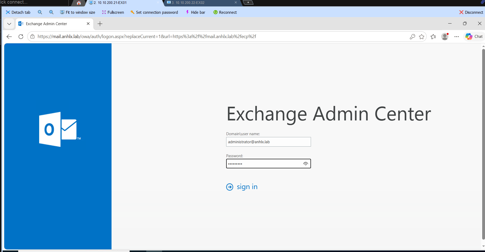

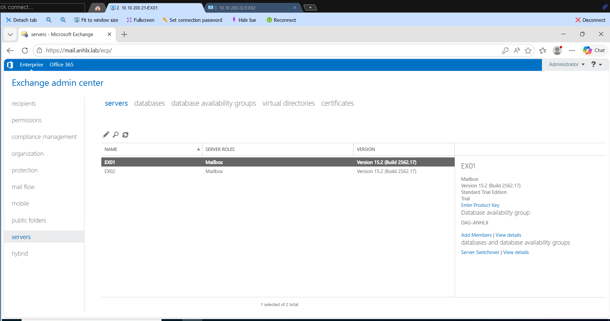

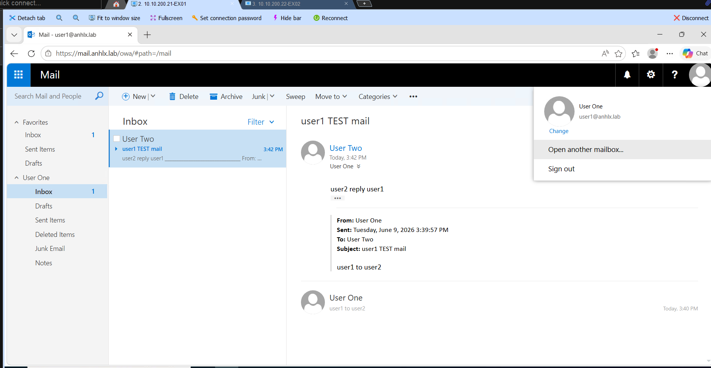

## Mục lục
- [1. Topology & IP Plan](#1-topology--ip-plan)
- [2. Active Directory — DC01 & DC02](#2-active-directory--dc01--dc02)
- [3. Cài Exchange Server SE](#3-cài-exchange-server-se)
- [4. Cấu hình DAG](#4-cấu-hình-dag)
- [5. Mailbox Database & DAG Copies](#5-mailbox-database--dag-copies)
- [6. Virtual Directories & Certificate](#6-virtual-directories--certificate)
- [7. HAProxy Pair — LB01 & LB02](#7-haproxy-pair--lb01--lb02)
- [8. Tạo Mailbox & Test Mail Flow](#8-tạo-mailbox--test-mail-flow)
- [9. Test DAG Failover](#9-test-dag-failover)
- [Lời kết](#lời-kết)

---

### 1. Topology & IP Plan

Mình dùng 6 VM trên ESXi, tất cả trong VLAN 200 (`10.10.200.0/24`).

| VM | Hostname | IP | Role | vCPU | RAM | Disk |
|----|----------|-----|------|------|-----|------|
| 1 | DC01 | 10.10.200.11 | Primary DC, DNS, FSMO, ADCS | 8 | 8GB | C: 200GB · E: 500GB |
| 2 | DC02 | 10.10.200.12 | Secondary DC, DNS, DAG FSW | 8 | 8GB | C: 200GB · E: 500GB (DAG FSW) |
| 3 | EX01 | 10.10.200.21 | Exchange Mailbox — DAG member 1 | 8 | 16GB | C: 200GB · E: 500GB (Mail Data) |
| 4 | EX02 | 10.10.200.22 | Exchange Mailbox — DAG member 2 | 8 | 16GB | C: 200GB · E: 500GB (Mail Data) |
| 5 | LB01 | 10.10.200.31 | Ubuntu 24.04, HAProxy + Keepalived MASTER | 1 | 1GB | 100GB |
| 6 | LB02 | 10.10.200.32 | Ubuntu 24.04, HAProxy + Keepalived BACKUP | 1 | 1GB | 100GB |

```
VIP     : 10.10.200.50  →  mail.anhlx.lab  (Keepalived quản lý, nằm trên LB01 khi healthy)
LB pair : LB01 MASTER (priority 100) ←keepalived→ LB02 BACKUP (priority 90)
DAG     : EX01 + EX02
FSW     : \\DC02\DAG-Witness
MBDB01  : active=EX01, passive=EX02  →  user1@anhlx.lab
MBDB02  : active=EX02, passive=EX01  →  user2@anhlx.lab
```

**DAG quorum:** EX01(1 vote) + EX02(1 vote) + FSW on DC02(1 vote) = 3 phiếu. Cần 2 để duy trì quorum — khi EX01 down, EX02 + FSW = 2/3, DAG vẫn active.

---

### 2. Active Directory — DC01 & DC02

#### 2.1 Cài AD DS trên DC01

Mình cài AD DS và DNS, tạo forest mới `anhlx.lab` với Forest/Domain functional level Windows Server 2016 — đây là mức tối thiểu Exchange Server SE yêu cầu.

>  Đặt IP tĩnh `10.10.200.11`, DNS trỏ về `127.0.0.1` trước khi promote.

```powershell
Install-WindowsFeature AD-Domain-Services, DNS -IncludeManagementTools

Install-ADDSForest `
  -DomainName "anhlx.lab" `
  -DomainNetbiosName "ANHLX" `
  -ForestMode "WinThreshold" `
  -DomainMode "WinThreshold" `
  -InstallDns `
  -SafeModeAdministratorPassword (ConvertTo-SecureString "<SafeModePassword>" -AsPlainText -Force) `
  -Force
```

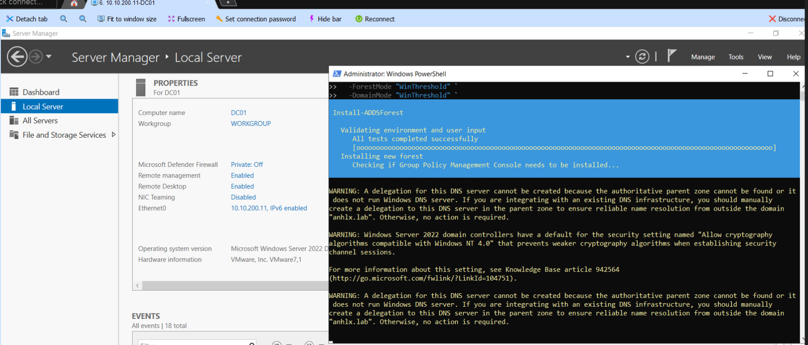

Server tự reboot sau khi promote. Sau khi boot xong, mình set DNS forwarder để DC01 resolve được tên ngoài internet.

```powershell
Add-DnsServerForwarder -IPAddress "8.8.8.8" -PassThru
```

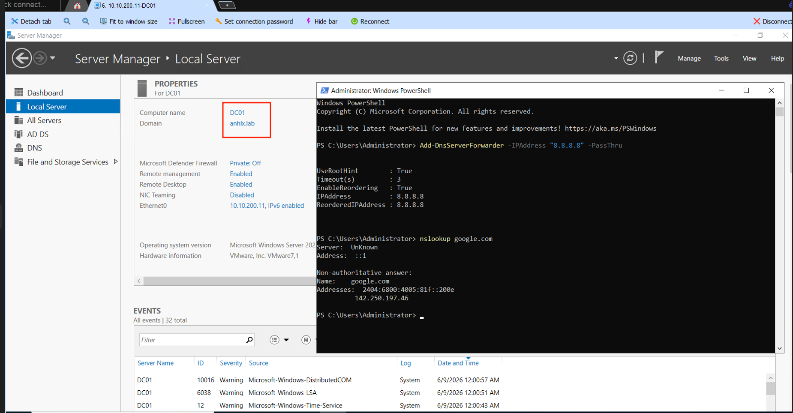

#### 2.2 Cài ADCS trên DC01

Mình dựng internal CA để issue certificate cho Exchange — tránh dùng self-signed khi test Outlook client kết nối.

```powershell
Install-WindowsFeature ADCS-Cert-Authority, ADCS-Web-Enrollment -IncludeManagementTools

Install-AdcsCertificationAuthority `
  -CAType EnterpriseRootCa `
  -CaCommonName "ANHLX-CA" `
  -KeyLength 2048 `
  -HashAlgorithmName SHA256 `
  -ValidityPeriod Years `
  -ValidityPeriodUnits 10 `
  -Force

Install-AdcsWebEnrollment -Force
```

#### 2.3 Thêm DNS record cho Exchange namespace

Mình tạo DNS A record trỏ về VIP `10.10.200.50` — HAProxy sẽ nhận traffic và forward vào Exchange.

```powershell
Add-DnsServerResourceRecordA -ZoneName "anhlx.lab" -Name "mail"         -IPv4Address "10.10.200.50"
Add-DnsServerResourceRecordA -ZoneName "anhlx.lab" -Name "autodiscover" -IPv4Address "10.10.200.50"
```

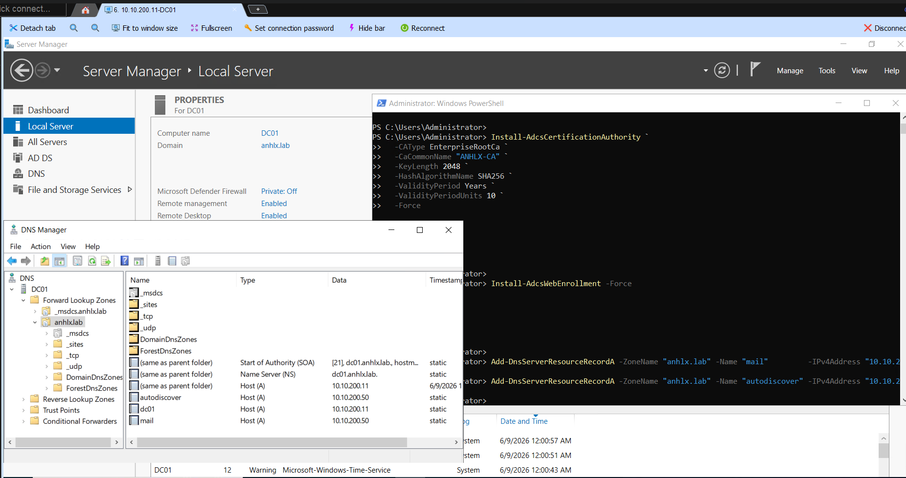

#### 2.4 Promote DC02

Trên DC02, đặt IP tĩnh `10.10.200.12`, DNS trỏ về `10.10.200.11`, join domain `anhlx.lab`, sau đó promote thành DC phụ.

```powershell
Install-WindowsFeature AD-Domain-Services, DNS -IncludeManagementTools

Install-ADDSDomainController `
  -DomainName "anhlx.lab" `
  -InstallDns `
  -Credential (Get-Credential ANHLX\Administrator) `
  -SafeModeAdministratorPassword (ConvertTo-SecureString "<SafeModePassword>" -AsPlainText -Force) `
  -Force
```

Sau khi DC02 reboot, mình set DNS forwarder — forwarder không replicate từ DC01, phải set riêng.

```powershell
Add-DnsServerForwarder -IPAddress "8.8.8.8" -PassThru
```

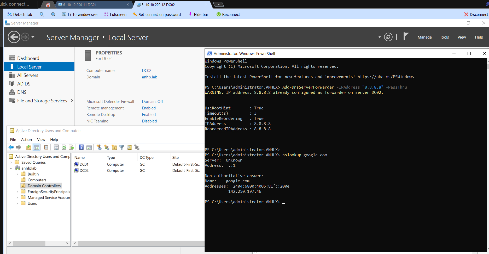

#### 2.5 Tạo FSW share trên DC02

DAG File Share Witness cần tồn tại trước khi tạo DAG. Ở bước này Exchange chưa được cài nên group `Exchange Trusted Subsystem` chưa có — mình grant cho `Domain Admins` trước. Sau khi Exchange được cài (bước 3.5), mình sẽ add `Exchange Trusted Subsystem` vào Administrators trên DC02 để DAG có thể tự quản lý FSW share.

```powershell
New-Item -Path "E:\DAG-Witness" -ItemType Directory
New-SmbShare -Name "DAG-Witness" -Path "E:\DAG-Witness" -FullAccess "ANHLX\Domain Admins"
```
---

### 3. Cài Exchange Server SE

Trên cả EX01 và EX02, đặt IP tĩnh, DNS trỏ về `10.10.200.11`, join domain `anhlx.lab` rồi reboot trước khi làm các bước bên dưới.

```powershell
Add-Computer -DomainName "anhlx.lab" -Credential (Get-Credential ANHLX\Administrator) -Restart -Force
```

#### 3.1 Prerequisites trên EX01 và EX02

Mình chạy lệnh sau trên cả hai Exchange server để cài đủ Windows feature — thiếu bất kỳ feature nào setup sẽ báo lỗi prereq.

```powershell
Install-WindowsFeature `
  Server-Media-Foundation, NET-Framework-45-Features, `
  RPC-over-HTTP-proxy, RSAT-Clustering, RSAT-Clustering-CmdInterface, `
  RSAT-Clustering-Mgmt, RSAT-Clustering-PowerShell, `
  WAS-Process-Model, Web-Asp-Net45, Web-Basic-Auth, Web-Client-Auth, `
  Web-Digest-Auth, Web-Dir-Browsing, Web-Dyn-Compression, `
  Web-Http-Errors, Web-Http-Logging, Web-Http-Redirect, Web-Http-Tracing, `
  Web-ISAPI-Ext, Web-ISAPI-Filter, Web-Lgcy-Mgmt-Console, Web-Metabase, `
  Web-Mgmt-Console, Web-Mgmt-Service, Web-Net-Ext45, Web-Request-Monitor, `
  Web-Server, Web-Stat-Compression, Web-Static-Content, Web-Windows-Auth, `
  Web-WMI, Windows-Identity-Foundation, RSAT-ADDS-Tools `
  -IncludeManagementTools
```

Reboot sau khi cài feature. Tiếp theo cài thêm 4 gói prereq sau — Exchange SE yêu cầu đủ cả bốn, thiếu bất kỳ gói nào setup sẽ báo lỗi prereq.

| Gói | Download |
|-----|----------|
| Visual C++ 2012 x64 | [microsoft.com/download/details.aspx?id=30679](https://www.microsoft.com/en-us/download/details.aspx?id=30679) |
| Visual C++ 2013 x64 | [microsoft.com/download/details.aspx?id=40784](https://www.microsoft.com/en-us/download/details.aspx?id=40784) |
| UCMA 4.0 Runtime | [microsoft.com/download/details.aspx?id=34992](https://www.microsoft.com/en-us/download/details.aspx?id=34992) |
| IIS URL Rewrite Module | [iis.net/downloads/microsoft/url-rewrite](https://www.iis.net/downloads/microsoft/url-rewrite) |

Cài silent trên cả EX01 và EX02:

```cmd
.\vcredist_x64_2012.exe /quiet /norestart
.\vcredist_x64_2013.exe /quiet /norestart
.\UcmaRuntimeSetup.exe /quiet /norestart
.\rewrite_amd64_en-US.msi /quiet /norestart
```

#### 3.2 Extend AD Schema — chạy trên EX01

Mình mount ISO Exchange SE, chạy 3 lệnh PrepareSchema/PrepareAD/PrepareDomain từ EX01 với tài khoản thuộc Schema Admins và Enterprise Admins. Bước này chỉ cần chạy một lần cho toàn forest.

```cmd
D:\Setup.exe /PrepareSchema /IAcceptExchangeServerLicenseTerms_DiagnosticDataOFF
D:\Setup.exe /PrepareAD /OrganizationName:"ANHLX" /IAcceptExchangeServerLicenseTerms_DiagnosticDataOFF
D:\Setup.exe /PrepareDomain /IAcceptExchangeServerLicenseTerms_DiagnosticDataOFF
```

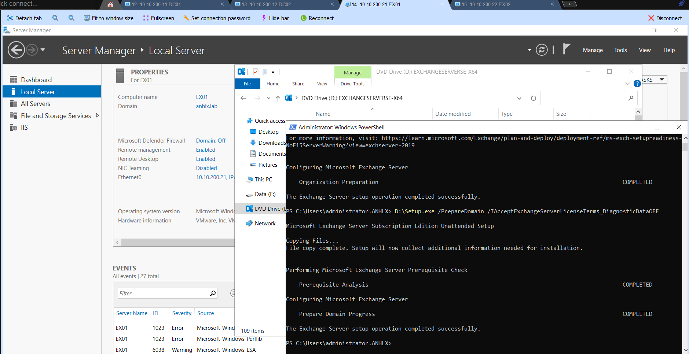

Chờ AD replication lan sang DC02 (vài phút) trước khi bước sang cài Exchange. Kiểm tra replication đã xong chưa:

```cmd
repadmin /replsummary
```

Kết quả sạch khi cột `Fails` = `0` trên cả hai DC. Nếu muốn force sync ngay không cần chờ:

```cmd
repadmin /syncall /AdeP
```

#### 3.3 Cài Exchange SE trên EX01

```cmd
D:\Setup.exe /Mode:Install /Role:Mailbox /IAcceptExchangeServerLicenseTerms_DiagnosticDataOFF
```

Quá trình cài mất khoảng 30–45 phút. Sau khi hoàn tất, reboot EX01 theo yêu cầu của setup.

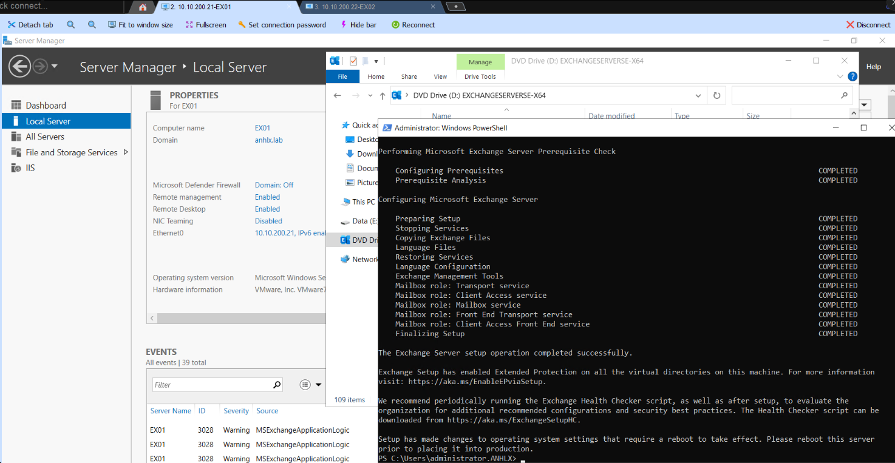

Sau khi reboot, Exchange Management Shell và Exchange Admin Center (EAC) sẵn sàng tại  `https://EX01/ecp`.

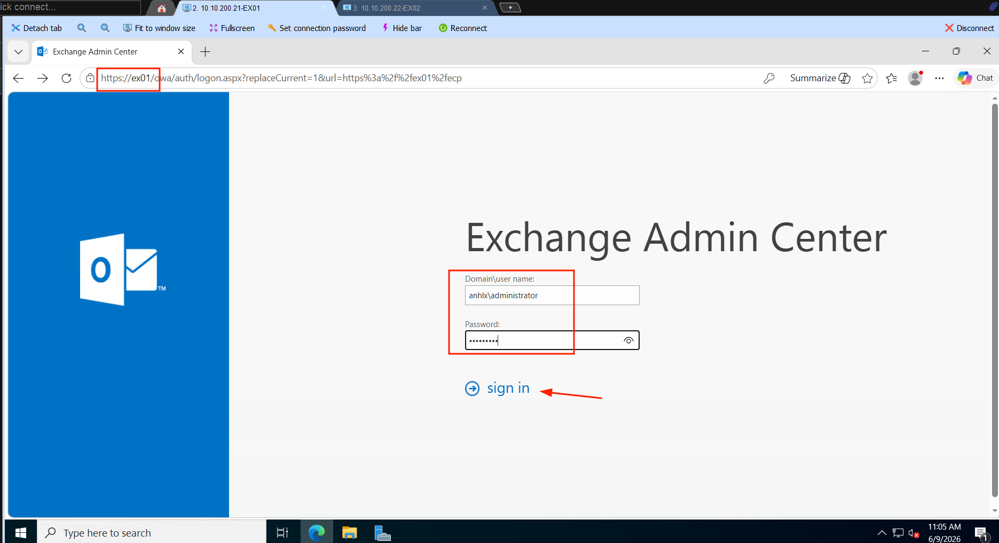

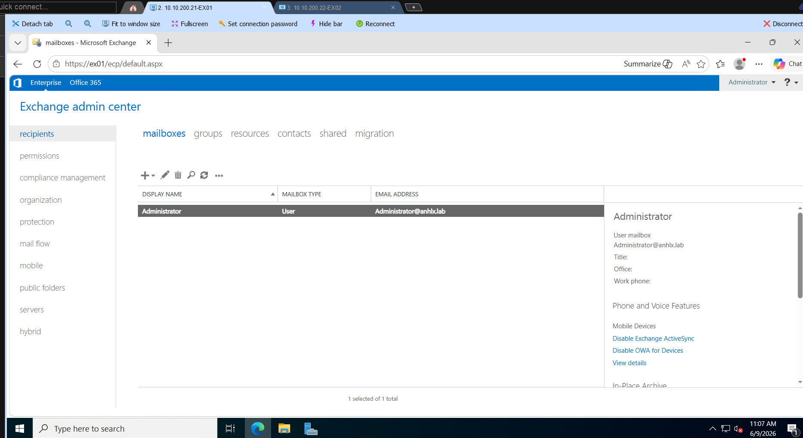

#### 3.4 Cài Exchange SE trên EX02

Lặp lại bước 3.3 trên EX02. Đảm bảo EX02 đã join domain `anhlx.lab` và DNS trỏ về DC01/DC02.

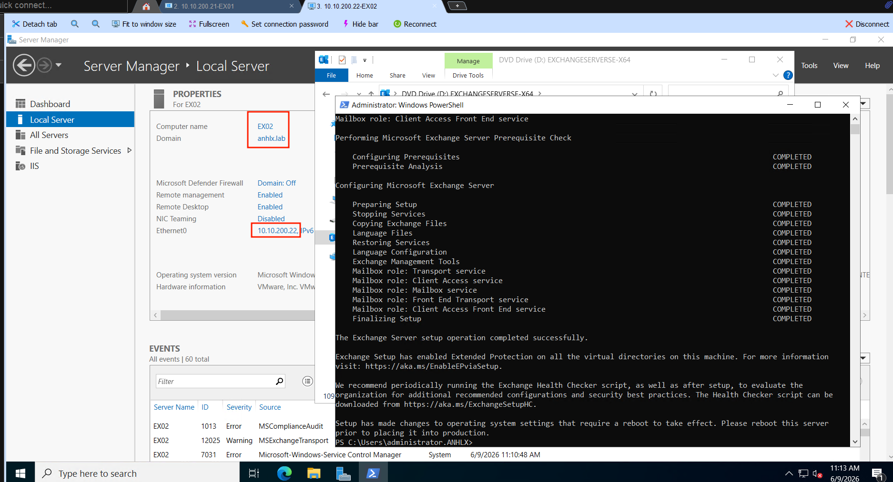

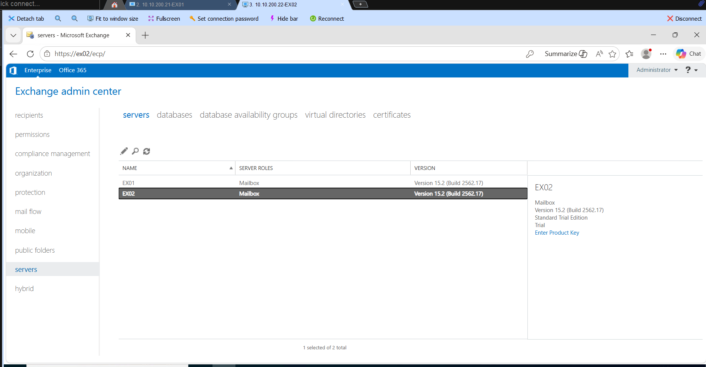

#### 3.5 Grant Exchange Trusted Subsystem quyền trên DC02

Group `Exchange Trusted Subsystem` được tạo trong AD ở bước PrepareAD — Exchange dùng group này để tự quản lý FSW share trên witness server. Mình add group này vào Administrators trên DC02 trước khi tạo DAG, nếu không `New-DatabaseAvailabilityGroup` sẽ báo "Access is denied" khi cố setup witness.

```powershell
# Chạy trên DC01 hoặc DC02
Add-ADGroupMember -Identity "Administrators" -Members "Exchange Trusted Subsystem"
```

---

### 4. Cấu hình DAG

#### 4.1 Tạo DAG

Mình tạo DAG từ Exchange Management Shell trên EX01. `DatabaseAvailabilityGroupIpAddresses 0.0.0.0` tạo **IP-less DAG** — Windows Failover Cluster không tạo network name resource và không cần IP riêng cho cluster. Đây là cách được Microsoft recommend cho Exchange 2016/2019 khi tất cả DAG member nằm cùng subnet.

> **Lưu ý:** Trong suốt quá trình cấu hình DAG, Exchange sẽ hiển thị WARNING *"Network name 'DAG-ANHLX' is not online"* — đây là expected behavior với IP-less DAG, không phải lỗi. DAG replication và failover vẫn hoạt động bình thường.

```powershell
New-DatabaseAvailabilityGroup `
  -Name DAG-ANHLX `
  -WitnessServer DC02 `
  -WitnessDirectory "E:\DAG-Witness" `
  -DatabaseAvailabilityGroupIpAddresses 0.0.0.0
```

#### 4.2 Add member vào DAG

```powershell
Add-DatabaseAvailabilityGroupServer -Identity DAG-ANHLX -MailboxServer EX01
Add-DatabaseAvailabilityGroupServer -Identity DAG-ANHLX -MailboxServer EX02
```

Restart Information Store — sau khi add server vào DAG. Cần restart trên cả hai:

```powershell
# Chạy trên EX01
Restart-Service MSExchangeIS

# Chạy trên EX02
Restart-Service MSExchangeIS
```

Kiểm tra DAG đã có đủ 2 member và FSW đúng chỗ:

```powershell
Get-DatabaseAvailabilityGroup DAG-ANHLX | Select Name, Servers, WitnessServer, WitnessDirectory
```

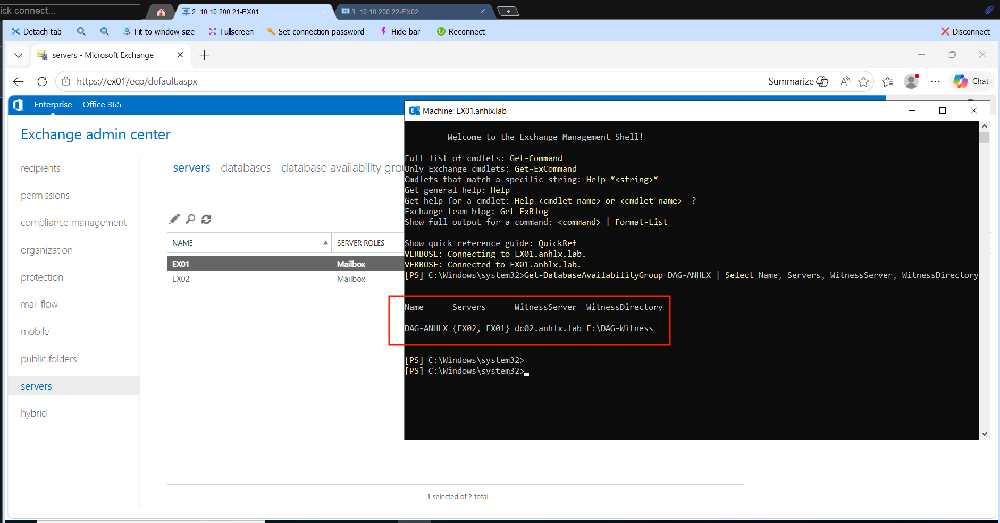

#### 4.3 Bật DAG Network Compression

Mình bật compression để giảm băng thông replication giữa hai Exchange server.

```powershell
Set-DatabaseAvailabilityGroup DAG-ANHLX -NetworkCompression Enabled
```

---

### 5. Mailbox Database & DAG Copies

#### 5.1 Tạo Mailbox Database

Exchange tạo một database mặc định khi cài. Mình tạo thêm MBDB01 trên EX01 và MBDB02 trên EX02, lưu trên disk E: — mỗi database chứa mailbox của một user khác nhau, để khi user1 gửi cho user2, mail thật sự đi qua Transport Service trên cả hai server.

```powershell
New-MailboxDatabase -Name MBDB01 -Server EX01 `
  -EdbFilePath "E:\MailData\MBDB01\MBDB01.edb" `
  -LogFolderPath "E:\MailData\MBDB01\Logs"

New-MailboxDatabase -Name MBDB02 -Server EX02 `
  -EdbFilePath "E:\MailData\MBDB02\MBDB02.edb" `
  -LogFolderPath "E:\MailData\MBDB02\Logs"
```

Restart Information Store trên cả hai server trước khi mount — Exchange yêu cầu sau khi tạo database mới.

```powershell
# Chạy trên EX01
Restart-Service MSExchangeIS

# Chạy trên EX02
Restart-Service MSExchangeIS
```

```powershell
Mount-Database MBDB01
Mount-Database MBDB02
```

#### 5.2 Thêm Database Copy vào DAG

Mỗi database có 2 bản sao — active trên 1 server, passive trên server còn lại. `ActivationPreference 2` nghĩa là copy này chỉ lên active khi copy có preference 1 không available.

```powershell
# MBDB01: active EX01, passive EX02
Add-MailboxDatabaseCopy -Identity MBDB01 -MailboxServer EX02 -ActivationPreference 2

# MBDB02: active EX02, passive EX01
Add-MailboxDatabaseCopy -Identity MBDB02 -MailboxServer EX01 -ActivationPreference 2
```

Restart Information Store trên cả hai server sau khi add DAG copy. Lưu ý: restart IS sẽ khiến DAG tự failover các database — sau đó cần move lại về đúng server preferred.

```powershell
# Chạy trên EX01
Restart-Service MSExchangeIS

# Chạy trên EX02
Restart-Service MSExchangeIS
```

Restore active copy về đúng vị trí preferred:

```powershell
Move-ActiveMailboxDatabase MBDB01 -ActivateOnServer EX01 -Confirm:$false
Move-ActiveMailboxDatabase MBDB02 -ActivateOnServer EX02 -Confirm:$false
```

#### 5.3 Kiểm tra replication

```powershell
Get-MailboxDatabaseCopyStatus * | Select Name, Status, CopyQueueLength, ReplayQueueLength | Format-Table -AutoSize
```

Kết quả mong muốn: `MBDB01\EX01` = `Mounted`, `MBDB01\EX02` = `Healthy`, `MBDB02\EX02` = `Mounted`, `MBDB02\EX01` = `Healthy`, queue = `0`.

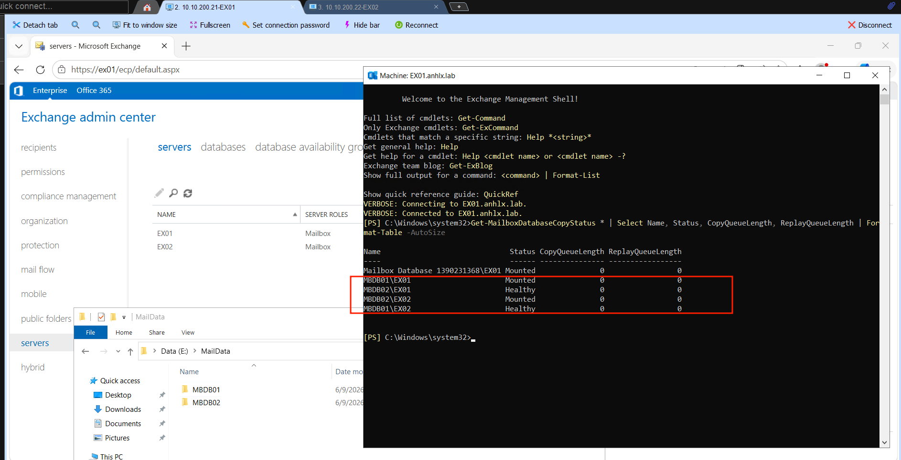

---

### 6. Virtual Directories & Certificate

#### 6.1 Cấu hình Virtual Directories

Mình set Internal và External URL cho tất cả virtual directory trên cả hai server trỏ về namespace chung `mail.anhlx.lab` — đây là điều kiện để Autodiscover hoạt động đúng khi client kết nối qua VIP.

```powershell
# Chạy trên EX01, sau đó đổi $server = "EX02" và chạy lại
$server    = "EX01"
$namespace = "mail.anhlx.lab"

Set-OwaVirtualDirectory "$server\OWA (Default Web Site)" `
  -InternalUrl "https://$namespace/owa" -ExternalUrl "https://$namespace/owa"

Set-EcpVirtualDirectory "$server\ECP (Default Web Site)" `
  -InternalUrl "https://$namespace/ecp" -ExternalUrl "https://$namespace/ecp"

Set-ActiveSyncVirtualDirectory "$server\Microsoft-Server-ActiveSync (Default Web Site)" `
  -InternalUrl  "https://$namespace/Microsoft-Server-ActiveSync" `
  -ExternalUrl  "https://$namespace/Microsoft-Server-ActiveSync"

Set-OabVirtualDirectory "$server\OAB (Default Web Site)" `
  -InternalUrl "https://$namespace/OAB" -ExternalUrl "https://$namespace/OAB"

Set-WebServicesVirtualDirectory "$server\EWS (Default Web Site)" `
  -InternalUrl "https://$namespace/EWS/Exchange.asmx" `
  -ExternalUrl "https://$namespace/EWS/Exchange.asmx"

Set-ClientAccessService -Identity $server `
  -AutoDiscoverServiceInternalUri "https://autodiscover.anhlx.lab/Autodiscover/Autodiscover.xml"
```

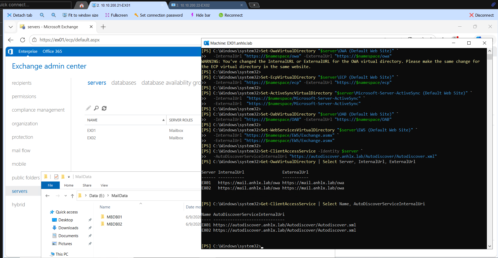

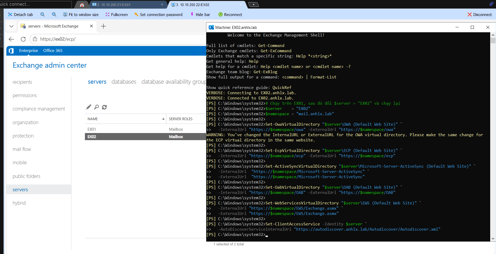

#### 6.2 Request Certificate từ Internal CA

Mình tạo certificate request trên EX01 với SAN cover đủ các tên Exchange cần — thiếu SAN nào Outlook sẽ báo cert warning.

```powershell
New-Item -Path "C:\Temp" -ItemType Directory -Force

$req = New-ExchangeCertificate -GenerateRequest `
  -SubjectName "CN=mail.anhlx.lab,O=ANHLX,C=VN" `
  -DomainName "mail.anhlx.lab","autodiscover.anhlx.lab","EX01.anhlx.lab","EX02.anhlx.lab" `
  -PrivateKeyExportable $true `
  -FriendlyName "Exchange-SSL"

Set-Content -Path "C:\Temp\exchange_cert.req" -Value $req
```

Submit file `exchange_cert.req` lên `http://DC01.anhlx.lab/certsrv` → **Request a certificate** → **Advanced certificate request** → paste nội dung file .req → chọn template **Web Server** → download cert dạng Base64.

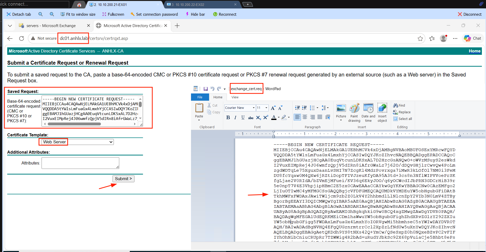

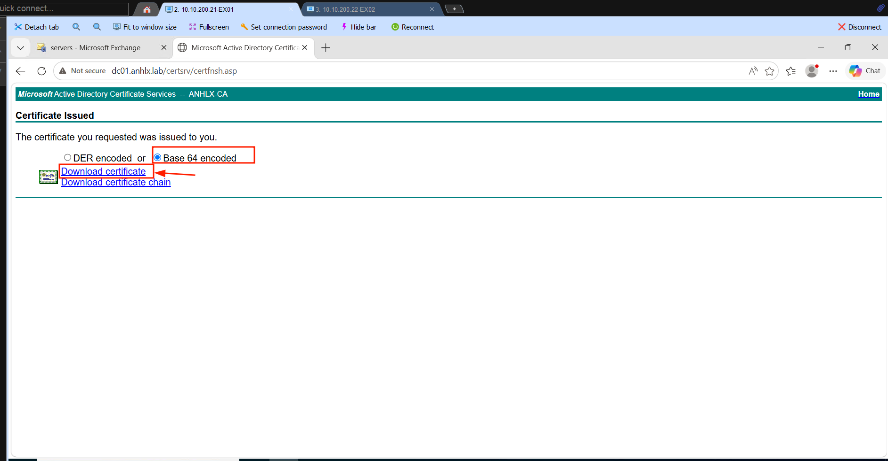

```powershell
# Import cert đã download từ CA
$certData = [System.IO.File]::ReadAllBytes("C:\Temp\certnew.cer")
Import-ExchangeCertificate -FileData $certData

# Lấy thumbprint của cert vừa import
Get-ExchangeCertificate | Where { $_.FriendlyName -eq "Exchange-SSL" } | Select Thumbprint, Subject

# Bind cert vào IIS và SMTP
Enable-ExchangeCertificate -Thumbprint "<thumbprint>" -Services IIS,SMTP

# Check
Get-ExchangeCertificate | Select Thumbprint, Services, Subject, NotAfter | Format-Table -AutoSize
```

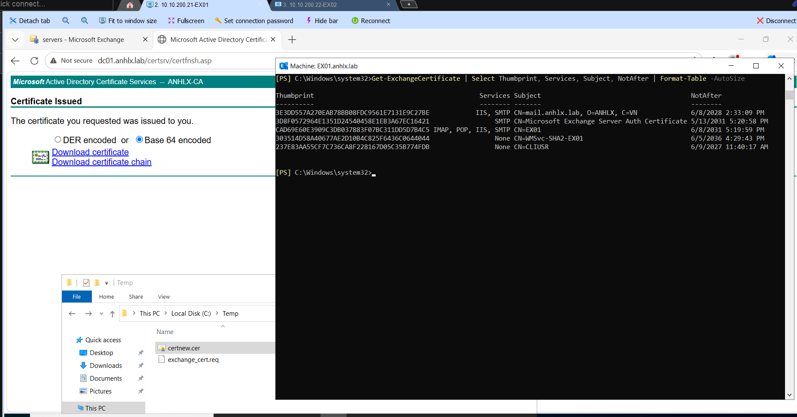

Trên EX02, mình export cert từ EX01 (cert có `PrivateKeyExportable = $true`) rồi import lên:

```powershell
# Trên EX01 — export
$pfx = Export-ExchangeCertificate `
  -Thumbprint "<thumbprint>" `
  -BinaryEncoded:$true `
  -Password (ConvertTo-SecureString "P@ssw0rd" `
  -AsPlainText -Force)

[System.IO.File]::WriteAllBytes("C:\Temp\exchange_cert.pfx", $pfx.FileData)
```

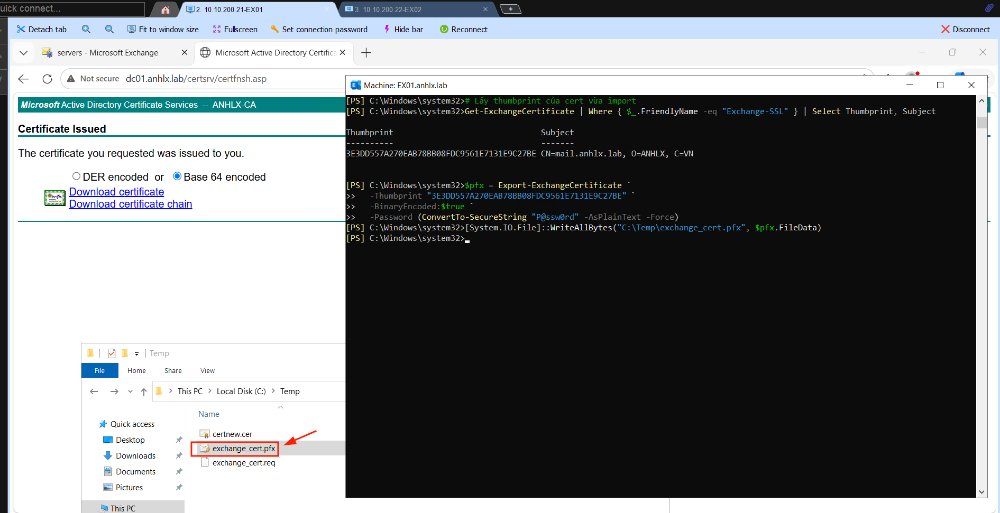

Copy file `C:\Temp\exchange_cert.pfx` sang EX02, sau đó trên EX02:

```powershell
# Trên EX02 — import và bind
Import-ExchangeCertificate -FileData ([System.IO.File]::ReadAllBytes("C:\Temp\exchange_cert.pfx")) `
  -Password (ConvertTo-SecureString "P@ssw0rd" `
  -AsPlainText -Force)

# Lấy thumbprint vừa import
Get-ExchangeCertificate | Where { $_.FriendlyName -eq "Exchange-SSL" } | Select Thumbprint

Enable-ExchangeCertificate -Thumbprint "<thumbprint>" -Services IIS,SMTP
```

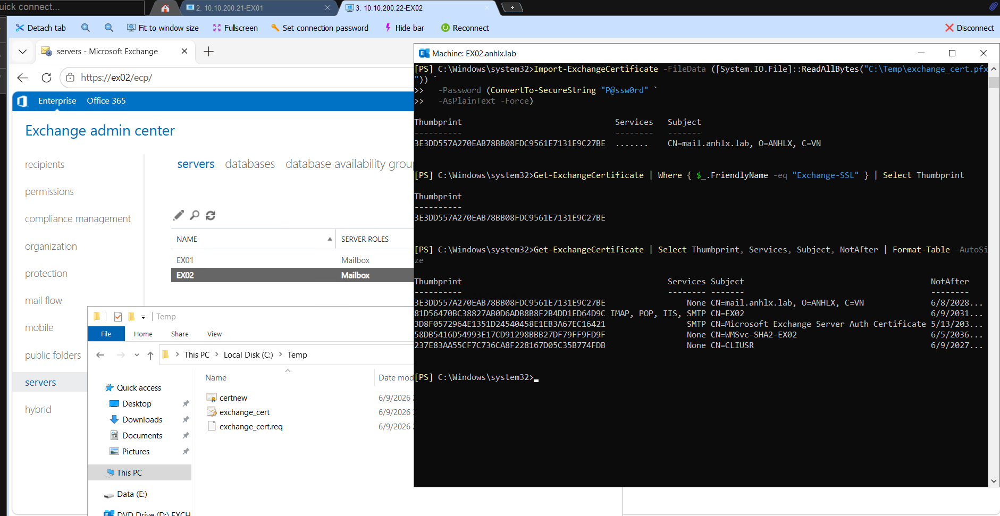

---

### 7. HAProxy Pair — LB01 & LB02

#### 7.1 Cài HAProxy + Keepalived

Mình cài trên cả hai LB01 và LB02 — cùng một lệnh.

```bash
apt update && apt install -y haproxy keepalived
```

#### 7.2 Cấu hình HAProxy (chạy trên cả LB01 và LB02 — config giống nhau)

Mình dùng mode `tcp` (Layer 4) — Exchange dùng Kerberos authentication, nếu dùng Layer 7 SSL termination sẽ break token và Outlook liên tục bị yêu cầu đăng nhập lại.

HAProxy bind trên VIP `10.10.200.50` — cần bật `ip_nonlocal_bind` để LB02 (khi chưa có VIP) vẫn start được HAProxy mà không lỗi bind.

```bash
# Bật nonlocal bind trên cả hai LB
echo "net.ipv4.ip_nonlocal_bind=1" >> /etc/sysctl.conf
sysctl -p
```

```bash
cat > /etc/haproxy/haproxy.cfg << 'EOF'
global
    log /dev/log local0
    maxconn 4096

defaults
    log global
    mode tcp
    option tcplog
    timeout connect 5s
    timeout client  50s
    timeout server  50s

frontend exchange_https
    bind 10.10.200.50:443
    default_backend exchange_pool

frontend exchange_http
    bind 10.10.200.50:80
    default_backend exchange_http_pool

backend exchange_pool
    balance roundrobin
    option tcp-check
    server EX01 10.10.200.21:443 check inter 5s rise 2 fall 3
    server EX02 10.10.200.22:443 check inter 5s rise 2 fall 3

backend exchange_http_pool
    balance roundrobin
    server EX01 10.10.200.21:80 check inter 5s
    server EX02 10.10.200.22:80 check inter 5s

listen stats
    bind *:8080
    mode http
    stats enable
    stats uri /stats
    stats refresh 10s
    stats show-legends
EOF

systemctl restart haproxy
systemctl enable haproxy
```

Stats page: `http://10.10.200.31:8080/stats` (LB01) và `http://10.10.200.32:8080/stats` (LB02).

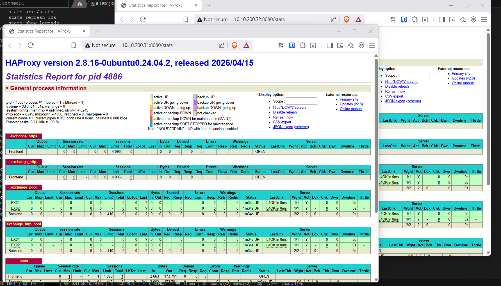

#### 7.3 Keepalived — LB01 (MASTER)

Keepalived quản lý VIP `10.10.200.50` bằng VRRP. LB01 là MASTER, priority 100. Nếu HAProxy trên LB01 chết, script trả về fail → priority tự giảm xuống 50 (100−50), thấp hơn LB02's 90 → LB02 lên MASTER và lấy VIP.

```bash
cat > /etc/keepalived/keepalived.conf << 'EOF'
global_defs {
  router_id LB01
}

vrrp_script chk_haproxy {
  script "systemctl is-active haproxy"
  interval 2
  weight -50
}

vrrp_instance VI_EXCHANGE {
  state MASTER
  interface ens160
  virtual_router_id 51
  priority 100
  advert_int 1
  authentication {
    auth_type PASS
    auth_pass <KeepalivedSecret>
  }
  virtual_ipaddress {
    10.10.200.50/24 dev ens160
  }
  track_script {
    chk_haproxy
  }
}
EOF

systemctl restart keepalived
systemctl enable keepalived
```

#### 7.4 Keepalived — LB02 (BACKUP)

```bash
cat > /etc/keepalived/keepalived.conf << 'EOF'
global_defs {
  router_id LB02
}

vrrp_script chk_haproxy {
  script "systemctl is-active haproxy"
  interval 2
  weight -50
}

vrrp_instance VI_EXCHANGE {
  state BACKUP
  interface ens160
  virtual_router_id 51
  priority 90
  advert_int 1
  authentication {
    auth_type PASS
    auth_pass <KeepalivedSecret>
  }
  virtual_ipaddress {
    10.10.200.50/24 dev ens160
  }
  track_script {
    chk_haproxy
  }
}
EOF

systemctl restart keepalived
systemctl enable keepalived
```

#### 7.5 Kiểm tra VIP và test failover LB

Xác nhận LB01 đang giữ VIP:

```bash
ip addr show ens160 | grep "10.10.200.50"
```

Test failover — stop HAProxy trên LB01, Keepalived phát hiện sau 2 giây và chuyển VIP sang LB02:

```bash
# Trên LB01
systemctl stop haproxy

# Trên LB02 — kiểm tra sau ~3 giây
ip addr show ens160 | grep "10.10.200.50"
```

LB02 phải hiển thị `inet 10.10.200.50/24`. Truy cập `https://mail.anhlx.lab/owa` vẫn hoạt động — Keepalived đã chuyển VIP trong suốt quá trình.

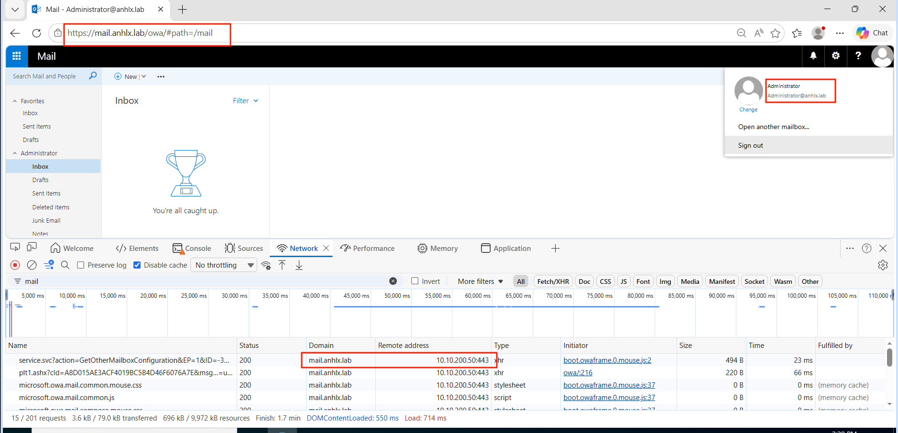

---

### 8. Tạo Mailbox & Test Mail Flow

#### 8.1 Tạo mailbox

Mình tạo user1 trên MBDB01 (active EX01) và user2 trên MBDB02 (active EX02) — hai mailbox nằm trên hai server khác nhau để mail flow thật sự đi qua Transport Service của cả hai.

```powershell
New-Mailbox -UserPrincipalName user1@anhlx.lab -Alias user1 `
  -Name "User One" -FirstName "User" -LastName "One" `
  -Password (ConvertTo-SecureString "<Password>" -AsPlainText -Force) `
  -ResetPasswordOnNextLogon $false `
  -Database MBDB01

New-Mailbox -UserPrincipalName user2@anhlx.lab -Alias user2 `
  -Name "User Two" -FirstName "User" -LastName "Two" `
  -Password (ConvertTo-SecureString "<Password>" -AsPlainText -Force) `
  -ResetPasswordOnNextLogon $false `
  -Database MBDB02
```

#### 8.2 Gửi nhận mail qua OWA

Trỏ browser đến `https://mail.anhlx.lab/owa`, login `user1@anhlx.lab` → New message → gửi cho `user2@anhlx.lab`. Login user2 để confirm nhận được, reply lại.

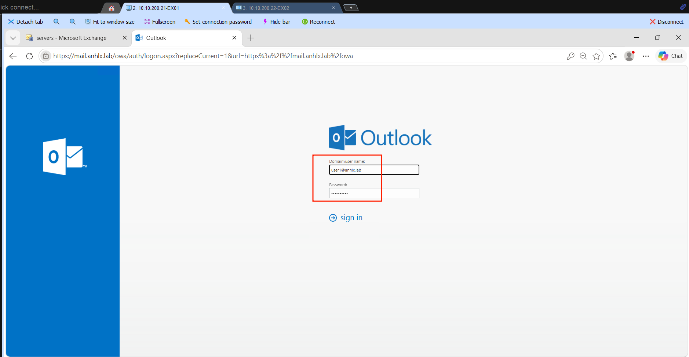

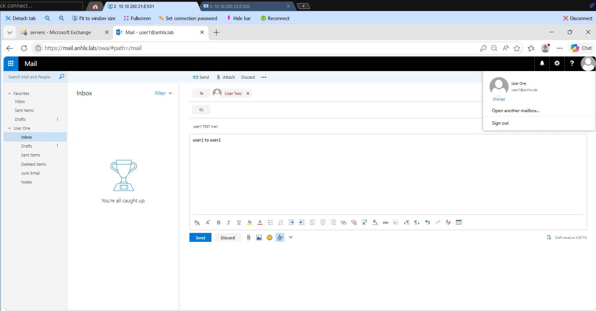

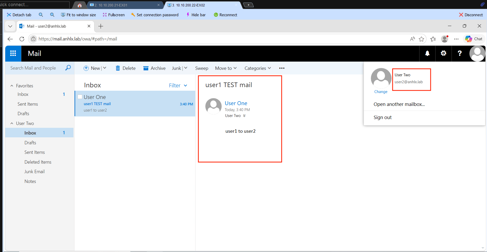

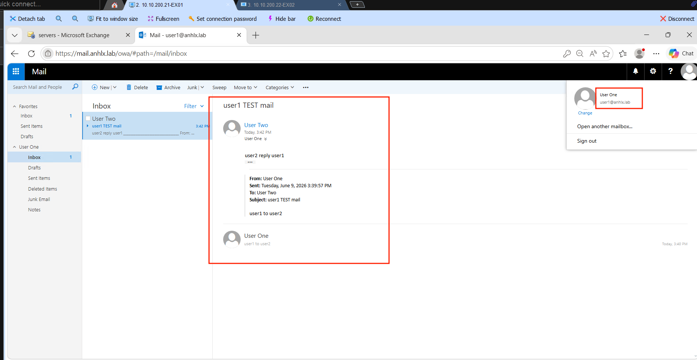

**Luồng mail qua các thành phần Exchange:**

```
[OWA user1] ──HTTPS──► VIP 10.10.200.50 ──► HAProxy ──► EX01
                                                           │
                                               [Client Access Front End]
                                               nhận HTTPS, proxy vào backend
                                                           │
                                               [Mailbox Backend — EX01]
                                               OWA submit mail vào Outbox
                                                           │
                                               [Mailbox Transport Submission]
                                               lấy mail từ Outbox → Transport pipeline
                                                           │
                                               [Transport Service + Categorizer]
                                               lookup recipient → user2 ∈ MBDB02 on EX02
                                                           │
                                                          ▼
                                                         EX02
                                               [Mailbox Transport Delivery]
                                               deliver mail vào MBDB02
                                                           │
                                               [user2 nhận notification OWA]
```

#### 8.3 Message Tracking

Mình trace mail để thấy từng event trong Transport pipeline — `SUBMIT`, `RECEIVE`, `DELIVER`.

```powershell
Get-MessageTrackingLog `
  -Sender "user1@anhlx.lab" `
  -Start (Get-Date).AddHours(-1) |
  Select Timestamp, EventId, Source, ServerHostname, MessageSubject, Recipients |
  Format-Table -AutoSize
```

Chú ý các event trong output:
- `RECEIVE` trên EX01 — transport nhận mail từ mailbox store của user1
- `SUBMIT` trên EX02 — cross-server submission, Exchange route sang EX02 để deliver
- `HARECEIVE` / `HADISCARD` trên EX01 — DAG shadow copy events, xác nhận replication đang hoạt động

Event `DELIVER` nằm trên EX02 — chạy thêm lệnh sau trên EX02 để thấy:

```powershell
# Chạy trên EX02
Get-MessageTrackingLog `
  -EventId DELIVER `
  -Start (Get-Date).AddHours(-1) |
  Select Timestamp, EventId, Source, ServerHostname, MessageSubject, Recipients |
  Format-Table -AutoSize
```

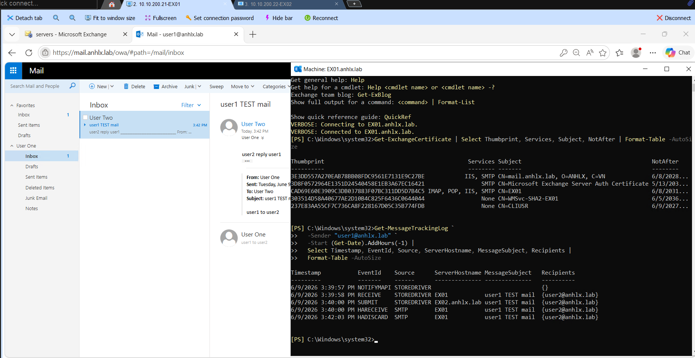

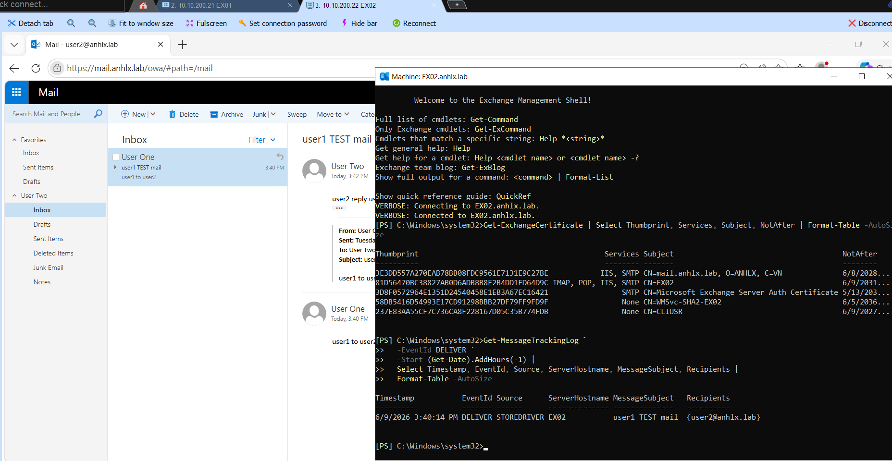

---

### 9. Test DAG Failover

#### 9.1 Kiểm tra trạng thái trước khi test

```powershell
Get-MailboxDatabaseCopyStatus * | Select Name, Status, ActiveCopy | Format-Table -AutoSize
```

Kết quả ban đầu: `MBDB01\EX01` = `Mounted`, `MBDB02\EX02` = `Mounted` — active copy đúng server preferred; passive copies `Healthy`, queue = `0`.

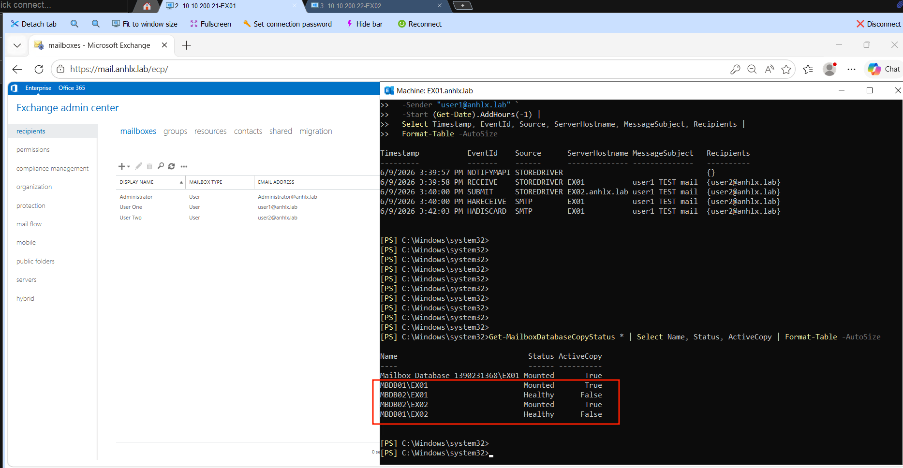

#### 9.2 Shutdown EX01

Tắt VM EX01 từ ESXi console. Chờ khoảng 30–60 giây để DAG phát hiện node down và trigger failover tự động.

#### 9.3 Xác nhận failover

```powershell
# Chạy trên EX02
Get-MailboxDatabaseCopyStatus * | Select Name, Status | Format-Table -AutoSize
```

Kết quả mong muốn: `MBDB01\EX02` đã đổi từ `Healthy` → `Mounted` — database failover thành công.

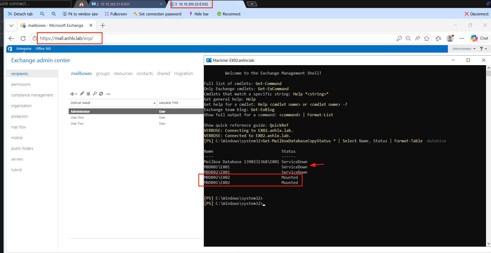

Mình mở OWA `https://mail.anhlx.lab/owa`, login `user1@anhlx.lab` — vẫn vào được bình thường. HAProxy đã tự remove EX01 khỏi pool sau 3 lần tcp-check fail liên tiếp (`fall 3`), toàn bộ traffic chuyển sang EX02.

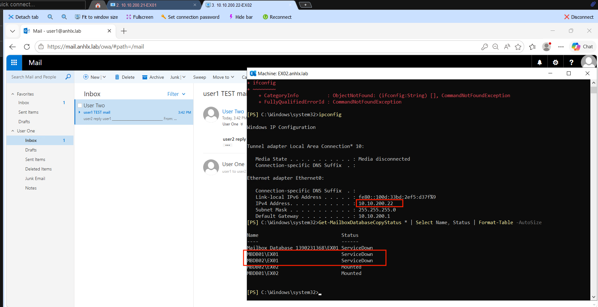

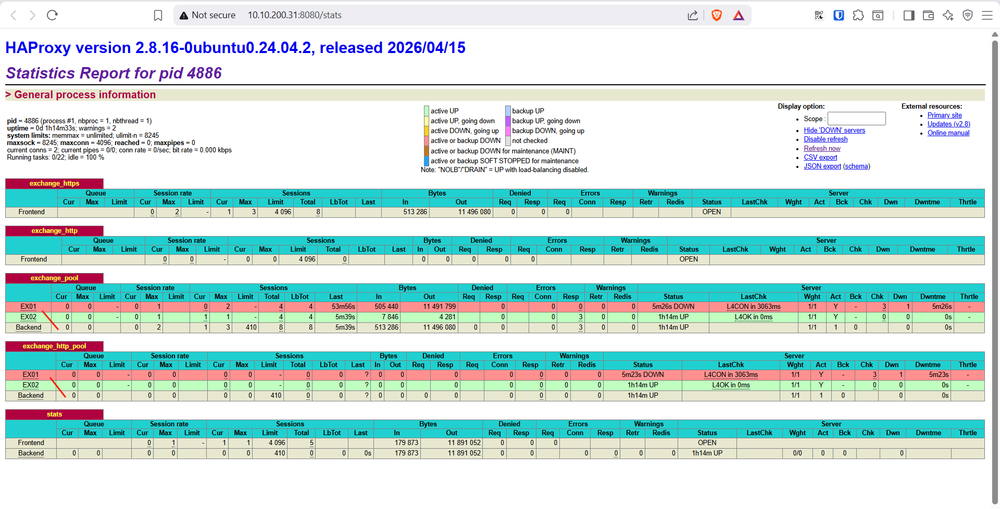

#### 9.4 Bật lại EX01 — kiểm tra resync

Sau khi start lại EX01, DAG tự đồng bộ transaction log còn thiếu. Theo dõi quá trình catch-up:

```powershell
Get-MailboxDatabaseCopyStatus MBDB01\EX01 | Select Status, CopyQueueLength, ReplayQueueLength
```

Khi cả `CopyQueueLength` lẫn `ReplayQueueLength` về `0` là EX01 đã sync hoàn toàn, status trở về `Healthy`. HAProxy tự add EX01 trở lại pool sau 2 lần tcp-check thành công liên tiếp (`rise 2`).

> **Lưu ý:** DAG **không tự failback** — sau khi EX01 recover, MBDB01 vẫn active trên EX02 (nơi nó đã failover sang). Đây là thiết kế cố ý để tránh "bounce back" liên tục. Muốn restore placement ban đầu thì move thủ công:
> ```powershell
> Move-ActiveMailboxDatabase MBDB01 -ActivateOnServer EX01 -Confirm:$false
> Move-ActiveMailboxDatabase MBDB02 -ActivateOnServer EX02 -Confirm:$false
> ```

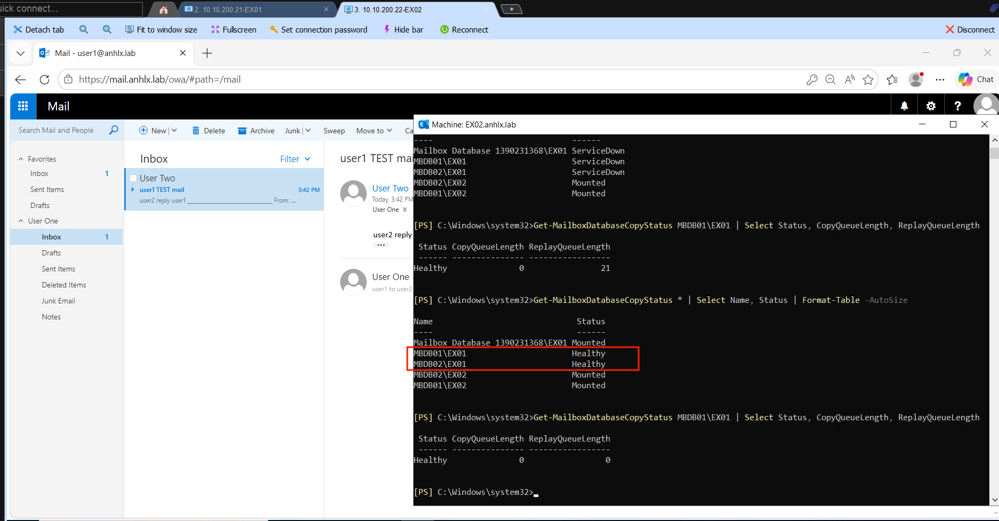

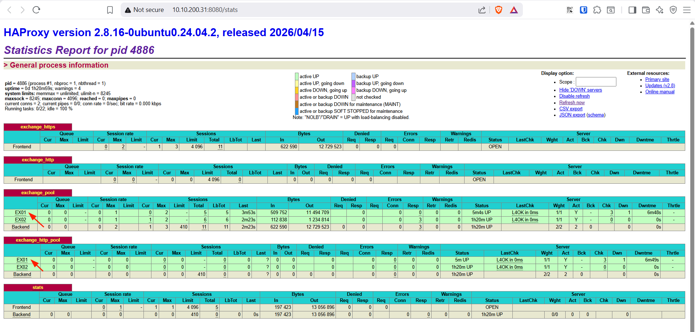

---

### Lời kết

Mình đã dựng xong Exchange Server SE on-premises với DAG 2 node, FSW trên DC02, HAProxy Layer 4 làm load balancer — đủ để POC và nghiên cứu các thành phần core của Exchange trong môi trường doanh nghiệp. Phần thú vị nhất là khi trace Message Tracking, thấy rõ mail từ user1 đi qua Transport Service trên EX01 rồi được deliver qua Mailbox Transport Delivery trên EX02, và DAG tự failover khi tắt EX01 mà OWA không bị gián đoạn. Bước tiếp theo có thể thêm Edge Transport Server vào DMZ để lab mail flow với internet, hoặc cấu hình Exchange Hybrid với Microsoft 365 để thực hành lộ trình migrate mailbox lên cloud.
