# Tích hợp Chatbot AI RAG vào Website 
- [Tích hợp Chatbot AI RAG vào Website](#tích-hợp-chatbot-ai-rag-vào-website)
    - [1. Giới thiệu](#1-giới-thiệu)
        - [1.1. LLM là gì?](#11-llm-là-gì)
        - [1.2. LLaMA 3 là gì?](#12-llama-3-là-gì)
        - [1.3. RAG là gì?](#13-rag-là-gì)
        - [1.4. Ollama là gì?](#14-ollama-là-gì)
        - [1.5. AnythingLLM là gì?](#15-anythingllm-là-gì)
    - [2. Cài đặt Docker và Docker-compose trên server Ubuntu 22.04](#2-cài-đặt-docker-và-docker-compose-trên-server-ubuntu-2204)
        - [2.1. Cài đặt Docker service](#21-cài-đặt-docker-service)
        - [2.2. Cài đặt Docker-compose](#22-cài-đặt-docker-compose)
    - [3. Sử dụng Ollama để tương tác với LLM](#3-sử-dụng-ollama-để-tương-tác-với-llm)
        - [3.1. Chạy Ollama với Docker-compose](#31-chạy-ollama-với-docker-compose)
        - [3.2. Sử dụng LLM Meta Llama 3 model (bản 4.7 GB) trên Ollama](#32-sử-dụng-llm-meta-llama-3-model-bản-47-gb-trên-ollama)
        - [3.3. Export và Import LLM model trên Ollama](#33-export-và-import-llm-model-trên-ollama)
    - [4. Sử dụng AnythingLLM](#4-sử-dụng-anythingllm)
        - [4.1. Chạy AnythingLLM với Docker-compose](#41-chạy-anythingllm-với-docker-compose)
        - [4.2. RAG Chat bot với AnythingLLM](#42-rag-chat-bot-với-anythingllm)
          - [Tạo và setup Workspace](#tạo-và-setup-workspace)
          - [Bổ sung các nguồn tài liệu cho chatbot](#bổ-sung-các-nguồn-tài-liệu-cho-chatbot)
        - [4.3. Tích hợp chatbot vào Website](#43-tích-hợp-chatbot-vào-website)


### 1. Giới thiệu 

Chatbot AI là một ứng dụng trí tuệ nhân tạo được thiết kế nhằm thực hiện các cuộc trò chuyện với con người. Dựa trên các thuật toán và xử lý ngôn ngữ tự nhiên (NLP), Chatbot AI có khả năng phản hồi câu hỏi, giải quyết vấn đề, thực hiện các tác vụ đơn giản, và cung cấp tư vấn về sản phẩm/dịch vụ, đóng vai trò quan trọng trong việc cung cấp thông tin và hỗ trợ khách hàng. 

Cùng với sự tiến bộ của công nghệ, Chatbot AI ngày càng được cải tiến với khả năng hiểu và đáp ứng các yêu cầu của người dùng, tạo ra trải nghiệm tương tác thông minh và thuận tiện.

<b>Ưu điểm : </b>
- Tiết kiệm chi phí: Chatbot AI có khả năng thấu hiểu đa ngôn ngữ, vì vậy bạn không cần phải bỏ ra quá nhiều chi phí nhân sự. Đồng thời, với khả năng làm việc không ngừng nghỉ, người trợ lý này có thể túc trực 24/7 nhằm giải đáp câu hỏi, cung cấp lời khuyên và hỗ trợ khách hàng trong quá trình mua sắm hoặc sử dụng sản phẩm/dịch vụ ở bất cứ khi nào và ở bất cứ nơi đâu.
- Tăng khả năng phản hồi: Như đã đề cập, Chatbot AI được lập trình tự động và hoạt động 24/7, vì vậy bạn không cần phải lo về khả năng bỏ lỡ tin nhắn. Người bạn này sẽ hỗ trợ bạn trong việc phản hồi khách hàng, giúp họ an tâm khi mua sắm hoặc sử dụng sản phẩm/dịch vụ của doanh nghiệp. 


##### 1.1. LLM là gì?

Các mô hình ngôn ngữ lớn (LLM - Large language model) là một loại mô hình ngôn ngữ được đào tạo bằng cách sử dụng các kỹ thuật học sâu trên tập dữ liệu văn bản khổng lồ. Các mô hình này có khả năng tạo văn bản tương tự như con người và thực hiện các tác vụ xử lý ngôn ngữ tự nhiên khác nhau.

Một mô hình ngôn ngữ có thể có độ phức tạp khác nhau, từ các mô hình n-gram đơn giản đến các mô hình mạng mô phỏng hệ thần kinh của con người vô cùng phức tạp. Tuy nhiên, thuật ngữ Large language model” thường dùng để chỉ các mô hình sử dụng kỹ thuật học sâu và có số lượng tham số lớn, có thể từ hàng tỷ đến hàng nghìn tỷ. Những mô hình này có thể phát hiện các quy luật phức tạp trong ngôn ngữ và tạo ra các văn bản y hệt con người.


##### 1.2. LLaMA 3 là gì?

LLaMA 3 là một mô hình ngôn ngữ lớn (LLM) được phát triển bởi Meta AI, nổi tiếng với khả năng tạo văn bản, dịch ngôn ngữ và viết các loại nội dung sáng tạo khác nhau.

##### 1.3. RAG là gì?

Retrieval Augmented Generation (RAG) là 1 kỹ thuật truy suất thông tin tăng cường qua các nguồn tài liệu (website, .pdf, .docx, .txt, ...) nhằm trả về kết quả cho người dùng những thông tin chính xác hoặc đặc thù riêng về 1 sản phẩm, 1 doanh nghiệp, hay 1 sự vật nào đó mà thông tin trong LLM chưa đủ hoặc chưa chính xác.

Mục đích chính của RAG là nâng cao khả năng của mô hình ngôn ngữ lớn (LLM), đặc biệt là trong các nhiệm vụ đòi hỏi sự hiểu biết sâu sắc và tạo ra câu trả lời phù hợp với ngữ cảnh.

##### 1.4. Ollama là gì?

🦙 Ollama là một công cụ ngôn ngữ mạnh mẽ cho phép bạn chạy các mô hình ngôn ngữ lớn trên máy tính cá nhân của mình một cách dễ dàng. Hiện tại, Ollama hỗ trợ các hệ điều hành Mac OS và Linux, và phiên bản Windows đang được phát triển. Với Ollama, bạn có thể chạy các mô hình ngôn ngữ như LLaMA-3, Mistral, Vicuna và nhiều mô hình khác.

##### 1.5. AnythingLLM là gì?

Anything LLM là 1 công cụ mạnh mẽ cho phép bạn trò chuyện với các mô hình ngôn ngữ lớn (LLM)). Được thiết kế để mang lại trải nghiệm tốt nhất cho người dùng, Anything LLM cung cấp khả năng tùy chỉnh, tích hợp vector database và hỗ trợ nhiều người dùng.

Phiên bản mới nhất của Anything LLM đã được cải tiến đáng kể với hỗ trợ các tính năng mạnh mẽ và giao diện trực quan hơn. Phiên bản này có khả năng tự cập nhật, hỗ trợ môi trường Doanh nghiệp và cho phép sử dụng chatbot riêng tư. Điều này giúp người dùng tận hưởng trải nghiệm tốt nhất và linh hoạt trong việc sử dụng Anything LLM.

### 2. Cài đặt Docker và Docker-compose trên server Ubuntu 22.04 

- Trong bài viết này tôi triển khai các thành phần trên container qua docker-compose nhằm dễ quản lí cấu hình.


##### 2.1. Cài đặt Docker service

```bash
curl -fsSL https://download.docker.com/linux/ubuntu/gpg | sudo apt-key add -
add-apt-repository "deb [arch=amd64] https://download.docker.com/linux/ubuntu focal stable"
apt install docker.io -y 
systemctl restart docker.service
systemctl enable docker.service
systemctl status docker.service
docker ps -a 
```

##### 2.2. Cài đặt Docker-compose
```bash
curl -L "https://github.com/docker/compose/releases/download/v2.29.0/docker-compose-$(uname -s)-$(uname -m)" -o /usr/bin/docker-compose
chmod +x  /usr/bin/docker-compose 
docker-compose --version
```
<br>


### 3. Sử dụng Ollama để tương tác với LLM 

##### 3.1. Chạy Ollama với Docker-compose

- Tạo thư mục dự án : 
```bash
mkdir -p /opt/docker/
touch /opt/docker/docker-compose.yml 
```

- docker-compose cho Ollama :


> <font color="green">:bulb:	 Note</font>
> Dữ liệu được mount ra folder /opt/docker/ollama/ trên host để dễ quản lý

```yml
# /opt/docker/docker-compose.yml
services:
  Ollama:
    container_name: Ollama
    image: ollama/ollama:latest
    restart: always
    ports:
      - 11434:11434
    volumes:
      - /opt/docker/ollama/.ollama:/root/.ollama
    environment:
      - OLLAMA_KEEP_ALIVE=24h
      - OLLAMA_HOST=0.0.0.0
```
- Khởi chạy Ollama container :

```bash
docker-compose -f /opt/docker/docker-compose.yml up -d --force-recreate Ollama
```

- Ollama đã chạy và API hoạt động tại 0.0.0.0:11434 

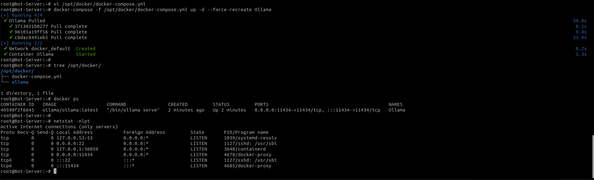


##### 3.2. Sử dụng LLM Meta Llama 3 model (bản 4.7 GB) trên Ollama

- Ollama supports a list of models available on [ollama.com/library](https://ollama.com/library 'ollama model library')

- Here are some example models that can be downloaded:

| Model              | Parameters | Size  | Download                       |
| ------------------ | ---------- | ----- | ------------------------------ |
| llama3           | 8B         | 4.7GB | `ollama run llama3`            |
| Llama 3            | 70B        | 40GB  | `ollama run llama3:70b`        |
| Phi 3 Mini         | 3.8B       | 2.3GB | `ollama run phi3`              |
| Phi 3 Medium       | 14B        | 7.9GB | `ollama run phi3:medium`       |
| Gemma 2            | 9B         | 5.5GB | `ollama run gemma2`            |
| Gemma 2            | 27B        | 16GB  | `ollama run gemma2:27b`        |
| Mistral            | 7B         | 4.1GB | `ollama run mistral`           |
| Moondream 2        | 1.4B       | 829MB | `ollama run moondream`         |
| Neural Chat        | 7B         | 4.1GB | `ollama run neural-chat`       |
| Starling           | 7B         | 4.1GB | `ollama run starling-lm`       |
| Code Llama         | 7B         | 3.8GB | `ollama run codellama`         |
| Llama 2 Uncensored | 7B         | 3.8GB | `ollama run llama2-uncensored` |
| LLaVA              | 7B         | 4.5GB | `ollama run llava`             |
| Solar              | 10.7B      | 6.1GB | `ollama run solar`             |

> <font color="green">:bulb:	 Note</font>
> You should have at least 8 GB of RAM available to run the 7B models, 16 GB to run the 13B models, and 32 GB to run the 33B models.
 

- Vào Ollama container chạy lệnh : 'ollama run llama3'
```bash
root@Bot-Server:~# docker exec -it Ollama bash
root@49590f2f6645:/# ollama run llama3
```

- Ollama bắt đầu tải xuống LLM llama3 dung lượng 4.7GB : 

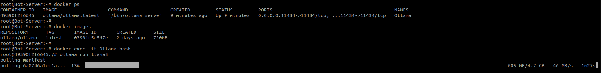
 

- Sau khi Ollama hoàn tất tải xuống LLM llama3, chúng ta có thể bắt đầu sử dụng LLM qua CLI : 

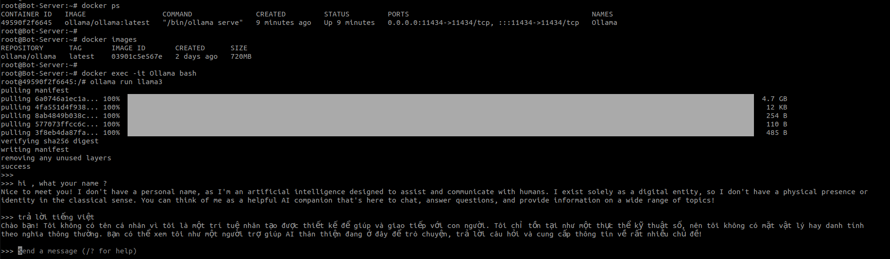


- Thao tác với Ollama qua API : 

```
curl http://localhost:11434/api/generate -d '{"model": "llama3" , "prompt":"giới thiệu ngắn gọn tiểu sử Nguyễn Du" , "stream": false}' | jq
```

> <font color="green">:bulb:	 Note</font>
> sử dụng "stream": false để response là 1 chuỗi json.

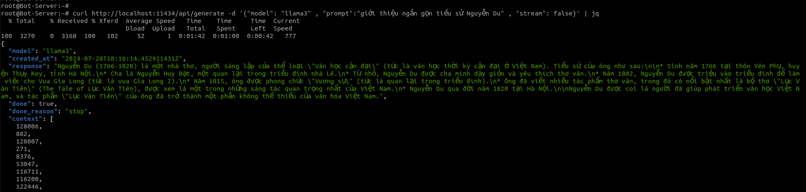


##### 3.3. Export và Import LLM model trên Ollama

- Do dung lượng LLM khá lớn, tôi sẽ export data ra disk để lưu trữ và import sử dụng cho các lần sau mà không cần download lại.
  
  
- Export LLM :  
  - Tôi sử dụng script tại https://gist.github.com/supersonictw/f6cf5e599377132fe5e180b3d495c553
> <font color="green">:bulb:	 Note</font>
> chỉnh sửa OLLAMA_HOME phù hợp với đường dẫn trên máy của bạn. 
> 
> Sau khi chạy script sẽ export ra 3 file : 
>   - model.bin : data của LLM, với model llama3	tôi đang dùng dung lượng khoảng 4.7GB
>   - Modelfile : file dùng để tạo model trong Ollama
>   - source.txt : file meta

- Import LLM : 
  - Copy các file đã export trước đó vào path mount trong container, ở bài viết này là /opt/docker/ollama/ 
  - Vào Ollama container tạo model từ file export đã copy : 

```bash
root@Bot-Server:~# tree -sh /opt/docker/ollama/.ollama/
[4.0K]  /opt/docker/ollama/.ollama/
├── [ 387]  id_ed25519
├── [  81]  id_ed25519.pub
├── [4.0K]  llama3-model-backup
│   ├── [ 12K]  Modelfile
│   ├── [4.3G]  model.bin
│   └── [  40]  source.txt
└── [4.0K]  models
    └── [4.0K]  blobs

3 directories, 5 files
root@Bot-Server:~# 
root@Bot-Server:~# docker ps 
CONTAINER ID   IMAGE                  COMMAND               CREATED          STATUS          PORTS                                           NAMES
2c3a019f5573   ollama/ollama:latest   "/bin/ollama serve"   14 minutes ago   Up 14 minutes   0.0.0.0:11434->11434/tcp, :::11434->11434/tcp   Ollama
root@Bot-Server:~# 
root@Bot-Server:~# docker exec -it Ollama bash

root@2c3a019f5573:~# cd /root/.ollama/llama3-model-backup/
root@2c3a019f5573:~/.ollama/llama3-model-backup# ll
total 4552000
drwxrwxr-x 2 root root       4096 Jul 29 02:40 ./
drwxr-xr-x 4 root root       4096 Jul 29 02:41 ../
-rw-r--r-- 1 root root      12704 Jul 26 07:04 Modelfile
-rw-r--r-- 1 root root 4661211424 Jul 26 07:04 model.bin
-rw-r--r-- 1 root root         40 Jul 26 07:04 source.txt
root@2c3a019f5573:~/.ollama/llama3-model-backup# ollama create llama3:latest
transferring model data 
using existing layer sha256:6a0746a1ec1aef3e7ec53868f220ff6e389f6f8ef87a01d77c96807de94ca2aa 
creating new layer sha256:b73a2906c0224dcb54cece1820b54f1540411f8e81aca3f7c41271c908ccb311 
creating new layer sha256:8ab4849b038cf0abc5b1c9b8ee1443dca6b93a045c2272180d985126eb40bf6f 
creating new layer sha256:83af8bbae28affc119c2de6f7189ded5b6e8215f989b2ede9b506943db6dd82c 
writing manifest 
success 
root@2c3a019f5573:~/.ollama/llama3-model-backup# ollama list
NAME         	ID          	SIZE  	MODIFIED           
llama3:latest	dc1bbceb3d6d	4.7 GB	About a minute ago	
root@2c3a019f5573:~/.ollama/llama3-model-backup# 
```


### 4. Sử dụng AnythingLLM 

##### 4.1. Chạy AnythingLLM với Docker-compose

- Trên Ollama pull Generation model (llama3) và Embedding model (mxbai-embed-large) để sử dụng cho AnythingLLM

```bash
docker exec -it Ollama ollama pull llama3 mxbai-embed-large
```

- docker-compose.yml 

```yml
  anythingllm:
    image: mintplexlabs/anythingllm
    container_name: anythingllm
    ports:
    - "3001:3001"
    cap_add:
      - SYS_ADMIN
    environment:
    # Adjust for your environment
      - STORAGE_DIR=/app/server/storage
      - JWT_SECRET="rWURbsxox849ZD"
      - LLM_PROVIDER=ollama
      - OLLAMA_BASE_PATH=http://192.168.161.11:11434
      - OLLAMA_MODEL_PREF=llama3
      - OLLAMA_MODEL_TOKEN_LIMIT=4096
      - EMBEDDING_ENGINE=ollama
      - EMBEDDING_BASE_PATH=http://192.168.161.11:11434
      - EMBEDDING_MODEL_PREF=mxbai-embed-large:latest
      - EMBEDDING_MODEL_MAX_CHUNK_LENGTH=8192
      - VECTOR_DB=lancedb
      - WHISPER_PROVIDER=local
      - TTS_PROVIDER=native
      - PASSWORDMINCHAR=8
      - AGENT_SERPER_DEV_KEY="123456"
      - AGENT_SERPLY_API_KEY="123456789"
    volumes:
      - anythingllm_storage:/app/server/storage
    restart: always
 
volumes:
  anythingllm_storage:
    driver: local
    driver_opts:
      type: none
      o: bind
      device: /opt/anythingllm  

```

> <font color="green">:bulb: Note</font>
> - LLM_PROVIDER: sử dụng ollama
> - OLLAMA_BASE_PATH: endpoint ollama để tạo sinh văn bản trả lời người dùng 
> - OLLAMA_MODEL_PREF: model trên ollama để tạo sinh văn bản trả lời người dùng , ở đây sử dụng llama3
> > Vector embedding là một phương thức chuyển đổi các dạng dữ liệu thành số nhằm bóc tách ngữ nghĩa và quan hệ của chúng. Chúng biểu diễn các dữ liệu thành các điểm trong không gian đa chiều, các điểm gần nhau hơn sẽ giống nhau về ngữ nghĩa hơn.
> 
> - EMBEDDING_BASE_PATH: endpoint ollama để embedding
> - EMBEDDING_MODEL_PREF: model trên ollama để  embedding, ở đây sử dụng model mxbai-embed-large


- Chúng ta đã có 2 container hoat động : ollama và anythingllm

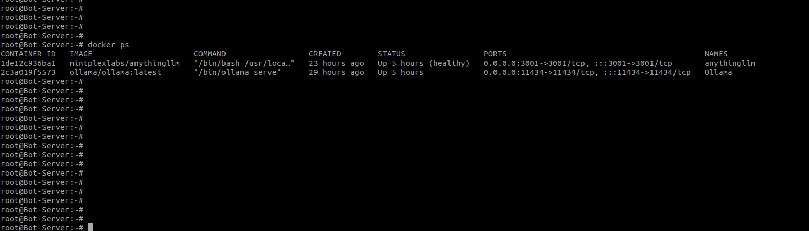


##### 4.2. RAG Chat bot với AnythingLLM

###### Tạo và setup Workspace

- Sử dụng chat mode là query để chỉ trả lời các thông tin được trích xuất từ các file tài liệu được upload

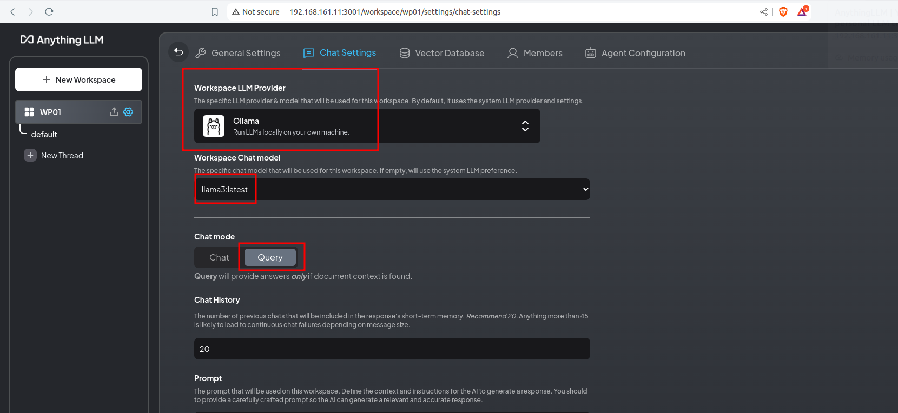


###### Bổ sung các nguồn tài liệu cho chatbot

- Thêm dữ liệu từ file PDF, ở ví dụ này tôi thêm 1 file pdf Hướng dẫn đi Vũng Tàu từ Cần Giờ 
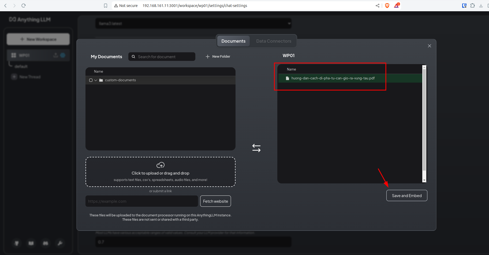

- Đặt câu hỏi, Chatbot truy vấn dữ liệu từ tài liệu được upload và trả lời : 
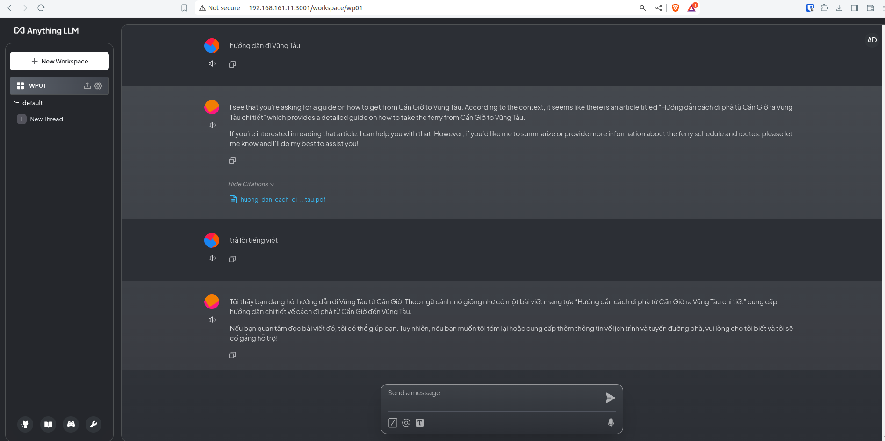


- Thêm dữ liệu từ Website, ở ví dụ này tôi thêm 1 url cập nhật giá vàng SJC 
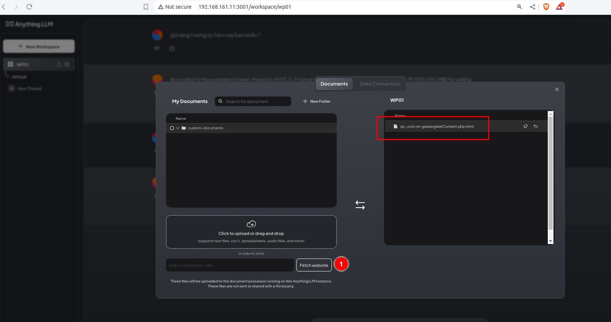

- Đặt câu hỏi, Chatbot truy vấn từ dữ liệu được bổ sung và trả lời : 
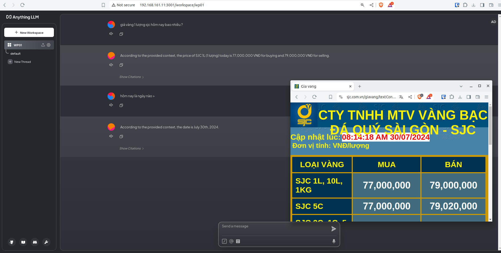


##### 4.3. Tích hợp chatbot vào Website

- Tạo Embed Code : 

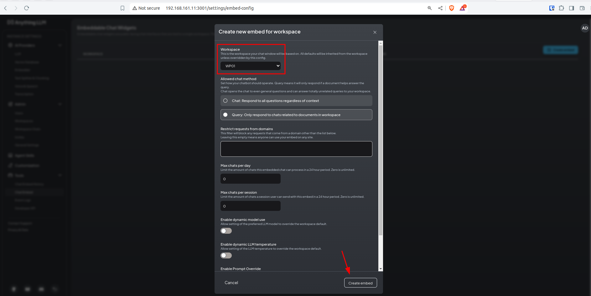

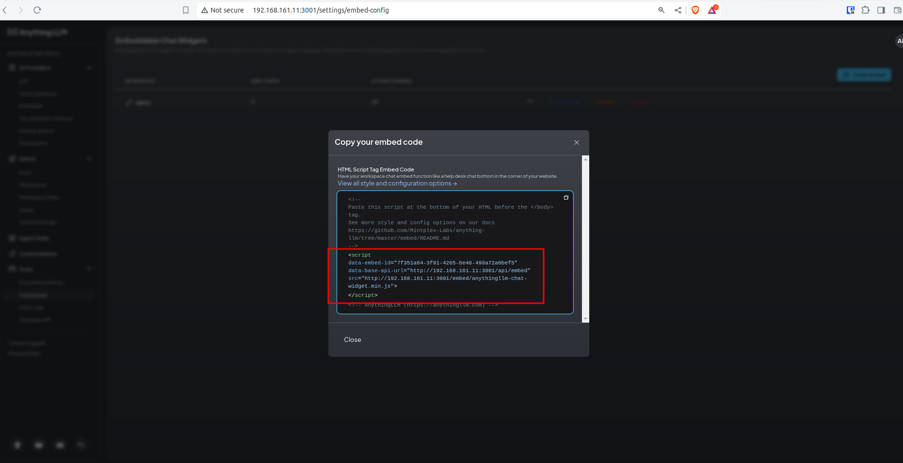

- Thêm block script vào html, ở ví dụ này tôi start nginx webserver và thêm đoạn mã vào trang nginx index.
  
```html
root@Bot-Server:~# cat /var/www/html/index.nginx-debian.html
<!DOCTYPE html>
<html>
<head>
<title>Welcome to nginx!</title>
<style>
    body {
        width: 35em;
        margin: 0 auto;
        font-family: Tahoma, Verdana, Arial, sans-serif;
    }
</style>
</head>
<body>
<h1>Welcome to nginx!</h1>
<p>If you see this page, the nginx web server is successfully installed and
working. Further configuration is required.</p>

<p>For online documentation and support please refer to
<a href="http://nginx.org/">nginx.org</a>.<br/>
Commercial support is available at
<a href="http://nginx.com/">nginx.com</a>.</p>

<p><em>Thank you for using nginx.</em></p>

<script
  data-chat-icon="support"
  data-assistant-name="Support 247"
  data-greeting="Need help?"
  data-no-sponsor="true"
  data-assistant-icon="https://cdn-icons-png.flaticon.com/512/1998/1998614.png"
  data-brand-image-url="https://miro.medium.com/v2/resize:fit:1024/0*ctdYP4zQfiL1bdkb.jpg"
  data-embed-id="7f351a64-3f91-4265-be48-498a72a0bef5"
  data-base-api-url="http://192.168.161.11:3001/api/embed"
  src="http://192.168.161.11:3001/embed/anythingllm-chat-widget.min.js"
></script>

</body>
</html>
root@Bot-Server:~# 
```

- Kết quả tích hợp chatbot trên Website 
  
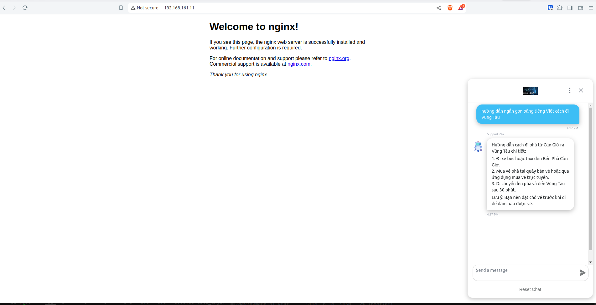

