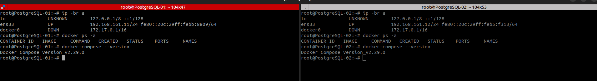
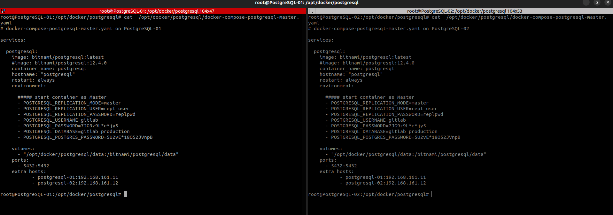
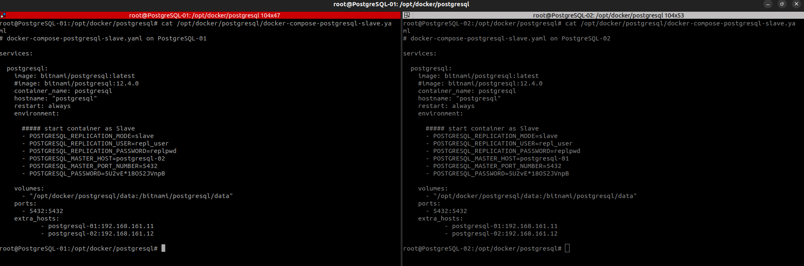
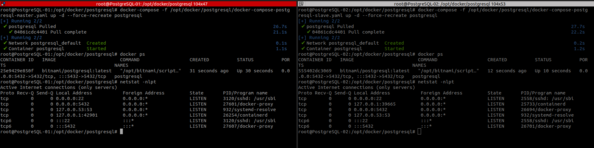
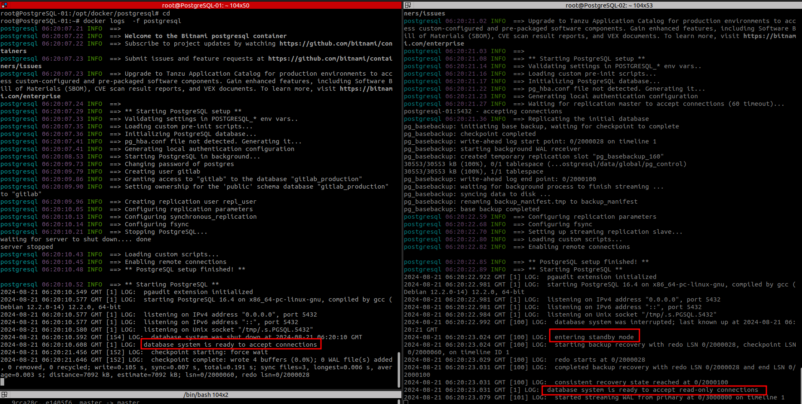
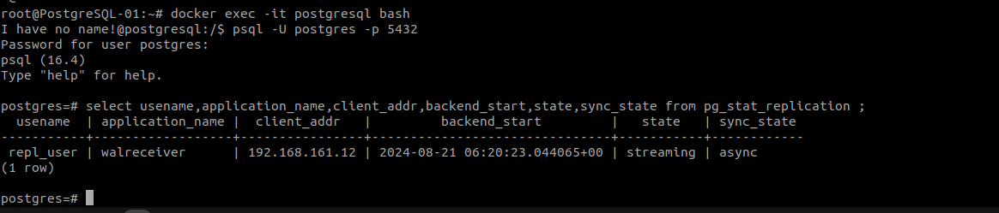
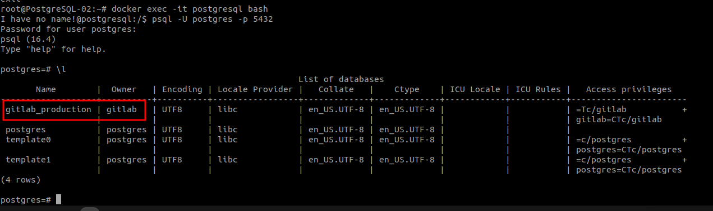
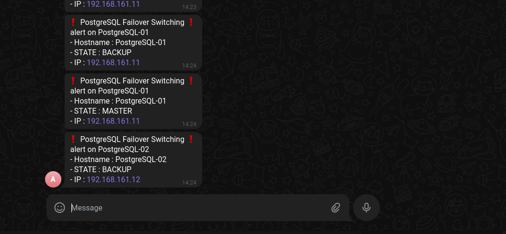
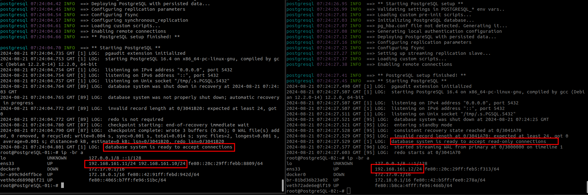

 
- [1. Giới thiệu](#1-giới-thiệu)
- [2. Các công nghệ sử dụng](#2-các-công-nghệ-sử-dụng)
- [3. Mô hình triển khai PostgreSQL Master-Slave](#3-mô-hình-triển-khai-postgresql-master-slave)
- [4. Các bước cài đặt và cấu hình](#4-các-bước-cài-đặt-và-cấu-hình)
  - [4.1. Cài đặt Docker service và Docker-compose](#41-cài-đặt-docker-service-và-docker-compose)
  - [4.2. Cấu hình PostgreSQL Replicate Master/Slave sử dụng Docker-compose](#42-cấu-hình-postgresql-replicate-masterslave-sử-dụng-docker-compose)
  - [4.3. Cài đặt và cấu hình Keepalived tự động chuyển đổi dự phòng cho PostgreSQL Replicate Master/Slave](#43-cài-đặt-và-cấu-hình-keepalived-tự-động-chuyển-đổi-dự-phòng-cho-postgresql-replicate-masterslave)

### 1. Giới thiệu 

- Với kinh nghiệm nhiều năm làm việc với vai trò là Engineer ở các tập đoàn công nghệ quy mô lớn, luân chuyển qua nhiều team để học hỏi, có cơ hội tiếp xúc rất nhiều mô hình hệ thống dịch vụ khác nhau tôi nhận thấy rằng mục đích chính của các hệ thống là cung cấp cho người dùng (có thể là khách hàng hoặc nội bộ) các dịch vụ ổn định và sẵn sàng trong mọi tình huống sự cố nhằm duy trì hoạt động kinh doanh của doanh nghiệp. Vi vậy, một hệ thống quá lớn và phức tạp để đạt sự ổn định cần thiết cần rất rất nhiều yếu tố, bao gồm : chi phí đầu tư hạ tầng cao, trình độ kỹ thuật nhân sự vận hành phải thật sự am hiểu và chuyên sâu, đồng thời có kiến thức rộng ở nhiều lĩnh vực liên quan như system, network, hardware, coding,...Đó là lý do trong các thiết kế hệ thống của mình, tôi luôn luôn áp dụng phương pháp phân mảnh các thành phần nhằm chia nhỏ các phần hệ thống để giảm thiểu khả năng lỗi dây chuyền, và dễ dàng xử lý sự cố hơn. Đôi lúc chúng ta không cần thiết triển khai 1 thứ quá phức tạp, cầu kỳ để giải quyết 1 vấn đề tương đối đơn giản vì thực tế 1 hệ thống doanh nghiệp bao gồm hàng trăm dịch vụ chạy kết hợp với nhau sẽ tự sinh ra 1 thứ rất phức tạp để chúng ta vận hành rồi. Theo tôi nghĩ chỉ cần đáp ứng nhu cầu sử dụng bạn nên triển khai các thành phần càng đơn giản càng tốt vì tôi nhận thấy qua chính công việc của mình có các lợi ích như sau : dễ triển khai, đơn giản trong quá trình vận hành, chuyển giao cho đồng nghiệp và các team khác nhanh vì không phải 1 mình bạn làm mà chúng ta làm việc theo team, mỗi người có thể hiểu và backup cho nhau sẽ đỡ vất vả hơn rất nhiều.
  
- Trong các bài viết khác, tôi sử dụng PostgreSQL làm database do đó để giảm bớt nội dung kiến thức trong các bài viết, tôi sẽ tách riêng bài viết xây dựng hệ thống database với PostgreSQL có tính sẵn sàng cao để khi tích hợp các hệ thống với nhau chúng ta có 1 mô hình lớn tổng thể các dịch vụ có độ ổn định và tính sẵn sàng cao phục vụ cho hoạt động của doanh nghiệp.

- PostgreSQL là 1 hệ cơ sở dữ liệu nguồn mở có tính ổn định cao. Các hướng dẫn cài đặt, quản trị,... đã có khá nhiều bài viết trên Internet. Giới hạn trong bài viết này, tôi chỉ chia sẻ về cách tôi triển khai 1 hệ cơ sở dữ liệu sử dụng PostgresSQL có khả năng chịu lỗi và rất đơn giản trong việc triển khai. Nếu cần đáp ứng CCU lớn, concept này hoàn toàn có thể được scale lớn hơn để phục vụ.

### 2. Các công nghệ sử dụng
- Server Ubuntu 22.04 
- Docker service , docker-compose
- PostgreSQL 
- Keepalived 
- Shell script

Như danh sách trên có thể thấy, chúng ta sẽ kết hợp nhiều thành phần với các vai trò khác nhau để tạo thành 1 solution cần thiết. Tôi sử dụng OS Ubuntu server 22.04 LTS vì hiện tại đây là version thông dụng và stable, các bản Ubuntu 23 và 24 hiện tại ý kiến cá nhân tôi thấy vẫn còn chưa rộng rãi các package và chưa stable. Trong bài viết này tôi sẽ triển khai trên Docker, nếu cần chịu tải cao hơn các bạn có thể triển khai với systemd.


### 3. Mô hình triển khai PostgreSQL Master-Slave 

- Trong diagram trên chúng ta sử dụng Keepalived để tạo Virtual IP (VIP) cung cấp endpoint cho kết nối database, cơ chế Mater-Slave hay Active-Standby giúp giảm thiểu tình trạng confict dữ liệu khi write đồng thời. 

- Khi server hoặc instance PostgreSQL gặp sự cố  (cụ thể trong trường hợp này là server Down), sau khoảng 5 giây Keepalived sẽ tự động switch VIP từ Master sang Slave đồng thời tôi sử dụng option trong Keepalived là "notify" để gọi chạy 1 file Shell script thực hiện các công việc check STATE của Keepalive, start PostgreSQL container với cấu hình Master và trigger Slave lên làm Master. Khi server Up được ghi nhận trở thành Slave cũng sẽ dùng option "notify" chạy Shell script thực hiện start PostgreSQL container với cấu hình là Slave và đồng bộ data từ Master.

- Như giải thích bên trên, Shell script được tôi sử dụng làm kịch bản control 2 server khi có sự cố, đảm bảo dịch vụ database luôn Up giảm tối đa Downtime. Có thể thấy khá thủ công và đơn giản, có thể có các ý tưởng hay hơn tuy nhiên ở trường hợp dịch vụ của tôi vận hành khá stable khi sử dụng thực tế, tôi không cần phải xử lý khi server gặp sự cố cứ để nó tự chuyển đổi dự phòng. 

### 4. Các bước cài đặt và cấu hình 

#### 4.1. Cài đặt Docker service và Docker-compose

Note:
> Thực hiện trên cả 2 server 

- Cài đặt Docker service
```bash
curl -fsSL https://download.docker.com/linux/ubuntu/gpg | sudo apt-key add -
add-apt-repository -y "deb [arch=amd64] https://download.docker.com/linux/ubuntu focal stable"
apt install docker.io -y 
systemctl restart docker.service
systemctl enable docker.service
systemctl status docker.service
docker ps -a 
```

- Cài đặt Docker-compose
```bash
curl -L "https://github.com/docker/compose/releases/download/v2.29.0/docker-compose-$(uname -s)-$(uname -m)" -o /usr/bin/docker-compose
chmod +x  /usr/bin/docker-compose 
docker-compose --version
```




#### 4.2. Cấu hình PostgreSQL Replicate Master/Slave sử dụng Docker-compose


Note:
> Thực hiện trên cả 2 server. 

> Mỗi server đều có 2 file yaml để start container PostgresSQL Master và Slave. 


- Tạo thư mục để mount PostgreSQL data trong container ra host. 

```bash
mkdir -p /opt/docker/postgresql/data
chown -R 1001.1001 /opt/docker/postgresql/

touch /opt/docker/postgresql/docker-compose-postgresql-master.yaml
touch /opt/docker/postgresql/docker-compose-postgresql-slave.yaml

```
<br>

- Nội dung file docker-compose-postgresql-master.yaml trên server PostgreSQL-01

```yml
# docker-compose-postgresql-master.yaml on PostgreSQL-01

services:

  postgresql:
    image: bitnami/postgresql:latest
    #image: bitnami/postgresql:12.4.0
    container_name: postgresql
    hostname: "postgresql"
    restart: always
    environment:

      ##### start container as Master
      - POSTGRESQL_REPLICATION_MODE=master
      - POSTGRESQL_REPLICATION_USER=repl_user
      - POSTGRESQL_REPLICATION_PASSWORD=replpwd
      - POSTGRESQL_USERNAME=gitlab
      - POSTGRESQL_PASSWORD=7JG9z9L*e*jy5
      - POSTGRESQL_DATABASE=gitlab_production
      - POSTGRESQL_POSTGRES_PASSWORD=5U2vE*18O52JVnpB

    volumes:
      - "/opt/docker/postgresql/data:/bitnami/postgresql/data"
    ports:
      - 5432:5432
    extra_hosts:
           - postgresql-01:192.168.161.11
           - postgresql-02:192.168.161.12
```

<br>

- Nội dung file docker-compose-postgresql-slave.yaml trên server PostgreSQL-01

```yml
# docker-compose-postgresql-slave.yaml on PostgreSQL-01

services:

  postgresql:
    image: bitnami/postgresql:latest
    #image: bitnami/postgresql:12.4.0
    container_name: postgresql
    hostname: "postgresql"
    restart: always
    environment:

      ##### start container as Slave
      - POSTGRESQL_REPLICATION_MODE=slave
      - POSTGRESQL_REPLICATION_USER=repl_user
      - POSTGRESQL_REPLICATION_PASSWORD=replpwd
      - POSTGRESQL_MASTER_HOST=postgresql-02
      - POSTGRESQL_MASTER_PORT_NUMBER=5432
      - POSTGRESQL_PASSWORD=5U2vE*18O52JVnpB

    volumes:
      - "/opt/docker/postgresql/data:/bitnami/postgresql/data"
    ports:
      - 5432:5432
    extra_hosts:
           - postgresql-01:192.168.161.11
           - postgresql-02:192.168.161.12
```

<br>

- Nội dung file docker-compose-postgresql-master.yaml trên server PostgreSQL-02

```yml
# docker-compose-postgresql-master.yaml on PostgreSQL-02

services:

  postgresql:
    image: bitnami/postgresql:latest
    #image: bitnami/postgresql:12.4.0
    container_name: postgresql
    hostname: "postgresql"
    restart: always
    environment:

      ##### start container as Master
      - POSTGRESQL_REPLICATION_MODE=master
      - POSTGRESQL_REPLICATION_USER=repl_user
      - POSTGRESQL_REPLICATION_PASSWORD=replpwd
      - POSTGRESQL_USERNAME=gitlab
      - POSTGRESQL_PASSWORD=7JG9z9L*e*jy5
      - POSTGRESQL_DATABASE=gitlab_production
      - POSTGRESQL_POSTGRES_PASSWORD=5U2vE*18O52JVnpB

    volumes:
      - "/opt/docker/postgresql/data:/bitnami/postgresql/data"
    ports:
      - 5432:5432
    extra_hosts:
           - postgresql-01:192.168.161.11
           - postgresql-02:192.168.161.12

```

<br>

- Nội dung file docker-compose-postgresql-slave.yaml trên server PostgreSQL-02

```yml
# docker-compose-postgresql-slave.yaml on PostgreSQL-02

services:

  postgresql:
    image: bitnami/postgresql:latest
    #image: bitnami/postgresql:12.4.0
    container_name: postgresql
    hostname: "postgresql"
    restart: always
    environment:

      ##### start container as Slave
      - POSTGRESQL_REPLICATION_MODE=slave
      - POSTGRESQL_REPLICATION_USER=repl_user
      - POSTGRESQL_REPLICATION_PASSWORD=replpwd
      - POSTGRESQL_MASTER_HOST=postgresql-01
      - POSTGRESQL_MASTER_PORT_NUMBER=5432
      - POSTGRESQL_PASSWORD=5U2vE*18O52JVnpB

    volumes:
      - "/opt/docker/postgresql/data:/bitnami/postgresql/data"
    ports:
      - 5432:5432
    extra_hosts:
           - postgresql-01:192.168.161.11
           - postgresql-02:192.168.161.12

```
<br>


<br>



- Khởi chạy container PostgreSQL làm Master trên server PostgreSQL-01

```bash
docker-compose -f /opt/docker/postgresql/docker-compose-postgresql-master.yaml up -d --force-recreate postgresql
```


- Khởi chạy container PostgreSQL làm Slave trên server PostgreSQL-02
  
```bash
docker-compose -f /opt/docker/postgresql/docker-compose-postgresql-slave.yaml up -d --force-recreate postgresql
```


<br>



- Trên server PostgreSQL-01 làm Master kiểm tra replicate : 

```bash
psql -U postgres -p 5432

postgres=# select usename,application_name,client_addr,backend_start,state,sync_state from pg_stat_replication ;
```




- Trên server PostgreSQL-02 làm Slave kiểm tra database đã được đồng bộ : 




#### 4.3. Cài đặt và cấu hình Keepalived tự động chuyển đổi dự phòng cho PostgreSQL Replicate Master/Slave 

Note:
> Thực hiện trên cả 2 server. 

```bash
apt install keepalived -y 
```

- Tạo file keepalived_control_failover.sh trên server PostgreSQL-01

```bash
#!/bin/bash

# /etc/keepalived/keepalived_control_failover.sh
# keepalived_control_failover.sh On server PostgreSQL-01


STATE=$3
peer='192.168.161.12'
ipaddr=`/sbin/ifconfig ens33 | awk -F ' *|:' '/inet /{print $3}'`
logs='/etc/keepalived/keepalived_control_failover.log'
echo "$(date +'%Y-%m-%d %H:%M:%S') $(hostname) $(hostname -I), STATE: ${STATE} " >>  $logs

sendTelegram(){
        curl -s -X POST --data chat_id=-xxxxx --data text="$1" "https://api.telegram.org/botxxxxxxx:Axxxxx/sendMessage" 
}


case $STATE in
        "MASTER") echo "$(date +'%Y-%m-%d %H:%M:%S') trigger postgresql container to master" >>  $logs
                  /usr/bin/docker exec postgresql touch /tmp/postgresql.trigger.5432
                  echo "$(date +'%Y-%m-%d %H:%M:%S') recreate postgresql container with Master config" >>  $logs
                  /usr/bin/docker-compose -f /opt/docker/postgresql/docker-compose-postgresql-master.yaml up -d --force-recreate postgresql
                  sendTelegram "❗ PostgreSQL Failover Switching ❗ %0A alert on $(hostname) %0A - Hostname : $(hostname) %0A - STATE : ${STATE} %0A - IP : ${ipaddr} "
                  exit 0
                  ;;

        "BACKUP") echo "$(date +'%Y-%m-%d %H:%M:%S') stop postgresql container" >>  $logs
                  /usr/bin/docker stop postgresql
                  echo "$(date +'%Y-%m-%d %H:%M:%S') rsync data from Master " >>  $logs
                  echo 'xxxxx' | rsync -av root@$peer:/opt/docker/postgresql/data/ /opt/docker/postgresql/data/
                  echo "$(date +'%Y-%m-%d %H:%M:%S') recreate postgresql container with Slave config" >>  $logs
                  /usr/bin/docker-compose -f /opt/docker/postgresql/docker-compose-postgresql-slave.yaml up -d --force-recreate postgresql
                  sendTelegram "❗ PostgreSQL Failover Switching ❗ %0A alert on $(hostname) %0A - Hostname : $(hostname) %0A - STATE : ${STATE} %0A - IP : ${ipaddr} "
                  exit 0
                  ;;

        *)        echo "unknown state"
                  echo "$(date +'%Y-%m-%d %H:%M:%S') unknown state to process!!!" >>  $logs
                  exit 0
                  ;;
esac
```

- Tạo file keepalived_control_failover.sh trên server PostgreSQL-02

```bash
#!/bin/bash

# /etc/keepalived/keepalived_control_failover.sh
# keepalived_control_failover.sh On server PostgreSQL-02


STATE=$3
peer='192.168.161.11'
ipaddr=`/sbin/ifconfig ens33 | awk -F ' *|:' '/inet /{print $3}'`
logs='/etc/keepalived/keepalived_control_failover.log'
echo "$(date +'%Y-%m-%d %H:%M:%S') $(hostname) $(hostname -I), STATE: ${STATE} " >>  $logs

sendTelegram(){
        curl -s -X POST --data chat_id=-xxxxx --data text="$1" "https://api.telegram.org/botxxxxxxx:Axxxxx/sendMessage" 
}


case $STATE in
        "MASTER") echo "$(date +'%Y-%m-%d %H:%M:%S') trigger postgresql container to master" >>  $logs
                  /usr/bin/docker exec postgresql touch /tmp/postgresql.trigger.5432
                  echo "$(date +'%Y-%m-%d %H:%M:%S') recreate postgresql container with Master config" >>  $logs
                  /usr/bin/docker-compose -f /opt/docker/postgresql/docker-compose-postgresql-master.yaml up -d --force-recreate postgresql
                  sendTelegram "❗ PostgreSQL Failover Switching ❗ %0A alert on $(hostname) %0A - Hostname : $(hostname) %0A - STATE : ${STATE} %0A - IP : ${ipaddr} "
                  exit 0
                  ;;

        "BACKUP") echo "$(date +'%Y-%m-%d %H:%M:%S') stop postgresql container" >>  $logs
                  /usr/bin/docker stop postgresql
                  echo "$(date +'%Y-%m-%d %H:%M:%S') rsync data from Master " >>  $logs
                  echo 'xxxxx' | rsync -av root@$peer:/opt/docker/postgresql/data/ /opt/docker/postgresql/data/
                  echo "$(date +'%Y-%m-%d %H:%M:%S') recreate postgresql container with Slave config" >>  $logs
                  /usr/bin/docker-compose -f /opt/docker/postgresql/docker-compose-postgresql-slave.yaml up -d --force-recreate postgresql
                  sendTelegram "❗ PostgreSQL Failover Switching ❗ %0A alert on $(hostname) %0A - Hostname : $(hostname) %0A - STATE : ${STATE} %0A - IP : ${ipaddr} "
                  exit 0
                  ;;

        *)        echo "unknown state"
                  echo "$(date +'%Y-%m-%d %H:%M:%S') unknown state to process!!!" >>  $logs
                  exit 0
                  ;;
esac
```

- Tạo file cấu hình Keepalived trên server PostgreSQL-01

```bash
# /etc/keepalived/keepalived.conf 
global_defs {
  enable_script_security
  script_user root 
}

vrrp_script chk_postgresql {
    script "/usr/bin/nc -zv localhost 5432"
    interval 2
    weight 3
}

vrrp_instance VIP_1 {
    interface ens33
    state MASTER
    virtual_router_id 60
    priority 100
    authentication {
        auth_type PASS
        auth_pass 3Bj1KiCoLBYbmUxy
    }
    virtual_ipaddress {
        192.168.161.10/24
    }
    track_script {
        chk_postgresql
    }

    notify "/etc/keepalived/keepalived_control_failover.sh"
}
```

- Tạo file cấu hình Keepalived trên server PostgreSQL-02

```bash
# /etc/keepalived/keepalived.conf 

global_defs {
  enable_script_security
  script_user root 
}

vrrp_script chk_postgresql {
    script "/usr/bin/nc -zv localhost 5432"
    interval 2
    weight 3
}

vrrp_instance VIP_1 {
    interface ens33
    state BACKUP
    virtual_router_id 60
    priority 100
    authentication {
        auth_type PASS
        auth_pass 3Bj1KiCoLBYbmUxy
    }
    virtual_ipaddress {
        192.168.161.10/24
    }
    track_script {
        chk_postgresql
    }

    notify "/etc/keepalived/keepalived_control_failover.sh"
}
```

- Cấu quyền thực thi cho script và start Keepalived service 

```bash
chmod +x /etc/keepalived/keepalived_control_failover.sh

systemctl enable keepalived.service
systemctl restart keepalived.service

journalctl -u keepalived | tail -n 100
```


- Thông báo khi hệ thống tự động chuyển đổi dự phòng qua Telegram : 




- Bạn hãy Down/Up server để test failover và theo dõi quá trình tự động chuyển đổi dự phòng cho PostgreSQL Database.




- Như vậy, tôi đã chia sẻ về cách chúng ta kết hợp các kỹ thuật khác nhau nhằm đem đến 1 giải pháp tổng thể. Có thể nói giải pháp này rất basic về mặt kỹ thuật nhưng đòi hỏi người quản trị phải tư duy và cần tùy chỉnh các cấu hình thủ công trước để phù hợp với hệ thống. Nhìn chung việc cấu hình của System Engineer càng phức tạp, chi tiết thì hệ thống dịch vụ chúng ta vận hành sẽ càng hoạt động ổn định. 
  
