Bài viết hướng dẫn cài đặt và sử dụng **PNetLab** — nền tảng giả lập mạng mã nguồn mở cho phép chạy các thiết bị mạng ảo (Cisco IOS, Cisco XE, Cisco XR, Juniper, Palo Alto, MikroTik, v.v.) trực tiếp trên trình duyệt web mà không cần cài đặt thêm phần mềm.

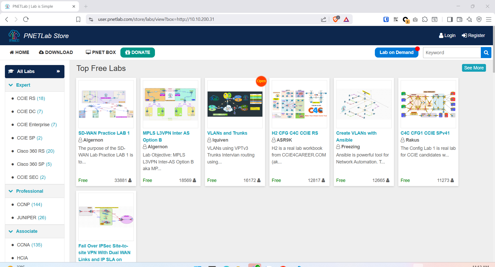

### Mục lục

- [Mục lục](#mục-lục)
- [1. Giới thiệu](#1-giới-thiệu)
- [2. Yêu cầu hệ thống](#2-yêu-cầu-hệ-thống)
- [3. Cài đặt PNetLab VM](#3-cài-đặt-pnetlab-vm)
  - [3.1. Import OVA vào VMware ESXi / Workstation](#31-import-ova-vào-vmware-esxi--workstation)
  - [3.2. Cấu hình ban đầu](#32-cấu-hình-ban-đầu)
- [4. Truy cập Web UI](#4-truy-cập-web-ui)
- [5. Upload Node Images](#5-upload-node-images)
  - [5.1. Cisco vIOS L3 (Router)](#51-cisco-vios-l3-router)
  - [5.2. Cisco vIOS L2 (Switch)](#52-cisco-vios-l2-switch)
  - [5.3. Cisco CSR1000v (IOS XE)](#53-cisco-csr1000v-ios-xe)
  - [5.4. FortiGate](#54-fortigate)
- [6. Tạo Lab Topology](#6-tạo-lab-topology)
  - [6.1. Tạo Lab mới](#61-tạo-lab-mới)
  - [6.2. Thêm Node vào Lab](#62-thêm-node-vào-lab)
  - [6.3. Thêm Cloud0 (Internet)](#63-thêm-cloud0-internet)
  - [6.4. Kết nối các Node](#64-kết-nối-các-node)
  - [6.5. Khởi động và cấu hình](#65-khởi-động-và-cấu-hình)
- [7. Khởi động và truy cập Console](#7-khởi-động-và-truy-cập-console)
  - [Verify sau khi vào Console](#verify-sau-khi-vào-console)
- [8. Tích hợp Internet Access cho Lab Node](#8-tích-hợp-internet-access-cho-lab-node)
- [9. Lời kết](#9-lời-kết)

---

### 1. Giới thiệu

**PNetLab** (viết tắt của *Packet Network Emulator Lab*) là nền tảng giả lập mạng kế thừa từ dự án UNetLab/EVE-NG, được phát triển lại với nhiều cải tiến:

- **Web UI hiện đại** — Kéo thả topology trực tiếp trên trình duyệt, không cần Java hay Flash
- **Multi-user** — Hỗ trợ nhiều user đồng thời làm lab trên cùng một server
- **Store tích hợp** — Download node image trực tiếp từ PNetLab Store
- **Docker node** — Hỗ trợ chạy Linux container (FRRouting, Ubuntu, v.v.) không cần license
- **Wireshark tích hợp** — Bắt gói tin trực tiếp từ Web UI

So sánh PNetLab với các giải pháp tương tự:

| Tiêu chí | PNetLab | EVE-NG CE | GNS3 |
|---|---|---|---|
| Giao diện | Web | Web | Desktop App |
| Multi-user | Có | Không (CE) | Không |
| Docker node | Có | Không (CE) | Có |
| Giá | Miễn phí | Miễn phí | Miễn phí |
| Image store | Có | Không | Không |
| Cài đặt | OVA/ISO | OVA/ISO | App + Server |


---

### 2. Yêu cầu hệ thống

| Thành phần | Tối thiểu | Khuyến nghị |
|---|---|---|
| CPU | 4 cores (VT-x/AMD-V) | 8+ cores |
| RAM | 8 GB | 16–32 GB |
| Disk | 100 GB | 200+ GB (SSD) |
| Network | 1 NIC | 2 NICs |
| Hypervisor | VMware ESXi 6.5+, Proxmox 7+, VMware Workstation 16+ | ESXi 7/8 hoặc Proxmox 8 |

> **Lưu ý:** PNetLab yêu cầu **nested virtualization** được bật trên hypervisor để chạy các node KVM bên trong.

---

### 3. Cài đặt PNetLab VM

Download OVA từ trang chính thức: [https://pnetlab.com/pages/download](https://pnetlab.com/pages/download)

#### 3.1. Import OVA vào VMware ESXi / Workstation

1. Truy cập **vSphere Client** → **File** → **Deploy OVF Template**
2. Chọn file `pnetlab-x.x.x.ova` vừa download
3. Chọn Datastore và Network phù hợp
4. Sau khi import xong, vào **VM Settings** → **CPU**:
   - Tick **Expose hardware assisted virtualization to the guest OS** (Enable nested VT-x)
5. Chỉnh RAM và disk theo nhu cầu
6. Power on VM

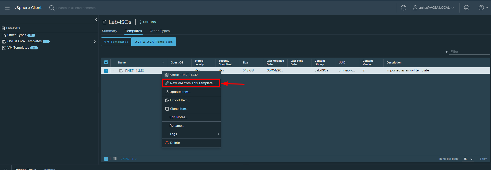

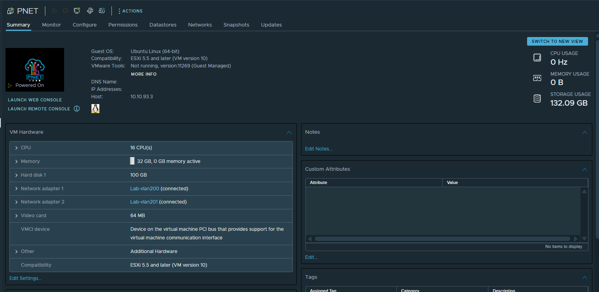


#### 3.2. Cấu hình ban đầu

Khi VM khởi động lần đầu, console hiển thị địa chỉ IP (DHCP). Đăng nhập vào VM để cấu hình:

```
Username: root
Password: pnet
```

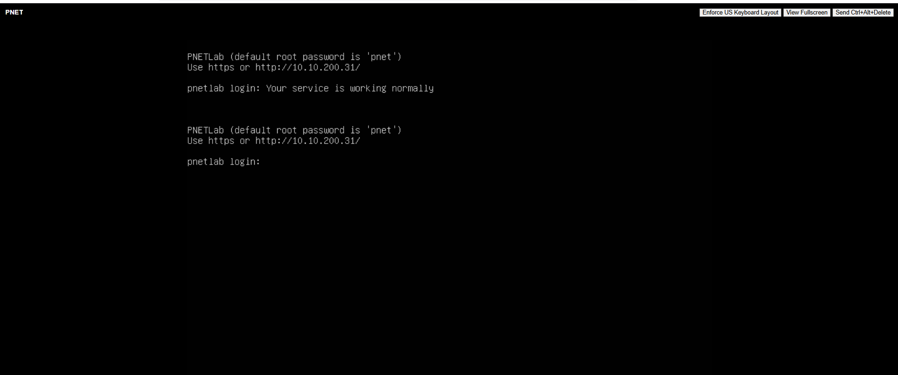

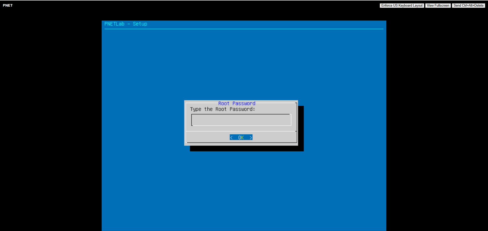

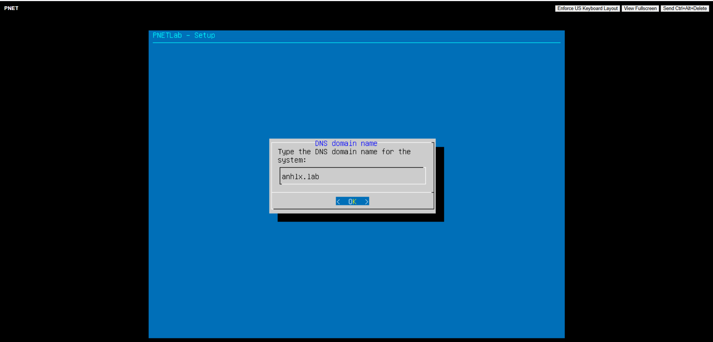

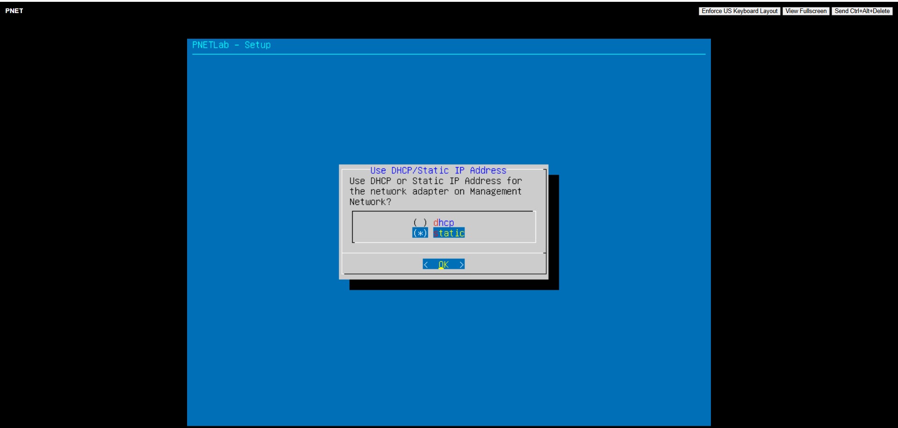

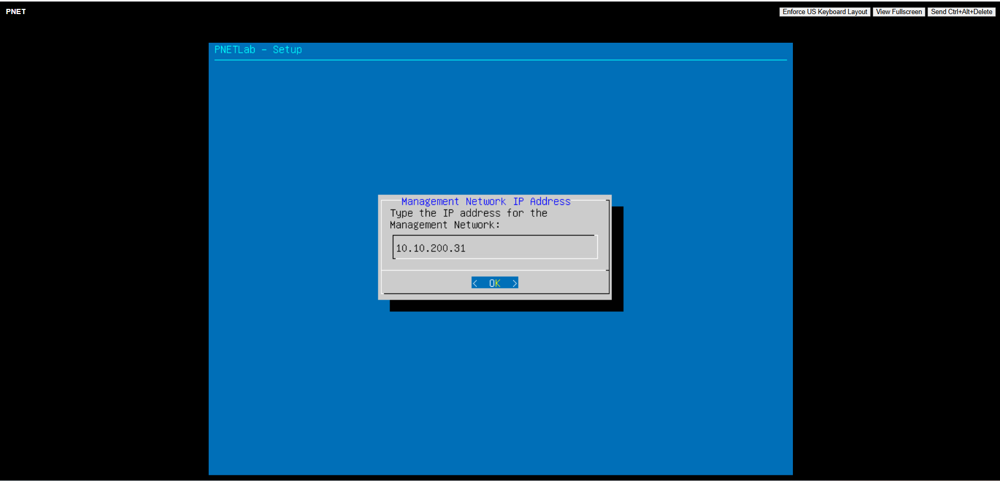

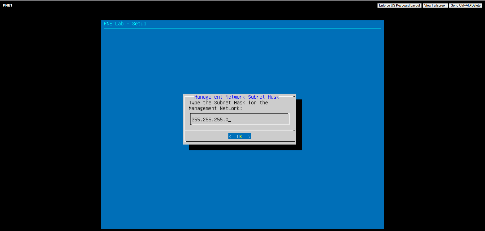

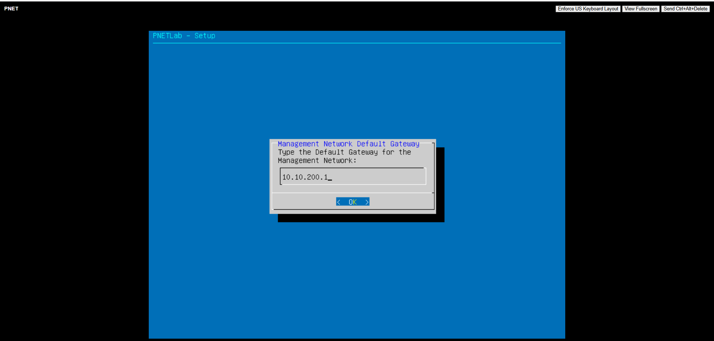

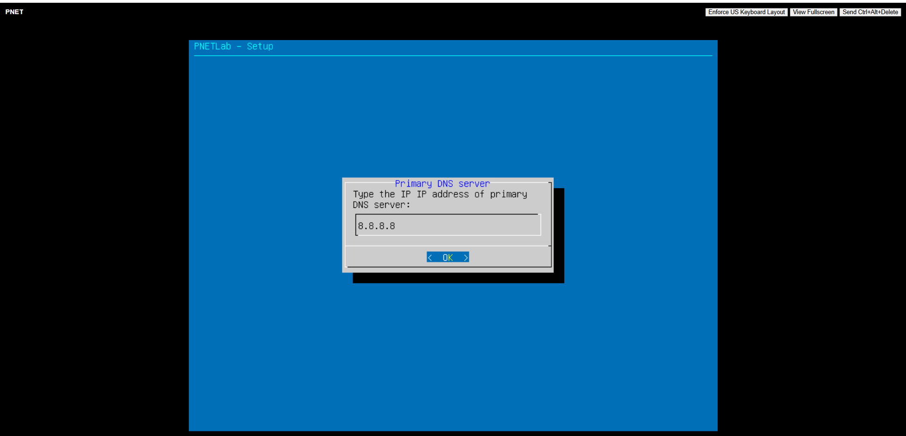

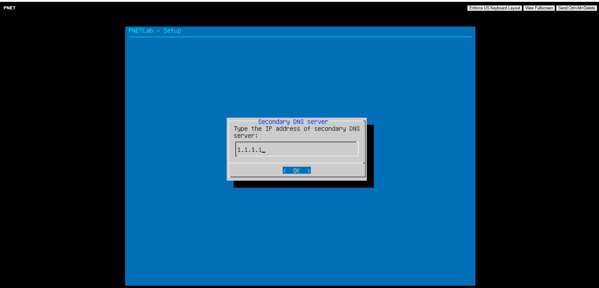

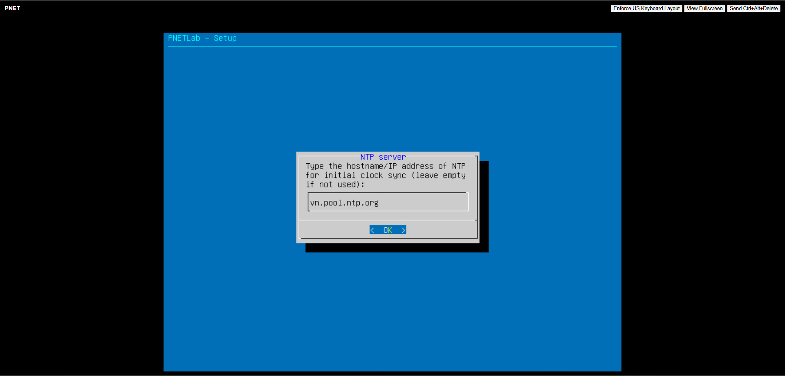

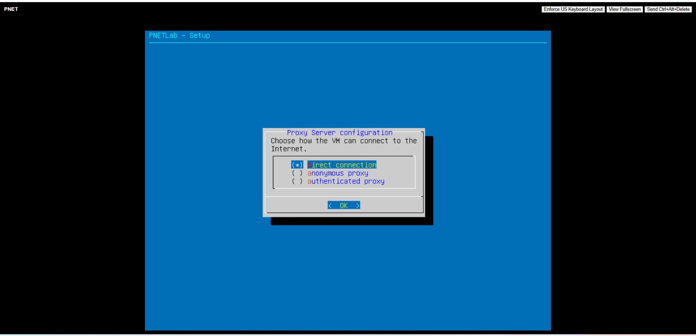

---

### 4. Truy cập Web UI

Mở trình duyệt, truy cập địa chỉ IP của PNetLab:

```
http://10.10.200.31
```

Đăng nhập với tài khoản mặc định:
- **Username:** `admin`
- **Password:** `pnet`

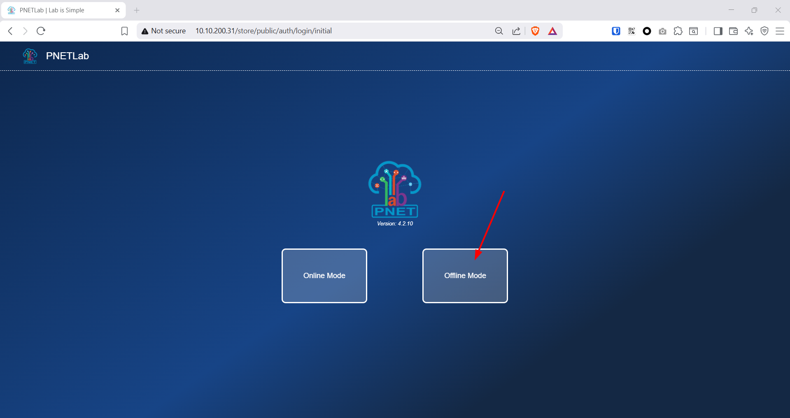

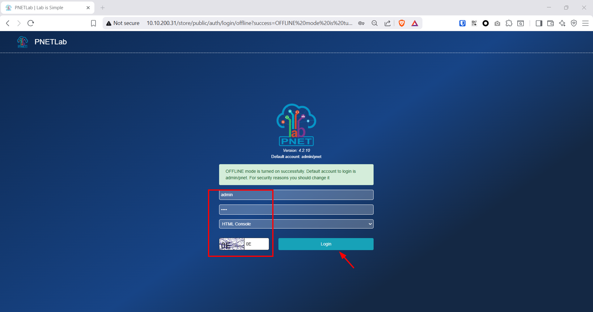

> **Lưu ý bảo mật:** Đổi mật khẩu `admin` ngay sau lần đăng nhập đầu tiên. Vào **Users** → chọn `admin` → **Change Password**.

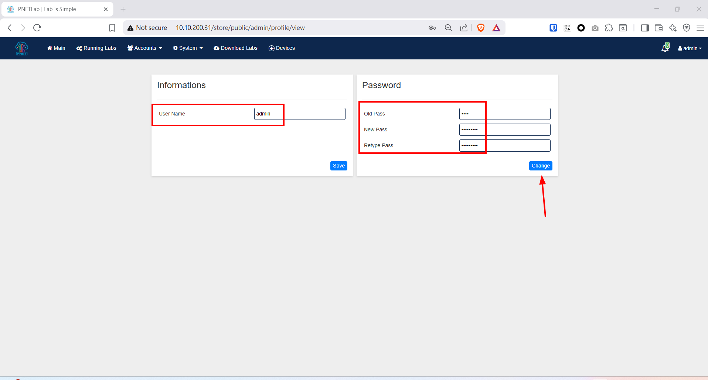

Sau khi đăng nhập, giao diện **Workspace** hiển thị với thanh menu trên cùng:

- **Main** — Trang chủ Workspace, quản lý lab file
- **Running Labs** — Xem các lab đang chạy hiện tại
- **Accounts** — Quản lý tài khoản người dùng
- **System** — Cấu hình hệ thống PNetLab
- **Download Labs** — Tải lab mẫu từ cộng đồng
- **Devices** — Quản lý node image đã upload

Giao diện chính chia 2 cột:
- **Trái:** danh sách lab file (Search Labs, các nút tạo/xoá/import/export lab)
- **Phải:** Lab Preview — xem trước topology của lab được chọn

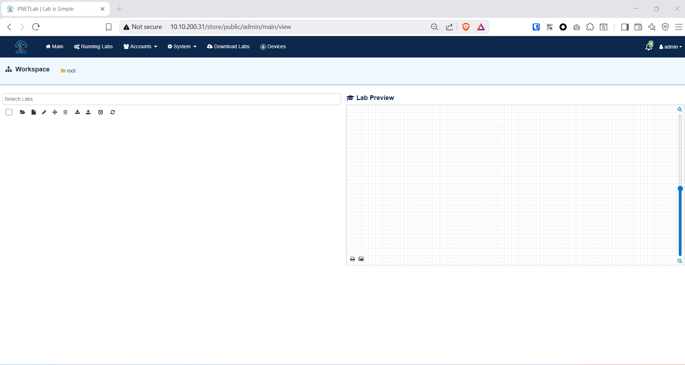


---

### 5. Upload Node Images

PNetLab cần image của thiết bị mạng để chạy. Có 2 cách:

1. **PNetLab Store** — Download trực tiếp từ Web UI (một số free, một số cần tài khoản)
   
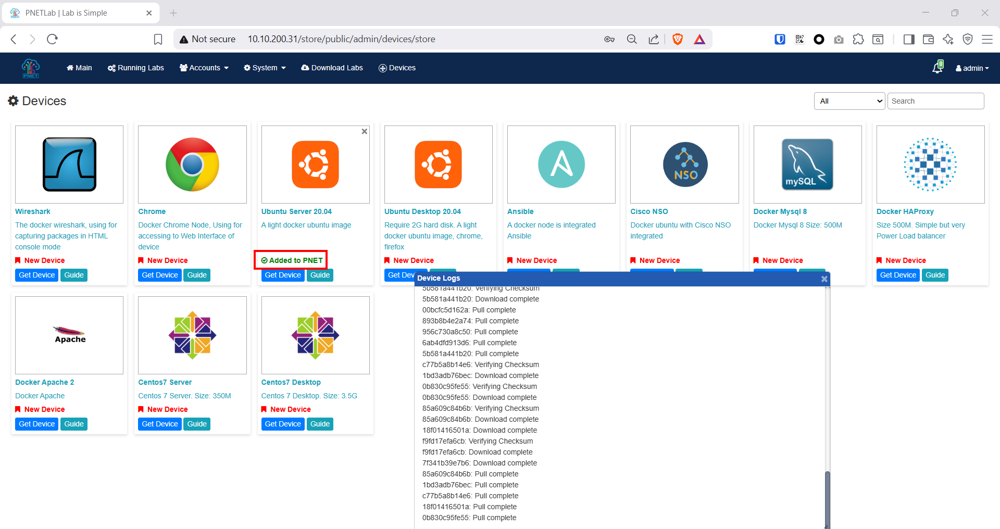
   
1. **Upload thủ công** — Upload qua SCP/SFTP 

#### 5.1. Cisco vIOS L3 (Router)

**Cisco VIRL vIOS** là image router Cisco dùng cho lab routing (OSPF, BGP, EIGRP, v.v.). File image: `vios-15.5.3M.rar` — Pass giải nén: `Cnttshop`.

```bash
# Giải nén và đặt đúng tên file
mkdir -p /opt/unetlab/addons/qemu/vios-15.5.3M/

# Upload image (từ máy local dùng WinSCP/SCP)
scp vios-adventerprisek9-m15.5.3M.qcow2 \
    root@10.10.200.31:/opt/unetlab/addons/qemu/vios-15.5.3M/virtioa.qcow2

# Fix permissions
chown -R www-data:www-data /opt/unetlab/addons/qemu/
```

Quy tắc đặt tên thư mục image: `<template-name>-<version>/virtioa.qcow2`

#### 5.2. Cisco vIOS L2 (Switch)

**Cisco vIOS L2** là image switch layer 2/3 hỗ trợ VLANs, STP, EtherChannel. File image: `viosl2-15.2.4.55e.rar` — Pass giải nén: `Cnttshop2022`.

```bash
mkdir -p /opt/unetlab/addons/qemu/viosl2-15.2.4.55E/

scp vios_l2-adventerprisek9-m.SSA.high_iron_20180510.qcow2 \
    root@10.10.200.31:/opt/unetlab/addons/qemu/viosl2-15.2.4.55E/virtioa.qcow2

chown -R www-data:www-data /opt/unetlab/addons/qemu/
```

#### 5.3. Cisco CSR1000v (IOS XE)

**Cisco CSR1000v** là router ảo chạy IOS XE, phù hợp lab SD-WAN, DMVPN, BGP nâng cao. File image: `csr1000vng-ucmk9.16.12.3.rar` — Pass giải nén: `Cnttshop`.

```bash
mkdir -p /opt/unetlab/addons/qemu/csr1000vng-ucmk9.16.12.3/

scp csr1000v-universalk9.16.12.3.qcow2 \
    root@10.10.200.31:/opt/unetlab/addons/qemu/csr1000vng-ucmk9.16.12.3/virtioa.qcow2

chown -R www-data:www-data /opt/unetlab/addons/qemu/
```

#### 5.4. FortiGate

**FortiGate** VM là firewall NGFW của Fortinet, phù hợp lab security policy, IPS, SSL inspection, VPN. File image: `fortinet-fortigate7.2.0.rar` — Pass giải nén: `Cnttshop2022`.

- Tài khoản mặc định: `admin` / không có password (nhấn Enter)

```bash
mkdir -p /opt/unetlab/addons/qemu/fortinet-fortigate7.2.0/

scp fortios.qcow2 \
    root@10.10.200.31:/opt/unetlab/addons/qemu/fortinet-fortigate7.2.0/virtioa.qcow2

chown -R www-data:www-data /opt/unetlab/addons/qemu/
```

> **Lưu ý:** FortiGate VM boot khá lâu (~3–5 phút, có thể hơn nếu RAM thấp). Cấp tối thiểu **2048 MB RAM** để tránh boot chậm và crash khi load policy. Sau khi login lần đầu, hệ thống yêu cầu đặt password mới cho `admin`.

> **Troubleshoot — Node đỏ / không start được:**
> PNetLab yêu cầu file disk đầu tiên của **mọi** node QEMU phải tên **`virtioa.qcow2`**. Nếu upload file tên khác (ví dụ `fortios.qcow2`) thì PNetLab copy sai tên vào thư mục tmp → QEMU crash ngay.


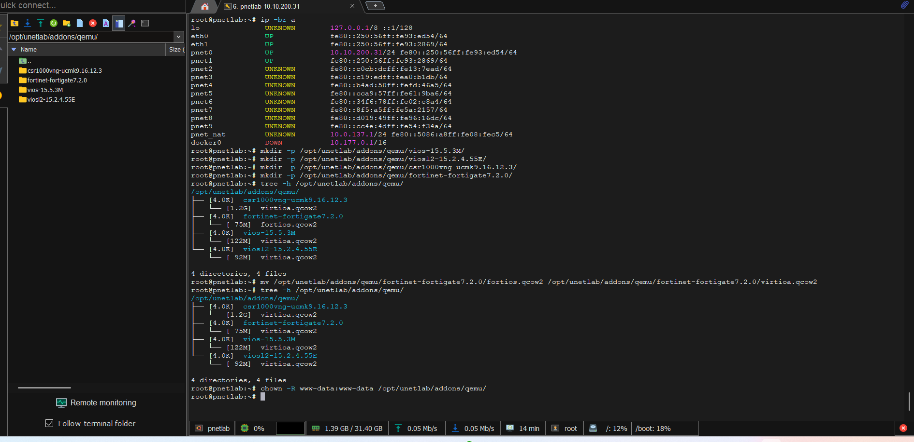

---

### 6. Tạo Lab Topology

Bài lab mẫu xây dựng topo đơn giản gồm 1 Linux VM — 1 Switch — 1 Router — 1 Firewall kết nối ra Internet qua Cloud0.

#### 6.1. Tạo Lab mới

1. Từ màn hình **Main** → click **+** (Add new lab) hoặc **New Lab**
2. Điền thông tin:
   - **Name:** `basic-internet-lab`
   - **Description:** VM - Switch - Router - Firewall - Internet
3. Click **Save** — canvas trống hiện ra

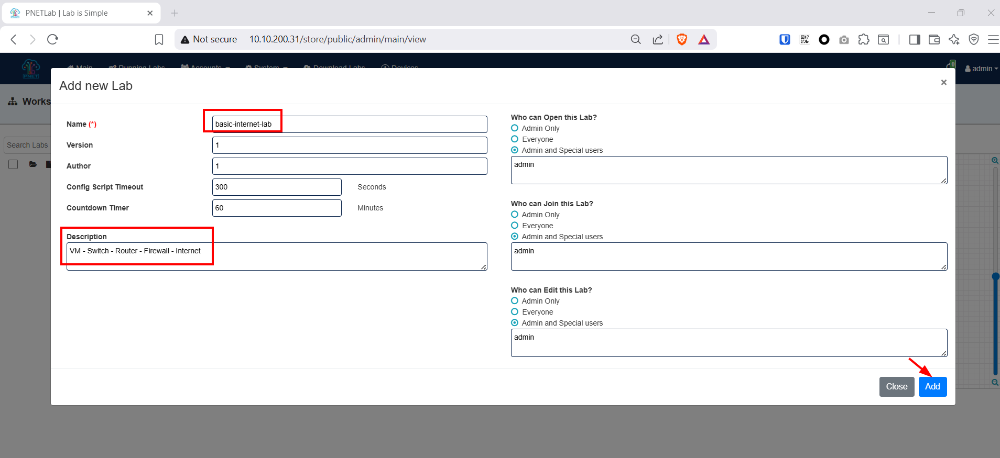

#### 6.2. Thêm Node vào Lab

**Chuột phải** trên canvas → **Add new object** → **Node**, thêm lần lượt 4 node:

| Node | Template | Image | vCPU | RAM |
|---|---|---|---|---|
| `ubuntu 20.04` | Linux | ubuntu 20.04 | 1 | 256 MB |
| `Switch` | Cisco vIOS L2 | `viosl2-15.2.4.55E` | 1 | 512 MB |
| `Router` | Cisco vIOS | `vios-15.5.3M` | 1 | 512 MB |
| `FortiGate` | fortinet | `fortinet-fortigate7.2.0` | **2** | **2048 MB** |

> **Lưu ý FortiGate:** Cấp **2 vCPU + 2048 MB RAM** để FortiOS 7.2 boot trong ~2–3 phút thay vì 5–8 phút. Với 1 vCPU / 1GB RAM, FortiGate sẽ boot rất chậm và có thể bị crash khi apply policy.

Sau khi thêm xong 4 node, canvas hiển thị đầy đủ topology. Click đúp vào node `ubuntu 20.04` để mở **HTML5 Console** — terminal hiện ra trực tiếp trong trình duyệt.

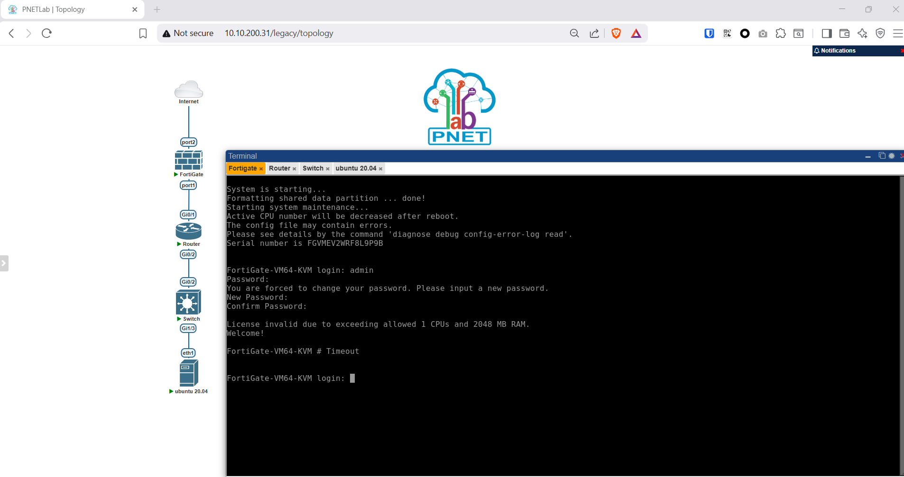

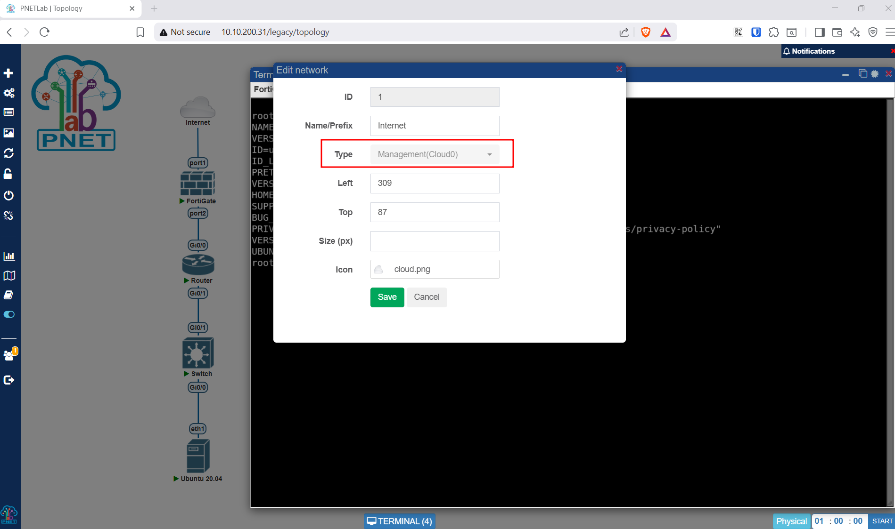

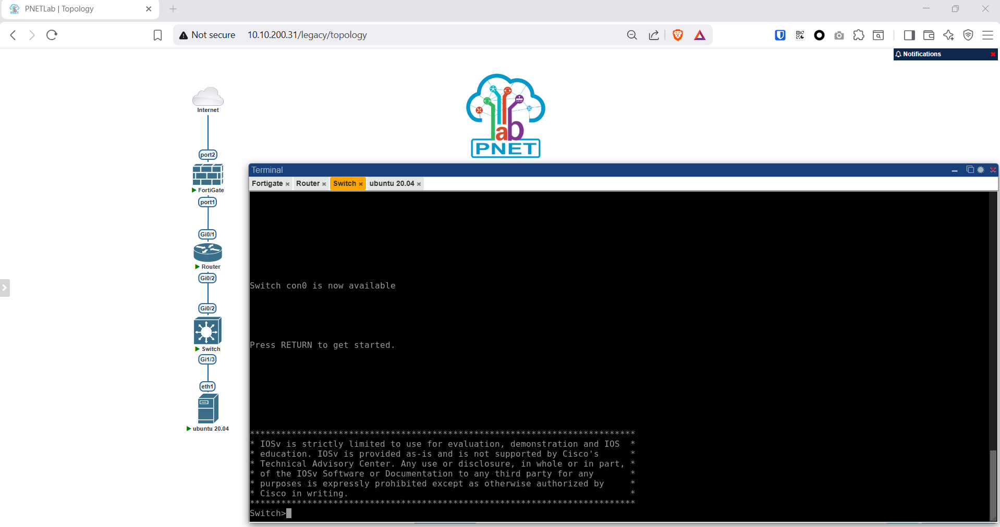

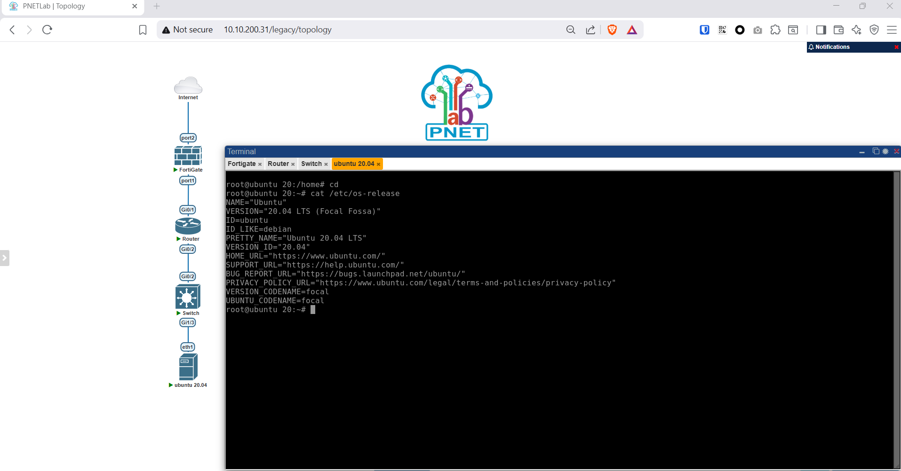


#### 6.3. Thêm Cloud0 (Internet)

1. **Chuột phải** trên canvas → **Add new object** → **Network**
2. Dialog **Edit network** hiện ra, điền thông tin:

   | Trường | Giá trị |
   |---|---|
   | **Name/Prefix** | `Internet` |
   | **Type** | `Management(Cloud0)` |
   | **Icon** | `cloud.png` |

3. Click **Save**

Cloud0 (đặt tên `Internet`) đại diện cho bridge `pnet0` của PNetLab — ánh xạ NIC vật lý `eth0` (ESXi: **Lab-vlan200**). Lưu lượng từ lab node qua Cloud0 đi ra mạng `10.10.200.0/24`, sau đó NAT ra Internet qua pfSense.

> **Lưu ý kiến trúc mạng:**
> - `pnet0` bridge `eth0` (vlan200) → 10.10.200.31/24 — kết nối quản lý + internet qua pfSense NAT
> - `pnet1`–`pnet9` bridge `eth1` (vlan201) và các virtual NIC — dùng cho lab segment nội bộ (host-only)
> - `pnet_nat` (10.0.137.1/24) — NAT interface nội bộ của PNetLab, cấp IP cho Docker node
>
> FortiGate `port2` (WAN) kết nối vào Cloud0 sẽ nhận IP DHCP từ dải `10.10.200.x`, gateway là pfSense.

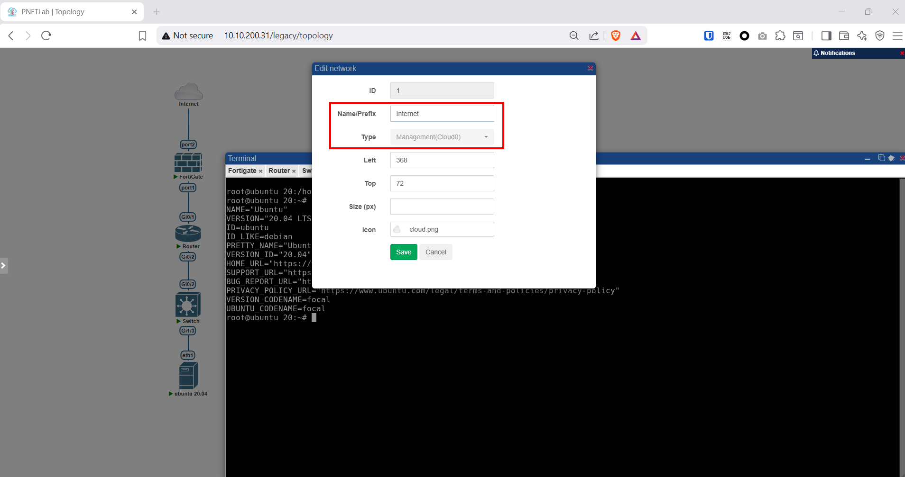

#### 6.4. Kết nối các Node

Kéo link giữa các interface theo sơ đồ:

| Từ | Interface | Đến | Interface |
|---|---|---|---|
| ubuntu 20.04 | eth1 | Switch | Gi1/3 |
| Switch | Gi0/2 | Router | Gi0/2 |
| Router | Gi0/1 | FortiGate | port1 |
| FortiGate | port2 | Internet (Cloud0) | — |


#### 6.5. Khởi động và cấu hình

Start tất cả node (**chuột phải** → **Start**), sau đó vào console từng thiết bị:

**FortiGate** (cấu hình WAN DHCP + NAT ra Internet):

```
FortiGate login: admin
Password: (Enter)

# Cấu hình port1 (LAN) — kết nối với Router Gi0/1
config system interface
    edit port1
        set mode static
        set ip 192.168.30.2 255.255.255.252
        set allowaccess ping
    next
end

# Cấu hình port2 (WAN) — DHCP từ Cloud0/pfSense
config system interface
    edit port2
        set mode dhcp
        set allowaccess ping
    next
end

# Kiểm tra IP WAN
get system interface physical | grep -A5 port2

# Bật NAT (firewall policy LAN → WAN)
config firewall policy
    edit 1
        set name "LAN-to-WAN"
        set srcintf "port1"
        set dstintf "port2"
        set srcaddr "all"
        set dstaddr "all"
        set action accept
        set nat enable
        set schedule "always"
        set service "ALL"
    next
end
```

**Router — vIOS L3** (IP + default route qua FortiGate):

```
Router# conf t
Router(config)# interface GigabitEthernet0/2
Router(config-if)#  ip address 192.168.20.1 255.255.255.0
Router(config-if)#  no shutdown
Router(config)# interface GigabitEthernet0/1
Router(config-if)#  ip address 192.168.30.1 255.255.255.252
Router(config-if)#  no shutdown
Router(config)# ip route 0.0.0.0 0.0.0.0 192.168.30.2
```

**Switch — vIOS L2** (VLAN + access port):

```
Switch# conf t
Switch(config)# vlan 10
Switch(config-vlan)# name CLIENT
Switch(config)# interface GigabitEthernet1/3
Switch(config-if)#  switchport mode access
Switch(config-if)#  switchport access vlan 10
Switch(config)# interface GigabitEthernet0/2
Switch(config-if)#  switchport mode access
Switch(config-if)#  switchport access vlan 10
```

**ubuntu 20.04** (IP tĩnh + default gateway + DNS):

```bash
# Cấu hình IP tĩnh trên eth1
sudo ip addr add 192.168.20.10/24 dev eth1
sudo ip link set eth1 up
sudo ip route add default via 192.168.20.1

# Cấu hình DNS
echo "nameserver 8.8.8.8" | sudo tee /etc/resolv.conf

# Kiểm tra
ping -c3 8.8.8.8
nslookup google.com
```

> **Lưu ý:** Cách trên chỉ tạm thời (mất sau reboot). Để cố định trên Ubuntu 20.04 dùng netplan:
> ```bash
> sudo nano /etc/netplan/00-installer-config.yaml
> # Thêm:
> # network:
> #   ethernets:
> #     eth1:
> #       addresses: [192.168.20.10/24]
> #       gateway4: 192.168.20.1
> #       nameservers:
> #         addresses: [8.8.8.8, 1.1.1.1]
> #   version: 2
> sudo netplan apply
> ```

**Kiểm tra Internet từ Router:**

```
Router# ping 8.8.8.8
!!!!!
Router# traceroute 8.8.8.8
```


---

### 7. Khởi động và truy cập Console

1. **Chuột phải vào node** → **Start** (hoặc chọn tất cả → Start all)
2. Đợi node khởi động (biểu tượng node chuyển sang màu xanh)
3. **Click đúp vào node** để mở Console

PNetLab hỗ trợ các kiểu console:
- **HTML5 Console** — Mở trực tiếp trong trình duyệt (khuyên dùng)
- **Telnet** — Dùng phần mềm như SecureCRT, Putty, v.v.
- **VNC** — Cho các node có giao diện đồ họa


#### Verify sau khi vào Console

**R1 — Cisco CSR1000v (IOS XE):**

```
! Kiểm tra platform và version
R1# show version
R1# show platform

! Kiểm tra interfaces
R1# show ip interface brief
R1# show interfaces GigabitEthernet1

! Kiểm tra routing
R1# show ip route
R1# show ip route summary

! Kiểm tra license (IOS XE)
R1# show license summary
R1# show license udi

! Kiểm tra tài nguyên
R1# show processes cpu sorted
R1# show processes memory sorted
```

**R2, R3 — Cisco IOSv (IOS):**

```
! Kiểm tra platform và version
R2# show version
R2# show inventory

! Kiểm tra interfaces
R2# show ip interface brief
R2# show interfaces GigabitEthernet0/0

! Kiểm tra routing
R2# show ip route
R2# show ip route summary

! Kiểm tra tài nguyên
R2# show processes cpu sorted
R2# show processes memory sorted
```

**Phân biệt IOS vs IOS XE:**

| Đặc điểm | IOSv (IOS) | CSR1000v (IOS XE) |
|---|---|---|
| Interface đầu tiên | `GigabitEthernet0/0` | `GigabitEthernet1` |
| Lệnh license | Không có | `show license summary` |
| `show platform` | Không có | Có |
| RAM mặc định | 512 MB | 3 GB |

---


### 8. Tích hợp Internet Access cho Lab Node

Để lab node truy cập internet (ví dụ download update), cần bridge interface của PNetLab với mạng vật lý:

1. Trên PNetLab server, kiểm tra bridge hiện tại:

```bash
brctl show
# Hoặc
ip link show type bridge
```

2. PNetLab tạo các bridge `pnet0`–`pnet9` tương ứng với NIC vật lý:

   | Bridge | NIC (ESXi) | Portgroup | Mục đích |
   |---|---|---|---|
   | `pnet0` | eth0 | Lab-vlan200 | Management + Internet (qua pfSense NAT) |
   | `pnet1`–`pnet9` | eth1 | Lab-vlan201 | Lab segment nội bộ (host-only) |
   | `pnet_nat` | — | — | NAT nội bộ cho Docker node (10.0.137.0/24) |

3. Trong Web UI, thêm **Network** type **Cloud0** (hoặc **Cloud1**) vào lab → kéo link từ router WAN interface vào Cloud.

4. Cấu hình IP tĩnh trên interface WAN của router trong lab, default gateway trỏ về gateway vật lý.


---

### 9. Lời kết

PNetLab là công cụ mạnh mẽ và linh hoạt cho việc học và lab mạng. Một số điểm nổi bật:

- **Miễn phí** cho cá nhân với đầy đủ tính năng cơ bản
- **Web-based** — Không cần cài đặt client, dùng được từ bất kỳ máy nào trong mạng
- **Multi-vendor** — Hỗ trợ hầu hết vendor phổ biến (Cisco, Juniper, MikroTik, Palo Alto, v.v.)
- **Docker node** — Thêm Linux container để lab routing protocol, BGP, v.v. mà không cần image Cisco

Sau khi nắm được cơ bản, bạn có thể mở rộng lab với các chủ đề nâng cao như **BGP full-mesh**, **MPLS/VPN**, **SD-WAN**, hoặc tích hợp với **Ansible/Python** để thực hành network automation.

---

*Tham khảo:*
- [PNetLab Official](https://pnetlab.com)
- [PNetLab Documentation](https://pnetlab.com/pages/documentation)
- [Cisco Image Compatibility](https://pnetlab.com/pages/store)
